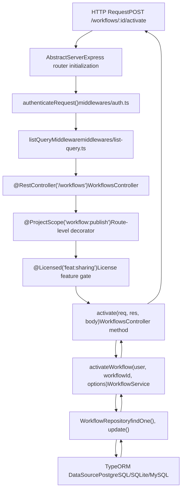
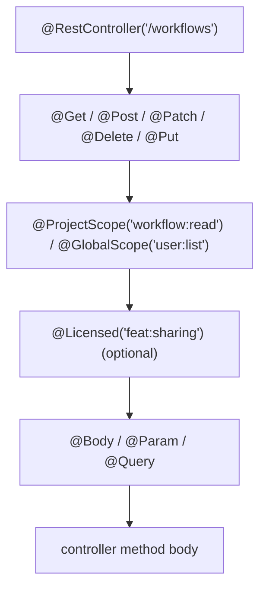
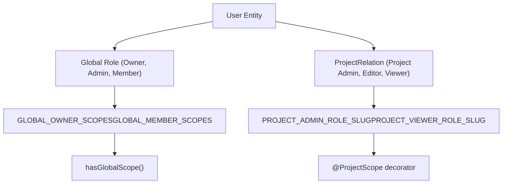

# API 与资源管理

相关源文件

-   [packages/@n8n/api-types/src/dto/auth/__tests__/resolve-signup-token-query.dto.test.ts](https://github.com/n8n-io/n8n/blob/88f170b9/packages/@n8n/api-types/src/dto/auth/__tests__/resolve-signup-token-query.dto.test.ts)
-   [packages/@n8n/api-types/src/dto/auth/resolve-signup-token-query.dto.ts](https://github.com/n8n-io/n8n/blob/88f170b9/packages/@n8n/api-types/src/dto/auth/resolve-signup-token-query.dto.ts)
-   [packages/@n8n/api-types/src/dto/invitation/__tests__/accept-invitation-request.dto.test.ts](https://github.com/n8n-io/n8n/blob/88f170b9/packages/@n8n/api-types/src/dto/invitation/__tests__/accept-invitation-request.dto.test.ts)
-   [packages/@n8n/api-types/src/dto/invitation/accept-invitation-request.dto.ts](https://github.com/n8n-io/n8n/blob/88f170b9/packages/@n8n/api-types/src/dto/invitation/accept-invitation-request.dto.ts)
-   [packages/@n8n/db/src/entities/execution-entity.ts](https://github.com/n8n-io/n8n/blob/88f170b9/packages/@n8n/db/src/entities/execution-entity.ts)
-   [packages/@n8n/db/src/migrations/common/1768557000000-AddStoredAtToExecutionEntity.ts](https://github.com/n8n-io/n8n/blob/88f170b9/packages/@n8n/db/src/migrations/common/1768557000000-AddStoredAtToExecutionEntity.ts)
-   [packages/@n8n/db/src/utils/test-utils/mock-entity-manager.ts](https://github.com/n8n-io/n8n/blob/88f170b9/packages/@n8n/db/src/utils/test-utils/mock-entity-manager.ts)
-   [packages/@n8n/db/src/utils/test-utils/mock-instance.ts](https://github.com/n8n-io/n8n/blob/88f170b9/packages/@n8n/db/src/utils/test-utils/mock-instance.ts)
-   [packages/@n8n/permissions/src/__tests__/__snapshots__/scope-information.test.ts.snap](https://github.com/n8n-io/n8n/blob/88f170b9/packages/@n8n/permissions/src/__tests__/__snapshots__/scope-information.test.ts.snap)
-   [packages/@n8n/permissions/src/constants.ee.ts](https://github.com/n8n-io/n8n/blob/88f170b9/packages/@n8n/permissions/src/constants.ee.ts)
-   [packages/@n8n/permissions/src/public-api-permissions.ee.ts](https://github.com/n8n-io/n8n/blob/88f170b9/packages/@n8n/permissions/src/public-api-permissions.ee.ts)
-   [packages/@n8n/permissions/src/roles/scopes/global-scopes.ee.ts](https://github.com/n8n-io/n8n/blob/88f170b9/packages/@n8n/permissions/src/roles/scopes/global-scopes.ee.ts)
-   [packages/@n8n/permissions/src/roles/scopes/project-scopes.ee.ts](https://github.com/n8n-io/n8n/blob/88f170b9/packages/@n8n/permissions/src/roles/scopes/project-scopes.ee.ts)
-   [packages/@n8n/permissions/src/roles/scopes/workflow-sharing-scopes.ee.ts](https://github.com/n8n-io/n8n/blob/88f170b9/packages/@n8n/permissions/src/roles/scopes/workflow-sharing-scopes.ee.ts)
-   [packages/@n8n/permissions/src/scope-information.ts](https://github.com/n8n-io/n8n/blob/88f170b9/packages/@n8n/permissions/src/scope-information.ts)
-   [packages/@n8n/permissions/src/utilities/__tests__/get-resource-permissions.test.ts](https://github.com/n8n-io/n8n/blob/88f170b9/packages/@n8n/permissions/src/utilities/__tests__/get-resource-permissions.test.ts)
-   [packages/cli/src/auth/handlers/__tests__/email.auth-handler.test.ts](https://github.com/n8n-io/n8n/blob/88f170b9/packages/cli/src/auth/handlers/__tests__/email.auth-handler.test.ts)
-   [packages/cli/src/auth/handlers/email.auth-handler.ts](https://github.com/n8n-io/n8n/blob/88f170b9/packages/cli/src/auth/handlers/email.auth-handler.ts)
-   [packages/cli/src/auth/jwt.ts](https://github.com/n8n-io/n8n/blob/88f170b9/packages/cli/src/auth/jwt.ts)
-   [packages/cli/src/commands/user-management/reset.ts](https://github.com/n8n-io/n8n/blob/88f170b9/packages/cli/src/commands/user-management/reset.ts)
-   [packages/cli/src/controllers/__tests__/auth.controller.test.ts](https://github.com/n8n-io/n8n/blob/88f170b9/packages/cli/src/controllers/__tests__/auth.controller.test.ts)
-   [packages/cli/src/controllers/__tests__/invitation.controller.test.ts](https://github.com/n8n-io/n8n/blob/88f170b9/packages/cli/src/controllers/__tests__/invitation.controller.test.ts)
-   [packages/cli/src/controllers/__tests__/me.controller.test.ts](https://github.com/n8n-io/n8n/blob/88f170b9/packages/cli/src/controllers/__tests__/me.controller.test.ts)
-   [packages/cli/src/controllers/auth.controller.ts](https://github.com/n8n-io/n8n/blob/88f170b9/packages/cli/src/controllers/auth.controller.ts)
-   [packages/cli/src/controllers/invitation.controller.ts](https://github.com/n8n-io/n8n/blob/88f170b9/packages/cli/src/controllers/invitation.controller.ts)
-   [packages/cli/src/controllers/me.controller.ts](https://github.com/n8n-io/n8n/blob/88f170b9/packages/cli/src/controllers/me.controller.ts)
-   [packages/cli/src/controllers/owner.controller.ts](https://github.com/n8n-io/n8n/blob/88f170b9/packages/cli/src/controllers/owner.controller.ts)
-   [packages/cli/src/controllers/users.controller.ts](https://github.com/n8n-io/n8n/blob/88f170b9/packages/cli/src/controllers/users.controller.ts)
-   [packages/cli/src/executions/__tests__/execution-redaction-proxy.service.test.ts](https://github.com/n8n-io/n8n/blob/88f170b9/packages/cli/src/executions/__tests__/execution-redaction-proxy.service.test.ts)
-   [packages/cli/src/executions/execution-redaction-proxy.service.ts](https://github.com/n8n-io/n8n/blob/88f170b9/packages/cli/src/executions/execution-redaction-proxy.service.ts)
-   [packages/cli/src/public-api/types.ts](https://github.com/n8n-io/n8n/blob/88f170b9/packages/cli/src/public-api/types.ts)
-   [packages/cli/src/public-api/v1/handlers/discover/__tests__/discover.handler.test.ts](https://github.com/n8n-io/n8n/blob/88f170b9/packages/cli/src/public-api/v1/handlers/discover/__tests__/discover.handler.test.ts)
-   [packages/cli/src/public-api/v1/handlers/discover/__tests__/discover.service.test.ts](https://github.com/n8n-io/n8n/blob/88f170b9/packages/cli/src/public-api/v1/handlers/discover/__tests__/discover.service.test.ts)
-   [packages/cli/src/public-api/v1/handlers/discover/discover.handler.ts](https://github.com/n8n-io/n8n/blob/88f170b9/packages/cli/src/public-api/v1/handlers/discover/discover.handler.ts)
-   [packages/cli/src/public-api/v1/handlers/discover/discover.service.ts](https://github.com/n8n-io/n8n/blob/88f170b9/packages/cli/src/public-api/v1/handlers/discover/discover.service.ts)
-   [packages/cli/src/public-api/v1/handlers/discover/spec/paths/discover.yml](https://github.com/n8n-io/n8n/blob/88f170b9/packages/cli/src/public-api/v1/handlers/discover/spec/paths/discover.yml)
-   [packages/cli/src/public-api/v1/handlers/executions/executions.handler.ts](https://github.com/n8n-io/n8n/blob/88f170b9/packages/cli/src/public-api/v1/handlers/executions/executions.handler.ts)
-   [packages/cli/src/public-api/v1/handlers/executions/spec/paths/executions.yml](https://github.com/n8n-io/n8n/blob/88f170b9/packages/cli/src/public-api/v1/handlers/executions/spec/paths/executions.yml)
-   [packages/cli/src/public-api/v1/handlers/executions/spec/schemas/execution.yml](https://github.com/n8n-io/n8n/blob/88f170b9/packages/cli/src/public-api/v1/handlers/executions/spec/schemas/execution.yml)
-   [packages/cli/src/public-api/v1/openapi.yml](https://github.com/n8n-io/n8n/blob/88f170b9/packages/cli/src/public-api/v1/openapi.yml)
-   [packages/cli/src/public-api/v1/shared/middlewares/global.middleware.ts](https://github.com/n8n-io/n8n/blob/88f170b9/packages/cli/src/public-api/v1/shared/middlewares/global.middleware.ts)
-   [packages/cli/src/public-api/v1/shared/spec/parameters/_index.yml](https://github.com/n8n-io/n8n/blob/88f170b9/packages/cli/src/public-api/v1/shared/spec/parameters/_index.yml)
-   [packages/cli/src/requests.ts](https://github.com/n8n-io/n8n/blob/88f170b9/packages/cli/src/requests.ts)
-   [packages/cli/src/services/__tests__/url.service.test.ts](https://github.com/n8n-io/n8n/blob/88f170b9/packages/cli/src/services/__tests__/url.service.test.ts)
-   [packages/cli/src/services/__tests__/user.service.test.ts](https://github.com/n8n-io/n8n/blob/88f170b9/packages/cli/src/services/__tests__/user.service.test.ts)
-   [packages/cli/src/services/jwt.service.ts](https://github.com/n8n-io/n8n/blob/88f170b9/packages/cli/src/services/jwt.service.ts)
-   [packages/cli/src/services/url.service.ts](https://github.com/n8n-io/n8n/blob/88f170b9/packages/cli/src/services/url.service.ts)
-   [packages/cli/src/services/user.service.ts](https://github.com/n8n-io/n8n/blob/88f170b9/packages/cli/src/services/user.service.ts)
-   [packages/cli/src/sso.ee/__tests__/sso-helpers.test.ts](https://github.com/n8n-io/n8n/blob/88f170b9/packages/cli/src/sso.ee/__tests__/sso-helpers.test.ts)
-   [packages/cli/src/sso.ee/sso-helpers.ts](https://github.com/n8n-io/n8n/blob/88f170b9/packages/cli/src/sso.ee/sso-helpers.ts)
-   [packages/cli/src/workflows/workflow-finder.service.ts](https://github.com/n8n-io/n8n/blob/88f170b9/packages/cli/src/workflows/workflow-finder.service.ts)
-   [packages/cli/test/integration/auth.api.test.ts](https://github.com/n8n-io/n8n/blob/88f170b9/packages/cli/test/integration/auth.api.test.ts)
-   [packages/cli/test/integration/auth.mw.test.ts](https://github.com/n8n-io/n8n/blob/88f170b9/packages/cli/test/integration/auth.mw.test.ts)
-   [packages/cli/test/integration/commands/reset.cmd.test.ts](https://github.com/n8n-io/n8n/blob/88f170b9/packages/cli/test/integration/commands/reset.cmd.test.ts)
-   [packages/cli/test/integration/me.api.test.ts](https://github.com/n8n-io/n8n/blob/88f170b9/packages/cli/test/integration/me.api.test.ts)
-   [packages/cli/test/integration/owner.api.test.ts](https://github.com/n8n-io/n8n/blob/88f170b9/packages/cli/test/integration/owner.api.test.ts)
-   [packages/cli/test/integration/public-api/discover.test.ts](https://github.com/n8n-io/n8n/blob/88f170b9/packages/cli/test/integration/public-api/discover.test.ts)
-   [packages/cli/test/integration/public-api/endpoints-with-scopes-enabled.test.ts](https://github.com/n8n-io/n8n/blob/88f170b9/packages/cli/test/integration/public-api/endpoints-with-scopes-enabled.test.ts)
-   [packages/cli/test/integration/public-api/executions.test.ts](https://github.com/n8n-io/n8n/blob/88f170b9/packages/cli/test/integration/public-api/executions.test.ts)
-   [packages/cli/test/integration/shared/constants.ts](https://github.com/n8n-io/n8n/blob/88f170b9/packages/cli/test/integration/shared/constants.ts)
-   [packages/cli/test/integration/users.api.test.ts](https://github.com/n8n-io/n8n/blob/88f170b9/packages/cli/test/integration/users.api.test.ts)
-   [packages/frontend/@n8n/rest-api-client/src/api/users.ts](https://github.com/n8n-io/n8n/blob/88f170b9/packages/frontend/@n8n/rest-api-client/src/api/users.ts)
-   [packages/frontend/editor-ui/src/app/stores/rbac.store.ts](https://github.com/n8n-io/n8n/blob/88f170b9/packages/frontend/editor-ui/src/app/stores/rbac.store.ts)
-   [packages/frontend/editor-ui/src/features/core/auth/views/SignupView.test.ts](https://github.com/n8n-io/n8n/blob/88f170b9/packages/frontend/editor-ui/src/features/core/auth/views/SignupView.test.ts)
-   [packages/frontend/editor-ui/src/features/core/auth/views/SignupView.vue](https://github.com/n8n-io/n8n/blob/88f170b9/packages/frontend/editor-ui/src/features/core/auth/views/SignupView.vue)
-   [packages/frontend/editor-ui/src/features/settings/users/__tests__/invitation.api.test.ts](https://github.com/n8n-io/n8n/blob/88f170b9/packages/frontend/editor-ui/src/features/settings/users/__tests__/invitation.api.test.ts)
-   [packages/frontend/editor-ui/src/features/settings/users/components/InviteUsersModal.vue](https://github.com/n8n-io/n8n/blob/88f170b9/packages/frontend/editor-ui/src/features/settings/users/components/InviteUsersModal.vue)
-   [packages/frontend/editor-ui/src/features/settings/users/invitation.api.ts](https://github.com/n8n-io/n8n/blob/88f170b9/packages/frontend/editor-ui/src/features/settings/users/invitation.api.ts)
-   [packages/frontend/editor-ui/src/features/settings/users/users.store.ts](https://github.com/n8n-io/n8n/blob/88f170b9/packages/frontend/editor-ui/src/features/settings/users/users.store.ts)
-   [packages/frontend/editor-ui/src/features/settings/users/views/SettingsUsersView.test.ts](https://github.com/n8n-io/n8n/blob/88f170b9/packages/frontend/editor-ui/src/features/settings/users/views/SettingsUsersView.test.ts)
-   [packages/frontend/editor-ui/src/features/settings/users/views/SettingsUsersView.vue](https://github.com/n8n-io/n8n/blob/88f170b9/packages/frontend/editor-ui/src/features/settings/users/views/SettingsUsersView.vue)
-   [packages/nodes-base/nodes/N8n/n8n-api-coverage.json](https://github.com/n8n-io/n8n/blob/88f170b9/packages/nodes-base/nodes/N8n/n8n-api-coverage.json)
-   [packages/nodes-base/nodes/N8n/test/N8n.api-coverage.test.ts](https://github.com/n8n-io/n8n/blob/88f170b9/packages/nodes-base/nodes/N8n/test/N8n.api-coverage.test.ts)
-   [packages/testing/playwright/services/public-api-helper.ts](https://github.com/n8n-io/n8n/blob/88f170b9/packages/testing/playwright/services/public-api-helper.ts)
-   [packages/testing/playwright/tests/e2e/api/discovery.spec.ts](https://github.com/n8n-io/n8n/blob/88f170b9/packages/testing/playwright/tests/e2e/api/discovery.spec.ts)

本文档涵盖了 n8n 中的 REST API 架构、资源管理模式以及身份验证/授权机制。它解释了 HTTP 请求是如何被处理的、工作流 (Workflows) 和凭据 (Credentials) 等资源是如何被管理的，以及访问控制是如何被强制执行的。

REST API 层几乎完全位于 `packages/cli/src/` 目录中。子页面涵盖了每个主要子系统：

| 页面 | 标题 | 主要文件 |
| --- | --- | --- |
| [工作流 API 与服务层](/n8n-io/n8n/3.1-workflows-api-and-service-layer) | 工作流 API 与服务层 | `workflows/workflows.controller.ts`, `workflows/workflow.service.ts` |
| [凭据 API 与安全](/n8n-io/n8n/3.2-credentials-api-and-security) | 凭据 API 与安全 | `credentials/credentials.controller.ts`, `credentials/credentials.service.ts` |
| [执行管理 API](/n8n-io/n8n/3.3-execution-management-api) | 执行管理 API | `executions/execution.service.ts`, `executions/execution.repository.ts` |
| [用户管理与身份验证](/n8n-io/n8n/3.4-user-management-and-authentication) | 用户管理与身份验证 | `controllers/users.controller.ts`, `controllers/auth.controller.ts` |
| [基于项目的授权与共享](/n8n-io/n8n/3.5-project-based-authorization-and-sharing) | 基于项目的授权与共享 | `services/project.service.ee.ts`, `@n8n/permissions` |
| [动态凭据与外部机密](/n8n-io/n8n/3.6-dynamic-credentials-and-external-secrets) | 外部机密提供者集成 | `external-secrets/` |
| [源码控制与环境管理](/n8n-io/n8n/3.7-source-control-and-environment-management) | 源码控制与环境管理 | `environments-ee/source-control/` |

有关工作流执行内部机制的信息，请参阅页面 [2](/n8n-io/n8n/2-workflow-execution-engine)。有关用户界面交互的信息，请参阅页面 [6](/n8n-io/n8n/6-user-interface)。

---

## API 架构概览

n8n API 是使用 Express.js 构建的，遵循控制器-服务-仓库 (Controller-Service-Repository) 模式。控制器 (Controllers) 处理 HTTP 请求，服务 (Services) 包含业务逻辑，仓库 (Repositories) 管理数据库操作。

### REST API 请求流

**通过装饰器和服务层的 REST API 请求流**

来源：[packages/cli/src/workflows/workflows.controller.ts448-480](https://github.com/n8n-io/n8n/blob/88f170b9/packages/cli/src/workflows/workflows.controller.ts#L448-L480) [packages/cli/src/workflows/workflow.service.ts621-750](https://github.com/n8n-io/n8n/blob/88f170b9/packages/cli/src/workflows/workflow.service.ts#L621-L750) [packages/cli/src/middlewares/auth.ts](https://github.com/n8n-io/n8n/blob/88f170b9/packages/cli/src/middlewares/auth.ts) [packages/cli/src/middlewares/list-query.ts](https://github.com/n8n-io/n8n/blob/88f170b9/packages/cli/src/middlewares/list-query.ts)

### 控制器架构

控制器使用来自 `@n8n/decorators` 的装饰器定义，并遵循一致的模式：

**典型控制器方法上的装饰器栈**

-   `@RestController('/workflows')` — 注册 Express 路由前缀 [packages/cli/src/workflows/workflows.controller.ts75](https://github.com/n8n-io/n8n/blob/88f170b9/packages/cli/src/workflows/workflows.controller.ts#L75-L75)
-   `@Get`, `@Post`, `@Patch`, `@Delete` — HTTP 方法和子路径 [packages/cli/src/controllers/users.controller.ts110](https://github.com/n8n-io/n8n/blob/88f170b9/packages/cli/src/controllers/users.controller.ts#L110-L110)
-   `@ProjectScope('workflow:read')` — 强制执行每个资源的 Scope (作用域) 检查
-   `@GlobalScope('user:list')` — 强制执行实例范围的 Scope 检查 [packages/cli/src/controllers/users.controller.ts111](https://github.com/n8n-io/n8n/blob/88f170b9/packages/cli/src/controllers/users.controller.ts#L111-L111)
-   `@Licensed('feat:sharing')` — 通过许可证功能标志限制路由访问 [packages/cli/src/controllers/users.controller.ts29](https://github.com/n8n-io/n8n/blob/88f170b9/packages/cli/src/controllers/users.controller.ts#L29-L29)
-   `@Body`, `@Param`, `@Query` — 通过 class-validator / Zod 绑定并验证 DTO 参数 [packages/cli/src/controllers/users.controller.ts115](https://github.com/n8n-io/n8n/blob/88f170b9/packages/cli/src/controllers/users.controller.ts#L115-L115)

来源：[packages/cli/src/workflows/workflows.controller.ts75-101](https://github.com/n8n-io/n8n/blob/88f170b9/packages/cli/src/workflows/workflows.controller.ts#L75-L101) [packages/cli/src/controllers/users.controller.ts110-116](https://github.com/n8n-io/n8n/blob/88f170b9/packages/cli/src/controllers/users.controller.ts#L110-L116) [packages/cli/src/controllers/auth.controller.ts53-67](https://github.com/n8n-io/n8n/blob/88f170b9/packages/cli/src/controllers/auth.controller.ts#L53-L67)

### 请求类型系统

`requests.ts` 文件为所有 API 端点定义了强类型请求接口：

| 请求类型 | 用途 | 关键属性 |
| --- | --- | --- |
| `AuthenticatedRequest` | 已身份验证端点的基类 | `user: User`, `authInfo` [packages/cli/src/requests.ts4-10](https://github.com/n8n-io/n8n/blob/88f170b9/packages/cli/src/requests.ts#L4-L10) |
| `AuthlessRequest` | 未身份验证端点 | 无用户上下文 [packages/cli/src/requests.ts24-29](https://github.com/n8n-io/n8n/blob/88f170b9/packages/cli/src/requests.ts#L24-L29) |
| `ListQuery.Request` | 带有过滤功能的列表端点 | `listQueryOptions: Options` [packages/cli/src/requests.ts32-34](https://github.com/n8n-io/n8n/blob/88f170b9/packages/cli/src/requests.ts#L32-L34) |
| `CredentialRequest.*` | 凭据操作 | 凭据特定参数 [packages/cli/src/requests.ts67-112](https://github.com/n8n-io/n8n/blob/88f170b9/packages/cli/src/requests.ts#L67-L112) |
| `UserRequest.*` | 用户管理 | 用户特定参数 [packages/cli/src/requests.ts126-153](https://github.com/n8n-io/n8n/blob/88f170b9/packages/cli/src/requests.ts#L126-L153) |

来源：[packages/cli/src/requests.ts1-172](https://github.com/n8n-io/n8n/blob/88f170b9/packages/cli/src/requests.ts#L1-L172)

---

## 工作流资源管理

工作流通过 `WorkflowsController` 和 `WorkflowService` 进行管理。详情请参阅 [工作流 API 与服务层](/n8n-io/n8n/3.1-workflows-api-and-service-layer)。

### 工作流 API 端点

-   **CRUD 操作**：通过 `POST /workflows`, `GET /workflows/:id`, `PATCH /workflows/:id`, 和 `DELETE /workflows/:id` 处理。
-   **生命周期**：激活 (Activation) 和停用 (Deactivation) 端点管理 `active` 状态并在 `ActiveWorkflowManager` 中注册触发器。
-   **共享**：工作流可以使用 `@Licensed('feat:sharing')` 系统与项目共享。

来源：[packages/cli/src/workflows/workflows.controller.ts87-700](https://github.com/n8n-io/n8n/blob/88f170b9/packages/cli/src/workflows/workflows.controller.ts#L87-L700) [packages/cli/src/requests.ts57-61](https://github.com/n8n-io/n8n/blob/88f170b9/packages/cli/src/requests.ts#L57-L61)

---

## 凭据资源管理

凭据涉及静态加密的敏感数据。详情请参阅 [凭据 API 与安全](/n8n-io/n8n/3.2-credentials-api-and-security) 和 [动态凭据与外部机密](/n8n-io/n8n/3.6-dynamic-credentials-and-external-secrets)。

### 凭据 API 端点

-   **加密**：数据仅在执行或显示（脱敏）需要时才被解密。[packages/cli/src/requests.ts19-22](https://github.com/n8n-io/n8n/blob/88f170b9/packages/cli/src/requests.ts#L19-L22)
-   **测试**：`POST /credentials/test` 允许验证凭据连通性。[packages/cli/src/requests.ts96](https://github.com/n8n-io/n8n/blob/88f170b9/packages/cli/src/requests.ts#L96-L96)
-   **OAuth**：特定控制器处理 OAuth1/2 回调流程。[packages/cli/src/requests.ts177-194](https://github.com/n8n-io/n8n/blob/88f170b9/packages/cli/src/requests.ts#L177-L194)

来源：[packages/cli/src/requests.ts67-112](https://github.com/n8n-io/n8n/blob/88f170b9/packages/cli/src/requests.ts#L67-L112) [packages/cli/src/requests.ts177-194](https://github.com/n8n-io/n8n/blob/88f170b9/packages/cli/src/requests.ts#L177-L194)

---

## 用户管理与身份验证

n8n 支持多种身份验证方法，包括本地电子邮件/密码、LDAP、SAML 和 OIDC。详情请参阅 [用户管理与身份验证](/n8n-io/n8n/3.4-user-management-and-authentication)。

### 身份验证流

**身份验证与 MFA 验证**

> **[Mermaid sequence]**
> *(图表结构无法解析)*

来源：[packages/cli/src/controllers/auth.controller.ts53-107](https://github.com/n8n-io/n8n/blob/88f170b9/packages/cli/src/controllers/auth.controller.ts#L53-L107) [packages/cli/src/controllers/auth.controller.ts159-181](https://github.com/n8n-io/n8n/blob/88f170b9/packages/cli/src/controllers/auth.controller.ts#L159-L181)

### 用户生命周期与邀请

-   **邀请**：通过 `InvitationController` 处理。管理员生成令牌或发送电子邮件。[packages/cli/src/controllers/invitation.controller.ts42-90](https://github.com/n8n-io/n8n/blob/88f170b9/packages/cli/src/controllers/invitation.controller.ts#L42-L90)
-   **个人资料管理**：用户通过 `MeController` 更新自己的数据。[packages/cli/src/controllers/me.controller.ts44-109](https://github.com/n8n-io/n8n/blob/88f170b9/packages/cli/src/controllers/me.controller.ts#L44-L109)
-   **SSO 限制**：通过 LDAP/OIDC 身份验证的用户被限制在 n8n 中更改个人资料信息（电子邮件/姓名）。[packages/cli/src/controllers/me.controller.ts63-79](https://github.com/n8n-io/n8n/blob/88f170b9/packages/cli/src/controllers/me.controller.ts#L63-L79)

来源：[packages/cli/src/controllers/users.controller.ts53-397](https://github.com/n8n-io/n8n/blob/88f170b9/packages/cli/src/controllers/users.controller.ts#L53-L397) [packages/cli/src/controllers/me.controller.ts29-297](https://github.com/n8n-io/n8n/blob/88f170b9/packages/cli/src/controllers/me.controller.ts#L29-L297) [packages/cli/src/services/user.service.ts103-135](https://github.com/n8n-io/n8n/blob/88f170b9/packages/cli/src/services/user.service.ts#L103-L135)

---

## 基于项目的授权

n8n 使用基于 Scope (作用域) 的权限系统。详情请参阅 [基于项目的授权与共享](/n8n-io/n8n/3.5-project-based-authorization-and-sharing)。

### Scope 系统

Scope 为每个资源和操作定义（例如 `workflow:read`, `user:create`）。

| 资源 | 默认操作 | EE / 特殊操作 |
| --- | --- | --- |
| `workflow` | `create`, `read`, `update`, `delete`, `list` | `share`, `execute`, `move`, `activate`, `publish` |
| `credential` | `create`, `read`, `update`, `delete`, `list` | `share`, `shareGlobally`, `move` |
| `user` | `create`, `read`, `update`, `delete`, `list` | `resetPassword`, `changeRole`, `generateInviteLink` |

来源：[packages/@n8n/permissions/src/constants.ee.ts3-63](https://github.com/n8n-io/n8n/blob/88f170b9/packages/@n8n/permissions/src/constants.ee.ts#L3-L63) [packages/@n8n/permissions/src/roles/scopes/global-scopes.ee.ts3-135](https://github.com/n8n-io/n8n/blob/88f170b9/packages/@n8n/permissions/src/roles/scopes/global-scopes.ee.ts#L3-L135)

### 全局与项目 Scope

**权限层级与代码实体**

来源：[packages/@n8n/permissions/src/roles/scopes/global-scopes.ee.ts3-176](https://github.com/n8n-io/n8n/blob/88f170b9/packages/@n8n/permissions/src/roles/scopes/global-scopes.ee.ts#L3-L176) [packages/@n8n/permissions/src/constants.ee.ts81-85](https://github.com/n8n-io/n8n/blob/88f170b9/packages/@n8n/permissions/src/constants.ee.ts#L81-L85) [packages/cli/src/controllers/users.controller.ts35](https://github.com/n8n-io/n8n/blob/88f170b9/packages/cli/src/controllers/users.controller.ts#L35-L35)

---

## 执行与资源生命周期

-   **执行管理**：检索和删除执行历史。详情请参阅 [执行管理 API](/n8n-io/n8n/3.3-execution-management-api)。
-   **源码控制**：与 Git 集成用于工作流版本控制。详情请参阅 [源码控制与环境管理](/n8n-io/n8n/3.7-source-control-and-environment-management)。
-   **外部机密**：从 Vault 或 AWS 等提供者动态解析凭据值。详情请参阅 [动态凭据与外部机密](/n8n-io/n8n/3.6-dynamic-credentials-and-external-secrets)。

来源：[packages/@n8n/permissions/src/constants.ee.ts52](https://github.com/n8n-io/n8n/blob/88f170b9/packages/@n8n/permissions/src/constants.ee.ts#L52-L52) [packages/@n8n/permissions/src/constants.ee.ts22](https://github.com/n8n-io/n8n/blob/88f170b9/packages/@n8n/permissions/src/constants.ee.ts#L22-L22) [packages/@n8n/permissions/src/constants.ee.ts11-12](https://github.com/n8n-io/n8n/blob/88f170b9/packages/@n8n/permissions/src/constants.ee.ts#L11-L12)
