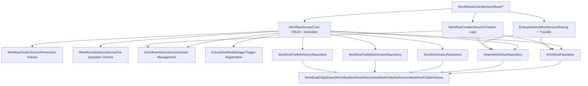
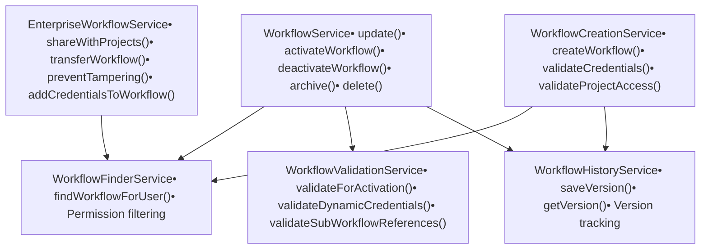
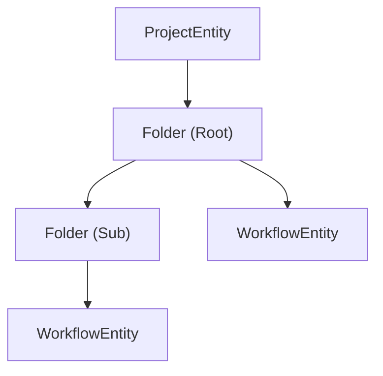

# 工作流 API 与服务层

相关源文件

-   [packages/@n8n/api-types/src/dto/folders/__tests__/list-folder-query.dto.test.ts](https://github.com/n8n-io/n8n/blob/88f170b9/packages/@n8n/api-types/src/dto/folders/__tests__/list-folder-query.dto.test.ts)
-   [packages/@n8n/api-types/src/dto/folders/__tests__/update-folder.request.dto.test.ts](https://github.com/n8n-io/n8n/blob/88f170b9/packages/@n8n/api-types/src/dto/folders/__tests__/update-folder.request.dto.test.ts)
-   [packages/@n8n/api-types/src/dto/folders/create-folder.dto.ts](https://github.com/n8n-io/n8n/blob/88f170b9/packages/@n8n/api-types/src/dto/folders/create-folder.dto.ts)
-   [packages/@n8n/api-types/src/dto/folders/delete-folder.dto.ts](https://github.com/n8n-io/n8n/blob/88f170b9/packages/@n8n/api-types/src/dto/folders/delete-folder.dto.ts)
-   [packages/@n8n/api-types/src/dto/folders/list-folder-query.dto.ts](https://github.com/n8n-io/n8n/blob/88f170b9/packages/@n8n/api-types/src/dto/folders/list-folder-query.dto.ts)
-   [packages/@n8n/api-types/src/dto/folders/update-folder.dto.ts](https://github.com/n8n-io/n8n/blob/88f170b9/packages/@n8n/api-types/src/dto/folders/update-folder.dto.ts)
-   [packages/@n8n/api-types/src/schemas/__tests__/folder.schema.test.ts](https://github.com/n8n-io/n8n/blob/88f170b9/packages/@n8n/api-types/src/schemas/__tests__/folder.schema.test.ts)
-   [packages/@n8n/api-types/src/schemas/credential-resolver.schema.ts](https://github.com/n8n-io/n8n/blob/88f170b9/packages/@n8n/api-types/src/schemas/credential-resolver.schema.ts)
-   [packages/@n8n/api-types/src/schemas/folder.schema.ts](https://github.com/n8n-io/n8n/blob/88f170b9/packages/@n8n/api-types/src/schemas/folder.schema.ts)
-   [packages/@n8n/config/src/configs/logging.config.ts](https://github.com/n8n-io/n8n/blob/88f170b9/packages/@n8n/config/src/configs/logging.config.ts)
-   [packages/@n8n/config/src/custom-types.ts](https://github.com/n8n-io/n8n/blob/88f170b9/packages/@n8n/config/src/custom-types.ts)
-   [packages/@n8n/config/test/custom-types.test.ts](https://github.com/n8n-io/n8n/blob/88f170b9/packages/@n8n/config/test/custom-types.test.ts)
-   [packages/@n8n/db/src/entities/workflow-published-version.ts](https://github.com/n8n-io/n8n/blob/88f170b9/packages/@n8n/db/src/entities/workflow-published-version.ts)
-   [packages/@n8n/db/src/migrations/common/1772619247762-ChangeWorkflowPublishedVersionFKsToRestrict.ts](https://github.com/n8n-io/n8n/blob/88f170b9/packages/@n8n/db/src/migrations/common/1772619247762-ChangeWorkflowPublishedVersionFKsToRestrict.ts)
-   [packages/@n8n/db/src/repositories/__tests__/workflow.repository.test.ts](https://github.com/n8n-io/n8n/blob/88f170b9/packages/@n8n/db/src/repositories/__tests__/workflow.repository.test.ts)
-   [packages/@n8n/db/src/repositories/folder-tag-mapping.repository.ts](https://github.com/n8n-io/n8n/blob/88f170b9/packages/@n8n/db/src/repositories/folder-tag-mapping.repository.ts)
-   [packages/@n8n/db/src/repositories/folder.repository.ts](https://github.com/n8n-io/n8n/blob/88f170b9/packages/@n8n/db/src/repositories/folder.repository.ts)
-   [packages/@n8n/db/src/repositories/invalid-auth-token.repository.ts](https://github.com/n8n-io/n8n/blob/88f170b9/packages/@n8n/db/src/repositories/invalid-auth-token.repository.ts)
-   [packages/@n8n/db/src/repositories/processed-data.repository.ts](https://github.com/n8n-io/n8n/blob/88f170b9/packages/@n8n/db/src/repositories/processed-data.repository.ts)
-   [packages/@n8n/db/src/repositories/workflow-published-version.repository.ts](https://github.com/n8n-io/n8n/blob/88f170b9/packages/@n8n/db/src/repositories/workflow-published-version.repository.ts)
-   [packages/@n8n/db/src/repositories/workflow.repository.ts](https://github.com/n8n-io/n8n/blob/88f170b9/packages/@n8n/db/src/repositories/workflow.repository.ts)
-   [packages/cli/src/__tests__/active-workflow-manager.test.ts](https://github.com/n8n-io/n8n/blob/88f170b9/packages/cli/src/__tests__/active-workflow-manager.test.ts)
-   [packages/cli/src/__tests__/utils.test.ts](https://github.com/n8n-io/n8n/blob/88f170b9/packages/cli/src/__tests__/utils.test.ts)
-   [packages/cli/src/__tests__/workflow-helpers.test.ts](https://github.com/n8n-io/n8n/blob/88f170b9/packages/cli/src/__tests__/workflow-helpers.test.ts)
-   [packages/cli/src/active-workflow-manager.ts](https://github.com/n8n-io/n8n/blob/88f170b9/packages/cli/src/active-workflow-manager.ts)
-   [packages/cli/src/controllers/folder.controller.ts](https://github.com/n8n-io/n8n/blob/88f170b9/packages/cli/src/controllers/folder.controller.ts)
-   [packages/cli/src/errors/workflow-missing-id.error.ts](https://github.com/n8n-io/n8n/blob/88f170b9/packages/cli/src/errors/workflow-missing-id.error.ts)
-   [packages/cli/src/modules/dynamic-credentials.ee/credential-resolvers.controller.ts](https://github.com/n8n-io/n8n/blob/88f170b9/packages/cli/src/modules/dynamic-credentials.ee/credential-resolvers.controller.ts)
-   [packages/cli/src/modules/dynamic-credentials.ee/services/__tests__/credential-resolver.service.test.ts](https://github.com/n8n-io/n8n/blob/88f170b9/packages/cli/src/modules/dynamic-credentials.ee/services/__tests__/credential-resolver.service.test.ts)
-   [packages/cli/src/modules/dynamic-credentials.ee/services/credential-resolver.service.ts](https://github.com/n8n-io/n8n/blob/88f170b9/packages/cli/src/modules/dynamic-credentials.ee/services/credential-resolver.service.ts)
-   [packages/cli/src/public-api/v1/handlers/workflows/workflows.handler.ts](https://github.com/n8n-io/n8n/blob/88f170b9/packages/cli/src/public-api/v1/handlers/workflows/workflows.handler.ts)
-   [packages/cli/src/scaling/__tests__/multi-main-setup.ee.test.ts](https://github.com/n8n-io/n8n/blob/88f170b9/packages/cli/src/scaling/__tests__/multi-main-setup.ee.test.ts)
-   [packages/cli/src/scaling/multi-main-setup.ee.ts](https://github.com/n8n-io/n8n/blob/88f170b9/packages/cli/src/scaling/multi-main-setup.ee.ts)
-   [packages/cli/src/services/__tests__/credentials-tester.service.test.ts](https://github.com/n8n-io/n8n/blob/88f170b9/packages/cli/src/services/__tests__/credentials-tester.service.test.ts)
-   [packages/cli/src/services/cache/__tests__/cache-mock.service.test.ts](https://github.com/n8n-io/n8n/blob/88f170b9/packages/cli/src/services/cache/__tests__/cache-mock.service.test.ts)
-   [packages/cli/src/services/cache/__tests__/cache.service.test.ts](https://github.com/n8n-io/n8n/blob/88f170b9/packages/cli/src/services/cache/__tests__/cache.service.test.ts)
-   [packages/cli/src/services/cache/cache.constants.ts](https://github.com/n8n-io/n8n/blob/88f170b9/packages/cli/src/services/cache/cache.constants.ts)
-   [packages/cli/src/services/cache/cache.service.ts](https://github.com/n8n-io/n8n/blob/88f170b9/packages/cli/src/services/cache/cache.service.ts)
-   [packages/cli/src/services/credentials-tester.service.ts](https://github.com/n8n-io/n8n/blob/88f170b9/packages/cli/src/services/credentials-tester.service.ts)
-   [packages/cli/src/services/folder.service.ts](https://github.com/n8n-io/n8n/blob/88f170b9/packages/cli/src/services/folder.service.ts)
-   [packages/cli/src/utils.ts](https://github.com/n8n-io/n8n/blob/88f170b9/packages/cli/src/utils.ts)
-   [packages/cli/src/webhooks/__tests__/test-webhook-registrations.service.test.ts](https://github.com/n8n-io/n8n/blob/88f170b9/packages/cli/src/webhooks/__tests__/test-webhook-registrations.service.test.ts)
-   [packages/cli/src/webhooks/__tests__/test-webhooks.test.ts](https://github.com/n8n-io/n8n/blob/88f170b9/packages/cli/src/webhooks/__tests__/test-webhooks.test.ts)
-   [packages/cli/src/webhooks/test-webhook-registrations.service.ts](https://github.com/n8n-io/n8n/blob/88f170b9/packages/cli/src/webhooks/test-webhook-registrations.service.ts)
-   [packages/cli/src/webhooks/test-webhooks.ts](https://github.com/n8n-io/n8n/blob/88f170b9/packages/cli/src/webhooks/test-webhooks.ts)
-   [packages/cli/src/workflow-helpers.ts](https://github.com/n8n-io/n8n/blob/88f170b9/packages/cli/src/workflow-helpers.ts)
-   [packages/cli/src/workflows/__tests__/workflow-creation.service.test.ts](https://github.com/n8n-io/n8n/blob/88f170b9/packages/cli/src/workflows/__tests__/workflow-creation.service.test.ts)
-   [packages/cli/src/workflows/__tests__/workflow.service.test.ts](https://github.com/n8n-io/n8n/blob/88f170b9/packages/cli/src/workflows/__tests__/workflow.service.test.ts)
-   [packages/cli/src/workflows/__tests__/workflows.controller.test.ts](https://github.com/n8n-io/n8n/blob/88f170b9/packages/cli/src/workflows/__tests__/workflows.controller.test.ts)
-   [packages/cli/src/workflows/workflow-creation.service.ts](https://github.com/n8n-io/n8n/blob/88f170b9/packages/cli/src/workflows/workflow-creation.service.ts)
-   [packages/cli/src/workflows/workflow.service.ee.ts](https://github.com/n8n-io/n8n/blob/88f170b9/packages/cli/src/workflows/workflow.service.ee.ts)
-   [packages/cli/src/workflows/workflow.service.ts](https://github.com/n8n-io/n8n/blob/88f170b9/packages/cli/src/workflows/workflow.service.ts)
-   [packages/cli/src/workflows/workflows.controller.ts](https://github.com/n8n-io/n8n/blob/88f170b9/packages/cli/src/workflows/workflows.controller.ts)
-   [packages/cli/test/integration/active-workflow-manager.test.ts](https://github.com/n8n-io/n8n/blob/88f170b9/packages/cli/test/integration/active-workflow-manager.test.ts)
-   [packages/cli/test/integration/folder/folder.controller.test.ts](https://github.com/n8n-io/n8n/blob/88f170b9/packages/cli/test/integration/folder/folder.controller.test.ts)
-   [packages/cli/test/integration/public-api/workflows.test.ts](https://github.com/n8n-io/n8n/blob/88f170b9/packages/cli/test/integration/public-api/workflows.test.ts)
-   [packages/cli/test/integration/shared/db/folders.ts](https://github.com/n8n-io/n8n/blob/88f170b9/packages/cli/test/integration/shared/db/folders.ts)
-   [packages/cli/test/integration/shared/utils/index.ts](https://github.com/n8n-io/n8n/blob/88f170b9/packages/cli/test/integration/shared/utils/index.ts)
-   [packages/cli/test/integration/workflows/workflow.service.test.ts](https://github.com/n8n-io/n8n/blob/88f170b9/packages/cli/test/integration/workflows/workflow.service.test.ts)
-   [packages/cli/test/integration/workflows/workflows.controller.ee.test.ts](https://github.com/n8n-io/n8n/blob/88f170b9/packages/cli/test/integration/workflows/workflows.controller.ee.test.ts)
-   [packages/cli/test/integration/workflows/workflows.controller.test.ts](https://github.com/n8n-io/n8n/blob/88f170b9/packages/cli/test/integration/workflows/workflows.controller.test.ts)
-   [packages/frontend/@n8n/design-system/src/css/message-box.scss](https://github.com/n8n-io/n8n/blob/88f170b9/packages/frontend/@n8n/design-system/src/css/message-box.scss)
-   [packages/frontend/@n8n/rest-api-client/src/api/credentialResolvers.ts](https://github.com/n8n-io/n8n/blob/88f170b9/packages/frontend/@n8n/rest-api-client/src/api/credentialResolvers.ts)
-   [packages/frontend/editor-ui/src/app/api/workflows.test.ts](https://github.com/n8n-io/n8n/blob/88f170b9/packages/frontend/editor-ui/src/app/api/workflows.test.ts)
-   [packages/frontend/editor-ui/src/app/components/WorkflowSettings.test.ts](https://github.com/n8n-io/n8n/blob/88f170b9/packages/frontend/editor-ui/src/app/components/WorkflowSettings.test.ts)
-   [packages/frontend/editor-ui/src/app/components/WorkflowSettings.vue](https://github.com/n8n-io/n8n/blob/88f170b9/packages/frontend/editor-ui/src/app/components/WorkflowSettings.vue)
-   [packages/frontend/editor-ui/src/features/resolvers/ResolversView.test.ts](https://github.com/n8n-io/n8n/blob/88f170b9/packages/frontend/editor-ui/src/features/resolvers/ResolversView.test.ts)
-   [packages/frontend/editor-ui/src/features/resolvers/composables/useCredentialResolvers.test.ts](https://github.com/n8n-io/n8n/blob/88f170b9/packages/frontend/editor-ui/src/features/resolvers/composables/useCredentialResolvers.test.ts)
-   [packages/frontend/editor-ui/src/features/resolvers/composables/useCredentialResolvers.ts](https://github.com/n8n-io/n8n/blob/88f170b9/packages/frontend/editor-ui/src/features/resolvers/composables/useCredentialResolvers.ts)
-   [packages/testing/playwright/helpers/NodeParameterHelper.ts](https://github.com/n8n-io/n8n/blob/88f170b9/packages/testing/playwright/helpers/NodeParameterHelper.ts)
-   [packages/testing/playwright/services/webhook-api-helper.ts](https://github.com/n8n-io/n8n/blob/88f170b9/packages/testing/playwright/services/webhook-api-helper.ts)
-   [packages/testing/playwright/tests/e2e/api/webhook-external.spec.ts](https://github.com/n8n-io/n8n/blob/88f170b9/packages/testing/playwright/tests/e2e/api/webhook-external.spec.ts)
-   [packages/testing/playwright/tests/e2e/nodes/webhook.spec.ts](https://github.com/n8n-io/n8n/blob/88f170b9/packages/testing/playwright/tests/e2e/nodes/webhook.spec.ts)

本文档涵盖了 n8n 中用于工作流管理的 REST API 端点、服务层架构和业务逻辑。这包括 CRUD 操作、工作流激活/停用、共享、版本控制和验证。有关工作流执行机制，请参阅 [2.1](https://github.com/n8n-io/n8n/blob/88f170b9/2.1)。有关基于项目的授权详情，请参阅 [3.5](https://github.com/n8n-io/n8n/blob/88f170b9/3.5)。

---

## 架构概览

工作流 API 与服务层遵循三层架构：控制器 (Controllers) 处理 HTTP 请求，服务 (Services) 实现业务逻辑，仓库 (Repositories) 管理数据持久化。

**系统架构：从 API 到数据库流**

**来源**：[packages/cli/src/workflows/workflows.controller.ts65-85](https://github.com/n8n-io/n8n/blob/88f170b9/packages/cli/src/workflows/workflows.controller.ts#L65-L85) [packages/cli/src/workflows/workflow.service.ts72-98](https://github.com/n8n-io/n8n/blob/88f170b9/packages/cli/src/workflows/workflow.service.ts#L72-L98) [packages/cli/src/workflows/workflow-creation.service.ts32-50](https://github.com/n8n-io/n8n/blob/88f170b9/packages/cli/src/workflows/workflow-creation.service.ts#L32-L50)

---

## REST API 端点

`WorkflowsController` 公开了以下用于工作流管理的 RESTful 端点：

| 方法 | 路径 | Scope (作用域) | 描述 |
| --- | --- | --- | --- |
| `POST` | `/workflows` | \- | 创建新工作流 |
| `GET` | `/workflows` | \- | 带有过滤/分页功能的列表工作流 |
| `GET` | `/workflows/:workflowId` | `workflow:read` | 获取单个工作流 |
| `GET` | `/workflows/:workflowId/exists` | \- | 检查工作流是否存在 |
| `PATCH` | `/workflows/:workflowId` | `workflow:update` | 更新工作流 |
| `DELETE` | `/workflows/:workflowId` | `workflow:delete` | 删除工作流 |
| `POST` | `/workflows/:workflowId/archive` | `workflow:delete` | 归档工作流 |
| `POST` | `/workflows/:workflowId/unarchive` | `workflow:delete` | 取消归档工作流 |
| `POST` | `/workflows/:workflowId/activate` | `workflow:publish` | 激活工作流 |
| `POST` | `/workflows/:workflowId/deactivate` | `workflow:unpublish` | 停用工作流 |
| `POST` | `/workflows/:workflowId/run` | `workflow:execute` | 手动执行工作流 |
| `PUT` | `/workflows/:workflowId/share` | `workflow:share` | 与项目共享工作流 |
| `PUT` | `/workflows/:workflowId/transfer` | `workflow:move` | 将工作流转移到另一个项目 |
| `GET` | `/workflows/:workflowId/executions/last-successful` | `workflow:read` | 获取最后一次成功的执行 |
| `GET` | `/workflows/new` | \- | 生成唯一的工作流名称 |
| `GET` | `/workflows/from-url` | \- | 从 URL 导入工作流 |

**来源**：[packages/cli/src/workflows/workflows.controller.ts87-701](https://github.com/n8n-io/n8n/blob/88f170b9/packages/cli/src/workflows/workflows.controller.ts#L87-L701)

---

## 服务层架构

工作流服务层被拆分为多个专门的服务，每个服务都有不同的职责：

**服务层组件与职责**

**来源**：[packages/cli/src/workflows/workflow.service.ts72-98](https://github.com/n8n-io/n8n/blob/88f170b9/packages/cli/src/workflows/workflow.service.ts#L72-L98) [packages/cli/src/workflows/workflow.service.ee.ts42-58](https://github.com/n8n-io/n8n/blob/88f170b9/packages/cli/src/workflows/workflow.service.ee.ts#L42-L58) [packages/cli/src/workflows/workflow-creation.service.ts32-50](https://github.com/n8n-io/n8n/blob/88f170b9/packages/cli/src/workflows/workflow-creation.service.ts#L32-L50)

---

## 工作流创建

工作流创建由 `WorkflowCreationService` 处理，涉及权限验证、工作流初始化和历史追踪。

**工作流创建流**

> **[Mermaid sequence]**
> *(图表结构无法解析)*

创建过程通过确保用户只能在具有 `workflow:create` 作用域的项目中创建工作流来强制执行安全约束 [packages/cli/src/workflows/workflow-creation.service.ts58-64](https://github.com/n8n-io/n8n/blob/88f170b9/packages/cli/src/workflows/workflow-creation.service.ts#L58-L64)。受保护的字段如 `active` 和 `activeVersionId` 会初始化为未激活状态 [packages/cli/src/workflows/workflow-creation.service.ts80-81](https://github.com/n8n-io/n8n/blob/88f170b9/packages/cli/src/workflows/workflow-creation.service.ts#L80-L81)。

**来源**：[packages/cli/src/workflows/workflow-creation.service.ts52-195](https://github.com/n8n-io/n8n/blob/88f170b9/packages/cli/src/workflows/workflow-creation.service.ts#L52-L195) [packages/cli/src/workflows/workflows.controller.ts87-122](https://github.com/n8n-io/n8n/blob/88f170b9/packages/cli/src/workflows/workflows.controller.ts#L87-L122)

---

## 工作流更新操作

工作流更新支持增量更新，具有自动版本控制和使用校验和的冲突检测功能。

**更新过程与版本控制**

> **[Mermaid sequence]**
> *(图表结构无法解析)*

如果发生结构性更改（节点或连接），将生成新的 `versionId` 并保存历史记录条目 [packages/cli/src/workflows/workflow.service.ts338-360](https://github.com/n8n-io/n8n/blob/88f170b9/packages/cli/src/workflows/workflow.service.ts#L338-L360)。

**来源**：[packages/cli/src/workflows/workflow.service.ts289-512](https://github.com/n8n-io/n8n/blob/88f170b9/packages/cli/src/workflows/workflow.service.ts#L289-L512) [packages/cli/src/workflows/workflows.controller.ts293-346](https://github.com/n8n-io/n8n/blob/88f170b9/packages/cli/src/workflows/workflows.controller.ts#L293-L346)

---

## 工作流激活与停用

工作流激活会在 `ActiveWorkflowManager` 中注册触发器。激活需要验证节点类型、动态凭据和子工作流引用。

**带有验证管道的激活过程**

> **[Mermaid sequence]**
> *(图表结构无法解析)*

`ActiveWorkflowManager` 处理 Webhooks 和触发器的注册 [packages/cli/src/active-workflow-manager.ts150-190](https://github.com/n8n-io/n8n/blob/88f170b9/packages/cli/src/active-workflow-manager.ts#L150-L190)。

**来源**：[packages/cli/src/workflows/workflow.service.ts621-750](https://github.com/n8n-io/n8n/blob/88f170b9/packages/cli/src/workflows/workflow.service.ts#L621-L750) [packages/cli/src/active-workflow-manager.ts1-200](https://github.com/n8n-io/n8n/blob/88f170b9/packages/cli/src/active-workflow-manager.ts#L1-L200)

---

## 文件夹管理

文件夹允许在项目内组织工作流。文件夹通过 `FolderRepository` 进行管理，可以包含子文件夹和工作流。

**文件夹结构与检索**

`WorkflowRepository` 提供了为 UI 检索统一的工作流和文件夹列表的方法 [packages/@n8n/db/src/repositories/workflow.repository.ts239-250](https://github.com/n8n-io/n8n/blob/88f170b9/packages/@n8n/db/src/repositories/workflow.repository.ts#L239-L250)。

**来源**：[packages/@n8n/db/src/repositories/workflow.repository.ts58-250](https://github.com/n8n-io/n8n/blob/88f170b9/packages/@n8n/db/src/repositories/workflow.repository.ts#L58-L250) [packages/cli/test/integration/folder/folder.controller.test.ts83-200](https://github.com/n8n-io/n8n/blob/88f170b9/packages/cli/test/integration/folder/folder.controller.test.ts#L83-L200)

---

## 工作流版本控制与历史

每一次结构性更改都会导致产生一个新的 `versionId`。`WorkflowHistoryService` 管理这些版本在 `WorkflowHistory` 表中的持久化。

**版本状态转换**

| 状态 | 操作 | 结果 |
| --- | --- | --- |
| **Draft (草稿)** | 创建/更新节点 | 新的 `versionId`，已保存到历史记录 |
| **Published (已发布)** | 激活工作流 | `activeVersionId` 设置为当前的 `versionId` |
| **Archived (已归档)** | 归档工作流 | `isArchived` = true, `active` = false |

**来源**：[packages/cli/src/workflows/workflow.service.ts338-360](https://github.com/n8n-io/n8n/blob/88f170b9/packages/cli/src/workflows/workflow.service.ts#L338-L360) [packages/cli/test/integration/workflows/workflow.service.test.ts113-146](https://github.com/n8n-io/n8n/blob/88f170b9/packages/cli/test/integration/workflows/workflow.service.test.ts#L113-L146)

---

## 凭据验证与篡改预防

`EnterpriseWorkflowService` 防止用户保存使用他们无权访问的凭据的工作流。

**凭据篡改预防逻辑**

> **[Mermaid sequence]**
> *(图表结构无法解析)*

**来源**：[packages/cli/src/workflows/workflow.service.ee.ts165-256](https://github.com/n8n-io/n8n/blob/88f170b9/packages/cli/src/workflows/workflow.service.ee.ts#L165-L256) [packages/cli/src/workflows/workflows.controller.ts322-329](https://github.com/n8n-io/n8n/blob/88f170b9/packages/cli/src/workflows/workflows.controller.ts#L322-L329)

---

## 归档与删除操作

工作流可以被归档（软删除）或永久删除。如果工作流处于激活状态，归档会自动停用工作流。

**归档过程：**

1.  **权限检查**：验证 `workflow:delete` 作用域 [packages/cli/src/workflows/workflow.service.ts837-840](https://github.com/n8n-io/n8n/blob/88f170b9/packages/cli/src/workflows/workflow.service.ts#L837-L840)。
2.  **停用**：如果处于激活状态，调用 `ActiveWorkflowManager.remove()` [packages/cli/src/workflows/workflow.service.ts846-850](https://github.com/n8n-io/n8n/blob/88f170b9/packages/cli/src/workflows/workflow.service.ts#L846-L850)。
3.  **更新**：设置 `isArchived = true`，`active = false`，并生成新的 `versionId` [packages/cli/src/workflows/workflow.service.ts852-858](https://github.com/n8n-io/n8n/blob/88f170b9/packages/cli/src/workflows/workflow.service.ts#L852-L858)。
4.  **历史**：将归档状态保存为新版本 [packages/cli/src/workflows/workflow.service.ts863](https://github.com/n8n-io/n8n/blob/88f170b9/packages/cli/src/workflows/workflow.service.ts#L863-L863)。

**来源**：[packages/cli/src/workflows/workflow.service.ts833-869](https://github.com/n8n-io/n8n/blob/88f170b9/packages/cli/src/workflows/workflow.service.ts#L833-L869) [packages/cli/src/workflows/workflows.controller.ts380-446](https://github.com/n8n-io/n8n/blob/88f170b9/packages/cli/src/workflows/workflows.controller.ts#L380-L446)
