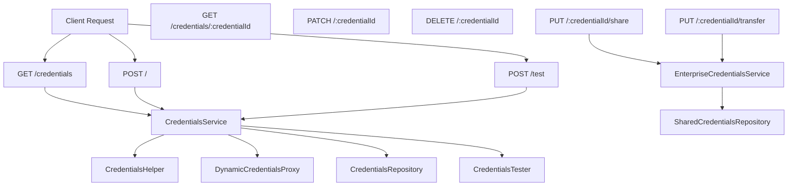
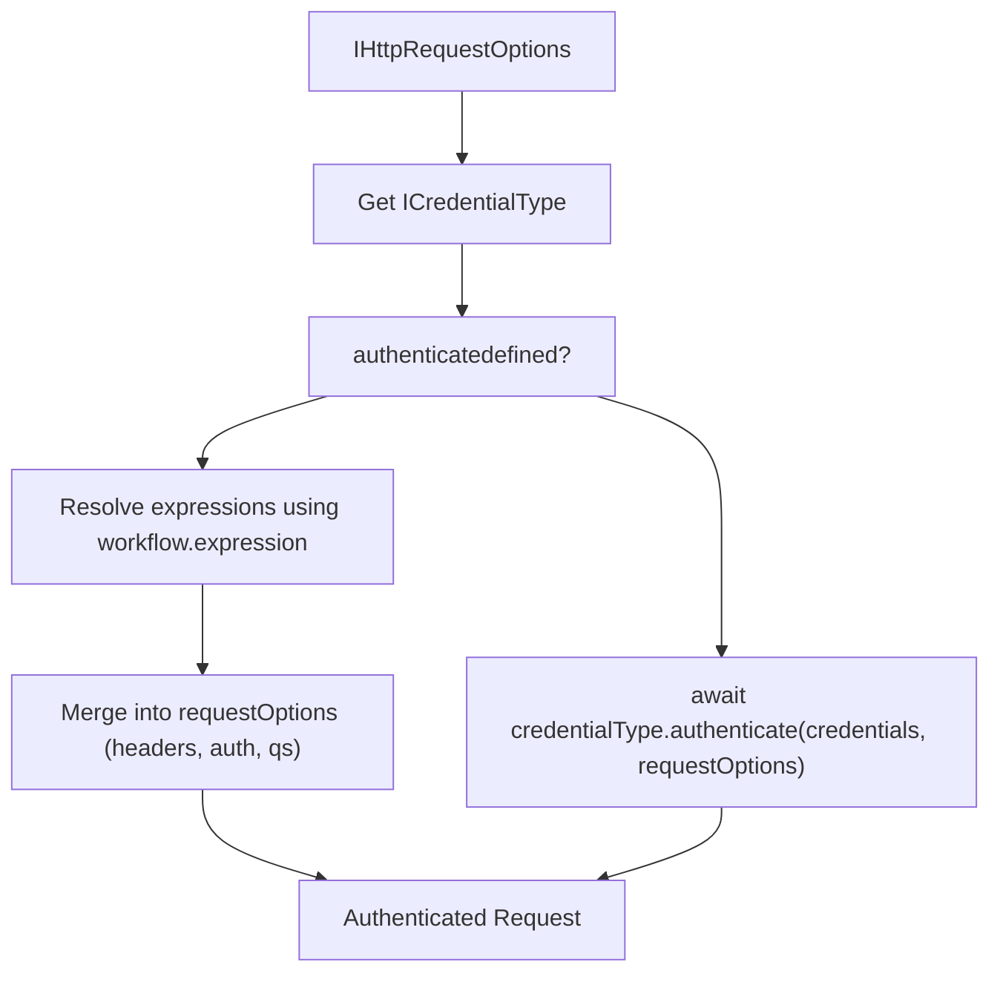
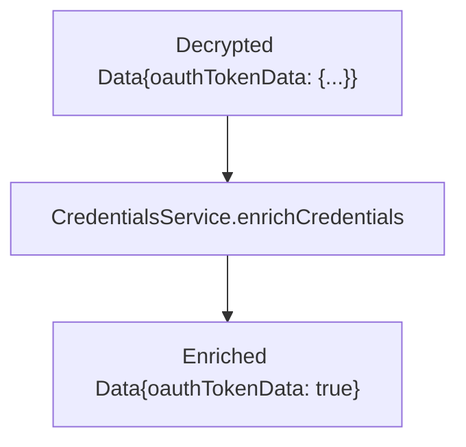

# 凭据 API 与安全

相关源文件

-   [packages/@n8n/api-types/src/dto/credentials/__tests__/credentials-get-many-request.dto.test.ts](https://github.com/n8n-io/n8n/blob/88f170b9/packages/@n8n/api-types/src/dto/credentials/__tests__/credentials-get-many-request.dto.test.ts)
-   [packages/@n8n/api-types/src/dto/credentials/__tests__/credentials-get-one-request.dto.test.ts](https://github.com/n8n-io/n8n/blob/88f170b9/packages/@n8n/api-types/src/dto/credentials/__tests__/credentials-get-one-request.dto.test.ts)
-   [packages/@n8n/api-types/src/dto/credentials/credentials-get-many-request.dto.ts](https://github.com/n8n-io/n8n/blob/88f170b9/packages/@n8n/api-types/src/dto/credentials/credentials-get-many-request.dto.ts)
-   [packages/@n8n/api-types/src/dto/credentials/credentials-get-one-request.dto.ts](https://github.com/n8n-io/n8n/blob/88f170b9/packages/@n8n/api-types/src/dto/credentials/credentials-get-one-request.dto.ts)
-   [packages/@n8n/api-types/src/schemas/workflow-execution-status.schema.ts](https://github.com/n8n-io/n8n/blob/88f170b9/packages/@n8n/api-types/src/schemas/workflow-execution-status.schema.ts)
-   [packages/@n8n/client-oauth2/src/index.ts](https://github.com/n8n-io/n8n/blob/88f170b9/packages/@n8n/client-oauth2/src/index.ts)
-   [packages/@n8n/client-oauth2/src/types.ts](https://github.com/n8n-io/n8n/blob/88f170b9/packages/@n8n/client-oauth2/src/types.ts)
-   [packages/@n8n/client-oauth2/src/utils.ts](https://github.com/n8n-io/n8n/blob/88f170b9/packages/@n8n/client-oauth2/src/utils.ts)
-   [packages/@n8n/nodes-langchain/credentials/AzureEntraCognitiveServicesOAuth2Api.credentials.ts](https://github.com/n8n-io/n8n/blob/88f170b9/packages/@n8n/nodes-langchain/credentials/AzureEntraCognitiveServicesOAuth2Api.credentials.ts)
-   [packages/@n8n/nodes-langchain/nodes/llms/LmChatAzureOpenAi/__tests__/N8nOAuth2TokenCredential.test.ts](https://github.com/n8n-io/n8n/blob/88f170b9/packages/@n8n/nodes-langchain/nodes/llms/LmChatAzureOpenAi/__tests__/N8nOAuth2TokenCredential.test.ts)
-   [packages/@n8n/nodes-langchain/nodes/llms/LmChatAzureOpenAi/__tests__/api-key.handler.test.ts](https://github.com/n8n-io/n8n/blob/88f170b9/packages/@n8n/nodes-langchain/nodes/llms/LmChatAzureOpenAi/__tests__/api-key.handler.test.ts)
-   [packages/@n8n/nodes-langchain/nodes/llms/LmChatAzureOpenAi/__tests__/oauth2.handler.test.ts](https://github.com/n8n-io/n8n/blob/88f170b9/packages/@n8n/nodes-langchain/nodes/llms/LmChatAzureOpenAi/__tests__/oauth2.handler.test.ts)
-   [packages/@n8n/nodes-langchain/nodes/llms/LmChatAzureOpenAi/credentials/N8nOAuth2TokenCredential.ts](https://github.com/n8n-io/n8n/blob/88f170b9/packages/@n8n/nodes-langchain/nodes/llms/LmChatAzureOpenAi/credentials/N8nOAuth2TokenCredential.ts)
-   [packages/@n8n/nodes-langchain/nodes/llms/LmChatAzureOpenAi/credentials/api-key.ts](https://github.com/n8n-io/n8n/blob/88f170b9/packages/@n8n/nodes-langchain/nodes/llms/LmChatAzureOpenAi/credentials/api-key.ts)
-   [packages/@n8n/nodes-langchain/nodes/llms/LmChatAzureOpenAi/credentials/oauth2.ts](https://github.com/n8n-io/n8n/blob/88f170b9/packages/@n8n/nodes-langchain/nodes/llms/LmChatAzureOpenAi/credentials/oauth2.ts)
-   [packages/@n8n/nodes-langchain/nodes/llms/LmChatAzureOpenAi/properties.ts](https://github.com/n8n-io/n8n/blob/88f170b9/packages/@n8n/nodes-langchain/nodes/llms/LmChatAzureOpenAi/properties.ts)
-   [packages/cli/src/__tests__/credentials-helper.test.ts](https://github.com/n8n-io/n8n/blob/88f170b9/packages/cli/src/__tests__/credentials-helper.test.ts)
-   [packages/cli/src/controllers/oauth/__tests__/oauth1-credential.controller.test.ts](https://github.com/n8n-io/n8n/blob/88f170b9/packages/cli/src/controllers/oauth/__tests__/oauth1-credential.controller.test.ts)
-   [packages/cli/src/controllers/oauth/__tests__/oauth2-credential.controller.test.ts](https://github.com/n8n-io/n8n/blob/88f170b9/packages/cli/src/controllers/oauth/__tests__/oauth2-credential.controller.test.ts)
-   [packages/cli/src/controllers/oauth/oauth1-credential.controller.ts](https://github.com/n8n-io/n8n/blob/88f170b9/packages/cli/src/controllers/oauth/oauth1-credential.controller.ts)
-   [packages/cli/src/controllers/oauth/oauth2-credential.controller.ts](https://github.com/n8n-io/n8n/blob/88f170b9/packages/cli/src/controllers/oauth/oauth2-credential.controller.ts)
-   [packages/cli/src/controllers/oauth/oauth2-dynamic-client-registration.schema.ts](https://github.com/n8n-io/n8n/blob/88f170b9/packages/cli/src/controllers/oauth/oauth2-dynamic-client-registration.schema.ts)
-   [packages/cli/src/credentials-helper.ts](https://github.com/n8n-io/n8n/blob/88f170b9/packages/cli/src/credentials-helper.ts)
-   [packages/cli/src/credentials/__tests__/credentials.controller.test.ts](https://github.com/n8n-io/n8n/blob/88f170b9/packages/cli/src/credentials/__tests__/credentials.controller.test.ts)
-   [packages/cli/src/credentials/__tests__/credentials.service.test.ts](https://github.com/n8n-io/n8n/blob/88f170b9/packages/cli/src/credentials/__tests__/credentials.service.test.ts)
-   [packages/cli/src/credentials/__tests__/credentials.test-data.ts](https://github.com/n8n-io/n8n/blob/88f170b9/packages/cli/src/credentials/__tests__/credentials.test-data.ts)
-   [packages/cli/src/credentials/__tests__/dynamic-credentials-proxy.test.ts](https://github.com/n8n-io/n8n/blob/88f170b9/packages/cli/src/credentials/__tests__/dynamic-credentials-proxy.test.ts)
-   [packages/cli/src/credentials/__tests__/validation.test.ts](https://github.com/n8n-io/n8n/blob/88f170b9/packages/cli/src/credentials/__tests__/validation.test.ts)
-   [packages/cli/src/credentials/credential-resolution-provider.interface.ts](https://github.com/n8n-io/n8n/blob/88f170b9/packages/cli/src/credentials/credential-resolution-provider.interface.ts)
-   [packages/cli/src/credentials/credentials.controller.ts](https://github.com/n8n-io/n8n/blob/88f170b9/packages/cli/src/credentials/credentials.controller.ts)
-   [packages/cli/src/credentials/credentials.service.ee.ts](https://github.com/n8n-io/n8n/blob/88f170b9/packages/cli/src/credentials/credentials.service.ee.ts)
-   [packages/cli/src/credentials/credentials.service.ts](https://github.com/n8n-io/n8n/blob/88f170b9/packages/cli/src/credentials/credentials.service.ts)
-   [packages/cli/src/credentials/dynamic-credentials-proxy.ts](https://github.com/n8n-io/n8n/blob/88f170b9/packages/cli/src/credentials/dynamic-credentials-proxy.ts)
-   [packages/cli/src/credentials/validation.ts](https://github.com/n8n-io/n8n/blob/88f170b9/packages/cli/src/credentials/validation.ts)
-   [packages/cli/src/middlewares/cors.ts](https://github.com/n8n-io/n8n/blob/88f170b9/packages/cli/src/middlewares/cors.ts)
-   [packages/cli/src/modules/dynamic-credentials.ee/__tests__/dynamic-credentials-cors.integration.test.ts](https://github.com/n8n-io/n8n/blob/88f170b9/packages/cli/src/modules/dynamic-credentials.ee/__tests__/dynamic-credentials-cors.integration.test.ts)
-   [packages/cli/src/modules/dynamic-credentials.ee/__tests__/dynamic-credentials.controller.test.ts](https://github.com/n8n-io/n8n/blob/88f170b9/packages/cli/src/modules/dynamic-credentials.ee/__tests__/dynamic-credentials.controller.test.ts)
-   [packages/cli/src/modules/dynamic-credentials.ee/__tests__/workflow-status.controller.test.ts](https://github.com/n8n-io/n8n/blob/88f170b9/packages/cli/src/modules/dynamic-credentials.ee/__tests__/workflow-status.controller.test.ts)
-   [packages/cli/src/modules/dynamic-credentials.ee/dynamic-credentials.config.ts](https://github.com/n8n-io/n8n/blob/88f170b9/packages/cli/src/modules/dynamic-credentials.ee/dynamic-credentials.config.ts)
-   [packages/cli/src/modules/dynamic-credentials.ee/dynamic-credentials.controller.ts](https://github.com/n8n-io/n8n/blob/88f170b9/packages/cli/src/modules/dynamic-credentials.ee/dynamic-credentials.controller.ts)
-   [packages/cli/src/modules/dynamic-credentials.ee/dynamic-credentials.module.ts](https://github.com/n8n-io/n8n/blob/88f170b9/packages/cli/src/modules/dynamic-credentials.ee/dynamic-credentials.module.ts)
-   [packages/cli/src/modules/dynamic-credentials.ee/services/__tests__/credential-check-proxy.service.test.ts](https://github.com/n8n-io/n8n/blob/88f170b9/packages/cli/src/modules/dynamic-credentials.ee/services/__tests__/credential-check-proxy.service.test.ts)
-   [packages/cli/src/modules/dynamic-credentials.ee/services/__tests__/credential-resolver-registry.service.test.ts](https://github.com/n8n-io/n8n/blob/88f170b9/packages/cli/src/modules/dynamic-credentials.ee/services/__tests__/credential-resolver-registry.service.test.ts)
-   [packages/cli/src/modules/dynamic-credentials.ee/services/__tests__/credential-resolver-workflow.service.test.ts](https://github.com/n8n-io/n8n/blob/88f170b9/packages/cli/src/modules/dynamic-credentials.ee/services/__tests__/credential-resolver-workflow.service.test.ts)
-   [packages/cli/src/modules/dynamic-credentials.ee/services/__tests__/dynamic-credential-cors.service.test.ts](https://github.com/n8n-io/n8n/blob/88f170b9/packages/cli/src/modules/dynamic-credentials.ee/services/__tests__/dynamic-credential-cors.service.test.ts)
-   [packages/cli/src/modules/dynamic-credentials.ee/services/__tests__/dynamic-credential-storage.service.test.ts](https://github.com/n8n-io/n8n/blob/88f170b9/packages/cli/src/modules/dynamic-credentials.ee/services/__tests__/dynamic-credential-storage.service.test.ts)
-   [packages/cli/src/modules/dynamic-credentials.ee/services/__tests__/dynamic-credential.service.test.ts](https://github.com/n8n-io/n8n/blob/88f170b9/packages/cli/src/modules/dynamic-credentials.ee/services/__tests__/dynamic-credential.service.test.ts)
-   [packages/cli/src/modules/dynamic-credentials.ee/services/credential-check-proxy.service.ts](https://github.com/n8n-io/n8n/blob/88f170b9/packages/cli/src/modules/dynamic-credentials.ee/services/credential-check-proxy.service.ts)
-   [packages/cli/src/modules/dynamic-credentials.ee/services/credential-resolver-registry.service.ts](https://github.com/n8n-io/n8n/blob/88f170b9/packages/cli/src/modules/dynamic-credentials.ee/services/credential-resolver-registry.service.ts)
-   [packages/cli/src/modules/dynamic-credentials.ee/services/credential-resolver-workflow.service.ts](https://github.com/n8n-io/n8n/blob/88f170b9/packages/cli/src/modules/dynamic-credentials.ee/services/credential-resolver-workflow.service.ts)
-   [packages/cli/src/modules/dynamic-credentials.ee/services/dynamic-credential-cors.service.ts](https://github.com/n8n-io/n8n/blob/88f170b9/packages/cli/src/modules/dynamic-credentials.ee/services/dynamic-credential-cors.service.ts)
-   [packages/cli/src/modules/dynamic-credentials.ee/services/dynamic-credential-storage.service.ts](https://github.com/n8n-io/n8n/blob/88f170b9/packages/cli/src/modules/dynamic-credentials.ee/services/dynamic-credential-storage.service.ts)
-   [packages/cli/src/modules/dynamic-credentials.ee/services/dynamic-credential.service.ts](https://github.com/n8n-io/n8n/blob/88f170b9/packages/cli/src/modules/dynamic-credentials.ee/services/dynamic-credential.service.ts)
-   [packages/cli/src/modules/dynamic-credentials.ee/services/index.ts](https://github.com/n8n-io/n8n/blob/88f170b9/packages/cli/src/modules/dynamic-credentials.ee/services/index.ts)
-   [packages/cli/src/modules/dynamic-credentials.ee/utils.ts](https://github.com/n8n-io/n8n/blob/88f170b9/packages/cli/src/modules/dynamic-credentials.ee/utils.ts)
-   [packages/cli/src/modules/dynamic-credentials.ee/workflow-status.controller.ts](https://github.com/n8n-io/n8n/blob/88f170b9/packages/cli/src/modules/dynamic-credentials.ee/workflow-status.controller.ts)
-   [packages/cli/src/modules/external-secrets.ee/__tests__/redaction.service.ee.test.ts](https://github.com/n8n-io/n8n/blob/88f170b9/packages/cli/src/modules/external-secrets.ee/__tests__/redaction.service.ee.test.ts)
-   [packages/cli/src/modules/external-secrets.ee/redaction.service.ee.ts](https://github.com/n8n-io/n8n/blob/88f170b9/packages/cli/src/modules/external-secrets.ee/redaction.service.ee.ts)
-   [packages/cli/src/oauth/__tests__/oauth.service.test.ts](https://github.com/n8n-io/n8n/blob/88f170b9/packages/cli/src/oauth/__tests__/oauth.service.test.ts)
-   [packages/cli/src/oauth/oauth.service.ts](https://github.com/n8n-io/n8n/blob/88f170b9/packages/cli/src/oauth/oauth.service.ts)
-   [packages/cli/src/oauth/types.ts](https://github.com/n8n-io/n8n/blob/88f170b9/packages/cli/src/oauth/types.ts)
-   [packages/cli/src/public-api/v1/handlers/credentials/__tests__/credentials.service.test.ts](https://github.com/n8n-io/n8n/blob/88f170b9/packages/cli/src/public-api/v1/handlers/credentials/__tests__/credentials.service.test.ts)
-   [packages/cli/src/public-api/v1/handlers/credentials/credentials.handler.ts](https://github.com/n8n-io/n8n/blob/88f170b9/packages/cli/src/public-api/v1/handlers/credentials/credentials.handler.ts)
-   [packages/cli/src/public-api/v1/handlers/credentials/credentials.service.ts](https://github.com/n8n-io/n8n/blob/88f170b9/packages/cli/src/public-api/v1/handlers/credentials/credentials.service.ts)
-   [packages/cli/templates/oauth-callback.handlebars](https://github.com/n8n-io/n8n/blob/88f170b9/packages/cli/templates/oauth-callback.handlebars)
-   [packages/cli/templates/oauth-error-callback.handlebars](https://github.com/n8n-io/n8n/blob/88f170b9/packages/cli/templates/oauth-error-callback.handlebars)
-   [packages/cli/test/integration/ai/ai.api.test.ts](https://github.com/n8n-io/n8n/blob/88f170b9/packages/cli/test/integration/ai/ai.api.test.ts)
-   [packages/cli/test/integration/controllers/oauth/oauth2.api.test.ts](https://github.com/n8n-io/n8n/blob/88f170b9/packages/cli/test/integration/controllers/oauth/oauth2.api.test.ts)
-   [packages/cli/test/integration/controllers/oauth/oauth2.skip-auth.api.test.ts](https://github.com/n8n-io/n8n/blob/88f170b9/packages/cli/test/integration/controllers/oauth/oauth2.skip-auth.api.test.ts)
-   [packages/cli/test/integration/credentials/credentials.api.ee.test.ts](https://github.com/n8n-io/n8n/blob/88f170b9/packages/cli/test/integration/credentials/credentials.api.ee.test.ts)
-   [packages/cli/test/integration/credentials/credentials.api.test.ts](https://github.com/n8n-io/n8n/blob/88f170b9/packages/cli/test/integration/credentials/credentials.api.test.ts)
-   [packages/cli/test/integration/dynamic-credentials.ee/dynamic-credentials.auth.api.test.ts](https://github.com/n8n-io/n8n/blob/88f170b9/packages/cli/test/integration/dynamic-credentials.ee/dynamic-credentials.auth.api.test.ts)
-   [packages/cli/test/integration/dynamic-credentials.ee/dynamic-credentials.no-auth.api.test.ts](https://github.com/n8n-io/n8n/blob/88f170b9/packages/cli/test/integration/dynamic-credentials.ee/dynamic-credentials.no-auth.api.test.ts)
-   [packages/cli/test/integration/dynamic-credentials.ee/workflow-status.auth.api.test.ts](https://github.com/n8n-io/n8n/blob/88f170b9/packages/cli/test/integration/dynamic-credentials.ee/workflow-status.auth.api.test.ts)
-   [packages/cli/test/integration/dynamic-credentials.ee/workflow-status.no-auth.api.test.ts](https://github.com/n8n-io/n8n/blob/88f170b9/packages/cli/test/integration/dynamic-credentials.ee/workflow-status.no-auth.api.test.ts)
-   [packages/cli/test/integration/public-api/credentials.test.ts](https://github.com/n8n-io/n8n/blob/88f170b9/packages/cli/test/integration/public-api/credentials.test.ts)
-   [packages/core/src/execution-engine/__tests__/routing-node.test.ts](https://github.com/n8n-io/n8n/blob/88f170b9/packages/core/src/execution-engine/__tests__/routing-node.test.ts)
-   [packages/core/src/execution-engine/index.ts](https://github.com/n8n-io/n8n/blob/88f170b9/packages/core/src/execution-engine/index.ts)
-   [packages/core/src/execution-engine/node-execution-context/__tests__/execute-context.test.ts](https://github.com/n8n-io/n8n/blob/88f170b9/packages/core/src/execution-engine/node-execution-context/__tests__/execute-context.test.ts)
-   [packages/core/src/execution-engine/node-execution-context/__tests__/execute-single-context.test.ts](https://github.com/n8n-io/n8n/blob/88f170b9/packages/core/src/execution-engine/node-execution-context/__tests__/execute-single-context.test.ts)
-   [packages/core/src/execution-engine/node-execution-context/__tests__/node-execution-context.test.ts](https://github.com/n8n-io/n8n/blob/88f170b9/packages/core/src/execution-engine/node-execution-context/__tests__/node-execution-context.test.ts)
-   [packages/core/src/execution-engine/node-execution-context/execute-context.ts](https://github.com/n8n-io/n8n/blob/88f170b9/packages/core/src/execution-engine/node-execution-context/execute-context.ts)
-   [packages/core/src/execution-engine/node-execution-context/node-execution-context.ts](https://github.com/n8n-io/n8n/blob/88f170b9/packages/core/src/execution-engine/node-execution-context/node-execution-context.ts)
-   [packages/core/src/execution-engine/node-execution-context/utils/__tests__/credential-check-helper-functions.test.ts](https://github.com/n8n-io/n8n/blob/88f170b9/packages/core/src/execution-engine/node-execution-context/utils/__tests__/credential-check-helper-functions.test.ts)
-   [packages/core/src/execution-engine/node-execution-context/utils/__tests__/request-helper-functions.test.ts](https://github.com/n8n-io/n8n/blob/88f170b9/packages/core/src/execution-engine/node-execution-context/utils/__tests__/request-helper-functions.test.ts)
-   [packages/core/src/execution-engine/node-execution-context/utils/credential-check-helper-functions.ts](https://github.com/n8n-io/n8n/blob/88f170b9/packages/core/src/execution-engine/node-execution-context/utils/credential-check-helper-functions.ts)
-   [packages/core/src/execution-engine/node-execution-context/utils/request-helper-functions.ts](https://github.com/n8n-io/n8n/blob/88f170b9/packages/core/src/execution-engine/node-execution-context/utils/request-helper-functions.ts)
-   [packages/core/src/execution-engine/node-execution-context/utils/request-helpers/__tests__/axios-utils.test.ts](https://github.com/n8n-io/n8n/blob/88f170b9/packages/core/src/execution-engine/node-execution-context/utils/request-helpers/__tests__/axios-utils.test.ts)
-   [packages/core/src/execution-engine/node-execution-context/utils/request-helpers/axios-config.ts](https://github.com/n8n-io/n8n/blob/88f170b9/packages/core/src/execution-engine/node-execution-context/utils/request-helpers/axios-config.ts)
-   [packages/core/src/execution-engine/node-execution-context/utils/request-helpers/axios-utils.ts](https://github.com/n8n-io/n8n/blob/88f170b9/packages/core/src/execution-engine/node-execution-context/utils/request-helpers/axios-utils.ts)
-   [packages/core/src/execution-engine/node-execution-context/utils/request-helpers/index.ts](https://github.com/n8n-io/n8n/blob/88f170b9/packages/core/src/execution-engine/node-execution-context/utils/request-helpers/index.ts)
-   [packages/core/src/execution-engine/routing-node.ts](https://github.com/n8n-io/n8n/blob/88f170b9/packages/core/src/execution-engine/routing-node.ts)
-   [packages/frontend/editor-ui/src/features/ai/chatHub/composables/useDynamicCredentialsStatus.ts](https://github.com/n8n-io/n8n/blob/88f170b9/packages/frontend/editor-ui/src/features/ai/chatHub/composables/useDynamicCredentialsStatus.ts)
-   [packages/nodes-base/credentials/OAuth2Api.credentials.ts](https://github.com/n8n-io/n8n/blob/88f170b9/packages/nodes-base/credentials/OAuth2Api.credentials.ts)

## 目的与范围

本文档涵盖了 n8n 中的凭据管理系统，包括 REST API 端点、加密/解密、身份验证方法、动态凭据解析、OAuth 流程、为了安全进行的数据脱敏以及基于项目的共享模型。

---

## REST API 架构

凭据 API 遵循标准 REST 模式，由 `CredentialsController` 处理 HTTP 请求，并由多个服务层包含业务逻辑。所有端点都需要身份验证，并通过 `@ProjectScope` 装饰器强制执行基于项目的权限。

### API 端点与服务架构

**来源：** [packages/cli/src/credentials/credentials.controller.ts51-64](https://github.com/n8n-io/n8n/blob/88f170b9/packages/cli/src/credentials/credentials.controller.ts#L51-L64) [packages/cli/src/credentials/credentials.service.ts86-105](https://github.com/n8n-io/n8n/blob/88f170b9/packages/cli/src/credentials/credentials.service.ts#L86-L105)

### 带有 Scope 的请求/响应流

API 会在请求时自动包含权限 Scope (作用域)，使前端能够根据用户权限显示/隐藏操作。

> **[Mermaid sequence]**
> *(图表结构无法解析)*

**来源：** [packages/cli/src/credentials/credentials.controller.ts66-89](https://github.com/n8n-io/n8n/blob/88f170b9/packages/cli/src/credentials/credentials.controller.ts#L66-L89) [packages/cli/src/credentials/credentials.service.ts124-217](https://github.com/n8n-io/n8n/blob/88f170b9/packages/cli/src/credentials/credentials.service.ts#L124-L217)

---

## 凭据存储与加密

所有凭据数据在静态存储时都使用来自 `n8n-core` 的 `Credentials` 类进行加密。`Cipher` 服务使用来自配置的实例加密密钥提供加密/解密。

### 核心加密组件

| 组件 | 文件 | 职责 |
| --- | --- | --- |
| `Credentials` | `n8n-core` | 带有加密方法的内存凭据对象 |
| `Cipher` | `n8n-core` | 使用实例密钥进行加密/解密 |
| `CredentialsHelper` | `packages/cli/src/credentials-helper.ts` | 高级凭据操作和解析 |
| `CredentialsService` | `packages/cli/src/credentials/credentials.service.ts` | API 层 CRUD 和数据增强 |
| `CredentialsRepository` | `packages/@n8n/db` | 数据库持久化 |

**来源：** [packages/cli/src/credentials-helper.ts83-94](https://github.com/n8n-io/n8n/blob/88f170b9/packages/cli/src/credentials-helper.ts#L83-L94) [packages/cli/src/credentials/credentials.service.ts86-105](https://github.com/n8n-io/n8n/blob/88f170b9/packages/cli/src/credentials/credentials.service.ts#L86-L105)

### 加密流

> **[Mermaid sequence]**
> *(图表结构无法解析)*

**来源：** [packages/cli/src/credentials/credentials.service.ts477-496](https://github.com/n8n-io/n8n/blob/88f170b9/packages/cli/src/credentials/credentials.service.ts#L477-L496) [packages/cli/src/credentials/credentials.controller.ts178-205](https://github.com/n8n-io/n8n/blob/88f170b9/packages/cli/src/credentials/credentials.controller.ts#L178-L205)

---

## 身份验证方法

`CredentialsHelper.authenticate()` 方法根据凭据类型的 `authenticate` 属性向 HTTP 请求添加身份验证信息。

### 身份验证类型

凭据类型可以通过两种方式定义身份验证：

1.  **声明式 (`authenticate.type === 'generic'`)**：使用表达式的通用身份验证。
2.  **自定义函数**：编程式身份验证逻辑。

**声明式身份验证流**

**来源：** [packages/cli/src/credentials-helper.ts99-155](https://github.com/n8n-io/n8n/blob/88f170b9/packages/cli/src/credentials-helper.ts#L99-L155)

### 预身份验证 (令牌刷新)

`preAuthentication()` 方法在发起请求之前处理 OAuth 凭据的令牌刷新 (Token Refresh)。它会检查令牌是否已过期，并在需要时进行刷新。

> **[Mermaid sequence]**
> *(图表结构无法解析)*

**来源：** [packages/cli/src/credentials-helper.ts157-210](https://github.com/n8n-io/n8n/blob/88f170b9/packages/cli/src/credentials-helper.ts#L157-L210)

---

## OAuth 流程与管理

OAuth 凭据 (OAuth1 和 OAuth2) 通过专门的控制器和 `OauthService` 进行管理。

### OAuth2 回调流

> **[Mermaid sequence]**
> *(图表结构无法解析)*

**来源：** [packages/cli/src/controllers/oauth/oauth2-credential.controller.ts38-142](https://github.com/n8n-io/n8n/blob/88f170b9/packages/cli/src/controllers/oauth/oauth2-credential.controller.ts#L38-L142) [packages/cli/src/oauth/oauth.service.ts173-184](https://github.com/n8n-io/n8n/blob/88f170b9/packages/cli/src/oauth/oauth.service.ts#L173-L184)

### OAuth 令牌保护

OAuth 令牌永远不会暴露给前端。在数据增强过程中，`oauthTokenData` 会被替换为一个布尔标志。

**来源：** [packages/cli/src/credentials/credentials.service.ts334-337](https://github.com/n8n-io/n8n/blob/88f170b9/packages/cli/src/credentials/credentials.service.ts#L334-L337)

---

## 动态凭据与解析

n8n 支持通过外部系统进行动态凭据解析 (企业版)。

### 动态解析流

**来源：** [packages/cli/src/credentials/dynamic-credentials-proxy.ts1-40](https://github.com/n8n-io/n8n/blob/88f170b9/packages/cli/src/credentials/dynamic-credentials-proxy.ts#L1-L40) [packages/cli/src/modules/dynamic-credentials.ee/dynamic-credentials.module.ts30-36](https://github.com/n8n-io/n8n/blob/88f170b9/packages/cli/src/modules/dynamic-credentials.ee/dynamic-credentials.module.ts#L30-L36)

---

## 凭据脱敏与反脱敏

为了防止敏感数据泄露，n8n 在将密码字段发送到 UI 之前会对其进行脱敏 (Redact)，并在接收更新时进行反脱敏 (Unredact)。

### 脱敏规则

| 属性类型 | 操作 | 值 |
| --- | --- | --- |
| `password: true` | 脱敏 | `CREDENTIAL_BLANKING_VALUE` |
| `oauthTokenData` | 脱敏 | `CREDENTIAL_BLANKING_VALUE` |
| `csrfSecret` | 脱敏 | `CREDENTIAL_BLANKING_VALUE` |
| 空字符串 | 标记 | `CREDENTIAL_EMPTY_VALUE` |

**来源：** [packages/cli/src/credentials/credentials.service.ts619-693](https://github.com/n8n-io/n8n/blob/88f170b9/packages/cli/src/credentials/credentials.service.ts#L619-L693)

### 反脱敏流 (更新)

当接收到 `PATCH` 请求时，`unredact` 函数会将新数据与现有的已解密数据进行比较。如果字段包含 `CREDENTIAL_BLANKING_VALUE`，则保留原始值。

**来源：** [packages/cli/src/credentials/credentials.service.ts695-750](https://github.com/n8n-io/n8n/blob/88f170b9/packages/cli/src/credentials/credentials.service.ts#L695-L750) [packages/cli/src/credentials/credentials.controller.ts236-244](https://github.com/n8n-io/n8n/blob/88f170b9/packages/cli/src/credentials/credentials.controller.ts#L236-L244)

---

## 凭据测试

`/credentials/test` 端点允许在不保存凭据的情况下针对外部服务验证凭据。

> **[Mermaid sequence]**
> *(图表结构无法解析)*

**来源：** [packages/cli/src/credentials/credentials.controller.ts140-176](https://github.com/n8n-io/n8n/blob/88f170b9/packages/cli/src/credentials/credentials.controller.ts#L140-L176) [packages/cli/src/services/credentials-tester.service.ts1-100](https://github.com/n8n-io/n8n/blob/88f170b9/packages/cli/src/services/credentials-tester.service.ts#L1-L100) (根据 `CredentialsService.test` 和 `CredentialsTester` 的用法推断)。
