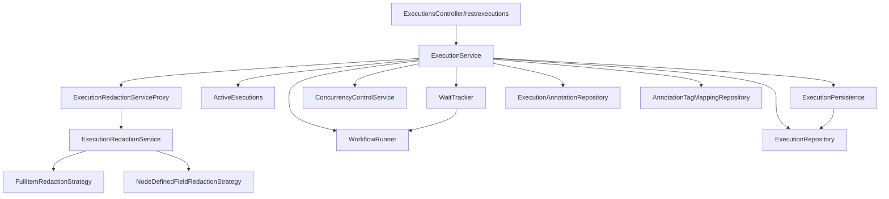
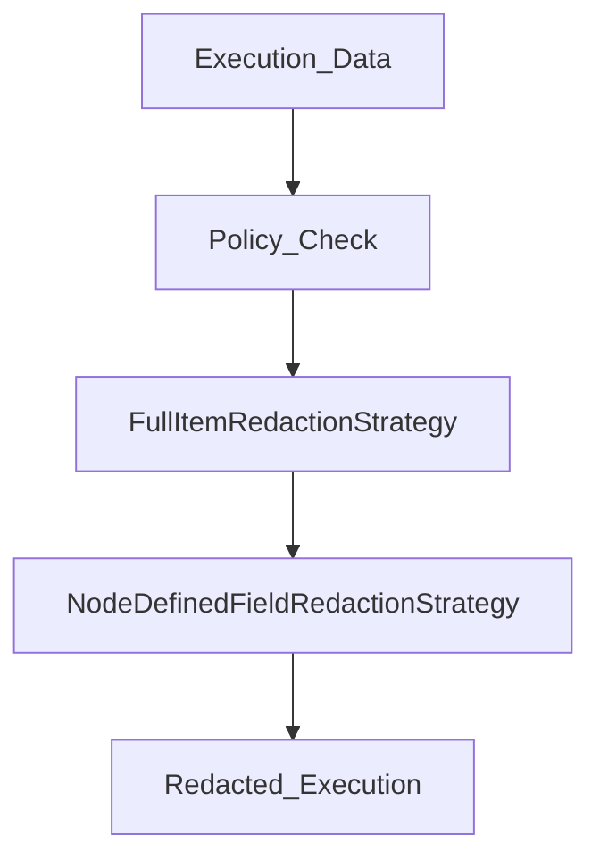

# 执行管理 API

相关源文件

-   [packages/@n8n/db/src/entities/types-db.ts](https://github.com/n8n-io/n8n/blob/88f170b9/packages/@n8n/db/src/entities/types-db.ts)
-   [packages/cli/src/errors/aborted-execution-retry.error.ts](https://github.com/n8n-io/n8n/blob/88f170b9/packages/cli/src/errors/aborted-execution-retry.error.ts)
-   [packages/cli/src/errors/missing-execution-stop.error.ts](https://github.com/n8n-io/n8n/blob/88f170b9/packages/cli/src/errors/missing-execution-stop.error.ts)
-   [packages/cli/src/errors/response-errors/scope-forbidden.error.ts](https://github.com/n8n-io/n8n/blob/88f170b9/packages/cli/src/errors/response-errors/scope-forbidden.error.ts)
-   [packages/cli/src/executions/\_\_tests\_\_/execution.service.test.ts](https://github.com/n8n-io/n8n/blob/88f170b9/packages/cli/src/executions/__tests__/execution.service.test.ts)
-   [packages/cli/src/executions/\_\_tests\_\_/executions.controller.test.ts](https://github.com/n8n-io/n8n/blob/88f170b9/packages/cli/src/executions/__tests__/executions.controller.test.ts)
-   [packages/cli/src/executions/execution-redaction.ts](https://github.com/n8n-io/n8n/blob/88f170b9/packages/cli/src/executions/execution-redaction.ts)
-   [packages/cli/src/executions/execution.service.ts](https://github.com/n8n-io/n8n/blob/88f170b9/packages/cli/src/executions/execution.service.ts)
-   [packages/cli/src/executions/execution.types.ts](https://github.com/n8n-io/n8n/blob/88f170b9/packages/cli/src/executions/execution.types.ts)
-   [packages/cli/src/executions/executions.controller.ts](https://github.com/n8n-io/n8n/blob/88f170b9/packages/cli/src/executions/executions.controller.ts)
-   [packages/cli/src/modules/redaction/executions/\_\_tests\_\_/execution-redaction.service.test.ts](https://github.com/n8n-io/n8n/blob/88f170b9/packages/cli/src/modules/redaction/executions/__tests__/execution-redaction.service.test.ts)
-   [packages/cli/src/modules/redaction/executions/execution-redaction.interfaces.ts](https://github.com/n8n-io/n8n/blob/88f170b9/packages/cli/src/modules/redaction/executions/execution-redaction.interfaces.ts)
-   [packages/cli/src/modules/redaction/executions/execution-redaction.service.ts](https://github.com/n8n-io/n8n/blob/88f170b9/packages/cli/src/modules/redaction/executions/execution-redaction.service.ts)
-   [packages/cli/src/modules/redaction/executions/strategies/\_\_tests\_\_/full-item-redaction.strategy.test.ts](https://github.com/n8n-io/n8n/blob/88f170b9/packages/cli/src/modules/redaction/executions/strategies/__tests__/full-item-redaction.strategy.test.ts)
-   [packages/cli/src/modules/redaction/executions/strategies/\_\_tests\_\_/node-defined-field-redaction.strategy.test.ts](https://github.com/n8n-io/n8n/blob/88f170b9/packages/cli/src/modules/redaction/executions/strategies/__tests__/node-defined-field-redaction.strategy.test.ts)
-   [packages/cli/src/modules/redaction/executions/strategies/full-item-redaction.strategy.ts](https://github.com/n8n-io/n8n/blob/88f170b9/packages/cli/src/modules/redaction/executions/strategies/full-item-redaction.strategy.ts)
-   [packages/cli/src/modules/redaction/executions/strategies/node-defined-field-redaction.strategy.ts](https://github.com/n8n-io/n8n/blob/88f170b9/packages/cli/src/modules/redaction/executions/strategies/node-defined-field-redaction.strategy.ts)
-   [packages/cli/src/services/naming.service.ts](https://github.com/n8n-io/n8n/blob/88f170b9/packages/cli/src/services/naming.service.ts)
-   [packages/cli/test/integration/database/repositories/execution.repository.test.ts](https://github.com/n8n-io/n8n/blob/88f170b9/packages/cli/test/integration/database/repositories/execution.repository.test.ts)
-   [packages/cli/test/integration/execution-redaction.test.ts](https://github.com/n8n-io/n8n/blob/88f170b9/packages/cli/test/integration/execution-redaction.test.ts)
-   [packages/cli/test/integration/execution.service.integration.test.ts](https://github.com/n8n-io/n8n/blob/88f170b9/packages/cli/test/integration/execution.service.integration.test.ts)
-   [packages/frontend/editor-ui/src/features/ai/chatHub/components/CredentialSelectorModal.vue](https://github.com/n8n-io/n8n/blob/88f170b9/packages/frontend/editor-ui/src/features/ai/chatHub/components/CredentialSelectorModal.vue)
-   [packages/frontend/editor-ui/src/features/ai/chatHub/module.descriptor.ts](https://github.com/n8n-io/n8n/blob/88f170b9/packages/frontend/editor-ui/src/features/ai/chatHub/module.descriptor.ts)
-   [packages/frontend/editor-ui/src/features/execution/executions/components/ExecutionsFilter.test.ts](https://github.com/n8n-io/n8n/blob/88f170b9/packages/frontend/editor-ui/src/features/execution/executions/components/ExecutionsFilter.test.ts)
-   [packages/frontend/editor-ui/src/features/execution/executions/components/ExecutionsFilter.vue](https://github.com/n8n-io/n8n/blob/88f170b9/packages/frontend/editor-ui/src/features/execution/executions/components/ExecutionsFilter.vue)
-   [packages/frontend/editor-ui/src/features/execution/executions/components/workflow/WorkflowExecutionsSidebar.vue](https://github.com/n8n-io/n8n/blob/88f170b9/packages/frontend/editor-ui/src/features/execution/executions/components/workflow/WorkflowExecutionsSidebar.vue)
-   [packages/frontend/editor-ui/src/features/execution/executions/executions.types.ts](https://github.com/n8n-io/n8n/blob/88f170b9/packages/frontend/editor-ui/src/features/execution/executions/executions.types.ts)
-   [packages/frontend/editor-ui/src/features/execution/executions/executions.utils.test.ts](https://github.com/n8n-io/n8n/blob/88f170b9/packages/frontend/editor-ui/src/features/execution/executions/executions.utils.test.ts)
-   [packages/frontend/editor-ui/src/features/execution/executions/executions.utils.ts](https://github.com/n8n-io/n8n/blob/88f170b9/packages/frontend/editor-ui/src/features/execution/executions/executions.utils.ts)
-   [packages/workflow/src/constants.ts](https://github.com/n8n-io/n8n/blob/88f170b9/packages/workflow/src/constants.ts)
-   [packages/workflow/src/interfaces.ts](https://github.com/n8n-io/n8n/blob/88f170b9/packages/workflow/src/interfaces.ts)
-   [packages/workflow/src/telemetry-helpers.ts](https://github.com/n8n-io/n8n/blob/88f170b9/packages/workflow/src/telemetry-helpers.ts)
-   [packages/workflow/test/telemetry-helpers.test.ts](https://github.com/n8n-io/n8n/blob/88f170b9/packages/workflow/test/telemetry-helpers.test.ts)

本页涵盖了负责在工作流执行创建后对其进行查询、停止、重试、删除和注释的 API 及服务层。此外还涵盖了执行数据的持久化模型、通过 `WaitTracker` 自动恢复已暂停的执行，以及执行数据脱敏系统。

关于*启动*执行的机制以及它如何通过节点运行，请参阅页面 [2.1](https://github.com/n8n-io/n8n/blob/88f170b9/2.1)。关于分布式队列模式（queue-mode）执行，请参阅页面 [2.2](https://github.com/n8n-io/n8n/blob/88f170b9/2.2)。关于创建和保存工作流定义的 Workflows API，请参阅页面 [3.1](https://github.com/n8n-io/n8n/blob/88f170b9/3.1)。

---

## 组件概述

执行管理技术栈位于 HTTP 层和数据库之间。涉及的主要类包括：

| 类 | 位置 | 角色 |
| --- | --- | --- |
| `ExecutionsController` | `packages/cli/src/executions/executions.controller.ts` | REST 端点处理程序 (`/rest/executions`) |
| `ExecutionService` | `packages/cli/src/executions/execution.service.ts` | 业务逻辑：查找、重试、停止、删除、注释 |
| `ExecutionRepository` | `packages/cli/src/executions/execution.repository.ts` | 负责所有执行持久化的 TypeORM 仓库 |
| `ExecutionPersistence` | `packages/cli/src/executions/execution-persistence.ts` | 封装批量删除和清理（pruning） |
| `ExecutionRedactionServiceProxy` | `packages/cli/src/executions/execution-redaction-proxy.service.ts` | 根据功能标志（feature flag）将脱敏请求路由至实际服务或空操作（no-op）服务 |
| `ExecutionRedactionService` | `packages/cli/src/modules/redaction/executions/execution-redaction.service.ts` | 根据工作流策略编排执行数据脱敏 |
| `ActiveExecutions` | `packages/cli/src/active-executions.ts` | 当前运行中执行的内存映射 |
| `WaitTracker` | `packages/cli/src/wait-tracker.ts` | 恢复在 Wait 节点暂停的执行 |

**组件依赖图**


来源：[packages/cli/src/executions/execution.service.ts106-125](https://github.com/n8n-io/n8n/blob/88f170b9/packages/cli/src/executions/execution.service.ts#L106-L125) [packages/cli/src/modules/redaction/executions/execution-redaction.service.ts37-44](https://github.com/n8n-io/n8n/blob/88f170b9/packages/cli/src/modules/redaction/executions/execution-redaction.service.ts#L37-L44)

---

## 执行状态状态机

执行通过 `ExecutionEntity.status` 中跟踪的一组定义好的状态进行流转。

**执行状态生命周期**

> **[Mermaid stateDiagram]**
> *(图表结构无法解析)*

来源：[packages/cli/src/executions/execution.service.ts30-39](https://github.com/n8n-io/n8n/blob/88f170b9/packages/cli/src/executions/execution.service.ts#L30-L39) [packages/@n8n/db/src/entities/types-db.ts60-63](https://github.com/n8n-io/n8n/blob/88f170b9/packages/@n8n/db/src/entities/types-db.ts#L60-L63)

---

## ExecutionService 操作

`ExecutionService` 是所有执行管理操作的唯一入口点。它通过为每个查询接受 `sharedWorkflowIds`（请求用户可以访问的工作流 ID 集合）来强制执行访问控制。

### 查找执行

```
async findOne(req: ExecutionRequest.GetOne | ExecutionRequest.Update, sharedWorkflowIds: string[])async getLastSuccessfulExecution(workflowId: string, user: User, redactExecutionData?: boolean)
```
`findOne` 调用 `ExecutionRepository.findIfSharedUnflatten`，该方法强制执行项目级访问。检索后，执行数据通过 `ExecutionRedactionServiceProxy.processExecution` 进入脱敏流水线处理。

**脱敏查询参数**

`redactExecutionData` 查询参数控制执行数据应当脱敏还是展示：

| 值 | 行为 |
| --- | --- |
| `undefined`（默认） | 根据工作流的 `redactionPolicy` 设置应用脱敏 |
| `true` | 强制脱敏，忽略策略 |
| `false` | 尝试展示数据（需要工作流上的 `execution:reveal` 范围权限） |

当传递 `redactExecutionData=false` 时，`ExecutionRedactionService` 会验证用户是否拥有 `execution:reveal` 范围权限。如果权限被拒绝，它会触发 `execution-data-reveal-failure` 事件并抛出 `ScopeForbiddenError`。

列表查询（`GET /rest/executions`）使用 `schemaGetExecutionsQueryFilter` 来验证并白名单化允许的过滤字段。

**允许的过滤字段**（来自 `allowedExecutionsQueryFilterFields`）：

-   `id`, `finished`, `mode`, `retryOf`, `retrySuccessId`, `status`, `waitTill`, `workflowId`, `metadata`, `startedAfter`, `startedBefore`, `annotationTags`, `vote`, `projectId`, `workflowVersionId`。

来源：[packages/cli/src/executions/execution.service.ts60-103](https://github.com/n8n-io/n8n/blob/88f170b9/packages/cli/src/executions/execution.service.ts#L60-L103) [packages/cli/src/executions/execution.service.ts127-167](https://github.com/n8n-io/n8n/blob/88f170b9/packages/cli/src/executions/execution.service.ts#L127-L167) [packages/cli/src/modules/redaction/executions/execution-redaction.service.ts95-122](https://github.com/n8n-io/n8n/blob/88f170b9/packages/cli/src/modules/redaction/executions/execution-redaction.service.ts#L95-L122)

---

### 重试执行

`retry(req, sharedWorkflowIds)` 从失败点重新运行之前失败的执行。

**重试流程**

> **[Mermaid sequence]**
> *(图表结构无法解析)*

重试前的关键验证：

-   状态为 `new` → 抛出 `QueuedExecutionRetryError` [packages/cli/src/executions/execution.service.ts221](https://github.com/n8n-io/n8n/blob/88f170b9/packages/cli/src/executions/execution.service.ts#L221-L221)
-   缺少 `executionData` → 抛出 `AbortedExecutionRetryError` [packages/cli/src/executions/execution.service.ts223](https://github.com/n8n-io/n8n/blob/88f170b9/packages/cli/src/executions/execution.service.ts#L223-L223)
-   `finished == true` → 抛出 `UnexpectedError` [packages/cli/src/executions/execution.service.ts225](https://github.com/n8n-io/n8n/blob/88f170b9/packages/cli/src/executions/execution.service.ts#L225-L225)

来源：[packages/cli/src/executions/execution.service.ts200-328](https://github.com/n8n-io/n8n/blob/88f170b9/packages/cli/src/executions/execution.service.ts#L200-L328)

---

### 停止执行

`stop(executionId, sharedWorkflowIds)` 终止正在运行或等待中的执行。

**停止逻辑**

-   如果执行位于并发队列（concurrency queue）中，则通过 `ConcurrencyControlService.remove()` 将其移除。
-   如果处于活跃状态，则调用 `ActiveExecutions.stopExecution()` 并带有 `ManualExecutionCancelledError`。
-   如果处于等待状态，则调用 `WaitTracker.stopExecution()`。

来源：[packages/cli/src/executions/execution.service.ts542-639](https://github.com/n8n-io/n8n/blob/88f170b9/packages/cli/src/executions/execution.service.ts#L542-L639)

---

## 执行脱敏系统

`ExecutionRedactionService` 编排根据工作流设置从 API 响应中隐藏敏感数据的流水线。

### 脱敏策略

1.  **FullItemRedactionStrategy**：如果策略与执行模式匹配（例如，在 `trigger` 执行上应用 `non-manual` 策略），则清除所有项（JSON 和二进制数据）。
2.  **NodeDefinedFieldRedactionStrategy**：脱敏节点类型声明为敏感的特定字段（例如，HTTP Request 节点中的密码字段）。

**脱敏流水线流程**


### 动态凭据

使用了动态凭据（例如，在运行时通过表达式解析凭据）的执行**永远**无法展示，即使用户拥有 `execution:reveal` 范围权限。这是在 `ExecutionRedactionService.processExecutions` 中强制执行的硬性安全边界。

来源：[packages/cli/src/modules/redaction/executions/execution-redaction.service.ts37-177](https://github.com/n8n-io/n8n/blob/88f170b9/packages/cli/src/modules/redaction/executions/execution-redaction.service.ts#L37-L177) [packages/cli/src/modules/redaction/executions/execution-redaction.service.ts95-101](https://github.com/n8n-io/n8n/blob/88f170b9/packages/cli/src/modules/redaction/executions/execution-redaction.service.ts#L95-L101)

---

## 数据持久化

### ExecutionRepository

`ExecutionRepository` 管理 `ExecutionEntity` 及其相关数据的生命周期。

**关键数据库操作**

-   `findIfSharedUnflatten`：仅当执行属于与用户共享的工作流时才检索执行数据。
-   `findWithUnflattenedData`：检索执行数据并将 `flatted` 字符串转换回 `IRunExecutionData` 对象。
-   `findByStopExecutionsFilter`：用于根据状态和时间范围查找多个执行，以便进行批量停止操作。

来源：[packages/cli/src/executions/execution.service.ts134-137](https://github.com/n8n-io/n8n/blob/88f170b9/packages/cli/src/executions/execution.service.ts#L134-L137) [packages/cli/test/integration/database/repositories/execution.repository.test.ts64-186](https://github.com/n8n-io/n8n/blob/88f170b9/packages/cli/test/integration/database/repositories/execution.repository.test.ts#L64-L186)

### 执行数据格式

执行数据以序列化 JSON 形式存储，并使用 `flatted` 库处理执行图中的循环引用。版本控制用于处理迁移（例如，将 `IRunExecutionDataV0` 迁移至 `V1`）。

来源：[packages/cli/test/integration/database/repositories/execution.repository.test.ts21-62](https://github.com/n8n-io/n8n/blob/88f170b9/packages/cli/test/integration/database/repositories/execution.repository.test.ts#L21-L62) [packages/@n8n/db/src/entities/types-db.ts170-175](https://github.com/n8n-io/n8n/blob/88f170b9/packages/@n8n/db/src/entities/types-db.ts#L170-L175)

---

## WaitTracker 和 ActiveExecutions

### WaitTracker

监控状态为 `waiting` 的执行。它处理在 `Wait` 节点暂停的工作流的恢复。它使用 `stopExecution` 方法在手动取消等待中的执行时进行清理。

来源：[packages/cli/src/executions/execution.service.ts52](https://github.com/n8n-io/n8n/blob/88f170b9/packages/cli/src/executions/execution.service.ts#L52-L52) [packages/cli/src/executions/execution.service.ts614](https://github.com/n8n-io/n8n/blob/88f170b9/packages/cli/src/executions/execution.service.ts#L614-L614)

### ActiveExecutions

本地实例当前运行的执行的内存跟踪器。

-   `getPostExecutePromise(id)`：允许其他服务等待后台执行的完成。
-   `stopExecution(id, error)`：向工作流运行器（workflow runner）发出信号以终止执行。

来源：[packages/cli/src/executions/execution.service.ts41](https://github.com/n8n-io/n8n/blob/88f170b9/packages/cli/src/executions/execution.service.ts#L41-L41) [packages/cli/src/executions/execution.service.ts258-261](https://github.com/n8n-io/n8n/blob/88f170b9/packages/cli/src/executions/execution.service.ts#L258-L261)
