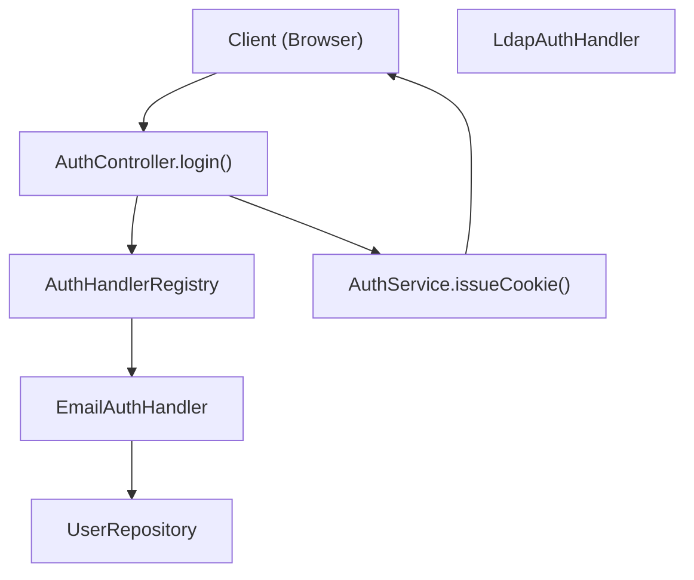
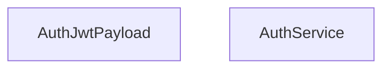

# 用户管理与身份验证

相关源文件

-   [packages/@n8n/api-types/src/dto/auth/\_\_tests\_\_/resolve-signup-token-query.dto.test.ts](https://github.com/n8n-io/n8n/blob/88f170b9/packages/@n8n/api-types/src/dto/auth/__tests__/resolve-signup-token-query.dto.test.ts)
-   [packages/@n8n/api-types/src/dto/auth/resolve-signup-token-query.dto.ts](https://github.com/n8n-io/n8n/blob/88f170b9/packages/@n8n/api-types/src/dto/auth/resolve-signup-token-query.dto.ts)
-   [packages/@n8n/api-types/src/dto/invitation/\_\_tests\_\_/accept-invitation-request.dto.test.ts](https://github.com/n8n-io/n8n/blob/88f170b9/packages/@n8n/api-types/src/dto/invitation/__tests__/accept-invitation-request.dto.test.ts)
-   [packages/@n8n/api-types/src/dto/invitation/accept-invitation-request.dto.ts](https://github.com/n8n-io/n8n/blob/88f170b9/packages/@n8n/api-types/src/dto/invitation/accept-invitation-request.dto.ts)
-   [packages/@n8n/api-types/src/dto/oidc/config.dto.ts](https://github.com/n8n-io/n8n/blob/88f170b9/packages/@n8n/api-types/src/dto/oidc/config.dto.ts)
-   [packages/@n8n/api-types/src/dto/provisioning/config.dto.ts](https://github.com/n8n-io/n8n/blob/88f170b9/packages/@n8n/api-types/src/dto/provisioning/config.dto.ts)
-   [packages/@n8n/api-types/src/dto/saml/\_\_tests\_\_/saml-preferences.dto.test.ts](https://github.com/n8n-io/n8n/blob/88f170b9/packages/@n8n/api-types/src/dto/saml/__tests__/saml-preferences.dto.test.ts)
-   [packages/@n8n/api-types/src/dto/saml/saml-preferences.dto.ts](https://github.com/n8n-io/n8n/blob/88f170b9/packages/@n8n/api-types/src/dto/saml/saml-preferences.dto.ts)
-   [packages/@n8n/config/src/configs/sso.config.ts](https://github.com/n8n-io/n8n/blob/88f170b9/packages/@n8n/config/src/configs/sso.config.ts)
-   [packages/cli/src/auth/\_\_tests\_\_/auth-service-browser-id-whitelist.test.ts](https://github.com/n8n-io/n8n/blob/88f170b9/packages/cli/src/auth/__tests__/auth-service-browser-id-whitelist.test.ts)
-   [packages/cli/src/auth/\_\_tests\_\_/auth.service.test.ts](https://github.com/n8n-io/n8n/blob/88f170b9/packages/cli/src/auth/__tests__/auth.service.test.ts)
-   [packages/cli/src/auth/auth.service.ts](https://github.com/n8n-io/n8n/blob/88f170b9/packages/cli/src/auth/auth.service.ts)
-   [packages/cli/src/auth/handlers/\_\_tests\_\_/email.auth-handler.test.ts](https://github.com/n8n-io/n8n/blob/88f170b9/packages/cli/src/auth/handlers/__tests__/email.auth-handler.test.ts)
-   [packages/cli/src/auth/handlers/email.auth-handler.ts](https://github.com/n8n-io/n8n/blob/88f170b9/packages/cli/src/auth/handlers/email.auth-handler.ts)
-   [packages/cli/src/auth/jwt.ts](https://github.com/n8n-io/n8n/blob/88f170b9/packages/cli/src/auth/jwt.ts)
-   [packages/cli/src/commands/user-management/reset.ts](https://github.com/n8n-io/n8n/blob/88f170b9/packages/cli/src/commands/user-management/reset.ts)
-   [packages/cli/src/controllers/\_\_tests\_\_/auth.controller.test.ts](https://github.com/n8n-io/n8n/blob/88f170b9/packages/cli/src/controllers/__tests__/auth.controller.test.ts)
-   [packages/cli/src/controllers/\_\_tests\_\_/invitation.controller.test.ts](https://github.com/n8n-io/n8n/blob/88f170b9/packages/cli/src/controllers/__tests__/invitation.controller.test.ts)
-   [packages/cli/src/controllers/\_\_tests\_\_/me.controller.test.ts](https://github.com/n8n-io/n8n/blob/88f170b9/packages/cli/src/controllers/__tests__/me.controller.test.ts)
-   [packages/cli/src/controllers/auth.controller.ts](https://github.com/n8n-io/n8n/blob/88f170b9/packages/cli/src/controllers/auth.controller.ts)
-   [packages/cli/src/controllers/invitation.controller.ts](https://github.com/n8n-io/n8n/blob/88f170b9/packages/cli/src/controllers/invitation.controller.ts)
-   [packages/cli/src/controllers/me.controller.ts](https://github.com/n8n-io/n8n/blob/88f170b9/packages/cli/src/controllers/me.controller.ts)
-   [packages/cli/src/controllers/mfa.controller.ts](https://github.com/n8n-io/n8n/blob/88f170b9/packages/cli/src/controllers/mfa.controller.ts)
-   [packages/cli/src/controllers/owner.controller.ts](https://github.com/n8n-io/n8n/blob/88f170b9/packages/cli/src/controllers/owner.controller.ts)
-   [packages/cli/src/controllers/users.controller.ts](https://github.com/n8n-io/n8n/blob/88f170b9/packages/cli/src/controllers/users.controller.ts)
-   [packages/cli/src/mfa/mfa.service.ts](https://github.com/n8n-io/n8n/blob/88f170b9/packages/cli/src/mfa/mfa.service.ts)
-   [packages/cli/src/modules/mcp/\_\_tests\_\_/mcp.settings.service.test.ts](https://github.com/n8n-io/n8n/blob/88f170b9/packages/cli/src/modules/mcp/__tests__/mcp.settings.service.test.ts)
-   [packages/cli/src/modules/mcp/mcp.settings.service.ts](https://github.com/n8n-io/n8n/blob/88f170b9/packages/cli/src/modules/mcp/mcp.settings.service.ts)
-   [packages/cli/src/modules/provisioning.ee/\_\_tests\_\_/provisioning.controller.ee.test.ts](https://github.com/n8n-io/n8n/blob/88f170b9/packages/cli/src/modules/provisioning.ee/__tests__/provisioning.controller.ee.test.ts)
-   [packages/cli/src/modules/provisioning.ee/\_\_tests\_\_/provisioning.service.ee.test.ts](https://github.com/n8n-io/n8n/blob/88f170b9/packages/cli/src/modules/provisioning.ee/__tests__/provisioning.service.ee.test.ts)
-   [packages/cli/src/modules/provisioning.ee/provisioning.controller.ee.ts](https://github.com/n8n-io/n8n/blob/88f170b9/packages/cli/src/modules/provisioning.ee/provisioning.controller.ee.ts)
-   [packages/cli/src/modules/provisioning.ee/provisioning.service.ee.ts](https://github.com/n8n-io/n8n/blob/88f170b9/packages/cli/src/modules/provisioning.ee/provisioning.service.ee.ts)
-   [packages/cli/src/modules/sso-oidc/\_\_tests\_\_/oidc.controller.ee.test.ts](https://github.com/n8n-io/n8n/blob/88f170b9/packages/cli/src/modules/sso-oidc/__tests__/oidc.controller.ee.test.ts)
-   [packages/cli/src/modules/sso-oidc/\_\_tests\_\_/oidc.service.ee.test.ts](https://github.com/n8n-io/n8n/blob/88f170b9/packages/cli/src/modules/sso-oidc/__tests__/oidc.service.ee.test.ts)
-   [packages/cli/src/modules/sso-oidc/constants.ts](https://github.com/n8n-io/n8n/blob/88f170b9/packages/cli/src/modules/sso-oidc/constants.ts)
-   [packages/cli/src/modules/sso-oidc/oidc.controller.ee.ts](https://github.com/n8n-io/n8n/blob/88f170b9/packages/cli/src/modules/sso-oidc/oidc.controller.ee.ts)
-   [packages/cli/src/modules/sso-oidc/oidc.service.ee.ts](https://github.com/n8n-io/n8n/blob/88f170b9/packages/cli/src/modules/sso-oidc/oidc.service.ee.ts)
-   [packages/cli/src/modules/sso-saml/\_\_tests\_\_/saml-signing-test-fixtures.ts](https://github.com/n8n-io/n8n/blob/88f170b9/packages/cli/src/modules/sso-saml/__tests__/saml-signing-test-fixtures.ts)
-   [packages/cli/src/modules/sso-saml/\_\_tests\_\_/saml.controller.ee.test.ts](https://github.com/n8n-io/n8n/blob/88f170b9/packages/cli/src/modules/sso-saml/__tests__/saml.controller.ee.test.ts)
-   [packages/cli/src/modules/sso-saml/\_\_tests\_\_/saml.service.ee.test.ts](https://github.com/n8n-io/n8n/blob/88f170b9/packages/cli/src/modules/sso-saml/__tests__/saml.service.ee.test.ts)
-   [packages/cli/src/modules/sso-saml/saml-validator.ts](https://github.com/n8n-io/n8n/blob/88f170b9/packages/cli/src/modules/sso-saml/saml-validator.ts)
-   [packages/cli/src/modules/sso-saml/saml.controller.ee.ts](https://github.com/n8n-io/n8n/blob/88f170b9/packages/cli/src/modules/sso-saml/saml.controller.ee.ts)
-   [packages/cli/src/modules/sso-saml/saml.service.ee.ts](https://github.com/n8n-io/n8n/blob/88f170b9/packages/cli/src/modules/sso-saml/saml.service.ee.ts)
-   [packages/cli/src/requests.ts](https://github.com/n8n-io/n8n/blob/88f170b9/packages/cli/src/requests.ts)
-   [packages/cli/src/services/\_\_tests\_\_/hooks.service.test.ts](https://github.com/n8n-io/n8n/blob/88f170b9/packages/cli/src/services/__tests__/hooks.service.test.ts)
-   [packages/cli/src/services/\_\_tests\_\_/url.service.test.ts](https://github.com/n8n-io/n8n/blob/88f170b9/packages/cli/src/services/__tests__/url.service.test.ts)
-   [packages/cli/src/services/\_\_tests\_\_/user.service.test.ts](https://github.com/n8n-io/n8n/blob/88f170b9/packages/cli/src/services/__tests__/user.service.test.ts)
-   [packages/cli/src/services/hooks.service.ts](https://github.com/n8n-io/n8n/blob/88f170b9/packages/cli/src/services/hooks.service.ts)
-   [packages/cli/src/services/jwt.service.ts](https://github.com/n8n-io/n8n/blob/88f170b9/packages/cli/src/services/jwt.service.ts)
-   [packages/cli/src/services/url.service.ts](https://github.com/n8n-io/n8n/blob/88f170b9/packages/cli/src/services/url.service.ts)
-   [packages/cli/src/services/user.service.ts](https://github.com/n8n-io/n8n/blob/88f170b9/packages/cli/src/services/user.service.ts)
-   [packages/cli/src/sso.ee/\_\_tests\_\_/sso-helpers.test.ts](https://github.com/n8n-io/n8n/blob/88f170b9/packages/cli/src/sso.ee/__tests__/sso-helpers.test.ts)
-   [packages/cli/src/sso.ee/sso-helpers.ts](https://github.com/n8n-io/n8n/blob/88f170b9/packages/cli/src/sso.ee/sso-helpers.ts)
-   [packages/cli/test/integration/auth.api.test.ts](https://github.com/n8n-io/n8n/blob/88f170b9/packages/cli/test/integration/auth.api.test.ts)
-   [packages/cli/test/integration/auth.mw.test.ts](https://github.com/n8n-io/n8n/blob/88f170b9/packages/cli/test/integration/auth.mw.test.ts)
-   [packages/cli/test/integration/commands/reset.cmd.test.ts](https://github.com/n8n-io/n8n/blob/88f170b9/packages/cli/test/integration/commands/reset.cmd.test.ts)
-   [packages/cli/test/integration/me.api.test.ts](https://github.com/n8n-io/n8n/blob/88f170b9/packages/cli/test/integration/me.api.test.ts)
-   [packages/cli/test/integration/mfa/mfa.api.test.ts](https://github.com/n8n-io/n8n/blob/88f170b9/packages/cli/test/integration/mfa/mfa.api.test.ts)
-   [packages/cli/test/integration/oidc/oidc.service.ee.test.ts](https://github.com/n8n-io/n8n/blob/88f170b9/packages/cli/test/integration/oidc/oidc.service.ee.test.ts)
-   [packages/cli/test/integration/owner.api.test.ts](https://github.com/n8n-io/n8n/blob/88f170b9/packages/cli/test/integration/owner.api.test.ts)
-   [packages/cli/test/integration/saml/saml-helpers.test.ts](https://github.com/n8n-io/n8n/blob/88f170b9/packages/cli/test/integration/saml/saml-helpers.test.ts)
-   [packages/cli/test/integration/saml/saml.api.test.ts](https://github.com/n8n-io/n8n/blob/88f170b9/packages/cli/test/integration/saml/saml.api.test.ts)
-   [packages/cli/test/integration/saml/sample-metadata.ts](https://github.com/n8n-io/n8n/blob/88f170b9/packages/cli/test/integration/saml/sample-metadata.ts)
-   [packages/cli/test/integration/shared/constants.ts](https://github.com/n8n-io/n8n/blob/88f170b9/packages/cli/test/integration/shared/constants.ts)
-   [packages/cli/test/integration/users.api.test.ts](https://github.com/n8n-io/n8n/blob/88f170b9/packages/cli/test/integration/users.api.test.ts)
-   [packages/frontend/@n8n/rest-api-client/src/api/sso.ts](https://github.com/n8n-io/n8n/blob/88f170b9/packages/frontend/@n8n/rest-api-client/src/api/sso.ts)
-   [packages/frontend/@n8n/rest-api-client/src/api/users.ts](https://github.com/n8n-io/n8n/blob/88f170b9/packages/frontend/@n8n/rest-api-client/src/api/users.ts)
-   [packages/frontend/editor-ui/src/features/core/auth/views/SignupView.test.ts](https://github.com/n8n-io/n8n/blob/88f170b9/packages/frontend/editor-ui/src/features/core/auth/views/SignupView.test.ts)
-   [packages/frontend/editor-ui/src/features/core/auth/views/SignupView.vue](https://github.com/n8n-io/n8n/blob/88f170b9/packages/frontend/editor-ui/src/features/core/auth/views/SignupView.vue)
-   [packages/frontend/editor-ui/src/features/settings/users/\_\_tests\_\_/invitation.api.test.ts](https://github.com/n8n-io/n8n/blob/88f170b9/packages/frontend/editor-ui/src/features/settings/users/__tests__/invitation.api.test.ts)
-   [packages/frontend/editor-ui/src/features/settings/users/components/InviteUsersModal.vue](https://github.com/n8n-io/n8n/blob/88f170b9/packages/frontend/editor-ui/src/features/settings/users/components/InviteUsersModal.vue)
-   [packages/frontend/editor-ui/src/features/settings/users/invitation.api.ts](https://github.com/n8n-io/n8n/blob/88f170b9/packages/frontend/editor-ui/src/features/settings/users/invitation.api.ts)
-   [packages/frontend/editor-ui/src/features/settings/users/users.store.ts](https://github.com/n8n-io/n8n/blob/88f170b9/packages/frontend/editor-ui/src/features/settings/users/users.store.ts)
-   [packages/frontend/editor-ui/src/features/settings/users/views/SettingsUsersView.test.ts](https://github.com/n8n-io/n8n/blob/88f170b9/packages/frontend/editor-ui/src/features/settings/users/views/SettingsUsersView.test.ts)
-   [packages/frontend/editor-ui/src/features/settings/users/views/SettingsUsersView.vue](https://github.com/n8n-io/n8n/blob/88f170b9/packages/frontend/editor-ui/src/features/settings/users/views/SettingsUsersView.vue)

本页记录了 n8n 的用户管理和身份验证系统，包括本地电子邮件/密码认证、企业级 SSO 方案（LDAP、SAML、OIDC）、用户角色以及会话管理。有关基于项目的资源共享和权限的信息，请参阅 [基于项目的授权与共享](/n8n-io/n8n/3.5-project-based-authorization-and-sharing)。

## 概述

n8n 支持通过环境变量配置并由 `AuthService` 和 `UserService` 管理的多种身份验证方法。系统使用存储在 HTTP-only Cookie 中的 JWT（JSON Web Token）进行会话管理，并与许可证系统集成以启用企业级身份验证功能。

**核心组件：**

-   **身份验证方法**：本地（电子邮件/密码）、LDAP、SAML、OIDC。
-   **用户角色**：全局角色（Owner、Admin、Member）和项目特定角色。
-   **会话管理**：具有可配置过期时间和浏览器指纹识别的 JWT 令牌。
-   **邀请系统**：基于 JWT 的防篡改邀请链接，可选 SMTP 集成。
-   **MFA**：基于 TOTP 的双因素身份验证，配有加密的恢复代码。

来源：[packages/cli/src/auth/auth.service.ts58-71](https://github.com/n8n-io/n8n/blob/88f170b9/packages/cli/src/auth/auth.service.ts#L58-L71) [packages/cli/src/services/user.service.ts40-53](https://github.com/n8n-io/n8n/blob/88f170b9/packages/cli/src/services/user.service.ts#L40-L53) [packages/cli/src/controllers/auth.controller.ts39-50](https://github.com/n8n-io/n8n/blob/88f170b9/packages/cli/src/controllers/auth.controller.ts#L39-L50)

## 身份验证架构

### 身份验证流程

`AuthController` 作为登录请求的主要入口点。它利用 `AuthHandlerRegistry` 将凭据验证委派给特定的处理程序（例如 `EmailAuthHandler`）。

**图表：身份验证与会话签发**

来源：[packages/cli/src/controllers/auth.controller.ts67-107](https://github.com/n8n-io/n8n/blob/88f170b9/packages/cli/src/controllers/auth.controller.ts#L67-L107) [packages/cli/src/auth/auth.service.ts204-225](https://github.com/n8n-io/n8n/blob/88f170b9/packages/cli/src/auth/auth.service.ts#L204-L225) [packages/cli/src/auth/auth-handler.registry.ts1-20](https://github.com/n8n-io/n8n/blob/88f170b9/packages/cli/src/auth/auth-handler.registry.ts#L1-L20)

### 代码到实体的映射：Auth 服务

| 系统名称 | 代码实体 | 角色 |
| --- | --- | --- |
| **Auth 控制器** | `AuthController` | 处理登录、退出及令牌解析。 |
| **Auth 服务** | `AuthService` | 管理 JWT 签发、Cookie 生命周期及身份验证中间件。 |
| **用户服务** | `UserService` | 处理用户 CRUD、邀请及公共数据映射的业务逻辑。 |
| **JWT 服务** | `JwtService` | 低级 JWT 签名及验证逻辑。 |
| **MFA 服务** | `MfaService` | TOTP 验证及恢复代码管理的逻辑。 |

来源：[packages/cli/src/controllers/auth.controller.ts39-50](https://github.com/n8n-io/n8n/blob/88f170b9/packages/cli/src/controllers/auth.controller.ts#L39-L50) [packages/cli/src/auth/auth.service.ts58-71](https://github.com/n8n-io/n8n/blob/88f170b9/packages/cli/src/auth/auth.service.ts#L58-L71) [packages/cli/src/services/user.service.ts40-53](https://github.com/n8n-io/n8n/blob/88f170b9/packages/cli/src/services/user.service.ts#L40-L53) [packages/cli/src/mfa/mfa.service.ts1-20](https://github.com/n8n-io/n8n/blob/88f170b9/packages/cli/src/mfa/mfa.service.ts#L1-L20)

## 身份验证方法

### 本地电子邮件/密码

本地身份验证使用 `PasswordUtility` 将提供的密码与存储在 `User` 实体中的 bcrypt 哈希进行比较。

-   **端点**：`POST /login` [packages/cli/src/controllers/auth.controller.ts67-107](https://github.com/n8n-io/n8n/blob/88f170b9/packages/cli/src/controllers/auth.controller.ts#L67-L107)
-   **速率限制**：实现了基于 IP 和基于电子邮件的速率限制器，以防止暴力破解攻击。[packages/cli/src/controllers/auth.controller.ts53-66](https://github.com/n8n-io/n8n/blob/88f170b9/packages/cli/src/controllers/auth.controller.ts#L53-L66)

### SSO (SAML & OIDC)

SSO 方法属于企业版功能。启用后，除非在用户设置中明确允许，否则非所有者（non-owner）用户的手动登录通常会被阻止。

-   **SAML**：通过 `SamlService` 和 `SamlController` 进行管理。它负责元数据生成和断言消费者服务（Assertion Consumer Service, ACS）回调。[packages/cli/test/integration/saml/saml.api.test.ts19-23](https://github.com/n8n-io/n8n/blob/88f170b9/packages/cli/test/integration/saml/saml.api.test.ts#L19-L23)
-   **OIDC**：通过 `OidcService` 管理。它使用 `openid-client` 进行发现（discovery）和授权码授予（authorization code grants）。[packages/cli/src/modules/sso-oidc/oidc.service.ee.ts25-45](https://github.com/n8n-io/n8n/blob/88f170b9/packages/cli/src/modules/sso-oidc/oidc.service.ee.ts#L25-L45)

### MFA (多因素身份验证)

MFA 使用 `MfaService` 来验证 TOTP 代码。如果通过许可证或全局配置强制执行 MFA，则用户在提供有效代码之前将无法访问大多数 API 端点。[packages/cli/src/auth/auth.service.ts112-135](https://github.com/n8n-io/n8n/blob/88f170b9/packages/cli/src/auth/auth.service.ts#L112-L135)

来源：[packages/cli/src/controllers/auth.controller.ts116-124](https://github.com/n8n-io/n8n/blob/88f170b9/packages/cli/src/controllers/auth.controller.ts#L116-L124) [packages/cli/src/mfa/mfa.service.ts1-20](https://github.com/n8n-io/n8n/blob/88f170b9/packages/cli/src/mfa/mfa.service.ts#L1-L20) [packages/cli/test/integration/oidc/oidc.service.ee.test.ts25-36](https://github.com/n8n-io/n8n/blob/88f170b9/packages/cli/test/integration/oidc/oidc.service.ee.test.ts#L25-L36)

## 用户生命周期与管理

### 用户 CRUD 操作

`UsersController` 和 `MeController` 管理用户数据。

-   **列出用户**：`GET /users` 通过 `UserRepository.buildUserQuery` 支持过滤、排序和分页。[packages/cli/src/controllers/users.controller.ts110-143](https://github.com/n8n-io/n8n/blob/88f170b9/packages/cli/src/controllers/users.controller.ts#L110-L143)
-   **更新个人资料**：`PATCH /me` 允许用户更新个人资料信息。如果用户是 SSO 用户，资料更新将受到限制，以防止与身份提供商（Identity Provider）发生数据不同步。[packages/cli/src/controllers/me.controller.ts44-79](https://github.com/n8n-io/n8n/blob/88f170b9/packages/cli/src/controllers/me.controller.ts#L44-L79)
-   **删除用户**：`DELETE /users/:id` 允许删除用户，并可选地通过 `transferId` 将其资源（工作流/凭据）转移给另一位用户。[packages/cli/src/controllers/users.controller.ts216-250](https://github.com/n8n-io/n8n/blob/88f170b9/packages/cli/src/controllers/users.controller.ts#L216-L250)

### 邀请系统

n8n 使用两步邀请流程：

1.  **发起邀请**：`POST /invitations` 创建一个“壳”用户记录，并生成包含 `inviterId`（邀请人 ID）和 `inviteeId`（受邀人 ID）的 JWT。[packages/cli/src/controllers/invitation.controller.ts42-90](https://github.com/n8n-io/n8n/blob/88f170b9/packages/cli/src/controllers/invitation.controller.ts#L42-L90)
2.  **接受邀请**：受邀者访问 `/signup?token=...` 并调用 `POST /invitations/accept` 设置其姓名和密码，从而完成账户创建。[packages/cli/src/controllers/invitation.controller.ts158-199](https://github.com/n8n-io/n8n/blob/88f170b9/packages/cli/src/controllers/invitation.controller.ts#L158-L199)

来源：[packages/cli/src/services/user.service.ts154-234](https://github.com/n8n-io/n8n/blob/88f170b9/packages/cli/src/services/user.service.ts#L154-L234) [packages/cli/src/controllers/invitation.controller.ts23-36](https://github.com/n8n-io/n8n/blob/88f170b9/packages/cli/src/controllers/invitation.controller.ts#L23-L36)

## 会话与 JWT 管理

### JWT 载荷与 Cookie

`AuthService` 签发一个存储在名为 `n8n-auth` 的 Cookie 中的 JWT。

**图表：Auth Service JWT 结构**

-   **哈希**：由用户的电子邮件和密码哈希派生而来，如果凭据更改，则使会话失效。[packages/cli/src/auth/auth.service.ts23-24](https://github.com/n8n-io/n8n/blob/88f170b9/packages/cli/src/auth/auth.service.ts#L23-L24)
-   **浏览器 ID**：客户端指纹，用于防止会话劫持。[packages/cli/src/auth/auth.service.ts25-26](https://github.com/n8n-io/n8n/blob/88f170b9/packages/cli/src/auth/auth.service.ts#L25-L26)
-   **失效处理**：注销时调用 `AuthService.invalidateToken()`，将其存储在 `InvalidAuthTokenRepository` 中直到过期。[packages/cli/src/auth/auth.service.ts188-202](https://github.com/n8n-io/n8n/blob/88f170b9/packages/cli/src/auth/auth.service.ts#L188-L202)

来源：[packages/cli/src/auth/auth.service.ts20-33](https://github.com/n8n-io/n8n/blob/88f170b9/packages/cli/src/auth/auth.service.ts#L20-L33) [packages/cli/src/auth/auth.service.ts96-157](https://github.com/n8n-io/n8n/blob/88f170b9/packages/cli/src/auth/auth.service.ts#L96-L157)

## 数据流：用户检索

当请求通过身份验证后，`AuthService` 从数据库中解析用户并将其附加到请求对象上。

> **[Mermaid sequence]**
> *(图表结构无法解析)*

**图表：请求身份验证序列**

来源：[packages/cli/src/auth/auth.service.ts101-140](https://github.com/n8n-io/n8n/blob/88f170b9/packages/cli/src/auth/auth.service.ts#L101-L140) [packages/cli/src/auth/auth.service.ts227-260](https://github.com/n8n-io/n8n/blob/88f170b9/packages/cli/src/auth/auth.service.ts#L227-L260)

## 密码重置流程

1.  **生成链接**：管理员或用户触发重置。`AuthService.generatePasswordResetUrl()` 创建一个签名令牌。[packages/cli/src/controllers/users.controller.ts145-165](https://github.com/n8n-io/n8n/blob/88f170b9/packages/cli/src/controllers/users.controller.ts#L145-L165)
2.  **电子邮件**：如果配置了 SMTP，`UserManagementMailer` 将发送该链接。[packages/cli/src/services/user.service.ts45-46](https://github.com/n8n-io/n8n/blob/88f170b9/packages/cli/src/services/user.service.ts#L45-L46)
3.  **重置**：用户通过经过令牌验证的请求提交新密码。[packages/cli/src/controllers/me.controller.ts168-210](https://github.com/n8n-io/n8n/blob/88f170b9/packages/cli/src/controllers/me.controller.ts#L168-L210)

来源：[packages/cli/src/auth/auth.service.ts279-299](https://github.com/n8n-io/n8n/blob/88f170b9/packages/cli/src/auth/auth.service.ts#L279-L299) [packages/cli/src/services/password.utility.ts1-20](https://github.com/n8n-io/n8n/blob/88f170b9/packages/cli/src/services/password.utility.ts#L1-L20)
