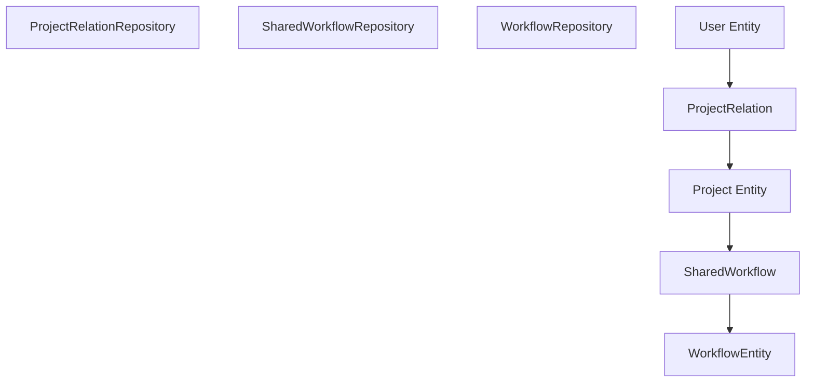

# 基于项目的授权与共享

相关源文件

-   [packages/@n8n/api-types/src/dto/folders/\_\_tests\_\_/list-folder-query.dto.test.ts](https://github.com/n8n-io/n8n/blob/88f170b9/packages/@n8n/api-types/src/dto/folders/__tests__/list-folder-query.dto.test.ts)
-   [packages/@n8n/api-types/src/dto/folders/\_\_tests\_\_/update-folder.request.dto.test.ts](https://github.com/n8n-io/n8n/blob/88f170b9/packages/@n8n/api-types/src/dto/folders/__tests__/update-folder.request.dto.test.ts)
-   [packages/@n8n/api-types/src/dto/folders/create-folder.dto.ts](https://github.com/n8n-io/n8n/blob/88f170b9/packages/@n8n/api-types/src/dto/folders/create-folder.dto.ts)
-   [packages/@n8n/api-types/src/dto/folders/delete-folder.dto.ts](https://github.com/n8n-io/n8n/blob/88f170b9/packages/@n8n/api-types/src/dto/folders/delete-folder.dto.ts)
-   [packages/@n8n/api-types/src/dto/folders/list-folder-query.dto.ts](https://github.com/n8n-io/n8n/blob/88f170b9/packages/@n8n/api-types/src/dto/folders/list-folder-query.dto.ts)
-   [packages/@n8n/api-types/src/dto/folders/update-folder.dto.ts](https://github.com/n8n-io/n8n/blob/88f170b9/packages/@n8n/api-types/src/dto/folders/update-folder.dto.ts)
-   [packages/@n8n/api-types/src/schemas/\_\_tests\_\_/folder.schema.test.ts](https://github.com/n8n-io/n8n/blob/88f170b9/packages/@n8n/api-types/src/schemas/__tests__/folder.schema.test.ts)
-   [packages/@n8n/api-types/src/schemas/folder.schema.ts](https://github.com/n8n-io/n8n/blob/88f170b9/packages/@n8n/api-types/src/schemas/folder.schema.ts)
-   [packages/@n8n/db/src/entities/execution-entity.ts](https://github.com/n8n-io/n8n/blob/88f170b9/packages/@n8n/db/src/entities/execution-entity.ts)
-   [packages/@n8n/db/src/entities/workflow-published-version.ts](https://github.com/n8n-io/n8n/blob/88f170b9/packages/@n8n/db/src/entities/workflow-published-version.ts)
-   [packages/@n8n/db/src/migrations/common/1768557000000-AddStoredAtToExecutionEntity.ts](https://github.com/n8n-io/n8n/blob/88f170b9/packages/@n8n/db/src/migrations/common/1768557000000-AddStoredAtToExecutionEntity.ts)
-   [packages/@n8n/db/src/migrations/common/1772619247762-ChangeWorkflowPublishedVersionFKsToRestrict.ts](https://github.com/n8n-io/n8n/blob/88f170b9/packages/@n8n/db/src/migrations/common/1772619247762-ChangeWorkflowPublishedVersionFKsToRestrict.ts)
-   [packages/@n8n/db/src/repositories/folder-tag-mapping.repository.ts](https://github.com/n8n-io/n8n/blob/88f170b9/packages/@n8n/db/src/repositories/folder-tag-mapping.repository.ts)
-   [packages/@n8n/db/src/repositories/folder.repository.ts](https://github.com/n8n-io/n8n/blob/88f170b9/packages/@n8n/db/src/repositories/folder.repository.ts)
-   [packages/@n8n/db/src/repositories/invalid-auth-token.repository.ts](https://github.com/n8n-io/n8n/blob/88f170b9/packages/@n8n/db/src/repositories/invalid-auth-token.repository.ts)
-   [packages/@n8n/db/src/repositories/processed-data.repository.ts](https://github.com/n8n-io/n8n/blob/88f170b9/packages/@n8n/db/src/repositories/processed-data.repository.ts)
-   [packages/@n8n/db/src/repositories/workflow-published-version.repository.ts](https://github.com/n8n-io/n8n/blob/88f170b9/packages/@n8n/db/src/repositories/workflow-published-version.repository.ts)
-   [packages/@n8n/db/src/utils/test-utils/mock-entity-manager.ts](https://github.com/n8n-io/n8n/blob/88f170b9/packages/@n8n/db/src/utils/test-utils/mock-entity-manager.ts)
-   [packages/@n8n/db/src/utils/test-utils/mock-instance.ts](https://github.com/n8n-io/n8n/blob/88f170b9/packages/@n8n/db/src/utils/test-utils/mock-instance.ts)
-   [packages/@n8n/permissions/src/\_\_tests\_\_/\_\_snapshots\_\_/scope-information.test.ts.snap](https://github.com/n8n-io/n8n/blob/88f170b9/packages/@n8n/permissions/src/__tests__/__snapshots__/scope-information.test.ts.snap)
-   [packages/@n8n/permissions/src/constants.ee.ts](https://github.com/n8n-io/n8n/blob/88f170b9/packages/@n8n/permissions/src/constants.ee.ts)
-   [packages/@n8n/permissions/src/public-api-permissions.ee.ts](https://github.com/n8n-io/n8n/blob/88f170b9/packages/@n8n/permissions/src/public-api-permissions.ee.ts)
-   [packages/@n8n/permissions/src/roles/scopes/global-scopes.ee.ts](https://github.com/n8n-io/n8n/blob/88f170b9/packages/@n8n/permissions/src/roles/scopes/global-scopes.ee.ts)
-   [packages/@n8n/permissions/src/roles/scopes/project-scopes.ee.ts](https://github.com/n8n-io/n8n/blob/88f170b9/packages/@n8n/permissions/src/roles/scopes/project-scopes.ee.ts)
-   [packages/@n8n/permissions/src/roles/scopes/workflow-sharing-scopes.ee.ts](https://github.com/n8n-io/n8n/blob/88f170b9/packages/@n8n/permissions/src/roles/scopes/workflow-sharing-scopes.ee.ts)
-   [packages/@n8n/permissions/src/scope-information.ts](https://github.com/n8n-io/n8n/blob/88f170b9/packages/@n8n/permissions/src/scope-information.ts)
-   [packages/@n8n/permissions/src/utilities/\_\_tests\_\_/get-resource-permissions.test.ts](https://github.com/n8n-io/n8n/blob/88f170b9/packages/@n8n/permissions/src/utilities/__tests__/get-resource-permissions.test.ts)
-   [packages/cli/src/\_\_tests\_\_/workflow-helpers.test.ts](https://github.com/n8n-io/n8n/blob/88f170b9/packages/cli/src/__tests__/workflow-helpers.test.ts)
-   [packages/cli/src/controllers/folder.controller.ts](https://github.com/n8n-io/n8n/blob/88f170b9/packages/cli/src/controllers/folder.controller.ts)
-   [packages/cli/src/executions/\_\_tests\_\_/execution-redaction-proxy.service.test.ts](https://github.com/n8n-io/n8n/blob/88f170b9/packages/cli/src/executions/__tests__/execution-redaction-proxy.service.test.ts)
-   [packages/cli/src/executions/execution-redaction-proxy.service.ts](https://github.com/n8n-io/n8n/blob/88f170b9/packages/cli/src/executions/execution-redaction-proxy.service.ts)
-   [packages/cli/src/public-api/types.ts](https://github.com/n8n-io/n8n/blob/88f170b9/packages/cli/src/public-api/types.ts)
-   [packages/cli/src/public-api/v1/handlers/discover/\_\_tests\_\_/discover.handler.test.ts](https://github.com/n8n-io/n8n/blob/88f170b9/packages/cli/src/public-api/v1/handlers/discover/__tests__/discover.handler.test.ts)
-   [packages/cli/src/public-api/v1/handlers/discover/\_\_tests\_\_/discover.service.test.ts](https://github.com/n8n-io/n8n/blob/88f170b9/packages/cli/src/public-api/v1/handlers/discover/__tests__/discover.service.test.ts)
-   [packages/cli/src/public-api/v1/handlers/discover/discover.handler.ts](https://github.com/n8n-io/n8n/blob/88f170b9/packages/cli/src/public-api/v1/handlers/discover/discover.handler.ts)
-   [packages/cli/src/public-api/v1/handlers/discover/discover.service.ts](https://github.com/n8n-io/n8n/blob/88f170b9/packages/cli/src/public-api/v1/handlers/discover/discover.service.ts)
-   [packages/cli/src/public-api/v1/handlers/discover/spec/paths/discover.yml](https://github.com/n8n-io/n8n/blob/88f170b9/packages/cli/src/public-api/v1/handlers/discover/spec/paths/discover.yml)
-   [packages/cli/src/public-api/v1/handlers/executions/executions.handler.ts](https://github.com/n8n-io/n8n/blob/88f170b9/packages/cli/src/public-api/v1/handlers/executions/executions.handler.ts)
-   [packages/cli/src/public-api/v1/handlers/executions/spec/paths/executions.yml](https://github.com/n8n-io/n8n/blob/88f170b9/packages/cli/src/public-api/v1/handlers/executions/spec/paths/executions.yml)
-   [packages/cli/src/public-api/v1/handlers/executions/spec/schemas/execution.yml](https://github.com/n8n-io/n8n/blob/88f170b9/packages/cli/src/public-api/v1/handlers/executions/spec/schemas/execution.yml)
-   [packages/cli/src/public-api/v1/handlers/workflows/workflows.handler.ts](https://github.com/n8n-io/n8n/blob/88f170b9/packages/cli/src/public-api/v1/handlers/workflows/workflows.handler.ts)
-   [packages/cli/src/public-api/v1/openapi.yml](https://github.com/n8n-io/n8n/blob/88f170b9/packages/cli/src/public-api/v1/openapi.yml)
-   [packages/cli/src/public-api/v1/shared/middlewares/global.middleware.ts](https://github.com/n8n-io/n8n/blob/88f170b9/packages/cli/src/public-api/v1/shared/middlewares/global.middleware.ts)
-   [packages/cli/src/public-api/v1/shared/spec/parameters/\_index.yml](https://github.com/n8n-io/n8n/blob/88f170b9/packages/cli/src/public-api/v1/shared/spec/parameters/_index.yml)
-   [packages/cli/src/services/folder.service.ts](https://github.com/n8n-io/n8n/blob/88f170b9/packages/cli/src/services/folder.service.ts)
-   [packages/cli/src/workflow-helpers.ts](https://github.com/n8n-io/n8n/blob/88f170b9/packages/cli/src/workflow-helpers.ts)
-   [packages/cli/src/workflows/\_\_tests\_\_/workflow-creation.service.test.ts](https://github.com/n8n-io/n8n/blob/88f170b9/packages/cli/src/workflows/__tests__/workflow-creation.service.test.ts)
-   [packages/cli/src/workflows/\_\_tests\_\_/workflow.service.test.ts](https://github.com/n8n-io/n8n/blob/88f170b9/packages/cli/src/workflows/__tests__/workflow.service.test.ts)
-   [packages/cli/src/workflows/\_\_tests\_\_/workflows.controller.test.ts](https://github.com/n8n-io/n8n/blob/88f170b9/packages/cli/src/workflows/__tests__/workflows.controller.test.ts)
-   [packages/cli/src/workflows/workflow-creation.service.ts](https://github.com/n8n-io/n8n/blob/88f170b9/packages/cli/src/workflows/workflow-creation.service.ts)
-   [packages/cli/src/workflows/workflow-finder.service.ts](https://github.com/n8n-io/n8n/blob/88f170b9/packages/cli/src/workflows/workflow-finder.service.ts)
-   [packages/cli/src/workflows/workflow.service.ee.ts](https://github.com/n8n-io/n8n/blob/88f170b9/packages/cli/src/workflows/workflow.service.ee.ts)
-   [packages/cli/src/workflows/workflow.service.ts](https://github.com/n8n-io/n8n/blob/88f170b9/packages/cli/src/workflows/workflow.service.ts)
-   [packages/cli/src/workflows/workflows.controller.ts](https://github.com/n8n-io/n8n/blob/88f170b9/packages/cli/src/workflows/workflows.controller.ts)
-   [packages/cli/test/integration/folder/folder.controller.test.ts](https://github.com/n8n-io/n8n/blob/88f170b9/packages/cli/test/integration/folder/folder.controller.test.ts)
-   [packages/cli/test/integration/public-api/discover.test.ts](https://github.com/n8n-io/n8n/blob/88f170b9/packages/cli/test/integration/public-api/discover.test.ts)
-   [packages/cli/test/integration/public-api/endpoints-with-scopes-enabled.test.ts](https://github.com/n8n-io/n8n/blob/88f170b9/packages/cli/test/integration/public-api/endpoints-with-scopes-enabled.test.ts)
-   [packages/cli/test/integration/public-api/executions.test.ts](https://github.com/n8n-io/n8n/blob/88f170b9/packages/cli/test/integration/public-api/executions.test.ts)
-   [packages/cli/test/integration/public-api/workflows.test.ts](https://github.com/n8n-io/n8n/blob/88f170b9/packages/cli/test/integration/public-api/workflows.test.ts)
-   [packages/cli/test/integration/shared/db/folders.ts](https://github.com/n8n-io/n8n/blob/88f170b9/packages/cli/test/integration/shared/db/folders.ts)
-   [packages/cli/test/integration/workflows/workflow.service.test.ts](https://github.com/n8n-io/n8n/blob/88f170b9/packages/cli/test/integration/workflows/workflow.service.test.ts)
-   [packages/cli/test/integration/workflows/workflows.controller.ee.test.ts](https://github.com/n8n-io/n8n/blob/88f170b9/packages/cli/test/integration/workflows/workflows.controller.ee.test.ts)
-   [packages/cli/test/integration/workflows/workflows.controller.test.ts](https://github.com/n8n-io/n8n/blob/88f170b9/packages/cli/test/integration/workflows/workflows.controller.test.ts)
-   [packages/frontend/editor-ui/src/app/api/workflows.test.ts](https://github.com/n8n-io/n8n/blob/88f170b9/packages/frontend/editor-ui/src/app/api/workflows.test.ts)
-   [packages/frontend/editor-ui/src/app/stores/rbac.store.ts](https://github.com/n8n-io/n8n/blob/88f170b9/packages/frontend/editor-ui/src/app/stores/rbac.store.ts)
-   [packages/nodes-base/nodes/N8n/n8n-api-coverage.json](https://github.com/n8n-io/n8n/blob/88f170b9/packages/nodes-base/nodes/N8n/n8n-api-coverage.json)
-   [packages/nodes-base/nodes/N8n/test/N8n.api-coverage.test.ts](https://github.com/n8n-io/n8n/blob/88f170b9/packages/nodes-base/nodes/N8n/test/N8n.api-coverage.test.ts)
-   [packages/testing/playwright/services/public-api-helper.ts](https://github.com/n8n-io/n8n/blob/88f170b9/packages/testing/playwright/services/public-api-helper.ts)
-   [packages/testing/playwright/tests/e2e/api/discovery.spec.ts](https://github.com/n8n-io/n8n/blob/88f170b9/packages/testing/playwright/tests/e2e/api/discovery.spec.ts)

## 目的与范围

本文档解释了 n8n 基于项目的授权系统，该系统控制对工作流、凭据和文件夹的访问。内容涵盖了全局角色与项目角色的区别、资源共享机制，以及使用 `@n8n/permissions` 包和 `@ProjectScope` 装饰器的基于 Scope（范围）权限的技术实现。

---

## 全局角色与项目角色

n8n 使用两级角色系统，以平衡实例范围的管理与精细的资源控制。

### 全局角色

全局角色决定了实例范围内的权限，并在实例级别分配给用户。这些角色通常存储在 `User` 实体中。

| 角色 Slug | 描述 | 关键权限 |
| --- | --- | --- |
| `global:owner` | 实例所有者 | 对所有资源和设置拥有完全控制权。 |
| `global:admin` | 管理员 | 拥有用户管理和设置的更高权限。 |
| `global:member` | 标准用户 | 访问自己的资源及共享团队项目。 |

来源：[packages/@n8n/permissions/src/roles/scopes/global-scopes.ee.ts3-176](https://github.com/n8n-io/n8n/blob/88f170b9/packages/@n8n/permissions/src/roles/scopes/global-scopes.ee.ts#L3-L176) [packages/cli/src/workflows/workflows.controller.ts193-194](https://github.com/n8n-io/n8n/blob/88f170b9/packages/cli/src/workflows/workflows.controller.ts#L193-L194)

### 项目角色

项目角色决定了特定项目内的权限，通过 `ProjectRelation` 实体进行分配。

| 角色 Slug | 描述 | 典型 Scope |
| --- | --- | --- |
| `project:personalOwner` | 个人项目的所有者 | 所有的资源操作权限。 |
| `project:admin` | 项目管理员 | 管理项目成员和所有资源。 |
| `project:editor` | 资源编辑者 | 创建、更新、执行和删除资源。 |
| `project:viewer` | 只读查看者 | 仅限读取和列出资源。 |

来源：[packages/@n8n/permissions/src/constants.ee.ts81-85](https://github.com/n8n-io/n8n/blob/88f170b9/packages/@n8n/permissions/src/constants.ee.ts#L81-L85) [packages/cli/src/workflows/workflow.service.ts145-150](https://github.com/n8n-io/n8n/blob/88f170b9/packages/cli/src/workflows/workflow.service.ts#L145-L150)

---

## 项目系统架构

n8n 将资源组织为**项目（Projects）**。每个用户都有一个 `personal`（个人）项目，且用户可以是多个 `team`（团队）项目的成员。

### 资源所有权与共享

资源（工作流、凭据、文件夹）通过“共享”桥接表（例如 `SharedWorkflow`）链接到项目。一个资源有一个**主项目（Home Project）**（即其创建位置），但可以与多个其他项目共享。

**图表：项目授权的实体关系**

来源：[packages/cli/src/workflows/workflow.service.ts11-21](https://github.com/n8n-io/n8n/blob/88f170b9/packages/cli/src/workflows/workflow.service.ts#L11-L21) [packages/cli/src/workflows/workflows.controller.ts14-21](https://github.com/n8n-io/n8n/blob/88f170b9/packages/cli/src/workflows/workflows.controller.ts#L14-L21)

---

## Scope 与权限的实现

权限被定义为 **Scope（范围）**（例如 `workflow:read`、`credential:share`）。`@n8n/permissions` 包定义了可用的资源和操作。

### 资源 Scope

资源定义了有效的操作，如 `create`（创建）、`read`（读取）、`update`（更新）、`delete`（删除）、`list`（列出）、`share`（共享）、`move`（移动）和 `execute`（执行）。

来源：[packages/@n8n/permissions/src/constants.ee.ts3-63](https://github.com/n8n-io/n8n/blob/88f170b9/packages/@n8n/permissions/src/constants.ee.ts#L3-L63)

### @ProjectScope 装饰器

`@ProjectScope` 装饰器用于 RestController 中，以便在请求到达处理程序（handler）之前强制执行授权。它会验证经过身份验证的用户是否拥有请求参数中指定资源的所需 Scope。

> **[Mermaid sequence]**
> *(图表结构无法解析)*

**图表：通过 ProjectScope 装饰器的授权流程**

来源：[packages/cli/src/workflows/workflows.controller.ts30-34](https://github.com/n8n-io/n8n/blob/88f170b9/packages/cli/src/workflows/workflows.controller.ts#L30-L34) [packages/cli/src/workflows/workflow.service.ts100-168](https://github.com/n8n-io/n8n/blob/88f170b9/packages/cli/src/workflows/workflow.service.ts#L100-L168)

---

## 工作流与文件夹管理

### 工作流共享

工作流可以与其他项目共享。`EnterpriseWorkflowService` 处理添加 `SharedWorkflow` 条目的逻辑。

来源：[packages/cli/src/workflows/workflow.service.ee.ts60-91](https://github.com/n8n-io/n8n/blob/88f170b9/packages/cli/src/workflows/workflow.service.ee.ts#L60-L91)

### 文件夹系统

文件夹在项目内提供层级化组织。文件夹的权限检查方式与工作流类似，通常需要 `folder:list` 或 `folder:read` Scope。

**关键操作：**

-   **创建**：需要在目标项目中拥有 `folder:create` 权限。
-   **移动**：文件夹可以在项目层级内移动，但在没有转移（transfer）的情况下不能跨项目移动。
-   **扁平化（Flattening）**：删除文件夹时，其内容可以被“扁平化”（移动到根目录）并归档。

来源：[packages/cli/src/services/folder.service.ts39-54](https://github.com/n8n-io/n8n/blob/88f170b9/packages/cli/src/services/folder.service.ts#L39-L54) [packages/cli/src/services/folder.service.ts149-160](https://github.com/n8n-io/n8n/blob/88f170b9/packages/cli/src/services/folder.service.ts#L149-L160) [packages/cli/test/integration/folder/folder.controller.test.ts139-151](https://github.com/n8n-io/n8n/blob/88f170b9/packages/cli/test/integration/folder/folder.controller.test.ts#L139-L151)

---

## 数据流：获取具有权限的资源

在获取工作流（例如在 `WorkflowService.getMany` 中）时，系统使用复杂的子查询，根据用户的项目成员身份和角色来过滤结果。

1.  **确定项目上下文**：如果提供了 `projectId` 过滤器，系统会检查它是个人项目还是团队项目 [packages/cli/src/workflows/workflow.service.ts114-123](https://github.com/n8n-io/n8n/blob/88f170b9/packages/cli/src/workflows/workflow.service.ts#L114-L123)
2.  **解析角色**：`RoleService` 识别哪些项目角色包含所需的 Scope [packages/cli/src/workflows/workflow.service.ts145-146](https://github.com/n8n-io/n8n/blob/88f170b9/packages/cli/src/workflows/workflow.service.ts#L145-L146)
3.  **子查询过滤**：`WorkflowRepository` 执行 `getManyAndCountWithSharingSubquery`，该方法将工作流与其共享记录连接起来，并按用户可访问的项目进行过滤 [packages/cli/src/workflows/workflow.service.ts163-168](https://github.com/n8n-io/n8n/blob/88f170b9/packages/cli/src/workflows/workflow.service.ts#L163-L168)
4.  **Scope 注入**：如果被请求，系统会计算并附加用户对每个返回的工作流拥有的具体 Scope [packages/cli/src/workflows/workflow.service.ts181-182](https://github.com/n8n-io/n8n/blob/88f170b9/packages/cli/src/workflows/workflow.service.ts#L181-L182)

来源：[packages/cli/src/workflows/workflow.service.ts100-182](https://github.com/n8n-io/n8n/blob/88f170b9/packages/cli/src/workflows/workflow.service.ts#L100-L182) [packages/cli/src/services/role.service.ts1-100](https://github.com/n8n-io/n8n/blob/88f170b9/packages/cli/src/services/role.service.ts#L1-L100)

---

## 安全：防止篡改

`EnterpriseWorkflowService` 包含一个 `preventTampering` 方法。这确保了在更新工作流时，用户不能通过将新版本与之前的数据库状态及用户允许的凭据进行比较，来注入其无权访问的凭据。

来源：[packages/cli/src/workflows/workflow.service.ee.ts165-187](https://github.com/n8n-io/n8n/blob/88f170b9/packages/cli/src/workflows/workflow.service.ee.ts#L165-L187) [packages/cli/src/workflows/workflow.service.ee.ts189-195](https://github.com/n8n-io/n8n/blob/88f170b9/packages/cli/src/workflows/workflow.service.ee.ts#L189-L195)
