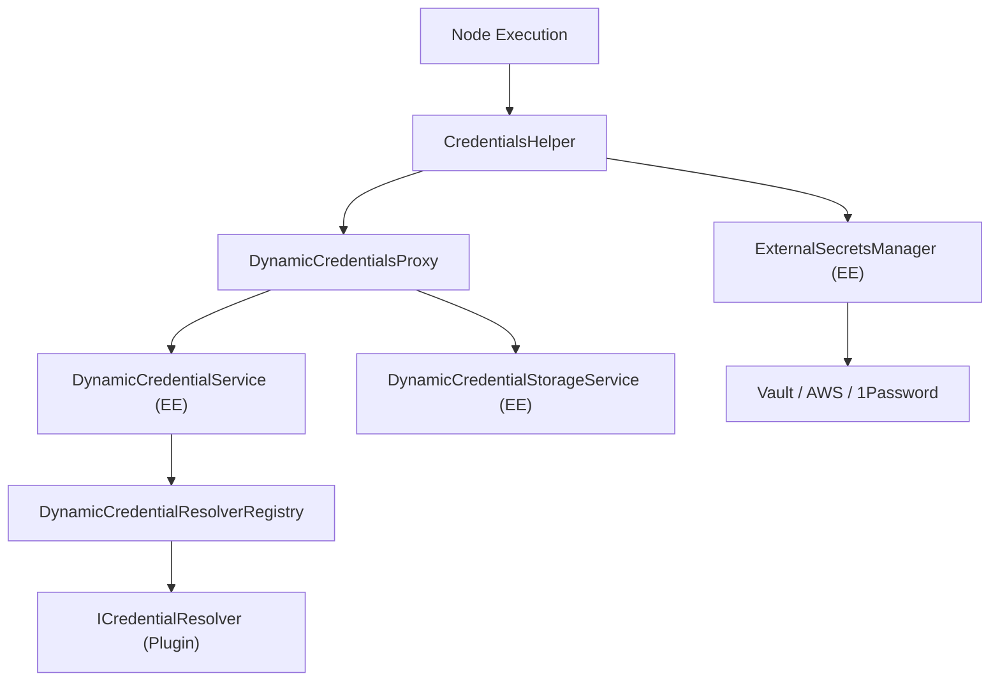
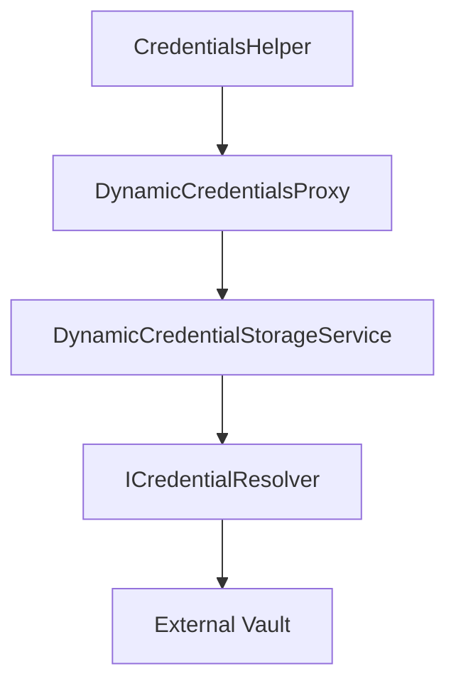

# 动态凭证与外部密钥管理 (Dynamic Credentials and External Secrets)

相关源文件

-   [packages/@n8n/api-types/src/dto/secrets-provider/update-secrets-provider-connection.dto.ts](https://github.com/n8n-io/n8n/blob/88f170b9/packages/@n8n/api-types/src/dto/secrets-provider/update-secrets-provider-connection.dto.ts)
-   [packages/@n8n/api-types/src/schemas/secrets-provider.schema.ts](https://github.com/n8n-io/n8n/blob/88f170b9/packages/@n8n/api-types/src/schemas/secrets-provider.schema.ts)
-   [packages/@n8n/db/src/repositories/secrets-provider-connection.repository.ee.ts](https://github.com/n8n-io/n8n/blob/88f170b9/packages/@n8n/db/src/repositories/secrets-provider-connection.repository.ee.ts)
-   [packages/cli/src/\_\_tests\_\_/credentials-helper.test.ts](https://github.com/n8n-io/n8n/blob/88f170b9/packages/cli/src/__tests__/credentials-helper.test.ts)
-   [packages/cli/src/credentials-helper.ts](https://github.com/n8n-io/n8n/blob/88f170b9/packages/cli/src/credentials-helper.ts)
-   [packages/cli/src/credentials/\_\_tests\_\_/dynamic-credentials-proxy.test.ts](https://github.com/n8n-io/n8n/blob/88f170b9/packages/cli/src/credentials/__tests__/dynamic-credentials-proxy.test.ts)
-   [packages/cli/src/credentials/credential-resolution-provider.interface.ts](https://github.com/n8n-io/n8n/blob/88f170b9/packages/cli/src/credentials/credential-resolution-provider.interface.ts)
-   [packages/cli/src/credentials/dynamic-credentials-proxy.ts](https://github.com/n8n-io/n8n/blob/88f170b9/packages/cli/src/credentials/dynamic-credentials-proxy.ts)
-   [packages/cli/src/modules/dynamic-credentials.ee/dynamic-credentials.module.ts](https://github.com/n8n-io/n8n/blob/88f170b9/packages/cli/src/modules/dynamic-credentials.ee/dynamic-credentials.module.ts)
-   [packages/cli/src/modules/dynamic-credentials.ee/services/\_\_tests\_\_/credential-check-proxy.service.test.ts](https://github.com/n8n-io/n8n/blob/88f170b9/packages/cli/src/modules/dynamic-credentials.ee/services/__tests__/credential-check-proxy.service.test.ts)
-   [packages/cli/src/modules/dynamic-credentials.ee/services/\_\_tests\_\_/credential-resolver-registry.service.test.ts](https://github.com/n8n-io/n8n/blob/88f170b9/packages/cli/src/modules/dynamic-credentials.ee/services/__tests__/credential-resolver-registry.service.test.ts)
-   [packages/cli/src/modules/dynamic-credentials.ee/services/\_\_tests\_\_/dynamic-credential-storage.service.test.ts](https://github.com/n8n-io/n8n/blob/88f170b9/packages/cli/src/modules/dynamic-credentials.ee/services/__tests__/dynamic-credential-storage.service.test.ts)
-   [packages/cli/src/modules/dynamic-credentials.ee/services/\_\_tests\_\_/dynamic-credential.service.test.ts](https://github.com/n8n-io/n8n/blob/88f170b9/packages/cli/src/modules/dynamic-credentials.ee/services/__tests__/dynamic-credential.service.test.ts)
-   [packages/cli/src/modules/dynamic-credentials.ee/services/credential-check-proxy.service.ts](https://github.com/n8n-io/n8n/blob/88f170b9/packages/cli/src/modules/dynamic-credentials.ee/services/credential-check-proxy.service.ts)
-   [packages/cli/src/modules/dynamic-credentials.ee/services/credential-resolver-registry.service.ts](https://github.com/n8n-io/n8n/blob/88f170b9/packages/cli/src/modules/dynamic-credentials.ee/services/credential-resolver-registry.service.ts)
-   [packages/cli/src/modules/dynamic-credentials.ee/services/dynamic-credential-storage.service.ts](https://github.com/n8n-io/n8n/blob/88f170b9/packages/cli/src/modules/dynamic-credentials.ee/services/dynamic-credential-storage.service.ts)
-   [packages/cli/src/modules/dynamic-credentials.ee/services/dynamic-credential.service.ts](https://github.com/n8n-io/n8n/blob/88f170b9/packages/cli/src/modules/dynamic-credentials.ee/services/dynamic-credential.service.ts)
-   [packages/cli/src/modules/dynamic-credentials.ee/services/index.ts](https://github.com/n8n-io/n8n/blob/88f170b9/packages/cli/src/modules/dynamic-credentials.ee/services/index.ts)
-   [packages/cli/src/modules/external-secrets.ee/\_\_tests\_\_/external-secrets-manager.ee.test.ts](https://github.com/n8n-io/n8n/blob/88f170b9/packages/cli/src/modules/external-secrets.ee/__tests__/external-secrets-manager.ee.test.ts)
-   [packages/cli/src/modules/external-secrets.ee/\_\_tests\_\_/secrets-providers-connections.service.ee.test.ts](https://github.com/n8n-io/n8n/blob/88f170b9/packages/cli/src/modules/external-secrets.ee/__tests__/secrets-providers-connections.service.ee.test.ts)
-   [packages/cli/src/modules/external-secrets.ee/external-secrets-manager.ee.ts](https://github.com/n8n-io/n8n/blob/88f170b9/packages/cli/src/modules/external-secrets.ee/external-secrets-manager.ee.ts)
-   [packages/cli/src/modules/external-secrets.ee/external-secrets.config.ts](https://github.com/n8n-io/n8n/blob/88f170b9/packages/cli/src/modules/external-secrets.ee/external-secrets.config.ts)
-   [packages/cli/src/modules/external-secrets.ee/external-secrets.controller.ee.ts](https://github.com/n8n-io/n8n/blob/88f170b9/packages/cli/src/modules/external-secrets.ee/external-secrets.controller.ee.ts)
-   [packages/cli/src/modules/external-secrets.ee/secrets-providers-completions.controller.ee.ts](https://github.com/n8n-io/n8n/blob/88f170b9/packages/cli/src/modules/external-secrets.ee/secrets-providers-completions.controller.ee.ts)
-   [packages/cli/src/modules/external-secrets.ee/secrets-providers-connections.controller.ee.ts](https://github.com/n8n-io/n8n/blob/88f170b9/packages/cli/src/modules/external-secrets.ee/secrets-providers-connections.controller.ee.ts)
-   [packages/cli/src/modules/external-secrets.ee/secrets-providers-connections.service.ee.ts](https://github.com/n8n-io/n8n/blob/88f170b9/packages/cli/src/modules/external-secrets.ee/secrets-providers-connections.service.ee.ts)
-   [packages/cli/src/modules/external-secrets.ee/secrets-providers-project.controller.ee.ts](https://github.com/n8n-io/n8n/blob/88f170b9/packages/cli/src/modules/external-secrets.ee/secrets-providers-project.controller.ee.ts)
-   [packages/cli/src/modules/external-secrets.ee/secrets-providers-types.controller.ee.ts](https://github.com/n8n-io/n8n/blob/88f170b9/packages/cli/src/modules/external-secrets.ee/secrets-providers-types.controller.ee.ts)
-   [packages/cli/src/modules/external-secrets.ee/types.ts](https://github.com/n8n-io/n8n/blob/88f170b9/packages/cli/src/modules/external-secrets.ee/types.ts)
-   [packages/cli/test/integration/database/repositories/secrets-provider-connection.repository.test.ts](https://github.com/n8n-io/n8n/blob/88f170b9/packages/cli/test/integration/database/repositories/secrets-provider-connection.repository.test.ts)
-   [packages/cli/test/integration/external-secrets/external-secrets.api.test.ts](https://github.com/n8n-io/n8n/blob/88f170b9/packages/cli/test/integration/external-secrets/external-secrets.api.test.ts)
-   [packages/cli/test/integration/external-secrets/external-secrets.events.test.ts](https://github.com/n8n-io/n8n/blob/88f170b9/packages/cli/test/integration/external-secrets/external-secrets.events.test.ts)
-   [packages/cli/test/integration/external-secrets/external-secrets.module.test.ts](https://github.com/n8n-io/n8n/blob/88f170b9/packages/cli/test/integration/external-secrets/external-secrets.module.test.ts)
-   [packages/cli/test/integration/external-secrets/secret-providers-connections.api.test.ts](https://github.com/n8n-io/n8n/blob/88f170b9/packages/cli/test/integration/external-secrets/secret-providers-connections.api.test.ts)
-   [packages/cli/test/integration/external-secrets/secret-providers-project.api.test.ts](https://github.com/n8n-io/n8n/blob/88f170b9/packages/cli/test/integration/external-secrets/secret-providers-project.api.test.ts)
-   [packages/cli/test/integration/external-secrets/secret-providers-types.api.test.ts](https://github.com/n8n-io/n8n/blob/88f170b9/packages/cli/test/integration/external-secrets/secret-providers-types.api.test.ts)
-   [packages/cli/test/integration/external-secrets/secrets-providers-completions.api.test.ts](https://github.com/n8n-io/n8n/blob/88f170b9/packages/cli/test/integration/external-secrets/secrets-providers-completions.api.test.ts)
-   [packages/cli/test/shared/external-secrets/utils.ts](https://github.com/n8n-io/n8n/blob/88f170b9/packages/cli/test/shared/external-secrets/utils.ts)
-   [packages/core/src/execution-engine/\_\_tests\_\_/routing-node.test.ts](https://github.com/n8n-io/n8n/blob/88f170b9/packages/core/src/execution-engine/__tests__/routing-node.test.ts)
-   [packages/core/src/execution-engine/index.ts](https://github.com/n8n-io/n8n/blob/88f170b9/packages/core/src/execution-engine/index.ts)
-   [packages/core/src/execution-engine/node-execution-context/\_\_tests\_\_/execute-context.test.ts](https://github.com/n8n-io/n8n/blob/88f170b9/packages/core/src/execution-engine/node-execution-context/__tests__/execute-context.test.ts)
-   [packages/core/src/execution-engine/node-execution-context/\_\_tests\_\_/execute-single-context.test.ts](https://github.com/n8n-io/n8n/blob/88f170b9/packages/core/src/execution-engine/node-execution-context/__tests__/execute-single-context.test.ts)
-   [packages/core/src/execution-engine/node-execution-context/\_\_tests\_\_/node-execution-context.test.ts](https://github.com/n8n-io/n8n/blob/88f170b9/packages/core/src/execution-engine/node-execution-context/__tests__/node-execution-context.test.ts)
-   [packages/core/src/execution-engine/node-execution-context/execute-context.ts](https://github.com/n8n-io/n8n/blob/88f170b9/packages/core/src/execution-engine/node-execution-context/execute-context.ts)
-   [packages/core/src/execution-engine/node-execution-context/node-execution-context.ts](https://github.com/n8n-io/n8n/blob/88f170b9/packages/core/src/execution-engine/node-execution-context/node-execution-context.ts)
-   [packages/core/src/execution-engine/node-execution-context/utils/\_\_tests\_\_/credential-check-helper-functions.test.ts](https://github.com/n8n-io/n8n/blob/88f170b9/packages/core/src/execution-engine/node-execution-context/utils/__tests__/credential-check-helper-functions.test.ts)
-   [packages/core/src/execution-engine/node-execution-context/utils/credential-check-helper-functions.ts](https://github.com/n8n-io/n8n/blob/88f170b9/packages/core/src/execution-engine/node-execution-context/utils/credential-check-helper-functions.ts)
-   [packages/core/src/execution-engine/routing-node.ts](https://github.com/n8n-io/n8n/blob/88f170b9/packages/core/src/execution-engine/routing-node.ts)
-   [packages/frontend/@n8n/rest-api-client/src/api/secretsProvider.ee.ts](https://github.com/n8n-io/n8n/blob/88f170b9/packages/frontend/@n8n/rest-api-client/src/api/secretsProvider.ee.ts)
-   [packages/frontend/editor-ui/src/features/collaboration/projects/components/ProjectExternalSecrets.test.ts](https://github.com/n8n-io/n8n/blob/88f170b9/packages/frontend/editor-ui/src/features/collaboration/projects/components/ProjectExternalSecrets.test.ts)
-   [packages/frontend/editor-ui/src/features/collaboration/projects/components/ProjectExternalSecrets.vue](https://github.com/n8n-io/n8n/blob/88f170b9/packages/frontend/editor-ui/src/features/collaboration/projects/components/ProjectExternalSecrets.vue)
-   [packages/frontend/editor-ui/src/features/integrations/secretsProviders.ee/components/DeleteSecretsProviderModal.ee.test.ts](https://github.com/n8n-io/n8n/blob/88f170b9/packages/frontend/editor-ui/src/features/integrations/secretsProviders.ee/components/DeleteSecretsProviderModal.ee.test.ts)
-   [packages/frontend/editor-ui/src/features/integrations/secretsProviders.ee/components/DeleteSecretsProviderModal.ee.vue](https://github.com/n8n-io/n8n/blob/88f170b9/packages/frontend/editor-ui/src/features/integrations/secretsProviders.ee/components/DeleteSecretsProviderModal.ee.vue)
-   [packages/frontend/editor-ui/src/features/integrations/secretsProviders.ee/components/SecretsProviderConnectionCard.ee.vue](https://github.com/n8n-io/n8n/blob/88f170b9/packages/frontend/editor-ui/src/features/integrations/secretsProviders.ee/components/SecretsProviderConnectionCard.ee.vue)
-   [packages/frontend/editor-ui/src/features/integrations/secretsProviders.ee/components/SecretsProviderConnectionCard.test.ts](https://github.com/n8n-io/n8n/blob/88f170b9/packages/frontend/editor-ui/src/features/integrations/secretsProviders.ee/components/SecretsProviderConnectionCard.test.ts)
-   [packages/frontend/editor-ui/src/features/integrations/secretsProviders.ee/components/SecretsProviderConnectionModal.ee.test.ts](https://github.com/n8n-io/n8n/blob/88f170b9/packages/frontend/editor-ui/src/features/integrations/secretsProviders.ee/components/SecretsProviderConnectionModal.ee.test.ts)
-   [packages/frontend/editor-ui/src/features/integrations/secretsProviders.ee/components/SecretsProviderConnectionModal.ee.vue](https://github.com/n8n-io/n8n/blob/88f170b9/packages/frontend/editor-ui/src/features/integrations/secretsProviders.ee/components/SecretsProviderConnectionModal.ee.vue)
-   [packages/frontend/editor-ui/src/features/integrations/secretsProviders.ee/composables/useConnectionModal.ee.test.ts](https://github.com/n8n-io/n8n/blob/88f170b9/packages/frontend/editor-ui/src/features/integrations/secretsProviders.ee/composables/useConnectionModal.ee.test.ts)
-   [packages/frontend/editor-ui/src/features/integrations/secretsProviders.ee/composables/useConnectionModal.ee.ts](https://github.com/n8n-io/n8n/blob/88f170b9/packages/frontend/editor-ui/src/features/integrations/secretsProviders.ee/composables/useConnectionModal.ee.ts)
-   [packages/frontend/editor-ui/src/features/integrations/secretsProviders.ee/composables/useSecretsProviderConnection.ee.ts](https://github.com/n8n-io/n8n/blob/88f170b9/packages/frontend/editor-ui/src/features/integrations/secretsProviders.ee/composables/useSecretsProviderConnection.ee.ts)
-   [packages/frontend/editor-ui/src/features/integrations/secretsProviders.ee/composables/useSecretsProvidersList.ee.test.ts](https://github.com/n8n-io/n8n/blob/88f170b9/packages/frontend/editor-ui/src/features/integrations/secretsProviders.ee/composables/useSecretsProvidersList.ee.test.ts)
-   [packages/frontend/editor-ui/src/features/integrations/secretsProviders.ee/composables/useSecretsProvidersList.ee.ts](https://github.com/n8n-io/n8n/blob/88f170b9/packages/frontend/editor-ui/src/features/integrations/secretsProviders.ee/composables/useSecretsProvidersList.ee.ts)
-   [packages/frontend/editor-ui/src/features/integrations/secretsProviders.ee/views/SettingsSecretsProviders.ee.vue](https://github.com/n8n-io/n8n/blob/88f170b9/packages/frontend/editor-ui/src/features/integrations/secretsProviders.ee/views/SettingsSecretsProviders.ee.vue)
-   [packages/frontend/editor-ui/src/features/integrations/secretsProviders.ee/views/SettingsSecretsProviders.test.ts](https://github.com/n8n-io/n8n/blob/88f170b9/packages/frontend/editor-ui/src/features/integrations/secretsProviders.ee/views/SettingsSecretsProviders.test.ts)

## 目的与范围

本文档介绍了 n8n 的动态凭证解析系统。该系统允许在运行时从外部源获取凭证，而不是静态地存储在 n8n 的数据库中。该系统支持两个主要用例：

1.  **外部密钥提供者 (External Secrets Providers)** - 与密钥管理服务（AWS Secrets Manager、Azure Key Vault、Google Cloud Secret Manager、HashiCorp Vault）集成。
2.  **动态凭证解析器 (Dynamic Credential Resolvers)** - 通过 `ICredentialResolver` 接口（企业版特性）实现的自定义凭证解析逻辑。

该架构将静态凭证存储（在数据库中加密）与动态凭证解析（运行时获取）分离，从而支持混合部署：敏感凭证保存在外部保险库中，而开发凭证保留在 n8n 的数据库中。

---

## 系统架构概览

该系统使用代理模式（proxy pattern）将核心 `CredentialsHelper` 与处理外部解析和存储的专门企业版（EE）服务连接起来。

### 核心到企业版解析桥接

**关键组件：**

| 组件 | 角色 | 文件路径 |
| --- | --- | --- |
| `CredentialsHelper` | 凭证解密和解析的入口点。 | [packages/cli/src/credentials-helper.ts83-94](https://github.com/n8n-io/n8n/blob/88f170b9/packages/cli/src/credentials-helper.ts#L83-L94) |
| `DynamicCredentialsProxy` | 将解析/存储请求路由到企业版提供者。 | [packages/cli/src/credentials/dynamic-credentials-proxy.ts13-25](https://github.com/n8n-io/n8n/blob/88f170b9/packages/cli/src/credentials/dynamic-credentials-proxy.ts#L13-L25) |
| `ExternalSecretsManager` | 编排外部密钥的生命周期和缓存。 | [packages/cli/src/modules/external-secrets.ee/external-secrets-manager.ee.ts30-52](https://github.com/n8n-io/n8n/blob/88f170b9/packages/cli/src/modules/external-secrets.ee/external-secrets-manager.ee.ts#L30-L52) |
| `SecretsProvidersConnectionsService` | 管理外部保险库的数据库连接。 | [packages/cli/src/modules/external-secrets.ee/secrets-providers-connections.service.ee.ts38-51](https://github.com/n8n-io/n8n/blob/88f170b9/packages/cli/src/modules/external-secrets.ee/secrets-providers-connections.service.ee.ts#L38-L51) |
| `DynamicCredentialService` | 实现 `ICredentialResolutionProvider`。 | [packages/cli/src/modules/dynamic-credentials.ee/services/dynamic-credential.service.ts32-48](https://github.com/n8n-io/n8n/blob/88f170b9/packages/cli/src/modules/dynamic-credentials.ee/services/dynamic-credential.service.ts#L32-L48) |

**来源：** [packages/cli/src/credentials-helper.ts83-94](https://github.com/n8n-io/n8n/blob/88f170b9/packages/cli/src/credentials-helper.ts#L83-L94) [packages/cli/src/credentials/dynamic-credentials-proxy.ts13-25](https://github.com/n8n-io/n8n/blob/88f170b9/packages/cli/src/credentials/dynamic-credentials-proxy.ts#L13-L25) [packages/cli/src/modules/external-secrets.ee/external-secrets-manager.ee.ts30-52](https://github.com/n8n-io/n8n/blob/88f170b9/packages/cli/src/modules/external-secrets.ee/external-secrets-manager.ee.ts#L30-L52) [packages/cli/src/modules/dynamic-credentials.ee/dynamic-credentials.module.ts10-36](https://github.com/n8n-io/n8n/blob/88f170b9/packages/cli/src/modules/dynamic-credentials.ee/dynamic-credentials.module.ts#L10-L36)

---

## 外部密钥管理

n8n 支持连接到多个外部密钥提供者（Vault、AWS、Azure 等）。这些在系统中作为 `SecretsProviderConnection` 实体进行管理。

### 数据流：提供者连接

> **[Mermaid sequence]**
> *(图表结构无法解析)*

**实现细节：**

-   **加密：** 连接设置在存储到 `SecretsProviderConnectionRepository` 之前使用 `Cipher` 类进行加密 [packages/cli/src/modules/external-secrets.ee/secrets-providers-connections.service.ee.ts67-75](https://github.com/n8n-io/n8n/blob/88f170b9/packages/cli/src/modules/external-secrets.ee/secrets-providers-connections.service.ee.ts#L67-L75)
-   **脱敏 (Redaction)：** 在将连接数据发送到前端时，敏感设置会使用 `RedactionService` 进行脱敏处理 [packages/cli/src/modules/external-secrets.ee/secrets-providers-connections.service.ee.ts47](https://github.com/n8n-io/n8n/blob/88f170b9/packages/cli/src/modules/external-secrets.ee/secrets-providers-connections.service.ee.ts#L47-L47)
-   **同步：** `ExternalSecretsManager` 处理实际提供者实例的生命周期（例如，建立用于 AWS 的 HTTP 客户端） [packages/cli/src/modules/external-secrets.ee/external-secrets-manager.ee.ts139-163](https://github.com/n8n-io/n8n/blob/88f170b9/packages/cli/src/modules/external-secrets.ee/external-secrets-manager.ee.ts#L139-L163)

**来源：** [packages/cli/src/modules/external-secrets.ee/secrets-providers-connections.service.ee.ts53-102](https://github.com/n8n-io/n8n/blob/88f170b9/packages/cli/src/modules/external-secrets.ee/secrets-providers-connections.service.ee.ts#L53-L102) [packages/cli/src/modules/external-secrets.ee/external-secrets-manager.ee.ts139-163](https://github.com/n8n-io/n8n/blob/88f170b9/packages/cli/src/modules/external-secrets.ee/external-secrets-manager.ee.ts#L139-L163)

---

## 动态凭证解析流

当节点执行时，`CredentialsHelper` 会确定是否需要动态获取凭证。

### 解析逻辑

1.  **检查可解析性：** `CredentialsHelper` 检查凭证实体的 `isResolvable` 是否设置为 true [packages/cli/src/credentials-helper.ts340-345](https://github.com/n8n-io/n8n/blob/88f170b9/packages/cli/src/credentials-helper.ts#L340-L345)
2.  **代理调用：** 它调用 `DynamicCredentialsProxy.resolveIfNeeded()` [packages/cli/src/credentials/dynamic-credentials-proxy.ts45-50](https://github.com/n8n-io/n8n/blob/88f170b9/packages/cli/src/credentials/dynamic-credentials-proxy.ts#L45-L50)
3.  **企业版解析：** `DynamicCredentialService` 从配置的 `ICredentialResolver` 中获取密钥 [packages/cli/src/modules/dynamic-credentials.ee/services/dynamic-credential.service.ts125-135](https://github.com/n8n-io/n8n/blob/88f170b9/packages/cli/src/modules/dynamic-credentials.ee/services/dynamic-credential.service.ts#L125-L135)
4.  **合并：** 动态数据与静态数据合并。如果静态数据字段（如 OAuth 中的 `clientId`）被标记为不可解析，通常具有更高优先级 [packages/cli/src/modules/dynamic-credentials.ee/services/dynamic-credential.service.ts137-143](https://github.com/n8n-io/n8n/blob/88f170b9/packages/cli/src/modules/dynamic-credentials.ee/services/dynamic-credential.service.ts#L137-L143)

### OAuth 令牌存储

对于使用 OAuth2 的动态凭证，刷新后的令牌必须存储回外部保险库，而不是 n8n 的数据库中。

**来源：** [packages/cli/src/credentials-helper.ts547-598](https://github.com/n8n-io/n8n/blob/88f170b9/packages/cli/src/credentials-helper.ts#L547-L598) [packages/cli/src/credentials/dynamic-credentials-proxy.ts88-128](https://github.com/n8n-io/n8n/blob/88f170b9/packages/cli/src/credentials/dynamic-credentials-proxy.ts#L88-L128) [packages/cli/src/modules/dynamic-credentials.ee/services/dynamic-credential-storage.service.ts42-80](https://github.com/n8n-io/n8n/blob/88f170b9/packages/cli/src/modules/dynamic-credentials.ee/services/dynamic-credential-storage.service.ts#L42-L80)

---

## 项目级密钥访问

n8n 允许将密钥提供者的范围限定为特定项目或全局共享。

### 访问控制架构

-   **全局范围：** 在 `ProjectSecretsProviderAccessRepository` 中没有条目的提供者被视为全局提供者，所有工作流均可访问（受基于角色的访问控制 RBAC 限制） [packages/cli/src/modules/external-secrets.ee/secrets-providers-connections.service.ee.ts135-159](https://github.com/n8n-io/n8n/blob/88f170b9/packages/cli/src/modules/external-secrets.ee/secrets-providers-connections.service.ee.ts#L135-L159)
-   **项目范围：** 提供者可以被限制在特定项目中。`ProjectSecretsProviderAccess` 实体将连接与 `ProjectId` 关联起来 [packages/cli/src/modules/external-secrets.ee/secrets-providers-connections.service.ee.ts77-86](https://github.com/n8n-io/n8n/blob/88f170b9/packages/cli/src/modules/external-secrets.ee/secrets-providers-connections.service.ee.ts#L77-L86)
-   **前端集成：** `useConnectionModal` 组合式函数 (composable) 管理 `projectIds` 状态，并确保只有具有 `externalSecretsProvider:update` 权限的用户才能更改全局共享设置 [packages/frontend/editor-ui/src/features/integrations/secretsProviders.ee/composables/useConnectionModal.ee.ts159-162](https://github.com/n8n-io/n8n/blob/88f170b9/packages/frontend/editor-ui/src/features/integrations/secretsProviders.ee/composables/useConnectionModal.ee.ts#L159-L162)

### UI 实现

`ProjectExternalSecrets.vue` 组件为项目成员提供了一个专用视图，用于查看哪些外部密钥可用于其项目 [packages/frontend/editor-ui/src/features/collaboration/projects/components/ProjectExternalSecrets.vue1-30](https://github.com/n8n-io/n8n/blob/88f170b9/packages/frontend/editor-ui/src/features/collaboration/projects/components/ProjectExternalSecrets.vue#L1-L30)

**来源：** [packages/frontend/editor-ui/src/features/integrations/secretsProviders.ee/components/SecretsProviderConnectionModal.ee.vue120-144](https://github.com/n8n-io/n8n/blob/88f170b9/packages/frontend/editor-ui/src/features/integrations/secretsProviders.ee/components/SecretsProviderConnectionModal.ee.vue#L120-L144) [packages/frontend/editor-ui/src/features/collaboration/projects/components/ProjectExternalSecrets.vue188-205](https://github.com/n8n-io/n8n/blob/88f170b9/packages/frontend/editor-ui/src/features/collaboration/projects/components/ProjectExternalSecrets.vue#L188-L205) [packages/cli/src/modules/external-secrets.ee/secrets-providers-connections.service.ee.ts135-159](https://github.com/n8n-io/n8n/blob/88f170b9/packages/cli/src/modules/external-secrets.ee/secrets-providers-connections.service.ee.ts#L135-L159)

---

## 前端模态框实现

`SecretsProviderConnectionModal.ee.vue` 是管理这些连接的主要界面。它利用 `useConnectionModal` 组合式函数来封装复杂的验证和 API 逻辑。

### 模态框逻辑与组合式函数

| 组合式函数 | 职责 |
| --- | --- |
| `useConnectionModal` | 高层状态管理：编辑模式、验证、标签页导航和范围管理。 [packages/frontend/editor-ui/src/features/integrations/secretsProviders.ee/composables/useConnectionModal.ee.ts34-58](https://github.com/n8n-io/n8n/blob/88f170b9/packages/frontend/editor-ui/src/features/integrations/secretsProviders.ee/composables/useConnectionModal.ee.ts#L34-L58) |
| `useSecretsProviderConnection` | 低层 API 操作：`createConnection`、`updateConnection`、`testConnection`。 [packages/frontend/editor-ui/src/features/integrations/secretsProviders.ee/composables/useSecretsProviderConnection.ee.ts17-30](https://github.com/n8n-io/n8n/blob/88f170b9/packages/frontend/editor-ui/src/features/integrations/secretsProviders.ee/composables/useSecretsProviderConnection.ee.ts#L17-L30) |

### 验证逻辑

-   **连接名称：** 根据正则表达式 `/^[a-zA-Z][a-zA-Z0-9]*$/` 进行验证 [packages/frontend/editor-ui/src/features/integrations/secretsProviders.ee/composables/useConnectionModal.ee.ts16](https://github.com/n8n-io/n8n/blob/88f170b9/packages/frontend/editor-ui/src/features/integrations/secretsProviders.ee/composables/useConnectionModal.ee.ts#L16-L16)
-   **必填字段：** 根据 `providerTypeInfo.properties` 和当前 `connectionSettings` 计算得出 [packages/frontend/editor-ui/src/features/integrations/secretsProviders.ee/composables/useConnectionModal.ee.ts192-203](https://github.com/n8n-io/n8n/blob/88f170b9/packages/frontend/editor-ui/src/features/integrations/secretsProviders.ee/composables/useConnectionModal.ee.ts#L192-L203)

**来源：** [packages/frontend/editor-ui/src/features/integrations/secretsProviders.ee/components/SecretsProviderConnectionModal.ee.vue80-85](https://github.com/n8n-io/n8n/blob/88f170b9/packages/frontend/editor-ui/src/features/integrations/secretsProviders.ee/components/SecretsProviderConnectionModal.ee.vue#L80-L85) [packages/frontend/editor-ui/src/features/integrations/secretsProviders.ee/composables/useConnectionModal.ee.ts34-58](https://github.com/n8n-io/n8n/blob/88f170b9/packages/frontend/editor-ui/src/features/integrations/secretsProviders.ee/composables/useConnectionModal.ee.ts#L34-L58) [packages/frontend/editor-ui/src/features/integrations/secretsProviders.ee/composables/useSecretsProviderConnection.ee.ts17-30](https://github.com/n8n-io/n8n/blob/88f170b9/packages/frontend/editor-ui/src/features/integrations/secretsProviders.ee/composables/useSecretsProviderConnection.ee.ts#L17-L30)
