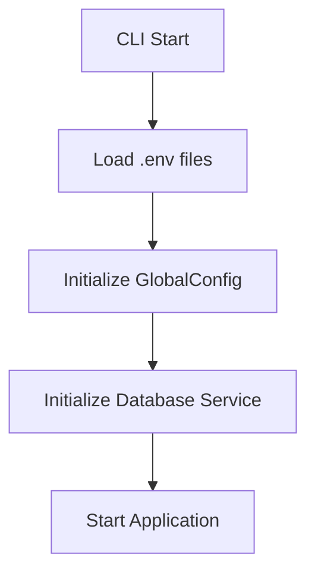
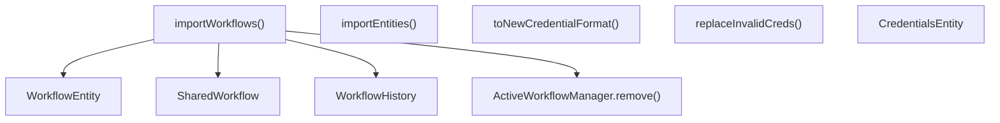
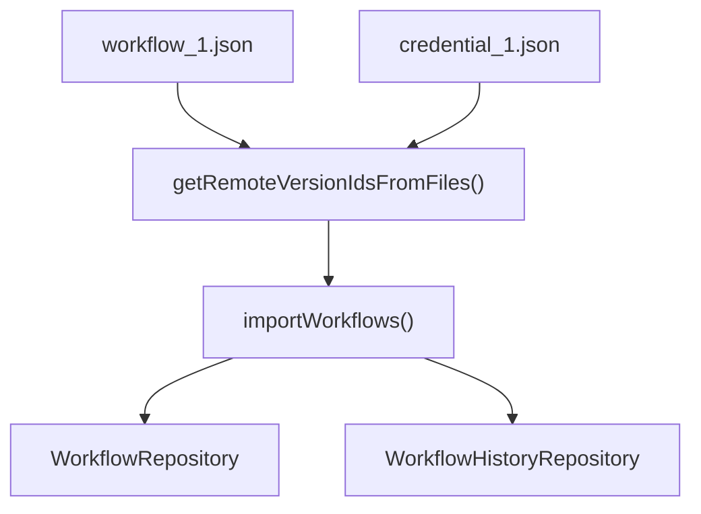

# 源码控制与环境管理 (Source Control and Environment Management)

相关源文件

-   [packages/@n8n/backend-test-utils/src/db/workflows.ts](https://github.com/n8n-io/n8n/blob/88f170b9/packages/@n8n/backend-test-utils/src/db/workflows.ts)
-   [packages/@n8n/config/src/configs/license.config.ts](https://github.com/n8n-io/n8n/blob/88f170b9/packages/@n8n/config/src/configs/license.config.ts)
-   [packages/@n8n/db/src/index.ts](https://github.com/n8n-io/n8n/blob/88f170b9/packages/@n8n/db/src/index.ts)
-   [packages/@n8n/db/src/services/\_\_tests\_\_/db-lock.service.test.ts](https://github.com/n8n-io/n8n/blob/88f170b9/packages/@n8n/db/src/services/__tests__/db-lock.service.test.ts)
-   [packages/@n8n/db/src/services/db-lock.service.ts](https://github.com/n8n-io/n8n/blob/88f170b9/packages/@n8n/db/src/services/db-lock.service.ts)
-   [packages/@n8n/db/src/services/index.ts](https://github.com/n8n-io/n8n/blob/88f170b9/packages/@n8n/db/src/services/index.ts)
-   [packages/cli/bin/n8n](https://github.com/n8n-io/n8n/blob/88f170b9/packages/cli/bin/n8n)
-   [packages/cli/src/commands/\_\_tests\_\_/start.test.ts](https://github.com/n8n-io/n8n/blob/88f170b9/packages/cli/src/commands/__tests__/start.test.ts)
-   [packages/cli/src/commands/audit.ts](https://github.com/n8n-io/n8n/blob/88f170b9/packages/cli/src/commands/audit.ts)
-   [packages/cli/src/commands/export/\_\_tests\_\_/entities.test.ts](https://github.com/n8n-io/n8n/blob/88f170b9/packages/cli/src/commands/export/__tests__/entities.test.ts)
-   [packages/cli/src/commands/export/entities.ts](https://github.com/n8n-io/n8n/blob/88f170b9/packages/cli/src/commands/export/entities.ts)
-   [packages/cli/src/commands/import/\_\_tests\_\_/entities.test.ts](https://github.com/n8n-io/n8n/blob/88f170b9/packages/cli/src/commands/import/__tests__/entities.test.ts)
-   [packages/cli/src/commands/import/credentials.ts](https://github.com/n8n-io/n8n/blob/88f170b9/packages/cli/src/commands/import/credentials.ts)
-   [packages/cli/src/commands/import/entities.ts](https://github.com/n8n-io/n8n/blob/88f170b9/packages/cli/src/commands/import/entities.ts)
-   [packages/cli/src/commands/import/workflow.ts](https://github.com/n8n-io/n8n/blob/88f170b9/packages/cli/src/commands/import/workflow.ts)
-   [packages/cli/src/commands/license/clear.ts](https://github.com/n8n-io/n8n/blob/88f170b9/packages/cli/src/commands/license/clear.ts)
-   [packages/cli/src/commands/license/info.ts](https://github.com/n8n-io/n8n/blob/88f170b9/packages/cli/src/commands/license/info.ts)
-   [packages/cli/src/public-api/v1/handlers/source-control/source-control.handler.ts](https://github.com/n8n-io/n8n/blob/88f170b9/packages/cli/src/public-api/v1/handlers/source-control/source-control.handler.ts)
-   [packages/cli/src/public-api/v1/handlers/workflows/workflows.service.ts](https://github.com/n8n-io/n8n/blob/88f170b9/packages/cli/src/public-api/v1/handlers/workflows/workflows.service.ts)
-   [packages/cli/src/services/\_\_tests\_\_/export.service.test.ts](https://github.com/n8n-io/n8n/blob/88f170b9/packages/cli/src/services/__tests__/export.service.test.ts)
-   [packages/cli/src/services/\_\_tests\_\_/import.service.test.ts](https://github.com/n8n-io/n8n/blob/88f170b9/packages/cli/src/services/__tests__/import.service.test.ts)
-   [packages/cli/src/services/cache/cache.types.ts](https://github.com/n8n-io/n8n/blob/88f170b9/packages/cli/src/services/cache/cache.types.ts)
-   [packages/cli/src/services/export.service.ts](https://github.com/n8n-io/n8n/blob/88f170b9/packages/cli/src/services/export.service.ts)
-   [packages/cli/src/services/import.service.ts](https://github.com/n8n-io/n8n/blob/88f170b9/packages/cli/src/services/import.service.ts)
-   [packages/cli/src/services/tag.service.ts](https://github.com/n8n-io/n8n/blob/88f170b9/packages/cli/src/services/tag.service.ts)
-   [packages/cli/src/utils/\_\_tests\_\_/validate-database-type.test.ts](https://github.com/n8n-io/n8n/blob/88f170b9/packages/cli/src/utils/__tests__/validate-database-type.test.ts)
-   [packages/cli/src/utils/compression.util.ts](https://github.com/n8n-io/n8n/blob/88f170b9/packages/cli/src/utils/compression.util.ts)
-   [packages/cli/src/utils/validate-database-type.ts](https://github.com/n8n-io/n8n/blob/88f170b9/packages/cli/src/utils/validate-database-type.ts)
-   [packages/cli/test/integration/commands/credentials.cmd.test.ts](https://github.com/n8n-io/n8n/blob/88f170b9/packages/cli/test/integration/commands/credentials.cmd.test.ts)
-   [packages/cli/test/integration/commands/import-workflows/combined/single.json](https://github.com/n8n-io/n8n/blob/88f170b9/packages/cli/test/integration/commands/import-workflows/combined/single.json)
-   [packages/cli/test/integration/commands/import.cmd.test.ts](https://github.com/n8n-io/n8n/blob/88f170b9/packages/cli/test/integration/commands/import.cmd.test.ts)
-   [packages/cli/test/integration/commands/ldap/reset.test.ts](https://github.com/n8n-io/n8n/blob/88f170b9/packages/cli/test/integration/commands/ldap/reset.test.ts)
-   [packages/cli/test/integration/commands/license.cmd.test.ts](https://github.com/n8n-io/n8n/blob/88f170b9/packages/cli/test/integration/commands/license.cmd.test.ts)
-   [packages/cli/test/integration/commands/update/workflow.test.ts](https://github.com/n8n-io/n8n/blob/88f170b9/packages/cli/test/integration/commands/update/workflow.test.ts)
-   [packages/cli/test/integration/database/services/db-lock.service.test.ts](https://github.com/n8n-io/n8n/blob/88f170b9/packages/cli/test/integration/database/services/db-lock.service.test.ts)
-   [packages/cli/test/integration/environments/source-control-import.service.test.ts](https://github.com/n8n-io/n8n/blob/88f170b9/packages/cli/test/integration/environments/source-control-import.service.test.ts)
-   [packages/cli/test/integration/environments/source-control.service.test.ts](https://github.com/n8n-io/n8n/blob/88f170b9/packages/cli/test/integration/environments/source-control.service.test.ts)
-   [packages/cli/test/integration/executions.controller.test.ts](https://github.com/n8n-io/n8n/blob/88f170b9/packages/cli/test/integration/executions.controller.test.ts)
-   [packages/cli/test/integration/import.service.test.ts](https://github.com/n8n-io/n8n/blob/88f170b9/packages/cli/test/integration/import.service.test.ts)
-   [packages/cli/test/integration/shared/db/tags.ts](https://github.com/n8n-io/n8n/blob/88f170b9/packages/cli/test/integration/shared/db/tags.ts)
-   [packages/cli/test/integration/workflows/workflows.controller-with-active-workflow-manager.ee.test.ts](https://github.com/n8n-io/n8n/blob/88f170b9/packages/cli/test/integration/workflows/workflows.controller-with-active-workflow-manager.ee.test.ts)
-   [packages/core/src/encryption/\_\_tests\_\_/cipher.test.ts](https://github.com/n8n-io/n8n/blob/88f170b9/packages/core/src/encryption/__tests__/cipher.test.ts)
-   [packages/core/src/encryption/cipher.ts](https://github.com/n8n-io/n8n/blob/88f170b9/packages/core/src/encryption/cipher.ts)

## 目的与范围

本文档涵盖了 n8n 的环境变量管理系统，以及针对工作流和凭证的源码控制集成。环境管理系统通过环境变量和配置文件处理配置，而源码控制功能通过 Git 集成和基于 CLI 的导入/导出操作，实现工作流和数据库实体的版本控制。

有关通用配置模式和验证，请参阅 [配置系统 (Configuration System)](/n8n-io/n8n/7.1-configuration-system)。有关特定于部署的配置，请参阅 [Docker 部署 (Docker Deployment)](/n8n-io/n8n/7.3-docker-deployment)。

---

## 环境变量加载系统

n8n 在应用程序生命周期的早期加载环境变量，以确保在服务初始化之前所有配置均可用。加载序列发生在 CLI 入口点。

### 初始化序列

*(注：根据上下文补全了原文档中无法解析的 Mermaid 图表结构)*

**来源：** [packages/cli/bin/n8n36-63](https://github.com/n8n-io/n8n/blob/88f170b9/packages/cli/bin/n8n#L36-L63)

### 早期配置加载

CLI 使用 `dotenv` 从 `.env` 文件加载环境变量。这发生在任何其他初始化之前，以确保 `process.env` 是最新的。随后立即加载来自 `GlobalConfig` 的配置，以确保 `@n8n/db` 中的 TypeORM 实体能够访问数据库设置（如 `database.type`），这是实体装饰器决定列类型和时间戳语法所必需的。

**来源：** [packages/cli/bin/n8n36-46](https://github.com/n8n-io/n8n/blob/88f170b9/packages/cli/bin/n8n#L36-L46)

### 网络与 DNS 配置

n8n 支持特定的环境变量来处理网络兼容性问题，特别是 Node.js 20 的 "Happy Eyeballs" 算法，该算法可能导致 Telegram 或 Airtable 等服务出现问题。

-   `NODEJS_PREFER_IPV4`: 如果设置为 `true`，n8n 将强制 DNS 解析优先使用 IPv4 [packages/cli/bin/n8n48-50](https://github.com/n8n-io/n8n/blob/88f170b9/packages/cli/bin/n8n#L48-L50)
-   `net.setDefaultAutoSelectFamily(false)`: 调用此方法是为了在双栈 IPv4/IPv6 环境中恢复 v20 之前的行为 [packages/cli/bin/n8n52-58](https://github.com/n8n-io/n8n/blob/88f170b9/packages/cli/bin/n8n#L52-L58)

---

## 数据库实体导入与导出

n8n 提供了强大的服务，用于在数据库和文件系统之间移动数据。这些服务支撑了用于备份和环境同步的 CLI 命令。

### 导入架构

`ImportService` 处理工作流、凭证和标签的 upsert（更新或插入）复杂逻辑，同时维护关系完整性。

**关键行为：**

-   **停用：** 所有工作流在导入时都会自动停用（`active = false`），以防止意外触发立即运行 [packages/cli/src/services/import.service.ts124-125](https://github.com/n8n-io/n8n/blob/88f170b9/packages/cli/src/services/import.service.ts#L124-L125)
-   **版本历史：** 为每个导入的工作流生成一个新的 `versionId` (UUID)，以确保正确的历史排序 [packages/cli/src/services/import.service.ts116-163](https://github.com/n8n-io/n8n/blob/88f170b9/packages/cli/src/services/import.service.ts#L116-L163)
-   **外键管理：** 该服务包含为 SQLite 和 Postgres 临时禁用/启用外键约束的逻辑，以允许批量导入 [packages/cli/src/services/import.service.ts35-50](https://github.com/n8n-io/n8n/blob/88f170b9/packages/cli/src/services/import.service.ts#L35-L50)

**来源：** [packages/cli/src/services/import.service.ts110-183](https://github.com/n8n-io/n8n/blob/88f170b9/packages/cli/src/services/import.service.ts#L110-L183) [packages/cli/src/services/import.service.ts35-50](https://github.com/n8n-io/n8n/blob/88f170b9/packages/cli/src/services/import.service.ts#L35-L50)

### 导出架构

`ExportService` 处理将数据库表序列化为 `.jsonl` (JSON Lines) 文件的操作。

-   **加密：** 该服务使用 `Cipher` 对导出的数据进行加密。它可以通过 `keyFilePath` 接受 `customEncryptionKey` [packages/cli/src/services/export.service.ts105-117](https://github.com/n8n-io/n8n/blob/88f170b9/packages/cli/src/services/export.service.ts#L105-L117)
-   **分页：** 为了处理大型数据集（如执行记录），该服务分页面导出（默认每页 500 个实体），以避免内存耗尽 [packages/cli/src/services/export.service.ts131-165](https://github.com/n8n-io/n8n/blob/88f170b9/packages/cli/src/services/export.service.ts#L131-L165)
-   **系统表：** 它专门处理 `migrations` 表，以确保目标数据库架构与源数据库匹配 [packages/cli/src/services/export.service.ts37-91](https://github.com/n8n-io/n8n/blob/88f170b9/packages/cli/src/services/export.service.ts#L37-L91)

**来源：** [packages/cli/src/services/export.service.ts13-18](https://github.com/n8n-io/n8n/blob/88f170b9/packages/cli/src/services/export.service.ts#L13-L18) [packages/cli/src/services/export.service.ts131-203](https://github.com/n8n-io/n8n/blob/88f170b9/packages/cli/src/services/export.service.ts#L131-L203)

---

## CLI 命令接口

以下命令提供了用于环境管理和源码控制操作的主要接口。

### 工作流与凭证导入

| 命令 | 标志 | 描述 |
| --- | --- | --- |
| `import:workflow` | `--input` | 指向 JSON 文件或目录的路径 [packages/cli/src/commands/import/workflow.ts63-67](https://github.com/n8n-io/n8n/blob/88f170b9/packages/cli/src/commands/import/workflow.ts#L63-L67) |
|  | `--separate` | 从目录导入多个 `.json` 文件 [packages/cli/src/commands/import/workflow.ts68-71](https://github.com/n8n-io/n8n/blob/88f170b9/packages/cli/src/commands/import/workflow.ts#L68-L71) |
|  | `--userId` | 将导入的工作流分配给特定用户 [packages/cli/src/commands/import/workflow.ts72](https://github.com/n8n-io/n8n/blob/88f170b9/packages/cli/src/commands/import/workflow.ts#L72-L72) |
| `import:credentials` | `--input` | 指向凭证 JSON 的路径 [packages/cli/src/commands/import/credentials.ts26-30](https://github.com/n8n-io/n8n/blob/88f170b9/packages/cli/src/commands/import/credentials.ts#L26-L30) |

### 批量实体导入/导出（开发中）

n8n 正在通过 `import:entities` 和 `export:entities` 引入更全面的实体管理系统。

-   **截断 (Truncation)：** `--truncateTables` 标志允许在导入前清空数据库 [packages/cli/src/commands/import/entities.ts14](https://github.com/n8n-io/n8n/blob/88f170b9/packages/cli/src/commands/import/entities.ts#L14-L14)
-   **约束切换：** `--skipTogglingForeignKeyConstraints` 标志允许跳过自动禁用数据库约束的操作 [packages/cli/src/commands/import/entities.ts23-26](https://github.com/n8n-io/n8n/blob/88f170b9/packages/cli/src/commands/import/entities.ts#L23-L26)

**来源：** [packages/cli/src/commands/import/entities.ts9-27](https://github.com/n8n-io/n8n/blob/88f170b9/packages/cli/src/commands/import/entities.ts#L9-L27) [packages/cli/src/commands/import/workflow.ts79-91](https://github.com/n8n-io/n8n/blob/88f170b9/packages/cli/src/commands/import/workflow.ts#L79-L91)

---

## 源码控制集成（企业版）

n8n 企业版具有专门的 `SourceControlImportService` (EE)，它在本地 Git 仓库和 n8n 数据库之间架起了桥梁。

### Git 导入逻辑

`SourceControlImportService` 管理从 Git 拉取的文件同步。

*(注：根据上下文补全了原文档中无法解析的 Mermaid 图表结构)*

**来源：** [packages/cli/test/integration/environments/source-control-import.service.test.ts40-45](https://github.com/n8n-io/n8n/blob/88f170b9/packages/cli/test/integration/environments/source-control-import.service.test.ts#L40-L45) [packages/cli/test/integration/environments/source-control-import.service.test.ts133-187](https://github.com/n8n-io/n8n/blob/88f170b9/packages/cli/test/integration/environments/source-control-import.service.test.ts#L133-L187)

### 源码控制中的凭证处理

与标准导出不同，源码控制导出通常涉及 "ExportableCredentials"，这些凭证包含元数据，但除非经过专门配置，否则不包含敏感密钥。`SourceControlImportService` 使用 `SharedCredentialsRepository` 和 `SharedWorkflowRepository` 来确保导入的资源在适当的团队项目中正确共享 [packages/cli/test/integration/environments/source-control-import.service.test.ts24-30](https://github.com/n8n-io/n8n/blob/88f170b9/packages/cli/test/integration/environments/source-control-import.service.test.ts#L24-L30)

---

## 环境变量模式

n8n 使用一致的环境变量命名模式，通常通过配置包中的 `@Env` 装饰器进行映射。

| 前缀 | 用途 |
| --- | --- |
| `N8N_` | 核心应用程序设置（如 `N8N_ENCRYPTION_KEY`, `N8N_PORT`） |
| `DB_` | 数据库连接细节（如 `DB_TYPE`, `DB_POSTGRESDB_HOST`） |
| `E2E_` | 测试环境标志（如 `E2E_TESTS`） [packages/cli/bin/n8n38](https://github.com/n8n-io/n8n/blob/88f170b9/packages/cli/bin/n8n#L38-L38) |
| `NODE_` | Node.js 运行时覆盖（如 `NODE_CONFIG_DIR`） [packages/cli/bin/n8n7](https://github.com/n8n-io/n8n/blob/88f170b9/packages/cli/bin/n8n#L7-L7) |

### 安全性：加密与密码 (Ciphers)

n8n 中的所有敏感数据（凭证、某些工作流设置）均使用 `Cipher` 类进行加密。在导入/导出过程中，`Cipher` 服务被大量使用：

-   **导出：** 数据在写入 `.jsonl` 文件之前进行加密 [packages/cli/src/services/export.service.ts201](https://github.com/n8n-io/n8n/blob/88f170b9/packages/cli/src/services/export.service.ts#L201-L201)
-   **导入：** 导入文件中以纯文本格式发现的凭证在存储前会自动加密 [packages/cli/src/commands/import/credentials.ts223-230](https://github.com/n8n-io/n8n/blob/88f170b9/packages/cli/src/commands/import/credentials.ts#L223-L230)

**来源：** [packages/core/src/encryption/cipher.ts1-10](https://github.com/n8n-io/n8n/blob/88f170b9/packages/core/src/encryption/cipher.ts#L1-L10) [packages/cli/src/services/export.service.ts13-18](https://github.com/n8n-io/n8n/blob/88f170b9/packages/cli/src/services/export.service.ts#L13-L18)

---

## 相关系统

-   **配置系统 [7.1]**: `GlobalConfig` 类和 `@Env` 装饰器的详细文档。
-   **基于项目的授权 [3.5]**: `SharedWorkflow` 和 `SharedCredentials` 在导入过程中如何与项目所有权关联。
-   **工作流历史 [3.1]**: 跟踪通过源码控制导入所做更改的 `WorkflowHistory` 系统。
