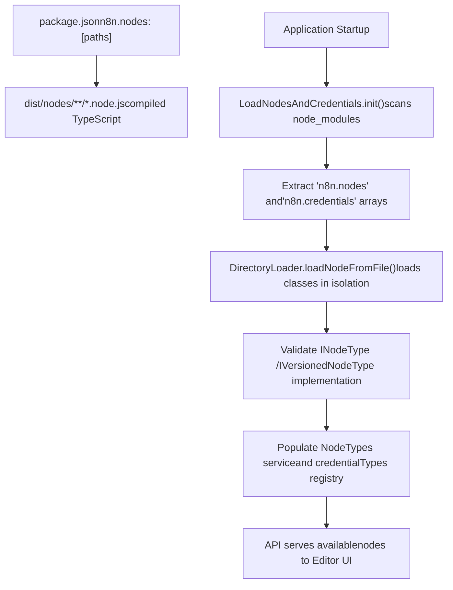

# 节点系统 (Node System)

相关源文件

-   [docker/images/runners/n8n-task-runners.json](https://github.com/n8n-io/n8n/blob/88f170b9/docker/images/runners/n8n-task-runners.json)
-   [packages/@n8n/task-runner-python/src/\_\_init\_\_.py](https://github.com/n8n-io/n8n/blob/88f170b9/packages/@n8n/task-runner-python/src/__init__.py)
-   [packages/@n8n/task-runner-python/src/config/\_\_init\_\_.py](https://github.com/n8n-io/n8n/blob/88f170b9/packages/@n8n/task-runner-python/src/config/__init__.py)
-   [packages/@n8n/task-runner/src/js-task-runner/\_\_tests\_\_/require-resolver-global-modules.test.ts](https://github.com/n8n-io/n8n/blob/88f170b9/packages/@n8n/task-runner/src/js-task-runner/__tests__/require-resolver-global-modules.test.ts)
-   [packages/@n8n/utils/src/files/path.test.ts](https://github.com/n8n-io/n8n/blob/88f170b9/packages/@n8n/utils/src/files/path.test.ts)
-   [packages/@n8n/utils/src/files/path.ts](https://github.com/n8n-io/n8n/blob/88f170b9/packages/@n8n/utils/src/files/path.ts)
-   [packages/cli/src/\_\_tests\_\_/load-nodes-and-credentials.test.ts](https://github.com/n8n-io/n8n/blob/88f170b9/packages/cli/src/__tests__/load-nodes-and-credentials.test.ts)
-   [packages/cli/src/load-nodes-and-credentials.ts](https://github.com/n8n-io/n8n/blob/88f170b9/packages/cli/src/load-nodes-and-credentials.ts)
-   [packages/cli/src/security-audit/risk-reporters/nodes-risk-reporter.ts](https://github.com/n8n-io/n8n/blob/88f170b9/packages/cli/src/security-audit/risk-reporters/nodes-risk-reporter.ts)
-   [packages/cli/src/security-audit/security-audit.repository.ts](https://github.com/n8n-io/n8n/blob/88f170b9/packages/cli/src/security-audit/security-audit.repository.ts)
-   [packages/cli/src/security-audit/security-audit.service.ts](https://github.com/n8n-io/n8n/blob/88f170b9/packages/cli/src/security-audit/security-audit.service.ts)
-   [packages/cli/test/integration/security-audit/credentials-risk-reporter.test.ts](https://github.com/n8n-io/n8n/blob/88f170b9/packages/cli/test/integration/security-audit/credentials-risk-reporter.test.ts)
-   [packages/cli/test/integration/security-audit/database-risk-reporter.test.ts](https://github.com/n8n-io/n8n/blob/88f170b9/packages/cli/test/integration/security-audit/database-risk-reporter.test.ts)
-   [packages/cli/test/integration/security-audit/filesystem-risk-reporter.test.ts](https://github.com/n8n-io/n8n/blob/88f170b9/packages/cli/test/integration/security-audit/filesystem-risk-reporter.test.ts)
-   [packages/cli/test/integration/security-audit/instance-risk-reporter.test.ts](https://github.com/n8n-io/n8n/blob/88f170b9/packages/cli/test/integration/security-audit/instance-risk-reporter.test.ts)
-   [packages/cli/test/integration/security-audit/nodes-risk-reporter.test.ts](https://github.com/n8n-io/n8n/blob/88f170b9/packages/cli/test/integration/security-audit/nodes-risk-reporter.test.ts)
-   [packages/core/src/nodes-loader/\_\_tests\_\_/directory-loader.test.ts](https://github.com/n8n-io/n8n/blob/88f170b9/packages/core/src/nodes-loader/__tests__/directory-loader.test.ts)
-   [packages/core/src/nodes-loader/constants.ts](https://github.com/n8n-io/n8n/blob/88f170b9/packages/core/src/nodes-loader/constants.ts)
-   [packages/core/src/nodes-loader/custom-directory-loader.ts](https://github.com/n8n-io/n8n/blob/88f170b9/packages/core/src/nodes-loader/custom-directory-loader.ts)
-   [packages/core/src/nodes-loader/directory-loader.ts](https://github.com/n8n-io/n8n/blob/88f170b9/packages/core/src/nodes-loader/directory-loader.ts)
-   [packages/core/src/nodes-loader/lazy-package-directory-loader.ts](https://github.com/n8n-io/n8n/blob/88f170b9/packages/core/src/nodes-loader/lazy-package-directory-loader.ts)
-   [packages/core/src/nodes-loader/package-directory-loader.ts](https://github.com/n8n-io/n8n/blob/88f170b9/packages/core/src/nodes-loader/package-directory-loader.ts)

节点系统是驱动 n8n 工作流自动化能力的基础集成框架。它定义了节点（工作流构建块）如何构建、注册、执行和扩展。该系统涵盖了 500 多个内置集成、LangChain AI 节点生态系统、凭据管理以及社区包基础设施。

有关节点在工作流中如何执行的信息，请参阅 [工作流执行引擎 (Workflow Execution Engine)](/n8n-io/n8n/2-workflow-execution-engine)。有关开发自定义节点的详细信息，请参阅 [节点开发与社区包 (Node Development and Community Packages)](/n8n-io/n8n/4.5-node-development-and-community-packages)。

---

## 概述与架构 (Overview and Architecture)

节点是实现 `n8n-workflow` 中 `INodeType` 接口的自包含集成模块。每个节点包通过 `package.json` 中的 `n8n` 字段声明其节点和凭据，系统在运行时使用该字段进行发现和注册。

**节点发现与注册流程**

来源： [packages/cli/src/load-nodes-and-credentials.ts66-111](https://github.com/n8n-io/n8n/blob/88f170b9/packages/cli/src/load-nodes-and-credentials.ts#L66-L111) [packages/core/src/nodes-loader/directory-loader.ts163-230](https://github.com/n8n-io/n8n/blob/88f170b9/packages/core/src/nodes-loader/directory-loader.ts#L163-L230) [packages/core/src/nodes-loader/package-directory-loader.ts27-55](https://github.com/n8n-io/n8n/blob/88f170b9/packages/core/src/nodes-loader/package-directory-loader.ts#L27-L55)

**核心节点包**

| 软件包 | 用途 | 节点数量 | 关键特性 |
| --- | --- | --- | --- |
| `n8n-nodes-base` | 标准集成 | 500+ | HTTP、数据库、云服务、SaaS API |
| `@n8n/n8n-nodes-langchain` | AI/LLM 能力 | 100+ | 聊天模型、Agent (代理)、向量存储、Embeddings (嵌入) |
| 社区软件包 | 用户贡献 | 不定 | 发布到 npm 且带有 `n8n-nodes-` 前缀 |

来源： [packages/cli/src/load-nodes-and-credentials.ts101-103](https://github.com/n8n-io/n8n/blob/88f170b9/packages/cli/src/load-nodes-and-credentials.ts#L101-L103)

---

## 节点类型系统与注册 (Node Type System and Registration)

### INodeType 接口

所有节点必须实现 `INodeType` 或 `IVersionedNodeType` 接口，该接口定义了节点行为、参数和执行逻辑的契约。

**核心节点类型结构**

来源： [packages/core/src/nodes-loader/directory-loader.ts4-18](https://github.com/n8n-io/n8n/blob/88f170b9/packages/core/src/nodes-loader/directory-loader.ts#L4-L18) [packages/core/src/nodes-loader/directory-loader.ts164-210](https://github.com/n8n-io/n8n/blob/88f170b9/packages/core/src/nodes-loader/directory-loader.ts#L164-L210)

### 节点注册过程

`LoadNodesAndCredentials` 服务负责节点发现。它将实际的加载工作委托给专门的 `DirectoryLoader` 实现。

-   **`PackageDirectoryLoader`**: 从标准的 npm 软件包（如 `n8n-nodes-base`）中加载节点 [packages/core/src/nodes-loader/package-directory-loader.ts12-15](https://github.com/n8n-io/n8n/blob/88f170b9/packages/core/src/nodes-loader/package-directory-loader.ts#L12-L15)
-   **`CustomDirectoryLoader`**: 从用户定义的自定义目录（例如 `~/.n8n/custom`）加载文件 [packages/core/src/nodes-loader/custom-directory-loader.ts10-11](https://github.com/n8n-io/n8n/blob/88f170b9/packages/core/src/nodes-loader/custom-directory-loader.ts#L10-L11)
-   **`LazyPackageDirectoryLoader`**: 通过最初仅加载节点描述，将完整的类加载推迟到执行时，从而优化启动速度 [packages/cli/src/load-nodes-and-credentials.ts187-189](https://github.com/n8n-io/n8n/blob/88f170b9/packages/cli/src/load-nodes-and-credentials.ts#L187-L189)

有关详细信息，请参阅 [节点类型系统与注册 (Node Type System and Registration)](/n8n-io/n8n/4.1-node-type-system-and-registration)。

---

## 标准节点与集成 (Standard Nodes and Integrations)

`n8n-nodes-base` 中的内置节点按集成类型和功能类别进行组织。`LoadNodesAndCredentials` 服务确保首先扫描关键系统路径，包括核心的 `n8n-nodes-base` 和 `@n8n/n8n-nodes-langchain` 软件包 [packages/cli/src/load-nodes-and-credentials.ts92-103](https://github.com/n8n-io/n8n/blob/88f170b9/packages/cli/src/load-nodes-and-credentials.ts#L92-L103)

### 节点风险与安全

系统包含一个 `NodesRiskReporter`，用于审计工作流中的“风险”节点。

-   **官方风险节点**: 像 `Execute Command` 或 `Read/Write Binary File` 这样具有主机系统访问权限的节点 [packages/cli/src/security-audit/risk-reporters/nodes-risk-reporter.ts48-58](https://github.com/n8n-io/n8n/blob/88f170b9/packages/cli/src/security-audit/risk-reporters/nodes-risk-reporter.ts#L48-L58)
-   **社区/自定义节点**: 未经 n8n 团队审核的节点，其运行权限与 n8n 进程相同 [packages/cli/src/security-audit/risk-reporters/nodes-risk-reporter.ts60-84](https://github.com/n8n-io/n8n/blob/88f170b9/packages/cli/src/security-audit/risk-reporters/nodes-risk-reporter.ts#L60-L84)

有关详细信息，请参阅 [标准节点与集成 (Standard Nodes and Integrations)](/n8n-io/n8n/4.2-standard-nodes-and-integrations)。

---

## AI 与 LangChain 节点 (AI and LangChain Nodes)

`@n8n/n8n-nodes-langchain` 软件包提供了一个全面的 AI 集成框架。这些节点与标准节点一起加载，但通常利用专门的子节点连接（例如，将 Model (模型) 连接到 Agent (代理)） [packages/cli/src/load-nodes-and-credentials.ts102](https://github.com/n8n-io/n8n/blob/88f170b9/packages/cli/src/load-nodes-and-credentials.ts#L102-L102)

系统还包括专门的任务运行器 (Task Runners)，用于在隔离环境中执行代码，支持 JavaScript 和 Python 进行 AI 相关的数据处理 [docker/images/runners/n8n-task-runners.json1-56](https://github.com/n8n-io/n8n/blob/88f170b9/docker/images/runners/n8n-task-runners.json#L1-L56)

有关详细信息，请参阅 [AI 与 LangChain 节点 (AI and LangChain Nodes)](/n8n-io/n8n/4.3-ai-and-langchain-nodes)。

---

## 节点的凭据系统 (Credential System for Nodes)

节点通过 `ICredentialType` 接口声明其身份验证要求。`LoadNodesAndCredentials` 服务负责从与节点相同的包中加载这些类型 [packages/cli/src/load-nodes-and-credentials.ts43-47](https://github.com/n8n-io/n8n/blob/88f170b9/packages/cli/src/load-nodes-and-credentials.ts#L43-L47)

**凭据加载逻辑**

-   **发现**: `DirectoryLoader` 扫描 `*.credentials.js` 文件 [packages/core/src/nodes-loader/custom-directory-loader.ts30-37](https://github.com/n8n-io/n8n/blob/88f170b9/packages/core/src/nodes-loader/custom-directory-loader.ts#L30-L37)
-   **关联**: 系统通过 `nodesByCredential` 维护哪些节点支持哪些凭据的映射 [packages/core/src/nodes-loader/directory-loader.ts83](https://github.com/n8n-io/n8n/blob/88f170b9/packages/core/src/nodes-loader/directory-loader.ts#L83-L83)
-   **验证**: 凭据可以定义 `test` 属性来验证连接性 [packages/cli/test/integration/security-audit/credentials-risk-reporter.test.ts46-88](https://github.com/n8n-io/n8n/blob/88f170b9/packages/cli/test/integration/security-audit/credentials-risk-reporter.test.ts#L46-L88)

有关详细信息，请参阅 [节点的凭据系统 (Credential System for Nodes)](/n8n-io/n8n/4.4-credential-system-for-nodes)。

---

## 节点开发与社区包 (Node Development and Community Packages)

n8n 支持“社区包”系统，用户可以将节点发布到 npm。`LoadNodesAndCredentials` 服务在初始化期间保留 `NODE_PATH` 环境变量，以确保节点加载器和任务运行器可以解析全局安装的 npm 软件包（在 Docker 环境中很常见） [packages/cli/src/load-nodes-and-credentials.ts70-75](https://github.com/n8n-io/n8n/blob/88f170b9/packages/cli/src/load-nodes-and-credentials.ts#L70-L75)

**外部模块解析** 为了在自定义节点或 Code 节点中支持外部模块，n8n 在修改 `process.env.NODE_PATH` 后使用 `Module._initPaths()` 来刷新 Node.js 内部搜索路径 [packages/cli/src/load-nodes-and-credentials.ts79](https://github.com/n8n-io/n8n/blob/88f170b9/packages/cli/src/load-nodes-and-credentials.ts#L79-L79)

有关详细信息，请参阅 [节点开发与社区包 (Node Development and Community Packages)](/n8n-io/n8n/4.5-node-development-and-community-packages)。

来源： [packages/cli/src/load-nodes-and-credentials.ts1-111](https://github.com/n8n-io/n8n/blob/88f170b9/packages/cli/src/load-nodes-and-credentials.ts#L1-L111) [packages/core/src/nodes-loader/directory-loader.ts61-103](https://github.com/n8n-io/n8n/blob/88f170b9/packages/core/src/nodes-loader/directory-loader.ts#L61-L103) [packages/cli/src/security-audit/risk-reporters/nodes-risk-reporter.ts21-86](https://github.com/n8n-io/n8n/blob/88f170b9/packages/cli/src/security-audit/risk-reporters/nodes-risk-reporter.ts#L21-L86)
