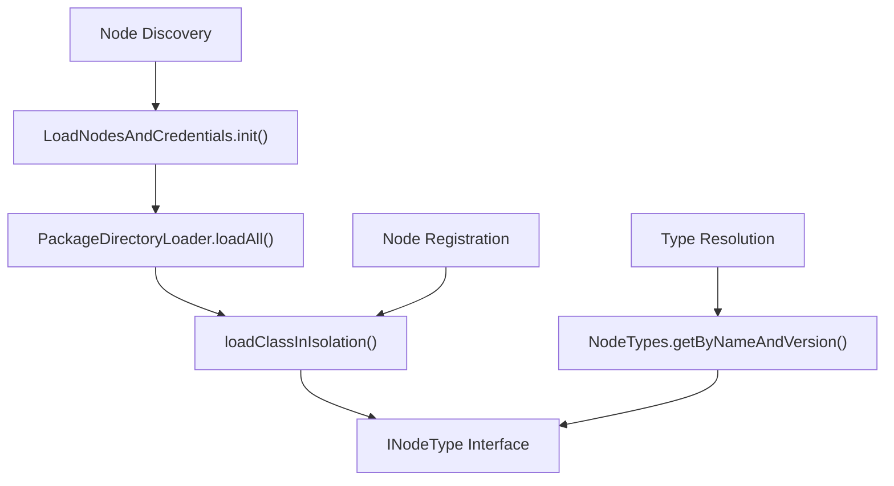
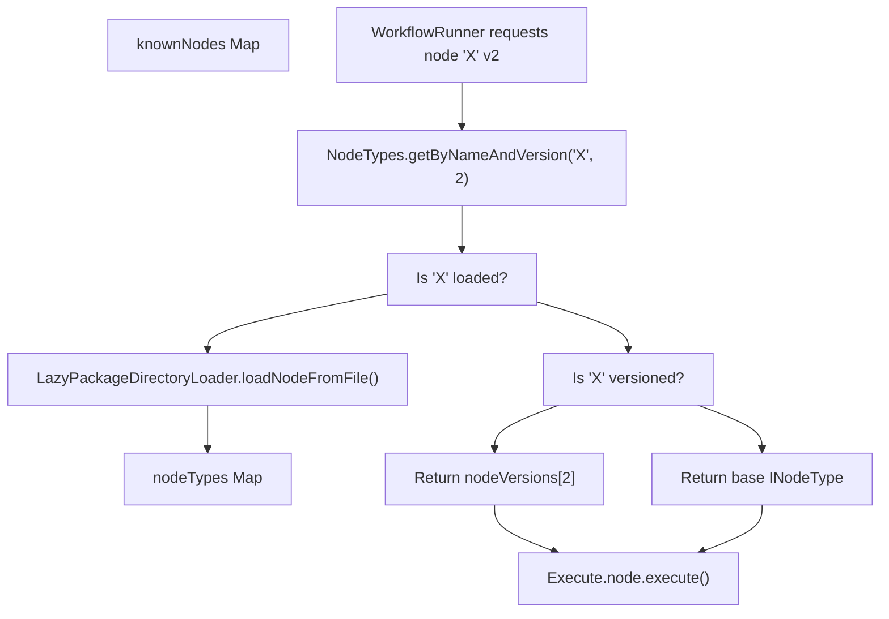

# 节点类型系统与注册 (Node Type System and Registration)

相关源文件

-   [docker/images/runners/n8n-task-runners.json](https://github.com/n8n-io/n8n/blob/88f170b9/docker/images/runners/n8n-task-runners.json)
-   [packages/@n8n/task-runner-python/src/\_\_init\_\_.py](https://github.com/n8n-io/n8n/blob/88f170b9/packages/@n8n/task-runner-python/src/__init__.py)
-   [packages/@n8n/task-runner-python/src/config/\_\_init\_\_.py](https://github.com/n8n-io/n8n/blob/88f170b9/packages/@n8n/task-runner-python/src/config/__init__.py)
-   [packages/@n8n/task-runner/src/js-task-runner/\_\_tests\_\_/require-resolver-global-modules.test.ts](https://github.com/n8n-io/n8n/blob/88f170b9/packages/@n8n/task-runner/src/js-task-runner/__tests__/require-resolver-global-modules.test.ts)
-   [packages/@n8n/utils/src/files/path.test.ts](https://github.com/n8n-io/n8n/blob/88f170b9/packages/@n8n/utils/src/files/path.test.ts)
-   [packages/@n8n/utils/src/files/path.ts](https://github.com/n8n-io/n8n/blob/88f170b9/packages/@n8n/utils/src/files/path.ts)
-   [packages/cli/src/\_\_tests\_\_/load-nodes-and-credentials.test.ts](https://github.com/n8n-io/n8n/blob/88f170b9/packages/cli/src/__tests__/load-nodes-and-credentials.test.ts)
-   [packages/cli/src/load-nodes-and-credentials.ts](https://github.com/n8n-io/n8n/blob/88f170b9/packages/cli/src/load-nodes-and-credentials.ts)
-   [packages/cli/src/security-audit/risk-reporters/nodes-risk-reporter.ts](https://github.com/n8n-io/n8n/blob/88f170b9/packages/cli/src/security-audit/risk-reporters/nodes-risk-reporter.ts)
-   [packages/cli/src/security-audit/security-audit.repository.ts](https://github.com/n8n-io/n8n/blob/88f170b9/packages/cli/src/security-audit/security-audit.repository.ts)
-   [packages/cli/src/security-audit/security-audit.service.ts](https://github.com/n8n-io/n8n/blob/88f170b9/packages/cli/src/security-audit/security-audit.service.ts)
-   [packages/cli/test/integration/security-audit/credentials-risk-reporter.test.ts](https://github.com/n8n-io/n8n/blob/88f170b9/packages/cli/test/integration/security-audit/credentials-risk-reporter.test.ts)
-   [packages/cli/test/integration/security-audit/database-risk-reporter.test.ts](https://github.com/n8n-io/n8n/blob/88f170b9/packages/cli/test/integration/security-audit/database-risk-reporter.test.ts)
-   [packages/cli/test/integration/security-audit/filesystem-risk-reporter.test.ts](https://github.com/n8n-io/n8n/blob/88f170b9/packages/cli/test/integration/security-audit/filesystem-risk-reporter.test.ts)
-   [packages/cli/test/integration/security-audit/instance-risk-reporter.test.ts](https://github.com/n8n-io/n8n/blob/88f170b9/packages/cli/test/integration/security-audit/instance-risk-reporter.test.ts)
-   [packages/cli/test/integration/security-audit/nodes-risk-reporter.test.ts](https://github.com/n8n-io/n8n/blob/88f170b9/packages/cli/test/integration/security-audit/nodes-risk-reporter.test.ts)
-   [packages/core/src/nodes-loader/\_\_tests\_\_/directory-loader.test.ts](https://github.com/n8n-io/n8n/blob/88f170b9/packages/core/src/nodes-loader/__tests__/directory-loader.test.ts)
-   [packages/core/src/nodes-loader/constants.ts](https://github.com/n8n-io/n8n/blob/88f170b9/packages/core/src/nodes-loader/constants.ts)
-   [packages/core/src/nodes-loader/custom-directory-loader.ts](https://github.com/n8n-io/n8n/blob/88f170b9/packages/core/src/nodes-loader/custom-directory-loader.ts)
-   [packages/core/src/nodes-loader/directory-loader.ts](https://github.com/n8n-io/n8n/blob/88f170b9/packages/core/src/nodes-loader/directory-loader.ts)
-   [packages/core/src/nodes-loader/lazy-package-directory-loader.ts](https://github.com/n8n-io/n8n/blob/88f170b9/packages/core/src/nodes-loader/lazy-package-directory-loader.ts)
-   [packages/core/src/nodes-loader/package-directory-loader.ts](https://github.com/n8n-io/n8n/blob/88f170b9/packages/core/src/nodes-loader/package-directory-loader.ts)

## 目的与范围 (Purpose and Scope)

本页面解释了 n8n 如何在运行时定义、发现、加载和注册节点类型与凭据类型。它涵盖了每个节点和凭据必须实现的核心接口、命名与版本控制约定、扫描 npm 软件包以获取节点类的 `DirectoryLoader` 层次结构、`LoadNodesAndCredentials` 启动服务，以及在启动和前端使用的生成静态清单的构建时脚本。

有关凭据在执行时如何加密、测试和注入，请参阅 [节点的凭据系统 (Credential System for Nodes)](/n8n-io/n8n/4.4-credential-system-for-nodes)。有关特定内置节点的架构，请参阅 [标准节点与集成 (Standard Nodes and Integrations)](/n8n-io/n8n/4.2-standard-nodes-and-integrations)。有关社区包的打包和安装生命周期，请参阅 [节点开发与社区包 (Node Development and Community Packages)](/n8n-io/n8n/4.5-node-development-and-community-packages)。

---

## 核心类型接口 (Core Type Interfaces)

所有节点类型契约都在 `packages/workflow` 中声明，这是 monorepo 中每个其他软件包都会导入的共享库。

### `INodeType`

`INodeType` 是每个节点类实现的运行时接口。它在 [packages/workflow/src/Interfaces.ts431-483](https://github.com/n8n-io/n8n/blob/88f170b9/packages/workflow/src/Interfaces.ts#L431-L483) 中定义。

| 属性 / 方法 | 用途 |
| --- | --- |
| `description: INodeTypeDescription` | 静态、可序列化的元数据（名称、参数、输入、输出、凭据）。 |
| `execute?(this: IExecuteFunctions)` | 主执行路径；对于 action/transform 节点，每次执行调用一次。 |
| `trigger?(this: ITriggerFunctions)` | 当 trigger 节点被激活时调用；设置监听器。 |
| `poll?(this: IPollFunctions)` | 对于轮询类型的 trigger 节点，按计划调用。 |
| `webhook?(this: IWebhookFunctions)` | 当入站 HTTP 请求与已注册的 webhook 匹配时调用。 |
| `supplyData?(this: ISupplyDataFunctions, itemIndex)` | AI 子节点用于向父级 Agent 节点提供数据对象（LLM、工具、记忆）。 |
| `methods?` | 分组的运行时方法：`loadOptions`、`listSearch`、`resourceMapping`、`credentialTest`。 |
| `webhookMethods?` | 用于管理远程 webhook 注册的 `checkExists`、`create`、`delete`。 |

### `INodeTypeDescription`

`INodeTypeDescription` 是嵌入在每个 `INodeType.description` 中的纯数据描述符。它是完全可序列化的，并被传输到前端进行 UI 渲染。

| 字段 | 类型 | 用途 |
| --- | --- | --- |
| `name` | `string` | 唯一的类型标识符，例如 `n8n-nodes-base.httpRequest`。 |
| `displayName` | `string` | 人类可读的标签。 |
| `version` | `number | number[]` | 支持的版本。 |
| `group` | `string[]` | 分类：`['trigger']`、`['transform']` 等。 |
| `properties` | `INodeProperties[]` | 在 NDV 面板中渲染的参数定义。 |
| `credentials?` | `INodeCredentialDescription[]` | 节点使用的凭据插槽。 |
| `inputs` | `string[] | INodeInputConfiguration[]` | 输入连接器声明。 |
| `outputs` | `string[] | INodeOutputConfiguration[]` | 输出连接器声明。 |
| `icon?` | `string` | SVG 或 FontAwesome 引用，例如 `file:httpRequest.svg`。 |
| `codex?` | `CodexData` | 面向 AI 的元数据：`categories`、`subcategories`、`alias`。 |

`codex` 字段在运行时被读取用于 AI 分类查询 —— 参见 [packages/workflow/src/telemetry-helpers.ts728-730](https://github.com/n8n-io/n8n/blob/88f170b9/packages/workflow/src/telemetry-helpers.ts#L728-L730) 中的 `nodeType.description.codex?.categories`。

### `ICredentialType`

凭据镜像了节点模式。`ICredentialType` ([packages/workflow/src/Interfaces.ts346-371](https://github.com/n8n-io/n8n/blob/88f170b9/packages/workflow/src/Interfaces.ts#L346-L371)) 包含：

| 字段 | 用途 |
| --- | --- |
| `name` | 唯一的凭据类型名称，例如 `githubApi`。 |
| `displayName` | UI 标签。 |
| `properties: INodeProperties[]` | 用户填写的字段（令牌、URL、密钥）。 |
| `extends?` | 继承其属性的父凭据类型。 |
| `authenticate?` | 将凭据注入到传出的 HTTP 请求选项中。 |
| `test?: ICredentialTestRequest` | 为凭据验证而执行的请求。 |
| `supportedNodes?` | 哪些节点类型接受此凭据。 |

来源： [packages/workflow/src/Interfaces.ts346-371](https://github.com/n8n-io/n8n/blob/88f170b9/packages/workflow/src/Interfaces.ts#L346-L371) [packages/workflow/src/Interfaces.ts431-483](https://github.com/n8n-io/n8n/blob/88f170b9/packages/workflow/src/Interfaces.ts#L431-L483) [packages/workflow/src/telemetry-helpers.ts728-730](https://github.com/n8n-io/n8n/blob/88f170b9/packages/workflow/src/telemetry-helpers.ts#L728-L730)

---

## 节点类型命名与版本控制 (Node Type Naming and Versioning)

节点类型名称遵循 `packageName.nodeName` 约定。`packages/workflow/src/Constants.ts` 导出了内置类型的字符串常量：

-   `HTTP_REQUEST_NODE_TYPE`: `n8n-nodes-base.httpRequest`
-   `CODE_NODE_TYPE`: `n8n-nodes-base.code`
-   `AGENT_LANGCHAIN_NODE_TYPE`: `@n8n/n8n-nodes-langchain.agent`

### 版本控制机制

n8n 通过 `IVersionedNodeType` ([packages/workflow/src/Interfaces.ts485-491](https://github.com/n8n-io/n8n/blob/88f170b9/packages/workflow/src/Interfaces.ts#L485-L491)) 允许节点发生破坏性变更。

-   **版本化节点**: 一个实现 `IVersionedNodeType` 的类，持有一个 `nodeVersions: { [version: number]: INodeType }` 映射。
-   **解析**: 在运行时，`getByNameAndVersion(type, version)` 选择匹配的子类型。如果未指定版本，则默认为类中定义的 `currentVersion`。

来源： [packages/workflow/src/Constants.ts25-111](https://github.com/n8n-io/n8n/blob/88f170b9/packages/workflow/src/Constants.ts#L25-L111) [packages/workflow/src/Interfaces.ts485-491](https://github.com/n8n-io/n8n/blob/88f170b9/packages/workflow/src/Interfaces.ts#L485-L491) [packages/workflow/src/Interfaces.ts939-945](https://github.com/n8n-io/n8n/blob/88f170b9/packages/workflow/src/Interfaces.ts#L939-L945)

---

## 发现与加载系统 (Discovery and Loading System)

发现系统负责扫描目录、识别节点文件并将其加载到内存中。

### `DirectoryLoader` 层次结构

`DirectoryLoader` ([packages/core/src/nodes-loader/directory-loader.ts61](https://github.com/n8n-io/n8n/blob/88f170b9/packages/core/src/nodes-loader/directory-loader.ts#L61-L61)) 是所有加载器的抽象基类。它管理类名和源路径的 `known` 注册表。

| 类 | 角色 | 文件 |
| --- | --- | --- |
| `PackageDirectoryLoader` | 从 `package.json` 定义中加载（例如 `nodes-base`）。 | [packages/core/src/nodes-loader/package-directory-loader.ts12](https://github.com/n8n-io/n8n/blob/88f170b9/packages/core/src/nodes-loader/package-directory-loader.ts#L12-L12) |
| `LazyPackageDirectoryLoader` | 最初仅加载描述，按需加载类。 | [packages/core/src/nodes-loader/lazy-package-directory-loader.ts11](https://github.com/n8n-io/n8n/blob/88f170b9/packages/core/src/nodes-loader/lazy-package-directory-loader.ts#L11-L11) |
| `CustomDirectoryLoader` | 扫描目录以查找 `**/*.node.js` 文件（自定义节点）。 | [packages/core/src/nodes-loader/custom-directory-loader.ts10](https://github.com/n8n-io/n8n/blob/88f170b9/packages/core/src/nodes-loader/custom-directory-loader.ts#L10-L10) |

### `LoadNodesAndCredentials` 服务

`LoadNodesAndCredentials` ([packages/cli/src/load-nodes-and-credentials.ts39](https://github.com/n8n-io/n8n/blob/88f170b9/packages/cli/src/load-nodes-and-credentials.ts#L39-L39)) 是中央协调器。在 `init()` 期间，它：

1.  设置 `NODE_PATH` 以确保任务运行器可以解析模块 [packages/cli/src/load-nodes-and-credentials.ts73-75](https://github.com/n8n-io/n8n/blob/88f170b9/packages/cli/src/load-nodes-and-credentials.ts#L73-L75)
2.  扫描 `n8n-nodes-base` 和 `@n8n/n8n-nodes-langchain` [packages/cli/src/load-nodes-and-credentials.ts101-103](https://github.com/n8n-io/n8n/blob/88f170b9/packages/cli/src/load-nodes-and-credentials.ts#L101-L103)
3.  从 `N8N_CUSTOM_EXTENSIONS` 中指定的目录加载自定义节点 [packages/cli/src/load-nodes-and-credentials.ts109](https://github.com/n8n-io/n8n/blob/88f170b9/packages/cli/src/load-nodes-and-credentials.ts#L109-L109)

**启动加载序列**

> **[Mermaid sequence]**
> *(图表结构无法解析)*

来源： [packages/core/src/nodes-loader/directory-loader.ts61](https://github.com/n8n-io/n8n/blob/88f170b9/packages/core/src/nodes-loader/directory-loader.ts#L61-L61) [packages/core/src/nodes-loader/package-directory-loader.ts12](https://github.com/n8n-io/n8n/blob/88f170b9/packages/core/src/nodes-loader/package-directory-loader.ts#L12-L12) [packages/core/src/nodes-loader/custom-directory-loader.ts10](https://github.com/n8n-io/n8n/blob/88f170b9/packages/core/src/nodes-loader/custom-directory-loader.ts#L10-L10) [packages/cli/src/load-nodes-and-credentials.ts39-111](https://github.com/n8n-io/n8n/blob/88f170b9/packages/cli/src/load-nodes-and-credentials.ts#L39-L111)

---

## 运行时注册与数据流 (Runtime Registration and Data Flow)

加载后，节点类型存储在 `NodeTypes` 服务中，该服务作为执行引擎的权威注册表。

### 代码实体空间映射

此图将逻辑注册概念映射到代码库中的特定类和函数。

### 执行时查找

当工作流开始时，`WorkflowExecute` 使用 `NodeTypes` 服务解析节点实现。

1.  **输入**: 节点名称（例如 `n8n-nodes-base.httpRequest`）和版本。
2.  **动作**: 调用 `NodeTypes.getByNameAndVersion()` [packages/workflow/src/telemetry-helpers.ts286-287](https://github.com/n8n-io/n8n/blob/88f170b9/packages/workflow/src/telemetry-helpers.ts#L286-L287)
3.  **输出**: `INodeType` 实例或 `IVersionedNodeType` 中的特定版本。

**节点类型解析流**

来源： [packages/workflow/src/telemetry-helpers.ts285-340](https://github.com/n8n-io/n8n/blob/88f170b9/packages/workflow/src/telemetry-helpers.ts#L285-L340) [packages/cli/src/load-nodes-and-credentials.ts148-167](https://github.com/n8n-io/n8n/blob/88f170b9/packages/cli/src/load-nodes-and-credentials.ts#L148-L167) [packages/core/src/nodes-loader/directory-loader.ts163-230](https://github.com/n8n-io/n8n/blob/88f170b9/packages/core/src/nodes-loader/directory-loader.ts#L163-L230)

---

## 安全与沙箱 (Security and Sandboxing)

节点使用 `loadClassInIsolation` [packages/core/src/nodes-loader/load-class-in-isolation.ts](https://github.com/n8n-io/n8n/blob/88f170b9/packages/core/src/nodes-loader/load-class-in-isolation.ts) 加载，这确保了以最小化副作用的方式 require 节点类。

### 任务运行器集成 (Task Runner Integration)

对于执行用户提供脚本的节点（如 `Code` 节点），n8n 使用单独的任务运行器进程。

-   `LoadNodesAndCredentials` 保留了 `NODE_PATH` 环境变量，以便全局安装的 npm 模块（例如在 Docker 中）对任务运行器子进程保持可访问性 [packages/cli/src/load-nodes-and-credentials.ts73-75](https://github.com/n8n-io/n8n/blob/88f170b9/packages/cli/src/load-nodes-and-credentials.ts#L73-L75)
-   `n8n-task-runners.json` 中的 `allowed-env` 列表明确允许将 `NODE_PATH` 传递给运行器 [docker/images/runners/n8n-task-runners.json17](https://github.com/n8n-io/n8n/blob/88f170b9/docker/images/runners/n8n-task-runners.json#L17-L17)

来源： [packages/cli/src/load-nodes-and-credentials.test.ts55-67](https://github.com/n8n-io/n8n/blob/88f170b9/packages/cli/test/integration/security-audit/load-nodes-and-credentials.test.ts#L55-L67) [docker/images/runners/n8n-task-runners.json1-56](https://github.com/n8n-io/n8n/blob/88f170b9/docker/images/runners/n8n-task-runners.json#L1-L56) [packages/cli/src/load-nodes-and-credentials.ts70-76](https://github.com/n8n-io/n8n/blob/88f170b9/packages/cli/src/load-nodes-and-credentials.ts#L70-L76)
