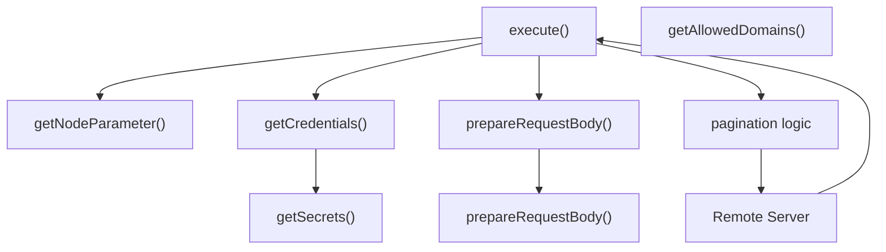
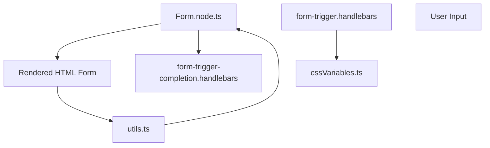
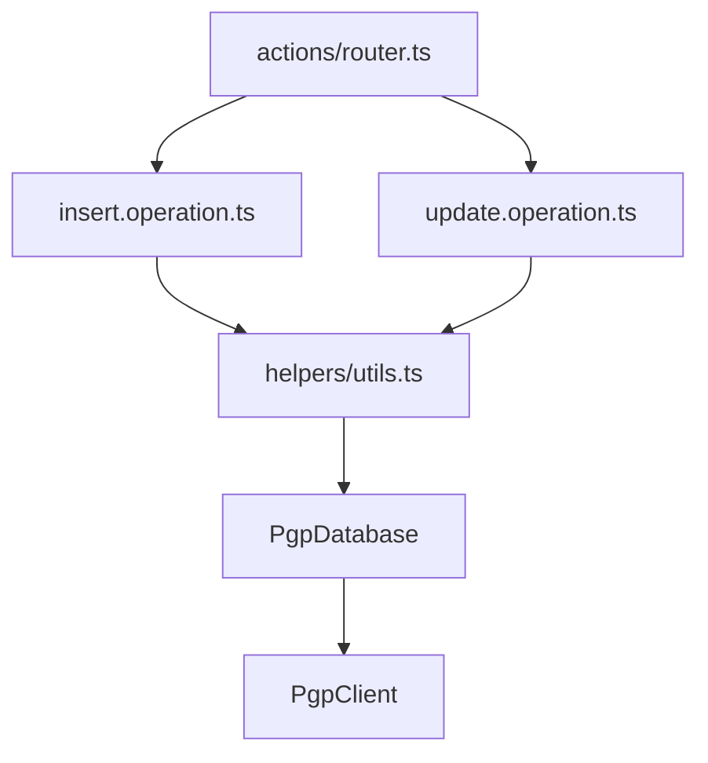

# 标准节点与集成 (Standard Nodes and Integrations)

相关源文件

-   [packages/cli/src/webhooks/\_\_tests\_\_/waiting-forms.test.ts](https://github.com/n8n-io/n8n/blob/88f170b9/packages/cli/src/webhooks/__tests__/waiting-forms.test.ts)
-   [packages/cli/src/webhooks/\_\_tests\_\_/waiting-webhooks.test.ts](https://github.com/n8n-io/n8n/blob/88f170b9/packages/cli/src/webhooks/__tests__/waiting-webhooks.test.ts)
-   [packages/cli/src/webhooks/waiting-forms.ts](https://github.com/n8n-io/n8n/blob/88f170b9/packages/cli/src/webhooks/waiting-forms.ts)
-   [packages/cli/src/webhooks/waiting-webhooks.ts](https://github.com/n8n-io/n8n/blob/88f170b9/packages/cli/src/webhooks/waiting-webhooks.ts)
-   [packages/cli/templates/form-trigger-completion.handlebars](https://github.com/n8n-io/n8n/blob/88f170b9/packages/cli/templates/form-trigger-completion.handlebars)
-   [packages/cli/templates/form-trigger.handlebars](https://github.com/n8n-io/n8n/blob/88f170b9/packages/cli/templates/form-trigger.handlebars)
-   [packages/frontend/editor-ui/src/features/ndv/parameters/components/ResourceLocator/ResourceLocator.test.ts](https://github.com/n8n-io/n8n/blob/88f170b9/packages/frontend/editor-ui/src/features/ndv/parameters/components/ResourceLocator/ResourceLocator.test.ts)
-   [packages/frontend/editor-ui/src/features/ndv/parameters/components/ResourceLocator/ResourceLocator.vue](https://github.com/n8n-io/n8n/blob/88f170b9/packages/frontend/editor-ui/src/features/ndv/parameters/components/ResourceLocator/ResourceLocator.vue)
-   [packages/frontend/editor-ui/src/features/ndv/parameters/components/ResourceLocator/ResourceLocatorDropdown.test.ts](https://github.com/n8n-io/n8n/blob/88f170b9/packages/frontend/editor-ui/src/features/ndv/parameters/components/ResourceLocator/ResourceLocatorDropdown.test.ts)
-   [packages/frontend/editor-ui/src/features/ndv/parameters/components/ResourceLocator/ResourceLocatorDropdown.vue](https://github.com/n8n-io/n8n/blob/88f170b9/packages/frontend/editor-ui/src/features/ndv/parameters/components/ResourceLocator/ResourceLocatorDropdown.vue)
-   [packages/frontend/editor-ui/src/features/shared/editors/components/InlineExpressionEditor/InlineExpressionTip.vue](https://github.com/n8n-io/n8n/blob/88f170b9/packages/frontend/editor-ui/src/features/shared/editors/components/InlineExpressionEditor/InlineExpressionTip.vue)
-   [packages/nodes-base/credentials/GoogleSheetsOAuth2Api.credentials.ts](https://github.com/n8n-io/n8n/blob/88f170b9/packages/nodes-base/credentials/GoogleSheetsOAuth2Api.credentials.ts)
-   [packages/nodes-base/credentials/GoogleSheetsTriggerOAuth2Api.credentials.ts](https://github.com/n8n-io/n8n/blob/88f170b9/packages/nodes-base/credentials/GoogleSheetsTriggerOAuth2Api.credentials.ts)
-   [packages/nodes-base/credentials/MicrosoftAzureMonitorOAuth2Api.credentials.ts](https://github.com/n8n-io/n8n/blob/88f170b9/packages/nodes-base/credentials/MicrosoftAzureMonitorOAuth2Api.credentials.ts)
-   [packages/nodes-base/nodes/Discord/Discord.node.json](https://github.com/n8n-io/n8n/blob/88f170b9/packages/nodes-base/nodes/Discord/Discord.node.json)
-   [packages/nodes-base/nodes/Discord/test/v2/utils.test.ts](https://github.com/n8n-io/n8n/blob/88f170b9/packages/nodes-base/nodes/Discord/test/v2/utils.test.ts)
-   [packages/nodes-base/nodes/Discord/v2/DiscordV2.node.ts](https://github.com/n8n-io/n8n/blob/88f170b9/packages/nodes-base/nodes/Discord/v2/DiscordV2.node.ts)
-   [packages/nodes-base/nodes/Discord/v2/actions/common.description.ts](https://github.com/n8n-io/n8n/blob/88f170b9/packages/nodes-base/nodes/Discord/v2/actions/common.description.ts)
-   [packages/nodes-base/nodes/Discord/v2/actions/message/index.ts](https://github.com/n8n-io/n8n/blob/88f170b9/packages/nodes-base/nodes/Discord/v2/actions/message/index.ts)
-   [packages/nodes-base/nodes/Discord/v2/actions/message/send.operation.ts](https://github.com/n8n-io/n8n/blob/88f170b9/packages/nodes-base/nodes/Discord/v2/actions/message/send.operation.ts)
-   [packages/nodes-base/nodes/Discord/v2/actions/message/sendAndWait.operation.ts](https://github.com/n8n-io/n8n/blob/88f170b9/packages/nodes-base/nodes/Discord/v2/actions/message/sendAndWait.operation.ts)
-   [packages/nodes-base/nodes/Discord/v2/actions/node.type.ts](https://github.com/n8n-io/n8n/blob/88f170b9/packages/nodes-base/nodes/Discord/v2/actions/node.type.ts)
-   [packages/nodes-base/nodes/Discord/v2/actions/router.ts](https://github.com/n8n-io/n8n/blob/88f170b9/packages/nodes-base/nodes/Discord/v2/actions/router.ts)
-   [packages/nodes-base/nodes/Discord/v2/actions/versionDescription.ts](https://github.com/n8n-io/n8n/blob/88f170b9/packages/nodes-base/nodes/Discord/v2/actions/versionDescription.ts)
-   [packages/nodes-base/nodes/Discord/v2/helpers/utils.ts](https://github.com/n8n-io/n8n/blob/88f170b9/packages/nodes-base/nodes/Discord/v2/helpers/utils.ts)
-   [packages/nodes-base/nodes/EmailSend/test/v2/sendAndWait.operation.test.ts](https://github.com/n8n-io/n8n/blob/88f170b9/packages/nodes-base/nodes/EmailSend/test/v2/sendAndWait.operation.test.ts)
-   [packages/nodes-base/nodes/EmailSend/v2/sendAndWait.operation.ts](https://github.com/n8n-io/n8n/blob/88f170b9/packages/nodes-base/nodes/EmailSend/v2/sendAndWait.operation.ts)
-   [packages/nodes-base/nodes/Evaluation/test/evaluationTriggerUtils.test.ts](https://github.com/n8n-io/n8n/blob/88f170b9/packages/nodes-base/nodes/Evaluation/test/evaluationTriggerUtils.test.ts)
-   [packages/nodes-base/nodes/Evaluation/utils/evaluationTriggerUtils.ts](https://github.com/n8n-io/n8n/blob/88f170b9/packages/nodes-base/nodes/Evaluation/utils/evaluationTriggerUtils.ts)
-   [packages/nodes-base/nodes/Form/Form.node.ts](https://github.com/n8n-io/n8n/blob/88f170b9/packages/nodes-base/nodes/Form/Form.node.ts)
-   [packages/nodes-base/nodes/Form/FormTrigger.node.ts](https://github.com/n8n-io/n8n/blob/88f170b9/packages/nodes-base/nodes/Form/FormTrigger.node.ts)
-   [packages/nodes-base/nodes/Form/common.descriptions.ts](https://github.com/n8n-io/n8n/blob/88f170b9/packages/nodes-base/nodes/Form/common.descriptions.ts)
-   [packages/nodes-base/nodes/Form/interfaces.ts](https://github.com/n8n-io/n8n/blob/88f170b9/packages/nodes-base/nodes/Form/interfaces.ts)
-   [packages/nodes-base/nodes/Form/test/Form.node.test.ts](https://github.com/n8n-io/n8n/blob/88f170b9/packages/nodes-base/nodes/Form/test/Form.node.test.ts)
-   [packages/nodes-base/nodes/Form/test/FormTriggerV2.node.test.ts](https://github.com/n8n-io/n8n/blob/88f170b9/packages/nodes-base/nodes/Form/test/FormTriggerV2.node.test.ts)
-   [packages/nodes-base/nodes/Form/test/formCompletionUtils.test.ts](https://github.com/n8n-io/n8n/blob/88f170b9/packages/nodes-base/nodes/Form/test/formCompletionUtils.test.ts)
-   [packages/nodes-base/nodes/Form/test/formNodeUtils.test.ts](https://github.com/n8n-io/n8n/blob/88f170b9/packages/nodes-base/nodes/Form/test/formNodeUtils.test.ts)
-   [packages/nodes-base/nodes/Form/test/sanitizeCustomCss.test.ts](https://github.com/n8n-io/n8n/blob/88f170b9/packages/nodes-base/nodes/Form/test/sanitizeCustomCss.test.ts)
-   [packages/nodes-base/nodes/Form/test/utils.test.ts](https://github.com/n8n-io/n8n/blob/88f170b9/packages/nodes-base/nodes/Form/test/utils.test.ts)
-   [packages/nodes-base/nodes/Form/utils/formCompletionUtils.ts](https://github.com/n8n-io/n8n/blob/88f170b9/packages/nodes-base/nodes/Form/utils/formCompletionUtils.ts)
-   [packages/nodes-base/nodes/Form/utils/formNodeUtils.ts](https://github.com/n8n-io/n8n/blob/88f170b9/packages/nodes-base/nodes/Form/utils/formNodeUtils.ts)
-   [packages/nodes-base/nodes/Form/utils/utils.ts](https://github.com/n8n-io/n8n/blob/88f170b9/packages/nodes-base/nodes/Form/utils/utils.ts)
-   [packages/nodes-base/nodes/Form/v1/FormTriggerV1.node.ts](https://github.com/n8n-io/n8n/blob/88f170b9/packages/nodes-base/nodes/Form/v1/FormTriggerV1.node.ts)
-   [packages/nodes-base/nodes/Form/v2/FormTriggerV2.node.ts](https://github.com/n8n-io/n8n/blob/88f170b9/packages/nodes-base/nodes/Form/v2/FormTriggerV2.node.ts)
-   [packages/nodes-base/nodes/Google/Chat/GenericFunctions.ts](https://github.com/n8n-io/n8n/blob/88f170b9/packages/nodes-base/nodes/Google/Chat/GenericFunctions.ts)
-   [packages/nodes-base/nodes/Google/Chat/test/node/sendAndWait.operation.test.ts](https://github.com/n8n-io/n8n/blob/88f170b9/packages/nodes-base/nodes/Google/Chat/test/node/sendAndWait.operation.test.ts)
-   [packages/nodes-base/nodes/Google/Sheet/GoogleSheets.node.ts](https://github.com/n8n-io/n8n/blob/88f170b9/packages/nodes-base/nodes/Google/Sheet/GoogleSheets.node.ts)
-   [packages/nodes-base/nodes/Google/Sheet/GoogleSheetsTrigger.node.json](https://github.com/n8n-io/n8n/blob/88f170b9/packages/nodes-base/nodes/Google/Sheet/GoogleSheetsTrigger.node.json)
-   [packages/nodes-base/nodes/Google/Sheet/GoogleSheetsTrigger.utils.ts](https://github.com/n8n-io/n8n/blob/88f170b9/packages/nodes-base/nodes/Google/Sheet/GoogleSheetsTrigger.utils.ts)
-   [packages/nodes-base/nodes/Google/Sheet/test/v2/helpers/GoogleSheet.test.ts](https://github.com/n8n-io/n8n/blob/88f170b9/packages/nodes-base/nodes/Google/Sheet/test/v2/helpers/GoogleSheet.test.ts)
-   [packages/nodes-base/nodes/Google/Sheet/test/v2/methods/resourceMapping.test.ts](https://github.com/n8n-io/n8n/blob/88f170b9/packages/nodes-base/nodes/Google/Sheet/test/v2/methods/resourceMapping.test.ts)
-   [packages/nodes-base/nodes/Google/Sheet/test/v2/node/append.test.ts](https://github.com/n8n-io/n8n/blob/88f170b9/packages/nodes-base/nodes/Google/Sheet/test/v2/node/append.test.ts)
-   [packages/nodes-base/nodes/Google/Sheet/test/v2/node/appendOrUpdate.test.ts](https://github.com/n8n-io/n8n/blob/88f170b9/packages/nodes-base/nodes/Google/Sheet/test/v2/node/appendOrUpdate.test.ts)
-   [packages/nodes-base/nodes/Google/Sheet/test/v2/node/update.test.ts](https://github.com/n8n-io/n8n/blob/88f170b9/packages/nodes-base/nodes/Google/Sheet/test/v2/node/update.test.ts)
-   [packages/nodes-base/nodes/Google/Sheet/test/v2/utils/utils.test.ts](https://github.com/n8n-io/n8n/blob/88f170b9/packages/nodes-base/nodes/Google/Sheet/test/v2/utils/utils.test.ts)
-   [packages/nodes-base/nodes/Google/Sheet/v2/actions/router.ts](https://github.com/n8n-io/n8n/blob/88f170b9/packages/nodes-base/nodes/Google/Sheet/v2/actions/router.ts)
-   [packages/nodes-base/nodes/Google/Sheet/v2/actions/sheet/append.operation.ts](https://github.com/n8n-io/n8n/blob/88f170b9/packages/nodes-base/nodes/Google/Sheet/v2/actions/sheet/append.operation.ts)
-   [packages/nodes-base/nodes/Google/Sheet/v2/actions/sheet/appendOrUpdate.operation.ts](https://github.com/n8n-io/n8n/blob/88f170b9/packages/nodes-base/nodes/Google/Sheet/v2/actions/sheet/appendOrUpdate.operation.ts)
-   [packages/nodes-base/nodes/Google/Sheet/v2/actions/sheet/commonDescription.ts](https://github.com/n8n-io/n8n/blob/88f170b9/packages/nodes-base/nodes/Google/Sheet/v2/actions/sheet/commonDescription.ts)
-   [packages/nodes-base/nodes/Google/Sheet/v2/actions/sheet/read.operation.ts](https://github.com/n8n-io/n8n/blob/88f170b9/packages/nodes-base/nodes/Google/Sheet/v2/actions/sheet/read.operation.ts)
-   [packages/nodes-base/nodes/Google/Sheet/v2/actions/sheet/update.operation.ts](https://github.com/n8n-io/n8n/blob/88f170b9/packages/nodes-base/nodes/Google/Sheet/v2/actions/sheet/update.operation.ts)
-   [packages/nodes-base/nodes/Google/Sheet/v2/actions/utils/readOperation.ts](https://github.com/n8n-io/n8n/blob/88f170b9/packages/nodes-base/nodes/Google/Sheet/v2/actions/utils/readOperation.ts)
-   [packages/nodes-base/nodes/Google/Sheet/v2/actions/versionDescription.ts](https://github.com/n8n-io/n8n/blob/88f170b9/packages/nodes-base/nodes/Google/Sheet/v2/actions/versionDescription.ts)
-   [packages/nodes-base/nodes/Google/Sheet/v2/helpers/GoogleSheet.ts](https://github.com/n8n-io/n8n/blob/88f170b9/packages/nodes-base/nodes/Google/Sheet/v2/helpers/GoogleSheet.ts)
-   [packages/nodes-base/nodes/Google/Sheet/v2/helpers/GoogleSheets.types.ts](https://github.com/n8n-io/n8n/blob/88f170b9/packages/nodes-base/nodes/Google/Sheet/v2/helpers/GoogleSheets.types.ts)
-   [packages/nodes-base/nodes/Google/Sheet/v2/helpers/GoogleSheets.utils.ts](https://github.com/n8n-io/n8n/blob/88f170b9/packages/nodes-base/nodes/Google/Sheet/v2/helpers/GoogleSheets.utils.ts)
-   [packages/nodes-base/nodes/Google/Sheet/v2/methods/listSearch.ts](https://github.com/n8n-io/n8n/blob/88f170b9/packages/nodes-base/nodes/Google/Sheet/v2/methods/listSearch.ts)
-   [packages/nodes-base/nodes/Google/Sheet/v2/methods/loadOptions.ts](https://github.com/n8n-io/n8n/blob/88f170b9/packages/nodes-base/nodes/Google/Sheet/v2/methods/loadOptions.ts)
-   [packages/nodes-base/nodes/Google/Sheet/v2/methods/resourceMapping.ts](https://github.com/n8n-io/n8n/blob/88f170b9/packages/nodes-base/nodes/Google/Sheet/v2/methods/resourceMapping.ts)
-   [packages/nodes-base/nodes/HttpRequest/GenericFunctions.ts](https://github.com/n8n-io/n8n/blob/88f170b9/packages/nodes-base/nodes/HttpRequest/GenericFunctions.ts)
-   [packages/nodes-base/nodes/HttpRequest/HttpRequest.node.ts](https://github.com/n8n-io/n8n/blob/88f170b9/packages/nodes-base/nodes/HttpRequest/HttpRequest.node.ts)
-   [packages/nodes-base/nodes/HttpRequest/V1/HttpRequestV1.node.ts](https://github.com/n8n-io/n8n/blob/88f170b9/packages/nodes-base/nodes/HttpRequest/V1/HttpRequestV1.node.ts)
-   [packages/nodes-base/nodes/HttpRequest/V2/HttpRequestV2.node.ts](https://github.com/n8n-io/n8n/blob/88f170b9/packages/nodes-base/nodes/HttpRequest/V2/HttpRequestV2.node.ts)
-   [packages/nodes-base/nodes/HttpRequest/V3/Description.ts](https://github.com/n8n-io/n8n/blob/88f170b9/packages/nodes-base/nodes/HttpRequest/V3/Description.ts)
-   [packages/nodes-base/nodes/HttpRequest/V3/HttpRequestV3.node.ts](https://github.com/n8n-io/n8n/blob/88f170b9/packages/nodes-base/nodes/HttpRequest/V3/HttpRequestV3.node.ts)
-   [packages/nodes-base/nodes/HttpRequest/httprequest.svg](https://github.com/n8n-io/n8n/blob/88f170b9/packages/nodes-base/nodes/HttpRequest/httprequest.svg)
-   [packages/nodes-base/nodes/HttpRequest/test/GenericFunctions.test.ts](https://github.com/n8n-io/n8n/blob/88f170b9/packages/nodes-base/nodes/HttpRequest/test/GenericFunctions.test.ts)
-   [packages/nodes-base/nodes/HttpRequest/test/encodingQuoted/HttpRequest.test.ts](https://github.com/n8n-io/n8n/blob/88f170b9/packages/nodes-base/nodes/HttpRequest/test/encodingQuoted/HttpRequest.test.ts)
-   [packages/nodes-base/nodes/HttpRequest/test/encodingQuoted/encodingQuoted.test.json](https://github.com/n8n-io/n8n/blob/88f170b9/packages/nodes-base/nodes/HttpRequest/test/encodingQuoted/encodingQuoted.test.json)
-   [packages/nodes-base/nodes/HttpRequest/test/node/HttpRequest.test.ts](https://github.com/n8n-io/n8n/blob/88f170b9/packages/nodes-base/nodes/HttpRequest/test/node/HttpRequest.test.ts)
-   [packages/nodes-base/nodes/HttpRequest/test/node/HttpRequestV3.test.ts](https://github.com/n8n-io/n8n/blob/88f170b9/packages/nodes-base/nodes/HttpRequest/test/node/HttpRequestV3.test.ts)
-   [packages/nodes-base/nodes/HttpRequest/test/node/workflow.delete.json](https://github.com/n8n-io/n8n/blob/88f170b9/packages/nodes-base/nodes/HttpRequest/test/node/workflow.delete.json)
-   [packages/nodes-base/nodes/HttpRequest/test/node/workflow.get.json](https://github.com/n8n-io/n8n/blob/88f170b9/packages/nodes-base/nodes/HttpRequest/test/node/workflow.get.json)
-   [packages/nodes-base/nodes/HttpRequest/test/node/workflow.pagination.json](https://github.com/n8n-io/n8n/blob/88f170b9/packages/nodes-base/nodes/HttpRequest/test/node/workflow.pagination.json)
-   [packages/nodes-base/nodes/HttpRequest/test/node/workflow.patch.json](https://github.com/n8n-io/n8n/blob/88f170b9/packages/nodes-base/nodes/HttpRequest/test/node/workflow.patch.json)
-   [packages/nodes-base/nodes/HttpRequest/test/node/workflow.post.json](https://github.com/n8n-io/n8n/blob/88f170b9/packages/nodes-base/nodes/HttpRequest/test/node/workflow.post.json)
-   [packages/nodes-base/nodes/HttpRequest/test/node/workflow.put.json](https://github.com/n8n-io/n8n/blob/88f170b9/packages/nodes-base/nodes/HttpRequest/test/node/workflow.put.json)
-   [packages/nodes-base/nodes/HttpRequest/test/node/workflow.use\_error\_output.json](https://github.com/n8n-io/n8n/blob/88f170b9/packages/nodes-base/nodes/HttpRequest/test/node/workflow.use_error_output.json)
-   [packages/nodes-base/nodes/HttpRequest/test/utils/utils.test.ts](https://github.com/n8n-io/n8n/blob/88f170b9/packages/nodes-base/nodes/HttpRequest/test/utils/utils.test.ts)
-   [packages/nodes-base/nodes/Microsoft/Outlook/test/v2/node/message/sendAndWait.test.ts](https://github.com/n8n-io/n8n/blob/88f170b9/packages/nodes-base/nodes/Microsoft/Outlook/test/v2/node/message/sendAndWait.test.ts)
-   [packages/nodes-base/nodes/Microsoft/Outlook/v2/MicrosoftOutlookV2.node.ts](https://github.com/n8n-io/n8n/blob/88f170b9/packages/nodes-base/nodes/Microsoft/Outlook/v2/MicrosoftOutlookV2.node.ts)
-   [packages/nodes-base/nodes/Microsoft/Outlook/v2/actions/message/index.ts](https://github.com/n8n-io/n8n/blob/88f170b9/packages/nodes-base/nodes/Microsoft/Outlook/v2/actions/message/index.ts)
-   [packages/nodes-base/nodes/Microsoft/Outlook/v2/actions/message/sendAndWait.operation.ts](https://github.com/n8n-io/n8n/blob/88f170b9/packages/nodes-base/nodes/Microsoft/Outlook/v2/actions/message/sendAndWait.operation.ts)
-   [packages/nodes-base/nodes/Microsoft/Outlook/v2/actions/node.description.ts](https://github.com/n8n-io/n8n/blob/88f170b9/packages/nodes-base/nodes/Microsoft/Outlook/v2/actions/node.description.ts)
-   [packages/nodes-base/nodes/Microsoft/Outlook/v2/actions/node.type.ts](https://github.com/n8n-io/n8n/blob/88f170b9/packages/nodes-base/nodes/Microsoft/Outlook/v2/actions/node.type.ts)
-   [packages/nodes-base/nodes/Microsoft/Outlook/v2/actions/router.ts](https://github.com/n8n-io/n8n/blob/88f170b9/packages/nodes-base/nodes/Microsoft/Outlook/v2/actions/router.ts)
-   [packages/nodes-base/nodes/Microsoft/Teams/v2/actions/chatMessage/sendAndWait.operation.ts](https://github.com/n8n-io/n8n/blob/88f170b9/packages/nodes-base/nodes/Microsoft/Teams/v2/actions/chatMessage/sendAndWait.operation.ts)
-   [packages/nodes-base/nodes/Postgres/PostgresTrigger.functions.ts](https://github.com/n8n-io/n8n/blob/88f170b9/packages/nodes-base/nodes/Postgres/PostgresTrigger.functions.ts)
-   [packages/nodes-base/nodes/Postgres/test/v2/operations.test.ts](https://github.com/n8n-io/n8n/blob/88f170b9/packages/nodes-base/nodes/Postgres/test/v2/operations.test.ts)
-   [packages/nodes-base/nodes/Postgres/test/v2/resourceMapping.test.ts](https://github.com/n8n-io/n8n/blob/88f170b9/packages/nodes-base/nodes/Postgres/test/v2/resourceMapping.test.ts)
-   [packages/nodes-base/nodes/Postgres/test/v2/utils.test.ts](https://github.com/n8n-io/n8n/blob/88f170b9/packages/nodes-base/nodes/Postgres/test/v2/utils.test.ts)
-   [packages/nodes-base/nodes/Postgres/v2/actions/common.descriptions.ts](https://github.com/n8n-io/n8n/blob/88f170b9/packages/nodes-base/nodes/Postgres/v2/actions/common.descriptions.ts)
-   [packages/nodes-base/nodes/Postgres/v2/actions/database/deleteTable.operation.ts](https://github.com/n8n-io/n8n/blob/88f170b9/packages/nodes-base/nodes/Postgres/v2/actions/database/deleteTable.operation.ts)
-   [packages/nodes-base/nodes/Postgres/v2/actions/database/executeQuery.operation.ts](https://github.com/n8n-io/n8n/blob/88f170b9/packages/nodes-base/nodes/Postgres/v2/actions/database/executeQuery.operation.ts)
-   [packages/nodes-base/nodes/Postgres/v2/actions/database/insert.operation.ts](https://github.com/n8n-io/n8n/blob/88f170b9/packages/nodes-base/nodes/Postgres/v2/actions/database/insert.operation.ts)
-   [packages/nodes-base/nodes/Postgres/v2/actions/database/select.operation.ts](https://github.com/n8n-io/n8n/blob/88f170b9/packages/nodes-base/nodes/Postgres/v2/actions/database/select.operation.ts)
-   [packages/nodes-base/nodes/Postgres/v2/actions/database/update.operation.ts](https://github.com/n8n-io/n8n/blob/88f170b9/packages/nodes-base/nodes/Postgres/v2/actions/database/update.operation.ts)
-   [packages/nodes-base/nodes/Postgres/v2/actions/database/upsert.operation.ts](https://github.com/n8n-io/n8n/blob/88f170b9/packages/nodes-base/nodes/Postgres/v2/actions/database/upsert.operation.ts)
-   [packages/nodes-base/nodes/Postgres/v2/actions/router.ts](https://github.com/n8n-io/n8n/blob/88f170b9/packages/nodes-base/nodes/Postgres/v2/actions/router.ts)
-   [packages/nodes-base/nodes/Postgres/v2/helpers/interfaces.ts](https://github.com/n8n-io/n8n/blob/88f170b9/packages/nodes-base/nodes/Postgres/v2/helpers/interfaces.ts)
-   [packages/nodes-base/nodes/Postgres/v2/helpers/utils.ts](https://github.com/n8n-io/n8n/blob/88f170b9/packages/nodes-base/nodes/Postgres/v2/helpers/utils.ts)
-   [packages/nodes-base/nodes/Postgres/v2/methods/credentialTest.ts](https://github.com/n8n-io/n8n/blob/88f170b9/packages/nodes-base/nodes/Postgres/v2/methods/credentialTest.ts)
-   [packages/nodes-base/nodes/Postgres/v2/methods/listSearch.ts](https://github.com/n8n-io/n8n/blob/88f170b9/packages/nodes-base/nodes/Postgres/v2/methods/listSearch.ts)
-   [packages/nodes-base/nodes/Postgres/v2/methods/loadOptions.ts](https://github.com/n8n-io/n8n/blob/88f170b9/packages/nodes-base/nodes/Postgres/v2/methods/loadOptions.ts)
-   [packages/nodes-base/nodes/Postgres/v2/methods/resourceMapping.ts](https://github.com/n8n-io/n8n/blob/88f170b9/packages/nodes-base/nodes/Postgres/v2/methods/resourceMapping.ts)
-   [packages/nodes-base/nodes/Shopify/ShopifyTrigger.node.ts](https://github.com/n8n-io/n8n/blob/88f170b9/packages/nodes-base/nodes/Shopify/ShopifyTrigger.node.ts)
-   [packages/nodes-base/nodes/Slack/Slack.node.ts](https://github.com/n8n-io/n8n/blob/88f170b9/packages/nodes-base/nodes/Slack/Slack.node.ts)
-   [packages/nodes-base/nodes/Slack/V2/ChannelDescription.ts](https://github.com/n8n-io/n8n/blob/88f170b9/packages/nodes-base/nodes/Slack/V2/ChannelDescription.ts)
-   [packages/nodes-base/nodes/Slack/V2/FileDescription.ts](https://github.com/n8n-io/n8n/blob/88f170b9/packages/nodes-base/nodes/Slack/V2/FileDescription.ts)
-   [packages/nodes-base/nodes/Slack/V2/GenericFunctions.ts](https://github.com/n8n-io/n8n/blob/88f170b9/packages/nodes-base/nodes/Slack/V2/GenericFunctions.ts)
-   [packages/nodes-base/nodes/Slack/V2/MessageDescription.ts](https://github.com/n8n-io/n8n/blob/88f170b9/packages/nodes-base/nodes/Slack/V2/MessageDescription.ts)
-   [packages/nodes-base/nodes/Slack/V2/MessageInterface.ts](https://github.com/n8n-io/n8n/blob/88f170b9/packages/nodes-base/nodes/Slack/V2/MessageInterface.ts)
-   [packages/nodes-base/nodes/Slack/V2/ReactionDescription.ts](https://github.com/n8n-io/n8n/blob/88f170b9/packages/nodes-base/nodes/Slack/V2/ReactionDescription.ts)
-   [packages/nodes-base/nodes/Slack/V2/SlackV2.node.ts](https://github.com/n8n-io/n8n/blob/88f170b9/packages/nodes-base/nodes/Slack/V2/SlackV2.node.ts)
-   [packages/nodes-base/nodes/Slack/V2/StarDescription.ts](https://github.com/n8n-io/n8n/blob/88f170b9/packages/nodes-base/nodes/Slack/V2/StarDescription.ts)
-   [packages/nodes-base/nodes/Slack/V2/UserGroupDescription.ts](https://github.com/n8n-io/n8n/blob/88f170b9/packages/nodes-base/nodes/Slack/V2/UserGroupDescription.ts)
-   [packages/nodes-base/nodes/Slack/test/v2/GenericFunctions.test.ts](https://github.com/n8n-io/n8n/blob/88f170b9/packages/nodes-base/nodes/Slack/test/v2/GenericFunctions.test.ts)
-   [packages/nodes-base/nodes/Slack/test/v2/Slack.node.test.ts](https://github.com/n8n-io/n8n/blob/88f170b9/packages/nodes-base/nodes/Slack/test/v2/Slack.node.test.ts)
-   [packages/nodes-base/nodes/Slack/test/v2/node/channel/archive.test.ts](https://github.com/n8n-io/n8n/blob/88f170b9/packages/nodes-base/nodes/Slack/test/v2/node/channel/archive.test.ts)
-   [packages/nodes-base/nodes/Slack/test/v2/node/channel/archive.workflow.json](https://github.com/n8n-io/n8n/blob/88f170b9/packages/nodes-base/nodes/Slack/test/v2/node/channel/archive.workflow.json)
-   [packages/nodes-base/nodes/Slack/test/v2/node/channel/create.test.ts](https://github.com/n8n-io/n8n/blob/88f170b9/packages/nodes-base/nodes/Slack/test/v2/node/channel/create.test.ts)
-   [packages/nodes-base/nodes/Slack/test/v2/node/channel/create.workflow.json](https://github.com/n8n-io/n8n/blob/88f170b9/packages/nodes-base/nodes/Slack/test/v2/node/channel/create.workflow.json)
-   [packages/nodes-base/nodes/Slack/test/v2/node/channel/get.test.ts](https://github.com/n8n-io/n8n/blob/88f170b9/packages/nodes-base/nodes/Slack/test/v2/node/channel/get.test.ts)
-   [packages/nodes-base/nodes/Slack/test/v2/node/channel/get.workflow.json](https://github.com/n8n-io/n8n/blob/88f170b9/packages/nodes-base/nodes/Slack/test/v2/node/channel/get.workflow.json)
-   [packages/nodes-base/nodes/Slack/test/v2/node/channel/getAll.test.ts](https://github.com/n8n-io/n8n/blob/88f170b9/packages/nodes-base/nodes/Slack/test/v2/node/channel/getAll.test.ts)
-   [packages/nodes-base/nodes/Slack/test/v2/node/channel/getAll.workflow.json](https://github.com/n8n-io/n8n/blob/88f170b9/packages/nodes-base/nodes/Slack/test/v2/node/channel/getAll.workflow.json)
-   [packages/nodes-base/nodes/Slack/test/v2/node/channel/history.test.ts](https://github.com/n8n-io/n8n/blob/88f170b9/packages/nodes-base/nodes/Slack/test/v2/node/channel/history.test.ts)
-   [packages/nodes-base/nodes/Slack/test/v2/node/channel/history.workflow.json](https://github.com/n8n-io/n8n/blob/88f170b9/packages/nodes-base/nodes/Slack/test/v2/node/channel/history.workflow.json)
-   [packages/nodes-base/nodes/Slack/test/v2/utils.test.ts](https://github.com/n8n-io/n8n/blob/88f170b9/packages/nodes-base/nodes/Slack/test/v2/utils.test.ts)
-   [packages/nodes-base/nodes/Telegram/GenericFunctions.ts](https://github.com/n8n-io/n8n/blob/88f170b9/packages/nodes-base/nodes/Telegram/GenericFunctions.ts)
-   [packages/nodes-base/nodes/Telegram/IEvent.ts](https://github.com/n8n-io/n8n/blob/88f170b9/packages/nodes-base/nodes/Telegram/IEvent.ts)
-   [packages/nodes-base/nodes/Telegram/Telegram.node.ts](https://github.com/n8n-io/n8n/blob/88f170b9/packages/nodes-base/nodes/Telegram/Telegram.node.ts)
-   [packages/nodes-base/nodes/Telegram/TelegramTrigger.node.ts](https://github.com/n8n-io/n8n/blob/88f170b9/packages/nodes-base/nodes/Telegram/TelegramTrigger.node.ts)
-   [packages/nodes-base/nodes/Telegram/tests/GenericFunctions.test.ts](https://github.com/n8n-io/n8n/blob/88f170b9/packages/nodes-base/nodes/Telegram/tests/GenericFunctions.test.ts)
-   [packages/nodes-base/nodes/Telegram/tests/Helpers.ts](https://github.com/n8n-io/n8n/blob/88f170b9/packages/nodes-base/nodes/Telegram/tests/Helpers.ts)
-   [packages/nodes-base/nodes/Telegram/tests/Telegram.node.test.ts](https://github.com/n8n-io/n8n/blob/88f170b9/packages/nodes-base/nodes/Telegram/tests/Telegram.node.test.ts)
-   [packages/nodes-base/nodes/Telegram/tests/TelegramTrigger.node.test.ts](https://github.com/n8n-io/n8n/blob/88f170b9/packages/nodes-base/nodes/Telegram/tests/TelegramTrigger.node.test.ts)
-   [packages/nodes-base/nodes/Telegram/tests/Workflow/apiResponses.ts](https://github.com/n8n-io/n8n/blob/88f170b9/packages/nodes-base/nodes/Telegram/tests/Workflow/apiResponses.ts)
-   [packages/nodes-base/nodes/Telegram/tests/Workflow/binaryData.workflow.json](https://github.com/n8n-io/n8n/blob/88f170b9/packages/nodes-base/nodes/Telegram/tests/Workflow/binaryData.workflow.json)
-   [packages/nodes-base/nodes/Telegram/tests/Workflow/workflow.json](https://github.com/n8n-io/n8n/blob/88f170b9/packages/nodes-base/nodes/Telegram/tests/Workflow/workflow.json)
-   [packages/nodes-base/nodes/Telegram/tests/Workflow/workflow.test.ts](https://github.com/n8n-io/n8n/blob/88f170b9/packages/nodes-base/nodes/Telegram/tests/Workflow/workflow.test.ts)
-   [packages/nodes-base/nodes/Telegram/tests/node/sendAndWait.operation.test.ts](https://github.com/n8n-io/n8n/blob/88f170b9/packages/nodes-base/nodes/Telegram/tests/node/sendAndWait.operation.test.ts)
-   [packages/nodes-base/nodes/Telegram/util/triggerUtils.ts](https://github.com/n8n-io/n8n/blob/88f170b9/packages/nodes-base/nodes/Telegram/util/triggerUtils.ts)
-   [packages/nodes-base/nodes/Wait/Wait.node.ts](https://github.com/n8n-io/n8n/blob/88f170b9/packages/nodes-base/nodes/Wait/Wait.node.ts)
-   [packages/nodes-base/nodes/Wait/test/Wait.node.test.ts](https://github.com/n8n-io/n8n/blob/88f170b9/packages/nodes-base/nodes/Wait/test/Wait.node.test.ts)
-   [packages/nodes-base/nodes/Wait/test/Wait.workflow.json](https://github.com/n8n-io/n8n/blob/88f170b9/packages/nodes-base/nodes/Wait/test/Wait.workflow.json)
-   [packages/nodes-base/nodes/Wait/validation.ts](https://github.com/n8n-io/n8n/blob/88f170b9/packages/nodes-base/nodes/Wait/validation.ts)
-   [packages/nodes-base/nodes/Webhook/Webhook.node.ts](https://github.com/n8n-io/n8n/blob/88f170b9/packages/nodes-base/nodes/Webhook/Webhook.node.ts)
-   [packages/nodes-base/nodes/Webhook/description.ts](https://github.com/n8n-io/n8n/blob/88f170b9/packages/nodes-base/nodes/Webhook/description.ts)
-   [packages/nodes-base/nodes/Webhook/test/Webhook.test.ts](https://github.com/n8n-io/n8n/blob/88f170b9/packages/nodes-base/nodes/Webhook/test/Webhook.test.ts)
-   [packages/nodes-base/nodes/Webhook/test/utils.test.ts](https://github.com/n8n-io/n8n/blob/88f170b9/packages/nodes-base/nodes/Webhook/test/utils.test.ts)
-   [packages/nodes-base/nodes/Webhook/utils.ts](https://github.com/n8n-io/n8n/blob/88f170b9/packages/nodes-base/nodes/Webhook/utils.ts)
-   [packages/nodes-base/utils/sendAndWait/descriptions.ts](https://github.com/n8n-io/n8n/blob/88f170b9/packages/nodes-base/utils/sendAndWait/descriptions.ts)
-   [packages/nodes-base/utils/sendAndWait/test/util.test.ts](https://github.com/n8n-io/n8n/blob/88f170b9/packages/nodes-base/utils/sendAndWait/test/util.test.ts)
-   [packages/nodes-base/utils/sendAndWait/utils.ts](https://github.com/n8n-io/n8n/blob/88f170b9/packages/nodes-base/utils/sendAndWait/utils.ts)
-   [packages/testing/playwright/tests/e2e/api/webhook-isolation.spec.ts](https://github.com/n8n-io/n8n/blob/88f170b9/packages/testing/playwright/tests/e2e/api/webhook-isolation.spec.ts)

本页面列举了由 `nodes-base` 软件包提供的 500 多个内置节点和集成。这些节点构成了 n8n 的核心集成库，提供与外部服务（HTTP、数据库、云服务）的连接、数据处理以及诸如 Webhook 和 Form 等专门的 trigger (触发器)。

**范围**: 本页面涵盖 `packages/nodes-base` 中标准节点的实现和数据流。有关 AI 和 LangChain 节点，请参阅 [AI 与 LangChain 节点 (AI and LangChain Nodes)](/n8n-io/n8n/4.3-ai-and-langchain-nodes)。有关底层类型系统，请参阅 [节点类型系统与注册 (Node Type System and Registration)](/n8n-io/n8n/4.1-node-type-system-and-registration)。

---

## HTTP 与 Webhook 基础设施 (HTTP and Webhook Infrastructure)

HTTP Request 和 Webhook 节点是与外部 API 通信的主要入口和出口点。

### HttpRequest 节点 (V3)

`HttpRequestV3` 节点是一个多功能客户端，支持复杂的身份验证、分页和数据编码。它实现了 `INodeType` 并利用中央执行块。

**关键特性**:

-   **身份验证 (Authentication)**: 支持 `httpBasicAuth`、`httpBearerAuth`、`httpDigestAuth`、`httpHeaderAuth`、`httpQueryAuth`、`oAuth1Api` 和 `oAuth2Api` [packages/nodes-base/nodes/HttpRequest/V3/HttpRequestV3.node.ts172-196](https://github.com/n8n-io/n8n/blob/88f170b9/packages/nodes-base/nodes/HttpRequest/V3/HttpRequestV3.node.ts#L172-L196)
-   **分页 (Pagination)**: 实现了 `updateAParameterInEachRequest` 和 `responseContainsNextURL` 模式 [packages/nodes-base/nodes/HttpRequest/V3/HttpRequestV3.node.ts138-156](https://github.com/n8n-io/n8n/blob/88f170b9/packages/nodes-base/nodes/HttpRequest/V3/HttpRequestV3.node.ts#L138-L156)
-   **数据处理 (Data Handling)**: 自动检测响应格式，并通过 `mimeTypeFromResponse` 处理二进制数据 [packages/nodes-base/nodes/HttpRequest/V3/HttpRequestV3.node.ts133-135](https://github.com/n8n-io/n8n/blob/88f170b9/packages/nodes-base/nodes/HttpRequest/V3/HttpRequestV3.node.ts#L133-L135)

**来源**: [packages/nodes-base/nodes/HttpRequest/V3/HttpRequestV3.node.ts58-160](https://github.com/n8n-io/n8n/blob/88f170b9/packages/nodes-base/nodes/HttpRequest/V3/HttpRequestV3.node.ts#L58-L160) [packages/nodes-base/nodes/HttpRequest/GenericFunctions.ts1-100](https://github.com/n8n-io/n8n/blob/88f170b9/packages/nodes-base/nodes/HttpRequest/GenericFunctions.ts#L1-L100)

### Webhook 与 Form 触发器

Webhook 是外部事件的入口点。`Webhook` 类处理传入请求，验证签名/IP，并确定响应模式。

| 特性 | 实现细节 |
| --- | --- |
| **响应模式** | `onReceived`、`lastNode`、`responseNode`、`streaming` [packages/nodes-base/nodes/Webhook/Webhook.node.ts213-217](https://github.com/n8n-io/n8n/blob/88f170b9/packages/nodes-base/nodes/Webhook/Webhook.node.ts#L213-L217) |
| **身份验证** | 通过 `validateWebhookAuthentication` 进行验证 [packages/nodes-base/nodes/Webhook/Webhook.node.ts38-39](https://github.com/n8n-io/n8n/blob/88f170b9/packages/nodes-base/nodes/Webhook/Webhook.node.ts#L38-L39) |
| **IP 过滤** | 使用 `isIpAllowed` 实用工具 [packages/nodes-base/nodes/Webhook/Webhook.node.ts36](https://github.com/n8n-io/n8n/blob/88f170b9/packages/nodes-base/nodes/Webhook/Webhook.node.ts#L36-L36) |

**来源**: [packages/nodes-base/nodes/Webhook/Webhook.node.ts41-209](https://github.com/n8n-io/n8n/blob/88f170b9/packages/nodes-base/nodes/Webhook/Webhook.node.ts#L41-L209)

---

## Form 与交互节点 (Form and Interaction Nodes)

`Form` 节点提供面向公众的 UI 用于数据收集。它利用 Handlebars 模板渲染 HTML 表单，并处理多部分表单数据提交。

**关键实现细节**:

-   **模板**: UI 使用 `form-trigger.handlebars` [packages/cli/templates/form-trigger.handlebars1-13](https://github.com/n8n-io/n8n/blob/88f170b9/packages/cli/templates/form-trigger.handlebars#L1-L13)，成功状态使用 `form-trigger-completion.handlebars`。
-   **清理 (Sanitization)**: 严格清理描述中的 HTML，通过 `sanitizeHtml` 防止 XSS 攻击 [packages/nodes-base/nodes/Form/test/utils.test.ts59-98](https://github.com/n8n-io/n8n/blob/88f170b9/packages/nodes-base/nodes/Form/test/utils.test.ts#L59-L98)。
-   **字段类型**: 支持 `checkbox`、`date`、`dropdown`、`email`、`file`、`hiddenField`、`number`、`password`、`radio`、`text` 和 `textarea` [packages/nodes-base/nodes/Form/common.descriptions.ts6-55](https://github.com/n8n-io/n8n/blob/88f170b9/packages/nodes-base/nodes/Form/common.descriptions.ts#L6-L55)。

**来源**: [packages/nodes-base/nodes/Form/Form.node.ts51-138](https://github.com/n8n-io/n8n/blob/88f170b9/packages/nodes-base/nodes/Form/Form.node.ts#L51-L138) [packages/nodes-base/nodes/Form/common.descriptions.ts1-94](https://github.com/n8n-io/n8n/blob/88f170b9/packages/nodes-base/nodes/Form/common.descriptions.ts#L1-L94) [packages/cli/templates/form-trigger.handlebars1-100](https://github.com/n8n-io/n8n/blob/88f170b9/packages/cli/templates/form-trigger.handlebars#L1-L100)

---

## 数据库集成 (Postgres) (Database Integrations (Postgres))

Postgres 节点代表了 SQL 集成的标准模式，通过 `PgpDatabase` 和 `PgpClient` 接口利用 `pg-promise` 库。

### 数据流与查询构建 (Data Flow and Query Building)

该节点将复杂的 SQL 操作抽象为由 UI 驱动的操作，如 `insert`、`update`、`upsert` 和 `executeQuery`。

**关键函数**:

-   `addWhereClauses`: 以编程方式构建带参数注入的 `WHERE` 条件，以防止 SQL 注入 [packages/nodes-base/nodes/Postgres/v2/helpers/utils.ts130-178](https://github.com/n8n-io/n8n/blob/88f170b9/packages/nodes-base/nodes/Postgres/v2/helpers/utils.ts#L130-L178)。
-   `configureQueryRunner`: 管理事务批次和执行元数据 [packages/nodes-base/nodes/Postgres/v2/helpers/utils.ts228-247](https://github.com/n8n-io/n8n/blob/88f170b9/packages/nodes-base/nodes/Postgres/v2/helpers/utils.ts#L228-L247)。
-   `parsePostgresError`: 将低级驱动程序错误（ECONNREFUSED、ENOTFOUND）映射为用户友好的 `NodeOperationError` [packages/nodes-base/nodes/Postgres/v2/helpers/utils.ts70-128](https://github.com/n8n-io/n8n/blob/88f170b9/packages/nodes-base/nodes/Postgres/v2/helpers/utils.ts#L70-L128)。

**来源**: [packages/nodes-base/nodes/Postgres/v2/helpers/utils.ts1-247](https://github.com/n8n-io/n8n/blob/88f170b9/packages/nodes-base/nodes/Postgres/v2/helpers/utils.ts#L1-L247) [packages/nodes-base/nodes/Postgres/v2/helpers/interfaces.ts1-23](https://github.com/n8n-io/n8n/blob/88f170b9/packages/nodes-base/nodes/Postgres/v2/helpers/interfaces.ts#L1-L23)

---

## 云服务与消息服务 (Cloud and Messaging Services)

### Google Sheets

Google Sheets 节点使用 `GoogleSheet` 辅助类与 Google Sheets API 交互。它支持 "Resource Mapping" (资源映射)，以使 n8n 输入数据与电子表格列对齐。

-   **操作**: `append`、`update`、`appendOrUpdate` (upsert) 和 `delete` [packages/nodes-base/nodes/Google/Sheet/v2/actions/sheet/update.operation.ts15-49](https://github.com/n8n-io/n8n/blob/88f170b9/packages/nodes-base/nodes/Google/Sheet/v2/actions/sheet/update.operation.ts#L15-L49)。
-   **数据模式**: 用户可以选择 `autoMapInputData` (自动映射输入数据) 或 `defineBelow` (在下方定义) 来手动映射字段 [packages/nodes-base/nodes/Google/Sheet/v2/actions/sheet/appendOrUpdate.operation.ts31-63](https://github.com/n8n-io/n8n/blob/88f170b9/packages/nodes-base/nodes/Google/Sheet/v2/actions/sheet/appendOrUpdate.operation.ts#L31-L63)。

**来源**: [packages/nodes-base/nodes/Google/Sheet/v2/actions/sheet/update.operation.ts246-284](https://github.com/n8n-io/n8n/blob/88f170b9/packages/nodes-base/nodes/Google/Sheet/v2/actions/sheet/update.operation.ts#L246-L284) [packages/nodes-base/nodes/Google/Sheet/v2/actions/sheet/appendOrUpdate.operation.ts1-259](https://github.com/n8n-io/n8n/blob/88f170b9/packages/nodes-base/nodes/Google/Sheet/v2/actions/sheet/appendOrUpdate.operation.ts#L1-L259)

### 消息服务 (Slack & Telegram)

消息节点共享 "Send and Wait" (发送并等待) 模式，允许工作流暂停，直到用户与消息进行交互（例如，点击按钮）。

-   **Slack**: 实现了 `slackApiRequestAllItemsWithRateLimit`，以在处理大型频道/用户列表时遵守 Slack 基于层级的速率限制 [packages/nodes-base/nodes/Slack/V2/SlackV2.node.ts190-208](https://github.com/n8n-io/n8n/blob/88f170b9/packages/nodes-base/nodes/Slack/V2/SlackV2.node.ts#L190-L208)。
-   **Telegram**: 支持多种资源，如 `chat`、`callback`、`file` 和 `message` [packages/nodes-base/nodes/Telegram/Telegram.node.ts58-85](https://github.com/n8n-io/n8n/blob/88f170b9/packages/nodes-base/nodes/Telegram/Telegram.node.ts#L58-L85)。
-   **Wait 模式**: 两者都利用 `getSendAndWaitProperties` 和 `sendAndWaitWebhook` 向消息中注入临时 webhook [packages/nodes-base/nodes/Slack/V2/SlackV2.node.ts49-53](https://github.com/n8n-io/n8n/blob/88f170b9/packages/nodes-base/nodes/Slack/V2/SlackV2.node.ts#L49-L53) [packages/nodes-base/nodes/Telegram/Telegram.node.ts27-31](https://github.com/n8n-io/n8n/blob/88f170b9/packages/nodes-base/nodes/Telegram/Telegram.node.ts#L27-L31)。

**来源**: [packages/nodes-base/nodes/Slack/V2/SlackV2.node.ts55-225](https://github.com/n8n-io/n8n/blob/88f170b9/packages/nodes-base/nodes/Slack/V2/SlackV2.node.ts#L55-L225) [packages/nodes-base/nodes/Telegram/Telegram.node.ts33-285](https://github.com/n8n-io/n8n/blob/88f170b9/packages/nodes-base/nodes/Telegram/Telegram.node.ts#L33-L285)

---

## Wait 节点与恢复逻辑 (The Wait Node and Resumption Logic)

`Wait` 节点是一个独特的混合体，既可以作为简单的定时器，也可以作为响应式 trigger (Wait for Webhook/Form)。

-   **定时器模式 (Timer Mode)**: 使用 `amount` 和 `unit`（秒、分、时、天） [packages/nodes-base/nodes/Wait/Wait.node.ts41-78](https://github.com/n8n-io/n8n/blob/88f170b9/packages/nodes-base/nodes/Wait/Wait.node.ts#L41-L78)。
-   **响应模式 (Reactive Mode)**: 扩展了 `Webhook` 类以监听特定的 `webhookSuffix`。它生成一个 `resumeUrl` 或 `resumeFormUrl` 并存储在执行元数据中 [packages/nodes-base/nodes/Wait/Wait.node.ts229-265](https://github.com/n8n-io/n8n/blob/88f170b9/packages/nodes-base/nodes/Wait/Wait.node.ts#L229-L265)。
-   **限制等待时间**: 支持在超时后恢复执行，即使外部触发器从未被调用 [packages/nodes-base/nodes/Wait/Wait.node.ts80-119](https://github.com/n8n-io/n8n/blob/88f170b9/packages/nodes-base/nodes/Wait/Wait.node.ts#L80-L119)。

**来源**: [packages/nodes-base/nodes/Wait/Wait.node.ts267-290](https://github.com/n8n-io/n8n/blob/88f170b9/packages/nodes-base/nodes/Wait/Wait.node.ts#L267-L290) [packages/nodes-base/nodes/Wait/Wait.node.ts186-225](https://github.com/n8n-io/n8n/blob/88f170b9/packages/nodes-base/nodes/Wait/Wait.node.ts#L186-L225)
