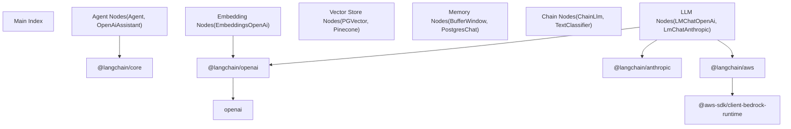
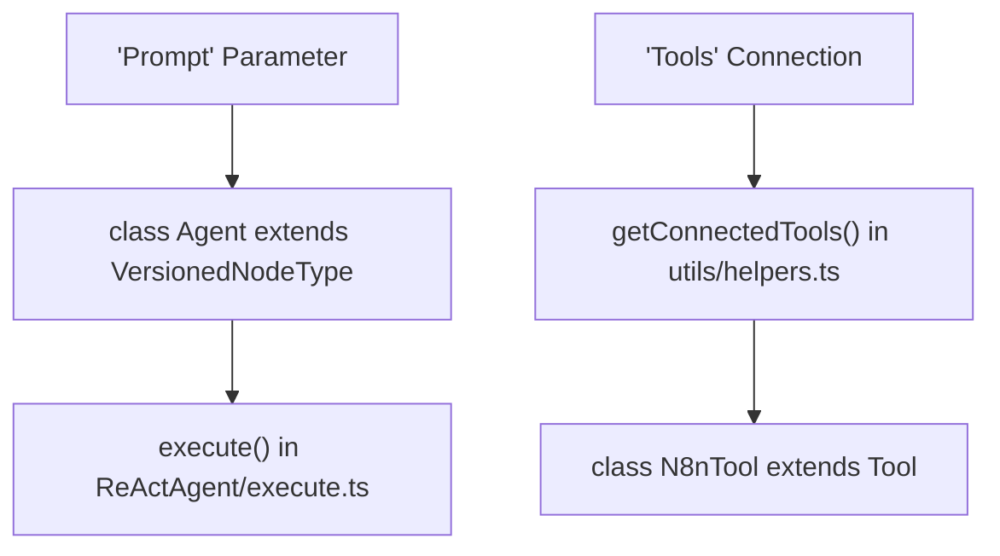
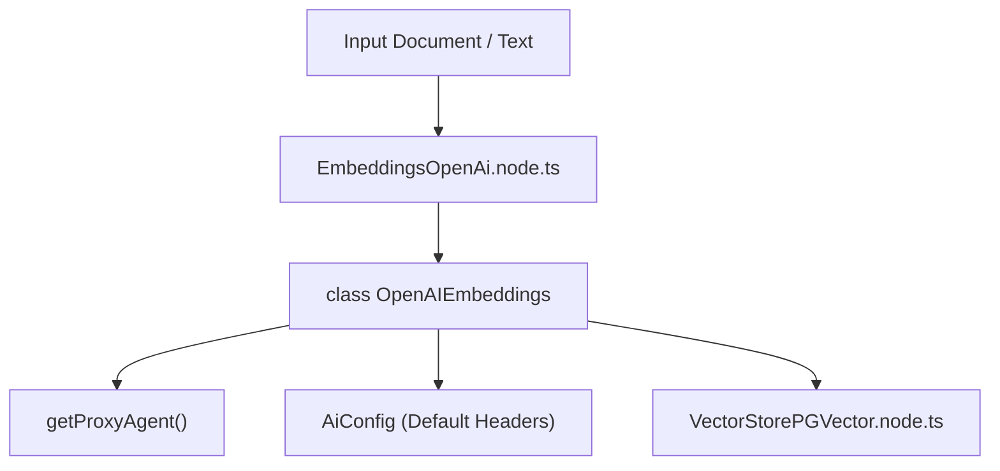

# AI 与 LangChain 节点 (AI and LangChain Nodes)

相关源文件

-   [packages/@n8n/config/src/configs/ai.config.ts](https://github.com/n8n-io/n8n/blob/88f170b9/packages/@n8n/config/src/configs/ai.config.ts)
-   [packages/@n8n/config/src/configs/redis.config.ts](https://github.com/n8n-io/n8n/blob/88f170b9/packages/@n8n/config/src/configs/redis.config.ts)
-   [packages/@n8n/nodes-langchain/credentials/AzureOpenAiApi.credentials.ts](https://github.com/n8n-io/n8n/blob/88f170b9/packages/@n8n/nodes-langchain/credentials/AzureOpenAiApi.credentials.ts)
-   [packages/@n8n/nodes-langchain/nodes/agents/Agent/Agent.node.ts](https://github.com/n8n-io/n8n/blob/88f170b9/packages/@n8n/nodes-langchain/nodes/agents/Agent/Agent.node.ts)
-   [packages/@n8n/nodes-langchain/nodes/agents/Agent/agents/ConversationalAgent/description.ts](https://github.com/n8n-io/n8n/blob/88f170b9/packages/@n8n/nodes-langchain/nodes/agents/Agent/agents/ConversationalAgent/description.ts)
-   [packages/@n8n/nodes-langchain/nodes/agents/Agent/agents/ConversationalAgent/execute.ts](https://github.com/n8n-io/n8n/blob/88f170b9/packages/@n8n/nodes-langchain/nodes/agents/Agent/agents/ConversationalAgent/execute.ts)
-   [packages/@n8n/nodes-langchain/nodes/agents/Agent/agents/OpenAiFunctionsAgent/description.ts](https://github.com/n8n-io/n8n/blob/88f170b9/packages/@n8n/nodes-langchain/nodes/agents/Agent/agents/OpenAiFunctionsAgent/description.ts)
-   [packages/@n8n/nodes-langchain/nodes/agents/Agent/agents/OpenAiFunctionsAgent/execute.ts](https://github.com/n8n-io/n8n/blob/88f170b9/packages/@n8n/nodes-langchain/nodes/agents/Agent/agents/OpenAiFunctionsAgent/execute.ts)
-   [packages/@n8n/nodes-langchain/nodes/agents/Agent/agents/PlanAndExecuteAgent/execute.ts](https://github.com/n8n-io/n8n/blob/88f170b9/packages/@n8n/nodes-langchain/nodes/agents/Agent/agents/PlanAndExecuteAgent/execute.ts)
-   [packages/@n8n/nodes-langchain/nodes/agents/Agent/agents/ReActAgent/description.ts](https://github.com/n8n-io/n8n/blob/88f170b9/packages/@n8n/nodes-langchain/nodes/agents/Agent/agents/ReActAgent/description.ts)
-   [packages/@n8n/nodes-langchain/nodes/agents/Agent/agents/ReActAgent/execute.ts](https://github.com/n8n-io/n8n/blob/88f170b9/packages/@n8n/nodes-langchain/nodes/agents/Agent/agents/ReActAgent/execute.ts)
-   [packages/@n8n/nodes-langchain/nodes/agents/Agent/agents/SqlAgent/execute.ts](https://github.com/n8n-io/n8n/blob/88f170b9/packages/@n8n/nodes-langchain/nodes/agents/Agent/agents/SqlAgent/execute.ts)
-   [packages/@n8n/nodes-langchain/nodes/agents/Agent/agents/SqlAgent/other/handlers/sqlite.ts](https://github.com/n8n-io/n8n/blob/88f170b9/packages/@n8n/nodes-langchain/nodes/agents/Agent/agents/SqlAgent/other/handlers/sqlite.ts)
-   [packages/@n8n/nodes-langchain/nodes/agents/Agent/agents/SqlAgent/other/prompts.ts](https://github.com/n8n-io/n8n/blob/88f170b9/packages/@n8n/nodes-langchain/nodes/agents/Agent/agents/SqlAgent/other/prompts.ts)
-   [packages/@n8n/nodes-langchain/nodes/agents/OpenAiAssistant/OpenAiAssistant.node.ts](https://github.com/n8n-io/n8n/blob/88f170b9/packages/@n8n/nodes-langchain/nodes/agents/OpenAiAssistant/OpenAiAssistant.node.ts)
-   [packages/@n8n/nodes-langchain/nodes/chains/ChainLLM/ChainLlm.node.ts](https://github.com/n8n-io/n8n/blob/88f170b9/packages/@n8n/nodes-langchain/nodes/chains/ChainLLM/ChainLlm.node.ts)
-   [packages/@n8n/nodes-langchain/nodes/chains/ChainLLM/methods/config.ts](https://github.com/n8n-io/n8n/blob/88f170b9/packages/@n8n/nodes-langchain/nodes/chains/ChainLLM/methods/config.ts)
-   [packages/@n8n/nodes-langchain/nodes/chains/ChainLLM/methods/types.ts](https://github.com/n8n-io/n8n/blob/88f170b9/packages/@n8n/nodes-langchain/nodes/chains/ChainLLM/methods/types.ts)
-   [packages/@n8n/nodes-langchain/nodes/chains/ChainLLM/test/ChainLlm.node.test.ts](https://github.com/n8n-io/n8n/blob/88f170b9/packages/@n8n/nodes-langchain/nodes/chains/ChainLLM/test/ChainLlm.node.test.ts)
-   [packages/@n8n/nodes-langchain/nodes/chains/ChainLLM/test/config.test.ts](https://github.com/n8n-io/n8n/blob/88f170b9/packages/@n8n/nodes-langchain/nodes/chains/ChainLLM/test/config.test.ts)
-   [packages/@n8n/nodes-langchain/nodes/chains/ChainRetrievalQA/ChainRetrievalQa.node.ts](https://github.com/n8n-io/n8n/blob/88f170b9/packages/@n8n/nodes-langchain/nodes/chains/ChainRetrievalQA/ChainRetrievalQa.node.ts)
-   [packages/@n8n/nodes-langchain/nodes/chains/ChainRetrievalQA/test/ChainRetrievalQa.node.test.ts](https://github.com/n8n-io/n8n/blob/88f170b9/packages/@n8n/nodes-langchain/nodes/chains/ChainRetrievalQA/test/ChainRetrievalQa.node.test.ts)
-   [packages/@n8n/nodes-langchain/nodes/chains/ChainSummarization/V2/ChainSummarizationV2.node.ts](https://github.com/n8n-io/n8n/blob/88f170b9/packages/@n8n/nodes-langchain/nodes/chains/ChainSummarization/V2/ChainSummarizationV2.node.ts)
-   [packages/@n8n/nodes-langchain/nodes/chains/InformationExtractor/InformationExtractor.node.ts](https://github.com/n8n-io/n8n/blob/88f170b9/packages/@n8n/nodes-langchain/nodes/chains/InformationExtractor/InformationExtractor.node.ts)
-   [packages/@n8n/nodes-langchain/nodes/chains/InformationExtractor/processItem.ts](https://github.com/n8n-io/n8n/blob/88f170b9/packages/@n8n/nodes-langchain/nodes/chains/InformationExtractor/processItem.ts)
-   [packages/@n8n/nodes-langchain/nodes/chains/InformationExtractor/test/InformationExtraction.node.test.ts](https://github.com/n8n-io/n8n/blob/88f170b9/packages/@n8n/nodes-langchain/nodes/chains/InformationExtractor/test/InformationExtraction.node.test.ts)
-   [packages/@n8n/nodes-langchain/nodes/chains/InformationExtractor/test/processItem.test.ts](https://github.com/n8n-io/n8n/blob/88f170b9/packages/@n8n/nodes-langchain/nodes/chains/InformationExtractor/test/processItem.test.ts)
-   [packages/@n8n/nodes-langchain/nodes/chains/SentimentAnalysis/SentimentAnalysis.node.ts](https://github.com/n8n-io/n8n/blob/88f170b9/packages/@n8n/nodes-langchain/nodes/chains/SentimentAnalysis/SentimentAnalysis.node.ts)
-   [packages/@n8n/nodes-langchain/nodes/chains/TextClassifier/TextClassifier.node.ts](https://github.com/n8n-io/n8n/blob/88f170b9/packages/@n8n/nodes-langchain/nodes/chains/TextClassifier/TextClassifier.node.ts)
-   [packages/@n8n/nodes-langchain/nodes/chains/TextClassifier/processItem.ts](https://github.com/n8n-io/n8n/blob/88f170b9/packages/@n8n/nodes-langchain/nodes/chains/TextClassifier/processItem.ts)
-   [packages/@n8n/nodes-langchain/nodes/chains/TextClassifier/test/TextClassifier.node.test.ts](https://github.com/n8n-io/n8n/blob/88f170b9/packages/@n8n/nodes-langchain/nodes/chains/TextClassifier/test/TextClassifier.node.test.ts)
-   [packages/@n8n/nodes-langchain/nodes/chains/TextClassifier/test/processItem.test.ts](https://github.com/n8n-io/n8n/blob/88f170b9/packages/@n8n/nodes-langchain/nodes/chains/TextClassifier/test/processItem.test.ts)
-   [packages/@n8n/nodes-langchain/nodes/embeddings/EmbeddingsAwsBedrock/EmbeddingsAwsBedrock.node.ts](https://github.com/n8n-io/n8n/blob/88f170b9/packages/@n8n/nodes-langchain/nodes/embeddings/EmbeddingsAwsBedrock/EmbeddingsAwsBedrock.node.ts)
-   [packages/@n8n/nodes-langchain/nodes/embeddings/EmbeddingsAzureOpenAi/EmbeddingsAzureOpenAi.node.ts](https://github.com/n8n-io/n8n/blob/88f170b9/packages/@n8n/nodes-langchain/nodes/embeddings/EmbeddingsAzureOpenAi/EmbeddingsAzureOpenAi.node.ts)
-   [packages/@n8n/nodes-langchain/nodes/embeddings/EmbeddingsAzureOpenAi/azure.svg](https://github.com/n8n-io/n8n/blob/88f170b9/packages/@n8n/nodes-langchain/nodes/embeddings/EmbeddingsAzureOpenAi/azure.svg)
-   [packages/@n8n/nodes-langchain/nodes/embeddings/EmbeddingsOpenAI/EmbeddingsOpenAi.node.ts](https://github.com/n8n-io/n8n/blob/88f170b9/packages/@n8n/nodes-langchain/nodes/embeddings/EmbeddingsOpenAI/EmbeddingsOpenAi.node.ts)
-   [packages/@n8n/nodes-langchain/nodes/embeddings/test/EmbeddingsAzureOpenAi.test.ts](https://github.com/n8n-io/n8n/blob/88f170b9/packages/@n8n/nodes-langchain/nodes/embeddings/test/EmbeddingsAzureOpenAi.test.ts)
-   [packages/@n8n/nodes-langchain/nodes/llms/LMChatAnthropic/LmChatAnthropic.node.ts](https://github.com/n8n-io/n8n/blob/88f170b9/packages/@n8n/nodes-langchain/nodes/llms/LMChatAnthropic/LmChatAnthropic.node.ts)
-   [packages/@n8n/nodes-langchain/nodes/llms/LMChatOpenAi/LmChatOpenAi.node.ts](https://github.com/n8n-io/n8n/blob/88f170b9/packages/@n8n/nodes-langchain/nodes/llms/LMChatOpenAi/LmChatOpenAi.node.ts)
-   [packages/@n8n/nodes-langchain/nodes/llms/LMChatOpenAi/methods/\_\_tests\_\_/loadModels.test.ts](https://github.com/n8n-io/n8n/blob/88f170b9/packages/@n8n/nodes-langchain/nodes/llms/LMChatOpenAi/methods/__tests__/loadModels.test.ts)
-   [packages/@n8n/nodes-langchain/nodes/llms/LMChatOpenAi/methods/loadModels.ts](https://github.com/n8n-io/n8n/blob/88f170b9/packages/@n8n/nodes-langchain/nodes/llms/LMChatOpenAi/methods/loadModels.ts)
-   [packages/@n8n/nodes-langchain/nodes/llms/LMOpenAi/LmOpenAi.node.ts](https://github.com/n8n-io/n8n/blob/88f170b9/packages/@n8n/nodes-langchain/nodes/llms/LMOpenAi/LmOpenAi.node.ts)
-   [packages/@n8n/nodes-langchain/nodes/llms/LmChatAwsBedrock/LmChatAwsBedrock.node.ts](https://github.com/n8n-io/n8n/blob/88f170b9/packages/@n8n/nodes-langchain/nodes/llms/LmChatAwsBedrock/LmChatAwsBedrock.node.ts)
-   [packages/@n8n/nodes-langchain/nodes/llms/LmChatAwsBedrock/test/LmChatAwsBedrock.test.ts](https://github.com/n8n-io/n8n/blob/88f170b9/packages/@n8n/nodes-langchain/nodes/llms/LmChatAwsBedrock/test/LmChatAwsBedrock.test.ts)
-   [packages/@n8n/nodes-langchain/nodes/llms/LmChatAzureOpenAi/LmChatAzureOpenAi.node.ts](https://github.com/n8n-io/n8n/blob/88f170b9/packages/@n8n/nodes-langchain/nodes/llms/LmChatAzureOpenAi/LmChatAzureOpenAi.node.ts)
-   [packages/@n8n/nodes-langchain/nodes/llms/LmChatAzureOpenAi/azure.svg](https://github.com/n8n-io/n8n/blob/88f170b9/packages/@n8n/nodes-langchain/nodes/llms/LmChatAzureOpenAi/azure.svg)
-   [packages/@n8n/nodes-langchain/nodes/llms/LmChatDeepSeek/LmChatDeepSeek.node.ts](https://github.com/n8n-io/n8n/blob/88f170b9/packages/@n8n/nodes-langchain/nodes/llms/LmChatDeepSeek/LmChatDeepSeek.node.ts)
-   [packages/@n8n/nodes-langchain/nodes/llms/LmChatGroq/LmChatGroq.node.ts](https://github.com/n8n-io/n8n/blob/88f170b9/packages/@n8n/nodes-langchain/nodes/llms/LmChatGroq/LmChatGroq.node.ts)
-   [packages/@n8n/nodes-langchain/nodes/llms/LmChatOpenRouter/LmChatOpenRouter.node.ts](https://github.com/n8n-io/n8n/blob/88f170b9/packages/@n8n/nodes-langchain/nodes/llms/LmChatOpenRouter/LmChatOpenRouter.node.ts)
-   [packages/@n8n/nodes-langchain/nodes/llms/LmChatXAiGrok/LmChatXAiGrok.node.ts](https://github.com/n8n-io/n8n/blob/88f170b9/packages/@n8n/nodes-langchain/nodes/llms/LmChatXAiGrok/LmChatXAiGrok.node.ts)
-   [packages/@n8n/nodes-langchain/nodes/llms/test/LmChatOpenAi.test.ts](https://github.com/n8n-io/n8n/blob/88f170b9/packages/@n8n/nodes-langchain/nodes/llms/test/LmChatOpenAi.test.ts)
-   [packages/@n8n/nodes-langchain/nodes/output\_parser/OutputParserStructured/OutputParserStructured.node.ts](https://github.com/n8n-io/n8n/blob/88f170b9/packages/@n8n/nodes-langchain/nodes/output_parser/OutputParserStructured/OutputParserStructured.node.ts)
-   [packages/@n8n/nodes-langchain/nodes/vendors/OpenAi/helpers/\_\_tests\_\_/modelFiltering.test.ts](https://github.com/n8n-io/n8n/blob/88f170b9/packages/@n8n/nodes-langchain/nodes/vendors/OpenAi/helpers/__tests__/modelFiltering.test.ts)
-   [packages/@n8n/nodes-langchain/nodes/vendors/OpenAi/helpers/binary-data.ts](https://github.com/n8n-io/n8n/blob/88f170b9/packages/@n8n/nodes-langchain/nodes/vendors/OpenAi/helpers/binary-data.ts)
-   [packages/@n8n/nodes-langchain/nodes/vendors/OpenAi/helpers/constants.ts](https://github.com/n8n-io/n8n/blob/88f170b9/packages/@n8n/nodes-langchain/nodes/vendors/OpenAi/helpers/constants.ts)
-   [packages/@n8n/nodes-langchain/nodes/vendors/OpenAi/helpers/modelFiltering.ts](https://github.com/n8n-io/n8n/blob/88f170b9/packages/@n8n/nodes-langchain/nodes/vendors/OpenAi/helpers/modelFiltering.ts)
-   [packages/@n8n/nodes-langchain/nodes/vendors/OpenAi/helpers/polling.ts](https://github.com/n8n-io/n8n/blob/88f170b9/packages/@n8n/nodes-langchain/nodes/vendors/OpenAi/helpers/polling.ts)
-   [packages/@n8n/nodes-langchain/nodes/vendors/OpenAi/methods/\_\_tests\_\_/listSearch.test.ts](https://github.com/n8n-io/n8n/blob/88f170b9/packages/@n8n/nodes-langchain/nodes/vendors/OpenAi/methods/__tests__/listSearch.test.ts)
-   [packages/@n8n/nodes-langchain/nodes/vendors/OpenAi/methods/listSearch.ts](https://github.com/n8n-io/n8n/blob/88f170b9/packages/@n8n/nodes-langchain/nodes/vendors/OpenAi/methods/listSearch.ts)
-   [packages/@n8n/nodes-langchain/nodes/vendors/OpenAi/v1/OpenAiV1.node.ts](https://github.com/n8n-io/n8n/blob/88f170b9/packages/@n8n/nodes-langchain/nodes/vendors/OpenAi/v1/OpenAiV1.node.ts)
-   [packages/@n8n/nodes-langchain/nodes/vendors/OpenAi/v1/actions/assistant/create.operation.ts](https://github.com/n8n-io/n8n/blob/88f170b9/packages/@n8n/nodes-langchain/nodes/vendors/OpenAi/v1/actions/assistant/create.operation.ts)
-   [packages/@n8n/nodes-langchain/nodes/vendors/OpenAi/v1/actions/assistant/message.operation.ts](https://github.com/n8n-io/n8n/blob/88f170b9/packages/@n8n/nodes-langchain/nodes/vendors/OpenAi/v1/actions/assistant/message.operation.ts)
-   [packages/@n8n/nodes-langchain/utils/descriptions.ts](https://github.com/n8n-io/n8n/blob/88f170b9/packages/@n8n/nodes-langchain/utils/descriptions.ts)
-   [packages/@n8n/nodes-langchain/utils/helpers.ts](https://github.com/n8n-io/n8n/blob/88f170b9/packages/@n8n/nodes-langchain/utils/helpers.ts)
-   [packages/@n8n/nodes-langchain/utils/schemaParsing.ts](https://github.com/n8n-io/n8n/blob/88f170b9/packages/@n8n/nodes-langchain/utils/schemaParsing.ts)
-   [packages/@n8n/nodes-langchain/utils/tests/helpers.test.ts](https://github.com/n8n-io/n8n/blob/88f170b9/packages/@n8n/nodes-langchain/utils/tests/helpers.test.ts)

本页面记录了 `@n8n/nodes-langchain` 软件包，它为 AI 和语言模型工作流提供了基于 LangChain 的节点。这些节点通过 LangChain 框架实现了与大语言模型 (LLM)、向量数据库、Embeddings (嵌入)、Agent (代理) 和记忆系统的集成。

**范围**: 本页面涵盖节点实现、其架构以及集成模式。对于使用这些节点的 Chat Hub 系统，请参阅 [Chat Hub 后端系统 (Chat Hub Backend System)](/n8n-io/n8n/5.2-chat-hub-backend-system)。对于 AI 辅助工作流创建，请参阅 [AI 工作流生成器 (AI Workflow Builder)](/n8n-io/n8n/5.1-ai-workflow-builder)。对于凭据管理，请参阅 [节点的凭据系统 (Credential System for Nodes)](/n8n-io/n8n/4.4-credential-system-for-nodes)。

---

## 软件包架构 (Package Architecture)

`@n8n/nodes-langchain` 软件包是 n8n monorepo 中一个独立的节点集合，它将 LangChain 功能封装到 n8n 兼容的节点中。它提供按功能分类的专门节点，如 LLM、Agent (代理)、Chain (链) 和 Vector Store (向量存储)。

**软件包结构图**

**来源**: [packages/@n8n/nodes-langchain/nodes/llms/LMChatOpenAi/LmChatOpenAi.node.ts1](https://github.com/n8n-io/n8n/blob/88f170b9/packages/@n8n/nodes-langchain/nodes/llms/LMChatOpenAi/LmChatOpenAi.node.ts#L1-L1) | [packages/@n8n/nodes-langchain/nodes/llms/LMChatAnthropic/LmChatAnthropic.node.ts1](https://github.com/n8n-io/n8n/blob/88f170b9/packages/@n8n/nodes-langchain/nodes/llms/LMChatAnthropic/LmChatAnthropic.node.ts#L1-L1) | [packages/@n8n/nodes-langchain/nodes/llms/LmChatAwsBedrock/LmChatAwsBedrock.node.ts1-3](https://github.com/n8n-io/n8n/blob/88f170b9/packages/@n8n/nodes-langchain/nodes/llms/LmChatAwsBedrock/LmChatAwsBedrock.node.ts#L1-L3)

---

## LLM 与聊天模型节点 (LLM and Chat Model Nodes)

LLM 节点封装了各种语言模型提供商。它们通常实现 `INodeType` 接口，并使用 `supplyData` 方法向下游节点（如 Chain 或 Agent）提供 LangChain 模型实例。

### OpenAI 聊天模型 (`LmChatOpenAi`)

OpenAI 节点支持标准的 GPT 模型以及较新的 "o1/o3" 系列 [packages/@n8n/nodes-langchain/nodes/llms/LMChatOpenAi/LmChatOpenAi.node.ts163-165](https://github.com/n8n-io/n8n/blob/88f170b9/packages/@n8n/nodes-langchain/nodes/llms/LMChatOpenAi/LmChatOpenAi.node.ts#L163-L165)。它具有动态模型加载器 `searchModels`，可过滤聊天兼容模型 [packages/@n8n/nodes-langchain/nodes/llms/LMChatOpenAi/methods/loadModels.ts10-51](https://github.com/n8n-io/n8n/blob/88f170b9/packages/@n8n/nodes-langchain/nodes/llms/LMChatOpenAi/methods/loadModels.ts#L10-L51)。

**关键特性**:

-   **JSON 模式**: 要求在提示词中包含 "json" 一词，并使用特定的模型版本 [packages/@n8n/nodes-langchain/nodes/llms/LMChatOpenAi/LmChatOpenAi.node.ts29-35](https://github.com/n8n-io/n8n/blob/88f170b9/packages/@n8n/nodes-langchain/nodes/llms/LMChatOpenAi/LmChatOpenAi.node.ts#L29-L35)。
-   **Responses API**: 对于受支持的模型默认启用 [packages/@n8n/nodes-langchain/nodes/llms/LMChatOpenAi/LmChatOpenAi.node.ts246-250](https://github.com/n8n-io/n8n/blob/88f170b9/packages/@n8n/nodes-langchain/nodes/llms/LMChatOpenAi/LmChatOpenAi.node.ts#L246-L250)。
-   **错误处理**: 使用 `openAiFailedAttemptHandler` 进行专门的错误映射 [packages/@n8n/nodes-langchain/nodes/llms/LMChatOpenAi/LmChatOpenAi.node.ts16](https://github.com/n8n-io/n8n/blob/88f170b9/packages/@n8n/nodes-langchain/nodes/llms/LMChatOpenAi/LmChatOpenAi.node.ts#L16-L16)。

### Anthropic 聊天模型 (`LmChatAnthropic`)

支持 Claude 系列（3.5 Sonnet、Opus、Haiku）。它包含一个具有可配置令牌预算（最少 1024 个令牌）的 "Thinking" 模式 [packages/@n8n/nodes-langchain/nodes/llms/LMChatAnthropic/LmChatAnthropic.node.ts74-75](https://github.com/n8n-io/n8n/blob/88f170b9/packages/@n8n/nodes-langchain/nodes/llms/LMChatAnthropic/LmChatAnthropic.node.ts#L74-L75)。

### AWS Bedrock 聊天模型 (`LmChatAwsBedrock`)

使用来自 `@langchain/aws` 的 `ChatBedrockConverse` [packages/@n8n/nodes-langchain/nodes/llms/LmChatAwsBedrock/LmChatAwsBedrock.node.ts3](https://github.com/n8n-io/n8n/blob/88f170b9/packages/@n8n/nodes-langchain/nodes/llms/LmChatAwsBedrock/LmChatAwsBedrock.node.ts#L3-L3)。它允许在 "On-Demand Models" (按需模型) 和 "Inference Profiles" (推理配置文件) 之间进行选择（跨区域模型如 Claude 3.5 Sonnet 所需） [packages/@n8n/nodes-langchain/nodes/llms/LmChatAwsBedrock/LmChatAwsBedrock.node.ts64-87](https://github.com/n8n-io/n8n/blob/88f170b9/packages/@n8n/nodes-langchain/nodes/llms/LmChatAwsBedrock/LmChatAwsBedrock.node.ts#L64-L87)。

**来源**: [packages/@n8n/nodes-langchain/nodes/llms/LMChatOpenAi/LmChatOpenAi.node.ts68-116](https://github.com/n8n-io/n8n/blob/88f170b9/packages/@n8n/nodes-langchain/nodes/llms/LMChatOpenAi/LmChatOpenAi.node.ts#L68-L116) | [packages/@n8n/nodes-langchain/nodes/llms/LMChatAnthropic/LmChatAnthropic.node.ts76-121](https://github.com/n8n-io/n8n/blob/88f170b9/packages/@n8n/nodes-langchain/nodes/llms/LMChatAnthropic/LmChatAnthropic.node.ts#L76-L121) | [packages/@n8n/nodes-langchain/nodes/llms/LmChatAwsBedrock/LmChatAwsBedrock.node.ts20-60](https://github.com/n8n-io/n8n/blob/88f170b9/packages/@n8n/nodes-langchain/nodes/llms/LmChatAwsBedrock/LmChatAwsBedrock.node.ts#L20-L60)

---

## Agent 节点与工具执行 (Agent Nodes and Tool Execution)

Agent (代理) 节点是生成并执行行动计划的 "Root Nodes" (根节点)。主要的 `Agent` 节点是版本化的，Version 3 是最新版本 [packages/@n8n/nodes-langchain/nodes/agents/Agent/Agent.node.ts8-78](https://github.com/n8n-io/n8n/blob/88f170b9/packages/@n8n/nodes-langchain/nodes/agents/Agent/Agent.node.ts#L8-L78)。

**Agent 实现映射**

**工具集成**: 工具通过 `AiTool` 连接类型进行连接 [packages/@n8n/nodes-langchain/utils/helpers.ts161-163](https://github.com/n8n-io/n8n/blob/88f170b9/packages/@n8n/nodes-langchain/utils/helpers.ts#L161-L163)。辅助函数 `getConnectedTools` 解析这些连接，同时处理单个工具和 `StructuredToolkit` 对象 [packages/@n8n/nodes-langchain/utils/helpers.ts174-187](https://github.com/n8n-io/n8n/blob/88f170b9/packages/@n8n/nodes-langchain/utils/helpers.ts#L174-L187)。

**来源**: [packages/@n8n/nodes-langchain/nodes/agents/Agent/Agent.node.ts8-31](https://github.com/n8n-io/n8n/blob/88f170b9/packages/@n8n/nodes-langchain/nodes/agents/Agent/Agent.node.ts#L8-L31) | [packages/@n8n/nodes-langchain/utils/helpers.ts154-198](https://github.com/n8n-io/n8n/blob/88f170b9/packages/@n8n/nodes-langchain/utils/helpers.ts#L154-L198)

---

## Chain 节点 (Chain Nodes)

Chain (链) 代表预定义的逻辑流。

### 基础 LLM 链 (`ChainLlm`)

一个用于提示 LLM 的简单节点。它支持：

-   **批处理 (Batching)**: 使用可配置的 `batchSize` (批次大小) 和 `delayBetweenBatches` (批次间延迟) 处理多个条目 [packages/@n8n/nodes-langchain/nodes/chains/ChainLLM/ChainLlm.node.ts77-82](https://github.com/n8n-io/n8n/blob/88f170b9/packages/@n8n/nodes-langchain/nodes/chains/ChainLLM/ChainLlm.node.ts#L77-L82)。
-   **输出解析 (Output Parsing)**: 如果附加了输出解析器或使用了特定的模型版本，可以将对象直接展开为 JSON [packages/@n8n/nodes-langchain/nodes/chains/ChainLLM/ChainLlm.node.ts72-75](https://github.com/n8n-io/n8n/blob/88f170b9/packages/@n8n/nodes-langchain/nodes/chains/ChainLLM/ChainLlm.node.ts#L72-L75)。

### 文本分类器 (`TextClassifier`)

将文本分类到 `fixedCollection` 中定义的类别中 [packages/@n8n/nodes-langchain/nodes/chains/TextClassifier/TextClassifier.node.ts86-117](https://github.com/n8n-io/n8n/blob/88f170b9/packages/@n8n/nodes-langchain/nodes/chains/TextClassifier/TextClassifier.node.ts#L86-L117)。

-   **逻辑**: 它根据类别动态生成 Zod schema [packages/@n8n/nodes-langchain/nodes/chains/TextClassifier/TextClassifier.node.ts210-223](https://github.com/n8n-io/n8n/blob/88f170b9/packages/@n8n/nodes-langchain/nodes/chains/TextClassifier/TextClassifier.node.ts#L210-L223)。
-   **自动修复 (Auto-Fixing)**: 如果初始输出未通过验证，可以使用 `OutputFixingParser` 重试 LLM 调用 [packages/@n8n/nodes-langchain/nodes/chains/TextClassifier/TextClassifier.node.ts227-229](https://github.com/n8n-io/n8n/blob/88f170b9/packages/@n8n/nodes-langchain/nodes/chains/TextClassifier/TextClassifier.node.ts#L227-L229)。

**来源**: [packages/@n8n/nodes-langchain/nodes/chains/ChainLLM/ChainLlm.node.ts23-63](https://github.com/n8n-io/n8n/blob/88f170b9/packages/@n8n/nodes-langchain/nodes/chains/ChainLLM/ChainLlm.node.ts#L23-L63) | [packages/@n8n/nodes-langchain/nodes/chains/TextClassifier/TextClassifier.node.ts31-73](https://github.com/n8n-io/n8n/blob/88f170b9/packages/@n8n/nodes-langchain/nodes/chains/TextClassifier/TextClassifier.node.ts#L31-L73)

---

## 向量存储与 Embeddings (Vector Store and Embeddings)

向量存储实现了 RAG (检索增强生成)。它们需要一个 "Embeddings" (嵌入) 节点将文本转换为数值向量。

### OpenAI Embeddings (`EmbeddingsOpenAi`)

-   **模型**: 默认为 `text-embedding-3-small` [packages/@n8n/nodes-langchain/nodes/embeddings/EmbeddingsOpenAI/EmbeddingsOpenAi.node.ts74](https://github.com/n8n-io/n8n/blob/88f170b9/packages/@n8n/nodes-langchain/nodes/embeddings/EmbeddingsOpenAI/EmbeddingsOpenAi.node.ts#L74-L74)。
-   **维度 (Dimensions)**: 对于受支持的模型，支持可配置的维度（256、512、1024、1536、3072） [packages/@n8n/nodes-langchain/nodes/embeddings/EmbeddingsOpenAI/EmbeddingsOpenAi.node.ts146-174](https://github.com/n8n-io/n8n/blob/88f170b9/packages/@n8n/nodes-langchain/nodes/embeddings/EmbeddingsOpenAI/EmbeddingsOpenAi.node.ts#L146-L174)。
-   **实现**: 封装了来自 `@langchain/openai` 的 `OpenAIEmbeddings` [packages/@n8n/nodes-langchain/nodes/embeddings/EmbeddingsOpenAI/EmbeddingsOpenAi.node.ts1](https://github.com/n8n-io/n8n/blob/88f170b9/packages/@n8n/nodes-langchain/nodes/embeddings/EmbeddingsOpenAI/EmbeddingsOpenAi.node.ts#L1-L1)。

**数据流: 从文本到向量存储**

**来源**: [packages/@n8n/nodes-langchain/nodes/embeddings/EmbeddingsOpenAI/EmbeddingsOpenAi.node.ts77-117](https://github.com/n8n-io/n8n/blob/88f170b9/packages/@n8n/nodes-langchain/nodes/embeddings/EmbeddingsOpenAI/EmbeddingsOpenAi.node.ts#L77-L117) | [packages/@n8n/nodes-langchain/nodes/embeddings/EmbeddingsOpenAI/EmbeddingsOpenAi.node.ts232-269](https://github.com/n8n-io/n8n/blob/88f170b9/packages/@n8n/nodes-langchain/nodes/embeddings/EmbeddingsOpenAI/EmbeddingsOpenAi.node.ts#L232-L269)

---

## 实用工具与共享逻辑 (Utilities and Shared Logic)

### 提示词与会话辅助函数 (Prompt and Session Helpers)

`utils/helpers.ts` 文件包含了 AI 节点的关键逻辑：

-   `getPromptInputByType`: 解析用户消息，支持 "auto" (自动) 模式，该模式会查找来自 Chat Trigger 节点的 `chatInput` [packages/@n8n/nodes-langchain/utils/helpers.ts17-50](https://github.com/n8n-io/n8n/blob/88f170b9/packages/@n8n/nodes-langchain/utils/helpers.ts#L17-L50)。
-   `getSessionId`: 提取记忆节点的会话 ID，尝试从 body 数据或连接的 Chat Trigger 中获取 [packages/@n8n/nodes-langchain/utils/helpers.ts52-105](https://github.com/n8n-io/n8n/blob/88f170b9/packages/@n8n/nodes-langchain/utils/helpers.ts#L52-L105)。

### 通用节点属性 (Common Node Properties)

`utils/descriptions.ts` 文件集中管理 UI 组件：

-   `schemaTypeField`: "Generate From JSON Example" (从 JSON 示例生成) 与 "Manual" (手动) 的选项 [packages/@n8n/nodes-langchain/utils/descriptions.ts3-22](https://github.com/n8n-io/n8n/blob/88f170b9/packages/@n8n/nodes-langchain/utils/descriptions.ts#L3-L22)。
-   `promptTypeOptions`: 标准化的提示词来源选择 [packages/@n8n/nodes-langchain/utils/descriptions.ts129-150](https://github.com/n8n-io/n8n/blob/88f170b9/packages/@n8n/nodes-langchain/utils/descriptions.ts#L129-L150)。

**来源**: [packages/@n8n/nodes-langchain/utils/helpers.ts1-119](https://github.com/n8n-io/n8n/blob/88f170b9/packages/@n8n/nodes-langchain/utils/helpers.ts#L1-L119) | [packages/@n8n/nodes-langchain/utils/descriptions.ts1-203](https://github.com/n8n-io/n8n/blob/88f170b9/packages/@n8n/nodes-langchain/utils/descriptions.ts#L1-L203)
