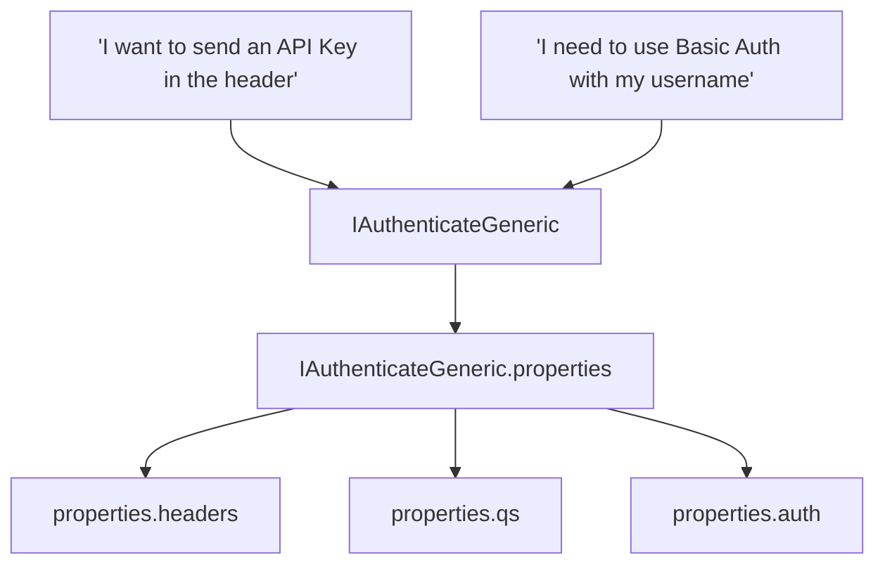

# 节点的凭据系统 (Credential System for Nodes)

相关源文件

-   [packages/@n8n/api-types/src/dto/credentials/\_\_tests\_\_/credentials-get-many-request.dto.test.ts](https://github.com/n8n-io/n8n/blob/88f170b9/packages/@n8n/api-types/src/dto/credentials/__tests__/credentials-get-many-request.dto.test.ts)
-   [packages/@n8n/api-types/src/dto/credentials/\_\_tests\_\_/credentials-get-one-request.dto.test.ts](https://github.com/n8n-io/n8n/blob/88f170b9/packages/@n8n/api-types/src/dto/credentials/__tests__/credentials-get-one-request.dto.test.ts)
-   [packages/@n8n/api-types/src/dto/credentials/credentials-get-many-request.dto.ts](https://github.com/n8n-io/n8n/blob/88f170b9/packages/@n8n/api-types/src/dto/credentials/credentials-get-many-request.dto.ts)
-   [packages/@n8n/api-types/src/dto/credentials/credentials-get-one-request.dto.ts](https://github.com/n8n-io/n8n/blob/88f170b9/packages/@n8n/api-types/src/dto/credentials/credentials-get-one-request.dto.ts)
-   [packages/@n8n/client-oauth2/src/index.ts](https://github.com/n8n-io/n8n/blob/88f170b9/packages/@n8n/client-oauth2/src/index.ts)
-   [packages/@n8n/client-oauth2/src/types.ts](https://github.com/n8n-io/n8n/blob/88f170b9/packages/@n8n/client-oauth2/src/types.ts)
-   [packages/@n8n/client-oauth2/src/utils.ts](https://github.com/n8n-io/n8n/blob/88f170b9/packages/@n8n/client-oauth2/src/utils.ts)
-   [packages/@n8n/nodes-langchain/credentials/AzureEntraCognitiveServicesOAuth2Api.credentials.ts](https://github.com/n8n-io/n8n/blob/88f170b9/packages/@n8n/nodes-langchain/credentials/AzureEntraCognitiveServicesOAuth2Api.credentials.ts)
-   [packages/@n8n/nodes-langchain/nodes/llms/LmChatAzureOpenAi/\_\_tests\_\_/N8nOAuth2TokenCredential.test.ts](https://github.com/n8n-io/n8n/blob/88f170b9/packages/@n8n/nodes-langchain/nodes/llms/LmChatAzureOpenAi/__tests__/N8nOAuth2TokenCredential.test.ts)
-   [packages/@n8n/nodes-langchain/nodes/llms/LmChatAzureOpenAi/\_\_tests\_\_/api-key.handler.test.ts](https://github.com/n8n-io/n8n/blob/88f170b9/packages/@n8n/nodes-langchain/nodes/llms/LmChatAzureOpenAi/__tests__/api-key.handler.test.ts)
-   [packages/@n8n/nodes-langchain/nodes/llms/LmChatAzureOpenAi/\_\_tests\_\_/oauth2.handler.test.ts](https://github.com/n8n-io/n8n/blob/88f170b9/packages/@n8n/nodes-langchain/nodes/llms/LmChatAzureOpenAi/__tests__/oauth2.handler.test.ts)
-   [packages/@n8n/nodes-langchain/nodes/llms/LmChatAzureOpenAi/credentials/N8nOAuth2TokenCredential.ts](https://github.com/n8n-io/n8n/blob/88f170b9/packages/@n8n/nodes-langchain/nodes/llms/LmChatAzureOpenAi/credentials/N8nOAuth2TokenCredential.ts)
-   [packages/@n8n/nodes-langchain/nodes/llms/LmChatAzureOpenAi/credentials/api-key.ts](https://github.com/n8n-io/n8n/blob/88f170b9/packages/@n8n/nodes-langchain/nodes/llms/LmChatAzureOpenAi/credentials/api-key.ts)
-   [packages/@n8n/nodes-langchain/nodes/llms/LmChatAzureOpenAi/credentials/oauth2.ts](https://github.com/n8n-io/n8n/blob/88f170b9/packages/@n8n/nodes-langchain/nodes/llms/LmChatAzureOpenAi/credentials/oauth2.ts)
-   [packages/@n8n/nodes-langchain/nodes/llms/LmChatAzureOpenAi/properties.ts](https://github.com/n8n-io/n8n/blob/88f170b9/packages/@n8n/nodes-langchain/nodes/llms/LmChatAzureOpenAi/properties.ts)
-   [packages/cli/src/credentials/\_\_tests\_\_/credentials.controller.test.ts](https://github.com/n8n-io/n8n/blob/88f170b9/packages/cli/src/credentials/__tests__/credentials.controller.test.ts)
-   [packages/cli/src/credentials/\_\_tests\_\_/credentials.service.test.ts](https://github.com/n8n-io/n8n/blob/88f170b9/packages/cli/src/credentials/__tests__/credentials.service.test.ts)
-   [packages/cli/src/credentials/\_\_tests\_\_/credentials.test-data.ts](https://github.com/n8n-io/n8n/blob/88f170b9/packages/cli/src/credentials/__tests__/credentials.test-data.ts)
-   [packages/cli/src/credentials/\_\_tests\_\_/validation.test.ts](https://github.com/n8n-io/n8n/blob/88f170b9/packages/cli/src/credentials/__tests__/validation.test.ts)
-   [packages/cli/src/credentials/credentials.controller.ts](https://github.com/n8n-io/n8n/blob/88f170b9/packages/cli/src/credentials/credentials.controller.ts)
-   [packages/cli/src/credentials/credentials.service.ee.ts](https://github.com/n8n-io/n8n/blob/88f170b9/packages/cli/src/credentials/credentials.service.ee.ts)
-   [packages/cli/src/credentials/credentials.service.ts](https://github.com/n8n-io/n8n/blob/88f170b9/packages/cli/src/credentials/credentials.service.ts)
-   [packages/cli/src/credentials/validation.ts](https://github.com/n8n-io/n8n/blob/88f170b9/packages/cli/src/credentials/validation.ts)
-   [packages/cli/src/modules/external-secrets.ee/\_\_tests\_\_/redaction.service.ee.test.ts](https://github.com/n8n-io/n8n/blob/88f170b9/packages/cli/src/modules/external-secrets.ee/__tests__/redaction.service.ee.test.ts)
-   [packages/cli/src/modules/external-secrets.ee/redaction.service.ee.ts](https://github.com/n8n-io/n8n/blob/88f170b9/packages/cli/src/modules/external-secrets.ee/redaction.service.ee.ts)
-   [packages/cli/src/public-api/v1/handlers/credentials/\_\_tests\_\_/credentials.service.test.ts](https://github.com/n8n-io/n8n/blob/88f170b9/packages/cli/src/public-api/v1/handlers/credentials/__tests__/credentials.service.test.ts)
-   [packages/cli/src/public-api/v1/handlers/credentials/credentials.handler.ts](https://github.com/n8n-io/n8n/blob/88f170b9/packages/cli/src/public-api/v1/handlers/credentials/credentials.handler.ts)
-   [packages/cli/src/public-api/v1/handlers/credentials/credentials.service.ts](https://github.com/n8n-io/n8n/blob/88f170b9/packages/cli/src/public-api/v1/handlers/credentials/credentials.service.ts)
-   [packages/cli/templates/oauth-callback.handlebars](https://github.com/n8n-io/n8n/blob/88f170b9/packages/cli/templates/oauth-callback.handlebars)
-   [packages/cli/templates/oauth-error-callback.handlebars](https://github.com/n8n-io/n8n/blob/88f170b9/packages/cli/templates/oauth-error-callback.handlebars)
-   [packages/cli/test/integration/ai/ai.api.test.ts](https://github.com/n8n-io/n8n/blob/88f170b9/packages/cli/test/integration/ai/ai.api.test.ts)
-   [packages/cli/test/integration/credentials/credentials.api.ee.test.ts](https://github.com/n8n-io/n8n/blob/88f170b9/packages/cli/test/integration/credentials/credentials.api.ee.test.ts)
-   [packages/cli/test/integration/credentials/credentials.api.test.ts](https://github.com/n8n-io/n8n/blob/88f170b9/packages/cli/test/integration/credentials/credentials.api.test.ts)
-   [packages/cli/test/integration/public-api/credentials.test.ts](https://github.com/n8n-io/n8n/blob/88f170b9/packages/cli/test/integration/public-api/credentials.test.ts)
-   [packages/core/src/execution-engine/node-execution-context/utils/\_\_tests\_\_/request-helper-functions.test.ts](https://github.com/n8n-io/n8n/blob/88f170b9/packages/core/src/execution-engine/node-execution-context/utils/__tests__/request-helper-functions.test.ts)
-   [packages/core/src/execution-engine/node-execution-context/utils/request-helper-functions.ts](https://github.com/n8n-io/n8n/blob/88f170b9/packages/core/src/execution-engine/node-execution-context/utils/request-helper-functions.ts)
-   [packages/core/src/execution-engine/node-execution-context/utils/request-helpers/\_\_tests\_\_/axios-utils.test.ts](https://github.com/n8n-io/n8n/blob/88f170b9/packages/core/src/execution-engine/node-execution-context/utils/request-helpers/__tests__/axios-utils.test.ts)
-   [packages/core/src/execution-engine/node-execution-context/utils/request-helpers/axios-config.ts](https://github.com/n8n-io/n8n/blob/88f170b9/packages/core/src/execution-engine/node-execution-context/utils/request-helpers/axios-config.ts)
-   [packages/core/src/execution-engine/node-execution-context/utils/request-helpers/axios-utils.ts](https://github.com/n8n-io/n8n/blob/88f170b9/packages/core/src/execution-engine/node-execution-context/utils/request-helpers/axios-utils.ts)
-   [packages/core/src/execution-engine/node-execution-context/utils/request-helpers/index.ts](https://github.com/n8n-io/n8n/blob/88f170b9/packages/core/src/execution-engine/node-execution-context/utils/request-helpers/index.ts)
-   [packages/nodes-base/credentials/OAuth2Api.credentials.ts](https://github.com/n8n-io/n8n/blob/88f170b9/packages/nodes-base/credentials/OAuth2Api.credentials.ts)

本页面解释了 n8n 中的节点如何声明凭据需求、`ICredentialType` 接口、身份验证方法、凭据验证以及内部解析系统。它还涵盖了用于标准化 OAuth2 流程的 `@n8n/client-oauth2` 软件包。

---

## ICredentialType 接口

`ICredentialType` 接口是 n8n 中任何凭据的蓝图。它定义了用户必须提供的字段，以及这些字段如何用于请求的身份验证。

**核心结构**

```typescript
export interface ICredentialType {
	name: string;
	displayName: string;
	documentationUrl?: string;
	properties: INodeProperties[];
	extends?: string[];
	icon?: Icon;
	authenticate?: IAuthenticate;
	test?: ICredentialTestRequest;
}
```
来源: [packages/workflow/src/interfaces.ts346-372](https://github.com/n8n-io/n8n/blob/88f170b9/packages/workflow/src/interfaces.ts#L346-L372)

### 凭据属性 (Credential Properties)

属性定义了 UI 中的输入字段。对于凭据，API 密钥或密码等敏感字段应使用 `typeOptions: { password: true }`，以确保在发送到前端时它们被脱敏。

| 特性 | 描述 | 代码引用 |
| --- | --- | --- |
| **脱敏 (Redaction)** | 敏感值被替换为 `CREDENTIAL_BLANKING_VALUE` 或 `CREDENTIAL_EMPTY_VALUE`。 | [packages/cli/src/credentials/credentials.service.ts31-32](https://github.com/n8n-io/n8n/blob/88f170b9/packages/cli/src/credentials/credentials.service.ts#L31-L32) [packages/cli/src/credentials/credentials.service.ts162-171](https://github.com/n8n-io/n8n/blob/88f170b9/packages/cli/src/credentials/credentials.service.ts#L162-L171) |
| **继承 (Inheritance)** | 使用 `extends` 数组从其他凭据类型继承属性（例如，特定服务继承基础的 `oAuth2Api`）。 | [packages/workflow/src/interfaces.ts351](https://github.com/n8n-io/n8n/blob/88f170b9/packages/workflow/src/interfaces.ts#L351-L351) |

来源: [packages/cli/src/credentials/credentials.service.ts162-171](https://github.com/n8n-io/n8n/blob/88f170b9/packages/cli/src/credentials/credentials.service.ts#L162-L171) [packages/workflow/src/interfaces.ts346-372](https://github.com/n8n-io/n8n/blob/88f170b9/packages/workflow/src/interfaces.ts#L346-L372)

---

## 身份验证方法 (Authentication Methods)

凭据通过 `authenticate` 属性指定它们如何修改发出的 HTTP 请求。

### 通用身份验证 (Generic Authentication)

大多数凭据使用声明式的 `generic` 身份验证。这允许直接将凭据值映射到 Header、Query 参数或 Basic Auth 字段，而无需编写代码。


来源: [packages/workflow/src/interfaces.ts259-278](https://github.com/n8n-io/n8n/blob/88f170b9/packages/workflow/src/interfaces.ts#L259-L278) [packages/core/src/execution-engine/node-execution-context/utils/request-helper-functions.ts118-200](https://github.com/n8n-io/n8n/blob/88f170b9/packages/core/src/execution-engine/node-execution-context/utils/request-helper-functions.ts#L118-L200)

### OAuth2 与 `@n8n/client-oauth2`

对于 OAuth2，n8n 使用 `@n8n/client-oauth2` 软件包来处理令牌交换和刷新的复杂性。

**关键组件:**

-   **`ClientOAuth2`**: 管理 OAuth2 流程的核心类。 [packages/core/src/execution-engine/node-execution-context/utils/request-helper-functions.ts17-18](https://github.com/n8n-io/n8n/blob/88f170b9/packages/core/src/execution-engine/node-execution-context/utils/request-helper-functions.ts#L17-L18)
-   **令牌刷新 (Token Refreshing)**: 如果存在 `oauthTokenData` 且当前令牌已过期，系统会自动尝试刷新令牌。 [packages/core/src/execution-engine/node-execution-context/utils/request-helper-functions.test.ts29-32](https://github.com/n8n-io/n8n/blob/88f170b9/packages/core/src/execution-engine/node-execution-context/utils/request-helper-functions.test.ts#L29-L32)

来源: [packages/core/src/execution-engine/node-execution-context/utils/request-helper-functions.ts10-18](https://github.com/n8n-io/n8n/blob/88f170b9/packages/core/src/execution-engine/node-execution-context/utils/request-helper-functions.ts#L10-L18) [packages/core/src/execution-engine/node-execution-context/utils/request-helper-functions.test.ts29-32](https://github.com/n8n-io/n8n/blob/88f170b9/packages/core/src/execution-engine/node-execution-context/utils/request-helper-functions.test.ts#L29-L32)

---

## 凭据解析与安全 (Credential Resolution and Security)

当节点执行时，`CredentialsService` 和 `CredentialsHelper` 会将存储的加密凭据解析为解密对象，供节点的执行上下文使用。

### 数据流: 从解析到执行 (Data Flow: Resolution to Execution)

> **[Mermaid sequence]**
> *(图表结构无法解析)*

来源: [packages/cli/src/credentials/credentials.service.ts86-105](https://github.com/n8n-io/n8n/blob/88f170b9/packages/cli/src/credentials/credentials.service.ts#L86-L105) [packages/cli/src/credentials/credentials.service.ts124-136](https://github.com/n8n-io/n8n/blob/88f170b9/packages/cli/src/credentials/credentials.service.ts#L124-L136) [packages/cli/src/credentials/credentials.controller.ts112-137](https://github.com/n8n-io/n8n/blob/88f170b9/packages/cli/src/credentials/credentials.controller.ts#L112-L137)

### 凭据验证 (`test`) (Credential Validation (test))

凭据类型可以定义 `test` 属性。这是一个 HTTP 请求配置，n8n 使用它来验证凭据是否有效（例如，调用 `/me` 或 `/status` 接口）。

**验证逻辑:**

1.  前端触发 `/credentials/test` 接口。 [packages/cli/src/credentials/credentials.controller.ts140-141](https://github.com/n8n-io/n8n/blob/88f170b9/packages/cli/src/credentials/credentials.controller.ts#L140-L141)
2.  调用 `CredentialsService.test()`。 [packages/cli/src/credentials/credentials.service.ts175](https://github.com/n8n-io/n8n/blob/88f170b9/packages/cli/src/credentials/credentials.service.ts#L175-L175)
3.  `CredentialsTester` 服务执行定义的请求，并根据验证规则检查响应。 [packages/cli/src/services/credentials-tester.service.ts](https://github.com/n8n-io/n8n/blob/88f170b9/packages/cli/src/services/credentials-tester.service.ts)

来源: [packages/cli/src/credentials/credentials.controller.ts140-176](https://github.com/n8n-io/n8n/blob/88f170b9/packages/cli/src/credentials/credentials.controller.ts#L140-L176) [packages/cli/src/credentials/credentials.service.ts94](https://github.com/n8n-io/n8n/blob/88f170b9/packages/cli/src/credentials/credentials.service.ts#L94-L94)

---

## 实现细节 (Implementation Details)

### CredentialsService

`CredentialsService` 是对凭据执行 CRUD 操作的核心服务。它处理：

-   **脱敏 (Redaction)**: 在将敏感数据发送到 UI 之前将其移除。 [packages/cli/src/credentials/credentials.service.ts162-171](https://github.com/n8n-io/n8n/blob/88f170b9/packages/cli/src/credentials/credentials.service.ts#L162-L171)
-   **去脱敏 (Unredaction)**: 将来自 UI 的部分更新与 DB 中现有的敏感数据合并。 [packages/cli/src/credentials/credentials.service.ts169-172](https://github.com/n8n-io/n8n/blob/88f170b9/packages/cli/src/credentials/credentials.service.ts#L169-L172)
-   **共享 (Sharing)**: 为不同的用户和项目管理访问权限（EE 特性）。 [packages/cli/src/credentials/credentials.service.ee.ts22-34](https://github.com/n8n-io/n8n/blob/88f170b9/packages/cli/src/credentials/credentials.service.ee.ts#L22-L34)

来源: [packages/cli/src/credentials/credentials.service.ts86-105](https://github.com/n8n-io/n8n/blob/88f170b9/packages/cli/src/credentials/credentials.service.ts#L86-L105) [packages/cli/src/credentials/credentials.service.ee.ts22-34](https://github.com/n8n-io/n8n/blob/88f170b9/packages/cli/src/credentials/credentials.service.ee.ts#L22-L34)

### 请求辅助函数 (Request Helper Functions)

`request-helper-functions.ts` 文件包含了连接节点执行与经过身份验证的 HTTP 请求的逻辑。

-   **`proxyRequestToAxios`**: 封装 axios 以包含源自凭据的身份验证 Header。 [packages/core/src/execution-engine/node-execution-context/utils/request-helper-functions.ts35-48](https://github.com/n8n-io/n8n/blob/88f170b9/packages/core/src/execution-engine/node-execution-context/utils/request-helper-functions.ts#L35-L48)
-   **`parseRequestObject`**: 将 n8n 内部的 `IRequestOptions` 转换为 `AxiosRequestConfig`。 [packages/core/src/execution-engine/node-execution-context/utils/request-helper-functions.ts118-120](https://github.com/n8n-io/n8n/blob/88f170b9/packages/core/src/execution-engine/node-execution-context/utils/request-helper-functions.ts#L118-L120)

来源: [packages/core/src/execution-engine/node-execution-context/utils/request-helper-functions.ts90-108](https://github.com/n8n-io/n8n/blob/88f170b9/packages/core/src/execution-engine/node-execution-context/utils/request-helper-functions.ts#L90-L108) [packages/core/src/execution-engine/node-execution-context/utils/request-helper-functions.ts118-120](https://github.com/n8n-io/n8n/blob/88f170b9/packages/core/src/execution-engine/node-execution-context/utils/request-helper-functions.ts#L118-L120)

---

## 公共 API 集成 (Public API Integration)

系统还通过公共 API (v1) 暴露，允许以编程方式创建和管理凭据。这使用了一个专门的 Handler，它与同样的底层 `CredentialsService` 进行交互。

来源: [packages/cli/src/public-api/v1/handlers/credentials/credentials.service.ts20-32](https://github.com/n8n-io/n8n/blob/88f170b9/packages/cli/src/public-api/v1/handlers/credentials/credentials.service.ts#L20-L32) [packages/cli/test/integration/public-api/credentials.test.ts61-102](https://github.com/n8n-io/n8n/blob/88f170b9/packages/cli/test/integration/public-api/credentials.test.ts#L61-L102)
