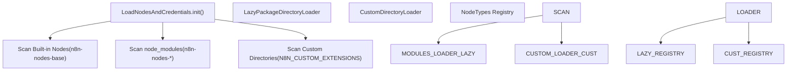
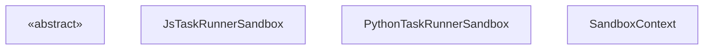

# 节点开发与社区包 (Node Development and Community Packages)

相关源文件

-   [docker/images/runners/n8n-task-runners.json](https://github.com/n8n-io/n8n/blob/88f170b9/docker/images/runners/n8n-task-runners.json)
-   [packages/@n8n/nodes-langchain/nodes/code/Code.node.ts](https://github.com/n8n-io/n8n/blob/88f170b9/packages/@n8n/nodes-langchain/nodes/code/Code.node.ts)
-   [packages/@n8n/task-runner-python/src/\_\_init\_\_.py](https://github.com/n8n-io/n8n/blob/88f170b9/packages/@n8n/task-runner-python/src/__init__.py)
-   [packages/@n8n/task-runner-python/src/config/\_\_init\_\_.py](https://github.com/n8n-io/n8n/blob/88f170b9/packages/@n8n/task-runner-python/src/config/__init__.py)
-   [packages/@n8n/task-runner/src/js-task-runner/\_\_tests\_\_/require-resolver-global-modules.test.ts](https://github.com/n8n-io/n8n/blob/88f170b9/packages/@n8n/task-runner/src/js-task-runner/__tests__/require-resolver-global-modules.test.ts)
-   [packages/@n8n/task-runner/src/js-task-runner/obj-utils.ts](https://github.com/n8n-io/n8n/blob/88f170b9/packages/@n8n/task-runner/src/js-task-runner/obj-utils.ts)
-   [packages/@n8n/utils/src/files/path.test.ts](https://github.com/n8n-io/n8n/blob/88f170b9/packages/@n8n/utils/src/files/path.test.ts)
-   [packages/@n8n/utils/src/files/path.ts](https://github.com/n8n-io/n8n/blob/88f170b9/packages/@n8n/utils/src/files/path.ts)
-   [packages/cli/src/\_\_tests\_\_/load-nodes-and-credentials.test.ts](https://github.com/n8n-io/n8n/blob/88f170b9/packages/cli/src/__tests__/load-nodes-and-credentials.test.ts)
-   [packages/cli/src/load-nodes-and-credentials.ts](https://github.com/n8n-io/n8n/blob/88f170b9/packages/cli/src/load-nodes-and-credentials.ts)
-   [packages/cli/src/security-audit/risk-reporters/nodes-risk-reporter.ts](https://github.com/n8n-io/n8n/blob/88f170b9/packages/cli/src/security-audit/risk-reporters/nodes-risk-reporter.ts)
-   [packages/cli/src/security-audit/security-audit.repository.ts](https://github.com/n8n-io/n8n/blob/88f170b9/packages/cli/src/security-audit/security-audit.repository.ts)
-   [packages/cli/src/security-audit/security-audit.service.ts](https://github.com/n8n-io/n8n/blob/88f170b9/packages/cli/src/security-audit/security-audit.service.ts)
-   [packages/cli/test/integration/security-audit/credentials-risk-reporter.test.ts](https://github.com/n8n-io/n8n/blob/88f170b9/packages/cli/test/integration/security-audit/credentials-risk-reporter.test.ts)
-   [packages/cli/test/integration/security-audit/database-risk-reporter.test.ts](https://github.com/n8n-io/n8n/blob/88f170b9/packages/cli/test/integration/security-audit/database-risk-reporter.test.ts)
-   [packages/cli/test/integration/security-audit/filesystem-risk-reporter.test.ts](https://github.com/n8n-io/n8n/blob/88f170b9/packages/cli/test/integration/security-audit/filesystem-risk-reporter.test.ts)
-   [packages/cli/test/integration/security-audit/instance-risk-reporter.test.ts](https://github.com/n8n-io/n8n/blob/88f170b9/packages/cli/test/integration/security-audit/instance-risk-reporter.test.ts)
-   [packages/cli/test/integration/security-audit/nodes-risk-reporter.test.ts](https://github.com/n8n-io/n8n/blob/88f170b9/packages/cli/test/integration/security-audit/nodes-risk-reporter.test.ts)
-   [packages/core/src/nodes-loader/\_\_tests\_\_/directory-loader.test.ts](https://github.com/n8n-io/n8n/blob/88f170b9/packages/core/src/nodes-loader/__tests__/directory-loader.test.ts)
-   [packages/core/src/nodes-loader/constants.ts](https://github.com/n8n-io/n8n/blob/88f170b9/packages/core/src/nodes-loader/constants.ts)
-   [packages/core/src/nodes-loader/custom-directory-loader.ts](https://github.com/n8n-io/n8n/blob/88f170b9/packages/core/src/nodes-loader/custom-directory-loader.ts)
-   [packages/core/src/nodes-loader/directory-loader.ts](https://github.com/n8n-io/n8n/blob/88f170b9/packages/core/src/nodes-loader/directory-loader.ts)
-   [packages/core/src/nodes-loader/lazy-package-directory-loader.ts](https://github.com/n8n-io/n8n/blob/88f170b9/packages/core/src/nodes-loader/lazy-package-directory-loader.ts)
-   [packages/core/src/nodes-loader/package-directory-loader.ts](https://github.com/n8n-io/n8n/blob/88f170b9/packages/core/src/nodes-loader/package-directory-loader.ts)
-   [packages/frontend/editor-ui/src/app/utils/nodeIcon.test.ts](https://github.com/n8n-io/n8n/blob/88f170b9/packages/frontend/editor-ui/src/app/utils/nodeIcon.test.ts)
-   [packages/frontend/editor-ui/src/app/utils/nodeIcon.ts](https://github.com/n8n-io/n8n/blob/88f170b9/packages/frontend/editor-ui/src/app/utils/nodeIcon.ts)
-   [packages/nodes-base/nodes/Code/Code.node.ts](https://github.com/n8n-io/n8n/blob/88f170b9/packages/nodes-base/nodes/Code/Code.node.ts)
-   [packages/nodes-base/nodes/Code/JavaScriptSandbox.ts](https://github.com/n8n-io/n8n/blob/88f170b9/packages/nodes-base/nodes/Code/JavaScriptSandbox.ts)
-   [packages/nodes-base/nodes/Code/JsTaskRunnerSandbox.ts](https://github.com/n8n-io/n8n/blob/88f170b9/packages/nodes-base/nodes/Code/JsTaskRunnerSandbox.ts)
-   [packages/nodes-base/nodes/Code/Sandbox.ts](https://github.com/n8n-io/n8n/blob/88f170b9/packages/nodes-base/nodes/Code/Sandbox.ts)
-   [packages/nodes-base/nodes/Code/descriptions/PythonCodeDescription.ts](https://github.com/n8n-io/n8n/blob/88f170b9/packages/nodes-base/nodes/Code/descriptions/PythonCodeDescription.ts)
-   [packages/nodes-base/nodes/Code/reserved-key-found-error.ts](https://github.com/n8n-io/n8n/blob/88f170b9/packages/nodes-base/nodes/Code/reserved-key-found-error.ts)
-   [packages/nodes-base/nodes/Code/result-validation.ts](https://github.com/n8n-io/n8n/blob/88f170b9/packages/nodes-base/nodes/Code/result-validation.ts)
-   [packages/nodes-base/nodes/Code/test/Code.node.test.ts](https://github.com/n8n-io/n8n/blob/88f170b9/packages/nodes-base/nodes/Code/test/Code.node.test.ts)
-   [packages/nodes-base/nodes/Code/test/JsTaskRunnerSandbox.test.ts](https://github.com/n8n-io/n8n/blob/88f170b9/packages/nodes-base/nodes/Code/test/JsTaskRunnerSandbox.test.ts)
-   [packages/nodes-base/nodes/Code/test/utils.test.ts](https://github.com/n8n-io/n8n/blob/88f170b9/packages/nodes-base/nodes/Code/test/utils.test.ts)
-   [packages/nodes-base/nodes/Code/throw-execution-error.ts](https://github.com/n8n-io/n8n/blob/88f170b9/packages/nodes-base/nodes/Code/throw-execution-error.ts)
-   [packages/nodes-base/nodes/Code/utils.ts](https://github.com/n8n-io/n8n/blob/88f170b9/packages/nodes-base/nodes/Code/utils.ts)
-   [packages/nodes-base/nodes/Function/Function.node.ts](https://github.com/n8n-io/n8n/blob/88f170b9/packages/nodes-base/nodes/Function/Function.node.ts)
-   [packages/nodes-base/nodes/FunctionItem/FunctionItem.node.ts](https://github.com/n8n-io/n8n/blob/88f170b9/packages/nodes-base/nodes/FunctionItem/FunctionItem.node.ts)
-   [packages/nodes-base/types/xmlhttprequest-ssl.d.ts](https://github.com/n8n-io/n8n/blob/88f170b9/packages/nodes-base/types/xmlhttprequest-ssl.d.ts)
-   [packages/workflow/src/index.ts](https://github.com/n8n-io/n8n/blob/88f170b9/packages/workflow/src/index.ts)
-   [packages/workflow/src/node-helpers.ts](https://github.com/n8n-io/n8n/blob/88f170b9/packages/workflow/src/node-helpers.ts)
-   [packages/workflow/src/utils.ts](https://github.com/n8n-io/n8n/blob/88f170b9/packages/workflow/src/utils.ts)
-   [packages/workflow/test/node-helpers.test.ts](https://github.com/n8n-io/n8n/blob/88f170b9/packages/workflow/test/node-helpers.test.ts)
-   [packages/workflow/test/utils.test.ts](https://github.com/n8n-io/n8n/blob/88f170b9/packages/workflow/test/utils.test.ts)

本页面记录了 n8n 节点开发生态的技术实现。它涵盖了自定义节点的发现与加载、社区包系统，以及诸如 **Code** 节点使用的专门执行环境。

---

## 节点发现与加载 (Node Discovery and Loading)

`LoadNodesAndCredentials` 服务负责定位、初始化和注册 n8n 实例可用的所有节点和凭据。这包括内置节点、本地目录中的自定义节点以及通过 npm 安装的社区包。

### 发现逻辑 (Discovery Logic)

该服务通过扫描多个位置的节点和凭据定义进行初始化。它设置了 `NODE_PATH` 环境变量，以确保动态加载的模块可以解析它们自己的依赖项 [packages/cli/src/load-nodes-and-credentials.ts69-79](https://github.com/n8n-io/n8n/blob/88f170b9/packages/cli/src/load-nodes-and-credentials.ts#L69-L79)。

**图: 节点发现管道 (Node Discovery Pipeline)**

**关键加载阶段:**

1.  **内置节点 (Built-in Nodes):** 扫描相对于 CLI 目录的 `n8n-nodes-base` 和 `@n8n/n8n-nodes-langchain` 软件包 [packages/cli/src/load-nodes-and-credentials.ts91-103](https://github.com/n8n-io/n8n/blob/88f170b9/packages/cli/src/load-nodes-and-credentials.ts#L91-L103)。
2.  **社区软件包 (Community Packages):** 遍历 `node_modules`，查找匹配 `n8n-nodes-*` 或 `@*/n8n-nodes-*` 的软件包 [packages/cli/src/load-nodes-and-credentials.ts172-182](https://github.com/n8n-io/n8n/blob/88f170b9/packages/cli/src/load-nodes-and-credentials.ts#L172-L182)。
3.  **自定义扩展 (Custom Extensions):** 使用 `CustomDirectoryLoader` 从 `N8N_CUSTOM_EXTENSIONS` 环境变量指定的目录中加载节点 [packages/cli/src/load-nodes-and-credentials.ts109-110](https://github.com/n8n-io/n8n/blob/88f170b9/packages/cli/src/load-nodes-and-credentials.ts#L109-L110)。

### 目录加载器 (Directory Loaders)

n8n 使用专门的 `DirectoryLoader` 类来处理不同的包结构：

-   **`PackageDirectoryLoader`**: 标准加载器，通过读取 `package.json` 查找包含节点和凭据路径数组的 `n8n` 属性 [packages/core/src/nodes-loader/package-directory-loader.ts](https://github.com/n8n-io/n8n/blob/88f170b9/packages/core/src/nodes-loader/package-directory-loader.ts)。
-   **`LazyPackageDirectoryLoader`**: 通过最初仅加载节点描述，将完整的类加载推迟到节点实际执行时，从而优化启动速度 [packages/core/src/nodes-loader/lazy-package-directory-loader.ts](https://github.com/n8n-io/n8n/blob/88f170b9/packages/core/src/nodes-loader/lazy-package-directory-loader.ts)。
-   **`CustomDirectoryLoader`**: 处理从标准 npm 位置之外的任意文件系统路径加载的节点 [packages/core/src/nodes-loader/custom-directory-loader.ts](https://github.com/n8n-io/n8n/blob/88f170b9/packages/core/src/nodes-loader/custom-directory-loader.ts)。

来源: [packages/cli/src/load-nodes-and-credentials.ts38-111](https://github.com/n8n-io/n8n/blob/88f170b9/packages/cli/src/load-nodes-and-credentials.ts#L38-L111) [packages/core/src/nodes-loader/directory-loader.ts61-105](https://github.com/n8n-io/n8n/blob/88f170b9/packages/core/src/nodes-loader/directory-loader.ts#L61-L105) [packages/cli/src/\_\_tests\_\_/load-nodes-and-credentials.test.ts82-151](https://github.com/n8n-io/n8n/blob/88f170b9/packages/cli/src/__tests__/load-nodes-and-credentials.test.ts#L82-L151)

---

## Code 节点与沙箱 (The Code Node and Sandboxing)

**Code** 节点允许用户编写自定义 JavaScript 或 Python。由于此类代码是不可信的，n8n 在沙箱环境中执行它以保护主机系统。

### 执行模式 (Execution Modes)

Code 节点支持两种语言，每种都有其自己的沙箱实现：

1.  **JavaScript**: 使用 `JsTaskRunnerSandbox`，它通过 `JavaScriptSandbox` 利用 `vm2` 库 [packages/nodes-base/nodes/Code/Code.node.ts179-187](https://github.com/n8n-io/n8n/blob/88f170b9/packages/nodes-base/nodes/Code/Code.node.ts#L179-L187)。
2.  **Python**: 使用 `PythonTaskRunnerSandbox`，它与外部 Python 进程通信 [packages/nodes-base/nodes/Code/Code.node.ts189-201](https://github.com/n8n-io/n8n/blob/88f170b9/packages/nodes-base/nodes/Code/Code.node.ts#L189-L201)。

### 沙箱上下文 (The Sandbox Context)

沙箱提供了一个受限的 `SandboxContext`，它模拟标准的节点执行环境，但限制了对敏感全局变量的访问。它注入了特定的 n8n 辅助函数和数据代理 [packages/nodes-base/nodes/Code/Sandbox.ts24-43](https://github.com/n8n-io/n8n/blob/88f170b9/packages/nodes-base/nodes/Code/Sandbox.ts#L24-L43)。

**图: Code 节点沙箱架构 (Code Node Sandbox Architecture)**

**上下文注入逻辑:**

-   **数据访问 (Data Access)**: 上下文包含来自 `getWorkflowDataProxy(index)` 的所有变量，提供对 `$json`、`$node` 和 `$env` 的访问 [packages/nodes-base/nodes/Code/Sandbox.ts41](https://github.com/n8n-io/n8n/blob/88f170b9/packages/nodes-base/nodes/Code/Sandbox.ts#L41-L41)。
-   **方法绑定 (Method Binding)**: `getNodeParameter` 和 `getWorkflowStaticData` 等核心方法被绑定到当前的执行上下文，并作为 `$getNodeParameter` 和 `$getWorkflowStaticData` 暴露出来 [packages/nodes-base/nodes/Code/Sandbox.ts35-36](https://github.com/n8n-io/n8n/blob/88f170b9/packages/nodes-base/nodes/Code/Sandbox.ts#L35-L36)。

来源: [packages/nodes-base/nodes/Code/Code.node.ts31-205](https://github.com/n8n-io/n8n/blob/88f170b9/packages/nodes-base/nodes/Code/Code.node.ts#L31-L205) [packages/nodes-base/nodes/Code/Sandbox.ts1-80](https://github.com/n8n-io/n8n/blob/88f170b9/packages/nodes-base/nodes/Code/Sandbox.ts#L1-L80) [packages/nodes-base/nodes/Code/JsTaskRunnerSandbox.ts](https://github.com/n8n-io/n8n/blob/88f170b9/packages/nodes-base/nodes/Code/JsTaskRunnerSandbox.ts)

---

## AI 与 LangChain 节点开发 (AI and LangChain Node Development)

AI 节点（位于 `@n8n/n8n-nodes-langchain`）利用 Code 节点的专门版本，该版本支持 LangChain 特有的导入和连接。

### 旧版导入转换 (Legacy Import Transformation)

随着 LangChain 的演进，为了保持向后兼容性，n8n 会在沙箱中自动将旧版的 `langchain/*` 导入转换为 `@langchain/classic/*` [packages/@n8n/nodes-langchain/nodes/code/Code.node.ts66-143](https://github.com/n8n-io/n8n/blob/88f170b9/packages/@n8n/nodes-langchain/nodes/code/Code.node.ts#L66-L143)。

### 连接供应数据 (Connection Supply Data)

与标准节点不同，AI 节点通常使用 `SupplyData` 向链中的其他节点提供 LangChain 组件（如 Tool (工具) 或 Embeddings (嵌入)） [packages/@n8n/nodes-langchain/nodes/code/Code.node.ts56-57](https://github.com/n8n-io/n8n/blob/88f170b9/packages/@n8n/nodes-langchain/nodes/code/Code.node.ts#L56-L57)。

来源: [packages/@n8n/nodes-langchain/nodes/code/Code.node.ts1-204](https://github.com/n8n-io/n8n/blob/88f170b9/packages/@n8n/nodes-langchain/nodes/code/Code.node.ts#L1-L204)

---

## 社区包结构 (Community Package Structure)

社区包是标准的 npm 软件包，n8n 通过 `package.json` 中特定的 `n8n` 块来识别它们。

### 软件包要求 (Package Requirements)

-   **命名 (Naming)**: 软件包理想情况下应遵循 `n8n-nodes-<name>` 约定 [packages/workflow/src/utils.ts17](https://github.com/n8n-io/n8n/blob/88f170b9/packages/workflow/src/utils.ts#L17-L17)。
-   **元数据 (Metadata)**: `package.json` 中的 `n8n` 属性必须列出节点和凭据编译后的 `.js` 文件的相对路径 [packages/core/src/nodes-loader/package-directory-loader.ts](https://github.com/n8n-io/n8n/blob/88f170b9/packages/core/src/nodes-loader/package-directory-loader.ts)。

### 资源解析 (图标) (Resource Resolution (Icons))

自定义节点的图标使用一种策略进行解析，该策略同时考虑了相对包路径和本地开发期间使用的绝对路径（通过 `N8N_CUSTOM_EXTENSIONS`）。`LoadNodesAndCredentials` 中的 `resolveIcon` 方法处理这些各种路径格式，包括 Windows 盘符 [packages/cli/src/load-nodes-and-credentials.ts198-212](https://github.com/n8n-io/n8n/blob/88f170b9/packages/cli/src/load-nodes-and-credentials.ts#L198-L212)。

来源: [packages/cli/src/load-nodes-and-credentials.ts198-212](https://github.com/n8n-io/n8n/blob/88f170b9/packages/cli/src/load-nodes-and-credentials.ts#L198-L212) [packages/workflow/src/utils.ts57](https://github.com/n8n-io/n8n/blob/88f170b9/packages/workflow/src/utils.ts#L57-L57) [packages/core/src/nodes-loader/directory-loader.ts163-230](https://github.com/n8n-io/n8n/blob/88f170b9/packages/core/src/nodes-loader/directory-loader.ts#L163-L230)

---

## 节点开发实用工具 (Node Development Utilities)

`@n8n/workflow-sdk` 和 `n8n-workflow` 软件包为节点开发人员提供了基本的实用工具：

| 函数 / 类 | 用途 | 来源 |
| --- | --- | --- |
| `deepCopy` | 安全地克隆数据对象，处理 `toJSON` 和循环引用 | [packages/workflow/src/utils.ts53-89](https://github.com/n8n-io/n8n/blob/88f170b9/packages/workflow/src/utils.ts#L53-L89) |
| `jsonParse` | 健壮的 JSON 解析，具有 "repair" (修复) 和 "JS object" (JS 对象) 恢复模式 | [packages/workflow/src/utils.ts152-183](https://github.com/n8n-io/n8n/blob/88f170b9/packages/workflow/src/utils.ts#L152-L183) |
| `NodeHelpers` | 用于检查节点类型的实用工具（例如 `isSubNodeType`） | [packages/workflow/src/node-helpers.ts248-258](https://github.com/n8n-io/n8n/blob/88f170b9/packages/workflow/src/node-helpers.ts#L248-L258) |
| `INodeType` | 所有节点必须实现的主要接口 | [packages/workflow/src/interfaces.ts](https://github.com/n8n-io/n8n/blob/88f170b9/packages/workflow/src/interfaces.ts) |

来源: [packages/workflow/src/index.ts](https://github.com/n8n-io/n8n/blob/88f170b9/packages/workflow/src/index.ts) [packages/workflow/src/utils.ts](https://github.com/n8n-io/n8n/blob/88f170b9/packages/workflow/src/utils.ts) [packages/workflow/src/node-helpers.ts](https://github.com/n8n-io/n8n/blob/88f170b9/packages/workflow/src/node-helpers.ts)
