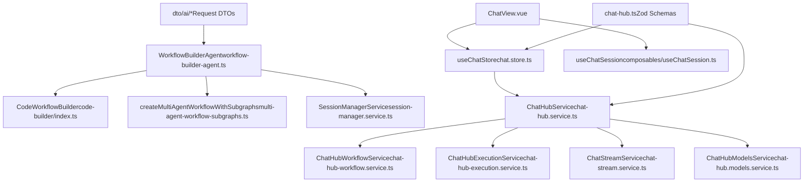

# AI 特性 (AI Features)

相关源文件

-   [packages/@n8n/ai-workflow-builder.ee/src/ai-workflow-builder-agent.service.ts](https://github.com/n8n-io/n8n/blob/88f170b9/packages/@n8n/ai-workflow-builder.ee/src/ai-workflow-builder-agent.service.ts)
-   [packages/@n8n/ai-workflow-builder.ee/src/constants.ts](https://github.com/n8n-io/n8n/blob/88f170b9/packages/@n8n/ai-workflow-builder.ee/src/constants.ts)
-   [packages/@n8n/ai-workflow-builder.ee/src/session-manager.service.ts](https://github.com/n8n-io/n8n/blob/88f170b9/packages/@n8n/ai-workflow-builder.ee/src/session-manager.service.ts)
-   [packages/@n8n/ai-workflow-builder.ee/src/subgraphs/builder.subgraph.ts](https://github.com/n8n-io/n8n/blob/88f170b9/packages/@n8n/ai-workflow-builder.ee/src/subgraphs/builder.subgraph.ts)
-   [packages/@n8n/ai-workflow-builder.ee/src/test/ai-workflow-builder-agent.service.test.ts](https://github.com/n8n-io/n8n/blob/88f170b9/packages/@n8n/ai-workflow-builder.ee/src/test/ai-workflow-builder-agent.service.test.ts)
-   [packages/@n8n/ai-workflow-builder.ee/src/test/session-manager.service.test.ts](https://github.com/n8n-io/n8n/blob/88f170b9/packages/@n8n/ai-workflow-builder.ee/src/test/session-manager.service.test.ts)
-   [packages/@n8n/ai-workflow-builder.ee/src/test/workflow-builder-agent.test.ts](https://github.com/n8n-io/n8n/blob/88f170b9/packages/@n8n/ai-workflow-builder.ee/src/test/workflow-builder-agent.test.ts)
-   [packages/@n8n/ai-workflow-builder.ee/src/tools/builder-tools.ts](https://github.com/n8n-io/n8n/blob/88f170b9/packages/@n8n/ai-workflow-builder.ee/src/tools/builder-tools.ts)
-   [packages/@n8n/ai-workflow-builder.ee/src/tools/helpers/state.ts](https://github.com/n8n-io/n8n/blob/88f170b9/packages/@n8n/ai-workflow-builder.ee/src/tools/helpers/state.ts)
-   [packages/@n8n/ai-workflow-builder.ee/src/tools/remove-connection.tool.ts](https://github.com/n8n-io/n8n/blob/88f170b9/packages/@n8n/ai-workflow-builder.ee/src/tools/remove-connection.tool.ts)
-   [packages/@n8n/ai-workflow-builder.ee/src/tools/rename-node.tool.ts](https://github.com/n8n-io/n8n/blob/88f170b9/packages/@n8n/ai-workflow-builder.ee/src/tools/rename-node.tool.ts)
-   [packages/@n8n/ai-workflow-builder.ee/src/tools/test/builder-tools.test.ts](https://github.com/n8n-io/n8n/blob/88f170b9/packages/@n8n/ai-workflow-builder.ee/src/tools/test/builder-tools.test.ts)
-   [packages/@n8n/ai-workflow-builder.ee/src/tools/test/remove-connection.tool.test.ts](https://github.com/n8n-io/n8n/blob/88f170b9/packages/@n8n/ai-workflow-builder.ee/src/tools/test/remove-connection.tool.test.ts)
-   [packages/@n8n/ai-workflow-builder.ee/src/tools/test/rename-node.tool.test.ts](https://github.com/n8n-io/n8n/blob/88f170b9/packages/@n8n/ai-workflow-builder.ee/src/tools/test/rename-node.tool.test.ts)
-   [packages/@n8n/ai-workflow-builder.ee/src/types/tools.ts](https://github.com/n8n-io/n8n/blob/88f170b9/packages/@n8n/ai-workflow-builder.ee/src/types/tools.ts)
-   [packages/@n8n/ai-workflow-builder.ee/src/types/workflow.ts](https://github.com/n8n-io/n8n/blob/88f170b9/packages/@n8n/ai-workflow-builder.ee/src/types/workflow.ts)
-   [packages/@n8n/ai-workflow-builder.ee/src/utils/error-sanitizer.ts](https://github.com/n8n-io/n8n/blob/88f170b9/packages/@n8n/ai-workflow-builder.ee/src/utils/error-sanitizer.ts)
-   [packages/@n8n/ai-workflow-builder.ee/src/utils/operations-processor.ts](https://github.com/n8n-io/n8n/blob/88f170b9/packages/@n8n/ai-workflow-builder.ee/src/utils/operations-processor.ts)
-   [packages/@n8n/ai-workflow-builder.ee/src/utils/stream-processor.ts](https://github.com/n8n-io/n8n/blob/88f170b9/packages/@n8n/ai-workflow-builder.ee/src/utils/stream-processor.ts)
-   [packages/@n8n/ai-workflow-builder.ee/src/utils/test/error-sanitizer.test.ts](https://github.com/n8n-io/n8n/blob/88f170b9/packages/@n8n/ai-workflow-builder.ee/src/utils/test/error-sanitizer.test.ts)
-   [packages/@n8n/ai-workflow-builder.ee/src/utils/test/operations-processor.test.ts](https://github.com/n8n-io/n8n/blob/88f170b9/packages/@n8n/ai-workflow-builder.ee/src/utils/test/operations-processor.test.ts)
-   [packages/@n8n/ai-workflow-builder.ee/src/utils/test/stream-processor.test.ts](https://github.com/n8n-io/n8n/blob/88f170b9/packages/@n8n/ai-workflow-builder.ee/src/utils/test/stream-processor.test.ts)
-   [packages/@n8n/ai-workflow-builder.ee/src/utils/test/tool-executor.test.ts](https://github.com/n8n-io/n8n/blob/88f170b9/packages/@n8n/ai-workflow-builder.ee/src/utils/test/tool-executor.test.ts)
-   [packages/@n8n/ai-workflow-builder.ee/src/utils/token-usage.ts](https://github.com/n8n-io/n8n/blob/88f170b9/packages/@n8n/ai-workflow-builder.ee/src/utils/token-usage.ts)
-   [packages/@n8n/ai-workflow-builder.ee/src/workflow-builder-agent.ts](https://github.com/n8n-io/n8n/blob/88f170b9/packages/@n8n/ai-workflow-builder.ee/src/workflow-builder-agent.ts)
-   [packages/@n8n/ai-workflow-builder.ee/src/workflow-state.ts](https://github.com/n8n-io/n8n/blob/88f170b9/packages/@n8n/ai-workflow-builder.ee/src/workflow-state.ts)
-   [packages/@n8n/api-types/src/chat-hub.ts](https://github.com/n8n-io/n8n/blob/88f170b9/packages/@n8n/api-types/src/chat-hub.ts)
-   [packages/@n8n/api-types/src/dto/ai/\_\_tests\_\_/ai-build-request.dto.test.ts](https://github.com/n8n-io/n8n/blob/88f170b9/packages/@n8n/api-types/src/dto/ai/__tests__/ai-build-request.dto.test.ts)
-   [packages/@n8n/api-types/src/dto/ai/ai-build-request.dto.ts](https://github.com/n8n-io/n8n/blob/88f170b9/packages/@n8n/api-types/src/dto/ai/ai-build-request.dto.ts)
-   [packages/@n8n/api-types/src/dto/index.ts](https://github.com/n8n-io/n8n/blob/88f170b9/packages/@n8n/api-types/src/dto/index.ts)
-   [packages/@n8n/api-types/src/index.ts](https://github.com/n8n-io/n8n/blob/88f170b9/packages/@n8n/api-types/src/index.ts)
-   [packages/cli/src/controllers/\_\_tests\_\_/ai.controller.test.ts](https://github.com/n8n-io/n8n/blob/88f170b9/packages/cli/src/controllers/__tests__/ai.controller.test.ts)
-   [packages/cli/src/controllers/ai.controller.ts](https://github.com/n8n-io/n8n/blob/88f170b9/packages/cli/src/controllers/ai.controller.ts)
-   [packages/cli/src/modules/chat-hub/\_\_tests\_\_/chat-hub.service.integration.test.ts](https://github.com/n8n-io/n8n/blob/88f170b9/packages/cli/src/modules/chat-hub/__tests__/chat-hub.service.integration.test.ts)
-   [packages/cli/src/modules/chat-hub/chat-hub-agent.repository.ts](https://github.com/n8n-io/n8n/blob/88f170b9/packages/cli/src/modules/chat-hub/chat-hub-agent.repository.ts)
-   [packages/cli/src/modules/chat-hub/chat-hub-message.entity.ts](https://github.com/n8n-io/n8n/blob/88f170b9/packages/cli/src/modules/chat-hub/chat-hub-message.entity.ts)
-   [packages/cli/src/modules/chat-hub/chat-hub-session.entity.ts](https://github.com/n8n-io/n8n/blob/88f170b9/packages/cli/src/modules/chat-hub/chat-hub-session.entity.ts)
-   [packages/cli/src/modules/chat-hub/chat-hub-workflow.service.ts](https://github.com/n8n-io/n8n/blob/88f170b9/packages/cli/src/modules/chat-hub/chat-hub-workflow.service.ts)
-   [packages/cli/src/modules/chat-hub/chat-hub.constants.ts](https://github.com/n8n-io/n8n/blob/88f170b9/packages/cli/src/modules/chat-hub/chat-hub.constants.ts)
-   [packages/cli/src/modules/chat-hub/chat-hub.controller.ts](https://github.com/n8n-io/n8n/blob/88f170b9/packages/cli/src/modules/chat-hub/chat-hub.controller.ts)
-   [packages/cli/src/modules/chat-hub/chat-hub.service.ts](https://github.com/n8n-io/n8n/blob/88f170b9/packages/cli/src/modules/chat-hub/chat-hub.service.ts)
-   [packages/cli/src/modules/chat-hub/chat-hub.types.ts](https://github.com/n8n-io/n8n/blob/88f170b9/packages/cli/src/modules/chat-hub/chat-hub.types.ts)
-   [packages/cli/src/modules/chat-hub/chat-message.repository.ts](https://github.com/n8n-io/n8n/blob/88f170b9/packages/cli/src/modules/chat-hub/chat-message.repository.ts)
-   [packages/cli/src/modules/chat-hub/chat-session.repository.ts](https://github.com/n8n-io/n8n/blob/88f170b9/packages/cli/src/modules/chat-hub/chat-session.repository.ts)
-   [packages/cli/src/modules/chat-hub/context-limits.ts](https://github.com/n8n-io/n8n/blob/88f170b9/packages/cli/src/modules/chat-hub/context-limits.ts)
-   [packages/cli/src/services/\_\_tests\_\_/ai-workflow-builder.service.test.ts](https://github.com/n8n-io/n8n/blob/88f170b9/packages/cli/src/services/__tests__/ai-workflow-builder.service.test.ts)
-   [packages/cli/src/services/\_\_tests\_\_/ai.service.test.ts](https://github.com/n8n-io/n8n/blob/88f170b9/packages/cli/src/services/__tests__/ai.service.test.ts)
-   [packages/cli/src/services/ai-workflow-builder.service.ts](https://github.com/n8n-io/n8n/blob/88f170b9/packages/cli/src/services/ai-workflow-builder.service.ts)
-   [packages/cli/src/services/ai.service.ts](https://github.com/n8n-io/n8n/blob/88f170b9/packages/cli/src/services/ai.service.ts)
-   [packages/frontend/@n8n/design-system/src/components/AskAssistantChat/messages/MessageWrapper.vue](https://github.com/n8n-io/n8n/blob/88f170b9/packages/frontend/@n8n/design-system/src/components/AskAssistantChat/messages/MessageWrapper.vue)
-   [packages/frontend/@n8n/design-system/src/components/AskAssistantChat/messages/TextMessage.test.ts](https://github.com/n8n-io/n8n/blob/88f170b9/packages/frontend/@n8n/design-system/src/components/AskAssistantChat/messages/TextMessage.test.ts)
-   [packages/frontend/editor-ui/src/app/constants/workflowSuggestions.ts](https://github.com/n8n-io/n8n/blob/88f170b9/packages/frontend/editor-ui/src/app/constants/workflowSuggestions.ts)
-   [packages/frontend/editor-ui/src/features/ai/assistant/assistant.api.test.ts](https://github.com/n8n-io/n8n/blob/88f170b9/packages/frontend/editor-ui/src/features/ai/assistant/assistant.api.test.ts)
-   [packages/frontend/editor-ui/src/features/ai/assistant/assistant.api.ts](https://github.com/n8n-io/n8n/blob/88f170b9/packages/frontend/editor-ui/src/features/ai/assistant/assistant.api.ts)
-   [packages/frontend/editor-ui/src/features/ai/chatHub/ChatView.vue](https://github.com/n8n-io/n8n/blob/88f170b9/packages/frontend/editor-ui/src/features/ai/chatHub/ChatView.vue)
-   [packages/frontend/editor-ui/src/features/ai/chatHub/chat.api.ts](https://github.com/n8n-io/n8n/blob/88f170b9/packages/frontend/editor-ui/src/features/ai/chatHub/chat.api.ts)
-   [packages/frontend/editor-ui/src/features/ai/chatHub/chat.store.ts](https://github.com/n8n-io/n8n/blob/88f170b9/packages/frontend/editor-ui/src/features/ai/chatHub/chat.store.ts)
-   [packages/frontend/editor-ui/src/features/ai/chatHub/chat.types.ts](https://github.com/n8n-io/n8n/blob/88f170b9/packages/frontend/editor-ui/src/features/ai/chatHub/chat.types.ts)
-   [packages/frontend/editor-ui/src/features/ai/chatHub/chat.utils.ts](https://github.com/n8n-io/n8n/blob/88f170b9/packages/frontend/editor-ui/src/features/ai/chatHub/chat.utils.ts)
-   [packages/frontend/editor-ui/src/features/ai/chatHub/components/AgentEditorModal.vue](https://github.com/n8n-io/n8n/blob/88f170b9/packages/frontend/editor-ui/src/features/ai/chatHub/components/AgentEditorModal.vue)
-   [packages/frontend/editor-ui/src/features/ai/chatHub/components/ChatAgentCard.vue](https://github.com/n8n-io/n8n/blob/88f170b9/packages/frontend/editor-ui/src/features/ai/chatHub/components/ChatAgentCard.vue)
-   [packages/frontend/editor-ui/src/features/ai/chatHub/components/ChatConversationHeader.vue](https://github.com/n8n-io/n8n/blob/88f170b9/packages/frontend/editor-ui/src/features/ai/chatHub/components/ChatConversationHeader.vue)
-   [packages/frontend/editor-ui/src/features/ai/chatHub/components/ChatMessage.vue](https://github.com/n8n-io/n8n/blob/88f170b9/packages/frontend/editor-ui/src/features/ai/chatHub/components/ChatMessage.vue)
-   [packages/frontend/editor-ui/src/features/ai/chatHub/components/ChatPrompt.vue](https://github.com/n8n-io/n8n/blob/88f170b9/packages/frontend/editor-ui/src/features/ai/chatHub/components/ChatPrompt.vue)
-   [packages/frontend/editor-ui/src/features/ai/chatHub/components/ChatSessionMenuItem.vue](https://github.com/n8n-io/n8n/blob/88f170b9/packages/frontend/editor-ui/src/features/ai/chatHub/components/ChatSessionMenuItem.vue)
-   [packages/frontend/editor-ui/src/features/ai/chatHub/components/ChatSidebarContent.vue](https://github.com/n8n-io/n8n/blob/88f170b9/packages/frontend/editor-ui/src/features/ai/chatHub/components/ChatSidebarContent.vue)
-   [packages/frontend/editor-ui/src/features/ai/chatHub/components/ModelSelector.vue](https://github.com/n8n-io/n8n/blob/88f170b9/packages/frontend/editor-ui/src/features/ai/chatHub/components/ModelSelector.vue)
-   [packages/frontend/editor-ui/src/features/ai/chatHub/constants.ts](https://github.com/n8n-io/n8n/blob/88f170b9/packages/frontend/editor-ui/src/features/ai/chatHub/constants.ts)
-   [packages/frontend/editor-ui/src/features/ndv/parameters/components/ButtonParameter/ButtonParameter.test.ts](https://github.com/n8n-io/n8n/blob/88f170b9/packages/frontend/editor-ui/src/features/ndv/parameters/components/ButtonParameter/ButtonParameter.test.ts)
-   [packages/frontend/editor-ui/src/features/ndv/parameters/utils/buttonParameter.utils.test.ts](https://github.com/n8n-io/n8n/blob/88f170b9/packages/frontend/editor-ui/src/features/ndv/parameters/utils/buttonParameter.utils.test.ts)
-   [packages/frontend/editor-ui/src/features/ndv/parameters/utils/buttonParameter.utils.ts](https://github.com/n8n-io/n8n/blob/88f170b9/packages/frontend/editor-ui/src/features/ndv/parameters/utils/buttonParameter.utils.ts)
-   [packages/frontend/editor-ui/src/features/shared/editors/components/CodeNodeEditor/AskAI/AskAI.vue](https://github.com/n8n-io/n8n/blob/88f170b9/packages/frontend/editor-ui/src/features/shared/editors/components/CodeNodeEditor/AskAI/AskAI.vue)

n8n 提供了三个截然不同的 AI 子系统，它们协同工作以实现 AI 驱动的工作流自动化：

1.  **AI Workflow Builder (AI 工作流生成器)** — 一个 AI 助手，通过自然语言帮助用户在画布上创建工作流。
2.  **Chat Hub** — 一个独立的对话 UI，可以调用 LLM 提供商或将 n8n 工作流作为 Agent (代理) 执行。
3.  **AI Agent Execution (AI 代理执行)** — 工具调用代理节点（来自 `@n8n/nodes-langchain`），它们在工作流内部通过 ReAct 或函数调用循环执行。

本页面提供了这些系统如何组织以及它们之间关系的 high-level (高层) 概述。有关详细的实现文档，请参阅子页面：

-   [AI 工作流生成器 (AI Workflow Builder)](/n8n-io/n8n/5.1-ai-workflow-builder) — 基于 LangGraph 的工作流生成系统。
-   [Chat Hub 后端系统 (Chat Hub Backend System)](/n8n-io/n8n/5.2-chat-hub-backend-system) — 会话管理、模型编排和流式传输。
-   [Chat Hub 前端与用户界面 (Chat Hub Frontend and User Interface)](/n8n-io/n8n/5.3-chat-hub-frontend-and-user-interface) — Vue 3 组件和状态管理。
-   [AI 代理与工具执行 (AI Agent and Tool Execution)](/n8n-io/n8n/5.4-ai-agent-and-tool-execution) — 工具调用协议和 MCP 集成。

有关工作流中使用的 LangChain 节点定义，请参阅 [AI 与 LangChain 节点 (AI and LangChain Nodes)](/n8n-io/n8n/4.3-ai-and-langchain-nodes)。

---

## 软件包布局 (Package Layout)

AI 特性分布在多个软件包中：

| 软件包 | 关键组件 | 角色 |
| --- | --- | --- |
| `@n8n/ai-workflow-builder.ee` | `WorkflowBuilderAgent`、`CodeWorkflowBuilder`、`SessionManagerService` | 基于 LangGraph 的多代理工作流生成器和会话管理 [packages/@n8n/ai-workflow-builder.ee/src/workflow-builder-agent.ts152-167](https://github.com/n8n-io/n8n/blob/88f170b9/packages/@n8n/ai-workflow-builder.ee/src/workflow-builder-agent.ts#L152-L167) |
| `@n8n/ai-utilities` | 令牌计数、文本分割、分块实用工具 | 工作流生成器和 Chat Hub 使用的共享 AI 实用工具。 |
| `packages/cli/src/modules/chat-hub/` | `ChatHubService`、`ChatHubWorkflowService`、`ChatHubExecutionService`、`ChatStreamService` | Chat Hub 后端编排、模型管理、流式传输 [packages/cli/src/modules/chat-hub/chat-hub.service.ts54-71](https://github.com/n8n-io/n8n/blob/88f170b9/packages/cli/src/modules/chat-hub/chat-hub.service.ts#L54-L71) |
| `packages/frontend/editor-ui/src/features/ai/chatHub/` | `ChatView.vue`、`useChatStore`、`useChatSession` | 具有 Vue 3 组件和 Pinia store 的 Chat Hub 前端 SPA [packages/frontend/editor-ui/src/features/ai/chatHub/ChatView.vue64-75](https://github.com/n8n-io/n8n/blob/88f170b9/packages/frontend/editor-ui/src/features/ai/chatHub/ChatView.vue#L64-L75) |
| `@n8n/api-types/src/chat-hub.ts` | Zod schema 和 TypeScript 类型 | Chat Hub 和工作流生成器的共享 DTO [packages/@n8n/api-types/src/chat-hub.ts1-206](https://github.com/n8n-io/n8n/blob/88f170b9/packages/@n8n/api-types/src/chat-hub.ts#L1-L206) |

来源: [packages/@n8n/ai-workflow-builder.ee/src/workflow-builder-agent.ts152-167](https://github.com/n8n-io/n8n/blob/88f170b9/packages/@n8n/ai-workflow-builder.ee/src/workflow-builder-agent.ts#L152-L167) [packages/cli/src/modules/chat-hub/chat-hub.service.ts54-71](https://github.com/n8n-io/n8n/blob/88f170b9/packages/cli/src/modules/chat-hub/chat-hub.service.ts#L54-L71) [packages/frontend/editor-ui/src/features/ai/chatHub/ChatView.vue64-75](https://github.com/n8n-io/n8n/blob/88f170b9/packages/frontend/editor-ui/src/features/ai/chatHub/ChatView.vue#L64-L75) [packages/@n8n/api-types/src/chat-hub.ts1-206](https://github.com/n8n-io/n8n/blob/88f170b9/packages/@n8n/api-types/src/chat-hub.ts#L1-L206)

---

## 高层系统图 (High-Level System Map)

下图将每个 AI 子系统映射到实现它的具体代码实体。

**AI 子系统及其代码实体**

来源: [packages/@n8n/ai-workflow-builder.ee/src/workflow-builder-agent.ts152-167](https://github.com/n8n-io/n8n/blob/88f170b9/packages/@n8n/ai-workflow-builder.ee/src/workflow-builder-agent.ts#L152-L167) [packages/cli/src/modules/chat-hub/chat-hub.service.ts54-71](https://github.com/n8n-io/n8n/blob/88f170b9/packages/cli/src/modules/chat-hub/chat-hub.service.ts#L54-L71) [packages/frontend/editor-ui/src/features/ai/chatHub/ChatView.vue64-75](https://github.com/n8n-io/n8n/blob/88f170b9/packages/frontend/editor-ui/src/features/ai/chatHub/ChatView.vue#L64-L75) [packages/@n8n/api-types/src/chat-hub.ts12-85](https://github.com/n8n-io/n8n/blob/88f170b9/packages/@n8n/api-types/src/chat-hub.ts#L12-L85) [packages/@n8n/api-types/src/dto/index.ts3-11](https://github.com/n8n-io/n8n/blob/88f170b9/packages/@n8n/api-types/src/dto/index.ts#L3-L11)

---

## 系统关系 (System Relationships)

三个 AI 子系统独立运行，但共享公共基础设施：

| 组件 | AI 工作流生成器 | Chat Hub | AI 代理执行 |
| --- | --- | --- | --- |
| **入口点** | 画布助手 UI | Chat Hub UI | 工作流节点 |
| **执行模型** | LangGraph 代理系统 | 标准工作流执行 | LangChain 代理循环 |
| **LLM 集成** | 直接 SDK 调用 | 在生成的工作流中通过 LangChain 节点 | 通过 LangChain 聊天模型节点 |
| **凭据使用** | 全局 AI 助手凭据 | 用户选择的模型凭据 [packages/cli/src/modules/chat-hub/chat-hub.service.ts75-84](https://github.com/n8n-io/n8n/blob/88f170b9/packages/cli/src/modules/chat-hub/chat-hub.service.ts#L75-L84) | 工作流凭据节点 |
| **会话持久化** | LangGraph 线程状态 | 数据库 (`ChatHubSession`、`ChatHubMessage`) [packages/cli/src/modules/chat-hub/chat-hub.service.ts60-61](https://github.com/n8n-io/n8n/blob/88f170b9/packages/cli/src/modules/chat-hub/chat-hub.service.ts#L60-L61) | 工作流中的记忆节点 |
| **流式传输** | SSE 到画布 | 推送事件到聊天 UI | 工作流执行流式传输 |

**AI 工作流生成器 (AI Workflow Builder)** 在画布层面运行，通过多代理 LangGraph 系统生成工作流 JSON。它在生成过程中不执行工作流 —— 它生成工作流定义作为输出 [packages/@n8n/ai-workflow-builder.ee/src/workflow-builder-agent.ts120-150](https://github.com/n8n-io/n8n/blob/88f170b9/packages/@n8n/ai-workflow-builder.ee/src/workflow-builder-agent.ts#L120-L150)。

**Chat Hub** 在运行时执行工作流。当用户发送消息并选择了 LLM 提供商时，Chat Hub 会动态构建一个包含 `ChatTrigger` → `Agent` → `ChatModel` 节点的工作流并执行它 [packages/cli/src/modules/chat-hub/chat-hub-workflow.service.ts104-124](https://github.com/n8n-io/n8n/blob/88f170b9/packages/cli/src/modules/chat-hub/chat-hub-workflow.service.ts#L104-L124)。

**AI 代理执行 (AI Agent Execution)** 发生在工作流运行过程中，当到达 `Agent` 节点时执行。Agent 使用 LangChain 的工具调用循环，迭代地调用子节点作为工具，直到产生最终响应。

来源: [packages/@n8n/ai-workflow-builder.ee/src/workflow-builder-agent.ts120-150](https://github.com/n8n-io/n8n/blob/88f170b9/packages/@n8n/ai-workflow-builder.ee/src/workflow-builder-agent.ts#L120-L150) [packages/cli/src/modules/chat-hub/chat-hub-workflow.service.ts104-124](https://github.com/n8n-io/n8n/blob/88f170b9/packages/cli/src/modules/chat-hub/chat-hub-workflow.service.ts#L104-L124) [packages/cli/src/modules/chat-hub/chat-hub.service.ts54-71](https://github.com/n8n-io/n8n/blob/88f170b9/packages/cli/src/modules/chat-hub/chat-hub.service.ts#L54-L71)

---

## AI 工作流生成器概述 (AI Workflow Builder Overview)

AI 工作流生成器是一个画布助手，通过自然语言帮助用户创建工作流。它利用基于 LangGraph 的架构来规划和构建节点。

**请求流**: 助手 UI → `AiController` → `WorkflowBuilderService` → `WorkflowBuilderAgent.chat()`。

该系统为不同阶段（supervisor、responder、discovery、builder、parameterUpdater、planner）使用专门的代理，每个阶段都可以通过 `StageLLMs` 配置 LLM 模型 [packages/@n8n/ai-workflow-builder.ee/src/workflow-builder-agent.ts66-73](https://github.com/n8n-io/n8n/blob/88f170b9/packages/@n8n/ai-workflow-builder.ee/src/workflow-builder-agent.ts#L66-L73)。会话连续性通过 `SessionManagerService` 维持 [packages/@n8n/ai-workflow-builder.ee/src/workflow-builder-agent.ts36](https://github.com/n8n-io/n8n/blob/88f170b9/packages/@n8n/ai-workflow-builder.ee/src/workflow-builder-agent.ts#L36-L36)。

有关完整的实现细节（包括提示词工程和代理协调），请参阅 [AI 工作流生成器 (AI Workflow Builder)](/n8n-io/n8n/5.1-ai-workflow-builder)。

来源: [packages/@n8n/ai-workflow-builder.ee/src/workflow-builder-agent.ts66-73](https://github.com/n8n-io/n8n/blob/88f170b9/packages/@n8n/ai-workflow-builder.ee/src/workflow-builder-agent.ts#L66-L73) [packages/@n8n/ai-workflow-builder.ee/src/workflow-builder-agent.ts152-167](https://github.com/n8n-io/n8n/blob/88f170b9/packages/@n8n/ai-workflow-builder.ee/src/workflow-builder-agent.ts#L152-L167)

---

## Chat Hub 概述 (Chat Hub Overview)

Chat Hub 是一个独立的对话 UI，可以连接到 15 多个 LLM 提供商或将 n8n 工作流作为代理调用 [packages/@n8n/api-types/src/chat-hub.ts17-32](https://github.com/n8n-io/n8n/blob/88f170b9/packages/@n8n/api-types/src/chat-hub.ts#L17-L32)。

**提供商类型**:

-   **直接 LLM 提供商** (`openai`、`anthropic`、`google` 等) — Chat Hub 在运行时构建一个包含 `ChatTrigger` → `Agent` → `ChatModel` 节点的工作流 [packages/cli/src/modules/chat-hub/chat-hub.constants.ts39-96](https://github.com/n8n-io/n8n/blob/88f170b9/packages/cli/src/modules/chat-hub/chat-hub.constants.ts#L39-L96)。
-   **n8n 工作流代理** (`provider: 'n8n'`) — 执行用户预先构建的具有 `ChatTrigger` 节点的工作流 [packages/cli/src/modules/chat-hub/chat-hub-workflow.service.ts1-47](https://github.com/n8n-io/n8n/blob/88f170b9/packages/cli/src/modules/chat-hub/chat-hub-workflow.service.ts#L1-L47)。
-   **自定义代理** (`provider: 'custom-agent'`) — 保存的代理配置，具有系统提示词、工具和知识库。

**数据模型**:

-   **会话 (Session)** (`ChatHubSession`) — 代表一次对话，存储选定的模型和设置 [packages/cli/src/modules/chat-hub/chat-hub-session.entity.ts1-36](https://github.com/n8n-io/n8n/blob/88f170b9/packages/cli/src/modules/chat-hub/chat-hub-session.entity.ts#L1-L36)。
-   **消息 (Message)** (`ChatHubMessage`) — 通过 `previousMessageId` 链接，为分支形成树状结构 [packages/cli/src/modules/chat-hub/chat-hub-message.entity.ts1-35](https://github.com/n8n-io/n8n/blob/88f170b9/packages/cli/src/modules/chat-hub/chat-hub-message.entity.ts#L1-L35)。
-   **状态流** — `running` → `success`/`error`/`cancelled`/`waiting` [packages/cli/src/modules/chat-hub/chat-hub.constants.ts28-35](https://github.com/n8n-io/n8n/blob/88f170b9/packages/cli/src/modules/chat-hub/chat-hub.constants.ts#L28-L35)。

有关详细的后端架构，请参阅 [Chat Hub 后端系统 (Chat Hub Backend System)](/n8n-io/n8n/5.2-chat-hub-backend-system)。有关前端实现，请参阅 [Chat Hub 前端与用户界面 (Chat Hub Frontend and User Interface)](/n8n-io/n8n/5.3-chat-hub-frontend-and-user-interface)。

来源: [packages/@n8n/api-types/src/chat-hub.ts17-32](https://github.com/n8n-io/n8n/blob/88f170b9/packages/@n8n/api-types/src/chat-hub.ts#L17-L32) [packages/cli/src/modules/chat-hub/chat-hub.constants.ts39-96](https://github.com/n8n-io/n8n/blob/88f170b9/packages/cli/src/modules/chat-hub/chat-hub.constants.ts#L39-L96) [packages/cli/src/modules/chat-hub/chat-hub.service.ts54-71](https://github.com/n8n-io/n8n/blob/88f170b9/packages/cli/src/modules/chat-hub/chat-hub.service.ts#L54-L71)

### Chat Hub 架构摘要 (Chat Hub Architecture Summary)

**消息发送流**: 用户消息 → `ChatHubController` → `ChatHubService.sendHumanMessage()` → `ChatHubWorkflowService.createChatWorkflow()` → `ChatHubExecutionService` 执行。

前端通过 `useChatStore` 利用 Pinia 来管理对话、流式传输状态和代理配置 [packages/frontend/editor-ui/src/features/ai/chatHub/chat.store.ts102-129](https://github.com/n8n-io/n8n/blob/88f170b9/packages/frontend/editor-ui/src/features/ai/chatHub/chat.store.ts#L102-L129)。实时更新通过推送事件（例如 `ChatHubStreamChunk`）交付 [packages/@n8n/api-types/src/index.ts87-101](https://github.com/n8n-io/n8n/blob/88f170b9/packages/@n8n/api-types/src/index.ts#L87-L101)。

有关详细的后端实现（包括工作流构建和会话管理），请参阅 [Chat Hub 后端系统 (Chat Hub Backend System)](/n8n-io/n8n/5.2-chat-hub-backend-system)。有关前端架构和组件层次结构，请参阅 [Chat Hub 前端与用户界面 (Chat Hub Frontend and User Interface)](/n8n-io/n8n/5.3-chat-hub-frontend-and-user-interface)。

来源: [packages/cli/src/modules/chat-hub/chat-hub-workflow.service.ts104-177](https://github.com/n8n-io/n8n/blob/88f170b9/packages/cli/src/modules/chat-hub/chat-hub-workflow.service.ts#L104-L177) [packages/frontend/editor-ui/src/features/ai/chatHub/chat.store.ts102-129](https://github.com/n8n-io/n8n/blob/88f170b9/packages/frontend/editor-ui/src/features/ai/chatHub/chat.store.ts#L102-L129) [packages/@n8n/api-types/src/index.ts87-101](https://github.com/n8n-io/n8n/blob/88f170b9/packages/@n8n/api-types/src/index.ts#L87-L101)

---

## AI 代理执行概述 (AI Agent Execution Overview)

AI 代理节点（来自 `@n8n/nodes-langchain`）在工作流运行中执行工具调用循环。代理执行发生在工作流运行**过程中**，当遇到 `Agent` 节点时。

**关键组件**:

-   **Tools Agent (工具代理)**: 通过 ReAct 或 OpenAI 函数调用编排多个工具 [packages/cli/src/modules/chat-hub/chat-hub.constants.ts36](https://github.com/n8n-io/n8n/blob/88f170b9/packages/cli/src/modules/chat-hub/chat-hub.constants.ts#L36-L36)。
-   **模型上下文协议 (Model Context Protocol (MCP))**: 集成允许代理从外部 MCP 服务器动态发现和调用工具。
-   **记忆 (Memory)**: 通过记忆节点集成，以在执行轮次之间维持上下文 [packages/cli/src/modules/chat-hub/chat-hub.constants.106-108](https://github.com/n8n-io/n8n/blob/88f170b9/packages/cli/src/modules/chat-hub/chat-hub.constants.ts#L106-L108)。

有关完整的实现细节（包括工具调用协议和 MCP 集成），请参阅 [AI 代理与工具执行 (AI Agent and Tool Execution)](/n8n-io/n8n/5.4-ai-agent-and-tool-execution)。

来源: [packages/cli/src/modules/chat-hub/chat-hub.constants.ts36-38](https://github.com/n8n-io/n8n/blob/88f170b9/packages/cli/src/modules/chat-hub/chat-hub.constants.ts#L36-L38) [packages/cli/src/modules/chat-hub/chat-hub.constants.106-108](https://github.com/n8n-io/n8n/blob/88f170b9/packages/cli/src/modules/chat-hub/chat-hub.constants.ts#L106-L108)

---

## 关键类型契约 (Key Type Contracts)

`packages/@n8n/api-types/src/chat-hub.ts` 中的共享 Zod schema 定义了 AI 交互的传输格式：

| Schema / 类 | 角色 | 内容 |
| --- | --- | --- |
| `chatHubLLMProviderSchema` | 枚举 | 受支持的提供商: `openai`、`anthropic`、`google`、`ollama` 等 [packages/@n8n/api-types/src/chat-hub.ts17-32](https://github.com/n8n-io/n8n/blob/88f170b9/packages/@n8n/api-types/src/chat-hub.ts#L17-L32) |
| `chatHubConversationModelSchema` | 联合类型 | 每个提供商的模型配置的可辨识联合 (Discriminated union) [packages/@n8n/api-types/src/chat-hub.ts189-206](https://github.com/n8n-io/n8n/blob/88f170b9/packages/@n8n/api-types/src/chat-hub.ts#L189-L206) |
| `ChatHubSendMessageRequest` | DTO | 发送消息的请求负载 [packages/@n8n/api-types/src/index.ts39](https://github.com/n8n-io/n8n/blob/88f170b9/packages/@n8n/api-types/src/index.ts#L39-L39) |
| `ChatModelMetadataDto` | DTO | 模型能力，如 `allowFileUploads` 和 `functionCalling` [packages/@n8n/api-types/src/chat-hub.ts252-260](https://github.com/n8n-io/n8n/blob/88f170b9/packages/@n8n/api-types/src/chat-hub.ts#L252-L260) |

来源: [packages/@n8n/api-types/src/chat-hub.ts17-32](https://github.com/n8n-io/n8n/blob/88f170b9/packages/@n8n/api-types/src/chat-hub.ts#L17-L32) [packages/@n8n/api-types/src/chat-hub.ts189-206](https://github.com/n8n-io/n8n/blob/88f170b9/packages/@n8n/api-types/src/chat-hub.ts#L189-L206) [packages/@n8n/api-types/src/chat-hub.ts252-260](https://github.com/n8n-io/n8n/blob/88f170b9/packages/@n8n/api-types/src/chat-hub.ts#L252-L260)
