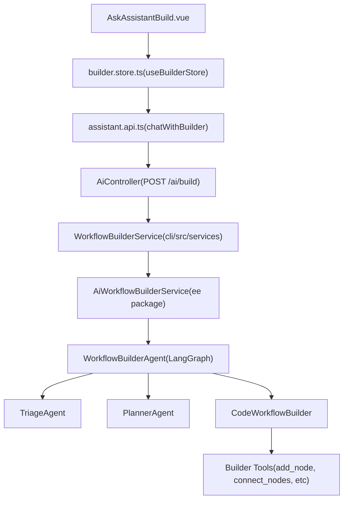

# AI 工作流生成器 (AI Workflow Builder)

相关源文件

-   [packages/@n8n/ai-workflow-builder.ee/src/ai-workflow-builder-agent.service.ts](https://github.com/n8n-io/n8n/blob/88f170b9/packages/@n8n/ai-workflow-builder.ee/src/ai-workflow-builder-agent.service.ts)
-   [packages/@n8n/ai-workflow-builder.ee/src/assistant/assistant-handler.ts](https://github.com/n8n-io/n8n/blob/88f170b9/packages/@n8n/ai-workflow-builder.ee/src/assistant/assistant-handler.ts)
-   [packages/@n8n/ai-workflow-builder.ee/src/assistant/test/assistant-handler.test.ts](https://github.com/n8n-io/n8n/blob/88f170b9/packages/@n8n/ai-workflow-builder.ee/src/assistant/test/assistant-handler.test.ts)
-   [packages/@n8n/ai-workflow-builder.ee/src/code-builder/triage.agent.ts](https://github.com/n8n-io/n8n/blob/88f170b9/packages/@n8n/ai-workflow-builder.ee/src/code-builder/triage.agent.ts)
-   [packages/@n8n/ai-workflow-builder.ee/src/constants.ts](https://github.com/n8n-io/n8n/blob/88f170b9/packages/@n8n/ai-workflow-builder.ee/src/constants.ts)
-   [packages/@n8n/ai-workflow-builder.ee/src/session-manager.service.ts](https://github.com/n8n-io/n8n/blob/88f170b9/packages/@n8n/ai-workflow-builder.ee/src/session-manager.service.ts)
-   [packages/@n8n/ai-workflow-builder.ee/src/subgraphs/builder.subgraph.ts](https://github.com/n8n-io/n8n/blob/88f170b9/packages/@n8n/ai-workflow-builder.ee/src/subgraphs/builder.subgraph.ts)
-   [packages/@n8n/ai-workflow-builder.ee/src/test/ai-workflow-builder-agent.service.test.ts](https://github.com/n8n-io/n8n/blob/88f170b9/packages/@n8n/ai-workflow-builder.ee/src/test/ai-workflow-builder-agent.service.test.ts)
-   [packages/@n8n/ai-workflow-builder.ee/src/test/session-manager.service.test.ts](https://github.com/n8n-io/n8n/blob/88f170b9/packages/@n8n/ai-workflow-builder.ee/src/test/session-manager.service.test.ts)
-   [packages/@n8n/ai-workflow-builder.ee/src/test/workflow-builder-agent.test.ts](https://github.com/n8n-io/n8n/blob/88f170b9/packages/@n8n/ai-workflow-builder.ee/src/test/workflow-builder-agent.test.ts)
-   [packages/@n8n/ai-workflow-builder.ee/src/tools/builder-tools.ts](https://github.com/n8n-io/n8n/blob/88f170b9/packages/@n8n/ai-workflow-builder.ee/src/tools/builder-tools.ts)
-   [packages/@n8n/ai-workflow-builder.ee/src/tools/helpers/state.ts](https://github.com/n8n-io/n8n/blob/88f170b9/packages/@n8n/ai-workflow-builder.ee/src/tools/helpers/state.ts)
-   [packages/@n8n/ai-workflow-builder.ee/src/tools/remove-connection.tool.ts](https://github.com/n8n-io/n8n/blob/88f170b9/packages/@n8n/ai-workflow-builder.ee/src/tools/remove-connection.tool.ts)
-   [packages/@n8n/ai-workflow-builder.ee/src/tools/rename-node.tool.ts](https://github.com/n8n-io/n8n/blob/88f170b9/packages/@n8n/ai-workflow-builder.ee/src/tools/rename-node.tool.ts)
-   [packages/@n8n/ai-workflow-builder.ee/src/tools/test/builder-tools.test.ts](https://github.com/n8n-io/n8n/blob/88f170b9/packages/@n8n/ai-workflow-builder.ee/src/tools/test/builder-tools.test.ts)
-   [packages/@n8n/ai-workflow-builder.ee/src/tools/test/remove-connection.tool.test.ts](https://github.com/n8n-io/n8n/blob/88f170b9/packages/@n8n/ai-workflow-builder.ee/src/tools/test/remove-connection.tool.test.ts)
-   [packages/@n8n/ai-workflow-builder.ee/src/tools/test/rename-node.tool.test.ts](https://github.com/n8n-io/n8n/blob/88f170b9/packages/@n8n/ai-workflow-builder.ee/src/tools/test/rename-node.tool.test.ts)
-   [packages/@n8n/ai-workflow-builder.ee/src/types/streaming.ts](https://github.com/n8n-io/n8n/blob/88f170b9/packages/@n8n/ai-workflow-builder.ee/src/types/streaming.ts)
-   [packages/@n8n/ai-workflow-builder.ee/src/types/tools.ts](https://github.com/n8n-io/n8n/blob/88f170b9/packages/@n8n/ai-workflow-builder.ee/src/types/tools.ts)
-   [packages/@n8n/ai-workflow-builder.ee/src/types/workflow.ts](https://github.com/n8n-io/n8n/blob/88f170b9/packages/@n8n/ai-workflow-builder.ee/src/types/workflow.ts)
-   [packages/@n8n/ai-workflow-builder.ee/src/utils/error-sanitizer.ts](https://github.com/n8n-io/n8n/blob/88f170b9/packages/@n8n/ai-workflow-builder.ee/src/utils/error-sanitizer.ts)
-   [packages/@n8n/ai-workflow-builder.ee/src/utils/operations-processor.ts](https://github.com/n8n-io/n8n/blob/88f170b9/packages/@n8n/ai-workflow-builder.ee/src/utils/operations-processor.ts)
-   [packages/@n8n/ai-workflow-builder.ee/src/utils/stream-processor.ts](https://github.com/n8n-io/n8n/blob/88f170b9/packages/@n8n/ai-workflow-builder.ee/src/utils/stream-processor.ts)
-   [packages/@n8n/ai-workflow-builder.ee/src/utils/test/error-sanitizer.test.ts](https://github.com/n8n-io/n8n/blob/88f170b9/packages/@n8n/ai-workflow-builder.ee/src/utils/test/error-sanitizer.test.ts)
-   [packages/@n8n/ai-workflow-builder.ee/src/utils/test/operations-processor.test.ts](https://github.com/n8n-io/n8n/blob/88f170b9/packages/@n8n/ai-workflow-builder.ee/src/utils/test/operations-processor.test.ts)
-   [packages/@n8n/ai-workflow-builder.ee/src/utils/test/stream-processor.test.ts](https://github.com/n8n-io/n8n/blob/88f170b9/packages/@n8n/ai-workflow-builder.ee/src/utils/test/stream-processor.test.ts)
-   [packages/@n8n/ai-workflow-builder.ee/src/utils/test/tool-executor.test.ts](https://github.com/n8n-io/n8n/blob/88f170b9/packages/@n8n/ai-workflow-builder.ee/src/utils/test/tool-executor.test.ts)
-   [packages/@n8n/ai-workflow-builder.ee/src/utils/token-usage.ts](https://github.com/n8n-io/n8n/blob/88f170b9/packages/@n8n/ai-workflow-builder.ee/src/utils/token-usage.ts)
-   [packages/@n8n/ai-workflow-builder.ee/src/workflow-builder-agent.ts](https://github.com/n8n-io/n8n/blob/88f170b9/packages/@n8n/ai-workflow-builder.ee/src/workflow-builder-agent.ts)
-   [packages/@n8n/ai-workflow-builder.ee/src/workflow-state.ts](https://github.com/n8n-io/n8n/blob/88f170b9/packages/@n8n/ai-workflow-builder.ee/src/workflow-state.ts)
-   [packages/@n8n/api-types/src/dto/ai/\_\_tests\_\_/ai-build-request.dto.test.ts](https://github.com/n8n-io/n8n/blob/88f170b9/packages/@n8n/api-types/src/dto/ai/__tests__/ai-build-request.dto.test.ts)
-   [packages/@n8n/api-types/src/dto/ai/ai-build-request.dto.ts](https://github.com/n8n-io/n8n/blob/88f170b9/packages/@n8n/api-types/src/dto/ai/ai-build-request.dto.ts)
-   [packages/@n8n/api-types/src/dto/index.ts](https://github.com/n8n-io/n8n/blob/88f170b9/packages/@n8n/api-types/src/dto/index.ts)
-   [packages/cli/src/controllers/\_\_tests\_\_/ai.controller.test.ts](https://github.com/n8n-io/n8n/blob/88f170b9/packages/cli/src/controllers/__tests__/ai.controller.test.ts)
-   [packages/cli/src/controllers/ai.controller.ts](https://github.com/n8n-io/n8n/blob/88f170b9/packages/cli/src/controllers/ai.controller.ts)
-   [packages/cli/src/services/\_\_tests\_\_/ai-workflow-builder.service.test.ts](https://github.com/n8n-io/n8n/blob/88f170b9/packages/cli/src/services/__tests__/ai-workflow-builder.service.test.ts)
-   [packages/cli/src/services/\_\_tests\_\_/ai.service.test.ts](https://github.com/n8n-io/n8n/blob/88f170b9/packages/cli/src/services/__tests__/ai.service.test.ts)
-   [packages/cli/src/services/ai-workflow-builder.service.ts](https://github.com/n8n-io/n8n/blob/88f170b9/packages/cli/src/services/ai-workflow-builder.service.ts)
-   [packages/cli/src/services/ai.service.ts](https://github.com/n8n-io/n8n/blob/88f170b9/packages/cli/src/services/ai.service.ts)
-   [packages/frontend/@n8n/design-system/src/components/AskAssistantChat/messages/MessageWrapper.vue](https://github.com/n8n-io/n8n/blob/88f170b9/packages/frontend/@n8n/design-system/src/components/AskAssistantChat/messages/MessageWrapper.vue)
-   [packages/frontend/@n8n/design-system/src/components/AskAssistantChat/messages/TextMessage.test.ts](https://github.com/n8n-io/n8n/blob/88f170b9/packages/frontend/@n8n/design-system/src/components/AskAssistantChat/messages/TextMessage.test.ts)
-   [packages/frontend/@n8n/design-system/src/components/CodeDiff/CodeDiff.vue](https://github.com/n8n-io/n8n/blob/88f170b9/packages/frontend/@n8n/design-system/src/components/CodeDiff/CodeDiff.vue)
-   [packages/frontend/@n8n/design-system/src/components/CodeDiff/\_\_snapshots\_\_/CodeDiff.test.ts.snap](https://github.com/n8n-io/n8n/blob/88f170b9/packages/frontend/@n8n/design-system/src/components/CodeDiff/__snapshots__/CodeDiff.test.ts.snap)
-   [packages/frontend/@n8n/design-system/src/types/assistant.ts](https://github.com/n8n-io/n8n/blob/88f170b9/packages/frontend/@n8n/design-system/src/types/assistant.ts)
-   [packages/frontend/editor-ui/src/app/constants/workflowSuggestions.ts](https://github.com/n8n-io/n8n/blob/88f170b9/packages/frontend/editor-ui/src/app/constants/workflowSuggestions.ts)
-   [packages/frontend/editor-ui/src/features/ai/assistant/assistant.api.test.ts](https://github.com/n8n-io/n8n/blob/88f170b9/packages/frontend/editor-ui/src/features/ai/assistant/assistant.api.test.ts)
-   [packages/frontend/editor-ui/src/features/ai/assistant/assistant.api.ts](https://github.com/n8n-io/n8n/blob/88f170b9/packages/frontend/editor-ui/src/features/ai/assistant/assistant.api.ts)
-   [packages/frontend/editor-ui/src/features/ai/assistant/assistant.store.test.ts](https://github.com/n8n-io/n8n/blob/88f170b9/packages/frontend/editor-ui/src/features/ai/assistant/assistant.store.test.ts)
-   [packages/frontend/editor-ui/src/features/ai/assistant/assistant.store.ts](https://github.com/n8n-io/n8n/blob/88f170b9/packages/frontend/editor-ui/src/features/ai/assistant/assistant.store.ts)
-   [packages/frontend/editor-ui/src/features/ai/assistant/assistant.types.ts](https://github.com/n8n-io/n8n/blob/88f170b9/packages/frontend/editor-ui/src/features/ai/assistant/assistant.types.ts)
-   [packages/frontend/editor-ui/src/features/ai/assistant/builder.store.test.ts](https://github.com/n8n-io/n8n/blob/88f170b9/packages/frontend/editor-ui/src/features/ai/assistant/builder.store.test.ts)
-   [packages/frontend/editor-ui/src/features/ai/assistant/builder.store.ts](https://github.com/n8n-io/n8n/blob/88f170b9/packages/frontend/editor-ui/src/features/ai/assistant/builder.store.ts)
-   [packages/frontend/editor-ui/src/features/ai/assistant/builder.utils.test.ts](https://github.com/n8n-io/n8n/blob/88f170b9/packages/frontend/editor-ui/src/features/ai/assistant/builder.utils.test.ts)
-   [packages/frontend/editor-ui/src/features/ai/assistant/builder.utils.ts](https://github.com/n8n-io/n8n/blob/88f170b9/packages/frontend/editor-ui/src/features/ai/assistant/builder.utils.ts)
-   [packages/frontend/editor-ui/src/features/ai/assistant/chatPanel.store.test.ts](https://github.com/n8n-io/n8n/blob/88f170b9/packages/frontend/editor-ui/src/features/ai/assistant/chatPanel.store.test.ts)
-   [packages/frontend/editor-ui/src/features/ai/assistant/chatPanel.store.ts](https://github.com/n8n-io/n8n/blob/88f170b9/packages/frontend/editor-ui/src/features/ai/assistant/chatPanel.store.ts)
-   [packages/frontend/editor-ui/src/features/ai/assistant/components/Agent/AskAssistantBuild.test.ts](https://github.com/n8n-io/n8n/blob/88f170b9/packages/frontend/editor-ui/src/features/ai/assistant/components/Agent/AskAssistantBuild.test.ts)
-   [packages/frontend/editor-ui/src/features/ai/assistant/components/Agent/AskAssistantBuild.vue](https://github.com/n8n-io/n8n/blob/88f170b9/packages/frontend/editor-ui/src/features/ai/assistant/components/Agent/AskAssistantBuild.vue)
-   [packages/frontend/editor-ui/src/features/ai/assistant/components/Agent/BuildModeEmptyState.vue](https://github.com/n8n-io/n8n/blob/88f170b9/packages/frontend/editor-ui/src/features/ai/assistant/components/Agent/BuildModeEmptyState.vue)
-   [packages/frontend/editor-ui/src/features/ai/assistant/components/Chat/AskAssistantChat.vue](https://github.com/n8n-io/n8n/blob/88f170b9/packages/frontend/editor-ui/src/features/ai/assistant/components/Chat/AskAssistantChat.vue)
-   [packages/frontend/editor-ui/src/features/ai/assistant/components/FocusedNodes/ChatInputWithMention.vue](https://github.com/n8n-io/n8n/blob/88f170b9/packages/frontend/editor-ui/src/features/ai/assistant/components/FocusedNodes/ChatInputWithMention.vue)
-   [packages/frontend/editor-ui/src/features/ai/assistant/components/FocusedNodes/FocusedNodeChip.vue](https://github.com/n8n-io/n8n/blob/88f170b9/packages/frontend/editor-ui/src/features/ai/assistant/components/FocusedNodes/FocusedNodeChip.vue)
-   [packages/frontend/editor-ui/src/features/ai/assistant/composables/useAIAssistantHelpers.ts](https://github.com/n8n-io/n8n/blob/88f170b9/packages/frontend/editor-ui/src/features/ai/assistant/composables/useAIAssistantHelpers.ts)
-   [packages/frontend/editor-ui/src/features/ai/assistant/composables/useAskModeCoachmark.ts](https://github.com/n8n-io/n8n/blob/88f170b9/packages/frontend/editor-ui/src/features/ai/assistant/composables/useAskModeCoachmark.ts)
-   [packages/frontend/editor-ui/src/features/ai/assistant/composables/useBuilderMessages.ts](https://github.com/n8n-io/n8n/blob/88f170b9/packages/frontend/editor-ui/src/features/ai/assistant/composables/useBuilderMessages.ts)
-   [packages/frontend/editor-ui/src/features/ai/assistant/composables/useBuilderTodos.test.ts](https://github.com/n8n-io/n8n/blob/88f170b9/packages/frontend/editor-ui/src/features/ai/assistant/composables/useBuilderTodos.test.ts)
-   [packages/frontend/editor-ui/src/features/ai/assistant/composables/useBuilderTodos.ts](https://github.com/n8n-io/n8n/blob/88f170b9/packages/frontend/editor-ui/src/features/ai/assistant/composables/useBuilderTodos.ts)
-   [packages/frontend/editor-ui/src/features/ai/assistant/composables/useCodeDiff.ts](https://github.com/n8n-io/n8n/blob/88f170b9/packages/frontend/editor-ui/src/features/ai/assistant/composables/useCodeDiff.ts)
-   [packages/frontend/editor-ui/src/features/ai/assistant/composables/useFocusedNodesChipUI.ts](https://github.com/n8n-io/n8n/blob/88f170b9/packages/frontend/editor-ui/src/features/ai/assistant/composables/useFocusedNodesChipUI.ts)
-   [packages/frontend/editor-ui/src/features/ai/assistant/composables/useNodeMention.test.ts](https://github.com/n8n-io/n8n/blob/88f170b9/packages/frontend/editor-ui/src/features/ai/assistant/composables/useNodeMention.test.ts)
-   [packages/frontend/editor-ui/src/features/ai/assistant/composables/useNodeMention.ts](https://github.com/n8n-io/n8n/blob/88f170b9/packages/frontend/editor-ui/src/features/ai/assistant/composables/useNodeMention.ts)
-   [packages/frontend/editor-ui/src/features/ai/assistant/focusedNodes.store.ts](https://github.com/n8n-io/n8n/blob/88f170b9/packages/frontend/editor-ui/src/features/ai/assistant/focusedNodes.store.ts)
-   [packages/frontend/editor-ui/src/features/ndv/parameters/components/ButtonParameter/ButtonParameter.test.ts](https://github.com/n8n-io/n8n/blob/88f170b9/packages/frontend/editor-ui/src/features/ndv/parameters/components/ButtonParameter/ButtonParameter.test.ts)
-   [packages/frontend/editor-ui/src/features/ndv/parameters/utils/buttonParameter.utils.test.ts](https://github.com/n8n-io/n8n/blob/88f170b9/packages/frontend/editor-ui/src/features/ndv/parameters/utils/buttonParameter.utils.test.ts)
-   [packages/frontend/editor-ui/src/features/ndv/parameters/utils/buttonParameter.utils.ts](https://github.com/n8n-io/n8n/blob/88f170b9/packages/frontend/editor-ui/src/features/ndv/parameters/utils/buttonParameter.utils.ts)
-   [packages/frontend/editor-ui/src/features/shared/editors/components/CodeNodeEditor/AskAI/AskAI.vue](https://github.com/n8n-io/n8n/blob/88f170b9/packages/frontend/editor-ui/src/features/shared/editors/components/CodeNodeEditor/AskAI/AskAI.vue)

AI 工作流生成器是一个 AI 辅助系统，允许用户使用自然语言创建和修改工作流。它在 `@n8n/ai-workflow-builder.ee` 软件包中作为一个多代理 (multi-agent) 系统实现，该系统与 n8n 后端集成，为工作流构建提供对话式界面。

---

## 系统架构 (System Architecture)

该系统遵循分层架构，其中前端 Pinia store 与 CLI 软件包中专门的 AI 控制器通信。该控制器委托给一个管理多代理 LangGraph 工作流的服务。

### 多代理架构 (Multi-Agent Architecture)

生成逻辑的核心位于 `WorkflowBuilderAgent` 中。它使用一个多代理图（通过 LangGraph）来分拣请求、规划变更并执行节点操作。

**图: AI 生成器系统组件与代码实体**

来源: [packages/cli/src/controllers/ai.controller.ts34-53](https://github.com/n8n-io/n8n/blob/88f170b9/packages/cli/src/controllers/ai.controller.ts#L34-L53) [packages/cli/src/services/ai-workflow-builder.service.ts34-51](https://github.com/n8n-io/n8n/blob/88f170b9/packages/cli/src/services/ai-workflow-builder.service.ts#L34-L51) [packages/@n8n/ai-workflow-builder.ee/src/workflow-builder-agent.ts152-167](https://github.com/n8n-io/n8n/blob/88f170b9/packages/@n8n/ai-workflow-builder.ee/src/workflow-builder-agent.ts#L152-L167) [packages/frontend/editor-ui/src/features/ai/assistant/builder.store.ts154-169](https://github.com/n8n-io/n8n/blob/88f170b9/packages/frontend/editor-ui/src/features/ai/assistant/builder.store.ts#L154-L169)

---

## WorkflowBuilderAgent

`WorkflowBuilderAgent` 是 AI 驱动的工作流编辑的中央协调器。它支持两种主要模式：旧版多代理系统和较新的 `CodeWorkflowBuilder`。

### 核心配置 (Core Configuration)

代理通过 `StageLLMs` 进行配置，它将特定的 LLM 实例映射到角色，如 `supervisor`、`planner` 和 `builder`。

| 阶段 | 角色 |
| --- | --- |
| `supervisor` | 编排图中代理节点之间的转换。 |
| `planner` | 在进行任何编辑之前生成结构化计划（计划模式）。 |
| `builder` | 负责生成最终的工作流 JSON 或代码片段。 |
| `parameterUpdater` | 专门根据上下文细化节点参数。 |

来源: [packages/@n8n/ai-workflow-builder.ee/src/workflow-builder-agent.ts66-73](https://github.com/n8n-io/n8n/blob/88f170b9/packages/@n8n/ai-workflow-builder.ee/src/workflow-builder-agent.ts#L66-L73) [packages/@n8n/ai-workflow-builder.ee/src/workflow-builder-agent.ts168-180](https://github.com/n8n-io/n8n/blob/88f170b9/packages/@n8n/ai-workflow-builder.ee/src/workflow-builder-agent.ts#L168-L180)

### 对话执行流 (Chat Execution Flow)

`chat()` 方法是一个异步生成器，它将 `StreamEvent` 对象（包含消息或工作流更新）流式传回客户端。

1.  **验证 (Validation)**: 确保提示词长度不超过 `MAX_AI_BUILDER_PROMPT_LENGTH`。
2.  **会话加载 (Session Loading)**: 使用 `loadCodeBuilderSession` 检索或初始化 `CodeBuilderSession`。
3.  **分拣 (Triage)**: 如果启用了 `mergeAskBuild`，`TriageAgent` 会确定请求是“构建 (build)”请求还是通用的“询问 (ask)”查询。
4.  **执行 (Execution)**: 根据 `mode`（'build' 或 'plan'）和特性标志，它要么执行多代理图，要么执行 `CodeWorkflowBuilder`。

来源: [packages/@n8n/ai-workflow-builder.ee/src/workflow-builder-agent.ts208-250](https://github.com/n8n-io/n8n/blob/88f170b9/packages/@n8n/ai-workflow-builder.ee/src/workflow-builder-agent.ts#L208-L250) [packages/@n8n/ai-workflow-builder.ee/src/workflow-builder-agent.ts255-290](https://github.com/n8n-io/n8n/blob/88f170b9/packages/@n8n/ai-workflow-builder.ee/src/workflow-builder-agent.ts#L255-L290)

---

## 前端实现 (Frontend Implementation)

前端围绕 `builder.store.ts` 和 `AskAssistantBuild.vue` 组件构建。

### builder.store.ts

此 Pinia store 管理对话状态、额度以及流式传输生命周期。

-   **状态管理 (State Management)**: 跟踪 `chatMessages`、`streaming` 状态和 `creditsQuota`。
-   **遥测 (Telemetry)**: 为用户交互（如点击“实现计划 (Implement Plan)”或还原版本）发出 `WorkflowBuilderJourney` 事件。
-   **上下文准备 (Context Preparation)**: `createBuilderPayload` 收集当前工作流 JSON、执行 schema 以及聚焦的节点上下文，并发送到后端。

来源: [packages/frontend/editor-ui/src/features/ai/assistant/builder.store.ts154-192](https://github.com/n8n-io/n8n/blob/88f170b9/packages/frontend/editor-ui/src/features/ai/assistant/builder.store.ts#L154-L192) [packages/frontend/editor-ui/src/features/ai/assistant/builder.store.ts68-93](https://github.com/n8n-io/n8n/blob/88f170b9/packages/frontend/editor-ui/src/features/ai/assistant/builder.store.ts#L68-L93)

### AskAssistantBuild.vue

渲染 AI 对话侧边栏的 UI 组件。它处理：

-   **工作流更新**: 监听类型为 `workflow-updated` 的消息，并通过 `useWorkflowUpdate` 将其应用到画布。
-   **计划显示**: 当 AI 提供建议计划时渲染 `PlanDisplayMessage.vue`。
-   **HITL (人机协同)**: 使用 `PlanQuestionsMessage.vue` 渲染来自 AI 的问题，并将用户的回答发回。

来源: [packages/frontend/editor-ui/src/features/ai/assistant/components/Agent/AskAssistantBuild.vue99-118](https://github.com/n8n-io/n8n/blob/88f170b9/packages/frontend/editor-ui/src/features/ai/assistant/components/Agent/AskAssistantBuild.vue#L99-L118) [packages/frontend/editor-ui/src/features/ai/assistant/components/Agent/AskAssistantBuild.vue152-164](https://github.com/n8n-io/n8n/blob/88f170b9/packages/frontend/editor-ui/src/features/ai/assistant/components/Agent/AskAssistantBuild.vue#L152-L164)

---

## 数据流: 从提示词到画布 (Data Flow: Prompt to Canvas)

下图连接了自然语言空间（用户输入）到代码实体空间（节点更新）。

**图: 自然语言到节点实体映射**

> **[Mermaid sequence]**
> *(图表结构无法解析)*

来源: [packages/cli/src/controllers/ai.controller.ts62-83](https://github.com/n8n-io/n8n/blob/88f170b9/packages/cli/src/controllers/ai.controller.ts#L62-L83) [packages/frontend/editor-ui/src/features/ai/assistant/builder.store.ts550-570](https://github.com/n8n-io/n8n/blob/88f170b9/packages/frontend/editor-ui/src/features/ai/assistant/builder.store.ts#L550-L570) [packages/@n8n/ai-workflow-builder.ee/src/workflow-builder-agent.ts120-150](https://github.com/n8n-io/n8n/blob/88f170b9/packages/@n8n/ai-workflow-builder.ee/src/workflow-builder-agent.ts#L120-L150)

---

## 工具与节点操作 (Tooling and Node Operations)

AI 生成器通过 EE 软件包中定义的一组专门工具与工作流交互。这些工具允许 LLM 执行结构和参数变更。

| 工具名称 | 实现函数 | 目的 |
| --- | --- | --- |
| `add_node` | `createAddNodeTool` | 在工作流中插入特定类型的新节点。 |
| `connect_nodes` | `createConnectNodesTool` | 在两个现有节点之间创建连接。 |
| `update_node_parameters` | `createUpdateNodeParametersTool` | 修改节点的参数（例如 URL、JSON body）。 |
| `remove_node` | `createRemoveNodeTool` | 从工作流中删除节点。 |
| `node_search` | `createNodeSearchTool` | 允许 AI 搜索可用的节点类型及其描述。 |

来源: [packages/@n8n/ai-workflow-builder.ee/src/test/workflow-builder-agent.test.ts10-32](https://github.com/n8n-io/n8n/blob/88f170b9/packages/@n8n/ai-workflow-builder.ee/src/test/workflow-builder-agent.test.ts#L10-L32) [packages/@n8n/ai-workflow-builder.ee/src/workflow-builder-agent.ts75-78](https://github.com/n8n-io/n8n/blob/88f170b9/packages/@n8n/ai-workflow-builder.ee/src/workflow-builder-agent.ts#L75-L78)

---

## 会话与额度管理 (Session and Credit Management)

### 会话持久化 (Session Persistence)

如果启用了 `ai.persistBuilderSessions` 配置，会话可以持久化到数据库。`WorkflowBuilderSessionRepository` 处理 LangGraph 线程状态和 code builder 会话的存储。

来源: [packages/cli/src/services/ai-workflow-builder.service.ts152-154](https://github.com/n8n-io/n8n/blob/88f170b9/packages/cli/src/services/ai-workflow-builder.service.ts#L152-L154) [packages/@n8n/ai-workflow-builder.ee/src/code-builder/utils/code-builder-session.ts28-33](https://github.com/n8n-io/n8n/blob/88f170b9/packages/@n8n/ai-workflow-builder.ee/src/code-builder/utils/code-builder-session.ts#L28-L33)

### 额度与配额 (Credits and Quotas)

n8n 通过额度系统跟踪 AI 使用情况。

1.  后端上的 `AiUsageService` 监控消耗。
2.  `AiWorkflowBuilderService` 通过 `onCreditsUpdated` 接收更新。
3.  `Push` 服务向前端发送 `updateBuilderCredits` 事件。
4.  当前端额度较低时，前端会显示 `CreditWarningBanner`。

来源: [packages/cli/src/services/ai-workflow-builder.service.ts101-112](https://github.com/n8n-io/n8n/blob/88f170b9/packages/cli/src/services/ai-workflow-builder.service.ts#L101-L112) [packages/frontend/editor-ui/src/features/ai/assistant/builder.store.ts164-169](https://github.com/n8n-io/n8n/blob/88f170b9/packages/frontend/editor-ui/src/features/ai/assistant/builder.store.ts#L164-L169)
