# Chat Hub 后端系统 (Chat Hub Backend System)

相关源文件

-   [packages/@n8n/api-types/src/chat-hub.ts](https://github.com/n8n-io/n8n/blob/88f170b9/packages/@n8n/api-types/src/chat-hub.ts)
-   [packages/@n8n/api-types/src/index.ts](https://github.com/n8n-io/n8n/blob/88f170b9/packages/@n8n/api-types/src/index.ts)
-   [packages/cli/src/modules/chat-hub/__tests__/chat-hub.service.integration.test.ts](https://github.com/n8n-io/n8n/blob/88f170b9/packages/cli/src/modules/chat-hub/__tests__/chat-hub.service.integration.test.ts)
-   [packages/cli/src/modules/chat-hub/chat-hub-agent.repository.ts](https://github.com/n8n-io/n8n/blob/88f170b9/packages/cli/src/modules/chat-hub/chat-hub-agent.repository.ts)
-   [packages/cli/src/modules/chat-hub/chat-hub-message.entity.ts](https://github.com/n8n-io/n8n/blob/88f170b9/packages/cli/src/modules/chat-hub/chat-hub-message.entity.ts)
-   [packages/cli/src/modules/chat-hub/chat-hub-session.entity.ts](https://github.com/n8n-io/n8n/blob/88f170b9/packages/cli/src/modules/chat-hub/chat-hub-session.entity.ts)
-   [packages/cli/src/modules/chat-hub/chat-hub-workflow.service.ts](https://github.com/n8n-io/n8n/blob/88f170b9/packages/cli/src/modules/chat-hub/chat-hub-workflow.service.ts)
-   [packages/cli/src/modules/chat-hub/chat-hub.constants.ts](https://github.com/n8n-io/n8n/blob/88f170b9/packages/cli/src/modules/chat-hub/chat-hub.constants.ts)
-   [packages/cli/src/modules/chat-hub/chat-hub.controller.ts](https://github.com/n8n-io/n8n/blob/88f170b9/packages/cli/src/modules/chat-hub/chat-hub.controller.ts)
-   [packages/cli/src/modules/chat-hub/chat-hub.service.ts](https://github.com/n8n-io/n8n/blob/88f170b9/packages/cli/src/modules/chat-hub/chat-hub.service.ts)
-   [packages/cli/src/modules/chat-hub/chat-hub.types.ts](https://github.com/n8n-io/n8n/blob/88f170b9/packages/cli/src/modules/chat-hub/chat-hub.types.ts)
-   [packages/cli/src/modules/chat-hub/chat-message.repository.ts](https://github.com/n8n-io/n8n/blob/88f170b9/packages/cli/src/modules/chat-hub/chat-message.repository.ts)
-   [packages/cli/src/modules/chat-hub/chat-session.repository.ts](https://github.com/n8n-io/n8n/blob/88f170b9/packages/cli/src/modules/chat-hub/chat-session.repository.ts)
-   [packages/cli/src/modules/chat-hub/context-limits.ts](https://github.com/n8n-io/n8n/blob/88f170b9/packages/cli/src/modules/chat-hub/context-limits.ts)
-   [packages/frontend/editor-ui/src/features/ai/chatHub/ChatView.vue](https://github.com/n8n-io/n8n/blob/88f170b9/packages/frontend/editor-ui/src/features/ai/chatHub/ChatView.vue)
-   [packages/frontend/editor-ui/src/features/ai/chatHub/chat.api.ts](https://github.com/n8n-io/n8n/blob/88f170b9/packages/frontend/editor-ui/src/features/ai/chatHub/chat.api.ts)
-   [packages/frontend/editor-ui/src/features/ai/chatHub/chat.store.ts](https://github.com/n8n-io/n8n/blob/88f170b9/packages/frontend/editor-ui/src/features/ai/chatHub/chat.store.ts)
-   [packages/frontend/editor-ui/src/features/ai/chatHub/chat.types.ts](https://github.com/n8n-io/n8n/blob/88f170b9/packages/frontend/editor-ui/src/features/ai/chatHub/chat.types.ts)
-   [packages/frontend/editor-ui/src/features/ai/chatHub/chat.utils.ts](https://github.com/n8n-io/n8n/blob/88f170b9/packages/frontend/editor-ui/src/features/ai/chatHub/chat.utils.ts)
-   [packages/frontend/editor-ui/src/features/ai/chatHub/components/AgentEditorModal.vue](https://github.com/n8n-io/n8n/blob/88f170b9/packages/frontend/editor-ui/src/features/ai/chatHub/components/AgentEditorModal.vue)
-   [packages/frontend/editor-ui/src/features/ai/chatHub/components/ChatAgentCard.vue](https://github.com/n8n-io/n8n/blob/88f170b9/packages/frontend/editor-ui/src/features/ai/chatHub/components/ChatAgentCard.vue)
-   [packages/frontend/editor-ui/src/features/ai/chatHub/components/ChatConversationHeader.vue](https://github.com/n8n-io/n8n/blob/88f170b9/packages/frontend/editor-ui/src/features/ai/chatHub/components/ChatConversationHeader.vue)
-   [packages/frontend/editor-ui/src/features/ai/chatHub/components/ChatMessage.vue](https://github.com/n8n-io/n8n/blob/88f170b9/packages/frontend/editor-ui/src/features/ai/chatHub/components/ChatMessage.vue)
-   [packages/frontend/editor-ui/src/features/ai/chatHub/components/ChatPrompt.vue](https://github.com/n8n-io/n8n/blob/88f170b9/packages/frontend/editor-ui/src/features/ai/chatHub/components/ChatPrompt.vue)
-   [packages/frontend/editor-ui/src/features/ai/chatHub/components/ChatSessionMenuItem.vue](https://github.com/n8n-io/n8n/blob/88f170b9/packages/frontend/editor-ui/src/features/ai/chatHub/components/ChatSessionMenuItem.vue)
-   [packages/frontend/editor-ui/src/features/ai/chatHub/components/ChatSidebarContent.vue](https://github.com/n8n-io/n8n/blob/88f170b9/packages/frontend/editor-ui/src/features/ai/chatHub/components/ChatSidebarContent.vue)
-   [packages/frontend/editor-ui/src/features/ai/chatHub/components/ModelSelector.vue](https://github.com/n8n-io/n8n/blob/88f170b9/packages/frontend/editor-ui/src/features/ai/chatHub/components/ModelSelector.vue)
-   [packages/frontend/editor-ui/src/features/ai/chatHub/constants.ts](https://github.com/n8n-io/n8n/blob/88f170b9/packages/frontend/editor-ui/src/features/ai/chatHub/constants.ts)

本文档介绍 n8n Chat Hub 功能的后端系统，它通过动态工作流生成与执行提供对话式 AI 能力。后端负责管理聊天会话、编排 LLM 交互、构建临时工作流，并通过 WebSocket 流式传输响应。

有关 Chat Hub 前端界面的信息，请参阅 [Chat Hub 前端与用户界面](https://github.com/n8n-io/n8n/blob/88f170b9/Chat Hub Frontend and User Interface)。有关 AI 代理执行和工具调用的详细信息，请参阅 [AI 代理与工具执行](https://github.com/n8n-io/n8n/blob/88f170b9/AI Agent and Tool Execution)。

---

## 系统概览 (System Overview)

Chat Hub 后端通过为每次聊天交互动态生成并执行 n8n 工作流来实现对话式 AI。系统无需用户手动构建工作流，而是会根据对话上下文自动构建包含聊天触发器、LLM 节点、记忆管理和工具集成的工作流图。

**关键职责：**

-   **会话管理**：通过 `ChatHubSessionRepository` 创建并跟踪带有消息历史的聊天会话。
-   **工作流生成**：通过 `ChatHubWorkflowService` 为每次聊天交互构建临时工作流。
-   **执行编排**：通过 `ChatHubExecutionService` 运行工作流并管理其生命周期。
-   **流式传输**：通过 `ChatStreamService` 使用 WebSocket 推送事件流式传输 LLM 响应。
-   **模型管理**：通过 `ChatHubModelsService` 从多个 LLM 提供商获取可用模型。
-   **代理与工具支持**：通过 `ChatHubAgentService` 和 `ChatHubToolService` 管理自定义代理和可配置工具。

来源: [packages/cli/src/modules/chat-hub/chat-hub.service.ts54-73](https://github.com/n8n-io/n8n/blob/88f170b9/packages/cli/src/modules/chat-hub/chat-hub.service.ts#L54-L73) [packages/cli/src/modules/chat-hub/chat-hub-workflow.service.ts82-96](https://github.com/n8n-io/n8n/blob/88f170b9/packages/cli/src/modules/chat-hub/chat-hub-workflow.service.ts#L82-L96)

---

## 核心架构 (Core Architecture)

### 组件图 (Component Diagram)

```mermaid
flowchart TD
    Controller["ChatHubControllerpackages/cli/src/modules/chat-hub/chat-hub.controller.ts"]
    Service["ChatHubServicepackages/cli/src/modules/chat-hub/chat-hub.service.ts"]
    WorkflowSvc["ChatHubWorkflowServicepackages/cli/src/modules/chat-hub/chat-hub-workflow.service.ts"]
    ExecSvc["ChatHubExecutionServicepackages/cli/src/modules/chat-hub/chat-hub-execution.service.ts"]
    StreamSvc["ChatStreamServicepackages/cli/src/modules/chat-hub/chat-stream.service.ts"]
    ModelsSvc["ChatHubModelsServicepackages/cli/src/modules/chat-hub/chat-hub.models.service.ts"]
    AgentSvc["ChatHubAgentServicepackages/cli/src/modules/chat-hub/chat-hub-agent.service.ts"]
    ToolSvc["ChatHubToolServicepackages/cli/src/modules/chat-hub/chat-hub-tool.service.ts"]
    TitleSvc["ChatHubTitleServicepackages/cli/src/modules/chat-hub/chat-hub-title.service.ts"]
    AttachSvc["ChatHubAttachmentServicepackages/cli/src/modules/chat-hub/chat-hub.attachment.service.ts"]
    SessionRepo["ChatHubSessionRepositorypackages/cli/src/modules/chat-hub/chat-session.repository.ts"]
    MessageRepo["ChatHubMessageRepositorypackages/cli/src/modules/chat-hub/chat-message.repository.ts"]
    WorkflowRepo["WorkflowRepository"]

    Controller --> Service
    Service --> WorkflowSvc
    Service --> ExecSvc
    Service --> StreamSvc
    Service --> ModelsSvc
    Service --> AgentSvc
    Service --> ToolSvc
    WorkflowSvc --> ToolSvc
    WorkflowSvc --> WorkflowRepo
    ExecSvc --> StreamSvc
    Service --> SessionRepo
    Service --> MessageRepo
```

来源: [packages/cli/src/modules/chat-hub/chat-hub.service.ts54-73](https://github.com/n8n-io/n8n/blob/88f170b9/packages/cli/src/modules/chat-hub/chat-hub.service.ts#L54-L73) [packages/cli/src/modules/chat-hub/chat-hub-workflow.service.ts82-96](https://github.com/n8n-io/n8n/blob/88f170b9/packages/cli/src/modules/chat-hub/chat-hub-workflow.service.ts#L82-L96) [packages/cli/src/modules/chat-hub/chat-hub.controller.ts58-65](https://github.com/n8n-io/n8n/blob/88f170b9/packages/cli/src/modules/chat-hub/chat-hub.controller.ts#L58-L65)

### 主要组件 (Primary Components)

| 组件 | 职责 | 关键方法 |
| --- | --- | --- |
| `ChatHubService` | 聊天操作的主要编排器 | `sendHumanMessage()`、`stopGeneration()`、`getConversations()` |
| `ChatHubWorkflowService` | 为聊天构建动态工作流 | `createChatWorkflow()`、`buildChatWorkflow()`、`deleteChatWorkflow()` |
| `ChatHubExecutionService` | 管理工作流执行生命周期 | `executeChatWorkflowWithCleanup()`、`resumeChatExecution()`、`stop()` |
| `ChatStreamService` | 通过 WebSocket 处理实时流式传输 | `sendHumanMessage()`、`streamChunk()`、`sendEnd()` |
| `ChatHubModelsService` | 管理可用的 LLM 模型 | `getModels()`、`fetchModelsForProvider()` |

来源: [packages/cli/src/modules/chat-hub/chat-hub.service.ts435](https://github.com/n8n-io/n8n/blob/88f170b9/packages/cli/src/modules/chat-hub/chat-hub.service.ts#L435-L435) [packages/cli/src/modules/chat-hub/chat-hub-workflow.service.ts104](https://github.com/n8n-io/n8n/blob/88f170b9/packages/cli/src/modules/chat-hub/chat-hub-workflow.service.ts#L104-L104) [packages/cli/src/modules/chat-hub/chat-hub.controller.ts58-65](https://github.com/n8n-io/n8n/blob/88f170b9/packages/cli/src/modules/chat-hub/chat-hub.controller.ts#L58-L65)

---

## 消息流与执行管线 (Message Flow and Execution Pipeline)

### 端到端消息流 (End-to-End Message Flow)

1.  **请求**：`ChatHubController` 通过 `POST /chat/conversations/send` 接收一条消息。
2.  **持久化**：`ChatHubService` 创建或检索一个 `ChatHubSession`，并将用户消息保存到 `ChatHubMessageRepository`。
3.  **工作流准备**：`ChatHubWorkflowService` 生成一个临时工作流，其中包含一个 `CHAT_TRIGGER_NODE_TYPE` 和一个 `AGENT_LANGCHAIN_NODE_TYPE`。
4.  **执行**：`ChatHubExecutionService` 触发工作流执行。
5.  **流式传输**：当 LLM 生成 token 时，`ChatStreamService` 通过 Push 服务广播 `chatHubStreamChunk` 事件。
6.  **完成**：执行完成后，AI 消息状态会更新为 `success`，并删除临时工作流。

来源: [packages/cli/src/modules/chat-hub/chat-hub.service.ts435-580](https://github.com/n8n-io/n8n/blob/88f170b9/packages/cli/src/modules/chat-hub/chat-hub.service.ts#L435-L580) [packages/cli/src/modules/chat-hub/chat-hub-workflow.service.ts125-177](https://github.com/n8n-io/n8n/blob/88f170b9/packages/cli/src/modules/chat-hub/chat-hub-workflow.service.ts#L125-L177) [packages/cli/src/modules/chat-hub/chat-hub.controller.ts150-168](https://github.com/n8n-io/n8n/blob/88f170b9/packages/cli/src/modules/chat-hub/chat-hub.controller.ts#L150-L168)

### 执行模式 (Execution Modes)

系统支持两种主要会话类型：

-   **生产**：使用已发布的工作流，面向终端用户的聊天交互。
-   **手动**：从工作流画布触发（例如通过 `sendMessageManual`）。此模式允许开发者使用未发布的工作流版本测试聊天交互。

来源: [packages/cli/src/modules/chat-hub/chat-hub.service.ts208-217](https://github.com/n8n-io/n8n/blob/88f170b9/packages/cli/src/modules/chat-hub/chat-hub.service.ts#L208-L217) [packages/cli/src/modules/chat-hub/chat-hub.controller.ts175-203](https://github.com/n8n-io/n8n/blob/88f170b9/packages/cli/src/modules/chat-hub/chat-hub.controller.ts#L175-L203)

---

## 动态工作流生成 (Dynamic Workflow Generation)

Chat Hub 会动态生成临时工作流来处理聊天逻辑。这使 n8n 能够利用其现有的基于节点的执行引擎来处理 AI 交互。

### 工作流结构 (Workflow Structure)

典型生成的聊天工作流包含：

-   **聊天触发器**：`When chat message received`（[packages/cli/src/modules/chat-hub/chat-hub.constants.ts99](https://github.com/n8n-io/n8n/blob/88f170b9/packages/cli/src/modules/chat-hub/chat-hub.constants.ts#L99-L99)）
-   **AI 代理**：使用 `AGENT_LANGCHAIN_NODE_TYPE` 的 `AI Agent` 节点（[packages/cli/src/modules/chat-hub/chat-hub-workflow.service.ts30](https://github.com/n8n-io/n8n/blob/88f170b9/packages/cli/src/modules/chat-hub/chat-hub-workflow.service.ts#L30-L30)）
-   **模型**：特定于提供商的聊天模型节点（例如 `lmChatOpenAi`）。
-   **记忆**：使用 `MEMORY_MANAGER_NODE_TYPE` 的 `Memory Manager`（[packages/cli/src/modules/chat-hub/chat-hub-workflow.service.ts41](https://github.com/n8n-io/n8n/blob/88f170b9/packages/cli/src/modules/chat-hub/chat-hub-workflow.service.ts#L41-L41)）
-   **工具**：基于代理或会话配置的动态工具节点。

### 模型映射 (Model Mapping)

系统将 `ChatHubLLMProvider` 类型映射到特定的 n8n 节点类型：

| 提供商 | 节点类型 | 版本 |
| --- | --- | --- |
| `openai` | `@n8n/n8n-nodes-langchain.lmChatOpenAi` | 1.3 |
| `anthropic` | `@n8n/n8n-nodes-langchain.lmChatAnthropic` | 1.3 |
| `google` | `@n8n/n8n-nodes-langchain.lmChatGoogleGemini` | 1.2 |
| `ollama` | `@n8n/n8n-nodes-langchain.lmChatOllama` | 1.0 |

来源: [packages/cli/src/modules/chat-hub/chat-hub.constants.ts39-96](https://github.com/n8n-io/n8n/blob/88f170b9/packages/cli/src/modules/chat-hub/chat-hub.constants.ts#L39-L96)

---

## 会话与消息持久化 (Session and Message Persistence)

### 数据库实体 (Database Entities)

-   **ChatHubSession**：表示一个对话线程。它存储所有者、标题以及模型配置（提供商、模型 ID 或自定义代理 ID）。
-   **ChatHubMessage**：表示会话中的一条单独消息。
    -   `type`：`human` 或 `ai`。
    -   `status`：`running`、`success`、`error`、`cancelled` 或 `waiting`。
    -   `executionId`：将消息关联到一个特定的 n8n 工作流执行。

来源: [packages/cli/src/modules/chat-hub/chat-hub-session.entity.ts1-100](https://github.com/n8n-io/n8n/blob/88f170b9/packages/cli/src/modules/chat-hub/chat-hub-session.entity.ts#L1-L100) [packages/cli/src/modules/chat-hub/chat-hub-message.entity.ts1-120](https://github.com/n8n-io/n8n/blob/88f170b9/packages/cli/src/modules/chat-hub/chat-hub-message.entity.ts#L1-L120)

### HITL 与等待状态 (HITL and Waiting States)

如果工作流执行命中一个需要用户交互的节点（例如处于 "Response" 模式的 Chat 节点），消息状态会被设为 `waiting`。`ChatHubService.tryResumeWaitingExecution` 函数负责在用户提供后续输入时恢复这些执行。

来源: [packages/cli/src/modules/chat-hub/chat-hub.service.ts112-160](https://github.com/n8n-io/n8n/blob/88f170b9/packages/cli/src/modules/chat-hub/chat-hub.service.ts#L112-L160)

---

## 上下文和模型限制 (Context and Model Limits)

系统会管理上下文窗口限制，以确保 LLM 的稳定性。`getMaxContextWindowTokens` 会检索特定模型允许的最大 token 数。如果模型未知，则默认使用 `DEFAULT_CONTEXT_WINDOW_LENGTH`（通常为 4096）。

来源: [packages/cli/src/modules/chat-hub/context-limits.ts1-50](https://github.com/n8n-io/n8n/blob/88f170b9/packages/cli/src/modules/chat-hub/context-limits.ts#L1-L50) [packages/cli/src/modules/chat-hub/chat-hub-workflow.service.ts11-15](https://github.com/n8n-io/n8n/blob/88f170b9/packages/cli/src/modules/chat-hub/chat-hub-workflow.service.ts#L11-L15)

---

## API 端点 (API Endpoints)

`ChatHubController` 为前端暴露了几个关键端点：

-   `POST /chat/models`：返回可用的 LLM 模型和自定义代理。
-   `GET /chat/conversations`：检索当前认证用户的聊天会话列表。
-   `POST /chat/conversations/send`：在生产模式下发送一条新消息。
-   `POST /chat/conversations/manual/:workflowId/send`：在手动（画布）模式下发送一条消息。
-   `GET /chat/conversations/:sessionId/messages/:messageId/attachments/:index`：下载与消息关联的文件。

来源: [packages/cli/src/modules/chat-hub/chat-hub.controller.ts67-203](https://github.com/n8n-io/n8n/blob/88f170b9/packages/cli/src/modules/chat-hub/chat-hub.controller.ts#L67-L203)

---

## 标题生成 (Title Generation)

当新会话开始时，`ChatHubTitleService` 会根据初始消息生成标题。它会使用一个特定提示词（例如 "Generate a concise title..."）创建一个轻量级工作流，并异步执行它。

来源: [packages/cli/src/modules/chat-hub/chat-hub-title.service.ts1-100](https://github.com/n8n-io/n8n/blob/88f170b9/packages/cli/src/modules/chat-hub/chat-hub-title.service.ts#L1-L100) [packages/cli/src/modules/chat-hub/chat-hub-workflow.service.ts179-224](https://github.com/n8n-io/n8n/blob/88f170b9/packages/cli/src/modules/chat-hub/chat-hub-workflow.service.ts#L179-L224)
