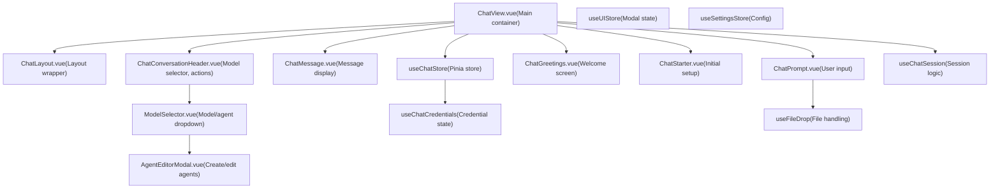
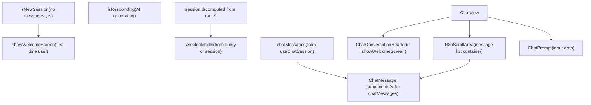
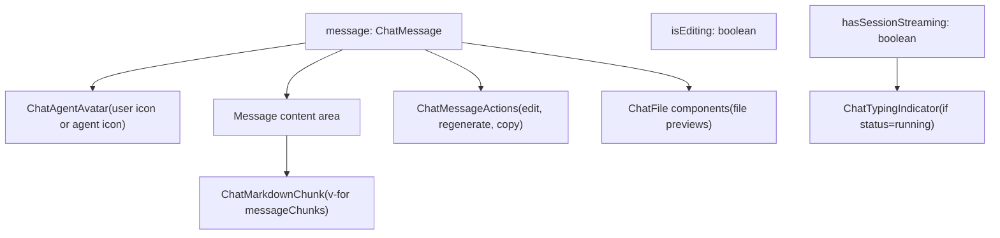

# Chat Hub 前端与用户界面 (Chat Hub Frontend and User Interface)

相关源文件

-   [packages/@n8n/api-types/src/chat-hub.ts](https://github.com/n8n-io/n8n/blob/88f170b9/packages/@n8n/api-types/src/chat-hub.ts)
-   [packages/@n8n/api-types/src/index.ts](https://github.com/n8n-io/n8n/blob/88f170b9/packages/@n8n/api-types/src/index.ts)
-   [packages/cli/src/modules/chat-hub/__tests__/chat-hub.service.integration.test.ts](https://github.com/n8n-io/n8n/blob/88f170b9/packages/cli/src/modules/chat-hub/__tests__/chat-hub.service.integration.test.ts)
-   [packages/cli/src/modules/chat-hub/chat-hub-agent.repository.ts](https://github.com/n8n-io/n8n/blob/88f170b9/packages/cli/src/modules/chat-hub/chat-hub-agent.repository.ts)
-   [packages/cli/src/modules/chat-hub/chat-hub-message.entity.ts](https://github.com/n8n-io/n8n/blob/88f170b9/packages/cli/src/modules/chat-hub/chat-hub-message.entity.ts)
-   [packages/cli/src/modules/chat-hub/chat-hub-session.entity.ts](https://github.com/n8n-io/n8n/blob/88f170b9/packages/cli/src/modules/chat-hub/chat-hub-session.entity.ts)
-   [packages/cli/src/modules/chat-hub/chat-hub-workflow.service.ts](https://github.com/n8n-io/n8n/blob/88f170b9/packages/cli/src/modules/chat-hub/chat-hub-workflow.service.ts)
-   [packages/cli/src/modules/chat-hub/chat-hub.constants.ts](https://github.com/n8n-io/n8n/blob/88f170b9/packages/cli/src/modules/chat-hub/chat-hub.constants.ts)
-   [packages/cli/src/modules/chat-hub/chat-hub.controller.ts](https://github.com/n8n-io/n8n/blob/88f170b9/packages/cli/src/modules/chat-hub/chat-hub.controller.ts)
-   [packages/cli/src/modules/chat-hub/chat-hub.service.ts](https://github.com/n8n-io/n8n/blob/88f170b9/packages/cli/src/modules/chat-hub/chat-hub.service.ts)
-   [packages/cli/src/modules/chat-hub/chat-hub.types.ts](https://github.com/n8n-io/n8n/blob/88f170b9/packages/cli/src/modules/chat-hub/chat-hub.types.ts)
-   [packages/cli/src/modules/chat-hub/chat-message.repository.ts](https://github.com/n8n-io/n8n/blob/88f170b9/packages/cli/src/modules/chat-hub/chat-message.repository.ts)
-   [packages/cli/src/modules/chat-hub/chat-session.repository.ts](https://github.com/n8n-io/n8n/blob/88f170b9/packages/cli/src/modules/chat-hub/chat-session.repository.ts)
-   [packages/cli/src/modules/chat-hub/context-limits.ts](https://github.com/n8n-io/n8n/blob/88f170b9/packages/cli/src/modules/chat-hub/context-limits.ts)
-   [packages/frontend/@n8n/design-system/src/components/AskAssistantChat/AskAssistantChat.test.ts](https://github.com/n8n-io/n8n/blob/88f170b9/packages/frontend/@n8n/design-system/src/components/AskAssistantChat/AskAssistantChat.test.ts)
-   [packages/frontend/@n8n/design-system/src/components/AskAssistantChat/AskAssistantChat.vue](https://github.com/n8n-io/n8n/blob/88f170b9/packages/frontend/@n8n/design-system/src/components/AskAssistantChat/AskAssistantChat.vue)
-   [packages/frontend/@n8n/design-system/src/components/AskAssistantChat/__snapshots__/AskAssistantChat.test.ts.snap](https://github.com/n8n-io/n8n/blob/88f170b9/packages/frontend/@n8n/design-system/src/components/AskAssistantChat/__snapshots__/AskAssistantChat.test.ts.snap)
-   [packages/frontend/@n8n/design-system/src/components/AskAssistantChat/messages/BaseMessage.vue](https://github.com/n8n-io/n8n/blob/88f170b9/packages/frontend/@n8n/design-system/src/components/AskAssistantChat/messages/BaseMessage.vue)
-   [packages/frontend/@n8n/design-system/src/components/AskAssistantChat/messages/ErrorMessage.vue](https://github.com/n8n-io/n8n/blob/88f170b9/packages/frontend/@n8n/design-system/src/components/AskAssistantChat/messages/ErrorMessage.vue)
-   [packages/frontend/@n8n/design-system/src/components/AskAssistantChat/messages/MessageRating.test.ts](https://github.com/n8n-io/n8n/blob/88f170b9/packages/frontend/@n8n/design-system/src/components/AskAssistantChat/messages/MessageRating.test.ts)
-   [packages/frontend/@n8n/design-system/src/components/AskAssistantChat/messages/MessageRating.vue](https://github.com/n8n-io/n8n/blob/88f170b9/packages/frontend/@n8n/design-system/src/components/AskAssistantChat/messages/MessageRating.vue)
-   [packages/frontend/@n8n/design-system/src/components/AskAssistantChat/messages/ThinkingMessage.vue](https://github.com/n8n-io/n8n/blob/88f170b9/packages/frontend/@n8n/design-system/src/components/AskAssistantChat/messages/ThinkingMessage.vue)
-   [packages/frontend/@n8n/design-system/src/components/AskAssistantChat/messages/__snapshots__/MessageRating.test.ts.snap](https://github.com/n8n-io/n8n/blob/88f170b9/packages/frontend/@n8n/design-system/src/components/AskAssistantChat/messages/__snapshots__/MessageRating.test.ts.snap)
-   [packages/frontend/@n8n/design-system/src/components/AskAssistantChat/messages/helpers.ts](https://github.com/n8n-io/n8n/blob/88f170b9/packages/frontend/@n8n/design-system/src/components/AskAssistantChat/messages/helpers.ts)
-   [packages/frontend/@n8n/design-system/src/components/N8nPromptInput/N8nPromptInput.test.ts](https://github.com/n8n-io/n8n/blob/88f170b9/packages/frontend/@n8n/design-system/src/components/N8nPromptInput/N8nPromptInput.test.ts)
-   [packages/frontend/@n8n/design-system/src/components/N8nPromptInput/N8nPromptInput.vue](https://github.com/n8n-io/n8n/blob/88f170b9/packages/frontend/@n8n/design-system/src/components/N8nPromptInput/N8nPromptInput.vue)
-   [packages/frontend/@n8n/design-system/src/components/N8nPromptInput/__snapshots__/N8nPromptInput.test.ts.snap](https://github.com/n8n-io/n8n/blob/88f170b9/packages/frontend/@n8n/design-system/src/components/N8nPromptInput/__snapshots__/N8nPromptInput.test.ts.snap)
-   [packages/frontend/@n8n/design-system/src/components/N8nSticky/Sticky.test.ts](https://github.com/n8n-io/n8n/blob/88f170b9/packages/frontend/@n8n/design-system/src/components/N8nSticky/Sticky.test.ts)
-   [packages/frontend/@n8n/design-system/src/components/N8nSticky/Sticky.vue](https://github.com/n8n-io/n8n/blob/88f170b9/packages/frontend/@n8n/design-system/src/components/N8nSticky/Sticky.vue)
-   [packages/frontend/@n8n/design-system/src/utils/colorUtils.test.ts](https://github.com/n8n-io/n8n/blob/88f170b9/packages/frontend/@n8n/design-system/src/utils/colorUtils.test.ts)
-   [packages/frontend/@n8n/design-system/src/utils/colorUtils.ts](https://github.com/n8n-io/n8n/blob/88f170b9/packages/frontend/@n8n/design-system/src/utils/colorUtils.ts)
-   [packages/frontend/@n8n/design-system/src/utils/index.ts](https://github.com/n8n-io/n8n/blob/88f170b9/packages/frontend/@n8n/design-system/src/utils/index.ts)
-   [packages/frontend/editor-ui/src/features/ai/assistant/components/Agent/CreditWarningBanner.vue](https://github.com/n8n-io/n8n/blob/88f170b9/packages/frontend/editor-ui/src/features/ai/assistant/components/Agent/CreditWarningBanner.vue)
-   [packages/frontend/editor-ui/src/features/ai/assistant/components/Agent/CreditsSettingsDropdown.vue](https://github.com/n8n-io/n8n/blob/88f170b9/packages/frontend/editor-ui/src/features/ai/assistant/components/Agent/CreditsSettingsDropdown.vue)
-   [packages/frontend/editor-ui/src/features/ai/assistant/composables/useBuilderMessages.test.ts](https://github.com/n8n-io/n8n/blob/88f170b9/packages/frontend/editor-ui/src/features/ai/assistant/composables/useBuilderMessages.test.ts)
-   [packages/frontend/editor-ui/src/features/ai/chatHub/ChatView.vue](https://github.com/n8n-io/n8n/blob/88f170b9/packages/frontend/editor-ui/src/features/ai/chatHub/ChatView.vue)
-   [packages/frontend/editor-ui/src/features/ai/chatHub/chat.api.ts](https://github.com/n8n-io/n8n/blob/88f170b9/packages/frontend/editor-ui/src/features/ai/chatHub/chat.api.ts)
-   [packages/frontend/editor-ui/src/features/ai/chatHub/chat.store.ts](https://github.com/n8n-io/n8n/blob/88f170b9/packages/frontend/editor-ui/src/features/ai/chatHub/chat.store.ts)
-   [packages/frontend/editor-ui/src/features/ai/chatHub/chat.types.ts](https://github.com/n8n-io/n8n/blob/88f170b9/packages/frontend/editor-ui/src/features/ai/chatHub/chat.types.ts)
-   [packages/frontend/editor-ui/src/features/ai/chatHub/chat.utils.ts](https://github.com/n8n-io/n8n/blob/88f170b9/packages/frontend/editor-ui/src/features/ai/chatHub/chat.utils.ts)
-   [packages/frontend/editor-ui/src/features/ai/chatHub/components/AgentEditorModal.vue](https://github.com/n8n-io/n8n/blob/88f170b9/packages/frontend/editor-ui/src/features/ai/chatHub/components/AgentEditorModal.vue)
-   [packages/frontend/editor-ui/src/features/ai/chatHub/components/ChatAgentCard.vue](https://github.com/n8n-io/n8n/blob/88f170b9/packages/frontend/editor-ui/src/features/ai/chatHub/components/ChatAgentCard.vue)
-   [packages/frontend/editor-ui/src/features/ai/chatHub/components/ChatConversationHeader.vue](https://github.com/n8n-io/n8n/blob/88f170b9/packages/frontend/editor-ui/src/features/ai/chatHub/components/ChatConversationHeader.vue)
-   [packages/frontend/editor-ui/src/features/ai/chatHub/components/ChatMessage.vue](https://github.com/n8n-io/n8n/blob/88f170b9/packages/frontend/editor-ui/src/features/ai/chatHub/components/ChatMessage.vue)
-   [packages/frontend/editor-ui/src/features/ai/chatHub/components/ChatPrompt.vue](https://github.com/n8n-io/n8n/blob/88f170b9/packages/frontend/editor-ui/src/features/ai/chatHub/components/ChatPrompt.vue)
-   [packages/frontend/editor-ui/src/features/ai/chatHub/components/ChatSessionMenuItem.vue](https://github.com/n8n-io/n8n/blob/88f170b9/packages/frontend/editor-ui/src/features/ai/chatHub/components/ChatSessionMenuItem.vue)
-   [packages/frontend/editor-ui/src/features/ai/chatHub/components/ChatSidebarContent.vue](https://github.com/n8n-io/n8n/blob/88f170b9/packages/frontend/editor-ui/src/features/ai/chatHub/components/ChatSidebarContent.vue)
-   [packages/frontend/editor-ui/src/features/ai/chatHub/components/ModelSelector.vue](https://github.com/n8n-io/n8n/blob/88f170b9/packages/frontend/editor-ui/src/features/ai/chatHub/components/ModelSelector.vue)
-   [packages/frontend/editor-ui/src/features/ai/chatHub/constants.ts](https://github.com/n8n-io/n8n/blob/88f170b9/packages/frontend/editor-ui/src/features/ai/chatHub/constants.ts)
-   [packages/frontend/editor-ui/src/features/workflows/canvas/components/elements/nodes/toolbar/CanvasNodeStickyColorSelector.test.ts](https://github.com/n8n-io/n8n/blob/88f170b9/packages/frontend/editor-ui/src/features/workflows/canvas/components/elements/nodes/toolbar/CanvasNodeStickyColorSelector.test.ts)
-   [packages/frontend/editor-ui/src/features/workflows/canvas/components/elements/nodes/toolbar/CanvasNodeStickyColorSelector.vue](https://github.com/n8n-io/n8n/blob/88f170b9/packages/frontend/editor-ui/src/features/workflows/canvas/components/elements/nodes/toolbar/CanvasNodeStickyColorSelector.vue)

## 目的与范围 (Purpose and Scope)

本文档描述 Chat Hub 前端架构，包括 UI 组件、状态管理、实时消息流式传输以及用户交互。Chat Hub 提供了一个使用 Vue 3 构建的对话式 AI 界面，借助 Pinia 进行状态管理，并通过 WebSocket 推送事件实现实时更新。

有关 Chat Hub 后端和会话管理的信息，请参阅 [Chat Hub 后端系统](/n8n-io/n8n/5.2-chat-hub-backend-system)。有关 AI 工作流生成和执行的详细信息，请参阅后端工作流集成文档。

---

## 前端架构概览 (Frontend Architecture Overview)

Chat Hub 前端采用 Vue 3 和 Composition API 构建，并组织为一组可组合组件，用于管理对话显示、消息输入、模型选择以及代理配置。

**前端组件架构**


来源: [packages/frontend/editor-ui/src/features/ai/chatHub/ChatView.vue1-62](https://github.com/n8n-io/n8n/blob/88f170b9/packages/frontend/editor-ui/src/features/ai/chatHub/ChatView.vue#L1-L62) [packages/frontend/editor-ui/src/features/ai/chatHub/chat.store.ts102-130](https://github.com/n8n-io/n8n/blob/88f170b9/packages/frontend/editor-ui/src/features/ai/chatHub/chat.store.ts#L102-L130)

---

## 主聊天视图组件 (Main Chat View Component)

`ChatView.vue` 组件是聊天界面的主要容器，负责管理对话状态、模型选择和消息流。

**ChatView 组件结构**


来源: [packages/frontend/editor-ui/src/features/ai/chatHub/ChatView.vue91-212](https://github.com/n8n-io/n8n/blob/88f170b9/packages/frontend/editor-ui/src/features/ai/chatHub/ChatView.vue#L91-L212)

### 会话初始化 (Session Initialization)

会话 ID 由路由参数派生，或者生成一个新的 UUID：

```
const sessionId = computed<string>(() =>	typeof route.params.id === 'string' ? route.params.id : uuidv4(),);const isNewSessionOverride = computed(() => sessionId.value !== route.params.id);
```
来源: [packages/frontend/editor-ui/src/features/ai/chatHub/ChatView.vue91-94](https://github.com/n8n-io/n8n/blob/88f170b9/packages/frontend/editor-ui/src/features/ai/chatHub/ChatView.vue#L91-L94)

### 模型选择 (Model Selection)

所选模型按以下优先级确定：

1.  **现有会话**：使用 `currentConversation` 中的模型 [packages/frontend/editor-ui/src/features/ai/chatHub/ChatView.vue184-193](https://github.com/n8n-io/n8n/blob/88f170b9/packages/frontend/editor-ui/src/features/ai/chatHub/ChatView.vue#L184-L193)
2.  **查询参数**：检测 `agentId`、`workflowId` 或 `provider`/`model` 对 [packages/frontend/editor-ui/src/features/ai/chatHub/ChatView.vue150-180](https://github.com/n8n-io/n8n/blob/88f170b9/packages/frontend/editor-ui/src/features/ai/chatHub/ChatView.vue#L150-L180)
3.  **默认模型**：回退到存储在 `localStorage` 中的用户上一次选择的模型 [packages/frontend/editor-ui/src/features/ai/chatHub/ChatView.vue127-144](https://github.com/n8n-io/n8n/blob/88f170b9/packages/frontend/editor-ui/src/features/ai/chatHub/ChatView.vue#L127-L144)

### 消息提交流 (Message Submission Flow)

当用户提交消息时，`ChatView` 会与 `ChatStore` 协同工作：

> **[Mermaid sequence]**
> *(图表结构无法解析)*

来源: [packages/frontend/editor-ui/src/features/ai/chatHub/ChatView.vue483-511](https://github.com/n8n-io/n8n/blob/88f170b9/packages/frontend/editor-ui/src/features/ai/chatHub/ChatView.vue#L483-L511) [packages/frontend/editor-ui/src/features/ai/chatHub/chat.store.ts579-649](https://github.com/n8n-io/n8n/blob/88f170b9/packages/frontend/editor-ui/src/features/ai/chatHub/chat.store.ts#L579-L649)

---

## 消息显示组件 (Message Display Component)

`ChatMessage.vue` 组件负责渲染单条消息，并支持文本、附件和代码块。

**ChatMessage 组件结构**


来源: [packages/frontend/editor-ui/src/features/ai/chatHub/components/ChatMessage.vue54-66](https://github.com/n8n-io/n8n/blob/88f170b9/packages/frontend/editor-ui/src/features/ai/chatHub/components/ChatMessage.vue#L54-L66)

### 消息内容解析 (Message Content Parsing)

消息会被拆分为多个块，以处理 markdown 以及按钮或工件等特殊内容类型：

```
const messageChunks = computed(() =>	message.content.flatMap<ChatMessageContentChunk>((chunk, index, arr) => {		if (chunk.type === 'hidden') return [];		if (chunk.type === 'with-buttons') return [chunk];		if (chunk.type === 'artifact-create' || chunk.type === 'artifact-edit') {			const prev = arr[index - 1];			return prev?.type === chunk.type && prev.command.title === chunk.command.title ? [] : [chunk];		}		return splitMarkdownIntoChunks(chunk.content).flatMap((content) =>			content.trim() === '' ? [] : [{ type: 'text', content }],		);	}),);
```
来源: [packages/frontend/editor-ui/src/features/ai/chatHub/components/ChatMessage.vue116-148](https://github.com/n8n-io/n8n/blob/88f170b9/packages/frontend/editor-ui/src/features/ai/chatHub/components/ChatMessage.vue#L116-L148)

---

## 聊天输入组件 (Chat Input Component)

`ChatPrompt.vue` 组件提供消息输入界面，支持文本输入、文件附件和语音输入。

### 语音输入集成 (Voice Input Integration)

语音识别通过 VueUse 的 `useSpeechRecognition` 集成：

```
const speechInput = useSpeechRecognition({	continuous: true,	interimResults: true,	lang: navigator.language,}); watch(speechInput.result, (spoken) => {	message.value = committedSpokenMessage.value + ' ' + spoken.trimStart();});
```
来源: [packages/frontend/editor-ui/src/features/ai/chatHub/components/ChatPrompt.vue52-161](https://github.com/n8n-io/n8n/blob/88f170b9/packages/frontend/editor-ui/src/features/ai/chatHub/components/ChatPrompt.vue#L52-L161)

### 文件附件处理 (File Attachment Handling)

文件可以通过按钮点击或拖放方式附加。`useFileDrop` 可组合函数负责管理这些交互 [packages/frontend/editor-ui/src/features/ai/chatHub/composables/useFileDrop.ts](https://github.com/n8n-io/n8n/blob/88f170b9/packages/frontend/editor-ui/src/features/ai/chatHub/composables/useFileDrop.ts) 文件会先存储为 `File` 对象，然后再转换为用于传输的二进制数据 [packages/frontend/editor-ui/src/features/ai/chatHub/components/ChatPrompt.vue121-123](https://github.com/n8n-io/n8n/blob/88f170b9/packages/frontend/editor-ui/src/features/ai/chatHub/components/ChatPrompt.vue#L121-L123)

---

## 模型与代理选择 (Model and Agent Selection)

`ModelSelector.vue` 组件提供一个用于选择 AI 模型和代理的下拉界面。

### 菜单项生成 (Menu Item Generation)

菜单项由 `buildModelSelectorMenuItems` 工具函数生成，它会按提供商对模型进行分组，并包含自定义代理：

```
const menu = computed(() =>	buildModelSelectorMenuItems(agents, {		includeCustomAgents,		isLoading,		i18n,		settings: settingStore.moduleSettings?.['chat-hub']?.providers ?? {},		credentials,	}),);
```
来源: [packages/frontend/editor-ui/src/features/ai/chatHub/components/ModelSelector.vue95-103](https://github.com/n8n-io/n8n/blob/88f170b9/packages/frontend/editor-ui/src/features/ai/chatHub/components/ModelSelector.vue#L95-L103)

### 凭据选择 (Credential Selection)

当某个提供商需要凭据时（例如 OpenAI API 密钥），`ModelSelector` 可以触发凭据选择器模态框 [packages/frontend/editor-ui/src/features/ai/chatHub/components/ModelSelector.vue115-133](https://github.com/n8n-io/n8n/blob/88f170b9/packages/frontend/editor-ui/src/features/ai/chatHub/components/ModelSelector.vue#L115-L133)。它使用 `PROVIDER_CREDENTIAL_TYPE_MAP` 将提供商映射到各自的 n8n 凭据类型 [packages/@n8n/api-types/src/chat-hub.ts82-97](https://github.com/n8n-io/n8n/blob/88f170b9/packages/@n8n/api-types/src/chat-hub.ts#L82-L97)。

---

## 使用 Pinia 的状态管理 (State Management with Pinia)

`useChatStore` 管理所有与聊天相关的状态，包括会话、消息和流式传输状态。

### 消息图结构 (Message Graph Structure)

消息通过 `previousMessageId` 和 `retryOfMessageId` 连接成图 [packages/frontend/editor-ui/src/features/ai/chatHub/chat.store.ts208-271](https://github.com/n8n-io/n8n/blob/88f170b9/packages/frontend/editor-ui/src/features/ai/chatHub/chat.store.ts#L208-L271)。这使得对话可以分支并生成替代回复。

### 活动消息链 (Active Message Chain)

活动链表示当前可见的对话线程，它通过从最新消息向根消息回溯来计算 [packages/frontend/editor-ui/src/features/ai/chatHub/chat.store.ts171-206](https://github.com/n8n-io/n8n/blob/88f170b9/packages/frontend/editor-ui/src/features/ai/chatHub/chat.store.ts#L171-L206)。

---

## 实时消息流式传输 (Real-Time Message Streaming)

前端通过 WebSocket 推送事件接收流式 AI 响应。`ChatStore` 负责处理这些事件，以实时更新消息内容。

### 流块追加 (Stream Chunk Appending)

使用 `appendChunkToParsedMessageItems` 工具函数将分块追加到消息内容中：

```
// In ChatStoremessage.content = appendChunkToParsedMessageItems(message.content, chunk);
```
来源: [packages/frontend/editor-ui/src/features/ai/chatHub/chat.store.ts100](https://github.com/n8n-io/n8n/blob/88f170b9/packages/frontend/editor-ui/src/features/ai/chatHub/chat.store.ts#L100-L100) [packages/cli/src/modules/chat-hub/chat-hub.service.ts51](https://github.com/n8n-io/n8n/blob/88f170b9/packages/cli/src/modules/chat-hub/chat-hub.service.ts#L51-L51)

---

## 关键实体摘要 (Summary of Key Entities)

| 代码实体 | 职责 |
| --- | --- |
| `ChatView.vue` | 聊天 UI 的主要入口点，协调会话和提示输入。 |
| `useChatStore` | 管理会话、消息图和流式传输状态的 Pinia store。 |
| `ChatMessage.vue` | 渲染单条消息，处理 markdown 和附件。 |
| `ChatPrompt.vue` | 处理用户输入，包括语音和文件附件。 |
| `ModelSelector.vue` | 用于在 LLM 模型和自定义代理之间切换的 UI。 |
| `ChatHubService` | 管理会话和消息持久化的后端服务。 |

来源: [packages/frontend/editor-ui/src/features/ai/chatHub/ChatView.vue1-38](https://github.com/n8n-io/n8n/blob/88f170b9/packages/frontend/editor-ui/src/features/ai/chatHub/ChatView.vue#L1-L38) [packages/frontend/editor-ui/src/features/ai/chatHub/chat.store.ts102-130](https://github.com/n8n-io/n8n/blob/88f170b9/packages/frontend/editor-ui/src/features/ai/chatHub/chat.store.ts#L102-L130) [packages/cli/src/modules/chat-hub/chat-hub.service.ts54-71](https://github.com/n8n-io/n8n/blob/88f170b9/packages/cli/src/modules/chat-hub/chat-hub.service.ts#L54-L71)
