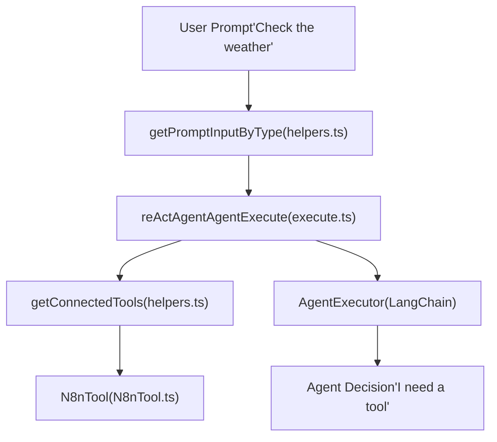

# AI 代理与工具执行 (AI Agent and Tool Execution)

相关源文件

-   [packages/@n8n/nodes-langchain/nodes/agents/Agent/Agent.node.ts](https://github.com/n8n-io/n8n/blob/88f170b9/packages/@n8n/nodes-langchain/nodes/agents/Agent/Agent.node.ts)
-   [packages/@n8n/nodes-langchain/nodes/agents/Agent/agents/ConversationalAgent/description.ts](https://github.com/n8n-io/n8n/blob/88f170b9/packages/@n8n/nodes-langchain/nodes/agents/Agent/agents/ConversationalAgent/description.ts)
-   [packages/@n8n/nodes-langchain/nodes/agents/Agent/agents/ConversationalAgent/execute.ts](https://github.com/n8n-io/n8n/blob/88f170b9/packages/@n8n/nodes-langchain/nodes/agents/Agent/agents/ConversationalAgent/execute.ts)
-   [packages/@n8n/nodes-langchain/nodes/agents/Agent/agents/OpenAiFunctionsAgent/description.ts](https://github.com/n8n-io/n8n/blob/88f170b9/packages/@n8n/nodes-langchain/nodes/agents/Agent/agents/OpenAiFunctionsAgent/description.ts)
-   [packages/@n8n/nodes-langchain/nodes/agents/Agent/agents/OpenAiFunctionsAgent/execute.ts](https://github.com/n8n-io/n8n/blob/88f170b9/packages/@n8n/nodes-langchain/nodes/agents/Agent/agents/OpenAiFunctionsAgent/execute.ts)
-   [packages/@n8n/nodes-langchain/nodes/agents/Agent/agents/PlanAndExecuteAgent/execute.ts](https://github.com/n8n-io/n8n/blob/88f170b9/packages/@n8n/nodes-langchain/nodes/agents/Agent/agents/PlanAndExecuteAgent/execute.ts)
-   [packages/@n8n/nodes-langchain/nodes/agents/Agent/agents/ReActAgent/description.ts](https://github.com/n8n-io/n8n/blob/88f170b9/packages/@n8n/nodes-langchain/nodes/agents/Agent/agents/ReActAgent/description.ts)
-   [packages/@n8n/nodes-langchain/nodes/agents/Agent/agents/ReActAgent/execute.ts](https://github.com/n8n-io/n8n/blob/88f170b9/packages/@n8n/nodes-langchain/nodes/agents/Agent/agents/ReActAgent/execute.ts)
-   [packages/@n8n/nodes-langchain/nodes/agents/Agent/agents/SqlAgent/execute.ts](https://github.com/n8n-io/n8n/blob/88f170b9/packages/@n8n/nodes-langchain/nodes/agents/Agent/agents/SqlAgent/execute.ts)
-   [packages/@n8n/nodes-langchain/nodes/agents/OpenAiAssistant/OpenAiAssistant.node.ts](https://github.com/n8n-io/n8n/blob/88f170b9/packages/@n8n/nodes-langchain/nodes/agents/OpenAiAssistant/OpenAiAssistant.node.ts)
-   [packages/@n8n/nodes-langchain/nodes/chains/ChainLLM/ChainLlm.node.ts](https://github.com/n8n-io/n8n/blob/88f170b9/packages/@n8n/nodes-langchain/nodes/chains/ChainLLM/ChainLlm.node.ts)
-   [packages/@n8n/nodes-langchain/nodes/chains/ChainLLM/methods/config.ts](https://github.com/n8n-io/n8n/blob/88f170b9/packages/@n8n/nodes-langchain/nodes/chains/ChainLLM/methods/config.ts)
-   [packages/@n8n/nodes-langchain/nodes/chains/ChainLLM/methods/types.ts](https://github.com/n8n-io/n8n/blob/88f170b9/packages/@n8n/nodes-langchain/nodes/chains/ChainLLM/methods/types.ts)
-   [packages/@n8n/nodes-langchain/nodes/chains/ChainLLM/test/ChainLlm.node.test.ts](https://github.com/n8n-io/n8n/blob/88f170b9/packages/@n8n/nodes-langchain/nodes/chains/ChainLLM/test/ChainLlm.node.test.ts)
-   [packages/@n8n/nodes-langchain/nodes/chains/ChainLLM/test/config.test.ts](https://github.com/n8n-io/n8n/blob/88f170b9/packages/@n8n/nodes-langchain/nodes/chains/ChainLLM/test/config.test.ts)
-   [packages/@n8n/nodes-langchain/nodes/chains/ChainRetrievalQA/ChainRetrievalQa.node.ts](https://github.com/n8n-io/n8n/blob/88f170b9/packages/@n8n/nodes-langchain/nodes/chains/ChainRetrievalQA/ChainRetrievalQa.node.ts)
-   [packages/@n8n/nodes-langchain/nodes/chains/ChainRetrievalQA/test/ChainRetrievalQa.node.test.ts](https://github.com/n8n-io/n8n/blob/88f170b9/packages/@n8n/nodes-langchain/nodes/chains/ChainRetrievalQA/test/ChainRetrievalQa.node.test.ts)
-   [packages/@n8n/nodes-langchain/nodes/chains/ChainSummarization/V2/ChainSummarizationV2.node.ts](https://github.com/n8n-io/n8n/blob/88f170b9/packages/@n8n/nodes-langchain/nodes/chains/ChainSummarization/V2/ChainSummarizationV2.node.ts)
-   [packages/@n8n/nodes-langchain/nodes/chains/InformationExtractor/InformationExtractor.node.ts](https://github.com/n8n-io/n8n/blob/88f170b9/packages/@n8n/nodes-langchain/nodes/chains/InformationExtractor/InformationExtractor.node.ts)
-   [packages/@n8n/nodes-langchain/nodes/chains/InformationExtractor/processItem.ts](https://github.com/n8n-io/n8n/blob/88f170b9/packages/@n8n/nodes-langchain/nodes/chains/InformationExtractor/processItem.ts)
-   [packages/@n8n/nodes-langchain/nodes/chains/InformationExtractor/test/InformationExtraction.node.test.ts](https://github.com/n8n-io/n8n/blob/88f170b9/packages/@n8n/nodes-langchain/nodes/chains/InformationExtractor/test/InformationExtraction.node.test.ts)
-   [packages/@n8n/nodes-langchain/nodes/chains/InformationExtractor/test/processItem.test.ts](https://github.com/n8n-io/n8n/blob/88f170b9/packages/@n8n/nodes-langchain/nodes/chains/InformationExtractor/test/processItem.test.ts)
-   [packages/@n8n/nodes-langchain/nodes/chains/SentimentAnalysis/SentimentAnalysis.node.ts](https://github.com/n8n-io/n8n/blob/88f170b9/packages/@n8n/nodes-langchain/nodes/chains/SentimentAnalysis/SentimentAnalysis.node.ts)
-   [packages/@n8n/nodes-langchain/nodes/chains/TextClassifier/TextClassifier.node.ts](https://github.com/n8n-io/n8n/blob/88f170b9/packages/@n8n/nodes-langchain/nodes/chains/TextClassifier/TextClassifier.node.ts)
-   [packages/@n8n/nodes-langchain/nodes/chains/TextClassifier/processItem.ts](https://github.com/n8n-io/n8n/blob/88f170b9/packages/@n8n/nodes-langchain/nodes/chains/TextClassifier/processItem.ts)
-   [packages/@n8n/nodes-langchain/nodes/chains/TextClassifier/test/TextClassifier.node.test.ts](https://github.com/n8n-io/n8n/blob/88f170b9/packages/@n8n/nodes-langchain/nodes/chains/TextClassifier/test/TextClassifier.node.test.ts)
-   [packages/@n8n/nodes-langchain/nodes/chains/TextClassifier/test/processItem.test.ts](https://github.com/n8n-io/n8n/blob/88f170b9/packages/@n8n/nodes-langchain/nodes/chains/TextClassifier/test/processItem.test.ts)
-   [packages/@n8n/nodes-langchain/nodes/output\_parser/OutputParserStructured/OutputParserStructured.node.ts](https://github.com/n8n-io/n8n/blob/88f170b9/packages/@n8n/nodes-langchain/nodes/output_parser/OutputParserStructured/OutputParserStructured.node.ts)
-   [packages/@n8n/nodes-langchain/utils/descriptions.ts](https://github.com/n8n-io/n8n/blob/88f170b9/packages/@n8n/nodes-langchain/utils/descriptions.ts)
-   [packages/@n8n/nodes-langchain/utils/helpers.ts](https://github.com/n8n-io/n8n/blob/88f170b9/packages/@n8n/nodes-langchain/utils/helpers.ts)
-   [packages/@n8n/nodes-langchain/utils/schemaParsing.ts](https://github.com/n8n-io/n8n/blob/88f170b9/packages/@n8n/nodes-langchain/utils/schemaParsing.ts)
-   [packages/@n8n/nodes-langchain/utils/tests/helpers.test.ts](https://github.com/n8n-io/n8n/blob/88f170b9/packages/@n8n/nodes-langchain/utils/tests/helpers.test.ts)

本文档说明 n8n 的 AI 代理节点如何执行，包括工具调用、记忆集成、结构化输出解析以及运行时执行流程。它涵盖了各种代理类型（ReAct、Conversational、SQL）的实现，以及它们如何将自然语言提示词桥接到代码级工具执行。

---

## 概览 (Overview)

n8n 中的 AI 代理系统建立在 LangChain 和 n8n 自定义逻辑之上。代理节点（主要是 `Agent.node.ts`）充当“Root Nodes”，协调多个子节点：

-   **语言模型**：通过 `AiLanguageModel` 连接，以提供推理能力。
-   **工具**：通过 `AiTool` 连接，以提供外部能力。
-   **记忆**：通过 `AiMemory` 连接，以维护对话状态。
-   **输出解析器**：通过 `AiOutputParser` 连接，以结构化响应。

**来源：** [\`packages/@n8n/nodes-langchain/nodes/agents/Agent/Agent.node.ts8-78](https://github.com/n8n-io/n8n/blob/88f170b9/`packages/@n8n/nodes-langchain/nodes/agents/Agent/Agent.node.ts#L8-L78) [\`packages/@n8n/nodes-langchain/utils/helpers.ts154-198](https://github.com/n8n-io/n8n/blob/88f170b9/`packages/@n8n/nodes-langchain/utils/helpers.ts#L154-L198)

---

## 代理执行架构 (Agent Execution Architecture)

### 节点实现与版本 (Node Implementation and Versions)

AI Agent 节点是一个版本化节点。截至 3.1 版本，它支持多种代理类型，包括 Tools Agent、ReAct 和 Conversational。

| 类 / 函数 | 文件路径 | 角色 |
| --- | --- | --- |
| `Agent` | `Agent.node.ts` | 版本化 AI Agent 节点的主入口。 |
| `reActAgentAgentExecute` | `ReActAgent/execute.ts` | 实现 ReAct（Reasoning and Acting）逻辑。 |
| `conversationalAgentExecute` | `ConversationalAgent/execute.ts` | 实现具备记忆感知能力的对话代理。 |
| `sqlAgentAgentExecute` | `SqlAgent/execute.ts` | 用于 SQL 数据库交互的专用代理。 |

**来源：** [\`packages/@n8n/nodes-langchain/nodes/agents/Agent/Agent.node.ts56-74](https://github.com/n8n-io/n8n/blob/88f170b9/`packages/@n8n/nodes-langchain/nodes/agents/Agent/Agent.node.ts#L56-L74) [\`packages/@n8n/nodes-langchain/nodes/agents/Agent/agents/ReActAgent/execute.ts20-130](https://github.com/n8n-io/n8n/blob/88f170b9/`packages/@n8n/nodes-langchain/nodes/agents/Agent/agents/ReActAgent/execute.ts#L20-L130)

### 自然语言到代码实体映射 (Natural Language to Code Entity Mapping)

下图展示了高层级代理概念如何映射到代码库中的具体类和函数。

**来源：** [\`packages/@n8n/nodes-langchain/nodes/agents/Agent/agents/ReActAgent/execute.ts30-111](https://github.com/n8n-io/n8n/blob/88f170b9/`packages/@n8n/nodes-langchain/nodes/agents/Agent/agents/ReActAgent/execute.ts#L30-L111) [\`packages/@n8n/nodes-langchain/utils/helpers.ts17-50](https://github.com/n8n-io/n8n/blob/88f170b9/`packages/@n8n/nodes-langchain/utils/helpers.ts#L17-L50)

---

## 工具执行与集成 (Tool Execution and Integration)

### 工具发现与包装 (Tool Discovery and Wrapping)

n8n 中的工具要么是专用工具节点，要么是作为工具暴露的普通节点。`getConnectedTools` 辅助函数会从 `AiTool` 连接中检索这些工具。

1.  **输入获取**：使用 `ctx.getInputConnectionData(NodeConnectionTypes.AiTool, 0)`。
2.  **元数据注入**：为工具添加 `isFromToolkit` 和 `sourceNodeName` 标记。
3.  **归一化**：`normalizeToolSchema` 使用 `convertJsonSchemaToZod` 将 JSON schema 转换为 Zod schema，以确保与 LangChain 兼容。

**来源：** [\`packages/@n8n/nodes-langchain/utils/helpers.ts142-198](https://github.com/n8n-io/n8n/blob/88f170b9/`packages/@n8n/nodes-langchain/utils/helpers.ts#L142-L198) [\`packages/@n8n/nodes-langchain/utils/schemaParsing.ts1-50](https://github.com/n8n-io/n8n/blob/88f170b9/`packages/@n8n/nodes-langchain/utils/schemaParsing.ts#L1-L50)

### SQL Agent 执行流 (SQL Agent Execution Flow)

SQL Agent 是一个专门实现，它在确保安全性的同时将自然语言桥接到数据库查询。

> **[Mermaid sequence]**
> *(图表结构无法解析)*

**来源：** [\`packages/@n8n/nodes-langchain/nodes/agents/Agent/agents/SqlAgent/execute.ts55-208](https://github.com/n8n-io/n8n/blob/88f170b9/`packages/@n8n/nodes-langchain/nodes/agents/Agent/agents/SqlAgent/execute.ts#L55-L208) [\`packages/@n8n/nodes-langchain/nodes/agents/Agent/agents/SqlAgent/execute.ts31-53](https://github.com/n8n-io/n8n/blob/88f170b9/`packages/@n8n/nodes-langchain/nodes/agents/Agent/agents/SqlAgent/execute.ts#L31-L53)

---

## 记忆与上下文管理 (Memory and Context Management)

### 会话 ID 解析 (Session ID Resolution)

代理使用 `sessionId` 从记忆节点中检索聊天历史。`getSessionId` 辅助函数负责解析：

-   **自动模式**：尝试从 `chatInput`（Chat Trigger）或 `bodyData`（Webhooks）中提取 `sessionId`。
-   **手动模式**：使用用户定义的表达式或静态键。

**来源：** [\`packages/@n8n/nodes-langchain/utils/helpers.ts52-105](https://github.com/n8n-io/n8n/blob/88f170b9/`packages/@n8n/nodes-langchain/utils/helpers.ts#L52-L105)

### 聊天历史序列化 (Chat History Serialization)

在将历史发送给 LLM 之前，`serializeChatHistory` 函数会把 LangChain 的 `BaseMessage` 对象转换为字符串格式：

-   `HumanMessage` → `Human: ...`
-   `AIMessage` → `Assistant: ...`

**来源：** [\`packages/@n8n/nodes-langchain/utils/helpers.ts107-119](https://github.com/n8n-io/n8n/blob/88f170b9/`packages/@n8n/nodes-langchain/utils/helpers.ts#L107-L119)

---

## 结构化输出与数据提取 (Structured Output and Data Extraction)

### 结构化输出解析器 (Structured Output Parser)

`OutputParserStructured` 节点允许代理或链以特定的 JSON 格式返回数据。它支持：

-   **Schema 生成**：`generateSchemaFromExample` 会根据 JSON 片段创建 Zod schema。
-   **自动修复**：如果 LLM 返回无效的 JSON，`N8nOutputFixingParser` 会触发第二次 LLM 调用来修复格式。

**来源：** [\`packages/@n8n/nodes-langchain/nodes/output_parser/OutputParserStructured/OutputParserStructured.node.ts196-255](https://github.com/n8n-io/n8n/blob/88f170b9/`packages/@n8n/nodes-langchain/nodes/output_parser/OutputParserStructured/OutputParserStructured.node.ts#L196-L255) [\`packages/@n8n/nodes-langchain/utils/output\_parsers/N8nOutputParser.ts1-100](https://github.com/n8n-io/n8n/blob/88f170b9/`packages/@n8n/nodes-langchain/utils/output_parsers/N8nOutputParser.ts#L1-L100)

### 链式执行模式 (Chain Execution Patterns)

除代理外，n8n 还提供遵循固定执行模式的专用链：

| 链类型 | 节点类 | 主要用途 |
| --- | --- | --- |
| **基础 LLM** | `ChainLlm` | 带批处理支持的简单提示-响应。 |
| **检索式 QA** | `ChainRetrievalQa` | 使用检索到的文档上下文回答问题。 |
| **文本分类器** | `TextClassifier` | 将文本分类到用户定义的分支。 |
| **摘要** | `ChainSummarizationV2` | 实现 Map-Reduce、Refine 或 Stuff 方法。 |

**来源：** [\`packages/@n8n/nodes-langchain/nodes/chains/ChainLLM/ChainLlm.node.ts23-168](https://github.com/n8n-io/n8n/blob/88f170b9/`packages/@n8n/nodes-langchain/nodes/chains/ChainLLM/ChainLlm.node.ts#L23-L168) [\`packages/@n8n/nodes-langchain/nodes/chains/ChainRetrievalQA/ChainRetrievalQa.node.ts20-250](https://github.com/n8n-io/n8n/blob/88f170b9/`packages/@n8n/nodes-langchain/nodes/chains/ChainRetrievalQA/ChainRetrievalQa.node.ts#L20-L250) [\`packages/@n8n/nodes-langchain/nodes/chains/TextClassifier/TextClassifier.node.ts31-236](https://github.com/n8n-io/n8n/blob/88f170b9/`packages/@n8n/nodes-langchain/nodes/chains/TextClassifier/TextClassifier.node.ts#L31-L236)

---

## 关键实用工具摘要 (Summary of Key Utilities)

| 函数 | 作用 |
| --- | --- |
| `getPromptInputByType` | 标准化节点获取“User Message”（Auto 与 Define）的方式。 |
| `getConnectedTools` | 处理从 `AiTool` 端口获取并命名工具的复杂性。 |
| `convertJsonSchemaToZod` | 将标准 JSON Schema 定义桥接到 Zod，以实现与 LangChain 的兼容性。 |
| `escapeSingleCurlyBrackets` | 防止 n8n 的表达式引擎对本应留给 LLM 的括号进行求值。 |

**来源：** [\`packages/@n8n/nodes-langchain/utils/helpers.ts17-50](https://github.com/n8n-io/n8n/blob/88f170b9/`packages/@n8n/nodes-langchain/utils/helpers.ts#L17-L50) [\`packages/@n8n/nodes-langchain/utils/helpers.ts121-137](https://github.com/n8n-io/n8n/blob/88f170b9/`packages/@n8n/nodes-langchain/utils/helpers.ts#L121-L137) [\`packages/@n8n/nodes-langchain/utils/schemaParsing.ts1-50](https://github.com/n8n-io/n8n/blob/88f170b9/`packages/@n8n/nodes-langchain/utils/schemaParsing.ts#L1-L50)
