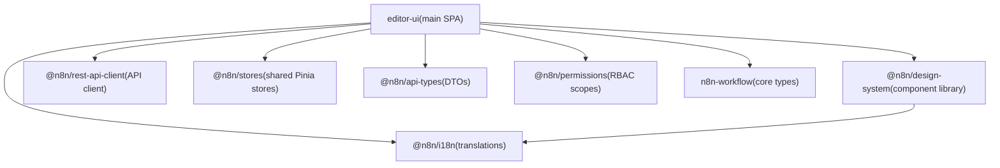
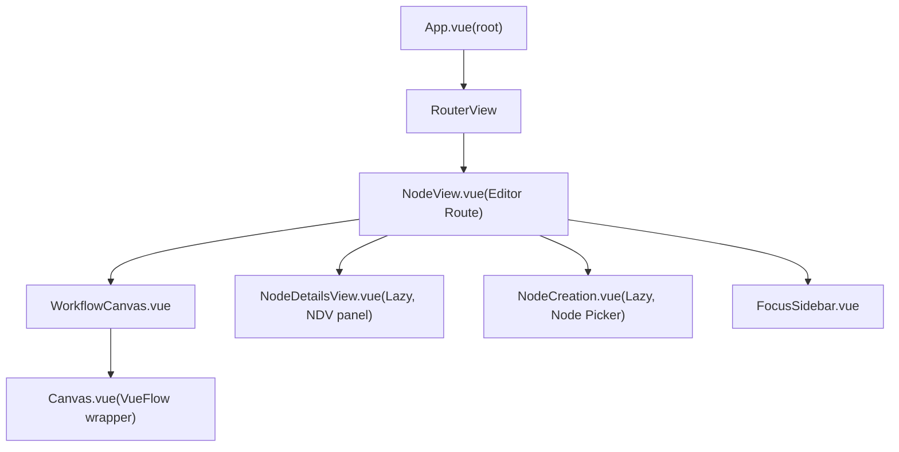
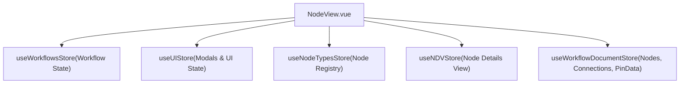

# 用户界面

相关源文件

-   [packages/frontend/@n8n/design-system/src/components/N8nActionToggle/ActionToggle.vue](https://github.com/n8n-io/n8n/blob/88f170b9/packages/frontend/@n8n/design-system/src/components/N8nActionToggle/ActionToggle.vue)
-   [packages/frontend/@n8n/design-system/src/components/N8nBreadcrumbs/Breadcrumbs.vue](https://github.com/n8n-io/n8n/blob/88f170b9/packages/frontend/@n8n/design-system/src/components/N8nBreadcrumbs/Breadcrumbs.vue)
-   [packages/frontend/@n8n/design-system/src/components/N8nBreadcrumbs/__snapshots__/BreadCrumbs.test.ts.snap](https://github.com/n8n-io/n8n/blob/88f170b9/packages/frontend/@n8n/design-system/src/components/N8nBreadcrumbs/__snapshots__/BreadCrumbs.test.ts.snap)
-   [packages/frontend/@n8n/design-system/src/components/N8nIcon/icons.ts](https://github.com/n8n-io/n8n/blob/88f170b9/packages/frontend/@n8n/design-system/src/components/N8nIcon/icons.ts)
-   [packages/frontend/@n8n/design-system/src/components/N8nUserStack/UserStack.vue](https://github.com/n8n-io/n8n/blob/88f170b9/packages/frontend/@n8n/design-system/src/components/N8nUserStack/UserStack.vue)
-   [packages/frontend/@n8n/design-system/src/composables/useParentScroll.ts](https://github.com/n8n-io/n8n/blob/88f170b9/packages/frontend/@n8n/design-system/src/composables/useParentScroll.ts)
-   [packages/frontend/@n8n/i18n/src/locales/en.json](https://github.com/n8n-io/n8n/blob/88f170b9/packages/frontend/@n8n/i18n/src/locales/en.json)
-   [packages/frontend/@n8n/rest-api-client/src/api/index.ts](https://github.com/n8n-io/n8n/blob/88f170b9/packages/frontend/@n8n/rest-api-client/src/api/index.ts)
-   [packages/frontend/editor-ui/MIGRATION_RECIPE.md](https://github.com/n8n-io/n8n/blob/88f170b9/packages/frontend/editor-ui/MIGRATION_RECIPE.md?plain=1)
-   [packages/frontend/editor-ui/eslint.config.mjs](https://github.com/n8n-io/n8n/blob/88f170b9/packages/frontend/editor-ui/eslint.config.mjs)
-   [packages/frontend/editor-ui/src/Interface.ts](https://github.com/n8n-io/n8n/blob/88f170b9/packages/frontend/editor-ui/src/Interface.ts)
-   [packages/frontend/editor-ui/src/app/components/MainHeader/MainHeader.vue](https://github.com/n8n-io/n8n/blob/88f170b9/packages/frontend/editor-ui/src/app/components/MainHeader/MainHeader.vue)
-   [packages/frontend/editor-ui/src/app/components/MainHeader/WorkflowDetails.vue](https://github.com/n8n-io/n8n/blob/88f170b9/packages/frontend/editor-ui/src/app/components/MainHeader/WorkflowDetails.vue)
-   [packages/frontend/editor-ui/src/app/composables/__snapshots__/useCanvasOperations.test.ts.snap](https://github.com/n8n-io/n8n/blob/88f170b9/packages/frontend/editor-ui/src/app/composables/__snapshots__/useCanvasOperations.test.ts.snap)
-   [packages/frontend/editor-ui/src/app/composables/useCanvasOperations.test.ts](https://github.com/n8n-io/n8n/blob/88f170b9/packages/frontend/editor-ui/src/app/composables/useCanvasOperations.test.ts)
-   [packages/frontend/editor-ui/src/app/composables/useCanvasOperations.ts](https://github.com/n8n-io/n8n/blob/88f170b9/packages/frontend/editor-ui/src/app/composables/useCanvasOperations.ts)
-   [packages/frontend/editor-ui/src/app/composables/useWorkflowActivate.ts](https://github.com/n8n-io/n8n/blob/88f170b9/packages/frontend/editor-ui/src/app/composables/useWorkflowActivate.ts)
-   [packages/frontend/editor-ui/src/app/composables/useWorkflowExtraction.ts](https://github.com/n8n-io/n8n/blob/88f170b9/packages/frontend/editor-ui/src/app/composables/useWorkflowExtraction.ts)
-   [packages/frontend/editor-ui/src/app/composables/useWorkflowHelpers.test.ts](https://github.com/n8n-io/n8n/blob/88f170b9/packages/frontend/editor-ui/src/app/composables/useWorkflowHelpers.test.ts)
-   [packages/frontend/editor-ui/src/app/composables/useWorkflowHelpers.ts](https://github.com/n8n-io/n8n/blob/88f170b9/packages/frontend/editor-ui/src/app/composables/useWorkflowHelpers.ts)
-   [packages/frontend/editor-ui/src/app/composables/useWorkflowSaving.test.ts](https://github.com/n8n-io/n8n/blob/88f170b9/packages/frontend/editor-ui/src/app/composables/useWorkflowSaving.test.ts)
-   [packages/frontend/editor-ui/src/app/composables/useWorkflowSaving.ts](https://github.com/n8n-io/n8n/blob/88f170b9/packages/frontend/editor-ui/src/app/composables/useWorkflowSaving.ts)
-   [packages/frontend/editor-ui/src/app/composables/useWorkflowState.ts](https://github.com/n8n-io/n8n/blob/88f170b9/packages/frontend/editor-ui/src/app/composables/useWorkflowState.ts)
-   [packages/frontend/editor-ui/src/app/composables/useWorkflowUpdate.test.ts](https://github.com/n8n-io/n8n/blob/88f170b9/packages/frontend/editor-ui/src/app/composables/useWorkflowUpdate.test.ts)
-   [packages/frontend/editor-ui/src/app/composables/useWorkflowUpdate.ts](https://github.com/n8n-io/n8n/blob/88f170b9/packages/frontend/editor-ui/src/app/composables/useWorkflowUpdate.ts)
-   [packages/frontend/editor-ui/src/app/layouts/WorkflowLayout.vue](https://github.com/n8n-io/n8n/blob/88f170b9/packages/frontend/editor-ui/src/app/layouts/WorkflowLayout.vue)
-   [packages/frontend/editor-ui/src/app/stores/npsSurvey.store.ts](https://github.com/n8n-io/n8n/blob/88f170b9/packages/frontend/editor-ui/src/app/stores/npsSurvey.store.ts)
-   [packages/frontend/editor-ui/src/app/stores/workflowDocument.store.test.ts](https://github.com/n8n-io/n8n/blob/88f170b9/packages/frontend/editor-ui/src/app/stores/workflowDocument.store.test.ts)
-   [packages/frontend/editor-ui/src/app/stores/workflowDocument.store.ts](https://github.com/n8n-io/n8n/blob/88f170b9/packages/frontend/editor-ui/src/app/stores/workflowDocument.store.ts)
-   [packages/frontend/editor-ui/src/app/stores/workflowDocument/useWorkflowDocumentConnections.test.ts](https://github.com/n8n-io/n8n/blob/88f170b9/packages/frontend/editor-ui/src/app/stores/workflowDocument/useWorkflowDocumentConnections.test.ts)
-   [packages/frontend/editor-ui/src/app/stores/workflowDocument/useWorkflowDocumentConnections.ts](https://github.com/n8n-io/n8n/blob/88f170b9/packages/frontend/editor-ui/src/app/stores/workflowDocument/useWorkflowDocumentConnections.ts)
-   [packages/frontend/editor-ui/src/app/stores/workflowDocument/useWorkflowDocumentNodes.test.ts](https://github.com/n8n-io/n8n/blob/88f170b9/packages/frontend/editor-ui/src/app/stores/workflowDocument/useWorkflowDocumentNodes.test.ts)
-   [packages/frontend/editor-ui/src/app/stores/workflowDocument/useWorkflowDocumentNodes.ts](https://github.com/n8n-io/n8n/blob/88f170b9/packages/frontend/editor-ui/src/app/stores/workflowDocument/useWorkflowDocumentNodes.ts)
-   [packages/frontend/editor-ui/src/app/stores/workflowSave.store.ts](https://github.com/n8n-io/n8n/blob/88f170b9/packages/frontend/editor-ui/src/app/stores/workflowSave.store.ts)
-   [packages/frontend/editor-ui/src/app/stores/workflows.store.test.ts](https://github.com/n8n-io/n8n/blob/88f170b9/packages/frontend/editor-ui/src/app/stores/workflows.store.test.ts)
-   [packages/frontend/editor-ui/src/app/stores/workflows.store.ts](https://github.com/n8n-io/n8n/blob/88f170b9/packages/frontend/editor-ui/src/app/stores/workflows.store.ts)
-   [packages/frontend/editor-ui/src/app/utils/nodeViewUtils.test.ts](https://github.com/n8n-io/n8n/blob/88f170b9/packages/frontend/editor-ui/src/app/utils/nodeViewUtils.test.ts)
-   [packages/frontend/editor-ui/src/app/utils/nodeViewUtils.ts](https://github.com/n8n-io/n8n/blob/88f170b9/packages/frontend/editor-ui/src/app/utils/nodeViewUtils.ts)
-   [packages/frontend/editor-ui/src/app/views/NodeView.vue](https://github.com/n8n-io/n8n/blob/88f170b9/packages/frontend/editor-ui/src/app/views/NodeView.vue)
-   [packages/frontend/editor-ui/src/features/core/folders/components/FolderCard.vue](https://github.com/n8n-io/n8n/blob/88f170b9/packages/frontend/editor-ui/src/features/core/folders/components/FolderCard.vue)
-   [packages/frontend/editor-ui/src/features/execution/executions/components/workflow/WorkflowExecutionsInfoAccordion.vue](https://github.com/n8n-io/n8n/blob/88f170b9/packages/frontend/editor-ui/src/features/execution/executions/components/workflow/WorkflowExecutionsInfoAccordion.vue)
-   [packages/frontend/editor-ui/src/features/workflows/canvas/canvas.types.ts](https://github.com/n8n-io/n8n/blob/88f170b9/packages/frontend/editor-ui/src/features/workflows/canvas/canvas.types.ts)
-   [packages/frontend/editor-ui/src/features/workflows/canvas/components/Canvas.vue](https://github.com/n8n-io/n8n/blob/88f170b9/packages/frontend/editor-ui/src/features/workflows/canvas/components/Canvas.vue)
-   [packages/frontend/editor-ui/src/features/workflows/canvas/components/elements/nodes/CanvasNode.vue](https://github.com/n8n-io/n8n/blob/88f170b9/packages/frontend/editor-ui/src/features/workflows/canvas/components/elements/nodes/CanvasNode.vue)
-   [packages/frontend/editor-ui/src/features/workflows/canvas/components/elements/nodes/CanvasNodeToolbar.vue](https://github.com/n8n-io/n8n/blob/88f170b9/packages/frontend/editor-ui/src/features/workflows/canvas/components/elements/nodes/CanvasNodeToolbar.vue)
-   [packages/frontend/editor-ui/src/features/workflows/canvas/components/elements/nodes/render-types/CanvasNodeDefault.vue](https://github.com/n8n-io/n8n/blob/88f170b9/packages/frontend/editor-ui/src/features/workflows/canvas/components/elements/nodes/render-types/CanvasNodeDefault.vue)
-   [packages/frontend/editor-ui/src/features/workflows/canvas/composables/useCanvasMapping.test.ts](https://github.com/n8n-io/n8n/blob/88f170b9/packages/frontend/editor-ui/src/features/workflows/canvas/composables/useCanvasMapping.test.ts)
-   [packages/frontend/editor-ui/src/features/workflows/canvas/composables/useCanvasMapping.ts](https://github.com/n8n-io/n8n/blob/88f170b9/packages/frontend/editor-ui/src/features/workflows/canvas/composables/useCanvasMapping.ts)
-   [packages/frontend/editor-ui/src/features/workflows/workflowHistory/components/WorkflowHistoryButton.test.ts](https://github.com/n8n-io/n8n/blob/88f170b9/packages/frontend/editor-ui/src/features/workflows/workflowHistory/components/WorkflowHistoryButton.test.ts)
-   [packages/frontend/editor-ui/src/features/workflows/workflowHistory/components/WorkflowHistoryButton.vue](https://github.com/n8n-io/n8n/blob/88f170b9/packages/frontend/editor-ui/src/features/workflows/workflowHistory/components/WorkflowHistoryButton.vue)
-   [packages/nodes-base/credentials/SalesforceJwtApi.credentials.ts](https://github.com/n8n-io/n8n/blob/88f170b9/packages/nodes-base/credentials/SalesforceJwtApi.credentials.ts)
-   [packages/testing/playwright/services/role-api-helper.ts](https://github.com/n8n-io/n8n/blob/88f170b9/packages/testing/playwright/services/role-api-helper.ts)
-   [packages/testing/playwright/tests/e2e/regression/PAY-4367-node-shifting-cyclic.spec.ts](https://github.com/n8n-io/n8n/blob/88f170b9/packages/testing/playwright/tests/e2e/regression/PAY-4367-node-shifting-cyclic.spec.ts)
-   [packages/testing/playwright/tests/e2e/workflows/editor/canvas/actions.spec.ts](https://github.com/n8n-io/n8n/blob/88f170b9/packages/testing/playwright/tests/e2e/workflows/editor/canvas/actions.spec.ts)
-   [packages/testing/playwright/workflows/Bug_node_insertions_between_stickies.json](https://github.com/n8n-io/n8n/blob/88f170b9/packages/testing/playwright/workflows/Bug_node_insertions_between_stickies.json)
-   [packages/testing/playwright/workflows/Bug_node_insertions_sticky.json](https://github.com/n8n-io/n8n/blob/88f170b9/packages/testing/playwright/workflows/Bug_node_insertions_sticky.json)
-   [packages/testing/playwright/workflows/Cyclic_workflow_for_insertion_test.json](https://github.com/n8n-io/n8n/blob/88f170b9/packages/testing/playwright/workflows/Cyclic_workflow_for_insertion_test.json)

本页提供 n8n 前端应用的架构概览。它涵盖包结构、插件注册、组件层次结构、状态管理以及主要 UI 子系统。各子系统的详细说明见子页面：

-   有关路由、Pinia store 架构以及推送连接，请参见 [前端架构与状态管理](/n8n-io/n8n/6.1-frontend-architecture-and-state-management)。
-   有关工作流画布和节点交互，请参见 [工作流画布与节点管理](/n8n-io/n8n/6.2-workflow-canvas-and-node-management)。
-   有关参数编辑器和表达式编辑器，请参见 [参数输入与表达式编辑器](/n8n-io/n8n/6.3-parameter-input-and-expression-editor)。
-   有关设计系统组件库，请参见 [设计系统与可复用组件](/n8n-io/n8n/6.4-design-system-and-reusable-components)。
-   有关 i18n 包和翻译键，请参见 [国际化与本地化](/n8n-io/n8n/6.5-internationalization-and-localization)。
-   有关 AI 工作流构建器和 Chat Hub 用户界面，请参见 [AI 工作流构建器](/n8n-io/n8n/5.1-ai-workflow-builder)、[Chat Hub 前端与用户界面](/n8n-io/n8n/5.3-chat-hub-frontend-and-user-interface)。

---

## 技术栈

前端是一个由 n8n 后端以静态构建包形式提供的 Vue 3 单页应用（SPA）。

| 技术 | 作用 |
| --- | --- |
| Vue 3 (Composition API) | 组件框架 [packages/frontend/editor-ui/src/app/views/NodeView.vue1-13](https://github.com/n8n-io/n8n/blob/88f170b9/packages/frontend/editor-ui/src/app/views/NodeView.vue#L1-L13) |
| Pinia | 状态管理 [packages/frontend/editor-ui/src/app/stores/workflows.store.ts27](https://github.com/n8n-io/n8n/blob/88f170b9/packages/frontend/editor-ui/src/app/stores/workflows.store.ts#L27-L27) |
| Vue Router | 客户端路由 [packages/frontend/editor-ui/src/app/views/NodeView.vue14](https://github.com/n8n-io/n8n/blob/88f170b9/packages/frontend/editor-ui/src/app/views/NodeView.vue#L14-L14) |
| Vue Flow (`@vue-flow/core`) | 有向图画布 [packages/frontend/editor-ui/src/app/views/NodeView.vue37-41](https://github.com/n8n-io/n8n/blob/88f170b9/packages/frontend/editor-ui/src/app/views/NodeView.vue#L37-L41) |
| Element Plus | 基础 UI 原语 [packages/frontend/editor-ui/src/Interface.ts1](https://github.com/n8n-io/n8n/blob/88f170b9/packages/frontend/editor-ui/src/Interface.ts#L1-L1) |
| CodeMirror 6 | 代码和表达式编辑器 [packages/frontend/@n8n/i18n/src/locales/en.json4-14](https://github.com/n8n-io/n8n/blob/88f170b9/packages/frontend/@n8n/i18n/src/locales/en.json#L4-L14) |

---

## 包结构

**图：前端包依赖关系**

来源: [packages/frontend/editor-ui/src/Interface.ts2-67](https://github.com/n8n-io/n8n/blob/88f170b9/packages/frontend/editor-ui/src/Interface.ts#L2-L67) [packages/frontend/editor-ui/src/app/stores/workflows.store.ts1-55](https://github.com/n8n-io/n8n/blob/88f170b9/packages/frontend/editor-ui/src/app/stores/workflows.store.ts#L1-L55)

---

## 高层组件层次结构

工作流编辑器的主要入口是 `NodeView.vue`，它负责协调画布、侧边栏以及按需加载的详情视图。

**图：核心组件树**

来源: [packages/frontend/editor-ui/src/app/views/NodeView.vue15-16](https://github.com/n8n-io/n8n/blob/88f170b9/packages/frontend/editor-ui/src/app/views/NodeView.vue#L15-L16) [packages/frontend/editor-ui/src/app/views/NodeView.vue146-155](https://github.com/n8n-io/n8n/blob/88f170b9/packages/frontend/editor-ui/src/app/views/NodeView.vue#L146-L155)

---

## 主要 UI 子系统

### 1\. 工作流画布与操作

画布集成使用 `@vue-flow/core` 进行图形渲染。添加、移动和连接节点等操作被抽象到组合式函数中，以保持视图层简洁。

-   **`useCanvasOperations.ts`**：集中处理 `AddNodeCommand`、`MoveNodeCommand` 和 `AddConnectionCommand` 的逻辑 [packages/frontend/editor-ui/src/app/composables/useCanvasOperations.ts39-46](https://github.com/n8n-io/n8n/blob/88f170b9/packages/frontend/editor-ui/src/app/composables/useCanvasOperations.ts#L39-L46)
-   **`CanvasNodeRenderType`**：定义不同节点类型（Default、Sticky、AI）在画布上的显示方式 [packages/frontend/editor-ui/src/app/views/NodeView.vue50-51](https://github.com/n8n-io/n8n/blob/88f170b9/packages/frontend/editor-ui/src/app/views/NodeView.vue#L50-L51)

来源: [packages/frontend/editor-ui/src/app/composables/useCanvasOperations.ts173-195](https://github.com/n8n-io/n8n/blob/88f170b9/packages/frontend/editor-ui/src/app/composables/useCanvasOperations.ts#L173-L195) [packages/frontend/editor-ui/src/app/views/NodeView.vue113-117](https://github.com/n8n-io/n8n/blob/88f170b9/packages/frontend/editor-ui/src/app/views/NodeView.vue#L113-L117)

### 2\. 状态管理（Pinia）

应用状态被高度模块化到各个 Pinia store 中。`useWorkflowsStore` 管理当前工作流的节点、连接和执行结果 [packages/frontend/editor-ui/src/app/stores/workflows.store.ts118-150](https://github.com/n8n-io/n8n/blob/88f170b9/packages/frontend/editor-ui/src/app/stores/workflows.store.ts#L118-L150)

**图：NodeView 的 Store 依赖关系**

来源: [packages/frontend/editor-ui/src/app/views/NodeView.vue17-22](https://github.com/n8n-io/n8n/blob/88f170b9/packages/frontend/editor-ui/src/app/views/NodeView.vue#L17-L22) [packages/frontend/editor-ui/src/app/stores/workflowDocument.store.ts59-122](https://github.com/n8n-io/n8n/blob/88f170b9/packages/frontend/editor-ui/src/app/stores/workflowDocument.store.ts#L59-L122)

### 3\. 工作流保存与持久化

保存逻辑由 `useWorkflowSaving.ts` 处理，它负责管理自动保存状态、冲突检测以及未保存更改提示。它与 `workflowsListStore` 交互，以判断工作流是新建还是更新 [packages/frontend/editor-ui/src/app/composables/useWorkflowSaving.ts187-196](https://github.com/n8n-io/n8n/blob/88f170b9/packages/frontend/editor-ui/src/app/composables/useWorkflowSaving.ts#L187-L196)

来源: [packages/frontend/editor-ui/src/app/composables/useWorkflowSaving.ts108-120](https://github.com/n8n-io/n8n/blob/88f170b9/packages/frontend/editor-ui/src/app/composables/useWorkflowSaving.ts#L108-L120) [packages/frontend/editor-ui/src/app/stores/workflows.store.ts159-166](https://github.com/n8n-io/n8n/blob/88f170b9/packages/frontend/editor-ui/src/app/stores/workflows.store.ts#L159-L166)

### 4\. 国际化（i18n）

n8n 使用集中式翻译系统。`en.json` 文件包含超过 400,000 个字符的翻译键，涵盖通用 UI 文本、节点特定标签和错误消息 [packages/frontend/@n8n/i18n/src/locales/en.json1-100](https://github.com/n8n-io/n8n/blob/88f170b9/packages/frontend/@n8n/i18n/src/locales/en.json#L1-L100)

来源: [packages/frontend/@n8n/i18n/src/locales/en.json1-165](https://github.com/n8n-io/n8n/blob/88f170b9/packages/frontend/@n8n/i18n/src/locales/en.json#L1-L165)

### 5\. 设计系统与图标

该 UI 构建在一个封装了 Element Plus 并提供 n8n 专用组件的自定义设计系统之上。图标通过 `icons.ts` 中的集中注册表进行管理，将自定义 SVG（如 `node-play`、`node-dirty`）与 Lucide 图标集结合起来 [packages/frontend/@n8n/design-system/src/components/N8nIcon/icons.ts1-100](https://github.com/n8n-io/n8n/blob/88f170b9/packages/frontend/@n8n/design-system/src/components/N8nIcon/icons.ts#L1-L100)

来源: [packages/frontend/@n8n/design-system/src/components/N8nIcon/icons.ts1-37](https://github.com/n8n-io/n8n/blob/88f170b9/packages/frontend/@n8n/design-system/src/components/N8nIcon/icons.ts#L1-L37) [packages/frontend/editor-ui/src/app/views/NodeView.vue140](https://github.com/n8n-io/n8n/blob/88f170b9/packages/frontend/editor-ui/src/app/views/NodeView.vue#L140-L140)

---

## 子页面

| 页面 | 内容 |
| --- | --- |
| [前端架构与状态管理](/n8n-io/n8n/6.1-frontend-architecture-and-state-management) | Vue 3 + Vite 配置、Pinia store 架构、API 客户端层以及初始化顺序。 |
| [工作流画布与节点管理](/n8n-io/n8n/6.2-workflow-canvas-and-node-management) | Vue Flow 集成、画布操作、节点创建以及 CRDT 协作。 |
| [参数输入与表达式编辑器](/n8n-io/n8n/6.3-parameter-input-and-expression-editor) | 参数输入组件、CodeMirror 表达式编辑器以及 NDV 面板。 |
| [设计系统与可复用组件](/n8n-io/n8n/6.4-design-system-and-reusable-components) | `@n8n/design-system`、Element Plus 集成以及 CSS 令牌。 |
| [国际化与本地化](/n8n-io/n8n/6.5-internationalization-and-localization) | `vue-i18n` 集成、翻译文件结构以及复数形式规则。 |
