# 前端架构与状态管理

相关源文件

-   [packages/@n8n/api-types/src/dto/user/__tests__/users-list-filter.dto.test.ts](https://github.com/n8n-io/n8n/blob/88f170b9/packages/@n8n/api-types/src/dto/user/__tests__/users-list-filter.dto.test.ts)
-   [packages/@n8n/api-types/src/dto/user/users-list-filter.dto.ts](https://github.com/n8n-io/n8n/blob/88f170b9/packages/@n8n/api-types/src/dto/user/users-list-filter.dto.ts)
-   [packages/@n8n/api-types/src/push/heartbeat.ts](https://github.com/n8n-io/n8n/blob/88f170b9/packages/@n8n/api-types/src/push/heartbeat.ts)
-   [packages/@n8n/api-types/src/schemas/__tests__/user.schema.test.ts](https://github.com/n8n-io/n8n/blob/88f170b9/packages/@n8n/api-types/src/schemas/__tests__/user.schema.test.ts)
-   [packages/@n8n/api-types/src/schemas/user.schema.ts](https://github.com/n8n-io/n8n/blob/88f170b9/packages/@n8n/api-types/src/schemas/user.schema.ts)
-   [packages/@n8n/db/src/repositories/user.repository.ts](https://github.com/n8n-io/n8n/blob/88f170b9/packages/@n8n/db/src/repositories/user.repository.ts)
-   [packages/cli/src/collaboration/__tests__/collaboration.state.test.ts](https://github.com/n8n-io/n8n/blob/88f170b9/packages/cli/src/collaboration/__tests__/collaboration.state.test.ts)
-   [packages/cli/src/collaboration/collaboration.message.ts](https://github.com/n8n-io/n8n/blob/88f170b9/packages/cli/src/collaboration/collaboration.message.ts)
-   [packages/cli/src/collaboration/collaboration.service.ts](https://github.com/n8n-io/n8n/blob/88f170b9/packages/cli/src/collaboration/collaboration.service.ts)
-   [packages/cli/src/collaboration/collaboration.state.ts](https://github.com/n8n-io/n8n/blob/88f170b9/packages/cli/src/collaboration/collaboration.state.ts)
-   [packages/cli/src/push/__tests__/index.test.ts](https://github.com/n8n-io/n8n/blob/88f170b9/packages/cli/src/push/__tests__/index.test.ts)
-   [packages/cli/src/push/__tests__/origin-validator.test.ts](https://github.com/n8n-io/n8n/blob/88f170b9/packages/cli/src/push/__tests__/origin-validator.test.ts)
-   [packages/cli/src/push/__tests__/sse.push.test.ts](https://github.com/n8n-io/n8n/blob/88f170b9/packages/cli/src/push/__tests__/sse.push.test.ts)
-   [packages/cli/src/push/__tests__/websocket.push.test.ts](https://github.com/n8n-io/n8n/blob/88f170b9/packages/cli/src/push/__tests__/websocket.push.test.ts)
-   [packages/cli/src/push/abstract.push.ts](https://github.com/n8n-io/n8n/blob/88f170b9/packages/cli/src/push/abstract.push.ts)
-   [packages/cli/src/push/index.ts](https://github.com/n8n-io/n8n/blob/88f170b9/packages/cli/src/push/index.ts)
-   [packages/cli/src/push/origin-validator.ts](https://github.com/n8n-io/n8n/blob/88f170b9/packages/cli/src/push/origin-validator.ts)
-   [packages/cli/src/push/push.config.ts](https://github.com/n8n-io/n8n/blob/88f170b9/packages/cli/src/push/push.config.ts)
-   [packages/cli/src/push/sse.push.ts](https://github.com/n8n-io/n8n/blob/88f170b9/packages/cli/src/push/sse.push.ts)
-   [packages/cli/src/push/types.ts](https://github.com/n8n-io/n8n/blob/88f170b9/packages/cli/src/push/types.ts)
-   [packages/cli/src/push/websocket.push.ts](https://github.com/n8n-io/n8n/blob/88f170b9/packages/cli/src/push/websocket.push.ts)
-   [packages/cli/test/integration/collaboration/collaboration.service.test.ts](https://github.com/n8n-io/n8n/blob/88f170b9/packages/cli/test/integration/collaboration/collaboration.service.test.ts)
-   [packages/cli/test/integration/user.repository.test.ts](https://github.com/n8n-io/n8n/blob/88f170b9/packages/cli/test/integration/user.repository.test.ts)
-   [packages/frontend/@n8n/design-system/src/components/N8nIcon/custom/resolver.svg](https://github.com/n8n-io/n8n/blob/88f170b9/packages/frontend/@n8n/design-system/src/components/N8nIcon/custom/resolver.svg)
-   [packages/frontend/@n8n/design-system/src/components/N8nUserSelect/UserSelect.test.ts](https://github.com/n8n-io/n8n/blob/88f170b9/packages/frontend/@n8n/design-system/src/components/N8nUserSelect/UserSelect.test.ts)
-   [packages/frontend/@n8n/design-system/src/components/N8nUserSelect/UserSelect.vue](https://github.com/n8n-io/n8n/blob/88f170b9/packages/frontend/@n8n/design-system/src/components/N8nUserSelect/UserSelect.vue)
-   [packages/frontend/@n8n/design-system/src/types/action-dropdown.ts](https://github.com/n8n-io/n8n/blob/88f170b9/packages/frontend/@n8n/design-system/src/types/action-dropdown.ts)
-   [packages/frontend/@n8n/rest-api-client/src/api/provisioning.ts](https://github.com/n8n-io/n8n/blob/88f170b9/packages/frontend/@n8n/rest-api-client/src/api/provisioning.ts)
-   [packages/frontend/@n8n/stores/src/constants.ts](https://github.com/n8n-io/n8n/blob/88f170b9/packages/frontend/@n8n/stores/src/constants.ts)
-   [packages/frontend/editor-ui/src/app/components/MainHeader/ActionsDropdownMenu.vue](https://github.com/n8n-io/n8n/blob/88f170b9/packages/frontend/editor-ui/src/app/components/MainHeader/ActionsDropdownMenu.vue)
-   [packages/frontend/editor-ui/src/app/components/MainHeader/WorkflowDetails.test.ts](https://github.com/n8n-io/n8n/blob/88f170b9/packages/frontend/editor-ui/src/app/components/MainHeader/WorkflowDetails.test.ts)
-   [packages/frontend/editor-ui/src/app/components/MainSidebar.test.ts](https://github.com/n8n-io/n8n/blob/88f170b9/packages/frontend/editor-ui/src/app/components/MainSidebar.test.ts)
-   [packages/frontend/editor-ui/src/app/components/Modals.vue](https://github.com/n8n-io/n8n/blob/88f170b9/packages/frontend/editor-ui/src/app/components/Modals.vue)
-   [packages/frontend/editor-ui/src/app/components/SettingsSidebar.vue](https://github.com/n8n-io/n8n/blob/88f170b9/packages/frontend/editor-ui/src/app/components/SettingsSidebar.vue)
-   [packages/frontend/editor-ui/src/app/components/WorkflowCard.test.ts](https://github.com/n8n-io/n8n/blob/88f170b9/packages/frontend/editor-ui/src/app/components/WorkflowCard.test.ts)
-   [packages/frontend/editor-ui/src/app/components/WorkflowCard.vue](https://github.com/n8n-io/n8n/blob/88f170b9/packages/frontend/editor-ui/src/app/components/WorkflowCard.vue)
-   [packages/frontend/editor-ui/src/app/components/layouts/EmptyStateLayout.test.ts](https://github.com/n8n-io/n8n/blob/88f170b9/packages/frontend/editor-ui/src/app/components/layouts/EmptyStateLayout.test.ts)
-   [packages/frontend/editor-ui/src/app/components/layouts/EmptyStateLayout.vue](https://github.com/n8n-io/n8n/blob/88f170b9/packages/frontend/editor-ui/src/app/components/layouts/EmptyStateLayout.vue)
-   [packages/frontend/editor-ui/src/app/constants/experiments.ts](https://github.com/n8n-io/n8n/blob/88f170b9/packages/frontend/editor-ui/src/app/constants/experiments.ts)
-   [packages/frontend/editor-ui/src/app/constants/modals.ts](https://github.com/n8n-io/n8n/blob/88f170b9/packages/frontend/editor-ui/src/app/constants/modals.ts)
-   [packages/frontend/editor-ui/src/app/constants/navigation.ts](https://github.com/n8n-io/n8n/blob/88f170b9/packages/frontend/editor-ui/src/app/constants/navigation.ts)
-   [packages/frontend/editor-ui/src/app/router.test.ts](https://github.com/n8n-io/n8n/blob/88f170b9/packages/frontend/editor-ui/src/app/router.test.ts)
-   [packages/frontend/editor-ui/src/app/router.ts](https://github.com/n8n-io/n8n/blob/88f170b9/packages/frontend/editor-ui/src/app/router.ts)
-   [packages/frontend/editor-ui/src/app/stores/ui.store.ts](https://github.com/n8n-io/n8n/blob/88f170b9/packages/frontend/editor-ui/src/app/stores/ui.store.ts)
-   [packages/frontend/editor-ui/src/app/views/WorkflowsView.test.ts](https://github.com/n8n-io/n8n/blob/88f170b9/packages/frontend/editor-ui/src/app/views/WorkflowsView.test.ts)
-   [packages/frontend/editor-ui/src/app/views/WorkflowsView.vue](https://github.com/n8n-io/n8n/blob/88f170b9/packages/frontend/editor-ui/src/app/views/WorkflowsView.vue)
-   [packages/frontend/editor-ui/src/experiments/emptyStateBuilderPrompt/stores/emptyStateBuilderPrompt.store.ts](https://github.com/n8n-io/n8n/blob/88f170b9/packages/frontend/editor-ui/src/experiments/emptyStateBuilderPrompt/stores/emptyStateBuilderPrompt.store.ts)
-   [packages/frontend/editor-ui/src/experiments/personalizedTemplatesV3/components/NodeRecommendationModal.vue](https://github.com/n8n-io/n8n/blob/88f170b9/packages/frontend/editor-ui/src/experiments/personalizedTemplatesV3/components/NodeRecommendationModal.vue)
-   [packages/frontend/editor-ui/src/features/collaboration/projects/components/ProjectMoveResourceModal.vue](https://github.com/n8n-io/n8n/blob/88f170b9/packages/frontend/editor-ui/src/features/collaboration/projects/components/ProjectMoveResourceModal.vue)
-   [packages/frontend/editor-ui/src/features/collaboration/projects/components/ProjectMoveSuccessToastMessage.vue](https://github.com/n8n-io/n8n/blob/88f170b9/packages/frontend/editor-ui/src/features/collaboration/projects/components/ProjectMoveSuccessToastMessage.vue)
-   [packages/frontend/editor-ui/src/features/collaboration/projects/composables/useMoveResourceToProjectToast.ts](https://github.com/n8n-io/n8n/blob/88f170b9/packages/frontend/editor-ui/src/features/collaboration/projects/composables/useMoveResourceToProjectToast.ts)
-   [packages/frontend/editor-ui/src/features/core/folders/components/DeleteFolderModal.vue](https://github.com/n8n-io/n8n/blob/88f170b9/packages/frontend/editor-ui/src/features/core/folders/components/DeleteFolderModal.vue)
-   [packages/frontend/editor-ui/src/features/core/folders/components/MoveToFolderModal.test.ts](https://github.com/n8n-io/n8n/blob/88f170b9/packages/frontend/editor-ui/src/features/core/folders/components/MoveToFolderModal.test.ts)
-   [packages/frontend/editor-ui/src/features/core/folders/components/MoveToFolderModal.vue](https://github.com/n8n-io/n8n/blob/88f170b9/packages/frontend/editor-ui/src/features/core/folders/components/MoveToFolderModal.vue)
-   [packages/frontend/editor-ui/src/features/core/folders/folders.store.ts](https://github.com/n8n-io/n8n/blob/88f170b9/packages/frontend/editor-ui/src/features/core/folders/folders.store.ts)
-   [packages/frontend/editor-ui/src/features/resolvers/ResolversView.vue](https://github.com/n8n-io/n8n/blob/88f170b9/packages/frontend/editor-ui/src/features/resolvers/ResolversView.vue)
-   [packages/frontend/editor-ui/src/features/workflows/canvas/components/elements/nodes/render-types/CanvasNodeAddNodes.test.ts](https://github.com/n8n-io/n8n/blob/88f170b9/packages/frontend/editor-ui/src/features/workflows/canvas/components/elements/nodes/render-types/CanvasNodeAddNodes.test.ts)
-   [packages/frontend/editor-ui/src/features/workflows/composables/useWorkflowsEmptyState.ts](https://github.com/n8n-io/n8n/blob/88f170b9/packages/frontend/editor-ui/src/features/workflows/composables/useWorkflowsEmptyState.ts)
-   [packages/frontend/editor-ui/src/features/workflows/readyToRun/components/ReadyToRunButton.test.ts](https://github.com/n8n-io/n8n/blob/88f170b9/packages/frontend/editor-ui/src/features/workflows/readyToRun/components/ReadyToRunButton.test.ts)
-   [packages/frontend/editor-ui/src/features/workflows/readyToRun/components/ReadyToRunButton.vue](https://github.com/n8n-io/n8n/blob/88f170b9/packages/frontend/editor-ui/src/features/workflows/readyToRun/components/ReadyToRunButton.vue)
-   [packages/frontend/editor-ui/src/features/workflows/readyToRun/composables/useEmptyStateDetection.test.ts](https://github.com/n8n-io/n8n/blob/88f170b9/packages/frontend/editor-ui/src/features/workflows/readyToRun/composables/useEmptyStateDetection.test.ts)
-   [packages/frontend/editor-ui/src/features/workflows/readyToRun/composables/useEmptyStateDetection.ts](https://github.com/n8n-io/n8n/blob/88f170b9/packages/frontend/editor-ui/src/features/workflows/readyToRun/composables/useEmptyStateDetection.ts)
-   [packages/frontend/editor-ui/src/features/workflows/templates/recommendations/recommendedTemplates.store.test.ts](https://github.com/n8n-io/n8n/blob/88f170b9/packages/frontend/editor-ui/src/features/workflows/templates/recommendations/recommendedTemplates.store.test.ts)
-   [packages/frontend/editor-ui/src/features/workflows/templates/recommendations/recommendedTemplates.store.ts](https://github.com/n8n-io/n8n/blob/88f170b9/packages/frontend/editor-ui/src/features/workflows/templates/recommendations/recommendedTemplates.store.ts)

本文档描述 `packages/frontend/editor-ui` 中 Vue 3 单页应用的结构，涵盖应用初始化、后端设置如何传递到 UI、Pinia store 架构，以及实时推送连接的管理方式。

有关工作流画布和节点交互层，请参阅 [工作流画布与节点管理](/n8n-io/n8n/6.2-workflow-canvas-and-node-management)。有关参数输入组件和表达式编辑器，请参阅 [参数输入与表达式编辑器](/n8n-io/n8n/6.3-parameter-input-and-expression-editor)。有关设计系统组件库，请参阅 [设计系统与可复用组件](/n8n-io/n8n/6.4-design-system-and-reusable-components)。有关 AI Builder 助手前端，请参阅 [AI Workflow Builder](/n8n-io/n8n/5.1-ai-workflow-builder)。

---

## 应用概览

编辑器 UI 是一个使用 Vite 构建并编译到 `packages/frontend/editor-ui/dist` 的 Vue 3 单页应用（SPA）。后端（`packages/cli`）会以静态方式提供该目录。在提供服务之前，`Start` 命令会预处理这些资源，以注入实例特定的配置和 meta 标签。

**启动时的静态资源编译**会替换 `index.html` 和 JS 文件中的若干占位符：

| 占位符 | 替换为 |
| --- | --- |
| `%CONFIG_TAGS%` | 包含 REST 端点路径和 Sentry DSN 的 Base64 编码 meta 标签 |
| `/{{BASE_PATH}}/` | 配置的 `N8N_PATH` 值 |
| `{{REST_ENDPOINT}}` | REST 端点路径（默认：`rest`） |
| `</title>` | `</title>` + 用于外部前端 hook URL 的 `<script>` 标签 |

该过程在 `Start` 命令中的 `generateStaticAssets()` 和 `generateConfigTags()` 内完成。

来源：[packages/cli/src/commands/start.ts123-187](https://github.com/n8n-io/n8n/blob/88f170b9/packages/cli/src/commands/start.ts#L123-L187)

---

## 前端设置加载

前端在渲染已认证工作区之前，需要先获取服务器端配置（许可证状态、SSO 配置、功能标志等）。这些配置通过 `FrontendSettings` 类型以两阶段加载的方式提供。

### 后端：FrontendService

`packages/cli/src/services/frontend.service.ts` 中的 `FrontendService` 是负责组装 `FrontendSettings` 对象的后端服务。它使用 `@Service()` 装饰器，并注入 DI 容器。

关键方法：

| 方法 | 返回值 | 说明 |
| --- | --- | --- |
| `initSettings()` | `void` | 基于 `GlobalConfig`、许可证和 SSO 状态构建初始 `this.settings` 对象。 |
| `getSettings()` | `FrontendSettings` | 在返回给客户端之前刷新动态值（企业版标志、许可证、SSO）。 |
| `getPublicSettings(includeMfaSettings)` | `PublicFrontendSettings` | 为登录或初始化设置等未认证页面返回更小的子集。 |
| `generateTypes()` | `void` | 将 `types/nodes.json`、`types/credentials.json` 和 `types/node-versions.json` 写入静态缓存目录。 |

`getSettings()` 在每次调用时都会刷新动态字段，包括来自 `License` 的企业版标志、来自 `LicenseState` 的 SSO 设置，以及从 `N8N_ENV_FEAT_*` 变量中扫描得到的环境功能标志。

来源：[packages/cli/src/services/frontend.service.ts1-664](https://github.com/n8n-io/n8n/blob/88f170b9/packages/cli/src/services/frontend.service.ts#L1-L664) [packages/cli/src/services/frontend.service.ts402-549](https://github.com/n8n-io/n8n/blob/88f170b9/packages/cli/src/services/frontend.service.ts#L402-L549)

### 设置加载顺序

**设置加载流水线——从 GlobalConfig 到前端 store**

> **[Mermaid sequence]**
> *(图表结构无法解析)*

来源：[packages/cli/src/services/frontend.service.ts402-549](https://github.com/n8n-io/n8n/blob/88f170b9/packages/cli/src/services/frontend.service.ts#L402-L549) [packages/cli/src/commands/start.ts144-187](https://github.com/n8n-io/n8n/blob/88f170b9/packages/cli/src/commands/start.ts#L144-L187) [packages/frontend/editor-ui/src/app/router.ts19-20](https://github.com/n8n-io/n8n/blob/88f170b9/packages/frontend/editor-ui/src/app/router.ts#L19-L20)

---

## Pinia Store 架构

编辑器 UI 使用 [Pinia](https://pinia.vuejs.org/) 管理所有共享状态。各个 store 使用 `defineStore()` 定义，并采用 `STORES` 枚举中的字符串 ID。

**Pinia store 依赖图（工作流管理上下文）**

```mermaid
flowchart TD
    WorkflowsView["WorkflowsView.vue"]
    settings["useSettingsStoreSTORES.SETTINGS"]
    ui["useUIStoreSTORES.UI"]
    workflows["useWorkflowsStoreSTORES.WORKFLOWS"]
    workflowsList["useWorkflowsListStoreSTORES.WORKFLOWS_LIST"]
    pushConn["usePushConnectionStoreSTORES.PUSH"]
    projects["useProjectsStoreSTORES.PROJECTS"]
    users["useUsersStoreSTORES.USERS"]
    tags["useTagsStoreSTORES.TAGS"]
    folders["useFoldersStoreSTORES.FOLDERS"]
    sourceControl["useSourceControlStoreSTORES.COLLABORATION"]
    insights["useInsightsStoreSTORES.MODULES"]

    WorkflowsView --> settings
    WorkflowsView --> ui
    WorkflowsView --> workflows
    WorkflowsView --> workflowsList
    WorkflowsView --> projects
    WorkflowsView --> users
    WorkflowsView --> tags
    WorkflowsView --> folders
    WorkflowsView --> sourceControl
    WorkflowsView --> insights
    workflowsList --> workflows
    ui --> settings
    ui --> workflows
```

来源：[packages/frontend/editor-ui/src/app/views/WorkflowsView.vue134-151](https://github.com/n8n-io/n8n/blob/88f170b9/packages/frontend/editor-ui/src/app/views/WorkflowsView.vue#L134-L151) [packages/frontend/@n8n/stores/src/constants.ts1-55](https://github.com/n8n-io/n8n/blob/88f170b9/packages/frontend/@n8n/stores/src/constants.ts#L1-L55) [packages/frontend/editor-ui/src/app/stores/ui.store.ts118-174](https://github.com/n8n-io/n8n/blob/88f170b9/packages/frontend/editor-ui/src/app/stores/ui.store.ts#L118-L174)

### Store 参考表

| Store Hook | Store ID | 主要职责 |
| --- | --- | --- |
| `useUIStore` | `STORES.UI` | 管理活动中的弹窗（例如 `DUPLICATE_MODAL_KEY`）、主题和全局 UI 状态。 |
| `useWorkflowsStore` | `STORES.WORKFLOWS` | 管理当前活动工作流，包括节点数据和执行状态。 |
| `useWorkflowsListStore` | `STORES.WORKFLOWS_LIST` | 处理工作流列表视图的分页、筛选和缓存。 |
| `useFoldersStore` | `STORES.FOLDERS` | 管理文件夹层级和基于文件夹的资源组织。 |
| `useProjectsStore` | `STORES.PROJECTS` | 处理基于项目的协作、个人与团队项目，以及项目角色。 |
| `useUsersStore` | `STORES.USERS` | 管理当前已认证用户资料和全局权限。 |
| `usePushConnectionStore` | `STORES.PUSH` | 管理实时 SSE 或 WebSocket 连接的生命周期。 |

来源：[packages/frontend/editor-ui/src/app/stores/ui.store.ts118-207](https://github.com/n8n-io/n8n/blob/88f170b9/packages/frontend/editor-ui/src/app/stores/ui.store.ts#L118-L207) [packages/frontend/@n8n/stores/src/constants.ts1-55](https://github.com/n8n-io/n8n/blob/88f170b9/packages/frontend/@n8n/stores/src/constants.ts#L1-L55) [packages/frontend/editor-ui/src/app/views/WorkflowsView.vue134-151](https://github.com/n8n-io/n8n/blob/88f170b9/packages/frontend/editor-ui/src/app/views/WorkflowsView.vue#L134-L151)

---

## API 客户端层与 Zod Schema

前端通过 `@n8n/rest-api-client` 与后端通信。该层使用 Zod schema 实现运行时类型安全，并对 API 响应进行校验。

`UserRepository` 及其关联的 DTO 定义了用户管理的结构，而 `Push` 服务则定义了实时更新的消息类型。

来源：[packages/@n8n/db/src/repositories/user.repository.ts10-25](https://github.com/n8n-io/n8n/blob/88f170b9/packages/@n8n/db/src/repositories/user.repository.ts#L10-L25) [packages/@n8n/api-types/src/schemas/user.schema.ts1-10](https://github.com/n8n-io/n8n/blob/88f170b9/packages/@n8n/api-types/src/schemas/user.schema.ts#L1-L10)

---

## WebSocket 和 SSE 推送连接

后端的 `Push` 服务（带有 `@Service()` 装饰器）用于促成与前端客户端的单向或双向通信。根据配置，它会通过 `SSEPush` 使用 **Server-Sent Events（SSE）**，或者通过 `WebSocketPush` 使用 **WebSockets**。

### 后端实现

`Push` 服务管理用户会话，并允许向所有已连接客户端广播消息，或者向特定的 `pushRef` 标识发送定向消息。

**推送消息流**

> **[Mermaid sequence]**
> *(图表结构无法解析)*

来源：[packages/cli/src/push/index.ts43-62](https://github.com/n8n-io/n8n/blob/88f170b9/packages/cli/src/push/index.ts#L43-L62) [packages/cli/src/push/abstract.push.ts21-43](https://github.com/n8n-io/n8n/blob/88f170b9/packages/cli/src/push/abstract.push.ts#L21-L43) [packages/cli/src/push/index.ts158-180](https://github.com/n8n-io/n8n/blob/88f170b9/packages/cli/src/push/index.ts#L158-L180)

### 连接生命周期

1.  **初始化**：前端使用唯一的 `pushRef` 建立连接。
2.  **认证**：`AuthService` 提供中间件来验证连接请求。
3.  **注册**：`Push` 服务注册 `pushRef` 并将其关联到 `userId`。
4.  **广播**：后端可以调用 `broadcast(pushMsg)`，通知所有活动 UI 会话诸如执行进度之类的事件。

来源：[packages/cli/src/push/index.ts93-110](https://github.com/n8n-io/n8n/blob/88f170b9/packages/cli/src/push/index.ts#L93-L110) [packages/cli/src/push/abstract.push.ts44-57](https://github.com/n8n-io/n8n/blob/88f170b9/packages/cli/src/push/abstract.push.ts#L44-L57)

---

## 路由配置与初始化

前端初始化流程由 `packages/frontend/editor-ui/src/app/router.ts` 管理。路由器使用导航守卫，确保在渲染视图之前完成应用状态初始化。

### 初始化顺序

1.  **核心初始化**：调用 `initializeCore()` 以加载基础设置。
2.  **身份验证检查**：`authenticated` 中间件验证用户会话。
3.  **功能初始化**：`initializeAuthenticatedFeatures()` 加载项目、标签和文件夹等用户特定数据。
4.  **导航**：初始化完成后，路由器将用户导向请求的路径（例如 `VIEWS.PROJECTS_WORKFLOWS`）。

来源：[packages/frontend/editor-ui/src/app/router.ts17-21](https://github.com/n8n-io/n8n/blob/88f170b9/packages/frontend/editor-ui/src/app/router.ts#L17-L21) [packages/frontend/editor-ui/src/app/router.ts128-140](https://github.com/n8n-io/n8n/blob/88f170b9/packages/frontend/editor-ui/src/app/router.ts#L128-L140)

### 视图映射

路由器将 URL 路径映射到 Vue 组件，并经常对功能模块使用懒加载：

| 视图名称 | 组件 | 路径 |
| --- | --- | --- |
| `VIEWS.PROJECTS_WORKFLOWS` | `WorkflowsView.vue` | `/home/workflows` |
| `VIEWS.NODE_VIEW` | `NodeView.vue` | `/workflow/:id` |
| `VIEWS.WORKFLOW_EXECUTIONS` | `WorkflowExecutionsView.vue` | `/workflow/:id/executions` |

来源：[packages/frontend/editor-ui/src/app/router.ts37-52](https://github.com/n8n-io/n8n/blob/88f170b9/packages/frontend/editor-ui/src/app/router.ts#L37-L52) [packages/frontend/editor-ui/src/app/router.ts128-150](https://github.com/n8n-io/n8n/blob/88f170b9/packages/frontend/editor-ui/src/app/router.ts#L128-L150)
