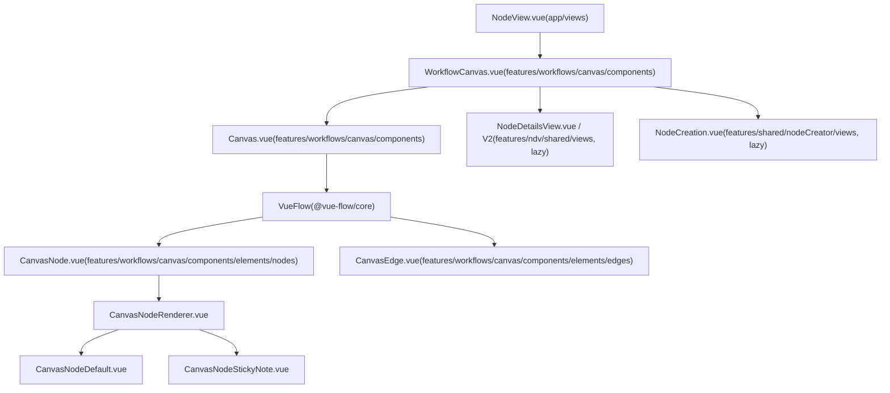

# 工作流画布与节点管理

相关源文件

-   [packages/frontend/@n8n/stores/src/__tests__/setup.ts](https://github.com/n8n-io/n8n/blob/88f170b9/packages/frontend/@n8n/stores/src/__tests__/setup.ts)
-   [packages/frontend/@n8n/stores/src/useAgentRequestStore.test.ts](https://github.com/n8n-io/n8n/blob/88f170b9/packages/frontend/@n8n/stores/src/useAgentRequestStore.test.ts)
-   [packages/frontend/@n8n/stores/src/useAgentRequestStore.ts](https://github.com/n8n-io/n8n/blob/88f170b9/packages/frontend/@n8n/stores/src/useAgentRequestStore.ts)
-   [packages/frontend/editor-ui/MIGRATION_RECIPE.md](https://github.com/n8n-io/n8n/blob/88f170b9/packages/frontend/editor-ui/MIGRATION_RECIPE.md?plain=1)
-   [packages/frontend/editor-ui/eslint.config.mjs](https://github.com/n8n-io/n8n/blob/88f170b9/packages/frontend/editor-ui/eslint.config.mjs)
-   [packages/frontend/editor-ui/src/__tests__/mocks.ts](https://github.com/n8n-io/n8n/blob/88f170b9/packages/frontend/editor-ui/src/__tests__/mocks.ts)
-   [packages/frontend/editor-ui/src/app/components/MainHeader/MainHeader.vue](https://github.com/n8n-io/n8n/blob/88f170b9/packages/frontend/editor-ui/src/app/components/MainHeader/MainHeader.vue)
-   [packages/frontend/editor-ui/src/app/components/MainHeader/WorkflowDetails.vue](https://github.com/n8n-io/n8n/blob/88f170b9/packages/frontend/editor-ui/src/app/components/MainHeader/WorkflowDetails.vue)
-   [packages/frontend/editor-ui/src/app/composables/__snapshots__/useCanvasOperations.test.ts.snap](https://github.com/n8n-io/n8n/blob/88f170b9/packages/frontend/editor-ui/src/app/composables/__snapshots__/useCanvasOperations.test.ts.snap)
-   [packages/frontend/editor-ui/src/app/composables/useCanvasOperations.test.ts](https://github.com/n8n-io/n8n/blob/88f170b9/packages/frontend/editor-ui/src/app/composables/useCanvasOperations.test.ts)
-   [packages/frontend/editor-ui/src/app/composables/useCanvasOperations.ts](https://github.com/n8n-io/n8n/blob/88f170b9/packages/frontend/editor-ui/src/app/composables/useCanvasOperations.ts)
-   [packages/frontend/editor-ui/src/app/composables/useWorkflowActivate.ts](https://github.com/n8n-io/n8n/blob/88f170b9/packages/frontend/editor-ui/src/app/composables/useWorkflowActivate.ts)
-   [packages/frontend/editor-ui/src/app/composables/useWorkflowExtraction.ts](https://github.com/n8n-io/n8n/blob/88f170b9/packages/frontend/editor-ui/src/app/composables/useWorkflowExtraction.ts)
-   [packages/frontend/editor-ui/src/app/composables/useWorkflowHelpers.test.ts](https://github.com/n8n-io/n8n/blob/88f170b9/packages/frontend/editor-ui/src/app/composables/useWorkflowHelpers.test.ts)
-   [packages/frontend/editor-ui/src/app/composables/useWorkflowHelpers.ts](https://github.com/n8n-io/n8n/blob/88f170b9/packages/frontend/editor-ui/src/app/composables/useWorkflowHelpers.ts)
-   [packages/frontend/editor-ui/src/app/composables/useWorkflowSaving.test.ts](https://github.com/n8n-io/n8n/blob/88f170b9/packages/frontend/editor-ui/src/app/composables/useWorkflowSaving.test.ts)
-   [packages/frontend/editor-ui/src/app/composables/useWorkflowSaving.ts](https://github.com/n8n-io/n8n/blob/88f170b9/packages/frontend/editor-ui/src/app/composables/useWorkflowSaving.ts)
-   [packages/frontend/editor-ui/src/app/composables/useWorkflowState.ts](https://github.com/n8n-io/n8n/blob/88f170b9/packages/frontend/editor-ui/src/app/composables/useWorkflowState.ts)
-   [packages/frontend/editor-ui/src/app/composables/useWorkflowUpdate.test.ts](https://github.com/n8n-io/n8n/blob/88f170b9/packages/frontend/editor-ui/src/app/composables/useWorkflowUpdate.test.ts)
-   [packages/frontend/editor-ui/src/app/composables/useWorkflowUpdate.ts](https://github.com/n8n-io/n8n/blob/88f170b9/packages/frontend/editor-ui/src/app/composables/useWorkflowUpdate.ts)
-   [packages/frontend/editor-ui/src/app/layouts/WorkflowLayout.vue](https://github.com/n8n-io/n8n/blob/88f170b9/packages/frontend/editor-ui/src/app/layouts/WorkflowLayout.vue)
-   [packages/frontend/editor-ui/src/app/stores/workflowDocument.store.test.ts](https://github.com/n8n-io/n8n/blob/88f170b9/packages/frontend/editor-ui/src/app/stores/workflowDocument.store.test.ts)
-   [packages/frontend/editor-ui/src/app/stores/workflowDocument.store.ts](https://github.com/n8n-io/n8n/blob/88f170b9/packages/frontend/editor-ui/src/app/stores/workflowDocument.store.ts)
-   [packages/frontend/editor-ui/src/app/stores/workflowDocument/useWorkflowDocumentConnections.test.ts](https://github.com/n8n-io/n8n/blob/88f170b9/packages/frontend/editor-ui/src/app/stores/workflowDocument/useWorkflowDocumentConnections.test.ts)
-   [packages/frontend/editor-ui/src/app/stores/workflowDocument/useWorkflowDocumentConnections.ts](https://github.com/n8n-io/n8n/blob/88f170b9/packages/frontend/editor-ui/src/app/stores/workflowDocument/useWorkflowDocumentConnections.ts)
-   [packages/frontend/editor-ui/src/app/stores/workflowDocument/useWorkflowDocumentNodes.test.ts](https://github.com/n8n-io/n8n/blob/88f170b9/packages/frontend/editor-ui/src/app/stores/workflowDocument/useWorkflowDocumentNodes.test.ts)
-   [packages/frontend/editor-ui/src/app/stores/workflowDocument/useWorkflowDocumentNodes.ts](https://github.com/n8n-io/n8n/blob/88f170b9/packages/frontend/editor-ui/src/app/stores/workflowDocument/useWorkflowDocumentNodes.ts)
-   [packages/frontend/editor-ui/src/app/stores/workflowSave.store.ts](https://github.com/n8n-io/n8n/blob/88f170b9/packages/frontend/editor-ui/src/app/stores/workflowSave.store.ts)
-   [packages/frontend/editor-ui/src/app/stores/workflows.store.test.ts](https://github.com/n8n-io/n8n/blob/88f170b9/packages/frontend/editor-ui/src/app/stores/workflows.store.test.ts)
-   [packages/frontend/editor-ui/src/app/stores/workflows.store.ts](https://github.com/n8n-io/n8n/blob/88f170b9/packages/frontend/editor-ui/src/app/stores/workflows.store.ts)
-   [packages/frontend/editor-ui/src/app/utils/nodeViewUtils.test.ts](https://github.com/n8n-io/n8n/blob/88f170b9/packages/frontend/editor-ui/src/app/utils/nodeViewUtils.test.ts)
-   [packages/frontend/editor-ui/src/app/utils/nodeViewUtils.ts](https://github.com/n8n-io/n8n/blob/88f170b9/packages/frontend/editor-ui/src/app/utils/nodeViewUtils.ts)
-   [packages/frontend/editor-ui/src/app/views/NodeView.vue](https://github.com/n8n-io/n8n/blob/88f170b9/packages/frontend/editor-ui/src/app/views/NodeView.vue)
-   [packages/frontend/editor-ui/src/features/execution/executions/components/workflow/WorkflowExecutionsInfoAccordion.vue](https://github.com/n8n-io/n8n/blob/88f170b9/packages/frontend/editor-ui/src/features/execution/executions/components/workflow/WorkflowExecutionsInfoAccordion.vue)
-   [packages/frontend/editor-ui/src/features/workflows/canvas/canvas.types.ts](https://github.com/n8n-io/n8n/blob/88f170b9/packages/frontend/editor-ui/src/features/workflows/canvas/canvas.types.ts)
-   [packages/frontend/editor-ui/src/features/workflows/canvas/components/Canvas.vue](https://github.com/n8n-io/n8n/blob/88f170b9/packages/frontend/editor-ui/src/features/workflows/canvas/components/Canvas.vue)
-   [packages/frontend/editor-ui/src/features/workflows/canvas/components/elements/nodes/CanvasNode.vue](https://github.com/n8n-io/n8n/blob/88f170b9/packages/frontend/editor-ui/src/features/workflows/canvas/components/elements/nodes/CanvasNode.vue)
-   [packages/frontend/editor-ui/src/features/workflows/canvas/components/elements/nodes/CanvasNodeToolbar.vue](https://github.com/n8n-io/n8n/blob/88f170b9/packages/frontend/editor-ui/src/features/workflows/canvas/components/elements/nodes/CanvasNodeToolbar.vue)
-   [packages/frontend/editor-ui/src/features/workflows/canvas/components/elements/nodes/render-types/CanvasNodeDefault.vue](https://github.com/n8n-io/n8n/blob/88f170b9/packages/frontend/editor-ui/src/features/workflows/canvas/components/elements/nodes/render-types/CanvasNodeDefault.vue)
-   [packages/frontend/editor-ui/src/features/workflows/canvas/composables/useCanvasMapping.test.ts](https://github.com/n8n-io/n8n/blob/88f170b9/packages/frontend/editor-ui/src/features/workflows/canvas/composables/useCanvasMapping.test.ts)
-   [packages/frontend/editor-ui/src/features/workflows/canvas/composables/useCanvasMapping.ts](https://github.com/n8n-io/n8n/blob/88f170b9/packages/frontend/editor-ui/src/features/workflows/canvas/composables/useCanvasMapping.ts)
-   [packages/frontend/editor-ui/src/features/workflows/workflowHistory/components/WorkflowHistoryButton.test.ts](https://github.com/n8n-io/n8n/blob/88f170b9/packages/frontend/editor-ui/src/features/workflows/workflowHistory/components/WorkflowHistoryButton.test.ts)
-   [packages/frontend/editor-ui/src/features/workflows/workflowHistory/components/WorkflowHistoryButton.vue](https://github.com/n8n-io/n8n/blob/88f170b9/packages/frontend/editor-ui/src/features/workflows/workflowHistory/components/WorkflowHistoryButton.vue)
-   [packages/testing/playwright/services/role-api-helper.ts](https://github.com/n8n-io/n8n/blob/88f170b9/packages/testing/playwright/services/role-api-helper.ts)
-   [packages/testing/playwright/tests/e2e/regression/PAY-4367-node-shifting-cyclic.spec.ts](https://github.com/n8n-io/n8n/blob/88f170b9/packages/testing/playwright/tests/e2e/regression/PAY-4367-node-shifting-cyclic.spec.ts)
-   [packages/testing/playwright/tests/e2e/workflows/editor/canvas/actions.spec.ts](https://github.com/n8n-io/n8n/blob/88f170b9/packages/testing/playwright/tests/e2e/workflows/editor/canvas/actions.spec.ts)
-   [packages/testing/playwright/workflows/Bug_node_insertions_between_stickies.json](https://github.com/n8n-io/n8n/blob/88f170b9/packages/testing/playwright/workflows/Bug_node_insertions_between_stickies.json)
-   [packages/testing/playwright/workflows/Bug_node_insertions_sticky.json](https://github.com/n8n-io/n8n/blob/88f170b9/packages/testing/playwright/workflows/Bug_node_insertions_sticky.json)
-   [packages/testing/playwright/workflows/Cyclic_workflow_for_insertion_test.json](https://github.com/n8n-io/n8n/blob/88f170b9/packages/testing/playwright/workflows/Cyclic_workflow_for_insertion_test.json)

## 目的与范围

本页涵盖前端工作流编辑器画布：可视化画布如何组织、节点如何渲染，以及用户交互（添加、移动、连接、删除、复制、运行）如何处理。它详细说明了 **Vue Flow**、`NodeView` 协调器、基于 CRDT 的协作编辑模型，以及将 n8n 工作流数据转换为可视化图形的映射逻辑。

---

## 组件层次结构

画布被托管在 `NodeView` 内部，后者充当页面级协调器。`WorkflowCanvas` 位于 `NodeView` 与 `Canvas` 之间；它调用 `useCanvasMapping` 生成 Vue Flow 消费的类型化 `CanvasNode[]` / `CanvasConnection[]` 数组。

**画布组件树**

来源：[packages/frontend/editor-ui/src/app/views/NodeView.vue15-155](https://github.com/n8n-io/n8n/blob/88f170b9/packages/frontend/editor-ui/src/app/views/NodeView.vue#L15-L155) [packages/frontend/editor-ui/src/features/workflows/canvas/components/Canvas.vue1-70](https://github.com/n8n-io/n8n/blob/88f170b9/packages/frontend/editor-ui/src/features/workflows/canvas/components/Canvas.vue#L1-L70) [packages/frontend/editor-ui/src/features/workflows/canvas/components/elements/nodes/CanvasNode.vue1-40](https://github.com/n8n-io/n8n/blob/88f170b9/packages/frontend/editor-ui/src/features/workflows/canvas/components/elements/nodes/CanvasNode.vue#L1-L40)

---

## NodeView.vue — 页面级协调器

`NodeView` ([packages/frontend/editor-ui/src/app/views/NodeView.vue](https://github.com/n8n-io/n8n/blob/88f170b9/packages/frontend/editor-ui/src/app/views/NodeView.vue)) 是工作流编辑器的入口点。它管理工作流文档的生命周期，并协调画布与侧边栏面板（NDV、Node Creator）之间的交互。

### 工作区生命周期与数据流

当加载一个工作流时，`NodeView` 会初始化 `workflowDocumentStore`。该 store 是一个按工作流 ID 创建的专用 Pinia store 实例，为节点、连接和元数据提供作用域化上下文。

> **[Mermaid sequence]**
> *(图表结构无法解析)*

来源：[packages/frontend/editor-ui/src/app/views/NodeView.vue1-157](https://github.com/n8n-io/n8n/blob/88f170b9/packages/frontend/editor-ui/src/app/views/NodeView.vue#L1-L157) [packages/frontend/editor-ui/src/app/stores/workflowDocument.store.ts35-122](https://github.com/n8n-io/n8n/blob/88f170b9/packages/frontend/editor-ui/src/app/stores/workflowDocument.store.ts#L35-L122)

### 只读与协作状态

`NodeView` 会跟踪画布是否应该可交互。`isCanvasReadOnly` 的计算依据包括：

-   **源代码控制**：`sourceControlStore.preferences.branchReadOnly`。
-   **RBAC**：`getResourcePermissions(scopes).workflow.update`。
-   **协作**：`collaborationStore.shouldBeReadOnly`（当其他用户持有锁时）。
-   **归档**：`workflowDocumentStore.isArchived`。

来源：[packages/frontend/editor-ui/src/app/views/NodeView.vue288-302](https://github.com/n8n-io/n8n/blob/88f170b9/packages/frontend/editor-ui/src/app/views/NodeView.vue#L288-L302) [packages/frontend/editor-ui/src/app/composables/useWorkflowSaving.ts86-93](https://github.com/n8n-io/n8n/blob/88f170b9/packages/frontend/editor-ui/src/app/composables/useWorkflowSaving.ts#L86-L93)

---

## 工作流文档 Store 与 CRDT

n8n 使用一种去中心化的 store 架构，由 `useWorkflowDocumentStore` ([packages/frontend/editor-ui/src/app/stores/workflowDocument.store.ts](https://github.com/n8n-io/n8n/blob/88f170b9/packages/frontend/editor-ui/src/app/stores/workflowDocument.store.ts)) 管理工作流数据。该 store 由多个功能单元组成：

-   `useWorkflowDocumentNodes`：管理 `INodeUi[]` 数组。
-   `useWorkflowDocumentConnections`：管理 `IConnections` 对象。
-   `useWorkflowDocumentPinData`：处理节点级固定数据。

### 状态脏标记追踪

该 store 暴露了一个 `onStateDirty` 钩子。当节点或连接被修改时，会调用 `useUIStore().markStateDirty()`，从而触发“未保存的更改” UI，并启用保存按钮。

来源：[packages/frontend/editor-ui/src/app/stores/workflowDocument.store.ts60-121](https://github.com/n8n-io/n8n/blob/88f170b9/packages/frontend/editor-ui/src/app/stores/workflowDocument.store.ts#L60-L121) [packages/frontend/editor-ui/src/app/stores/workflowDocument/useWorkflowDocumentNodes.ts1-50](https://github.com/n8n-io/n8n/blob/88f170b9/packages/frontend/editor-ui/src/app/stores/workflowDocument/useWorkflowDocumentNodes.ts#L1-L50)

---

## useCanvasMapping — 数据转换

`useCanvasMapping` ([packages/frontend/editor-ui/src/features/workflows/canvas/composables/useCanvasMapping.ts](https://github.com/n8n-io/n8n/blob/88f170b9/packages/frontend/editor-ui/src/features/workflows/canvas/composables/useCanvasMapping.ts)) 是 n8n 的 `INodeUi` 对象与 Vue Flow 的 `Node` 对象之间的桥梁。它会根据节点状态，以响应式方式计算节点的视觉表示。

### 映射逻辑

| n8n 实体 | 画布属性 | 逻辑来源 |
| --- | --- | --- |
| `INodeUi.position` | `position` | 按 `GRID_SIZE`（10px）对齐 |
| `INodeUi.type` | `type` | 通过 `CanvasNodeRenderType` 映射 |
| `NodeIssues` | `data.issues` | 通过 `useNodeHelpers` 解析 |
| `ExecutionSummary` | `data.execution` | 从 `workflowDocumentStore` 中获取 |
| `IPinData` | `data.pinnedData` | 与 `workflowDocumentStore.pinData` 进行比对 |

来源：[packages/frontend/editor-ui/src/features/workflows/canvas/composables/useCanvasMapping.ts71-167](https://github.com/n8n-io/n8n/blob/88f170b9/packages/frontend/editor-ui/src/features/workflows/canvas/composables/useCanvasMapping.ts#L71-L167) [packages/frontend/editor-ui/src/app/utils/nodeViewUtils.ts77-86](https://github.com/n8n-io/n8n/blob/88f170b9/packages/frontend/editor-ui/src/app/utils/nodeViewUtils.ts#L77-L86)

---

## 画布操作

`useCanvasOperations` ([packages/frontend/editor-ui/src/app/composables/useCanvasOperations.ts](https://github.com/n8n-io/n8n/blob/88f170b9/packages/frontend/editor-ui/src/app/composables/useCanvasOperations.ts)) 提供工作流的变更 API。大多数操作都封装在 **历史命令** 中，以支持撤销/重做。

### 核心函数

-   `addNodes(nodes, options)`：向文档中插入新节点。
-   `createConnection(connection, options)`：验证并创建端口之间的连接。
-   `deleteNodes(ids)`：删除节点及其关联连接。
-   `updateNodesPosition(events)`：在拖拽后更新 store 中的坐标。

### 节点插入逻辑

当节点被放置到一条现有连接上时，n8n 会执行“自动插入”：

1.  删除现有连接。
2.  创建两条新连接：`Source -> New Node` 和 `New Node -> Target`。
3.  使用 `PUSH_NODES_OFFSET` 移动上游/下游节点，为新节点腾出空间。

来源：[packages/frontend/editor-ui/src/app/composables/useCanvasOperations.ts39-46](https://github.com/n8n-io/n8n/blob/88f170b9/packages/frontend/editor-ui/src/app/composables/useCanvasOperations.ts#L39-L46) [packages/frontend/editor-ui/src/app/composables/useCanvasOperations.ts300-450](https://github.com/n8n-io/n8n/blob/88f170b9/packages/frontend/editor-ui/src/app/composables/useCanvasOperations.ts#L300-L450)

---

## 节点管理生命周期

### 创建

节点通过 `NodeCreation.vue` 组件创建。当用户选中一个节点时：

1.  `nodeTypesStore.getNodeType` 获取元数据。
2.  `useUniqueNodeName.getUniqueNodeName` 确保名称不会冲突。
3.  `AddNodeCommand` 被推入 `historyStore`。

### 执行与状态

节点状态通过 `CanvasNodeStatusIcons.vue` 显示在画布上。

-   **成功**：节点在当前会话中执行成功。
-   **错误**：该节点执行失败。
-   **等待**：节点是 `Wait` 或 `Webhook` 节点，正在等待外部输入。
-   **脏状态**：参数自上次执行后已发生变化（`CanvasNodeDirtiness`）。

来源：[packages/frontend/editor-ui/src/app/stores/workflows.store.ts179-196](https://github.com/n8n-io/n8n/blob/88f170b9/packages/frontend/editor-ui/src/app/stores/workflows.store.ts#L179-L196) [packages/frontend/editor-ui/src/app/composables/useRunWorkflow.ts1-100](https://github.com/n8n-io/n8n/blob/88f170b9/packages/frontend/editor-ui/src/app/composables/useRunWorkflow.ts#L1-L100)

---

## 协作编辑

协作功能由 `collaborationStore` 处理。当多个用户编辑同一个工作流时：

1.  画布上会出现一个 **Presence Pill**（`N8nCanvasCollaborationPill`）。
2.  **锁定**：当用户开始编辑某个节点（打开 NDV）时，会获得该节点的锁。其他用户会看到该节点处于“正在被 [User] 编辑”状态。
3.  **实时更新**：变更通过 WebSocket 推送，并应用到本地的 `workflowDocumentStore`。

来源：[packages/frontend/editor-ui/src/app/views/NodeView.vue136-140](https://github.com/n8n-io/n8n/blob/88f170b9/packages/frontend/editor-ui/src/app/views/NodeView.vue#L136-L140) [packages/frontend/editor-ui/src/app/composables/useWorkflowSaving.ts161-175](https://github.com/n8n-io/n8n/blob/88f170b9/packages/frontend/editor-ui/src/app/composables/useWorkflowSaving.ts#L161-L175)

---

## 关键文件摘要

| 文件路径 | 角色 |
| --- | --- |
| `app/views/NodeView.vue` | 主编辑页协调器。 |
| `app/composables/useCanvasOperations.ts` | 节点/连接的变更 API。 |
| `app/stores/workflowDocument.store.ts` | 工作流数据的作用域 store。 |
| `features/workflows/canvas/composables/useCanvasMapping.ts` | Vue Flow 数据转换。 |
| `app/utils/nodeViewUtils.ts` | 网格吸附和布局常量。 |

来源：[packages/frontend/editor-ui/src/app/views/NodeView.vue1-157](https://github.com/n8n-io/n8n/blob/88f170b9/packages/frontend/editor-ui/src/app/views/NodeView.vue#L1-L157) [packages/frontend/editor-ui/src/app/composables/useCanvasOperations.ts1-193](https://github.com/n8n-io/n8n/blob/88f170b9/packages/frontend/editor-ui/src/app/composables/useCanvasOperations.ts#L1-L193) [packages/frontend/editor-ui/src/app/stores/workflowDocument.store.ts1-158](https://github.com/n8n-io/n8n/blob/88f170b9/packages/frontend/editor-ui/src/app/stores/workflowDocument.store.ts#L1-L158)
