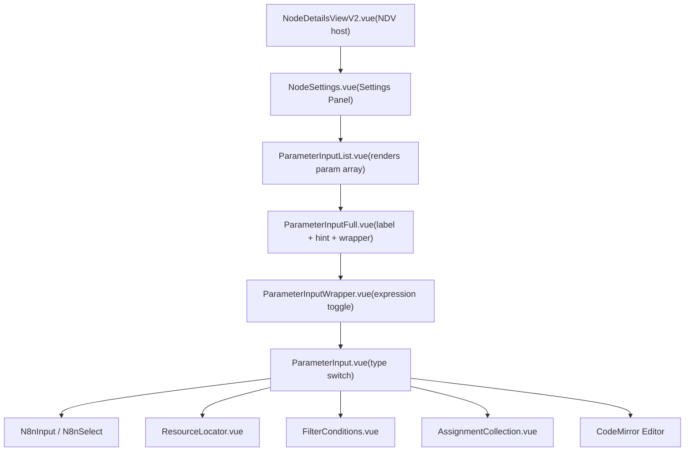

# 参数输入与表达式编辑器

相关源文件

-   [packages/frontend/editor-ui/src/app/components/Draggable.test.ts](https://github.com/n8n-io/n8n/blob/88f170b9/packages/frontend/editor-ui/src/app/components/Draggable.test.ts)
-   [packages/frontend/editor-ui/src/app/components/Draggable.vue](https://github.com/n8n-io/n8n/blob/88f170b9/packages/frontend/editor-ui/src/app/components/Draggable.vue)
-   [packages/frontend/editor-ui/src/app/components/NodeTitle.vue](https://github.com/n8n-io/n8n/blob/88f170b9/packages/frontend/editor-ui/src/app/components/NodeTitle.vue)
-   [packages/frontend/editor-ui/src/app/composables/useDataSchema.test.ts](https://github.com/n8n-io/n8n/blob/88f170b9/packages/frontend/editor-ui/src/app/composables/useDataSchema.test.ts)
-   [packages/frontend/editor-ui/src/app/composables/useDataSchema.ts](https://github.com/n8n-io/n8n/blob/88f170b9/packages/frontend/editor-ui/src/app/composables/useDataSchema.ts)
-   [packages/frontend/editor-ui/src/app/composables/usePinnedData.test.ts](https://github.com/n8n-io/n8n/blob/88f170b9/packages/frontend/editor-ui/src/app/composables/usePinnedData.test.ts)
-   [packages/frontend/editor-ui/src/app/composables/usePinnedData.ts](https://github.com/n8n-io/n8n/blob/88f170b9/packages/frontend/editor-ui/src/app/composables/usePinnedData.ts)
-   [packages/frontend/editor-ui/src/features/execution/logs/components/LogsViewRunData.vue](https://github.com/n8n-io/n8n/blob/88f170b9/packages/frontend/editor-ui/src/features/execution/logs/components/LogsViewRunData.vue)
-   [packages/frontend/editor-ui/src/features/ndv/panel/components/InputNodeSelect.vue](https://github.com/n8n-io/n8n/blob/88f170b9/packages/frontend/editor-ui/src/features/ndv/panel/components/InputNodeSelect.vue)
-   [packages/frontend/editor-ui/src/features/ndv/panel/components/InputPanel.test.ts](https://github.com/n8n-io/n8n/blob/88f170b9/packages/frontend/editor-ui/src/features/ndv/panel/components/InputPanel.test.ts)
-   [packages/frontend/editor-ui/src/features/ndv/panel/components/InputPanel.vue](https://github.com/n8n-io/n8n/blob/88f170b9/packages/frontend/editor-ui/src/features/ndv/panel/components/InputPanel.vue)
-   [packages/frontend/editor-ui/src/features/ndv/panel/components/NDVEmptyState.vue](https://github.com/n8n-io/n8n/blob/88f170b9/packages/frontend/editor-ui/src/features/ndv/panel/components/NDVEmptyState.vue)
-   [packages/frontend/editor-ui/src/features/ndv/panel/components/NDVFloatingNodes.vue](https://github.com/n8n-io/n8n/blob/88f170b9/packages/frontend/editor-ui/src/features/ndv/panel/components/NDVFloatingNodes.vue)
-   [packages/frontend/editor-ui/src/features/ndv/panel/components/NDVHeader.vue](https://github.com/n8n-io/n8n/blob/88f170b9/packages/frontend/editor-ui/src/features/ndv/panel/components/NDVHeader.vue)
-   [packages/frontend/editor-ui/src/features/ndv/panel/components/NDVSubConnections.vue](https://github.com/n8n-io/n8n/blob/88f170b9/packages/frontend/editor-ui/src/features/ndv/panel/components/NDVSubConnections.vue)
-   [packages/frontend/editor-ui/src/features/ndv/panel/components/OutputPanel.vue](https://github.com/n8n-io/n8n/blob/88f170b9/packages/frontend/editor-ui/src/features/ndv/panel/components/OutputPanel.vue)
-   [packages/frontend/editor-ui/src/features/ndv/panel/components/TriggerPanel.test.ts](https://github.com/n8n-io/n8n/blob/88f170b9/packages/frontend/editor-ui/src/features/ndv/panel/components/TriggerPanel.test.ts)
-   [packages/frontend/editor-ui/src/features/ndv/panel/components/TriggerPanel.vue](https://github.com/n8n-io/n8n/blob/88f170b9/packages/frontend/editor-ui/src/features/ndv/panel/components/TriggerPanel.vue)
-   [packages/frontend/editor-ui/src/features/ndv/panel/components/__snapshots__/InputPanel.test.ts.snap](https://github.com/n8n-io/n8n/blob/88f170b9/packages/frontend/editor-ui/src/features/ndv/panel/components/__snapshots__/InputPanel.test.ts.snap)
-   [packages/frontend/editor-ui/src/features/ndv/parameters/components/ParameterInputList.test.ts](https://github.com/n8n-io/n8n/blob/88f170b9/packages/frontend/editor-ui/src/features/ndv/parameters/components/ParameterInputList.test.ts)
-   [packages/frontend/editor-ui/src/features/ndv/parameters/components/ParameterInputList.vue](https://github.com/n8n-io/n8n/blob/88f170b9/packages/frontend/editor-ui/src/features/ndv/parameters/components/ParameterInputList.vue)
-   [packages/frontend/editor-ui/src/features/ndv/runData/components/RunData.test.ts](https://github.com/n8n-io/n8n/blob/88f170b9/packages/frontend/editor-ui/src/features/ndv/runData/components/RunData.test.ts)
-   [packages/frontend/editor-ui/src/features/ndv/runData/components/RunData.vue](https://github.com/n8n-io/n8n/blob/88f170b9/packages/frontend/editor-ui/src/features/ndv/runData/components/RunData.vue)
-   [packages/frontend/editor-ui/src/features/ndv/runData/components/RunDataJson.vue](https://github.com/n8n-io/n8n/blob/88f170b9/packages/frontend/editor-ui/src/features/ndv/runData/components/RunDataJson.vue)
-   [packages/frontend/editor-ui/src/features/ndv/runData/components/RunDataJsonActions.vue](https://github.com/n8n-io/n8n/blob/88f170b9/packages/frontend/editor-ui/src/features/ndv/runData/components/RunDataJsonActions.vue)
-   [packages/frontend/editor-ui/src/features/ndv/runData/components/VirtualSchema.test.ts](https://github.com/n8n-io/n8n/blob/88f170b9/packages/frontend/editor-ui/src/features/ndv/runData/components/VirtualSchema.test.ts)
-   [packages/frontend/editor-ui/src/features/ndv/runData/components/VirtualSchema.vue](https://github.com/n8n-io/n8n/blob/88f170b9/packages/frontend/editor-ui/src/features/ndv/runData/components/VirtualSchema.vue)
-   [packages/frontend/editor-ui/src/features/ndv/runData/schemaPreview.store.test.ts](https://github.com/n8n-io/n8n/blob/88f170b9/packages/frontend/editor-ui/src/features/ndv/runData/schemaPreview.store.test.ts)
-   [packages/frontend/editor-ui/src/features/ndv/runData/schemaPreview.store.ts](https://github.com/n8n-io/n8n/blob/88f170b9/packages/frontend/editor-ui/src/features/ndv/runData/schemaPreview.store.ts)
-   [packages/frontend/editor-ui/src/features/ndv/settings/components/NodeSettings.vue](https://github.com/n8n-io/n8n/blob/88f170b9/packages/frontend/editor-ui/src/features/ndv/settings/components/NodeSettings.vue)
-   [packages/frontend/editor-ui/src/features/ndv/settings/composables/useNodeSettingsParameters.test.ts](https://github.com/n8n-io/n8n/blob/88f170b9/packages/frontend/editor-ui/src/features/ndv/settings/composables/useNodeSettingsParameters.test.ts)
-   [packages/frontend/editor-ui/src/features/ndv/settings/composables/useNodeSettingsParameters.ts](https://github.com/n8n-io/n8n/blob/88f170b9/packages/frontend/editor-ui/src/features/ndv/settings/composables/useNodeSettingsParameters.ts)
-   [packages/frontend/editor-ui/src/features/ndv/shared/ndv.store.ts](https://github.com/n8n-io/n8n/blob/88f170b9/packages/frontend/editor-ui/src/features/ndv/shared/ndv.store.ts)
-   [packages/frontend/editor-ui/src/features/ndv/shared/ndv.utils.ts](https://github.com/n8n-io/n8n/blob/88f170b9/packages/frontend/editor-ui/src/features/ndv/shared/ndv.utils.ts)
-   [packages/frontend/editor-ui/src/features/ndv/shared/views/NodeDetailsView.vue](https://github.com/n8n-io/n8n/blob/88f170b9/packages/frontend/editor-ui/src/features/ndv/shared/views/NodeDetailsView.vue)
-   [packages/frontend/editor-ui/src/features/ndv/shared/views/NodeDetailsViewV2.vue](https://github.com/n8n-io/n8n/blob/88f170b9/packages/frontend/editor-ui/src/features/ndv/shared/views/NodeDetailsViewV2.vue)
-   [packages/frontend/editor-ui/src/features/shared/editors/components/SqlEditor/SQLEditor.test.ts](https://github.com/n8n-io/n8n/blob/88f170b9/packages/frontend/editor-ui/src/features/shared/editors/components/SqlEditor/SQLEditor.test.ts)
-   [packages/nodes-base/nodes/Switch/V3/test/switch.expression.workflow.json](https://github.com/n8n-io/n8n/blob/88f170b9/packages/nodes-base/nodes/Switch/V3/test/switch.expression.workflow.json)
-   [packages/nodes-base/nodes/Switch/V3/test/switch.rules.workflow.json](https://github.com/n8n-io/n8n/blob/88f170b9/packages/nodes-base/nodes/Switch/V3/test/switch.rules.workflow.json)
-   [packages/nodes-base/scripts/validate-schema-versions.js](https://github.com/n8n-io/n8n/blob/88f170b9/packages/nodes-base/scripts/validate-schema-versions.js)
-   [packages/testing/playwright/pages/components/FocusPanel.ts](https://github.com/n8n-io/n8n/blob/88f170b9/packages/testing/playwright/pages/components/FocusPanel.ts)
-   [packages/testing/playwright/tests/e2e/workflows/editor/ndv/resource-mapper.spec.ts](https://github.com/n8n-io/n8n/blob/88f170b9/packages/testing/playwright/tests/e2e/workflows/editor/ndv/resource-mapper.spec.ts)
-   [packages/testing/playwright/workflows/Test_workflow_filter.json](https://github.com/n8n-io/n8n/blob/88f170b9/packages/testing/playwright/workflows/Test_workflow_filter.json)
-   [packages/workflow/src/run-execution-data-factory.ts](https://github.com/n8n-io/n8n/blob/88f170b9/packages/workflow/src/run-execution-data-factory.ts)
-   [packages/workflow/src/run-execution-data/run-execution-data.ts](https://github.com/n8n-io/n8n/blob/88f170b9/packages/workflow/src/run-execution-data/run-execution-data.ts)
-   [packages/workflow/src/run-execution-data/run-execution-data.v0.ts](https://github.com/n8n-io/n8n/blob/88f170b9/packages/workflow/src/run-execution-data/run-execution-data.v0.ts)
-   [packages/workflow/src/run-execution-data/run-execution-data.v1.ts](https://github.com/n8n-io/n8n/blob/88f170b9/packages/workflow/src/run-execution-data/run-execution-data.v1.ts)

本文档介绍 Node Details View（NDV）中的参数输入组件树、基于 CodeMirror 的表达式编辑器，以及用于处理过滤条件、赋值集合、资源定位器和代码编辑器等复杂参数类型的专用子组件。

---

## 概述

当用户在画布中打开一个节点时，NDV 会通过分层组件树渲染该节点在 `INodeTypeDescription` 中声明的每个参数。该组件树会根据参数的 `type` 字段，以及该参数当前保存的是原始值还是动态表达式，决定显示哪种输入控件。

NDV 架构主要分为 **设置**（参数/凭据）和 **运行数据**（输入/输出/Schema）两个面板。

**组件树概览：**

来源: [packages/frontend/editor-ui/src/features/ndv/shared/views/NodeDetailsViewV2.vue10](https://github.com/n8n-io/n8n/blob/88f170b9/packages/frontend/editor-ui/src/features/ndv/shared/views/NodeDetailsViewV2.vue#L10-L10) [packages/frontend/editor-ui/src/features/ndv/settings/components/NodeSettings.vue24](https://github.com/n8n-io/n8n/blob/88f170b9/packages/frontend/editor-ui/src/features/ndv/settings/components/NodeSettings.vue#L24-L24) [packages/frontend/editor-ui/src/features/ndv/parameters/components/ParameterInputList.vue33-39](https://github.com/n8n-io/n8n/blob/88f170b9/packages/frontend/editor-ui/src/features/ndv/parameters/components/ParameterInputList.vue#L33-L39)

---

## 参数输入组件树

### `ParameterInputList.vue`

`ParameterInputList` 会遍历一个 `INodeProperties` 数组，并将每一项委派给 `ParameterInputFull`。它负责：

-   **可见性逻辑**：使用 `useNodeSettingsParameters` 中的 `shouldDisplayNodeParameter` 来评估 `displayOptions` 和 `disabledOptions` [packages/frontend/editor-ui/src/features/ndv/parameters/components/ParameterInputList.vue175-192](https://github.com/n8n-io/n8n/blob/88f170b9/packages/frontend/editor-ui/src/features/ndv/parameters/components/ParameterInputList.vue#L175-L192)
-   **特殊节点处理**：对 `Form Trigger`、`Form` 和 `Wait` 等特定节点类型应用转换 [packages/frontend/editor-ui/src/features/ndv/parameters/components/ParameterInputList.vue196-205](https://github.com/n8n-io/n8n/blob/88f170b9/packages/frontend/editor-ui/src/features/ndv/parameters/components/ParameterInputList.vue#L196-L205)
-   **性能**：使用 `throttledWatch` 响应参数或节点值变化，避免过度重新渲染 [packages/frontend/editor-ui/src/features/ndv/parameters/components/ParameterInputList.vue170-172](https://github.com/n8n-io/n8n/blob/88f170b9/packages/frontend/editor-ui/src/features/ndv/parameters/components/ParameterInputList.vue#L170-L172)

来源: [packages/frontend/editor-ui/src/features/ndv/parameters/components/ParameterInputList.vue170-213](https://github.com/n8n-io/n8n/blob/88f170b9/packages/frontend/editor-ui/src/features/ndv/parameters/components/ParameterInputList.vue#L170-L213) [packages/frontend/editor-ui/src/features/ndv/settings/composables/useNodeSettingsParameters.ts175-181](https://github.com/n8n-io/n8n/blob/88f170b9/packages/frontend/editor-ui/src/features/ndv/settings/composables/useNodeSettingsParameters.ts#L175-L181)

### `NodeSettings.vue`

NDV 中用于配置节点的核心容器。它协调以下内容：

-   **选项卡**：管理 `params`、`credentials` 和 `settings`（重试、错误处理）之间的切换 [packages/frontend/editor-ui/src/features/ndv/settings/components/NodeSettings.vue151](https://github.com/n8n-io/n8n/blob/88f170b9/packages/frontend/editor-ui/src/features/ndv/settings/components/NodeSettings.vue#L151-L151)
-   **初始值**：使用 `getNodeSettingsInitialValues` 填充 `nodeValues` [packages/frontend/editor-ui/src/features/ndv/settings/components/NodeSettings.vue122](https://github.com/n8n-io/n8n/blob/88f170b9/packages/frontend/editor-ui/src/features/ndv/settings/components/NodeSettings.vue#L122-L122)
-   **参数更新**：将值变更委派给 `useNodeSettingsParameters` 中的 `updateNodeParameter` [packages/frontend/editor-ui/src/features/ndv/settings/composables/useNodeSettingsParameters.ts55-61](https://github.com/n8n-io/n8n/blob/88f170b9/packages/frontend/editor-ui/src/features/ndv/settings/composables/useNodeSettingsParameters.ts#L55-L61)

来源: [packages/frontend/editor-ui/src/features/ndv/settings/components/NodeSettings.vue122-151](https://github.com/n8n-io/n8n/blob/88f170b9/packages/frontend/editor-ui/src/features/ndv/settings/components/NodeSettings.vue#L122-L151) [packages/frontend/editor-ui/src/features/ndv/settings/composables/useNodeSettingsParameters.ts55-155](https://github.com/n8n-io/n8n/blob/88f170b9/packages/frontend/editor-ui/src/features/ndv/settings/composables/useNodeSettingsParameters.ts#L55-L155)

---

## 运行数据与 Schema 预览

NDV 提供了一个用于检查流经节点数据的专用视图。

### `RunData.vue`

该组件显示实际的执行结果。它支持多种显示模式：

-   **表格**：JSON 数据的标准网格视图。
-   **JSON**：原始对象树视图。
-   **二进制**：用于图像、PDF 和通用下载文件的预览 [packages/frontend/editor-ui/src/features/ndv/runData/components/RunData.vue78](https://github.com/n8n-io/n8n/blob/88f170b9/packages/frontend/editor-ui/src/features/ndv/runData/components/RunData.vue#L78-L78)
-   **Schema**：数据的结构视图 [packages/frontend/editor-ui/src/features/ndv/runData/components/RunData.vue102](https://github.com/n8n-io/n8n/blob/88f170b9/packages/frontend/editor-ui/src/features/ndv/runData/components/RunData.vue#L102-L102)

来源: [packages/frontend/editor-ui/src/features/ndv/runData/components/RunData.vue99-107](https://github.com/n8n-io/n8n/blob/88f170b9/packages/frontend/editor-ui/src/features/ndv/runData/components/RunData.vue#L99-L107)

### `VirtualSchema.vue`

Schema 视图允许用户通过拖放将数据映射到参数中。

-   **Schema 生成**：使用 `useDataSchema` 从执行数据或 JSON schemas 中推导结构信息 [packages/frontend/editor-ui/src/features/ndv/runData/components/VirtualSchema.vue96-97](https://github.com/n8n-io/n8n/blob/88f170b9/packages/frontend/editor-ui/src/features/ndv/runData/components/VirtualSchema.vue#L96-L97)
-   **虚拟滚动**：采用 `vue-virtual-scroller` 高效处理大型数据集 [packages/frontend/editor-ui/src/features/ndv/runData/components/VirtualSchema.vue35-39](https://github.com/n8n-io/n8n/blob/88f170b9/packages/frontend/editor-ui/src/features/ndv/runData/components/VirtualSchema.vue#L35-L39)
-   **映射**：与 `MappingPill` 和 `Draggable` 组件集成，以辅助表达式构建 [packages/frontend/editor-ui/src/features/ndv/runData/components/VirtualSchema.vue4-6](https://github.com/n8n-io/n8n/blob/88f170b9/packages/frontend/editor-ui/src/features/ndv/runData/components/VirtualSchema.vue#L4-L6)

来源: [packages/frontend/editor-ui/src/features/ndv/runData/components/VirtualSchema.vue96-124](https://github.com/n8n-io/n8n/blob/88f170b9/packages/frontend/editor-ui/src/features/ndv/runData/components/VirtualSchema.vue#L96-L124) [packages/frontend/editor-ui/src/features/ndv/runData/components/VirtualSchema.vue35-40](https://github.com/n8n-io/n8n/blob/88f170b9/packages/frontend/editor-ui/src/features/ndv/runData/components/VirtualSchema.vue#L35-L40)

---

## 表达式编辑器与自动补全

n8n 表达式使用 `={{ ... }}` 语法。编辑器基于 **CodeMirror 6** 构建。

### 数据流：表达式解析

> **[Mermaid sequence]**
> *(图表结构无法解析)*

来源: [packages/frontend/editor-ui/src/features/ndv/settings/composables/useNodeSettingsParameters.ts41-46](https://github.com/n8n-io/n8n/blob/88f170b9/packages/frontend/editor-ui/src/features/ndv/settings/composables/useNodeSettingsParameters.ts#L41-L46) [packages/frontend/editor-ui/src/features/ndv/runData/components/VirtualSchema.vue99-100](https://github.com/n8n-io/n8n/blob/88f170b9/packages/frontend/editor-ui/src/features/ndv/runData/components/VirtualSchema.vue#L99-L100)

---

## 专用输入组件

### Filter Conditions

用于 **Filter** 或 **If** 等节点。

-   实现于 `FilterConditions.vue`。
-   管理由 `leftValue`、`operator` 和 `rightValue` 组成的条件数组 [packages/frontend/editor-ui/src/features/ndv/parameters/components/FilterConditions/FilterConditions.vue35](https://github.com/n8n-io/n8n/blob/88f170b9/packages/frontend/editor-ui/src/features/ndv/parameters/components/FilterConditions/FilterConditions.vue#L35-L35)

来源: [packages/frontend/editor-ui/src/features/ndv/parameters/components/ParameterInputList.vue35](https://github.com/n8n-io/n8n/blob/88f170b9/packages/frontend/editor-ui/src/features/ndv/parameters/components/ParameterInputList.vue#L35-L35)

### Assignment Collection

用于 **Set** 节点中定义新字段。

-   实现于 `AssignmentCollection.vue`。
-   允许用户定义多个字段赋值，并为其指定类型（String、Number、Boolean 等） [packages/frontend/editor-ui/src/features/ndv/parameters/components/AssignmentCollection/AssignmentCollection.vue33](https://github.com/n8n-io/n8n/blob/88f170b9/packages/frontend/editor-ui/src/features/ndv/parameters/components/AssignmentCollection/AssignmentCollection.vue#L33-L33)

来源: [packages/frontend/editor-ui/src/features/ndv/parameters/components/ParameterInputList.vue33](https://github.com/n8n-io/n8n/blob/88f170b9/packages/frontend/editor-ui/src/features/ndv/parameters/components/ParameterInputList.vue#L33-L33)

### Resource Locator

用于需要选择远程资源的参数（例如特定的 Trello Board 或 Google Sheet）。

-   **模式**：支持 `list`（下拉列表）、`id`（手动输入）和 `url`（从链接解析） [packages/frontend/editor-ui/src/features/ndv/parameters/components/ResourceMapper/ResourceMapper.vue39](https://github.com/n8n-io/n8n/blob/88f170b9/packages/frontend/editor-ui/src/features/ndv/parameters/components/ResourceMapper/ResourceMapper.vue#L39-L39)
-   **动态加载**：使用 `loadOptions` 通过后端从集成 API 拉取数据。

来源: [packages/frontend/editor-ui/src/features/ndv/parameters/components/ParameterInputList.vue39](https://github.com/n8n-io/n8n/blob/88f170b9/packages/frontend/editor-ui/src/features/ndv/parameters/components/ParameterInputList.vue#L39-L39)

---

## 触发器面板

专用于触发器节点（例如 Webhook、Chat Trigger）以提供运行时状态。

-   **状态指示器**：显示节点是否处于“监听中”状态 [packages/frontend/editor-ui/src/features/ndv/panel/components/TriggerPanel.vue172-188](https://github.com/n8n-io/n8n/blob/88f170b9/packages/frontend/editor-ui/src/features/ndv/panel/components/TriggerPanel.vue#L172-L188)
-   **URL**：显示基于 Webhook 的节点的测试和生产 URL [packages/frontend/editor-ui/src/features/ndv/panel/components/TriggerPanel.vue156-162](https://github.com/n8n-io/n8n/blob/88f170b9/packages/frontend/editor-ui/src/features/ndv/panel/components/TriggerPanel.vue#L156-L162)
-   **轮询**：为基于轮询的触发器提供手动获取按钮 [packages/frontend/editor-ui/src/features/ndv/panel/components/TriggerPanel.vue168-170](https://github.com/n8n-io/n8n/blob/88f170b9/packages/frontend/editor-ui/src/features/ndv/panel/components/TriggerPanel.vue#L168-L170)

来源: [packages/frontend/editor-ui/src/features/ndv/panel/components/TriggerPanel.vue172-205](https://github.com/n8n-io/n8n/blob/88f170b9/packages/frontend/editor-ui/src/features/ndv/panel/components/TriggerPanel.vue#L172-L205)

---

## 状态管理与数据访问

NDV 在其状态管理中大量依赖 Pinia store：

-   `useNDVStore`：跟踪当前活动节点、面板状态以及固定数据状态 [packages/frontend/editor-ui/src/features/ndv/shared/ndv.store.ts1](https://github.com/n8n-io/n8n/blob/88f170b9/packages/frontend/editor-ui/src/features/ndv/shared/ndv.store.ts#L1-L1)
-   `useWorkflowDocumentStore`：提供对工作流节点、连接和固定数据的访问 [packages/frontend/editor-ui/src/app/stores/workflowDocument.store.ts1](https://github.com/n8n-io/n8n/blob/88f170b9/packages/frontend/editor-ui/src/app/stores/workflowDocument.store.ts#L1-L1)
-   `useNodeTypesStore`：存储所有已注册节点类型的元数据和属性定义 [packages/frontend/editor-ui/src/app/stores/nodeTypes.store.ts1](https://github.com/n8n-io/n8n/blob/88f170b9/packages/frontend/editor-ui/src/app/stores/nodeTypes.store.ts#L1-L1)

来源: [packages/frontend/editor-ui/src/features/ndv/settings/components/NodeSettings.vue125-130](https://github.com/n8n-io/n8n/blob/88f170b9/packages/frontend/editor-ui/src/features/ndv/settings/components/NodeSettings.vue#L125-L130)
