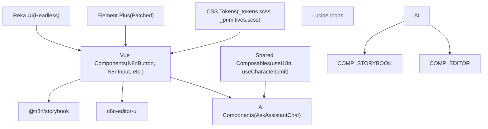
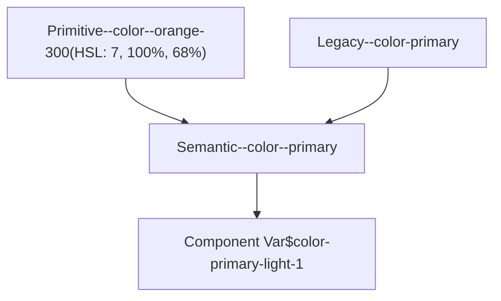
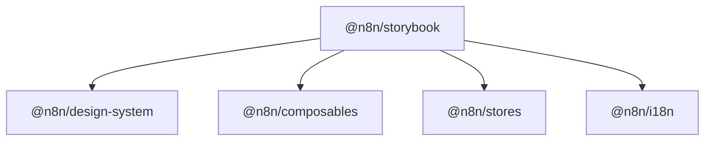

# 设计系统与可复用组件

相关源文件

-   [packages/@n8n/stylelint-config/README.md](https://github.com/n8n-io/n8n/blob/88f170b9/packages/@n8n/stylelint-config/README.md?plain=1)
-   [packages/@n8n/stylelint-config/jest.config.cjs](https://github.com/n8n-io/n8n/blob/88f170b9/packages/@n8n/stylelint-config/jest.config.cjs)
-   [packages/@n8n/stylelint-config/package.json](https://github.com/n8n-io/n8n/blob/88f170b9/packages/@n8n/stylelint-config/package.json)
-   [packages/@n8n/stylelint-config/src/configs/base.ts](https://github.com/n8n-io/n8n/blob/88f170b9/packages/@n8n/stylelint-config/src/configs/base.ts)
-   [packages/@n8n/stylelint-config/src/rules/css-var-naming.test.ts](https://github.com/n8n-io/n8n/blob/88f170b9/packages/@n8n/stylelint-config/src/rules/css-var-naming.test.ts)
-   [packages/@n8n/stylelint-config/src/rules/css-var-naming.ts](https://github.com/n8n-io/n8n/blob/88f170b9/packages/@n8n/stylelint-config/src/rules/css-var-naming.ts)
-   [packages/@n8n/stylelint-config/src/rules/index.ts](https://github.com/n8n-io/n8n/blob/88f170b9/packages/@n8n/stylelint-config/src/rules/index.ts)
-   [packages/frontend/@n8n/chat/stylelint.config.mjs](https://github.com/n8n-io/n8n/blob/88f170b9/packages/frontend/@n8n/chat/stylelint.config.mjs)
-   [packages/frontend/@n8n/design-system/src/components/AskAssistantButton/AskAssistantButton.vue](https://github.com/n8n-io/n8n/blob/88f170b9/packages/frontend/@n8n/design-system/src/components/AskAssistantButton/AskAssistantButton.vue)
-   [packages/frontend/@n8n/design-system/src/components/AskAssistantChat/AskAssistantChat.test.ts](https://github.com/n8n-io/n8n/blob/88f170b9/packages/frontend/@n8n/design-system/src/components/AskAssistantChat/AskAssistantChat.test.ts)
-   [packages/frontend/@n8n/design-system/src/components/AskAssistantChat/AskAssistantChat.vue](https://github.com/n8n-io/n8n/blob/88f170b9/packages/frontend/@n8n/design-system/src/components/AskAssistantChat/AskAssistantChat.vue)
-   [packages/frontend/@n8n/design-system/src/components/AskAssistantChat/__snapshots__/AskAssistantChat.test.ts.snap](https://github.com/n8n-io/n8n/blob/88f170b9/packages/frontend/@n8n/design-system/src/components/AskAssistantChat/__snapshots__/AskAssistantChat.test.ts.snap)
-   [packages/frontend/@n8n/design-system/src/components/AskAssistantChat/messages/BaseMessage.vue](https://github.com/n8n-io/n8n/blob/88f170b9/packages/frontend/@n8n/design-system/src/components/AskAssistantChat/messages/BaseMessage.vue)
-   [packages/frontend/@n8n/design-system/src/components/AskAssistantChat/messages/ErrorMessage.vue](https://github.com/n8n-io/n8n/blob/88f170b9/packages/frontend/@n8n/design-system/src/components/AskAssistantChat/messages/ErrorMessage.vue)
-   [packages/frontend/@n8n/design-system/src/components/AskAssistantChat/messages/MessageRating.test.ts](https://github.com/n8n-io/n8n/blob/88f170b9/packages/frontend/@n8n/design-system/src/components/AskAssistantChat/messages/MessageRating.test.ts)
-   [packages/frontend/@n8n/design-system/src/components/AskAssistantChat/messages/MessageRating.vue](https://github.com/n8n-io/n8n/blob/88f170b9/packages/frontend/@n8n/design-system/src/components/AskAssistantChat/messages/MessageRating.vue)
-   [packages/frontend/@n8n/design-system/src/components/AskAssistantChat/messages/ThinkingMessage.vue](https://github.com/n8n-io/n8n/blob/88f170b9/packages/frontend/@n8n/design-system/src/components/AskAssistantChat/messages/ThinkingMessage.vue)
-   [packages/frontend/@n8n/design-system/src/components/AskAssistantChat/messages/__snapshots__/MessageRating.test.ts.snap](https://github.com/n8n-io/n8n/blob/88f170b9/packages/frontend/@n8n/design-system/src/components/AskAssistantChat/messages/__snapshots__/MessageRating.test.ts.snap)
-   [packages/frontend/@n8n/design-system/src/components/AskAssistantChat/messages/helpers.ts](https://github.com/n8n-io/n8n/blob/88f170b9/packages/frontend/@n8n/design-system/src/components/AskAssistantChat/messages/helpers.ts)
-   [packages/frontend/@n8n/design-system/src/components/N8nPromptInput/N8nPromptInput.test.ts](https://github.com/n8n-io/n8n/blob/88f170b9/packages/frontend/@n8n/design-system/src/components/N8nPromptInput/N8nPromptInput.test.ts)
-   [packages/frontend/@n8n/design-system/src/components/N8nPromptInput/N8nPromptInput.vue](https://github.com/n8n-io/n8n/blob/88f170b9/packages/frontend/@n8n/design-system/src/components/N8nPromptInput/N8nPromptInput.vue)
-   [packages/frontend/@n8n/design-system/src/components/N8nPromptInput/__snapshots__/N8nPromptInput.test.ts.snap](https://github.com/n8n-io/n8n/blob/88f170b9/packages/frontend/@n8n/design-system/src/components/N8nPromptInput/__snapshots__/N8nPromptInput.test.ts.snap)
-   [packages/frontend/@n8n/design-system/src/components/N8nSticky/Sticky.test.ts](https://github.com/n8n-io/n8n/blob/88f170b9/packages/frontend/@n8n/design-system/src/components/N8nSticky/Sticky.test.ts)
-   [packages/frontend/@n8n/design-system/src/components/N8nSticky/Sticky.vue](https://github.com/n8n-io/n8n/blob/88f170b9/packages/frontend/@n8n/design-system/src/components/N8nSticky/Sticky.vue)
-   [packages/frontend/@n8n/design-system/src/css/_primitives.scss](https://github.com/n8n-io/n8n/blob/88f170b9/packages/frontend/@n8n/design-system/src/css/_primitives.scss)
-   [packages/frontend/@n8n/design-system/src/css/_tokens.scss](https://github.com/n8n-io/n8n/blob/88f170b9/packages/frontend/@n8n/design-system/src/css/_tokens.scss)
-   [packages/frontend/@n8n/design-system/src/css/common/var.scss](https://github.com/n8n-io/n8n/blob/88f170b9/packages/frontend/@n8n/design-system/src/css/common/var.scss)
-   [packages/frontend/@n8n/design-system/src/css/date-picker.scss](https://github.com/n8n-io/n8n/blob/88f170b9/packages/frontend/@n8n/design-system/src/css/date-picker.scss)
-   [packages/frontend/@n8n/design-system/src/css/index.scss](https://github.com/n8n-io/n8n/blob/88f170b9/packages/frontend/@n8n/design-system/src/css/index.scss)
-   [packages/frontend/@n8n/design-system/src/css/mixins/_focus.scss](https://github.com/n8n-io/n8n/blob/88f170b9/packages/frontend/@n8n/design-system/src/css/mixins/_focus.scss)
-   [packages/frontend/@n8n/design-system/src/css/mixins/index.scss](https://github.com/n8n-io/n8n/blob/88f170b9/packages/frontend/@n8n/design-system/src/css/mixins/index.scss)
-   [packages/frontend/@n8n/design-system/src/styleguide/colors.stories.ts](https://github.com/n8n-io/n8n/blob/88f170b9/packages/frontend/@n8n/design-system/src/styleguide/colors.stories.ts)
-   [packages/frontend/@n8n/design-system/src/styleguide/colorsprimitives.stories.ts](https://github.com/n8n-io/n8n/blob/88f170b9/packages/frontend/@n8n/design-system/src/styleguide/colorsprimitives.stories.ts)
-   [packages/frontend/@n8n/design-system/src/utils/cn.ts](https://github.com/n8n-io/n8n/blob/88f170b9/packages/frontend/@n8n/design-system/src/utils/cn.ts)
-   [packages/frontend/@n8n/design-system/src/utils/colorUtils.test.ts](https://github.com/n8n-io/n8n/blob/88f170b9/packages/frontend/@n8n/design-system/src/utils/colorUtils.test.ts)
-   [packages/frontend/@n8n/design-system/src/utils/colorUtils.ts](https://github.com/n8n-io/n8n/blob/88f170b9/packages/frontend/@n8n/design-system/src/utils/colorUtils.ts)
-   [packages/frontend/@n8n/design-system/src/utils/index.ts](https://github.com/n8n-io/n8n/blob/88f170b9/packages/frontend/@n8n/design-system/src/utils/index.ts)
-   [packages/frontend/@n8n/storybook/.storybook/main.ts](https://github.com/n8n-io/n8n/blob/88f170b9/packages/frontend/@n8n/storybook/.storybook/main.ts)
-   [packages/frontend/@n8n/storybook/.storybook/preview.ts](https://github.com/n8n-io/n8n/blob/88f170b9/packages/frontend/@n8n/storybook/.storybook/preview.ts)
-   [packages/frontend/@n8n/storybook/.storybook/storybook.scss](https://github.com/n8n-io/n8n/blob/88f170b9/packages/frontend/@n8n/storybook/.storybook/storybook.scss)
-   [packages/frontend/@n8n/storybook/package.json](https://github.com/n8n-io/n8n/blob/88f170b9/packages/frontend/@n8n/storybook/package.json)
-   [packages/frontend/@n8n/storybook/tsconfig.app.json](https://github.com/n8n-io/n8n/blob/88f170b9/packages/frontend/@n8n/storybook/tsconfig.app.json)
-   [packages/frontend/@n8n/storybook/vite.config.ts](https://github.com/n8n-io/n8n/blob/88f170b9/packages/frontend/@n8n/storybook/vite.config.ts)
-   [packages/frontend/editor-ui/src/features/ai/assistant/components/Agent/CreditWarningBanner.vue](https://github.com/n8n-io/n8n/blob/88f170b9/packages/frontend/editor-ui/src/features/ai/assistant/components/Agent/CreditWarningBanner.vue)
-   [packages/frontend/editor-ui/src/features/ai/assistant/components/Agent/CreditsSettingsDropdown.vue](https://github.com/n8n-io/n8n/blob/88f170b9/packages/frontend/editor-ui/src/features/ai/assistant/components/Agent/CreditsSettingsDropdown.vue)
-   [packages/frontend/editor-ui/src/features/ai/assistant/composables/useBuilderMessages.test.ts](https://github.com/n8n-io/n8n/blob/88f170b9/packages/frontend/editor-ui/src/features/ai/assistant/composables/useBuilderMessages.test.ts)
-   [packages/frontend/editor-ui/src/features/workflows/canvas/components/elements/nodes/toolbar/CanvasNodeStickyColorSelector.test.ts](https://github.com/n8n-io/n8n/blob/88f170b9/packages/frontend/editor-ui/src/features/workflows/canvas/components/elements/nodes/toolbar/CanvasNodeStickyColorSelector.test.ts)
-   [packages/frontend/editor-ui/src/features/workflows/canvas/components/elements/nodes/toolbar/CanvasNodeStickyColorSelector.vue](https://github.com/n8n-io/n8n/blob/88f170b9/packages/frontend/editor-ui/src/features/workflows/canvas/components/elements/nodes/toolbar/CanvasNodeStickyColorSelector.vue)

本页介绍 `@n8n/design-system` 包——n8n 编辑器 UI 使用的共享 Vue 3 组件库——以及其主题架构、像 `AskAssistantChat` 这样的专用 AI 组件和 Storybook 开发环境。

该设计系统提供了一组统一的 UI 原语，可确保 n8n 平台从工作流画布到节点配置面板都保持视觉一致性。

---

## 包概览

设计系统位于 `packages/frontend/@n8n/design-system/`，并作为 workspace 包 `@n8n/design-system` 发布。它主要被 `n8n-editor-ui` 使用。

**关键技术：**

-   **Vue 3**：核心组件框架。
-   **Element Plus (2.4.3)**：基础 UI 库，通过 SCSS 和 [patches/element-plus@2.4.3.patch](https://github.com/n8n-io/n8n/blob/88f170b9/patches/element-plus@2.4.3.patch) 进行了大量定制。
-   **Reka UI**：用于可访问、高性能组件（例如 `N8nScrollArea`）的无头原语。
-   **Sass (SCSS)**：用于分层 token 主题系统和组件样式。
-   **Storybook**：组件文档与独立开发环境。

**设计系统架构**

来源：[packages/frontend/@n8n/design-system/package.json1-75](https://github.com/n8n-io/n8n/blob/88f170b9/packages/frontend/@n8n/design-system/package.json#L1-L75) [packages/frontend/@n8n/design-system/src/css/index.scss1-35](https://github.com/n8n-io/n8n/blob/88f170b9/packages/frontend/@n8n/design-system/src/css/index.scss#L1-L35)

---

## 主题与 CSS Token

n8n 使用分层 CSS 变量系统来管理颜色、间距和排版。该系统专为可维护性而设计，并支持外部嵌入（例如在 iframe 中嵌入 n8n），在这种场景下客户可能会覆盖样式。

### Token 层级

1.  **原始值**：基础调色板的原始 HSL 值（例如 `--color--orange-500`）。定义于 [packages/frontend/@n8n/design-system/src/css/_primitives.scss1-156](https://github.com/n8n-io/n8n/blob/88f170b9/packages/frontend/@n8n/design-system/src/css/_primitives.scss#L1-L156)
2.  **语义 Token**：映射到 UI 角色的变量（例如 `--color--primary`、`--color--text--shade-1`）。这些变量引用原始值或其他语义 Token。定义于 [packages/frontend/@n8n/design-system/src/css/_tokens.scss21-130](https://github.com/n8n-io/n8n/blob/88f170b9/packages/frontend/@n8n/design-system/src/css/_tokens.scss#L21-L130)
3.  **组件变量**：为 Element Plus 等第三方库提供的特定覆盖，将语义 Token 映射到库专用变量。定义于 [packages/frontend/@n8n/design-system/src/css/common/var.scss21-101](https://github.com/n8n-io/n8n/blob/88f170b9/packages/frontend/@n8n/design-system/src/css/common/var.scss#L21-L101)

### 变量迁移与兼容性

当前系统正在从单横线格式（旧版）迁移到双横线格式（现代版），以符合设计系统规范。通过 CSS `var()` 回退保持向后兼容：`--color--primary: var(--color-primary, var(--color--orange-300))` [packages/frontend/@n8n/design-system/src/css/_tokens.scss35](https://github.com/n8n-io/n8n/blob/88f170b9/packages/frontend/@n8n/design-system/src/css/_tokens.scss#L35-L35)

**Token 映射流程**

来源：[packages/frontend/@n8n/design-system/src/css/_tokens.scss1-42](https://github.com/n8n-io/n8n/blob/88f170b9/packages/frontend/@n8n/design-system/src/css/_tokens.scss#L1-L42) [packages/frontend/@n8n/design-system/src/css/_primitives.scss44-55](https://github.com/n8n-io/n8n/blob/88f170b9/packages/frontend/@n8n/design-system/src/css/_primitives.scss#L44-L55)

---

## AskAssistantChat 组件

`AskAssistantChat` 是用于 n8n AI Assistant 的复杂高层组件。它管理对话式界面，包括消息流式传输、工具执行可视化（“思考”状态）以及用户反馈。

### 关键特性

-   **消息规范化**：确保每条消息都具有唯一 ID 和已读状态 [packages/frontend/@n8n/design-system/src/components/AskAssistantChat/AskAssistantChat.vue82-88](https://github.com/n8n-io/n8n/blob/88f170b9/packages/frontend/@n8n/design-system/src/components/AskAssistantChat/AskAssistantChat.vue#L82-L88)
-   **工具执行消息分组**：将连续的工具执行消息折叠为单个 `ThinkingGroup`，以减少界面杂乱。该逻辑会跟踪哪些工具组导致了工作流更新 [packages/frontend/@n8n/design-system/src/components/AskAssistantChat/AskAssistantChat.vue138-200](https://github.com/n8n-io/n8n/blob/88f170b9/packages/frontend/@n8n/design-system/src/components/AskAssistantChat/AskAssistantChat.vue#L138-L200)
-   **流式支持**：处理助手响应的实时更新，并在工具运行或 LLM 生成文本时显示“思考”状态 [packages/frontend/@n8n/design-system/src/components/AskAssistantChat/AskAssistantChat.vue200-240](https://github.com/n8n-io/n8n/blob/88f170b9/packages/frontend/@n8n/design-system/src/components/AskAssistantChat/AskAssistantChat.vue#L200-L240)

### 子组件

-   `MessageWrapper`：控制布局和基于角色的样式（User 与 Assistant） [packages/frontend/@n8n/design-system/src/components/AskAssistantChat/messages/MessageWrapper.vue1-10](https://github.com/n8n-io/n8n/blob/88f170b9/packages/frontend/@n8n/design-system/src/components/AskAssistantChat/messages/MessageWrapper.vue#L1-L10)
-   `ThinkingMessage`：显示后台工具调用的状态（例如“查找节点”“更新工作流”） [packages/frontend/@n8n/design-system/src/components/AskAssistantChat/messages/ThinkingMessage.vue1-15](https://github.com/n8n-io/n8n/blob/88f170b9/packages/frontend/@n8n/design-system/src/components/AskAssistantChat/messages/ThinkingMessage.vue#L1-L15)
-   `MessageRating`：收集对 AI 响应的点赞/点踩反馈 [packages/frontend/@n8n/design-system/src/components/AskAssistantChat/messages/MessageRating.vue1-10](https://github.com/n8n-io/n8n/blob/88f170b9/packages/frontend/@n8n/design-system/src/components/AskAssistantChat/messages/MessageRating.vue#L1-L10)

来源：[packages/frontend/@n8n/design-system/src/components/AskAssistantChat/AskAssistantChat.vue1-51](https://github.com/n8n-io/n8n/blob/88f170b9/packages/frontend/@n8n/design-system/src/components/AskAssistantChat/AskAssistantChat.vue#L1-L51) [packages/frontend/@n8n/design-system/src/components/AskAssistantChat/messages/helpers.ts1-20](https://github.com/n8n-io/n8n/blob/88f170b9/packages/frontend/@n8n/design-system/src/components/AskAssistantChat/messages/helpers.ts#L1-L20)

---

## N8nPromptInput 组件

`N8nPromptInput` 是聊天界面中使用的主要多行文本输入组件。它在标准 textarea 行为之上增加了自动调整高度、字符限制以及面向 AI 的控制。

### 实现细节

-   **自动调整高度**：根据 `scrollHeight` 动态调整高度，同时遵守 `minLines` 和 `maxLinesBeforeScroll` [packages/frontend/@n8n/design-system/src/components/N8nPromptInput/N8nPromptInput.vue111-187](https://github.com/n8n-io/n8n/blob/88f170b9/packages/frontend/@n8n/design-system/src/components/N8nPromptInput/N8nPromptInput.vue#L111-L187)
-   **字符限制**：使用 `useCharacterLimit` composable 跟踪长度，并在接近或超过限制时显示警告横幅 [packages/frontend/@n8n/design-system/src/components/N8nPromptInput/N8nPromptInput.vue78-91](https://github.com/n8n-io/n8n/blob/88f170b9/packages/frontend/@n8n/design-system/src/components/N8nPromptInput/N8nPromptInput.vue#L78-L91)
-   **流式状态**：当传入 `streaming: true` 时，会将“发送”按钮替换为“停止”按钮，从而允许用户中断 AI 生成 [packages/frontend/@n8n/design-system/src/components/N8nPromptInput/N8nPromptInput.vue221-226](https://github.com/n8n-io/n8n/blob/88f170b9/packages/frontend/@n8n/design-system/src/components/N8nPromptInput/N8nPromptInput.vue#L221-L226)
-   **键盘处理**：按 `Enter` 提交，按 `Shift+Enter` 插入换行 [packages/frontend/@n8n/design-system/src/components/N8nPromptInput/N8nPromptInput.vue228-250](https://github.com/n8n-io/n8n/blob/88f170b9/packages/frontend/@n8n/design-system/src/components/N8nPromptInput/N8nPromptInput.vue#L228-L250)

来源：[packages/frontend/@n8n/design-system/src/components/N8nPromptInput/N8nPromptInput.vue15-49](https://github.com/n8n-io/n8n/blob/88f170b9/packages/frontend/@n8n/design-system/src/components/N8nPromptInput/N8nPromptInput.vue#L15-L49) [packages/frontend/@n8n/design-system/src/components/N8nPromptInput/N8nPromptInput.test.ts78-132](https://github.com/n8n-io/n8n/blob/88f170b9/packages/frontend/@n8n/design-system/src/components/N8nPromptInput/N8nPromptInput.test.ts#L78-L132)

---

## Storybook 设置

`@n8n/storybook` 包提供一个独立环境，无需运行完整的 n8n 服务器即可开发和测试组件。

-   **包**：`packages/frontend/@n8n/storybook/` [packages/frontend/@n8n/storybook/package.json1-5](https://github.com/n8n-io/n8n/blob/88f170b9/packages/frontend/@n8n/storybook/package.json#L1-L5)
-   **Vite 集成**：在组件开发期间使用 `@storybook/vue3-vite` 提供快速 HMR [packages/frontend/@n8n/storybook/package.json30](https://github.com/n8n-io/n8n/blob/88f170b9/packages/frontend/@n8n/storybook/package.json#L30-L30)
-   **插件**：
    -   `@storybook/addon-themes`：允许在浅色和深色模式之间切换，以测试 CSS token。
    -   `@storybook/addon-a11y`：对 stories 运行自动化可访问性检查。
    -   `@storybook/addon-vitest`：允许将 stories 作为单元测试运行 [packages/frontend/@n8n/storybook/package.json26-30](https://github.com/n8n-io/n8n/blob/88f170b9/packages/frontend/@n8n/storybook/package.json#L26-L30)

**Storybook 工作区关系**

来源：[packages/frontend/@n8n/storybook/package.json11-22](https://github.com/n8n-io/n8n/blob/88f170b9/packages/frontend/@n8n/storybook/package.json#L11-L22) [packages/frontend/@n8n/storybook/.storybook/main.ts1-20](https://github.com/n8n-io/n8n/blob/88f170b9/packages/frontend/@n8n/storybook/.storybook/main.ts#L1-L20)

---

## 工具组件

### N8nIcon

一个基于注册表的图标组件，支持 Lucide 图标和 n8n 自定义 SVG。图标通过字符串名称解析，从而可以根据节点类型或状态动态渲染图标 [packages/frontend/@n8n/design-system/src/components/N8nIcon/icons.ts1-194](https://github.com/n8n-io/n8n/blob/88f170b9/packages/frontend/@n8n/design-system/src/components/N8nIcon/icons.ts#L1-L194)

### N8nSticky

用于工作流画布上的“便签”（Sticky Note）元素。它负责画布注释的颜色选择和文本编辑。来源：[packages/frontend/@n8n/design-system/src/components/N8nSticky/Sticky.vue1-20](https://github.com/n8n-io/n8n/blob/88f170b9/packages/frontend/@n8n/design-system/src/components/N8nSticky/Sticky.vue#L1-L20) [packages/frontend/editor-ui/src/features/workflows/canvas/components/elements/nodes/toolbar/CanvasNodeStickyColorSelector.vue1-15](https://github.com/n8n-io/n8n/blob/88f170b9/packages/frontend/editor-ui/src/features/workflows/canvas/components/elements/nodes/toolbar/CanvasNodeStickyColorSelector.vue#L1-L15)

### 额度与配额 (Credits and Quotas)

`CreditsSettingsDropdown` 和 `CreditWarningBanner` 等组件用于 AI Assistant 中管理和展示用户在 LLM 调用中的额度使用情况。来源：[packages/frontend/editor-ui/src/features/ai/assistant/components/Agent/CreditsSettingsDropdown.vue7-15](https://github.com/n8n-io/n8n/blob/88f170b9/packages/frontend/editor-ui/src/features/ai/assistant/components/Agent/CreditsSettingsDropdown.vue#L7-L15) [packages/frontend/editor-ui/src/features/ai/assistant/components/Agent/CreditWarningBanner.vue1-10](https://github.com/n8n-io/n8n/blob/88f170b9/packages/frontend/editor-ui/src/features/ai/assistant/components/Agent/CreditWarningBanner.vue#L1-L10)
