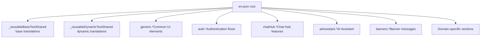
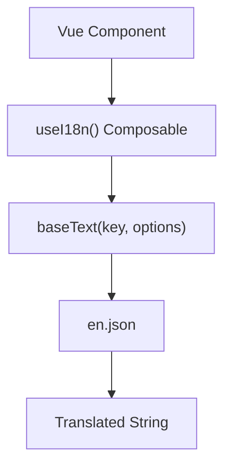
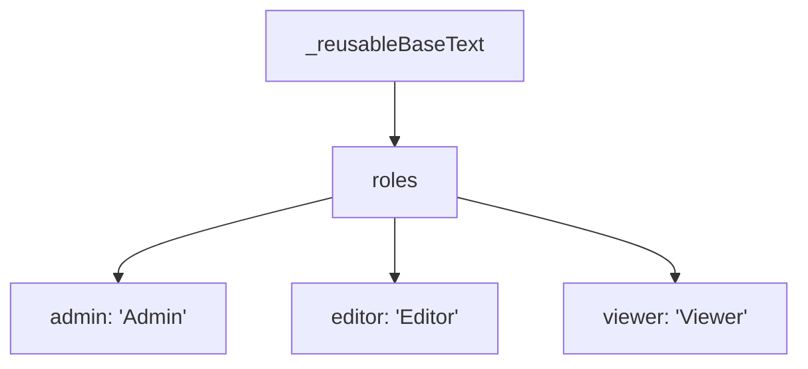

# 国际化与本地化

相关源文件

-   [packages/frontend/@n8n/design-system/src/components/N8nActionToggle/ActionToggle.vue](https://github.com/n8n-io/n8n/blob/88f170b9/packages/frontend/@n8n/design-system/src/components/N8nActionToggle/ActionToggle.vue)
-   [packages/frontend/@n8n/design-system/src/components/N8nBreadcrumbs/Breadcrumbs.vue](https://github.com/n8n-io/n8n/blob/88f170b9/packages/frontend/@n8n/design-system/src/components/N8nBreadcrumbs/Breadcrumbs.vue)
-   [packages/frontend/@n8n/design-system/src/components/N8nBreadcrumbs/__snapshots__/BreadCrumbs.test.ts.snap](https://github.com/n8n-io/n8n/blob/88f170b9/packages/frontend/@n8n/design-system/src/components/N8nBreadcrumbs/__snapshots__/BreadCrumbs.test.ts.snap)
-   [packages/frontend/@n8n/design-system/src/components/N8nIcon/icons.ts](https://github.com/n8n-io/n8n/blob/88f170b9/packages/frontend/@n8n/design-system/src/components/N8nIcon/icons.ts)
-   [packages/frontend/@n8n/design-system/src/components/N8nUserStack/UserStack.vue](https://github.com/n8n-io/n8n/blob/88f170b9/packages/frontend/@n8n/design-system/src/components/N8nUserStack/UserStack.vue)
-   [packages/frontend/@n8n/design-system/src/composables/useParentScroll.ts](https://github.com/n8n-io/n8n/blob/88f170b9/packages/frontend/@n8n/design-system/src/composables/useParentScroll.ts)
-   [packages/frontend/@n8n/i18n/src/locales/en.json](https://github.com/n8n-io/n8n/blob/88f170b9/packages/frontend/@n8n/i18n/src/locales/en.json)
-   [packages/frontend/@n8n/rest-api-client/src/api/index.ts](https://github.com/n8n-io/n8n/blob/88f170b9/packages/frontend/@n8n/rest-api-client/src/api/index.ts)
-   [packages/frontend/editor-ui/src/Interface.ts](https://github.com/n8n-io/n8n/blob/88f170b9/packages/frontend/editor-ui/src/Interface.ts)
-   [packages/frontend/editor-ui/src/app/stores/npsSurvey.store.ts](https://github.com/n8n-io/n8n/blob/88f170b9/packages/frontend/editor-ui/src/app/stores/npsSurvey.store.ts)
-   [packages/frontend/editor-ui/src/features/core/folders/components/FolderCard.vue](https://github.com/n8n-io/n8n/blob/88f170b9/packages/frontend/editor-ui/src/features/core/folders/components/FolderCard.vue)
-   [packages/nodes-base/credentials/SalesforceJwtApi.credentials.ts](https://github.com/n8n-io/n8n/blob/88f170b9/packages/nodes-base/credentials/SalesforceJwtApi.credentials.ts)

本页介绍 n8n 的国际化（i18n）与本地化（l10n）系统，该系统为整个应用提供多语言支持。该系统以 `@n8n/i18n` 包为核心，并与 Vue 3 前端集成，以提供翻译后的用户界面字符串。

有关整体前端架构，请参阅 [6.1 前端架构与状态管理](https://github.com/n8n-io/n8n/blob/88f170b9/6.1 Frontend Architecture and State Management)。有关使用这些翻译的设计系统组件的详细信息，请参阅 [6.4 设计系统与可复用组件](https://github.com/n8n-io/n8n/blob/88f170b9/6.4 Design System and Reusable Components)。

---

## 包结构

n8n 的 i18n 系统作为一个独立包组织在 monorepo 中，位于 `packages/frontend/@n8n/i18n/`。

```
packages/frontend/@n8n/i18n/
├── src/
│   ├── locales/
│   │   └── en.json          # English translations (primary locale)
│   ├── index.ts             # Package exports
│   └── composables/         # Vue composables for i18n
```
该包会为每个受支持的语言区域导出对应的翻译文件、用于在组件中访问翻译的 Vue composable，以及翻译键的类型定义。

**来源：** [packages/frontend/@n8n/i18n/src/locales/en.json1-30](https://github.com/n8n-io/n8n/blob/88f170b9/packages/frontend/@n8n/i18n/src/locales/en.json#L1-L30)

---

## 翻译文件格式

翻译内容存储在 JSON 文件中，使用点号表示法构成层级化键结构。主翻译文件是 `en.json`，它是所有翻译键的事实来源。

### 键结构


**键命名约定：**

| 模式 | 示例 | 用途 |
| --- | --- | --- |
| `generic.*` | `generic.cancel`, `generic.save` | 跨功能共用的常见 UI 字符串 |
| `_reusableBaseText.*` | `_reusableBaseText.roles.admin` | 可复用的基础翻译 |
| `_reusableDynamicText.*` | `_reusableDynamicText.learnMore` | 可复用的动态文本 |
| `[feature].*` | `chatHub.agents.delete.confirm.message` | 功能专用翻译 |
| `[component].*` | `nodeCreator.shortcutCoachmark.title` | 组件专用翻译 |

**来源：** [packages/frontend/@n8n/i18n/src/locales/en.json1-100](https://github.com/n8n-io/n8n/blob/88f170b9/packages/frontend/@n8n/i18n/src/locales/en.json#L1-L100)

---

## 翻译特性

### 插值

变量通过花括号 `{variableName}` 嵌入翻译字符串中。这些变量会在运行时由 `i18n.baseText` 函数替换。

```
{  "generic.openResource": "Open {resource}",  "generic.communityNode.tooltip": "This is a node from our community. It's part of the {packageName} package. <a href=\"{docURL}\" target=\"_blank\" title=\"Read the n8n docs\">Learn more</a>"}
```
**来源：** [packages/frontend/@n8n/i18n/src/locales/en.json52](https://github.com/n8n-io/n8n/blob/88f170b9/packages/frontend/@n8n/i18n/src/locales/en.json#L52-L52) [packages/frontend/@n8n/i18n/src/locales/en.json74](https://github.com/n8n-io/n8n/blob/88f170b9/packages/frontend/@n8n/i18n/src/locales/en.json#L74-L74)

### 复数形式

n8n 使用竖线（`|`）分隔符定义复数规则。该系统通常支持三种形式：零/单数、one 和 multiple。

```
{  "generic.workflow": "Workflow | {count} Workflow | {count} Workflows",  "generic.folderCount": "Folder | {count} Folder | {count} Folders",  "generic.trial.message.days": "1 day left | {count} days left"}
```
**来源：** [packages/frontend/@n8n/i18n/src/locales/en.json128](https://github.com/n8n-io/n8n/blob/88f170b9/packages/frontend/@n8n/i18n/src/locales/en.json#L128-L128) [packages/frontend/@n8n/i18n/src/locales/en.json66](https://github.com/n8n-io/n8n/blob/88f170b9/packages/frontend/@n8n/i18n/src/locales/en.json#L66-L66) [packages/frontend/@n8n/i18n/src/locales/en.json116](https://github.com/n8n-io/n8n/blob/88f170b9/packages/frontend/@n8n/i18n/src/locales/en.json#L116-L116)

### 交叉引用

翻译可以通过 `@:` 前缀引用同一文件中的其他键，以避免重复。

```
{  "_reusableBaseText": {    "roles": {      "admin": "Admin"    }  },  "auth": {    "roles": {      "admin": "@:_reusableBaseText.roles.admin"    }  }}
```
**来源：** [packages/frontend/@n8n/i18n/src/locales/en.json25-29](https://github.com/n8n-io/n8n/blob/88f170b9/packages/frontend/@n8n/i18n/src/locales/en.json#L25-L29)

---

## 前端集成

### useI18n 可组合函数

组件通过 `useI18n()` 可组合函数访问翻译系统。它提供 `baseText` 方法，用于处理键查找、插值和复数形式。


**组件中的使用：**

```
// FolderCard.vue exampleimport { useI18n } from '@n8n/i18n'; const i18n = useI18n(); // Simple translationconst resourceTypeLabel = computed(() => i18n.baseText('generic.folder').toLowerCase()); // Interpolation and Pluralizationconst workflowCountText = i18n.baseText('generic.workflow', {   interpolate: { count: data.workflowCount } });
```
**来源：** [packages/frontend/editor-ui/src/features/core/folders/components/FolderCard.vue5](https://github.com/n8n-io/n8n/blob/88f170b9/packages/frontend/editor-ui/src/features/core/folders/components/FolderCard.vue#L5-L5) [packages/frontend/editor-ui/src/features/core/folders/components/FolderCard.vue40](https://github.com/n8n-io/n8n/blob/88f170b9/packages/frontend/editor-ui/src/features/core/folders/components/FolderCard.vue#L40-L40) [packages/frontend/editor-ui/src/features/core/folders/components/FolderCard.vue54](https://github.com/n8n-io/n8n/blob/88f170b9/packages/frontend/editor-ui/src/features/core/folders/components/FolderCard.vue#L54-L54) [packages/frontend/editor-ui/src/features/core/folders/components/FolderCard.vue168](https://github.com/n8n-io/n8n/blob/88f170b9/packages/frontend/editor-ui/src/features/core/folders/components/FolderCard.vue#L168-L168)

---

## 键组织方式

### 常用翻译分区

| 分区 | 用途 |
| --- | --- |
| `_reusableBaseText` | 基础字符串，例如“保存”“取消”和用户角色。 |
| `_reusableDynamicText` | 链接和常见动态 UI 元素，例如“了解更多”。 |
| `generic.*` | 工作流、凭据和文件夹的共享 UI 标签。 |
| `about.*` | 版本信息和许可证详情。 |

**来源：** [packages/frontend/@n8n/i18n/src/locales/en.json2-39](https://github.com/n8n-io/n8n/blob/88f170b9/packages/frontend/@n8n/i18n/src/locales/en.json#L2-L39) [packages/frontend/@n8n/i18n/src/locales/en.json40-164](https://github.com/n8n-io/n8n/blob/88f170b9/packages/frontend/@n8n/i18n/src/locales/en.json#L40-L164) [packages/frontend/@n8n/i18n/src/locales/en.json165-178](https://github.com/n8n-io/n8n/blob/88f170b9/packages/frontend/@n8n/i18n/src/locales/en.json#L165-L178)

### 可复用文本映射

`_reusableBaseText` 部分专为在整个应用中最大程度复用而设计，以确保术语一致性（例如使用“Admin”而不是“Administrator”）。


**来源：** [packages/frontend/@n8n/i18n/src/locales/en.json25-29](https://github.com/n8n-io/n8n/blob/88f170b9/packages/frontend/@n8n/i18n/src/locales/en.json#L25-L29)

---

## 与设计系统集成

`@n8n/design-system` 中的组件通常不会包含硬编码字符串。相反，它们会将已翻译的标签作为 props 接收。

### N8nBreadcrumbs 示例

`N8nBreadcrumbs` 组件接受包含 `label` 属性的 `PathItem` 对象。该标签会先由父组件翻译，再传递给设计系统。

```
export type PathItem = {    id: string;    label: string;    href?: string;};
```
在 `FolderCard.vue` 中，面包屑是通过 `i18n` 实例生成的：

```
const cardBreadcrumbs = computed<PathItem[]>(() => {    // ... logic to get parent folder name    return [{        id: folder.id,        label: folder.name, // Pre-translated or dynamic data        href: url    }];});
```
**来源：** [packages/frontend/@n8n/design-system/src/components/N8nBreadcrumbs/Breadcrumbs.vue11-15](https://github.com/n8n-io/n8n/blob/88f170b9/packages/frontend/@n8n/design-system/src/components/N8nBreadcrumbs/Breadcrumbs.vue#L11-L15) [packages/frontend/editor-ui/src/features/core/folders/components/FolderCard.vue67-85](https://github.com/n8n-io/n8n/blob/88f170b9/packages/frontend/editor-ui/src/features/core/folders/components/FolderCard.vue#L67-L85)

---

## 动态内容本地化

虽然 i18n 系统处理静态 UI 字符串，但 n8n 也会本地化动态元数据：

1.  **节点/凭据显示名称**：定义在后端类中（例如 `SalesforceJwtApi.displayName = 'Salesforce JWT API'`）。
2.  **时间格式化**：由 `TimeAgo.vue` 组件和 `moment-timezone` 库处理。
3.  **图标**：通过 `N8nIcon` 组件管理，该组件会将图标名称映射到 SVG 资源。

**来源：** [packages/nodes-base/credentials/SalesforceJwtApi.credentials.ts17](https://github.com/n8n-io/n8n/blob/88f170b9/packages/nodes-base/credentials/SalesforceJwtApi.credentials.ts#L17-L17) [packages/frontend/editor-ui/src/features/core/folders/components/FolderCard.vue13](https://github.com/n8n-io/n8n/blob/88f170b9/packages/frontend/editor-ui/src/features/core/folders/components/FolderCard.vue#L13-L13) [packages/frontend/@n8n/design-system/src/components/N8nIcon/icons.ts1-37](https://github.com/n8n-io/n8n/blob/88f170b9/packages/frontend/@n8n/design-system/src/components/N8nIcon/icons.ts#L1-L37)

---

## 实现模式

### 确认弹窗模式

确认类翻译通常采用标题和消息的模式：

```
{  "generic.unsavedWork.confirmMessage.headline": "Save changes before leaving?",  "generic.unsavedWork.confirmMessage.message": "If you don't save, you might lose your changes.",  "generic.unsavedWork.confirmMessage.confirmButtonText": "Save",  "generic.unsavedWork.confirmMessage.cancelButtonText": "Leave without saving"}
```
**来源：** [packages/frontend/@n8n/i18n/src/locales/en.json112-115](https://github.com/n8n-io/n8n/blob/88f170b9/packages/frontend/@n8n/i18n/src/locales/en.json#L112-L115)

### 错误处理

错误会使用特定键进行翻译，以提供更友好的消息，而不是直接展示原始后端错误：

```
{  "generic.error": "Something went wrong",  "generic.error.subworkflowCreationFailed": "Error creating sub-workflow",  "generic.unknownError": "An unknown error occurred"}
```
**来源：** [packages/frontend/@n8n/i18n/src/locales/en.json100-101](https://github.com/n8n-io/n8n/blob/88f170b9/packages/frontend/@n8n/i18n/src/locales/en.json#L100-L101) [packages/frontend/@n8n/i18n/src/locales/en.json148](https://github.com/n8n-io/n8n/blob/88f170b9/packages/frontend/@n8n/i18n/src/locales/en.json#L148-L148)
