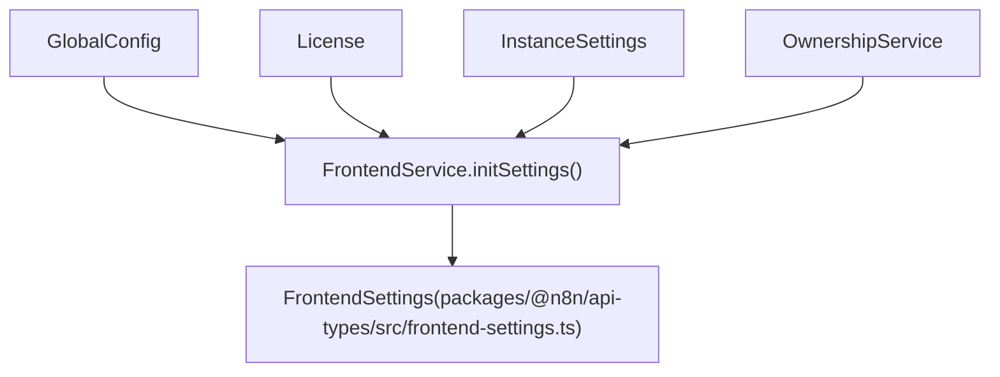
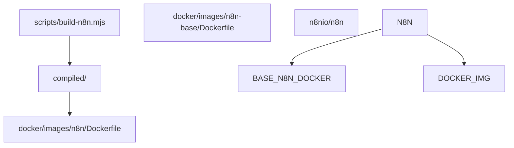

# 配置与部署

相关源文件

-   [.dockerignore](https://github.com/n8n-io/n8n/blob/88f170b9/.dockerignore)
-   [.github/scripts/docker/docker-config.mjs](https://github.com/n8n-io/n8n/blob/88f170b9/.github/scripts/docker/docker-config.mjs)
-   [.github/scripts/docker/docker-tags.mjs](https://github.com/n8n-io/n8n/blob/88f170b9/.github/scripts/docker/docker-tags.mjs)
-   [.github/workflows/docker-build-push.yml](https://github.com/n8n-io/n8n/blob/88f170b9/.github/workflows/docker-build-push.yml)
-   [docker/images/n8n-base/Dockerfile](https://github.com/n8n-io/n8n/blob/88f170b9/docker/images/n8n-base/Dockerfile)
-   [docker/images/n8n/Dockerfile](https://github.com/n8n-io/n8n/blob/88f170b9/docker/images/n8n/Dockerfile)
-   [docker/images/runners/Dockerfile](https://github.com/n8n-io/n8n/blob/88f170b9/docker/images/runners/Dockerfile)
-   [docker/images/runners/Dockerfile.distroless](https://github.com/n8n-io/n8n/blob/88f170b9/docker/images/runners/Dockerfile.distroless)
-   [docker/images/runners/README.md](https://github.com/n8n-io/n8n/blob/88f170b9/docker/images/runners/README.md?plain=1)
-   [packages/@n8n/api-types/src/frontend-settings.ts](https://github.com/n8n-io/n8n/blob/88f170b9/packages/@n8n/api-types/src/frontend-settings.ts)
-   [packages/@n8n/api-types/src/push/collaboration.ts](https://github.com/n8n-io/n8n/blob/88f170b9/packages/@n8n/api-types/src/push/collaboration.ts)
-   [packages/@n8n/backend-common/src/license-state.ts](https://github.com/n8n-io/n8n/blob/88f170b9/packages/@n8n/backend-common/src/license-state.ts)
-   [packages/@n8n/benchmark/Dockerfile](https://github.com/n8n-io/n8n/blob/88f170b9/packages/@n8n/benchmark/Dockerfile)
-   [packages/@n8n/config/src/decorators.ts](https://github.com/n8n-io/n8n/blob/88f170b9/packages/@n8n/config/src/decorators.ts)
-   [packages/@n8n/config/src/index.ts](https://github.com/n8n-io/n8n/blob/88f170b9/packages/@n8n/config/src/index.ts)
-   [packages/@n8n/config/test/config.test.ts](https://github.com/n8n-io/n8n/blob/88f170b9/packages/@n8n/config/test/config.test.ts)
-   [packages/@n8n/config/test/decorators.test.ts](https://github.com/n8n-io/n8n/blob/88f170b9/packages/@n8n/config/test/decorators.test.ts)
-   [packages/@n8n/config/test/string-normalization.test.ts](https://github.com/n8n-io/n8n/blob/88f170b9/packages/@n8n/config/test/string-normalization.test.ts)
-   [packages/@n8n/constants/src/index.ts](https://github.com/n8n-io/n8n/blob/88f170b9/packages/@n8n/constants/src/index.ts)
-   [packages/cli/src/__tests__/license.test.ts](https://github.com/n8n-io/n8n/blob/88f170b9/packages/cli/src/__tests__/license.test.ts)
-   [packages/cli/src/commands/base-command.ts](https://github.com/n8n-io/n8n/blob/88f170b9/packages/cli/src/commands/base-command.ts)
-   [packages/cli/src/commands/start.ts](https://github.com/n8n-io/n8n/blob/88f170b9/packages/cli/src/commands/start.ts)
-   [packages/cli/src/commands/webhook.ts](https://github.com/n8n-io/n8n/blob/88f170b9/packages/cli/src/commands/webhook.ts)
-   [packages/cli/src/commands/worker.ts](https://github.com/n8n-io/n8n/blob/88f170b9/packages/cli/src/commands/worker.ts)
-   [packages/cli/src/config/index.ts](https://github.com/n8n-io/n8n/blob/88f170b9/packages/cli/src/config/index.ts)
-   [packages/cli/src/config/schema.ts](https://github.com/n8n-io/n8n/blob/88f170b9/packages/cli/src/config/schema.ts)
-   [packages/cli/src/constants.ts](https://github.com/n8n-io/n8n/blob/88f170b9/packages/cli/src/constants.ts)
-   [packages/cli/src/controllers/e2e.controller.ts](https://github.com/n8n-io/n8n/blob/88f170b9/packages/cli/src/controllers/e2e.controller.ts)
-   [packages/cli/src/errors/response-errors/locked.error.ts](https://github.com/n8n-io/n8n/blob/88f170b9/packages/cli/src/errors/response-errors/locked.error.ts)
-   [packages/cli/src/license.ts](https://github.com/n8n-io/n8n/blob/88f170b9/packages/cli/src/license.ts)
-   [packages/cli/src/services/__tests__/frontend.service.test.ts](https://github.com/n8n-io/n8n/blob/88f170b9/packages/cli/src/services/__tests__/frontend.service.test.ts)
-   [packages/cli/src/services/frontend.service.ts](https://github.com/n8n-io/n8n/blob/88f170b9/packages/cli/src/services/frontend.service.ts)
-   [packages/cli/test/integration/commands/worker.cmd.test.ts](https://github.com/n8n-io/n8n/blob/88f170b9/packages/cli/test/integration/commands/worker.cmd.test.ts)
-   [packages/frontend/@n8n/design-system/src/components/CanvasCollaborationPill/CanvasCollaborationPill.vue](https://github.com/n8n-io/n8n/blob/88f170b9/packages/frontend/@n8n/design-system/src/components/CanvasCollaborationPill/CanvasCollaborationPill.vue)
-   [packages/frontend/@n8n/design-system/src/components/N8nLogo/Logo.vue](https://github.com/n8n-io/n8n/blob/88f170b9/packages/frontend/@n8n/design-system/src/components/N8nLogo/Logo.vue)
-   [packages/frontend/@n8n/stores/src/useRootStore.ts](https://github.com/n8n-io/n8n/blob/88f170b9/packages/frontend/@n8n/stores/src/useRootStore.ts)
-   [packages/frontend/editor-ui/src/__tests__/defaults.ts](https://github.com/n8n-io/n8n/blob/88f170b9/packages/frontend/editor-ui/src/__tests__/defaults.ts)
-   [packages/frontend/editor-ui/src/app/components/MainHeader/TabBar.vue](https://github.com/n8n-io/n8n/blob/88f170b9/packages/frontend/editor-ui/src/app/components/MainHeader/TabBar.vue)
-   [packages/frontend/editor-ui/src/app/stores/settings.store.test.ts](https://github.com/n8n-io/n8n/blob/88f170b9/packages/frontend/editor-ui/src/app/stores/settings.store.test.ts)
-   [packages/frontend/editor-ui/src/app/stores/settings.store.ts](https://github.com/n8n-io/n8n/blob/88f170b9/packages/frontend/editor-ui/src/app/stores/settings.store.ts)
-   [scripts/build-n8n.mjs](https://github.com/n8n-io/n8n/blob/88f170b9/scripts/build-n8n.mjs)

本页面概述了 n8n 如何在其支持的运行模式和基础设施环境中进行配置和部署。内容涵盖了配置系统、CLI 命令、Docker 打包、任务运行器（Task Runner）部署、许可证管理以及可观测性。

有关每个主题的详细说明，请参阅子页面：

-   **[配置系统 (Configuration System)](/n8n-io/n8n/7.1-configuration-system)** — `GlobalConfig`、环境变量映射、`FrontendSettings`
-   **[CLI 命令与执行模式 (CLI Commands and Execution Modes)](/n8n-io/n8n/7.2-cli-commands-and-execution-modes)** — `start`、`worker`、`webhook` 命令及启动生命周期
-   **[Docker 部署 (Docker Deployment)](/n8n-io/n8n/7.3-docker-deployment)** — 主镜像、运行器边车（Runners Sidecar）、构建流水线
-   **[任务运行器与沙箱执行 (Task Runners and Sandboxed Execution)](/n8n-io/n8n/7.4-task-runners-and-sandboxed-execution)** — JS/Python 沙箱、`TaskBrokerService`
-   **[许可证管理与特性标志 (License Management and Feature Flags)](/n8n-io/n8n/7.5-license-management-and-feature-flags)** — `License` 类、特性标志、自动续期
-   **[可观测性与遥测 (Observability and Telemetry)](/n8n-io/n8n/7.6-observability-and-telemetry)** — `EventService`、遥测中继、Sentry
-   **[数据存储与洞察模块 (Data Store and Insights Modules)](/n8n-io/n8n/7.7-data-store-and-insights-modules)** — `DataTable` 和 `Insights` 后端模块

---

## 配置架构 (Configuration Architecture)

所有运行时配置都集中在 `@n8n/config` 包中。根类是 `GlobalConfig`，声明于 [packages/@n8n/config/src/index.ts75-230](https://github.com/n8n-io/n8n/blob/88f170b9/packages/@n8n/config/src/index.ts#L75-L230)，它由大约 40 个嵌套配置子类组成。这些类使用 [packages/@n8n/config/src/decorators.ts](https://github.com/n8n-io/n8n/blob/88f170b9/packages/@n8n/config/src/decorators.ts) 中定义的装饰器将环境变量映射到类型属性：

| 装饰器 | 作用 |
| --- | --- |
| `@Config` | 将类标记为依赖注入 (DI) 管理的配置节点 [packages/@n8n/config/src/decorators.ts10](https://github.com/n8n-io/n8n/blob/88f170b9/packages/@n8n/config/src/decorators.ts#L10-L10) |
| `@Env('NAME')` | 将属性绑定到环境变量，支持可选的 Zod 验证 [packages/@n8n/config/src/decorators.ts25](https://github.com/n8n-io/n8n/blob/88f170b9/packages/@n8n/config/src/decorators.ts#L25-L25) |
| `@Nested` | 将子配置类组合到父级层级中 [packages/@n8n/config/src/decorators.ts38](https://github.com/n8n-io/n8n/blob/88f170b9/packages/@n8n/config/src/decorators.ts#L38-L38) |

`GlobalConfig` 已在 `@n8n/di` 中注册，允许任何服务通过构造函数注入接收完整的配置树。

**GlobalConfig 组成 — 部分嵌套类：**

| 属性 | 类 | 关键环境变量 |
| --- | --- | --- |
| `database` | `DatabaseConfig` | `DB_TYPE`, `DB_POSTGRESDB_HOST` [packages/@n8n/config/src/index.ts80](https://github.com/n8n-io/n8n/blob/88f170b9/packages/@n8n/config/src/index.ts#L80-L80) |
| `executions` | `ExecutionsConfig` | `EXECUTIONS_MODE`, `EXECUTIONS_TIMEOUT` [packages/@n8n/config/src/index.ts163](https://github.com/n8n-io/n8n/blob/88f170b9/packages/@n8n/config/src/index.ts#L163-L163) |
| `taskRunners` | `TaskRunnersConfig` | `N8N_RUNNERS_MODE`, `N8N_RUNNERS_ENABLED` [packages/@n8n/config/src/index.ts148](https://github.com/n8n-io/n8n/blob/88f170b9/packages/@n8n/config/src/index.ts#L148-L148) |
| `license` | `LicenseConfig` | `N8N_LICENSE_SERVER_URL` [packages/@n8n/config/src/index.ts157](https://github.com/n8n-io/n8n/blob/88f170b9/packages/@n8n/config/src/index.ts#L157-L157) |
| `security` | `SecurityConfig` | `N8N_BLOCK_FILE_ACCESS_TO_N8N_FILES` [packages/@n8n/config/src/index.ts160](https://github.com/n8n-io/n8n/blob/88f170b9/packages/@n8n/config/src/index.ts#L160-L160) |
| `queue` | `ScalingModeConfig` | `QUEUE_BULL_REDIS_HOST` [packages/@n8n/config/src/index.ts142](https://github.com/n8n-io/n8n/blob/88f170b9/packages/@n8n/config/src/index.ts#L142-L142) |
| `ai` | `AiConfig` | `N8N_AI_ENABLED` [packages/cli/src/config/schema.ts44-54](https://github.com/n8n-io/n8n/blob/88f170b9/packages/cli/src/config/schema.ts#L44-L54) |

秘密信息支持 `_FILE` 变体。如果设置了 `DB_POSTGRESDB_PASSWORD_FILE`，系统将读取文件内容，修剪空白字符，并在发现尾随空格时发出警告 [packages/cli/src/config/index.ts38-63](https://github.com/n8n-io/n8n/blob/88f170b9/packages/cli/src/config/index.ts#L38-L63)。

**GlobalConfig 类层级：**

```mermaid
flowchart TD
    GC["GlobalConfig(@n8n/config)"]
    DB["database: DatabaseConfig"]
    EX["executions: ExecutionsConfig"]
    EP["endpoints: EndpointsConfig"]
    QU["queue: ScalingModeConfig"]
    TR["taskRunners: TaskRunnersConfig"]
    LC["license: LicenseConfig"]
    SC["security: SecurityConfig"]
    LG["logging: LoggingConfig"]
    SS["sso: SsoConfig"]
    DG["diagnostics: DiagnosticsConfig"]
    SR["sentry: SentryConfig"]
    MM["multiMainSetup: MultiMainSetupConfig"]
    CA["cache: CacheConfig"]
    UM["userManagement: UserManagementConfig"]

    GC --> DB
    GC --> EX
    GC --> EP
    GC --> QU
    GC --> TR
    GC --> LC
    GC --> SC
    GC --> LG
    GC --> SS
    GC --> DG
    GC --> SR
    GC --> MM
    GC --> CA
    GC --> UM
```

来源：[packages/@n8n/config/src/index.ts75-230](https://github.com/n8n-io/n8n/blob/88f170b9/packages/@n8n/config/src/index.ts#L75-L230) [packages/cli/src/config/index.ts1-74](https://github.com/n8n-io/n8n/blob/88f170b9/packages/cli/src/config/index.ts#L1-L74) [packages/@n8n/config/src/decorators.ts1-40](https://github.com/n8n-io/n8n/blob/88f170b9/packages/@n8n/config/src/decorators.ts#L1-L40)

---

## 进程模式与 CLI 命令 (Process Modes and CLI Commands)

n8n 作为三种主要进程类型之一运行，每种类型都通过扩展 `BaseCommand` 的 CLI 命令启动 [packages/cli/src/commands/base-command.ts43](https://github.com/n8n-io/n8n/blob/88f170b9/packages/cli/src/commands/base-command.ts#L43-L43)：

| 命令类 | CLI 调用 | 进程角色 |
| --- | --- | --- |
| `Start` | `n8n start` | 主进程：HTTP 服务器、工作流激活、UI 服务 [packages/cli/src/commands/start.ts55](https://github.com/n8n-io/n8n/blob/88f170b9/packages/cli/src/commands/start.ts#L55-L55) |
| `Worker` | `n8n worker` | 队列工作器：从 Redis 消费 BullMQ 任务 [packages/cli/src/commands/worker.ts32](https://github.com/n8n-io/n8n/blob/88f170b9/packages/cli/src/commands/worker.ts#L32-L32) |
| `Webhook` | `n8n webhook` | 专门的生产环境 Webhook 处理器（仅限队列模式） [packages/cli/src/commands/webhook.ts1-10](https://github.com/n8n-io/n8n/blob/88f170b9/packages/cli/src/commands/webhook.ts#L1-L10) |

`BaseCommand.init()` 处理共享初始化序列：

1.  初始化 `ErrorReporter` (Sentry) [packages/cli/src/commands/base-command.ts96-116](https://github.com/n8n-io/n8n/blob/88f170b9/packages/cli/src/commands/base-command.ts#L96-L116)
2.  初始化 `DbConnection` 并运行迁移 [packages/cli/src/commands/base-command.ts125-145](https://github.com/n8n-io/n8n/blob/88f170b9/packages/cli/src/commands/base-command.ts#L125-L145)
3.  加载节点类型和凭据 [packages/cli/src/commands/base-command.ts123](https://github.com/n8n-io/n8n/blob/88f170b9/packages/cli/src/commands/base-command.ts#L123-L123)
4.  如果需要，启动 `TaskRunnerModule` [packages/cli/src/commands/base-command.ts170-178](https://github.com/n8n-io/n8n/blob/88f170b9/packages/cli/src/commands/base-command.ts#L170-L178)

**进程启动流程：**

> **[Mermaid sequence]**
> *(图表结构无法解析)*

来源：[packages/cli/src/commands/base-command.ts84-186](https://github.com/n8n-io/n8n/blob/88f170b9/packages/cli/src/commands/base-command.ts#L84-L186) [packages/cli/src/commands/start.ts189-210](https://github.com/n8n-io/n8n/blob/88f170b9/packages/cli/src/commands/start.ts#L189-210) [packages/cli/src/commands/worker.ts74-126](https://github.com/n8n-io/n8n/blob/88f170b9/packages/cli/src/commands/worker.ts#L74-L126)

---

## 前端设置流 (Frontend Settings Flow)

`FrontendService` 组装提供给 Vue SPA 的 `FrontendSettings` 对象。它根据许可证和环境变量确定 UI 行为 [packages/cli/src/services/frontend.service.ts105-139](https://github.com/n8n-io/n8n/blob/88f170b9/packages/cli/src/services/frontend.service.ts#L105-L139)。

`FrontendSettings` 类型包括：

-   **Endpoints**: 表单、Webhook 和健康检查的路径 [packages/@n8n/api-types/src/frontend-settings.ts74-82](https://github.com/n8n-io/n8n/blob/88f170b9/packages/@n8n/api-types/src/frontend-settings.ts#L74-L82)
-   **Enterprise Features**: SSO、LDAP 和日志流的布尔标志 [packages/@n8n/api-types/src/frontend-settings.ts40-67](https://github.com/n8n-io/n8n/blob/88f170b9/packages/@n8n/api-types/src/frontend-settings.ts#L40-L67)
-   **Environment**: Node 版本、n8n 版本和发布渠道 [packages/@n8n/api-types/src/frontend-settings.ts97-105](https://github.com/n8n-io/n8n/blob/88f170b9/packages/@n8n/api-types/src/frontend-settings.ts#L97-L105)

**设置推导：**

来源：[packages/cli/src/services/frontend.service.ts160-237](https://github.com/n8n-io/n8n/blob/88f170b9/packages/cli/src/services/frontend.service.ts#L160-L237) [packages/@n8n/api-types/src/frontend-settings.ts69-237](https://github.com/n8n-io/n8n/blob/88f170b9/packages/@n8n/api-types/src/frontend-settings.ts#L69-L237)

---

## Docker 部署概述 (Docker Deployment Overview)

n8n Docker 镜像是使用多阶段 `Dockerfile` 构建的 [docker/images/n8n/Dockerfile1-39](https://github.com/n8n-io/n8n/blob/88f170b9/docker/images/n8n/Dockerfile#L1-L39)。

| 镜像 | 基础镜像 | 用途 |
| --- | --- | --- |
| `n8nio/n8n` | `n8nio/base` | 主应用镜像 [docker/images/n8n/Dockerfile12](https://github.com/n8n-io/n8n/blob/88f170b9/docker/images/n8n/Dockerfile#L12-L12) |
| `n8nio/runners` | `node:alpine` | 用于沙箱执行的任务运行器边车 [docker/images/runners/Dockerfile1-10](https://github.com/n8n-io/n8n/blob/88f170b9/docker/images/runners/Dockerfile#L1-L10) |

主镜像使用 `tini` 作为初始化进程并执行 `/docker-entrypoint.sh` [docker/images/n8n/Dockerfile32](https://github.com/n8n-io/n8n/blob/88f170b9/docker/images/n8n/Dockerfile#L32-L32)。它暴露端口 `5678` [docker/images/n8n/Dockerfile30](https://github.com/n8n-io/n8n/blob/88f170b9/docker/images/n8n/Dockerfile#L30-L30)。

**Docker 构建流水线：**

来源：[docker/images/n8n/Dockerfile1-39](https://github.com/n8n-io/n8n/blob/88f170b9/docker/images/n8n/Dockerfile#L1-L39) [scripts/build-n8n.mjs1-50](https://github.com/n8n-io/n8n/blob/88f170b9/scripts/build-n8n.mjs#L1-L50)

---

## 许可证管理概述 (License Management Overview)

`License` 服务管理企业级功能的激活和功能门控 [packages/cli/src/license.ts36-51](https://github.com/n8n-io/n8n/blob/88f170b9/packages/cli/src/license.ts#L36-L51)。它封装了来自 `@n8n_io/license-sdk` 的 `LicenseManager`。

-   **激活 (Activation)**: 通过 `activate(activationKey)` 执行 [packages/cli/src/license.ts203-210](https://github.com/n8n-io/n8n/blob/88f170b9/packages/cli/src/license.ts#L203-L210)。
-   **存储 (Storage)**: 许可证证书存储在 `SettingsRepository` 中，键名为 `license.cert` [packages/cli/src/license.ts168](https://github.com/n8n-io/n8n/blob/88f170b9/packages/cli/src/license.ts#L168-L168)。
-   **配额 (Quotas)**: 通过 `LICENSE_QUOTAS` 和 `UNLIMITED_LICENSE_QUOTA` 等常量进行管理 [packages/cli/src/license.ts7-9](https://github.com/n8n-io/n8n/blob/88f170b9/packages/cli/src/license.ts#L7-L9)。

许可证变更会通过发布订阅（PubSub）`Publisher` 触发集群范围内的 `reload-license` 命令 [packages/cli/src/license.ts156-161](https://github.com/n8n-io/n8n/blob/88f170b9/packages/cli/src/license.ts#L156-L161)。

来源：[packages/cli/src/license.ts53-129](https://github.com/n8n-io/n8n/blob/88f170b9/packages/cli/src/license.ts#L53-L129) [packages/@n8n/constants/src/index.ts82](https://github.com/n8n-io/n8n/blob/88f170b9/packages/@n8n/constants/src/index.ts#L82-L82)

---

## 可观测性概述 (Observability Overview)

可观测性是通过遥测、日志和错误报告相结合的方式处理的。

-   **Sentry**: 在 `BaseCommand.init()` 中使用 `GlobalConfig.sentry` 进行配置 [packages/cli/src/commands/base-command.ts96-116](https://github.com/n8n-io/n8n/blob/88f170b9/packages/cli/src/commands/base-command.ts#L96-L116)。
-   **遥测 (Telemetry)**: `TelemetryEventRelay` 将事件转发到 PostHog/RudderStack [packages/cli/src/commands/base-command.ts184](https://github.com/n8n-io/n8n/blob/88f170b9/packages/cli/src/commands/base-command.ts#L184-L184)。
-   **日志 (Logging)**: `LoggingConfig` 确定日志级别和范围 [packages/@n8n/config/src/index.ts145](https://github.com/n8n-io/n8n/blob/88f170b9/packages/@n8n/config/src/index.ts#L145-L145)。

`Start` 命令还为前端生成配置元标签（Meta Tags），包括 Sentry DSN 和 REST 端点路径，这些标签在运行时被注入到 `index.html` 中 [packages/cli/src/commands/start.ts123-142](https://github.com/n8n-io/n8n/blob/88f170b9/packages/cli/src/commands/start.ts#L123-L142)。

来源：[packages/cli/src/commands/base-command.ts84-186](https://github.com/n8n-io/n8n/blob/88f170b9/packages/cli/src/commands/base-command.ts#L84-L186) [packages/cli/src/commands/start.ts123-142](https://github.com/n8n-io/n8n/blob/88f170b9/packages/cli/src/commands/start.ts#L123-L142)
