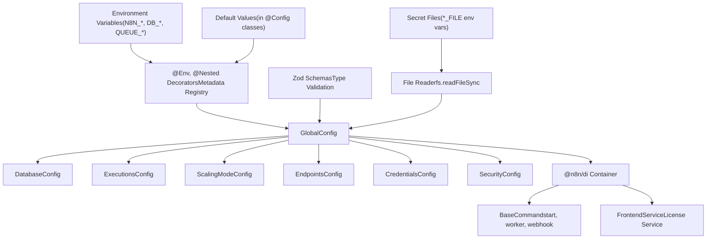
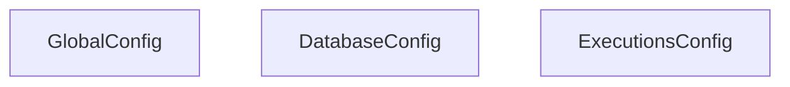
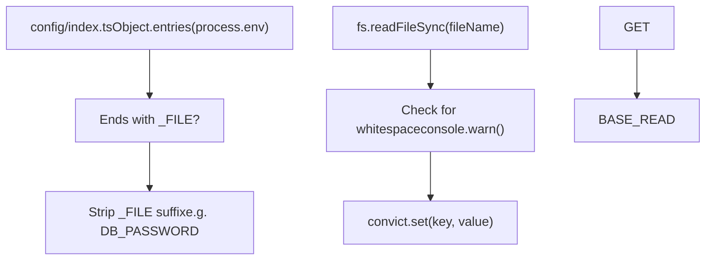
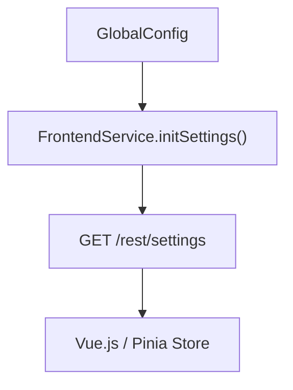

# 配置系统 (Configuration System)

相关源文件

-   [packages/@n8n/api-types/src/frontend-settings.ts](https://github.com/n8n-io/n8n/blob/88f170b9/packages/@n8n/api-types/src/frontend-settings.ts)
-   [packages/@n8n/api-types/src/push/collaboration.ts](https://github.com/n8n-io/n8n/blob/88f170b9/packages/@n8n/api-types/src/push/collaboration.ts)
-   [packages/@n8n/backend-common/src/license-state.ts](https://github.com/n8n-io/n8n/blob/88f170b9/packages/@n8n/backend-common/src/license-state.ts)
-   [packages/@n8n/config/src/configs/cache.config.ts](https://github.com/n8n-io/n8n/blob/88f170b9/packages/@n8n/config/src/configs/cache.config.ts)
-   [packages/@n8n/config/src/configs/credentials.config.ts](https://github.com/n8n-io/n8n/blob/88f170b9/packages/@n8n/config/src/configs/credentials.config.ts)
-   [packages/@n8n/config/src/configs/database.config.ts](https://github.com/n8n-io/n8n/blob/88f170b9/packages/@n8n/config/src/configs/database.config.ts)
-   [packages/@n8n/config/src/configs/event-bus.config.ts](https://github.com/n8n-io/n8n/blob/88f170b9/packages/@n8n/config/src/configs/event-bus.config.ts)
-   [packages/@n8n/config/src/configs/nodes.config.ts](https://github.com/n8n-io/n8n/blob/88f170b9/packages/@n8n/config/src/configs/nodes.config.ts)
-   [packages/@n8n/config/src/configs/public-api.config.ts](https://github.com/n8n-io/n8n/blob/88f170b9/packages/@n8n/config/src/configs/public-api.config.ts)
-   [packages/@n8n/config/src/configs/templates.config.ts](https://github.com/n8n-io/n8n/blob/88f170b9/packages/@n8n/config/src/configs/templates.config.ts)
-   [packages/@n8n/config/src/configs/user-management.config.ts](https://github.com/n8n-io/n8n/blob/88f170b9/packages/@n8n/config/src/configs/user-management.config.ts)
-   [packages/@n8n/config/src/configs/version-notifications.config.ts](https://github.com/n8n-io/n8n/blob/88f170b9/packages/@n8n/config/src/configs/version-notifications.config.ts)
-   [packages/@n8n/config/src/configs/workflows.config.ts](https://github.com/n8n-io/n8n/blob/88f170b9/packages/@n8n/config/src/configs/workflows.config.ts)
-   [packages/@n8n/config/src/decorators.ts](https://github.com/n8n-io/n8n/blob/88f170b9/packages/@n8n/config/src/decorators.ts)
-   [packages/@n8n/config/src/index.ts](https://github.com/n8n-io/n8n/blob/88f170b9/packages/@n8n/config/src/index.ts)
-   [packages/@n8n/config/test/config.test.ts](https://github.com/n8n-io/n8n/blob/88f170b9/packages/@n8n/config/test/config.test.ts)
-   [packages/@n8n/config/test/decorators.test.ts](https://github.com/n8n-io/n8n/blob/88f170b9/packages/@n8n/config/test/decorators.test.ts)
-   [packages/@n8n/config/test/string-normalization.test.ts](https://github.com/n8n-io/n8n/blob/88f170b9/packages/@n8n/config/test/string-normalization.test.ts)
-   [packages/@n8n/constants/src/index.ts](https://github.com/n8n-io/n8n/blob/88f170b9/packages/@n8n/constants/src/index.ts)
-   [packages/@n8n/db/src/connection/__tests__/db-connection-options.test.ts](https://github.com/n8n-io/n8n/blob/88f170b9/packages/@n8n/db/src/connection/__tests__/db-connection-options.test.ts)
-   [packages/@n8n/db/src/connection/db-connection-options.ts](https://github.com/n8n-io/n8n/blob/88f170b9/packages/@n8n/db/src/connection/db-connection-options.ts)
-   [packages/@n8n/db/src/entities/workflow-dependency-entity.ts](https://github.com/n8n-io/n8n/blob/88f170b9/packages/@n8n/db/src/entities/workflow-dependency-entity.ts)
-   [packages/@n8n/db/src/repositories/workflow-dependency.repository.ts](https://github.com/n8n-io/n8n/blob/88f170b9/packages/@n8n/db/src/repositories/workflow-dependency.repository.ts)
-   [packages/cli/src/__tests__/credentials-overwrites.test.ts](https://github.com/n8n-io/n8n/blob/88f170b9/packages/cli/src/__tests__/credentials-overwrites.test.ts)
-   [packages/cli/src/__tests__/license.test.ts](https://github.com/n8n-io/n8n/blob/88f170b9/packages/cli/src/__tests__/license.test.ts)
-   [packages/cli/src/__tests__/node-types.test.ts](https://github.com/n8n-io/n8n/blob/88f170b9/packages/cli/src/__tests__/node-types.test.ts)
-   [packages/cli/src/commands/base-command.ts](https://github.com/n8n-io/n8n/blob/88f170b9/packages/cli/src/commands/base-command.ts)
-   [packages/cli/src/commands/start.ts](https://github.com/n8n-io/n8n/blob/88f170b9/packages/cli/src/commands/start.ts)
-   [packages/cli/src/commands/webhook.ts](https://github.com/n8n-io/n8n/blob/88f170b9/packages/cli/src/commands/webhook.ts)
-   [packages/cli/src/commands/worker.ts](https://github.com/n8n-io/n8n/blob/88f170b9/packages/cli/src/commands/worker.ts)
-   [packages/cli/src/config/index.ts](https://github.com/n8n-io/n8n/blob/88f170b9/packages/cli/src/config/index.ts)
-   [packages/cli/src/config/schema.ts](https://github.com/n8n-io/n8n/blob/88f170b9/packages/cli/src/config/schema.ts)
-   [packages/cli/src/constants.ts](https://github.com/n8n-io/n8n/blob/88f170b9/packages/cli/src/constants.ts)
-   [packages/cli/src/controllers/e2e.controller.ts](https://github.com/n8n-io/n8n/blob/88f170b9/packages/cli/src/controllers/e2e.controller.ts)
-   [packages/cli/src/credentials-overwrites.ts](https://github.com/n8n-io/n8n/blob/88f170b9/packages/cli/src/credentials-overwrites.ts)
-   [packages/cli/src/errors/response-errors/locked.error.ts](https://github.com/n8n-io/n8n/blob/88f170b9/packages/cli/src/errors/response-errors/locked.error.ts)
-   [packages/cli/src/license.ts](https://github.com/n8n-io/n8n/blob/88f170b9/packages/cli/src/license.ts)
-   [packages/cli/src/modules/workflow-index/__tests__/workflow-index.service.test.ts](https://github.com/n8n-io/n8n/blob/88f170b9/packages/cli/src/modules/workflow-index/__tests__/workflow-index.service.test.ts)
-   [packages/cli/src/modules/workflow-index/workflow-index.service.ts](https://github.com/n8n-io/n8n/blob/88f170b9/packages/cli/src/modules/workflow-index/workflow-index.service.ts)
-   [packages/cli/src/node-types.ts](https://github.com/n8n-io/n8n/blob/88f170b9/packages/cli/src/node-types.ts)
-   [packages/cli/src/services/__tests__/frontend.service.test.ts](https://github.com/n8n-io/n8n/blob/88f170b9/packages/cli/src/services/__tests__/frontend.service.test.ts)
-   [packages/cli/src/services/frontend.service.ts](https://github.com/n8n-io/n8n/blob/88f170b9/packages/cli/src/services/frontend.service.ts)
-   [packages/cli/test/integration/commands/worker.cmd.test.ts](https://github.com/n8n-io/n8n/blob/88f170b9/packages/cli/test/integration/commands/worker.cmd.test.ts)
-   [packages/cli/test/integration/credentials/credentials-overwrites.integration.test.ts](https://github.com/n8n-io/n8n/blob/88f170b9/packages/cli/test/integration/credentials/credentials-overwrites.integration.test.ts)
-   [packages/cli/test/integration/database/repositories/workflow-dependency.repository.test.ts](https://github.com/n8n-io/n8n/blob/88f170b9/packages/cli/test/integration/database/repositories/workflow-dependency.repository.test.ts)
-   [packages/cli/test/integration/workflows/workflow-index.test.ts](https://github.com/n8n-io/n8n/blob/88f170b9/packages/cli/test/integration/workflows/workflow-index.test.ts)
-   [packages/frontend/@n8n/design-system/src/components/CanvasCollaborationPill/CanvasCollaborationPill.vue](https://github.com/n8n-io/n8n/blob/88f170b9/packages/frontend/@n8n/design-system/src/components/CanvasCollaborationPill/CanvasCollaborationPill.vue)
-   [packages/frontend/@n8n/design-system/src/components/N8nLogo/Logo.vue](https://github.com/n8n-io/n8n/blob/88f170b9/packages/frontend/@n8n/design-system/src/components/N8nLogo/Logo.vue)
-   [packages/frontend/@n8n/stores/src/useRootStore.ts](https://github.com/n8n-io/n8n/blob/88f170b9/packages/frontend/@n8n/stores/src/useRootStore.ts)
-   [packages/frontend/editor-ui/src/__tests__/defaults.ts](https://github.com/n8n-io/n8n/blob/88f170b9/packages/frontend/editor-ui/src/__tests__/defaults.ts)
-   [packages/frontend/editor-ui/src/app/components/MainHeader/TabBar.vue](https://github.com/n8n-io/n8n/blob/88f170b9/packages/frontend/editor-ui/src/app/components/MainHeader/TabBar.vue)
-   [packages/frontend/editor-ui/src/app/stores/settings.store.test.ts](https://github.com/n8n-io/n8n/blob/88f170b9/packages/frontend/editor-ui/src/app/stores/settings.store.test.ts)
-   [packages/frontend/editor-ui/src/app/stores/settings.store.ts](https://github.com/n8n-io/n8n/blob/88f170b9/packages/frontend/editor-ui/src/app/stores/settings.store.ts)
-   [packages/frontend/editor-ui/src/features/credentials/__tests__/credentials.store.test.ts](https://github.com/n8n-io/n8n/blob/88f170b9/packages/frontend/editor-ui/src/features/credentials/__tests__/credentials.store.test.ts)
-   [packages/frontend/editor-ui/src/features/credentials/composables/__tests__/useCredentialOAuth.test.ts](https://github.com/n8n-io/n8n/blob/88f170b9/packages/frontend/editor-ui/src/features/credentials/composables/__tests__/useCredentialOAuth.test.ts)
-   [packages/frontend/editor-ui/src/features/credentials/composables/useCredentialOAuth.ts](https://github.com/n8n-io/n8n/blob/88f170b9/packages/frontend/editor-ui/src/features/credentials/composables/useCredentialOAuth.ts)
-   [packages/frontend/editor-ui/src/features/credentials/credentials.api.ts](https://github.com/n8n-io/n8n/blob/88f170b9/packages/frontend/editor-ui/src/features/credentials/credentials.api.ts)

## 目的与范围 (Purpose and Scope)

配置系统管理 n8n 的所有运行时设置，提供一个统一的、类型安全的接口，用于访问从环境变量、文件和默认值加载的配置值。该系统使用装饰器和 Zod 模式在启动时验证配置，并确保整个应用程序的类型安全。

系统的核心是由 `@n8n/config` 包提供的 `GlobalConfig` 类，它是应用程序状态的单一事实来源。

来源：[packages/@n8n/config/src/index.ts74-75](https://github.com/n8n-io/n8n/blob/88f170b9/packages/@n8n/config/src/index.ts#L74-L75) [packages/cli/src/config/index.ts1-11](https://github.com/n8n-io/n8n/blob/88f170b9/packages/cli/src/config/index.ts#L1-L11)

---

## 配置架构 (Configuration Architecture)

该架构将原始环境变量和文件系统密钥转换为结构化的层次化对象图。

标题：配置数据流 (Configuration Data Flow)


来源：[packages/@n8n/config/src/index.ts1-197](https://github.com/n8n-io/n8n/blob/88f170b9/packages/@n8n/config/src/index.ts#L1-L197) [packages/cli/src/config/index.ts11-74](https://github.com/n8n-io/n8n/blob/88f170b9/packages/cli/src/config/index.ts#L11-L74) [packages/cli/src/commands/base-command.ts64-76](https://github.com/n8n-io/n8n/blob/88f170b9/packages/cli/src/commands/base-command.ts#L64-L76)

---

## GlobalConfig 类结构 (GlobalConfig Class Structure)

`GlobalConfig` 类是根配置对象，由 40 多个嵌套配置类组成。每个嵌套类代表一个设置的逻辑域。

标题：配置实体空间关联 (Config Entity Space Association)


**关键顶级属性：**

| 属性 | 类型 | 环境变量 | 默认值 | 描述 |
| --- | --- | --- | --- | --- |
| `path` | string | `N8N_PATH` | `/` | n8n 部署的 URL 路径 |
| `host` | string | `N8N_HOST` | `localhost` | n8n 可访问的主机名 |
| `port` | number | `N8N_PORT` | `5678` | HTTP 端口 |
| `protocol` | `http|https` | `N8N_PROTOCOL` | `http` | HTTP 协议 |
| `listen_address` | string | `N8N_LISTEN_ADDRESS` | `::` | 绑定的 IP 地址 |

来源：[packages/@n8n/config/src/index.ts115-225](https://github.com/n8n-io/n8n/blob/88f170b9/packages/@n8n/config/src/index.ts#L115-L225) [packages/@n8n/config/test/config.test.ts42-113](https://github.com/n8n-io/n8n/blob/88f170b9/packages/@n8n/config/test/config.test.ts#L42-L113)

---

## 配置装饰器 (Configuration Decorators)

`@n8n/config` 包利用 TypeScript 装饰器来定义属性解析的元数据。

### @Config 装饰器

将类标记为配置容器。它应用于根 `GlobalConfig` 和所有嵌套的域类。

### @Env 装饰器

将特定的环境变量映射到类属性。它接受一个可选的 Zod 模式用于运行时验证。

```
@Env('N8N_PORT')port: number = 5678; @Env('N8N_PROTOCOL', protocolSchema)protocol: Protocol = 'http';
```
### @Nested 装饰器

用于在层级结构中实例化并映射嵌套配置类。

```
@Nesteddatabase: DatabaseConfig;
```
来源：[packages/@n8n/config/src/index.ts74-112](https://github.com/n8n-io/n8n/blob/88f170b9/packages/@n8n/config/src/index.ts#L74-L112) [packages/@n8n/config/src/decorators.ts1-42](https://github.com/n8n-io/n8n/blob/88f170b9/packages/@n8n/config/src/decorators.ts#L1-L42)

---

## 基于文件的密钥加载 (\_FILE) (File-Based Secret Loading (_FILE))

为了支持安全部署（如 Docker Secrets 或 Kubernetes Secrets），n8n 支持 `_FILE` 后缀约定。如果环境变量以 `_FILE` 结尾，系统将读取该值指定的文件内容，并将其分配给基础变量名称。

标题：密钥文件解析逻辑 (Secret File Resolution Logic)


此逻辑在 CLI 的配置入口点实现。它确保敏感数据（如 `DB_POSTGRESDB_PASSWORD` 或 `N8N_ENCRYPTION_KEY`）可以通过文件挂载注入，而不是原始环境变量。

来源：[packages/cli/src/config/index.ts36-64](https://github.com/n8n-io/n8n/blob/88f170b9/packages/cli/src/config/index.ts#L36-L64)

---

## 配置优先级与验证 (Configuration Precedence and Validation)

### 优先级 (Precedence)

1.  **基于文件的密钥 (File-based secrets)**: 来自 `*_FILE` 环境变量的值。
2.  **环境变量 (Environment variables)**: 直接通过 `N8N_*`、`DB_*` 等设置的值。
3.  **默认值 (Defaults)**: 在配置类中定义的值。

### 验证 (Validation)

系统执行两种类型的验证：

1.  **类型强制转换 (Type Coercion)**: 根据属性类型自动将字符串环境变量转换为数字或布尔值。
2.  **Zod 验证 (Zod Validation)**: 如果向 `@Env` 提供了模式，则根据该模式验证值。如果验证失败，将记录警告，系统回退到默认值。

来源：[packages/@n8n/config/test/config.test.ts565-611](https://github.com/n8n-io/n8n/blob/88f170b9/packages/@n8n/config/test/config.test.ts#L565-L611) [packages/cli/src/config/index.ts36-64](https://github.com/n8n-io/n8n/blob/88f170b9/packages/cli/src/config/index.ts#L36-L64)

---

## CLI 命令中的使用 (Consumption in CLI Commands)

所有 CLI 命令都继承自 `BaseCommand`，它会自动通过 DI 容器注入 `GlobalConfig`。

```
export abstract class BaseCommand<F = never> {    protected readonly globalConfig = Container.get(GlobalConfig);        protected gracefulShutdownTimeoutInS =         Container.get(GlobalConfig).generic.gracefulShutdownTimeout;}
```
### 执行模式覆盖 (Execution Mode Overrides)

`Worker` 或 `Webhook` 等命令可能会在运行时覆盖配置。例如，`Worker` 命令确保 `executions.mode` 被设置为 `queue`，而不管环境变量如何。

来源：[packages/cli/src/commands/base-command.ts64-76](https://github.com/n8n-io/n8n/blob/88f170b9/packages/cli/src/commands/base-command.ts#L64-L76) [packages/cli/src/commands/worker.ts67-69](https://github.com/n8n-io/n8n/blob/88f170b9/packages/cli/src/commands/worker.ts#L67-L69) [packages/cli/src/commands/webhook.ts45-59](https://github.com/n8n-io/n8n/blob/88f170b9/packages/cli/src/commands/webhook.ts#L45-L59)

---

## 前端设置暴露 (Frontend Settings Exposure)

`FrontendService` 充当桥梁，通过 `FrontendSettings` 接口有选择地将后端配置暴露给 Vue.js 前端。

标题：前端设置映射 (Frontend Settings Mapping)


关键映射包括：

-   `databaseType`: 源自 `globalConfig.database.type`。
-   `executionMode`: 源自 `globalConfig.executions.mode`。
-   `isMultiMain`: 源自 `instanceSettings.isMultiMain`。

来源：[packages/cli/src/services/frontend.service.ts160-237](https://github.com/n8n-io/n8n/blob/88f170b9/packages/cli/src/services/frontend.service.ts#L160-L237) [packages/@n8n/api-types/src/frontend-settings.ts69-237](https://github.com/n8n-io/n8n/blob/88f170b9/packages/@n8n/api-types/src/frontend-settings.ts#L69-L237)
