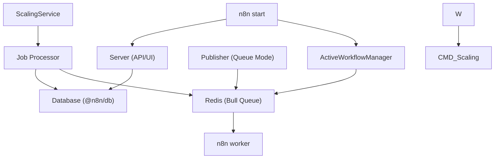

# CLI 命令与执行模式 (CLI Commands and Execution Modes)

相关源文件

-   [packages/@n8n/api-types/src/frontend-settings.ts](https://github.com/n8n-io/n8n/blob/88f170b9/packages/@n8n/api-types/src/frontend-settings.ts)
-   [packages/@n8n/api-types/src/push/collaboration.ts](https://github.com/n8n-io/n8n/blob/88f170b9/packages/@n8n/api-types/src/push/collaboration.ts)
-   [packages/@n8n/backend-common/src/license-state.ts](https://github.com/n8n-io/n8n/blob/88f170b9/packages/@n8n/backend-common/src/license-state.ts)
-   [packages/@n8n/config/src/decorators.ts](https://github.com/n8n-io/n8n/blob/88f170b9/packages/@n8n/config/src/decorators.ts)
-   [packages/@n8n/config/src/index.ts](https://github.com/n8n-io/n8n/blob/88f170b9/packages/@n8n/config/src/index.ts)
-   [packages/@n8n/config/test/config.test.ts](https://github.com/n8n-io/n8n/blob/88f170b9/packages/@n8n/config/test/config.test.ts)
-   [packages/@n8n/config/test/decorators.test.ts](https://github.com/n8n-io/n8n/blob/88f170b9/packages/@n8n/config/test/decorators.test.ts)
-   [packages/@n8n/config/test/string-normalization.test.ts](https://github.com/n8n-io/n8n/blob/88f170b9/packages/@n8n/config/test/string-normalization.test.ts)
-   [packages/@n8n/constants/src/index.ts](https://github.com/n8n-io/n8n/blob/88f170b9/packages/@n8n/constants/src/index.ts)
-   [packages/cli/src/__tests__/license.test.ts](https://github.com/n8n-io/n8n/blob/88f170b9/packages/cli/src/__tests__/license.test.ts)
-   [packages/cli/src/commands/base-command.ts](https://github.com/n8n-io/n8n/blob/88f170b9/packages/cli/src/commands/base-command.ts)
-   [packages/cli/src/commands/start.ts](https://github.com/n8n-io/n8n/blob/88f170b9/packages/cli/src/commands/start.ts)
-   [packages/cli/src/commands/webhook.ts](https://github.com/n8n-io/n8n/blob/88f170b9/packages/cli/src/commands/webhook.ts)
-   [packages/cli/src/commands/worker.ts](https://github.com/n8n-io/n8n/blob/88f170b9/packages/cli/src/commands/worker.ts)
-   [packages/cli/src/config/index.ts](https://github.com/n8n-io/n8n/blob/88f170b9/packages/cli/src/config/index.ts)
-   [packages/cli/src/config/schema.ts](https://github.com/n8n-io/n8n/blob/88f170b9/packages/cli/src/config/schema.ts)
-   [packages/cli/src/constants.ts](https://github.com/n8n-io/n8n/blob/88f170b9/packages/cli/src/constants.ts)
-   [packages/cli/src/controllers/e2e.controller.ts](https://github.com/n8n-io/n8n/blob/88f170b9/packages/cli/src/controllers/e2e.controller.ts)
-   [packages/cli/src/deprecation/__tests__/deprecation.service.test.ts](https://github.com/n8n-io/n8n/blob/88f170b9/packages/cli/src/deprecation/__tests__/deprecation.service.test.ts)
-   [packages/cli/src/deprecation/deprecation.service.ts](https://github.com/n8n-io/n8n/blob/88f170b9/packages/cli/src/deprecation/deprecation.service.ts)
-   [packages/cli/src/errors/response-errors/locked.error.ts](https://github.com/n8n-io/n8n/blob/88f170b9/packages/cli/src/errors/response-errors/locked.error.ts)
-   [packages/cli/src/license.ts](https://github.com/n8n-io/n8n/blob/88f170b9/packages/cli/src/license.ts)
-   [packages/cli/src/modules/breaking-changes/rules/v2/__tests__/binary-data-storage.rule.test.ts](https://github.com/n8n-io/n8n/blob/88f170b9/packages/cli/src/modules/breaking-changes/rules/v2/__tests__/binary-data-storage.rule.test.ts)
-   [packages/cli/src/modules/breaking-changes/rules/v2/__tests__/cli-replace-update-workflow-command.rule.test.ts](https://github.com/n8n-io/n8n/blob/88f170b9/packages/cli/src/modules/breaking-changes/rules/v2/__tests__/cli-replace-update-workflow-command.rule.test.ts)
-   [packages/cli/src/modules/breaking-changes/rules/v2/__tests__/disabled-nodes.rule.test.ts](https://github.com/n8n-io/n8n/blob/88f170b9/packages/cli/src/modules/breaking-changes/rules/v2/__tests__/disabled-nodes.rule.test.ts)
-   [packages/cli/src/modules/breaking-changes/rules/v2/__tests__/dotenv-upgrade.rule.test.ts](https://github.com/n8n-io/n8n/blob/88f170b9/packages/cli/src/modules/breaking-changes/rules/v2/__tests__/dotenv-upgrade.rule.test.ts)
-   [packages/cli/src/modules/breaking-changes/rules/v2/__tests__/oauth-callback-auth.rule.test.ts](https://github.com/n8n-io/n8n/blob/88f170b9/packages/cli/src/modules/breaking-changes/rules/v2/__tests__/oauth-callback-auth.rule.test.ts)
-   [packages/cli/src/modules/breaking-changes/rules/v2/__tests__/pyodide-removed.rule.test.ts](https://github.com/n8n-io/n8n/blob/88f170b9/packages/cli/src/modules/breaking-changes/rules/v2/__tests__/pyodide-removed.rule.test.ts)
-   [packages/cli/src/modules/breaking-changes/rules/v2/__tests__/queue-worker-max-stalled-count.rule.test.ts](https://github.com/n8n-io/n8n/blob/88f170b9/packages/cli/src/modules/breaking-changes/rules/v2/__tests__/queue-worker-max-stalled-count.rule.test.ts)
-   [packages/cli/src/modules/breaking-changes/rules/v2/__tests__/start-node-removed.rule.test.ts](https://github.com/n8n-io/n8n/blob/88f170b9/packages/cli/src/modules/breaking-changes/rules/v2/__tests__/start-node-removed.rule.test.ts)
-   [packages/cli/src/modules/breaking-changes/rules/v2/__tests__/workflow-hooks-deprecated.rule.test.ts](https://github.com/n8n-io/n8n/blob/88f170b9/packages/cli/src/modules/breaking-changes/rules/v2/__tests__/workflow-hooks-deprecated.rule.test.ts)
-   [packages/cli/src/modules/breaking-changes/rules/v2/binary-data-storage.rule.ts](https://github.com/n8n-io/n8n/blob/88f170b9/packages/cli/src/modules/breaking-changes/rules/v2/binary-data-storage.rule.ts)
-   [packages/cli/src/modules/breaking-changes/rules/v2/cli-replace-update-workflow-command.rule.ts](https://github.com/n8n-io/n8n/blob/88f170b9/packages/cli/src/modules/breaking-changes/rules/v2/cli-replace-update-workflow-command.rule.ts)
-   [packages/cli/src/modules/breaking-changes/rules/v2/disabled-nodes.rule.ts](https://github.com/n8n-io/n8n/blob/88f170b9/packages/cli/src/modules/breaking-changes/rules/v2/disabled-nodes.rule.ts)
-   [packages/cli/src/modules/breaking-changes/rules/v2/dotenv-upgrade.rule.ts](https://github.com/n8n-io/n8n/blob/88f170b9/packages/cli/src/modules/breaking-changes/rules/v2/dotenv-upgrade.rule.ts)
-   [packages/cli/src/modules/breaking-changes/rules/v2/oauth-callback-auth.rule.ts](https://github.com/n8n-io/n8n/blob/88f170b9/packages/cli/src/modules/breaking-changes/rules/v2/oauth-callback-auth.rule.ts)
-   [packages/cli/src/modules/breaking-changes/rules/v2/pyodide-removed.rule.ts](https://github.com/n8n-io/n8n/blob/88f170b9/packages/cli/src/modules/breaking-changes/rules/v2/pyodide-removed.rule.ts)
-   [packages/cli/src/modules/breaking-changes/rules/v2/queue-worker-max-stalled-count.rule.ts](https://github.com/n8n-io/n8n/blob/88f170b9/packages/cli/src/modules/breaking-changes/rules/v2/queue-worker-max-stalled-count.rule.ts)
-   [packages/cli/src/modules/breaking-changes/rules/v2/start-node-removed.rule.ts](https://github.com/n8n-io/n8n/blob/88f170b9/packages/cli/src/modules/breaking-changes/rules/v2/start-node-removed.rule.ts)
-   [packages/cli/src/modules/breaking-changes/rules/v2/workflow-hooks-deprecated.rule.ts](https://github.com/n8n-io/n8n/blob/88f170b9/packages/cli/src/modules/breaking-changes/rules/v2/workflow-hooks-deprecated.rule.ts)
-   [packages/cli/src/services/__tests__/frontend.service.test.ts](https://github.com/n8n-io/n8n/blob/88f170b9/packages/cli/src/services/__tests__/frontend.service.test.ts)
-   [packages/cli/src/services/frontend.service.ts](https://github.com/n8n-io/n8n/blob/88f170b9/packages/cli/src/services/frontend.service.ts)
-   [packages/cli/test/integration/commands/worker.cmd.test.ts](https://github.com/n8n-io/n8n/blob/88f170b9/packages/cli/test/integration/commands/worker.cmd.test.ts)
-   [packages/core/jest.config.js](https://github.com/n8n-io/n8n/blob/88f170b9/packages/core/jest.config.js)
-   [packages/core/test/setup-mocks.ts](https://github.com/n8n-io/n8n/blob/88f170b9/packages/core/test/setup-mocks.ts)
-   [packages/core/test/setup.ts](https://github.com/n8n-io/n8n/blob/88f170b9/packages/core/test/setup.ts)
-   [packages/frontend/@n8n/design-system/src/components/CanvasCollaborationPill/CanvasCollaborationPill.vue](https://github.com/n8n-io/n8n/blob/88f170b9/packages/frontend/@n8n/design-system/src/components/CanvasCollaborationPill/CanvasCollaborationPill.vue)
-   [packages/frontend/@n8n/design-system/src/components/N8nLogo/Logo.vue](https://github.com/n8n-io/n8n/blob/88f170b9/packages/frontend/@n8n/design-system/src/components/N8nLogo/Logo.vue)
-   [packages/frontend/@n8n/stores/src/useRootStore.ts](https://github.com/n8n-io/n8n/blob/88f170b9/packages/frontend/@n8n/stores/src/useRootStore.ts)
-   [packages/frontend/editor-ui/src/__tests__/defaults.ts](https://github.com/n8n-io/n8n/blob/88f170b9/packages/frontend/editor-ui/src/__tests__/defaults.ts)
-   [packages/frontend/editor-ui/src/app/components/MainHeader/TabBar.vue](https://github.com/n8n-io/n8n/blob/88f170b9/packages/frontend/editor-ui/src/app/components/MainHeader/TabBar.vue)
-   [packages/frontend/editor-ui/src/app/stores/settings.store.test.ts](https://github.com/n8n-io/n8n/blob/88f170b9/packages/frontend/editor-ui/src/app/stores/settings.store.test.ts)
-   [packages/frontend/editor-ui/src/app/stores/settings.store.ts](https://github.com/n8n-io/n8n/blob/88f170b9/packages/frontend/editor-ui/src/app/stores/settings.store.ts)
-   [packages/nodes-base/test/setup.ts](https://github.com/n8n-io/n8n/blob/88f170b9/packages/nodes-base/test/setup.ts)

本文档描述了 n8n 中可用的命令行界面 (CLI) 命令，以及决定如何处理工作流执行的执行模式。内容涵盖了二进制引导序列、`BaseCommand` 生命周期、`start`/`worker`/`webhook` 命令，以及驱动进程行为的配置系统。

## 概述 (Overview)

n8n 提供了三个主要的 CLI 命令（`start`、`worker`、`webhook`），用于启动不同的进程类型，每个进程都有特定的职责。系统支持两种执行模式：**常规模式 (regular mode)**（进程内执行）和**队列模式 (queue mode)**（通过 Redis/Bull 进行分布式执行），这从根本上改变了工作流执行在进程间的编排方式。

`n8n` 二进制文件 (`packages/cli/bin/n8n`) 引导进程，初始化环境配置，并委托给 `CommandRegistry`。`CommandRegistry` 从 `process.argv[2]` 中识别目标命令，通过 `@n8n/di` 容器实例化匹配的类，并驱动命令生命周期：参数解析 → `init()` → `run()`。每个命令类都扩展自 `BaseCommand` 并带有 `@Command` 装饰器。

## n8n 二进制引导序列 (n8n Binary Boot Sequence)

n8n 进程的入口点是 `packages/cli/bin/n8n`。它在任何应用程序代码运行之前执行几个有序步骤。

**引导步骤（按顺序）：**

| 步骤 | 代码 / 机制 | 备注 |
| --- | --- | --- |
| 1. 版本标志 | `process.argv.slice(-1)[0]` 检查 | `-v`, `-V`, `--version` 打印版本并退出 [packages/cli/bin/n8n11-15](https://github.com/n8n-io/n8n/blob/88f170b9/packages/cli/bin/n8n#L11-L15) |
| 2. Node.js 版本检查 | `semver.satisfies` | 如果不满足则退出并报错 [packages/cli/bin/n8n17-23](https://github.com/n8n-io/n8n/blob/88f170b9/packages/cli/bin/n8n#L17-L23) |
| 3. 源映射 (Source maps) | `require('source-map-support').install()` | 可读的 TypeScript 堆栈跟踪 [packages/cli/bin/n8n32](https://github.com/n8n-io/n8n/blob/88f170b9/packages/cli/bin/n8n#L32-L32) |
| 4. 反射元数据 (Reflect metadata) | `require('reflect-metadata')` | 基于装饰器的 DI 所必需 [packages/cli/bin/n8n34](https://github.com/n8n-io/n8n/blob/88f170b9/packages/cli/bin/n8n#L34-L34) |
| 5. dotenv | `require('dotenv').config()` | 当 `E2E_TESTS=true` 时跳过 [packages/cli/bin/n8n36-38](https://github.com/n8n-io/n8n/blob/88f170b9/packages/cli/bin/n8n#L36-L38) |
| 6. 配置引导 (Config bootstrap) | `require('../dist/config')` | 触发 `GlobalConfig` 和旧版 convict 初始化 [packages/cli/bin/n8n40](https://github.com/n8n-io/n8n/blob/88f170b9/packages/cli/bin/n8n#L40-L40) |
| 7. 命令执行 | `Container.get(CommandRegistry).execute()` | 解析并运行匹配的命令 [packages/cli/bin/n8n63](https://github.com/n8n-io/n8n/blob/88f170b9/packages/cli/bin/n8n#L63-L63) |

配置引导步骤至关重要：`packages/cli/src/config/index.ts` 在加载数据库实体之前从 `@n8n/config` 初始化 `GlobalConfig`，确保正确选择数据库驱动程序。

**引导序列：从 `bin/n8n` 到 `CommandRegistry`**

> **[Mermaid sequence]**
> *(图表结构无法解析)*

来源：[packages/cli/bin/n8n1-65](https://github.com/n8n-io/n8n/blob/88f170b9/packages/cli/bin/n8n#L1-L65) [packages/cli/src/config/index.ts1-73](https://github.com/n8n-io/n8n/blob/88f170b9/packages/cli/src/config/index.ts#L1-L73) [packages/cli/src/config/schema.ts1-55](https://github.com/n8n-io/n8n/blob/88f170b9/packages/cli/src/config/schema.ts#L1-L55) [packages/@n8n/config/src/index.ts74-232](https://github.com/n8n-io/n8n/blob/88f170b9/packages/@n8n/config/src/index.ts#L74-L232)

## CLI 命令架构 (CLI Command Architecture)

### BaseCommand 初始化序列

`BaseCommand` 是所有 n8n CLI 命令的抽象基础。它处理数据库、错误报告和通用服务的核心初始化。

**`BaseCommand.init()` 中的常见初始化步骤：**

1.  **错误报告 (Error Reporting)**: 使用 Sentry 配置初始化 `ErrorReporter` [packages/cli/src/commands/base-command.ts86-116](https://github.com/n8n-io/n8n/blob/88f170b9/packages/cli/src/commands/base-command.ts#L86-L116)
2.  **数据库 (Database)**: 初始化 `DbConnection` 并运行迁移 [packages/cli/src/commands/base-command.ts125-145](https://github.com/n8n-io/n8n/blob/88f170b9/packages/cli/src/commands/base-command.ts#L125-L145)
3.  **节点与凭据 (Nodes & Credentials)**: 触发 `LoadNodesAndCredentials.init()` 以发现可用的集成 [packages/cli/src/commands/base-command.ts123](https://github.com/n8n-io/n8n/blob/88f170b9/packages/cli/src/commands/base-command.ts#L123-L123)
4.  **任务运行器 (Task Runners)**: 如果 `needsTaskRunner` 为 true，则启动 `TaskRunnerModule` 以进行沙箱代码执行 [packages/cli/src/commands/base-command.ts169-178](https://github.com/n8n-io/n8n/blob/88f170b9/packages/cli/src/commands/base-command.ts#L169-L178)
5.  **遥测 (Telemetry)**: 初始化 `PostHogClient` 和 `TelemetryEventRelay` [packages/cli/src/commands/base-command.ts183-185](https://github.com/n8n-io/n8n/blob/88f170b9/packages/cli/src/commands/base-command.ts#L183-L185)

来源：[packages/cli/src/commands/base-command.ts84-186](https://github.com/n8n-io/n8n/blob/88f170b9/packages/cli/src/commands/base-command.ts#L84-L186)

### Start 命令

`Start` 命令启动主应用程序服务器。它负责 Web UI、API 以及（在常规模式下）工作流执行。

**关键职责：**

-   **静态资产 (Static Assets)**: 生成 `index.html`，并注入配置标签，如 `rest-endpoint` 和 `sentry` DSN [packages/cli/src/commands/start.ts123-142](https://github.com/n8n-io/n8n/blob/88f170b9/packages/cli/src/commands/start.ts#L123-L142)
-   **服务器 (Server)**: 启动监听 `N8N_PORT` 的 `Server` 实例 [packages/cli/src/commands/start.ts302](https://github.com/n8n-io/n8n/blob/88f170b9/packages/cli/src/commands/start.ts#L302-L302)
-   **工作流管理 (Workflow Management)**: 初始化 `ActiveWorkflowManager` 以启动触发器和轮询器 [packages/cli/src/commands/start.ts311](https://github.com/n8n-io/n8n/blob/88f170b9/packages/cli/src/commands/start.ts#L311-L311)
-   **优雅停止 (Graceful Stop)**: 移除排队的激活并关闭 `WaitTracker` 和 `ActiveExecutions` [packages/cli/src/commands/start.ts84-111](https://github.com/n8n-io/n8n/blob/88f170b9/packages/cli/src/commands/start.ts#L84-L111)

来源：[packages/cli/src/commands/start.ts49-188](https://github.com/n8n-io/n8n/blob/88f170b9/packages/cli/src/commands/start.ts#L49-L188) [packages/cli/src/commands/start.ts302-368](https://github.com/n8n-io/n8n/blob/88f170b9/packages/cli/src/commands/start.ts#L302-L368)

### Worker 命令

`Worker` 命令启动一个从 Redis 队列消费任务的进程。它强制将执行模式设置为 `queue` [packages/cli/src/commands/worker.ts67-69](https://github.com/n8n-io/n8n/blob/88f170b9/packages/cli/src/commands/worker.ts#L67-L69)。

**关键职责：**

-   **并发性 (Concurrency)**: 根据 `N8N_CONCURRENCY_PRODUCTION_LIMIT` 或 `--concurrency` 标志设置并行任务数量 [packages/cli/src/commands/worker.ts151-163](https://github.com/n8n-io/n8n/blob/88f170b9/packages/cli/src/commands/worker.ts#L151-L163)
-   **扩展服务 (Scaling Service)**: 初始化 `ScalingService` 以设置 Bull 队列和工作器 [packages/cli/src/commands/worker.ts165-172](https://github.com/n8n-io/n8n/blob/88f170b9/packages/cli/src/commands/worker.ts#L165-L172)
-   **编排 (Orchestration)**: 通过 `Publisher` 和 `Subscriber` 连接到 Redis，用于命令/事件分发 [packages/cli/src/scaling/pubsub/publisher.service.ts](https://github.com/n8n-io/n8n/blob/88f170b9/packages/cli/src/scaling/pubsub/publisher.service.ts) [packages/cli/src/commands/worker.ts141-149](https://github.com/n8n-io/n8n/blob/88f170b9/packages/cli/src/commands/worker.ts#L141-L149)
-   **工作器服务器 (Worker Server)**: 可选启动一个内部服务器用于健康检查和指标监控 [packages/cli/src/commands/worker.ts175-186](https://github.com/n8n-io/n8n/blob/88f170b9/packages/cli/src/commands/worker.ts#L175-L186)

来源：[packages/cli/src/commands/worker.ts26-212](https://github.com/n8n-io/n8n/blob/88f170b9/packages/cli/src/commands/worker.ts#L26-L212)

### Webhook 命令

`Webhook` 命令启动一个专门处理生产环境 Webhook 请求的进程。它需要 `queue` 模式才能运行 [packages/cli/src/commands/webhook.ts45-59](https://github.com/n8n-io/n8n/blob/88f170b9/packages/cli/src/commands/webhook.ts#L45-L59)。

**关键职责：**

-   **Webhook 服务器**: 启动 `WebhookServer` 以监听传入的 HTTP 请求 [packages/cli/src/commands/webhook.ts92](https://github.com/n8n-io/n8n/blob/88f170b9/packages/cli/src/commands/webhook.ts#L92-L92)
-   **编排 (Orchestration)**: 订阅命令通道以处理全局事件，如许可证重新加载 [packages/cli/src/commands/webhook.ts106-113](https://github.com/n8n-io/n8n/blob/88f170b9/packages/cli/src/commands/webhook.ts#L106-L113)

来源：[packages/cli/src/commands/webhook.ts16-114](https://github.com/n8n-io/n8n/blob/88f170b9/packages/cli/src/commands/webhook.ts#L16-L114)

## 执行模式 (Execution Modes)

n8n 在由 `executions.mode` 配置定义的两种主要模式下运行。

### 模式比较 (Mode Comparison)

| 特性 | 常规模式 (Regular Mode) | 队列模式 (Queue Mode) |
| --- | --- | --- |
| **进程模型** | 单进程（主进程） | 分布式（主进程 + 工作进程） |
| **扩展性** | 仅纵向扩展 | 横向扩展（增加更多工作进程） |
| **需要 Redis** | 否 | 是（用于 Bull/Redis 队列） |
| **可靠性** | 执行随服务器一起终止 | 如果工作进程终止，任务仍保留在 Redis 中 |

### 执行模式逻辑 (Execution Mode Logic)

来源：[packages/cli/src/commands/start.ts101-104](https://github.com/n8n-io/n8n/blob/88f170b9/packages/cli/src/commands/start.ts#L101-L104) [packages/cli/src/commands/worker.ts165-172](https://github.com/n8n-io/n8n/blob/88f170b9/packages/cli/src/commands/worker.ts#L165-L172) [packages/cli/src/scaling/scaling.service.ts](https://github.com/n8n-io/n8n/blob/88f170b9/packages/cli/src/scaling/scaling.service.ts)

## 弃用与破坏性变更 (Deprecation and Breaking Changes)

n8n 包含一个 `DeprecationService`，它在命令初始化期间运行，以警告用户过时的配置或环境变量。

**功能：**

-   **警告 (Warnings)**: 检查过时的变量（如 `QUEUE_WORKER_TIMEOUT`），并建议使用新的 `N8N_GRACEFUL_SHUTDOWN_TIMEOUT` [packages/cli/src/commands/worker.ts75-82](https://github.com/n8n-io/n8n/blob/88f170b9/packages/cli/src/commands/worker.ts#L75-L82)
-   **破坏性变更规则 (Breaking Change Rules)**: 系统包含一个用于评估破坏性变更的模块（例如 v2 变更，如 Pyodide 移除或二进制数据存储变更） [packages/cli/src/modules/breaking-changes/rules/v2/pyodide-removed.rule.ts](https://github.com/n8n-io/n8n/blob/88f170b9/packages/cli/src/modules/breaking-changes/rules/v2/pyodide-removed.rule.ts)

来源：[packages/cli/src/deprecation/deprecation.service.ts](https://github.com/n8n-io/n8n/blob/88f170b9/packages/cli/src/deprecation/deprecation.service.ts) [packages/cli/src/commands/worker.ts91](https://github.com/n8n-io/n8n/blob/88f170b9/packages/cli/src/commands/worker.ts#L91-L91)

## 配置系统 (Configuration System)

CLI 依赖于 `@n8n/config` 包来实现类型安全的、基于装饰器的配置。

**关键配置类：**

-   `GlobalConfig`: 包含所有子配置的根配置类 [packages/@n8n/config/src/index.ts75-232](https://github.com/n8n-io/n8n/blob/88f170b9/packages/@n8n/config/src/index.ts#L75-L232)
-   `ExecutionsConfig`: 控制执行模式和数据保存行为 [packages/@n8n/config/src/configs/executions.config.ts](https://github.com/n8n-io/n8n/blob/88f170b9/packages/@n8n/config/src/configs/executions.config.ts)
-   `ScalingModeConfig`: 为队列模式配置 Bull 和 Redis 设置 [packages/@n8n/config/src/configs/scaling-mode.config.ts](https://github.com/n8n-io/n8n/blob/88f170b9/packages/@n8n/config/src/configs/scaling-mode.config.ts)

**基于文件的覆盖 (File-based Overwrites)**: n8n 支持 `_FILE` 约定。如果设置了环境变量（如 `DB_POSTGRESDB_PASSWORD_FILE`），n8n 将从指定的文件路径读取密码 [packages/cli/src/config/index.ts38-64](https://github.com/n8n-io/n8n/blob/88f170b9/packages/cli/src/config/index.ts#L38-L64)。

来源：[packages/@n8n/config/src/index.ts1-232](https://github.com/n8n-io/n8n/blob/88f170b9/packages/@n8n/config/src/index.ts#L1-L232) [packages/cli/src/config/index.ts36-64](https://github.com/n8n-io/n8n/blob/88f170b9/packages/cli/src/config/index.ts#L36-L64)
