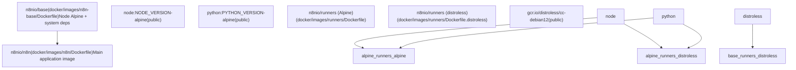
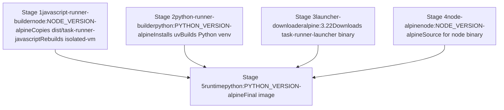
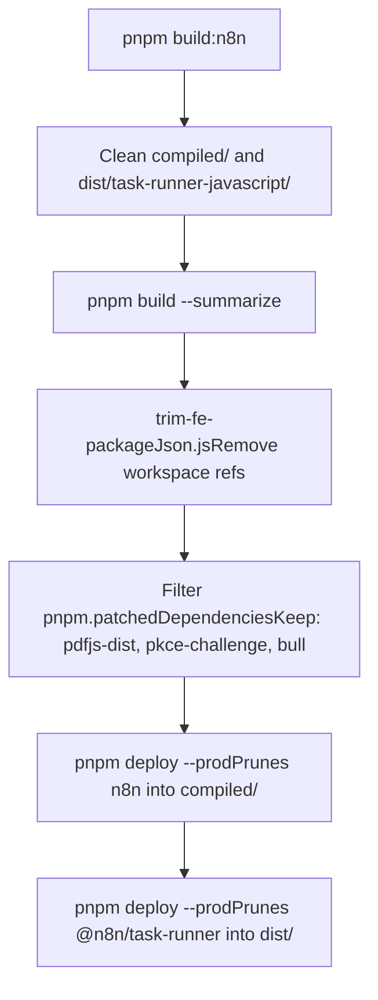

# Docker 部署 (Docker Deployment)

相关源文件

-   [.dockerignore](https://github.com/n8n-io/n8n/blob/88f170b9/.dockerignore)
-   [.github/scripts/docker/docker-config.mjs](https://github.com/n8n-io/n8n/blob/88f170b9/.github/scripts/docker/docker-config.mjs)
-   [.github/scripts/docker/docker-tags.mjs](https://github.com/n8n-io/n8n/blob/88f170b9/.github/scripts/docker/docker-tags.mjs)
-   [.github/workflows/docker-build-push.yml](https://github.com/n8n-io/n8n/blob/88f170b9/.github/workflows/docker-build-push.yml)
-   [docker/images/n8n-base/Dockerfile](https://github.com/n8n-io/n8n/blob/88f170b9/docker/images/n8n-base/Dockerfile)
-   [docker/images/n8n/Dockerfile](https://github.com/n8n-io/n8n/blob/88f170b9/docker/images/n8n/Dockerfile)
-   [docker/images/runners/Dockerfile](https://github.com/n8n-io/n8n/blob/88f170b9/docker/images/runners/Dockerfile)
-   [docker/images/runners/Dockerfile.distroless](https://github.com/n8n-io/n8n/blob/88f170b9/docker/images/runners/Dockerfile.distroless)
-   [docker/images/runners/README.md](https://github.com/n8n-io/n8n/blob/88f170b9/docker/images/runners/README.md?plain=1)
-   [packages/@n8n/benchmark/Dockerfile](https://github.com/n8n-io/n8n/blob/88f170b9/packages/@n8n/benchmark/Dockerfile)
-   [scripts/build-n8n.mjs](https://github.com/n8n-io/n8n/blob/88f170b9/scripts/build-n8n.mjs)

本页面介绍了 n8n 仓库生成的 Docker 镜像、组装这些镜像的构建脚本以及发布这些镜像的 CI 工作流。内容涵盖了 `n8n` 主镜像、`n8n-base` 基础镜像以及 `runners` 边车镜像（Alpine 和 distroless 变体）。

有关 Task Broker/Runner 运行时架构以及在运行器容器内运行的代码的详细信息，请参阅 [7.4](https://github.com/n8n-io/n8n/blob/88f170b9/7.4)。有关作为发布过程一部分触发 Docker 构建的 CI 流水线，请参阅 [9.4](https://github.com/n8n-io/n8n/blob/88f170b9/9.4)。有关在容器内启动 n8n 进程的 CLI 命令，请参阅 [7.2](https://github.com/n8n-io/n8n/blob/88f170b9/7.2)。

---

## 镜像层级 (Image Hierarchy)

本仓库生成三个不同的镜像家族：

| 镜像 | Dockerfile | 注册表名称 |
| --- | --- | --- |
| `n8n` | `docker/images/n8n/Dockerfile` | `n8nio/n8n`, `ghcr.io/n8n-io/n8n` |
| `runners` (Alpine) | `docker/images/runners/Dockerfile` | `n8nio/runners`, `ghcr.io/n8n-io/runners` |
| `runners` (distroless) | `docker/images/runners/Dockerfile.distroless` | `ghcr.io/n8n-io/runners:<version>-distroless` |

`n8n-base` 镜像 (`docker/images/n8n-base/Dockerfile`) 是 `n8n` 镜像的上游 Alpine 基础镜像，作为 `n8nio/base` 进行维护。

**镜像层级图：**

来源：[docker/images/n8n/Dockerfile1-33](https://github.com/n8n-io/n8n/blob/88f170b9/docker/images/n8n/Dockerfile#L1-L33) [docker/images/n8n-base/Dockerfile1-36](https://github.com/n8n-io/n8n/blob/88f170b9/docker/images/n8n-base/Dockerfile#L1-L36) [docker/images/runners/Dockerfile1-154](https://github.com/n8n-io/n8n/blob/88f170b9/docker/images/runners/Dockerfile#L1-L154) [docker/images/runners/Dockerfile.distroless1-198](https://github.com/n8n-io/n8n/blob/88f170b9/docker/images/runners/Dockerfile.distroless#L1-L198)

---

## n8n-base 镜像

**文件：** `docker/images/n8n-base/Dockerfile`

`n8nio/base` 是一个基于 `dhi.io/node` 硬化版 Node 发行版构建的 Alpine 3.22 镜像。它在单个层中安装以下操作系统级依赖，以尽量减小镜像体积：

| 软件包 | 用途 |
| --- | --- |
| `git`, `openssh` | 源码控制集成（企业版功能） |
| `graphicsmagick` | 图像处理（固定在 `1.3.45-r0` 版本以避免 AGPL Ghostscript 字体） |
| `tini` | PID 1 初始化进程 |
| `tzdata` | 用于 `GENERIC_TIMEZONE` 环境变量的时区数据 |
| `ca-certificates` | TLS 根证书 |
| `libc6-compat` | glibc 兼容性垫片 |
| `msttcorefonts` | 用于 PDF/报告生成的微软核心字体 |

`NODE_PATH` 设置为 `/opt/nodejs/node-v${NODE_VERSION}/lib/node_modules`，以确保 `require()` 可以发现全局安装的包。

来源：[docker/images/n8n-base/Dockerfile1-36](https://github.com/n8n-io/n8n/blob/88f170b9/docker/images/n8n-base/Dockerfile#L1-L36)

---

## n8n 主镜像

**文件：** `docker/images/n8n/Dockerfile`

`n8n` 镜像采用多阶段构建，其中 `builder` 阶段编译原生插件（Native Addons），然后再将其移动到最终的 `n8nio/base` 层。

**构建参数 (Build ARGs)：**

| 参数 | 默认值 | 用途 |
| --- | --- | --- |
| `NODE_VERSION` | `24.13.1` | 必须与基础镜像的 Node 版本匹配 |
| `N8N_VERSION` | `snapshot` | 设置为 `org.opencontainers.image.version` 标签 |
| `N8N_RELEASE_TYPE` | `dev` | 设置为容器内的 `N8N_RELEASE_TYPE` 环境变量 |

**构建阶段：**

1.  **builder**: 复制 `./compiled` 产物，并使用 `python3`、`make` 和 `g++` 运行 `npm rebuild sqlite3 isolated-vm` [docker/images/n8n/Dockerfile6-10](https://github.com/n8n-io/n8n/blob/88f170b9/docker/images/n8n/Dockerfile#L6-L10)
2.  **final**: 从 builder 复制重建后的模块 [docker/images/n8n/Dockerfile22](https://github.com/n8n-io/n8n/blob/88f170b9/docker/images/n8n/Dockerfile#L22-L22)

**关键运行时属性：**

| 属性 | 值 |
| --- | --- |
| `WORKDIR` | `/home/node` |
| `USER` | `node` (非 root 用户) |
| `EXPOSE` | `5678/tcp` |
| `ENTRYPOINT` | `["tini", "--", "/docker-entrypoint.sh"]` |
| `NODE_ENV` | `production` |

构建要求 `compiled/` 目录存在，该目录由 `scripts/build-n8n.mjs` 脚本生成 [scripts/build-n8n.mjs196-200](https://github.com/n8n-io/n8n/blob/88f170b9/scripts/build-n8n.mjs#L196-L200)。

来源：[docker/images/n8n/Dockerfile1-38](https://github.com/n8n-io/n8n/blob/88f170b9/docker/images/n8n/Dockerfile#L1-L38) [scripts/build-n8n.mjs77-134](https://github.com/n8n-io/n8n/blob/88f170b9/scripts/build-n8n.mjs#L77-L134)

---

## 运行器边车镜像 (Runners Sidecar Images)

运行器镜像提供隔离的环境，通过 `Code` 节点执行用户提供的代码 (JavaScript/Python)。

### Alpine 变体

**文件：** `docker/images/runners/Dockerfile`

这是一个五阶段构建，结合了 JavaScript 运行器、Python 运行器和基于 Go 的启动器 (Launcher)。

**多阶段构建流程：**

最终阶段包括 `uv`、`node`、`corepack` 和 `pnpm`，允许用户通过额外的依赖扩展镜像 [docker/images/runners/Dockerfile125-140](https://github.com/n8n-io/n8n/blob/88f170b9/docker/images/runners/Dockerfile#L125-L140)。

### Distroless 变体

**文件：** `docker/images/runners/Dockerfile.distroless`

该变体针对云环境，使用 `gcr.io/distroless/cc-debian12`。它缺少 Shell 和包管理器。在将其复制到最终的 distroless 层之前，使用 `runtime-prep` 阶段（阶段 5）来组织文件系统和架构相关的 Python 库 [docker/images/runners/Dockerfile.distroless140-154](https://github.com/n8n-io/n8n/blob/88f170b9/docker/images/runners/Dockerfile.distroless#L140-L154)。

来源：[docker/images/runners/Dockerfile1-162](https://github.com/n8n-io/n8n/blob/88f170b9/docker/images/runners/Dockerfile#L1-L162) [docker/images/runners/Dockerfile.distroless1-160](https://github.com/n8n-io/n8n/blob/88f170b9/docker/images/runners/Dockerfile.distroless#L1-L160)

---

## 生产环境构建流水线 (Production Build Pipeline)

**文件：** `scripts/build-n8n.mjs`

`build-n8n.mjs` 脚本负责编排 Docker 产物的准备工作。

**产物准备流程：**

该脚本确保仅保留必要的后端补丁 [scripts/build-n8n.mjs38-40](https://github.com/n8n-io/n8n/blob/88f170b9/scripts/build-n8n.mjs#L38-L40)，并修剪前端代码以避免在生产镜像中包含仅开发用的依赖 [scripts/build-n8n.mjs157](https://github.com/n8n-io/n8n/blob/88f170b9/scripts/build-n8n.mjs#L157-L157)。

来源：[scripts/build-n8n.mjs1-210](https://github.com/n8n-io/n8n/blob/88f170b9/scripts/build-n8n.mjs#L1-L210)

---

## CI 构建与发布工作流 (CI Build and Push Workflow)

**文件：** `.github/workflows/docker-build-push.yml`

CI 工作流使用 `docker-config.mjs` 确定构建上下文，并使用 `docker-tags.mjs` 根据触发器（例如 `schedule`、`push`、`release`）生成标签。

**CI 执行逻辑：**

> **[Mermaid sequence]**
> *(图表结构无法解析)*

**关键 CI 步骤：**

-   **确定构建上下文**: 评估 GitHub 事件以设置 `version`（例如 `nightly`、`dev` 或语义化版本） [.github/scripts/docker/docker-config.mjs11-66](https://github.com/n8n-io/n8n/blob/88f170b9/.github/scripts/docker/docker-config.mjs#L11-L66)
-   **多架构支持**: 使用 Blacksmith 运行器为 `linux/amd64` 和 `linux/arm64` 生成矩阵 [.github/scripts/docker/docker-config.mjs89-110](https://github.com/n8n-io/n8n/blob/88f170b9/.github/scripts/docker/docker-config.mjs#L89-L110)
-   **证明 (Attestation)**: 生成 SLSA L3 原产地 (Provenance) 和 VEX 证明，以实现安全透明度 [.github/workflows/docker-build-push.yml131-132](https://github.com/n8n-io/n8n/blob/88f170b9/.github/workflows/docker-build-push.yml#L131-L132)

来源：[.github/workflows/docker-build-push.yml46-167](https://github.com/n8n-io/n8n/blob/88f170b9/.github/workflows/docker-build-push.yml#L46-L167) [.github/scripts/docker/docker-config.mjs1-178](https://github.com/n8n-io/n8n/blob/88f170b9/.github/scripts/docker/docker-config.mjs#L1-L178) [.github/scripts/docker/docker-tags.mjs1-114](https://github.com/n8n-io/n8n/blob/88f170b9/.github/scripts/docker/docker-tags.mjs#L1-L114)

---

## Docker 构建上下文 (Docker Build Context)

**文件：** `.dockerignore`

为了减小构建上下文，n8n 在 `.dockerignore` 中使用严格的白名单。仅以下内容会被发送到 Docker 守护进程：

-   `compiled/`（用于 n8n 主镜像） [.dockerignore8-9](https://github.com/n8n-io/n8n/blob/88f170b9/.dockerignore#L8-L9)
-   `dist/task-runner-javascript/`（用于运行器） [.dockerignore13-15](https://github.com/n8n-io/n8n/blob/88f170b9/.dockerignore#L13-L15)
-   `packages/@n8n/task-runner-python/` [.dockerignore18-19](https://github.com/n8n-io/n8n/blob/88f170b9/.dockerignore#L18-L19)
-   `docker/images/`（入口点和配置） [.dockerignore22-27](https://github.com/n8n-io/n8n/blob/88f170b9/.dockerignore#L22-L27)

来源：[.dockerignore1-41](https://github.com/n8n-io/n8n/blob/88f170b9/.dockerignore#L1-L41)
