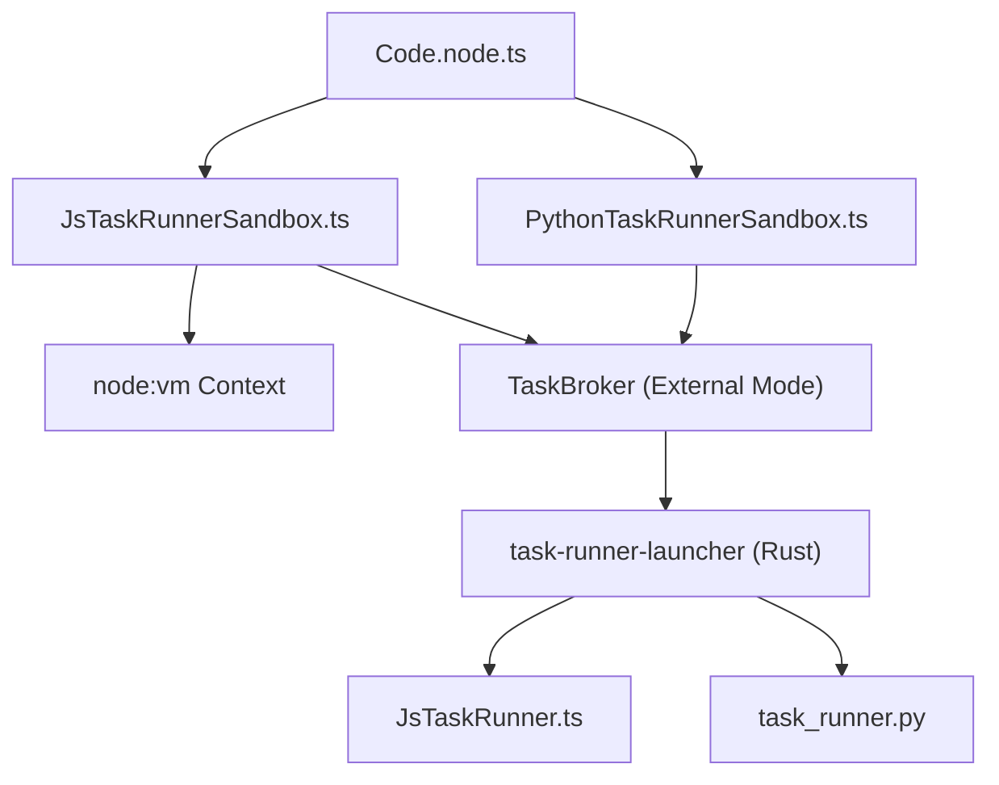
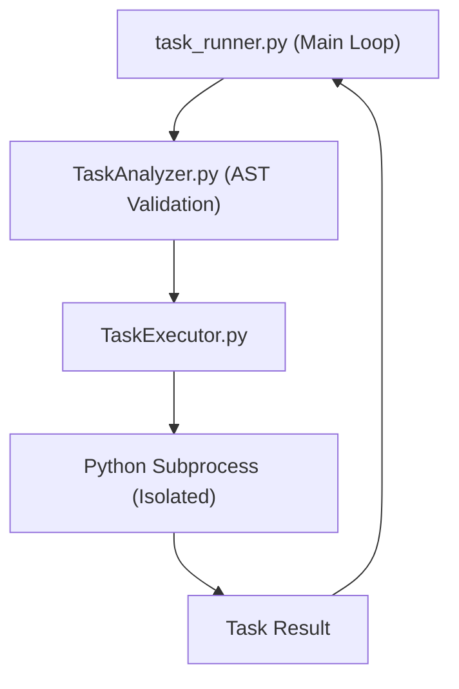

# 任务运行器与沙箱执行 (Task Runners and Sandboxed Execution)

相关源文件

-   [.github/workflows/ci-python.yml](https://github.com/n8n-io/n8n/blob/88f170b9/.github/workflows/ci-python.yml)
-   [packages/@n8n/config/src/configs/runners.config.ts](https://github.com/n8n-io/n8n/blob/88f170b9/packages/@n8n/config/src/configs/runners.config.ts)
-   [packages/@n8n/nodes-langchain/nodes/code/Code.node.ts](https://github.com/n8n-io/n8n/blob/88f170b9/packages/@n8n/nodes-langchain/nodes/code/Code.node.ts)
-   [packages/@n8n/task-runner-python/.python-version](https://github.com/n8n-io/n8n/blob/88f170b9/packages/@n8n/task-runner-python/.python-version)
-   [packages/@n8n/task-runner-python/README.md](https://github.com/n8n-io/n8n/blob/88f170b9/packages/@n8n/task-runner-python/README.md?plain=1)
-   [packages/@n8n/task-runner-python/justfile](https://github.com/n8n-io/n8n/blob/88f170b9/packages/@n8n/task-runner-python/justfile)
-   [packages/@n8n/task-runner-python/pyproject.toml](https://github.com/n8n-io/n8n/blob/88f170b9/packages/@n8n/task-runner-python/pyproject.toml)
-   [packages/@n8n/task-runner-python/src/config/health_check_config.py](https://github.com/n8n-io/n8n/blob/88f170b9/packages/@n8n/task-runner-python/src/config/health_check_config.py)
-   [packages/@n8n/task-runner-python/src/config/security_config.py](https://github.com/n8n-io/n8n/blob/88f170b9/packages/@n8n/task-runner-python/src/config/security_config.py)
-   [packages/@n8n/task-runner-python/src/config/sentry_config.py](https://github.com/n8n-io/n8n/blob/88f170b9/packages/@n8n/task-runner-python/src/config/sentry_config.py)
-   [packages/@n8n/task-runner-python/src/config/task_runner_config.py](https://github.com/n8n-io/n8n/blob/88f170b9/packages/@n8n/task-runner-python/src/config/task_runner_config.py)
-   [packages/@n8n/task-runner-python/src/constants.py](https://github.com/n8n-io/n8n/blob/88f170b9/packages/@n8n/task-runner-python/src/constants.py)
-   [packages/@n8n/task-runner-python/src/env.py](https://github.com/n8n-io/n8n/blob/88f170b9/packages/@n8n/task-runner-python/src/env.py)
-   [packages/@n8n/task-runner-python/src/errors/__init__.py](https://github.com/n8n-io/n8n/blob/88f170b9/packages/@n8n/task-runner-python/src/errors/__init__.py)
-   [packages/@n8n/task-runner-python/src/errors/configuration_error.py](https://github.com/n8n-io/n8n/blob/88f170b9/packages/@n8n/task-runner-python/src/errors/configuration_error.py)
-   [packages/@n8n/task-runner-python/src/errors/invalid_pipe_msg_content_error.py](https://github.com/n8n-io/n8n/blob/88f170b9/packages/@n8n/task-runner-python/src/errors/invalid_pipe_msg_content_error.py)
-   [packages/@n8n/task-runner-python/src/errors/invalid_pipe_msg_length_error.py](https://github.com/n8n-io/n8n/blob/88f170b9/packages/@n8n/task-runner-python/src/errors/invalid_pipe_msg_length_error.py)
-   [packages/@n8n/task-runner-python/src/errors/security_violation_error.py](https://github.com/n8n-io/n8n/blob/88f170b9/packages/@n8n/task-runner-python/src/errors/security_violation_error.py)
-   [packages/@n8n/task-runner-python/src/errors/task_result_read_error.py](https://github.com/n8n-io/n8n/blob/88f170b9/packages/@n8n/task-runner-python/src/errors/task_result_read_error.py)
-   [packages/@n8n/task-runner-python/src/errors/task_runtime_error.py](https://github.com/n8n-io/n8n/blob/88f170b9/packages/@n8n/task-runner-python/src/errors/task_runtime_error.py)
-   [packages/@n8n/task-runner-python/src/errors/task_subprocess_failed_error.py](https://github.com/n8n-io/n8n/blob/88f170b9/packages/@n8n/task-runner-python/src/errors/task_subprocess_failed_error.py)
-   [packages/@n8n/task-runner-python/src/health_check_server.py](https://github.com/n8n-io/n8n/blob/88f170b9/packages/@n8n/task-runner-python/src/health_check_server.py)
-   [packages/@n8n/task-runner-python/src/import_validation.py](https://github.com/n8n-io/n8n/blob/88f170b9/packages/@n8n/task-runner-python/src/import_validation.py)
-   [packages/@n8n/task-runner-python/src/logs.py](https://github.com/n8n-io/n8n/blob/88f170b9/packages/@n8n/task-runner-python/src/logs.py)
-   [packages/@n8n/task-runner-python/src/main.py](https://github.com/n8n-io/n8n/blob/88f170b9/packages/@n8n/task-runner-python/src/main.py)
-   [packages/@n8n/task-runner-python/src/message_serde.py](https://github.com/n8n-io/n8n/blob/88f170b9/packages/@n8n/task-runner-python/src/message_serde.py)
-   [packages/@n8n/task-runner-python/src/message_types/__init__.py](https://github.com/n8n-io/n8n/blob/88f170b9/packages/@n8n/task-runner-python/src/message_types/__init__.py)
-   [packages/@n8n/task-runner-python/src/message_types/broker.py](https://github.com/n8n-io/n8n/blob/88f170b9/packages/@n8n/task-runner-python/src/message_types/broker.py)
-   [packages/@n8n/task-runner-python/src/message_types/pipe.py](https://github.com/n8n-io/n8n/blob/88f170b9/packages/@n8n/task-runner-python/src/message_types/pipe.py)
-   [packages/@n8n/task-runner-python/src/message_types/runner.py](https://github.com/n8n-io/n8n/blob/88f170b9/packages/@n8n/task-runner-python/src/message_types/runner.py)
-   [packages/@n8n/task-runner-python/src/nanoid.py](https://github.com/n8n-io/n8n/blob/88f170b9/packages/@n8n/task-runner-python/src/nanoid.py)
-   [packages/@n8n/task-runner-python/src/pipe_reader.py](https://github.com/n8n-io/n8n/blob/88f170b9/packages/@n8n/task-runner-python/src/pipe_reader.py)
-   [packages/@n8n/task-runner-python/src/sentry.py](https://github.com/n8n-io/n8n/blob/88f170b9/packages/@n8n/task-runner-python/src/sentry.py)
-   [packages/@n8n/task-runner-python/src/task_analyzer.py](https://github.com/n8n-io/n8n/blob/88f170b9/packages/@n8n/task-runner-python/src/task_analyzer.py)
-   [packages/@n8n/task-runner-python/src/task_executor.py](https://github.com/n8n-io/n8n/blob/88f170b9/packages/@n8n/task-runner-python/src/task_executor.py)
-   [packages/@n8n/task-runner-python/src/task_runner.py](https://github.com/n8n-io/n8n/blob/88f170b9/packages/@n8n/task-runner-python/src/task_runner.py)
-   [packages/@n8n/task-runner-python/src/task_state.py](https://github.com/n8n-io/n8n/blob/88f170b9/packages/@n8n/task-runner-python/src/task_state.py)
-   [packages/@n8n/task-runner-python/tests/fixtures/local_task_broker.py](https://github.com/n8n-io/n8n/blob/88f170b9/packages/@n8n/task-runner-python/tests/fixtures/local_task_broker.py)
-   [packages/@n8n/task-runner-python/tests/fixtures/task_runner_manager.py](https://github.com/n8n-io/n8n/blob/88f170b9/packages/@n8n/task-runner-python/tests/fixtures/task_runner_manager.py)
-   [packages/@n8n/task-runner-python/tests/fixtures/test_constants.py](https://github.com/n8n-io/n8n/blob/88f170b9/packages/@n8n/task-runner-python/tests/fixtures/test_constants.py)
-   [packages/@n8n/task-runner-python/tests/integration/conftest.py](https://github.com/n8n-io/n8n/blob/88f170b9/packages/@n8n/task-runner-python/tests/integration/conftest.py)
-   [packages/@n8n/task-runner-python/tests/integration/test_execution.py](https://github.com/n8n-io/n8n/blob/88f170b9/packages/@n8n/task-runner-python/tests/integration/test_execution.py)
-   [packages/@n8n/task-runner-python/tests/integration/test_health_check.py](https://github.com/n8n-io/n8n/blob/88f170b9/packages/@n8n/task-runner-python/tests/integration/test_health_check.py)
-   [packages/@n8n/task-runner-python/tests/integration/test_rpc.py](https://github.com/n8n-io/n8n/blob/88f170b9/packages/@n8n/task-runner-python/tests/integration/test_rpc.py)
-   [packages/@n8n/task-runner-python/tests/unit/test_env.py](https://github.com/n8n-io/n8n/blob/88f170b9/packages/@n8n/task-runner-python/tests/unit/test_env.py)
-   [packages/@n8n/task-runner-python/tests/unit/test_sentry.py](https://github.com/n8n-io/n8n/blob/88f170b9/packages/@n8n/task-runner-python/tests/unit/test_sentry.py)
-   [packages/@n8n/task-runner-python/tests/unit/test_task_analyzer.py](https://github.com/n8n-io/n8n/blob/88f170b9/packages/@n8n/task-runner-python/tests/unit/test_task_analyzer.py)
-   [packages/@n8n/task-runner-python/tests/unit/test_task_executor.py](https://github.com/n8n-io/n8n/blob/88f170b9/packages/@n8n/task-runner-python/tests/unit/test_task_executor.py)
-   [packages/@n8n/task-runner-python/uv.lock](https://github.com/n8n-io/n8n/blob/88f170b9/packages/@n8n/task-runner-python/uv.lock)
-   [packages/@n8n/task-runner/src/config/base-runner-config.ts](https://github.com/n8n-io/n8n/blob/88f170b9/packages/@n8n/task-runner/src/config/base-runner-config.ts)
-   [packages/@n8n/task-runner/src/js-task-runner/__tests__/js-task-runner.test.ts](https://github.com/n8n-io/n8n/blob/88f170b9/packages/@n8n/task-runner/src/js-task-runner/__tests__/js-task-runner.test.ts)
-   [packages/@n8n/task-runner/src/js-task-runner/__tests__/test-data.ts](https://github.com/n8n-io/n8n/blob/88f170b9/packages/@n8n/task-runner/src/js-task-runner/__tests__/test-data.ts)
-   [packages/@n8n/task-runner/src/js-task-runner/errors/task-cancelled-error.ts](https://github.com/n8n-io/n8n/blob/88f170b9/packages/@n8n/task-runner/src/js-task-runner/errors/task-cancelled-error.ts)
-   [packages/@n8n/task-runner/src/js-task-runner/errors/timeout-error.ts](https://github.com/n8n-io/n8n/blob/88f170b9/packages/@n8n/task-runner/src/js-task-runner/errors/timeout-error.ts)
-   [packages/@n8n/task-runner/src/js-task-runner/js-task-runner.ts](https://github.com/n8n-io/n8n/blob/88f170b9/packages/@n8n/task-runner/src/js-task-runner/js-task-runner.ts)
-   [packages/@n8n/task-runner/src/js-task-runner/obj-utils.ts](https://github.com/n8n-io/n8n/blob/88f170b9/packages/@n8n/task-runner/src/js-task-runner/obj-utils.ts)
-   [packages/@n8n/task-runner/src/message-types.ts](https://github.com/n8n-io/n8n/blob/88f170b9/packages/@n8n/task-runner/src/message-types.ts)
-   [packages/@n8n/task-runner/src/runner-types.ts](https://github.com/n8n-io/n8n/blob/88f170b9/packages/@n8n/task-runner/src/runner-types.ts)
-   [packages/@n8n/task-runner/src/start.ts](https://github.com/n8n-io/n8n/blob/88f170b9/packages/@n8n/task-runner/src/start.ts)
-   [packages/@n8n/task-runner/src/task-runner.ts](https://github.com/n8n-io/n8n/blob/88f170b9/packages/@n8n/task-runner/src/task-runner.ts)
-   [packages/cli/src/task-runners/__tests__/task-runner-process-restart-loop-detector.test.ts](https://github.com/n8n-io/n8n/blob/88f170b9/packages/cli/src/task-runners/__tests__/task-runner-process-restart-loop-detector.test.ts)
-   [packages/cli/src/task-runners/__tests__/task-runner-process.test.ts](https://github.com/n8n-io/n8n/blob/88f170b9/packages/cli/src/task-runners/__tests__/task-runner-process.test.ts)
-   [packages/cli/src/task-runners/errors/missing-requirements.error.ts](https://github.com/n8n-io/n8n/blob/88f170b9/packages/cli/src/task-runners/errors/missing-requirements.error.ts)
-   [packages/cli/src/task-runners/internal-task-runner-disconnect-analyzer.ts](https://github.com/n8n-io/n8n/blob/88f170b9/packages/cli/src/task-runners/internal-task-runner-disconnect-analyzer.ts)
-   [packages/cli/src/task-runners/task-managers/__tests__/data-request-response-builder.test.ts](https://github.com/n8n-io/n8n/blob/88f170b9/packages/cli/src/task-runners/task-managers/__tests__/data-request-response-builder.test.ts)
-   [packages/cli/src/task-runners/task-managers/__tests__/data-request-response-stripper.test.ts](https://github.com/n8n-io/n8n/blob/88f170b9/packages/cli/src/task-runners/task-managers/__tests__/data-request-response-stripper.test.ts)
-   [packages/cli/src/task-runners/task-managers/data-request-response-builder.ts](https://github.com/n8n-io/n8n/blob/88f170b9/packages/cli/src/task-runners/task-managers/data-request-response-builder.ts)
-   [packages/cli/src/task-runners/task-managers/data-request-response-stripper.ts](https://github.com/n8n-io/n8n/blob/88f170b9/packages/cli/src/task-runners/task-managers/data-request-response-stripper.ts)
-   [packages/cli/src/task-runners/task-runner-module.ts](https://github.com/n8n-io/n8n/blob/88f170b9/packages/cli/src/task-runners/task-runner-module.ts)
-   [packages/cli/src/task-runners/task-runner-process-base.ts](https://github.com/n8n-io/n8n/blob/88f170b9/packages/cli/src/task-runners/task-runner-process-base.ts)
-   [packages/cli/src/task-runners/task-runner-process-js.ts](https://github.com/n8n-io/n8n/blob/88f170b9/packages/cli/src/task-runners/task-runner-process-js.ts)
-   [packages/cli/src/task-runners/task-runner-process-py.ts](https://github.com/n8n-io/n8n/blob/88f170b9/packages/cli/src/task-runners/task-runner-process-py.ts)
-   [packages/cli/src/task-runners/task-runner-process-restart-loop-detector.ts](https://github.com/n8n-io/n8n/blob/88f170b9/packages/cli/src/task-runners/task-runner-process-restart-loop-detector.ts)
-   [packages/cli/test/integration/task-runners/js-task-runner-execution.integration.test.ts](https://github.com/n8n-io/n8n/blob/88f170b9/packages/cli/test/integration/task-runners/js-task-runner-execution.integration.test.ts)
-   [packages/cli/test/integration/task-runners/task-runner-module.external.test.ts](https://github.com/n8n-io/n8n/blob/88f170b9/packages/cli/test/integration/task-runners/task-runner-module.external.test.ts)
-   [packages/cli/test/integration/task-runners/task-runner-module.internal.test.ts](https://github.com/n8n-io/n8n/blob/88f170b9/packages/cli/test/integration/task-runners/task-runner-module.internal.test.ts)
-   [packages/cli/test/integration/task-runners/task-runner-process.test.ts](https://github.com/n8n-io/n8n/blob/88f170b9/packages/cli/test/integration/task-runners/task-runner-process.test.ts)
-   [packages/frontend/editor-ui/src/app/utils/nodeIcon.test.ts](https://github.com/n8n-io/n8n/blob/88f170b9/packages/frontend/editor-ui/src/app/utils/nodeIcon.test.ts)
-   [packages/frontend/editor-ui/src/app/utils/nodeIcon.ts](https://github.com/n8n-io/n8n/blob/88f170b9/packages/frontend/editor-ui/src/app/utils/nodeIcon.ts)
-   [packages/nodes-base/nodes/Code/Code.node.ts](https://github.com/n8n-io/n8n/blob/88f170b9/packages/nodes-base/nodes/Code/Code.node.ts)
-   [packages/nodes-base/nodes/Code/JavaScriptSandbox.ts](https://github.com/n8n-io/n8n/blob/88f170b9/packages/nodes-base/nodes/Code/JavaScriptSandbox.ts)
-   [packages/nodes-base/nodes/Code/JsTaskRunnerSandbox.ts](https://github.com/n8n-io/n8n/blob/88f170b9/packages/nodes-base/nodes/Code/JsTaskRunnerSandbox.ts)
-   [packages/nodes-base/nodes/Code/PythonTaskRunnerSandbox.ts](https://github.com/n8n-io/n8n/blob/88f170b9/packages/nodes-base/nodes/Code/PythonTaskRunnerSandbox.ts)
-   [packages/nodes-base/nodes/Code/Sandbox.ts](https://github.com/n8n-io/n8n/blob/88f170b9/packages/nodes-base/nodes/Code/Sandbox.ts)
-   [packages/nodes-base/nodes/Code/descriptions/PythonCodeDescription.ts](https://github.com/n8n-io/n8n/blob/88f170b9/packages/nodes-base/nodes/Code/descriptions/PythonCodeDescription.ts)
-   [packages/nodes-base/nodes/Code/python-runner-unavailable.error.ts](https://github.com/n8n-io/n8n/blob/88f170b9/packages/nodes-base/nodes/Code/python-runner-unavailable.error.ts)
-   [packages/nodes-base/nodes/Code/reserved-key-found-error.ts](https://github.com/n8n-io/n8n/blob/88f170b9/packages/nodes-base/nodes/Code/reserved-key-found-error.ts)
-   [packages/nodes-base/nodes/Code/result-validation.ts](https://github.com/n8n-io/n8n/blob/88f170b9/packages/nodes-base/nodes/Code/result-validation.ts)
-   [packages/nodes-base/nodes/Code/test/Code.node.test.ts](https://github.com/n8n-io/n8n/blob/88f170b9/packages/nodes-base/nodes/Code/test/Code.node.test.ts)
-   [packages/nodes-base/nodes/Code/test/JsTaskRunnerSandbox.test.ts](https://github.com/n8n-io/n8n/blob/88f170b9/packages/nodes-base/nodes/Code/test/JsTaskRunnerSandbox.test.ts)
-   [packages/nodes-base/nodes/Code/test/PythonTaskRunnerSandbox.test.ts](https://github.com/n8n-io/n8n/blob/88f170b9/packages/nodes-base/nodes/Code/test/PythonTaskRunnerSandbox.test.ts)
-   [packages/nodes-base/nodes/Code/test/utils.test.ts](https://github.com/n8n-io/n8n/blob/88f170b9/packages/nodes-base/nodes/Code/test/utils.test.ts)
-   [packages/nodes-base/nodes/Code/throw-execution-error.ts](https://github.com/n8n-io/n8n/blob/88f170b9/packages/nodes-base/nodes/Code/throw-execution-error.ts)
-   [packages/nodes-base/nodes/Code/utils.ts](https://github.com/n8n-io/n8n/blob/88f170b9/packages/nodes-base/nodes/Code/utils.ts)
-   [packages/nodes-base/nodes/Function/Function.node.ts](https://github.com/n8n-io/n8n/blob/88f170b9/packages/nodes-base/nodes/Function/Function.node.ts)
-   [packages/nodes-base/nodes/FunctionItem/FunctionItem.node.ts](https://github.com/n8n-io/n8n/blob/88f170b9/packages/nodes-base/nodes/FunctionItem/FunctionItem.node.ts)
-   [packages/nodes-base/types/xmlhttprequest-ssl.d.ts](https://github.com/n8n-io/n8n/blob/88f170b9/packages/nodes-base/types/xmlhttprequest-ssl.d.ts)
-   [packages/workflow/src/index.ts](https://github.com/n8n-io/n8n/blob/88f170b9/packages/workflow/src/index.ts)
-   [packages/workflow/src/node-helpers.ts](https://github.com/n8n-io/n8n/blob/88f170b9/packages/workflow/src/node-helpers.ts)
-   [packages/workflow/src/utils.ts](https://github.com/n8n-io/n8n/blob/88f170b9/packages/workflow/src/utils.ts)
-   [packages/workflow/test/node-helpers.test.ts](https://github.com/n8n-io/n8n/blob/88f170b9/packages/workflow/test/node-helpers.test.ts)
-   [packages/workflow/test/run-execution-data-factory.test.ts](https://github.com/n8n-io/n8n/blob/88f170b9/packages/workflow/test/run-execution-data-factory.test.ts)
-   [packages/workflow/test/utils.test.ts](https://github.com/n8n-io/n8n/blob/88f170b9/packages/workflow/test/utils.test.ts)

## 目的与范围 (Purpose and Scope)

本文档解释了 n8n 的任务运行器 (Task Runner) 架构，该架构用于在隔离的沙箱环境中执行用户提供的代码。任务运行器是独立的进程，用于执行来自 `Code` 节点的 JavaScript 和 Python 代码，为了安全起见，它们与 n8n 主实例隔离。本页面涵盖了任务运行器组件、通过任务代理 (Task Broker) 进行的通信协议、JavaScript/Python 沙箱实现以及部署模式。

## 架构概述 (Architecture Overview)

任务运行器在与 n8n 主进程分离的环境中执行用户代码。系统支持两种执行模式：

| 模式 | 描述 | 使用场景 |
| --- | --- | --- |
| `internal` | 任务运行器使用 `node:vm` 或 `isolated-vm` 在 n8n 主进程内运行。 | 默认模式，单服务器部署。 |
| `external` | 任务运行器在独立的进程/容器中运行，通过 WebSocket 任务代理进行通信。 | 生产部署、Kubernetes、增强隔离。 |

模式通过 `N8N_RUNNERS_MODE` 环境变量进行配置 [packages/@n8n/config/src/configs/runners.config.ts14-15](https://github.com/n8n-io/n8n/blob/88f170b9/packages/@n8n/config/src/configs/runners.config.ts#L14-L15)。

### 系统组件图 (System Component Diagram)

该图将自然语言概念与负责执行的具体类和文件联系起来。

**来源：** [packages/nodes-base/nodes/Code/Code.node.ts162-201](https://github.com/n8n-io/n8n/blob/88f170b9/packages/nodes-base/nodes/Code/Code.node.ts#L162-L201) [packages/@n8n/config/src/configs/runners.config.ts25-27](https://github.com/n8n-io/n8n/blob/88f170b9/packages/@n8n/config/src/configs/runners.config.ts#L25-L27) [packages/@n8n/task-runner/src/task-runner.ts106-114](https://github.com/n8n-io/n8n/blob/88f170b9/packages/@n8n/task-runner/src/task-runner.ts#L106-L114)

## JavaScript 任务运行器 (`@n8n/task-runner`)

JavaScript 任务运行器使用 Node.js 的 `node:vm` 模块执行代码，但进行了显著的安全增强，以防止原型污染和未经授权的访问。

### 执行流程与沙箱化 (Execution Flow and Sandboxing)

当接收到任务时，`JsTaskRunner.executeTask` 会初始化一个新的上下文 [packages/@n8n/task-runner/src/js-task-runner/js-task-runner.ts217-220](https://github.com/n8n-io/n8n/blob/88f170b9/packages/@n8n/task-runner/src/js-task-runner/js-task-runner.ts#L217-L220)。

1.  **上下文初始化 (Context Initialization)**: 使用 `createContext()` 创建一个新的 `vm.Context` [packages/@n8n/task-runner/src/js-task-runner/js-task-runner.ts29](https://github.com/n8n-io/n8n/blob/88f170b9/packages/@n8n/task-runner/src/js-task-runner/js-task-runner.ts#L29-L29)。
2.  **原型硬化 (Prototype Hardening)**: 在安全模式（默认）下，运行器会冻结全局对象（如 `Object`、`Array`）以及 n8n 内部类（如 `Workflow` 和 `Expression`）的原型 [packages/@n8n/task-runner/src/js-task-runner/js-task-runner.ts199-215](https://github.com/n8n-io/n8n/blob/88f170b9/packages/@n8n/task-runner/src/js-task-runner/js-task-runner.ts#L199-L215)。
3.  **Buffer 安全**: 不安全的 Buffer 方法 (`Buffer.allocUnsafe`) 被重定向到 `Buffer.alloc`，以防止内存泄漏 [packages/@n8n/task-runner/src/js-task-runner/js-task-runner.ts193-196](https://github.com/n8n-io/n8n/blob/88f170b9/packages/@n8n/task-runner/src/js-task-runner/js-task-runner.ts#L193-L196)。
4.  **模块解析 (Module Resolution)**: `RequireResolver` 根据 `allowedBuiltInModules` 和 `allowedExternalModules` 配置控制哪些内置和外部模块可以被 `require()` [packages/@n8n/task-runner/src/js-task-runner/js-task-runner.ts163-166](https://github.com/n8n-io/n8n/blob/88f170b9/packages/@n8n/task-runner/src/js-task-runner/js-task-runner.ts#L163-L166)。

**来源：** [packages/@n8n/task-runner/src/js-task-runner/js-task-runner.ts1-215](https://github.com/n8n-io/n8n/blob/88f170b9/packages/@n8n/task-runner/src/js-task-runner/js-task-runner.ts#L1-L215) [packages/@n8n/task-runner/src/js-task-runner/__tests__/js-task-runner.test.ts136-153](https://github.com/n8n-io/n8n/blob/88f170b9/packages/@n8n/task-runner/src/js-task-runner/__tests__/js-task-runner.test.ts#L136-L153)

## Python 任务运行器 (`@n8n/task-runner-python`)

Python 任务运行器是一个多进程系统，旨在通过严格的基于 AST 的验证和子进程隔离来执行 Python 代码。

### 执行模型 (The Execution Model)

Python 运行器通过 `multiprocessing` 使用“分叉服务器 (Fork Server)”模型来派生执行隔离区 [packages/@n8n/task-runner-python/src/task_executor.py42-47](https://github.com/n8n-io/n8n/blob/88f170b9/packages/@n8n/task-runner-python/src/task_executor.py#L42-L47)。

### 安全与验证 (Security and Validation)

`SecurityValidator`（一个 `ast.NodeVisitor`）在执行前检查用户的代码 [packages/@n8n/task-runner-python/src/task_analyzer.py29-35](https://github.com/n8n-io/n8n/blob/88f170b9/packages/@n8n/task-runner-python/src/task_analyzer.py#L29-L35)。

-   **禁用属性 (Blocked Attributes)**: 严格禁止访问危险属性，如 `__subclasses__`、`__globals__` 和 `__builtins__` [packages/@n8n/task-runner-python/src/constants.py126-173](https://github.com/n8n-io/n8n/blob/88f170b9/packages/@n8n/task-runner-python/src/constants.py#L126-L173)。
-   **导入白名单 (Import Whitelisting)**: 根据 `stdlib_allow` 和 `external_allow` 列表检查导入 [packages/@n8n/task-runner-python/src/task_analyzer.py182-195](https://github.com/n8n-io/n8n/blob/88f170b9/packages/@n8n/task-runner-python/src/task_analyzer.py#L182-L195)。
-   **重整名称保护 (Mangled Name Protection)**: 禁止访问名称重整属性（例如 `_Class__attr`），以防止访问私有成员 [packages/@n8n/task-runner-python/src/task_analyzer.py71-74](https://github.com/n8n-io/n8n/blob/88f170b9/packages/@n8n/task-runner-python/src/task_analyzer.py#L71-L74)。
-   **格式字符串检查 (Format String Inspection)**: 运行器检查 f-strings 和 `.format()` 调用，以确保它们不被用于绕过属性访问限制 [packages/@n8n/task-runner-python/src/task_analyzer.py155-179](https://github.com/n8n-io/n8n/blob/88f170b9/packages/@n8n/task-runner-python/src/task_analyzer.py#L155-L179)。

**来源：** [packages/@n8n/task-runner-python/src/task_executor.py53-86](https://github.com/n8n-io/n8n/blob/88f170b9/packages/@n8n/task-runner-python/src/task_executor.py#L53-L86) [packages/@n8n/task-runner-python/src/task_analyzer.py1-180](https://github.com/n8n-io/n8n/blob/88f170b9/packages/@n8n/task-runner-python/src/task_analyzer.py#L1-L180) [packages/@n8n/task-runner-python/src/constants.py118-182](https://github.com/n8n-io/n8n/blob/88f170b9/packages/@n8n/task-runner-python/src/constants.py#L118-L182)

## 任务代理与外部模式 (Task Broker and External Mode)

在外部模式下，n8n 与运行器之间的通信通过 WebSocket 协议进行。

### 协议消息 (Protocol Messages)

`TaskRunner` 类管理这些连接的生命周期 [packages/@n8n/task-runner/src/task-runner.ts60-61](https://github.com/n8n-io/n8n/blob/88f170b9/packages/@n8n/task-runner/src/task-runner.ts#L60-L61)。

| 消息类型 | 方向 | 目的 |
| --- | --- | --- |
| `runner:taskoffer` | 运行器 -> 代理 | 运行器宣布其有空闲槽位（并发） [packages/@n8n/task-runner/src/task-runner.ts209-214](https://github.com/n8n-io/n8n/blob/88f170b9/packages/@n8n/task-runner/src/task-runner.ts#L209-L214) |
| `broker:taskofferaccept` | 代理 -> 运行器 | 代理为接受的请求分配一个 `taskId` [packages/@n8n/task-runner/src/task-runner.ts233-235](https://github.com/n8n-io/n8n/blob/88f170b9/packages/@n8n/task-runner/src/task-runner.ts#L233-L235) |
| `broker:tasksettings` | 代理 -> 运行器 | 代理发送实际的代码和数据供执行 [packages/@n8n/task-runner/src/task-runner.ts239-241](https://github.com/n8n-io/n8n/blob/88f170b9/packages/@n8n/task-runner/src/task-runner.ts#L239-L241) |
| `runner:rpc` | 运行器 -> 代理 | 运行器请求外部数据（例如 `$node["Name"].json`） [packages/@n8n/task-runner/src/task-runner.ts55](https://github.com/n8n-io/n8n/blob/88f170b9/packages/@n8n/task-runner/src/task-runner.ts#L55-L55) |
| `runner:taskdone` | 运行器 -> 代理 | 最终结果数据返回给 n8n [packages/@n8n/task-runner/src/task-runner.ts53](https://github.com/n8n-io/n8n/blob/88f170b9/packages/@n8n/task-runner/src/task-runner.ts#L53-L53) |

### 任务运行器启动器 (Task Runner Launcher)

`task-runner-launcher`（一个 Rust 二进制文件）作为 Docker 镜像中的入口点。它负责：

1.  启动 JS 和 Python 运行器进程。
2.  处理用于优雅关闭的信号 (SIGTERM/SIGINT)。
3.  暴露一个健康检查服务器 [packages/@n8n/task-runner/src/start.ts83-89](https://github.com/n8n-io/n8n/blob/88f170b9/packages/@n8n/task-runner/src/start.ts#L83-L89)。

**来源：** [packages/@n8n/task-runner/src/task-runner.ts150-246](https://github.com/n8n-io/n8n/blob/88f170b9/packages/@n8n/task-runner/src/task-runner.ts#L150-L246) [packages/@n8n/task-runner-python/src/task_runner.py116-148](https://github.com/n8n-io/n8n/blob/88f170b9/packages/@n8n/task-runner-python/src/task_runner.py#L116-L148) [packages/@n8n/task-runner-python/src/constants.py11-24](https://github.com/n8n-io/n8n/blob/88f170b9/packages/@n8n/task-runner-python/src/constants.py#L11-L24)

## Code 节点执行模型 (Code Node Execution Model)

`Code` 节点充当工作流引擎与任务运行器之间的桥梁。

1.  **语言选择 (Language Selection)**: 支持 `javaScript` 和 `pythonNative` [packages/nodes-base/nodes/Code/Code.node.ts164-167](https://github.com/n8n-io/n8n/blob/88f170b9/packages/nodes-base/nodes/Code/Code.node.ts#L164-L167)。
2.  **模式处理 (Mode Handling)**:
    -   `runOnceForAllItems`: 向运行器一次性发送整个输入数组 [packages/nodes-base/nodes/Code/Code.node.ts184-185](https://github.com/n8n-io/n8n/blob/88f170b9/packages/nodes-base/nodes/Code/Code.node.ts#L184-L185)。
    -   `runOnceForEachItem`: 为每个项目循环执行 [packages/nodes-base/nodes/Code/Code.node.ts186](https://github.com/n8n-io/n8n/blob/88f170b9/packages/nodes-base/nodes/Code/Code.node.ts#L186-L186)。
3.  **数据重构 (Data Reconstruct)**: 由于任务运行器是隔离的，n8n 使用 `DataRequestResponseReconstruct` 工具从通过网络接收的序列化 JSON 中重建复杂的 `INodeExecutionData` 结构 [packages/@n8n/task-runner/src/js-task-runner/js-task-runner.ts135](https://github.com/n8n-io/n8n/blob/88f170b9/packages/@n8n/task-runner/src/js-task-runner/js-task-runner.ts#L135-L135)。

**来源：** [packages/nodes-base/nodes/Code/Code.node.ts162-205](https://github.com/n8n-io/n8n/blob/88f170b9/packages/nodes-base/nodes/Code/Code.node.ts#L162-L205) [packages/@n8n/task-runner/src/js-task-runner/js-task-runner.ts51-95](https://github.com/n8n-io/n8n/blob/88f170b9/packages/@n8n/task-runner/src/js-task-runner/js-task-runner.ts#L51-L95)

## 配置摘要 (Configuration Summary)

| 环境变量 | 默认值 | 描述 |
| --- | --- | --- |
| `N8N_RUNNERS_MODE` | `internal` | `internal` 或 `external`。 |
| `N8N_RUNNERS_MAX_CONCURRENCY` | `10` | 每个运行器进程的最大任务数。 |
| `N8N_RUNNERS_TASK_TIMEOUT` | `300` | 最大执行时间（秒）。 |
| `N8N_RUNNERS_MAX_PAYLOAD` | `1GB` | 与运行器往返发送的数据的最大大小。 |
| `N8N_RUNNERS_INSECURE_MODE` | `false` | 如果为 true，则禁用原型冻结和模块限制。 |

**来源：** [packages/@n8n/config/src/configs/runners.config.ts10-73](https://github.com/n8n-io/n8n/blob/88f170b9/packages/@n8n/config/src/configs/runners.config.ts#L10-L73)
