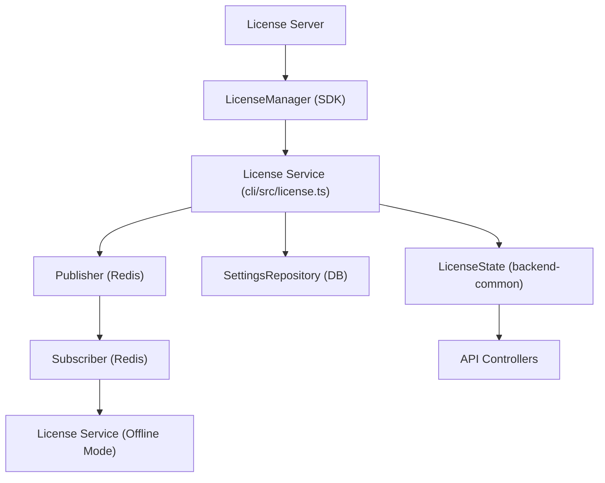
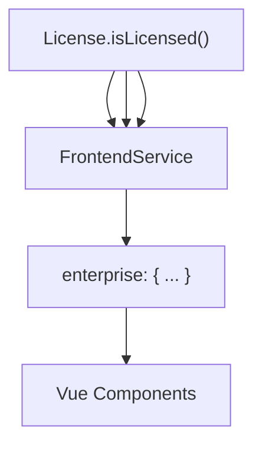

# 许可证管理与特性标志 (License Management and Feature Flags)

相关源文件

-   [packages/@n8n/api-types/src/frontend-settings.ts](https://github.com/n8n-io/n8n/blob/88f170b9/packages/@n8n/api-types/src/frontend-settings.ts)
-   [packages/@n8n/api-types/src/push/collaboration.ts](https://github.com/n8n-io/n8n/blob/88f170b9/packages/@n8n/api-types/src/push/collaboration.ts)
-   [packages/@n8n/backend-common/src/license-state.ts](https://github.com/n8n-io/n8n/blob/88f170b9/packages/@n8n/backend-common/src/license-state.ts)
-   [packages/@n8n/config/src/configs/cache.config.ts](https://github.com/n8n-io/n8n/blob/88f170b9/packages/@n8n/config/src/configs/cache.config.ts)
-   [packages/@n8n/config/src/configs/credentials.config.ts](https://github.com/n8n-io/n8n/blob/88f170b9/packages/@n8n/config/src/configs/credentials.config.ts)
-   [packages/@n8n/config/src/configs/database.config.ts](https://github.com/n8n-io/n8n/blob/88f170b9/packages/@n8n/config/src/configs/database.config.ts)
-   [packages/@n8n/config/src/configs/event-bus.config.ts](https://github.com/n8n-io/n8n/blob/88f170b9/packages/@n8n/config/src/configs/event-bus.config.ts)
-   [packages/@n8n/config/src/configs/nodes.config.ts](https://github.com/n8n-io/n8n/blob/88f170b9/packages/@n8n/config/src/configs/nodes.config.ts)
-   [packages/@n8n/config/src/configs/public-api.config.ts](https://github.com/n8n-io/n8n/blob/88f170b9/packages/@n8n/config/src/configs/public-api.config.ts)
-   [packages/@n8n/config/src/configs/templates.config.ts](https://github.com/n8n-io/n8n/blob/88f170b9/packages/@n8n/config/src/configs/templates.config.ts)
-   [packages/@n8n/config/src/configs/user-management.config.ts](https://github.com/n8n-io/n8n/blob/88f170b9/packages/@n8n/config/src/configs/user-management.config.ts)
-   [packages/@n8n/config/src/configs/version-notifications.config.ts](https://github.com/n8n-io/n8n/blob/88f170b9/packages/@n8n/config/src/configs/version-notifications.config.ts)
-   [packages/@n8n/config/src/configs/workflows.config.ts](https://github.com/n8n-io/n8n/blob/88f170b9/packages/@n8n/config/src/configs/workflows.config.ts)
-   [packages/@n8n/config/src/decorators.ts](https://github.com/n8n-io/n8n/blob/88f170b9/packages/@n8n/config/src/decorators.ts)
-   [packages/@n8n/config/src/index.ts](https://github.com/n8n-io/n8n/blob/88f170b9/packages/@n8n/config/src/index.ts)
-   [packages/@n8n/config/test/config.test.ts](https://github.com/n8n-io/n8n/blob/88f170b9/packages/@n8n/config/test/config.test.ts)
-   [packages/@n8n/config/test/decorators.test.ts](https://github.com/n8n-io/n8n/blob/88f170b9/packages/@n8n/config/test/decorators.test.ts)
-   [packages/@n8n/config/test/string-normalization.test.ts](https://github.com/n8n-io/n8n/blob/88f170b9/packages/@n8n/config/test/string-normalization.test.ts)
-   [packages/@n8n/constants/src/index.ts](https://github.com/n8n-io/n8n/blob/88f170b9/packages/@n8n/constants/src/index.ts)
-   [packages/@n8n/db/src/connection/__tests__/db-connection-options.test.ts](https://github.com/n8n-io/n8n/blob/88f170b9/packages/@n8n/db/src/connection/__tests__/db-connection-options.test.ts)
-   [packages/@n8n/db/src/connection/db-connection-options.ts](https://github.com/n8n-io/n8n/blob/88f170b9/packages/@n8n/db/src/connection/db-connection-options.ts)
-   [packages/@n8n/db/src/entities/workflow-dependency-entity.ts](https://github.com/n8n-io/n8n/blob/88f170b9/packages/@n8n/db/src/entities/workflow-dependency-entity.ts)
-   [packages/@n8n/db/src/repositories/workflow-dependency.repository.ts](https://github.com/n8n-io/n8n/blob/88f170b9/packages/@n8n/db/src/repositories/workflow-dependency.repository.ts)
-   [packages/cli/src/__tests__/credentials-overwrites.test.ts](https://github.com/n8n-io/n8n/blob/88f170b9/packages/cli/src/__tests__/credentials-overwrites.test.ts)
-   [packages/cli/src/__tests__/license.test.ts](https://github.com/n8n-io/n8n/blob/88f170b9/packages/cli/src/__tests__/license.test.ts)
-   [packages/cli/src/__tests__/node-types.test.ts](https://github.com/n8n-io/n8n/blob/88f170b9/packages/cli/src/__tests__/node-types.test.ts)
-   [packages/cli/src/commands/base-command.ts](https://github.com/n8n-io/n8n/blob/88f170b9/packages/cli/src/commands/base-command.ts)
-   [packages/cli/src/commands/start.ts](https://github.com/n8n-io/n8n/blob/88f170b9/packages/cli/src/commands/start.ts)
-   [packages/cli/src/commands/webhook.ts](https://github.com/n8n-io/n8n/blob/88f170b9/packages/cli/src/commands/webhook.ts)
-   [packages/cli/src/commands/worker.ts](https://github.com/n8n-io/n8n/blob/88f170b9/packages/cli/src/commands/worker.ts)
-   [packages/cli/src/config/index.ts](https://github.com/n8n-io/n8n/blob/88f170b9/packages/cli/src/config/index.ts)
-   [packages/cli/src/config/schema.ts](https://github.com/n8n-io/n8n/blob/88f170b9/packages/cli/src/config/schema.ts)
-   [packages/cli/src/constants.ts](https://github.com/n8n-io/n8n/blob/88f170b9/packages/cli/src/constants.ts)
-   [packages/cli/src/controllers/e2e.controller.ts](https://github.com/n8n-io/n8n/blob/88f170b9/packages/cli/src/controllers/e2e.controller.ts)
-   [packages/cli/src/credentials-overwrites.ts](https://github.com/n8n-io/n8n/blob/88f170b9/packages/cli/src/credentials-overwrites.ts)
-   [packages/cli/src/errors/response-errors/locked.error.ts](https://github.com/n8n-io/n8n/blob/88f170b9/packages/cli/src/errors/response-errors/locked.error.ts)
-   [packages/cli/src/license.ts](https://github.com/n8n-io/n8n/blob/88f170b9/packages/cli/src/license.ts)
-   [packages/cli/src/modules/workflow-index/__tests__/workflow-index.service.test.ts](https://github.com/n8n-io/n8n/blob/88f170b9/packages/cli/src/modules/workflow-index/__tests__/workflow-index.service.test.ts)
-   [packages/cli/src/modules/workflow-index/workflow-index.service.ts](https://github.com/n8n-io/n8n/blob/88f170b9/packages/cli/src/modules/workflow-index/workflow-index.service.ts)
-   [packages/cli/src/node-types.ts](https://github.com/n8n-io/n8n/blob/88f170b9/packages/cli/src/node-types.ts)
-   [packages/cli/src/services/__tests__/frontend.service.test.ts](https://github.com/n8n-io/n8n/blob/88f170b9/packages/cli/src/services/__tests__/frontend.service.test.ts)
-   [packages/cli/src/services/frontend.service.ts](https://github.com/n8n-io/n8n/blob/88f170b9/packages/cli/src/services/frontend.service.ts)
-   [packages/cli/test/integration/commands/worker.cmd.test.ts](https://github.com/n8n-io/n8n/blob/88f170b9/packages/cli/test/integration/commands/worker.cmd.test.ts)
-   [packages/cli/test/integration/credentials/credentials-overwrites.integration.test.ts](https://github.com/n8n-io/n8n/blob/88f170b9/packages/cli/test/integration/credentials/credentials-overwrites.integration.test.ts)
-   [packages/cli/test/integration/database/repositories/workflow-dependency.repository.test.ts](https://github.com/n8n-io/n8n/blob/88f170b9/packages/cli/test/integration/database/repositories/workflow-dependency.repository.test.ts)
-   [packages/cli/test/integration/workflows/workflow-index.test.ts](https://github.com/n8n-io/n8n/blob/88f170b9/packages/cli/test/integration/workflows/workflow-index.test.ts)
-   [packages/frontend/@n8n/design-system/src/components/CanvasCollaborationPill/CanvasCollaborationPill.vue](https://github.com/n8n-io/n8n/blob/88f170b9/packages/frontend/@n8n/design-system/src/components/CanvasCollaborationPill/CanvasCollaborationPill.vue)
-   [packages/frontend/@n8n/design-system/src/components/N8nLogo/Logo.vue](https://github.com/n8n-io/n8n/blob/88f170b9/packages/frontend/@n8n/design-system/src/components/N8nLogo/Logo.vue)
-   [packages/frontend/@n8n/stores/src/useRootStore.ts](https://github.com/n8n-io/n8n/blob/88f170b9/packages/frontend/@n8n/stores/src/useRootStore.ts)
-   [packages/frontend/editor-ui/src/__tests__/defaults.ts](https://github.com/n8n-io/n8n/blob/88f170b9/packages/frontend/editor-ui/src/__tests__/defaults.ts)
-   [packages/frontend/editor-ui/src/app/components/MainHeader/TabBar.vue](https://github.com/n8n-io/n8n/blob/88f170b9/packages/frontend/editor-ui/src/app/components/MainHeader/TabBar.vue)
-   [packages/frontend/editor-ui/src/app/stores/settings.store.test.ts](https://github.com/n8n-io/n8n/blob/88f170b9/packages/frontend/editor-ui/src/app/stores/settings.store.test.ts)
-   [packages/frontend/editor-ui/src/app/stores/settings.store.ts](https://github.com/n8n-io/n8n/blob/88f170b9/packages/frontend/editor-ui/src/app/stores/settings.store.ts)
-   [packages/frontend/editor-ui/src/features/credentials/__tests__/credentials.store.test.ts](https://github.com/n8n-io/n8n/blob/88f170b9/packages/frontend/editor-ui/src/features/credentials/__tests__/credentials.store.test.ts)
-   [packages/frontend/editor-ui/src/features/credentials/composables/__tests__/useCredentialOAuth.test.ts](https://github.com/n8n-io/n8n/blob/88f170b9/packages/frontend/editor-ui/src/features/credentials/composables/__tests__/useCredentialOAuth.test.ts)
-   [packages/frontend/editor-ui/src/features/credentials/composables/useCredentialOAuth.ts](https://github.com/n8n-io/n8n/blob/88f170b9/packages/frontend/editor-ui/src/features/credentials/composables/useCredentialOAuth.ts)
-   [packages/frontend/editor-ui/src/features/credentials/credentials.api.ts](https://github.com/n8n-io/n8n/blob/88f170b9/packages/frontend/editor-ui/src/features/credentials/credentials.api.ts)

本页面介绍了 n8n 许可证生命周期，包括 `License` 服务、`LicenseState` 外观类 (Facade)、企业版功能门控以及特性标志 (Feature Flag) 系统。内容详细说明了授权如何通过配置、激活和续期流程控制后端行为及 UI 的可见性。

---

## 概述 (Overview)

n8n 使用专有的许可证 SDK (`@n8n_io/license-sdk`) 实现分层功能系统。其架构由一个核心管理器组成，外层封装了负责处理持久化和分布式进程（主进程、工作进程、Webhook 进程）间状态分发的 n8n 特定服务。

-   **`License` 服务**: `@n8n_io/license-sdk` 的主要接口。它管理 `LicenseManager` 实例，处理激活/续期，并将许可证证书持久化到数据库 [packages/cli/src/license.ts36-51](https://github.com/n8n-io/n8n/blob/88f170b9/packages/cli/src/license.ts#L36-L51)。
-   **`LicenseState` 外观类**: 一个高层的、带命名工具方法的工具类，提供简洁的 API 用于检查功能，无需了解内部 SDK 的字符串标识符 [packages/@n8n/backend-common/src/license-state.ts18-25](https://github.com/n8n-io/n8n/blob/88f170b9/packages/@n8n/backend-common/src/license-state.ts#L18-L25)。
-   **特性标志 (`N8N_ENV_FEAT_*`)**: 基于环境的覆盖，用于实验性功能或特定环境的开关，独立于商业许可证系统 [packages/cli/src/services/frontend.service.ts141-151](https://github.com/n8n-io/n8n/blob/88f170b9/packages/cli/src/services/frontend.service.ts#L141-L151)。

---

## 系统架构与数据流 (System Architecture and Data Flow)

许可证系统连接了远程许可证服务器与 n8n 执行环境。

**图表：许可证实体关系与数据流**

来源：[packages/cli/src/license.ts100-129](https://github.com/n8n-io/n8n/blob/88f170b9/packages/cli/src/license.ts#L100-L129) [packages/cli/src/license.ts156-161](https://github.com/n8n-io/n8n/blob/88f170b9/packages/cli/src/license.ts#L156-L161) [packages/cli/src/license.ts163-174](https://github.com/n8n-io/n8n/blob/88f170b9/packages/cli/src/license.ts#L163-L174)

---

## 配置与特性标识符 (Configuration and Feature Identifiers)

### 许可证配置 (License Configuration)

许可证行为由 `GlobalConfig` 下嵌套的 `LicenseConfig` 管理。关键参数包括：

-   `serverUrl`: 许可证操作的端点（默认值：`https://license.n8n.io/v1`）。
-   `autoRenewalEnabled`: 实例是否应自动尝试续订证书 [packages/cli/src/license.ts90-93](https://github.com/n8n-io/n8n/blob/88f170b9/packages/cli/src/license.ts#L90-L93)。
-   `cert`: 临时证书字符串，如果通过环境变量提供，将覆盖数据库中存储的许可证 [packages/cli/src/license.ts133-136](https://github.com/n8n-io/n8n/blob/88f170b9/packages/cli/src/license.ts#L133-L136)。

### 授权项（特性与配额） (Entitlements (Features and Quotas))

特性在 `@n8n/constants` 中定义，并分为布尔特性和数值配额。

| 类型 | 示例 | SDK 标识符前缀 |
| --- | --- | --- |
| **布尔特性** | `SHARING`, `LDAP`, `SAML`, `OIDC`, `VARIABLES`, `SOURCE_CONTROL` | `feat:` |
| **数值配额** | `USERS_LIMIT`, `VARIABLES_LIMIT`, `TRIGGER_LIMIT`, `AI_CREDITS` | `quota:` |

来源：[packages/@n8n/constants/src/index.ts3-12](https://github.com/n8n-io/n8n/blob/88f170b9/packages/@n8n/constants/src/index.ts#L3-L12) [packages/cli/src/license.ts5-12](https://github.com/n8n-io/n8n/blob/88f170b9/packages/cli/src/license.ts#L5-L12)

---

## 许可证生命周期 (License Lifecycle)

### 1. 初始化 (Initialization)

在启动过程中，`License.init()` 配置 SDK。在多实例设置中，仅 **Leader** 主进程负责主动续期。工作进程 (Worker) 和 Webhook 进程以 `offlineMode` 初始化，依赖数据库以及来自主进程的 PubSub 信号 [packages/cli/src/license.ts67-73](https://github.com/n8n-io/n8n/blob/88f170b9/packages/cli/src/license.ts#L67-L73)。

### 2. 激活与持久化 (Activation and Persistence)

当用户提供激活密钥时，将调用 `License.activate()`。生成的证书块将使用键名 `license.cert` 保存到 `SettingsRepository` [packages/cli/src/license.ts163-174](https://github.com/n8n-io/n8n/blob/88f170b9/packages/cli/src/license.ts#L163-L174) [packages/cli/src/constants.ts82](https://github.com/n8n-io/n8n/blob/88f170b9/packages/cli/src/constants.ts#L82-L82)。

### 3. 续期与同步 (Renewal and Synchronization)

SDK 处理后台续期。当许可证续期时：

1.  在 Leader 上触发 `onLicenseRenewed` [packages/cli/src/license.ts151-154](https://github.com/n8n-io/n8n/blob/88f170b9/packages/cli/src/license.ts#L151-L154)。
2.  新证书被保存到数据库 [packages/cli/src/license.ts163-174](https://github.com/n8n-io/n8n/blob/88f170b9/packages/cli/src/license.ts#L163-L174)。
3.  通过 Redis PubSub 广播 `reload-license` 命令 [packages/cli/src/license.ts156-161](https://github.com/n8n-io/n8n/blob/88f170b9/packages/cli/src/license.ts#L156-L161)。
4.  其他进程接收到事件并调用 `manager.reload()` 以从数据库刷新其本地状态 [packages/cli/src/license.ts212-218](https://github.com/n8n-io/n8n/blob/88f170b9/packages/cli/src/license.ts#L212-L218)。

来源：[packages/cli/src/license.ts53-129](https://github.com/n8n-io/n8n/blob/88f170b9/packages/cli/src/license.ts#L53-L129) [packages/cli/src/license.ts156-161](https://github.com/n8n-io/n8n/blob/88f170b9/packages/cli/src/license.ts#L156-L161)

---

## 特性标志 (`N8N_ENV_FEAT_*`) (Feature Flags (N8N_ENV_FEAT_*))

除了商业许可证系统外，n8n 还支持环境级特性标志。这些标志从以前缀 `N8N_ENV_FEAT_` 开头的环境变量中收集 [packages/cli/src/services/frontend.service.ts144-146](https://github.com/n8n-io/n8n/blob/88f170b9/packages/cli/src/services/frontend.service.ts#L144-L146)。

-   **收集**: `FrontendService` 遍历 `process.env` 以构建 `N8N_ENV_FEAT_*` 映射表 [packages/cli/src/services/frontend.service.ts141-151](https://github.com/n8n-io/n8n/blob/88f170b9/packages/cli/src/services/frontend.service.ts#L141-L151)。
-   **暴露**: 这些标志作为 `FrontendSettings` 对象的一部分发送到前端 [packages/cli/src/services/frontend.service.ts236](https://github.com/n8n-io/n8n/blob/88f170b9/packages/cli/src/services/frontend.service.ts#L236-L236) [packages/@n8n/api-types/src/frontend-settings.ts236](https://github.com/n8n-io/n8n/blob/88f170b9/packages/@n8n/api-types/src/frontend-settings.ts#L236-L236)。

---

## 功能门控实现 (Feature Gate Implementation)

功能强制执行发生在多个层面：

### 后端强制执行 (Backend Enforcement)

控制器和服务通过查询 `LicenseState` 来对逻辑进行门控。

-   **服务层**: 使用 `isVariablesLicensed()` 或 `isSharingLicensed()` 等方法来验证请求 [packages/@n8n/backend-common/src/license-state.ts56-100](https://github.com/n8n-io/n8n/blob/88f170b9/packages/@n8n/backend-common/src/license-state.ts#L56-L100)。
-   **错误处理**: 如果检查失败，系统通常会抛出 `FeatureNotLicensedError` [packages/cli/src/commands/start.ts21](https://github.com/n8n-io/n8n/blob/88f170b9/packages/cli/src/commands/start.ts#L21-L21)。

### 前端可见性 (Frontend Visibility)

`FrontendService` 将内部许可证状态映射为 UI 使用的简洁 `enterprise` 设置对象 [packages/cli/src/services/frontend.service.ts64-73](https://github.com/n8n-io/n8n/blob/88f170b9/packages/cli/src/services/frontend.service.ts#L64-L73)。

**图表：将授权项映射到 UI 设置**

来源：[packages/cli/src/services/frontend.service.ts104-128](https://github.com/n8n-io/n8n/blob/88f170b9/packages/cli/src/services/frontend.service.ts#L104-L128) [packages/@n8n/api-types/src/frontend-settings.ts40-67](https://github.com/n8n-io/n8n/blob/88f170b9/packages/@n8n/api-types/src/frontend-settings.ts#L40-L67)

### 前端企业版设置摘要 (Summary of Enterprise Settings in Frontend)

以下设置派生自许可证，并通过 `FrontendSettings.enterprise` 暴露：

-   `sharing`: 工作流/凭据共享的布尔特性 [packages/@n8n/api-types/src/frontend-settings.ts41](https://github.com/n8n-io/n8n/blob/88f170b9/packages/@n8n/api-types/src/frontend-settings.ts#L41-L41)。
-   `ldap` / `saml` / `oidc`: SSO 功能 [packages/@n8n/api-types/src/frontend-settings.ts42-44](https://github.com/n8n-io/n8n/blob/88f170b9/packages/@n8n/api-types/src/frontend-settings.ts#L42-L44)。
-   `sourceControl`: Git 集成 [packages/@n8n/api-types/src/frontend-settings.ts49](https://github.com/n8n-io/n8n/blob/88f170b9/packages/@n8n/api-types/src/frontend-settings.ts#L49-L49)。
-   `externalSecrets`: 与 Vault、AWS Secrets Manager 等集成 [packages/@n8n/api-types/src/frontend-settings.ts51](https://github.com/n8n-io/n8n/blob/88f170b9/packages/@n8n/api-types/src/frontend-settings.ts#L51-L51)。
-   `variables`: 环境变量管理 [packages/@n8n/api-types/src/frontend-settings.ts48](https://github.com/n8n-io/n8n/blob/88f170b9/packages/@n8n/api-types/src/frontend-settings.ts#L48-L48)。

来源：[packages/cli/src/services/frontend.service.ts64-73](https://github.com/n8n-io/n8n/blob/88f170b9/packages/cli/src/services/frontend.service.ts#L64-L73) [packages/@n8n/api-types/src/frontend-settings.ts40-67](https://github.com/n8n-io/n8n/blob/88f170b9/packages/@n8n/api-types/src/frontend-settings.ts#L40-L67)
