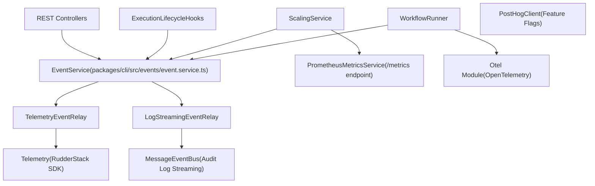
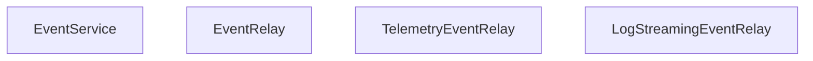

# 可观测性与遥测 (Observability and Telemetry)

相关源文件

-   [packages/@n8n/benchmark/src/n8n-api-client/n8n-api-client.ts](https://github.com/n8n-io/n8n/blob/88f170b9/packages/@n8n/benchmark/src/n8n-api-client/n8n-api-client.ts)
-   [packages/@n8n/config/src/configs/diagnostics.config.ts](https://github.com/n8n-io/n8n/blob/88f170b9/packages/@n8n/config/src/configs/diagnostics.config.ts)
-   [packages/@n8n/config/src/configs/endpoints.config.ts](https://github.com/n8n-io/n8n/blob/88f170b9/packages/@n8n/config/src/configs/endpoints.config.ts)
-   [packages/@n8n/config/src/configs/scaling-mode.config.ts](https://github.com/n8n-io/n8n/blob/88f170b9/packages/@n8n/config/src/configs/scaling-mode.config.ts)
-   [packages/cli/BREAKING-CHANGES.md](https://github.com/n8n-io/n8n/blob/88f170b9/packages/cli/BREAKING-CHANGES.md?plain=1)
-   [packages/cli/bin/n8n](https://github.com/n8n-io/n8n/blob/88f170b9/packages/cli/bin/n8n)
-   [packages/cli/src/abstract-server.ts](https://github.com/n8n-io/n8n/blob/88f170b9/packages/cli/src/abstract-server.ts)
-   [packages/cli/src/commands/audit.ts](https://github.com/n8n-io/n8n/blob/88f170b9/packages/cli/src/commands/audit.ts)
-   [packages/cli/src/eventbus/event-message-classes/abstract-event-message.ts](https://github.com/n8n-io/n8n/blob/88f170b9/packages/cli/src/eventbus/event-message-classes/abstract-event-message.ts)
-   [packages/cli/src/eventbus/event-message-classes/event-message-ai-node.ts](https://github.com/n8n-io/n8n/blob/88f170b9/packages/cli/src/eventbus/event-message-classes/event-message-ai-node.ts)
-   [packages/cli/src/eventbus/event-message-classes/event-message-audit.ts](https://github.com/n8n-io/n8n/blob/88f170b9/packages/cli/src/eventbus/event-message-classes/event-message-audit.ts)
-   [packages/cli/src/eventbus/event-message-classes/index.ts](https://github.com/n8n-io/n8n/blob/88f170b9/packages/cli/src/eventbus/event-message-classes/index.ts)
-   [packages/cli/src/events/__tests__/log-streaming-event-relay.test.ts](https://github.com/n8n-io/n8n/blob/88f170b9/packages/cli/src/events/__tests__/log-streaming-event-relay.test.ts)
-   [packages/cli/src/events/__tests__/telemetry-event-relay.test.ts](https://github.com/n8n-io/n8n/blob/88f170b9/packages/cli/src/events/__tests__/telemetry-event-relay.test.ts)
-   [packages/cli/src/events/event.service.ts](https://github.com/n8n-io/n8n/blob/88f170b9/packages/cli/src/events/event.service.ts)
-   [packages/cli/src/events/maps/relay.event-map.ts](https://github.com/n8n-io/n8n/blob/88f170b9/packages/cli/src/events/maps/relay.event-map.ts)
-   [packages/cli/src/events/relays/log-streaming.event-relay.ts](https://github.com/n8n-io/n8n/blob/88f170b9/packages/cli/src/events/relays/log-streaming.event-relay.ts)
-   [packages/cli/src/events/relays/telemetry.event-relay.ts](https://github.com/n8n-io/n8n/blob/88f170b9/packages/cli/src/events/relays/telemetry.event-relay.ts)
-   [packages/cli/src/metrics/__tests__/prometheus-metrics.service.test.ts](https://github.com/n8n-io/n8n/blob/88f170b9/packages/cli/src/metrics/__tests__/prometheus-metrics.service.test.ts)
-   [packages/cli/src/metrics/__tests__/prometheus-metrics.service.unmocked.test.ts](https://github.com/n8n-io/n8n/blob/88f170b9/packages/cli/src/metrics/__tests__/prometheus-metrics.service.unmocked.test.ts)
-   [packages/cli/src/metrics/prometheus-metrics.service.ts](https://github.com/n8n-io/n8n/blob/88f170b9/packages/cli/src/metrics/prometheus-metrics.service.ts)
-   [packages/cli/src/metrics/types.ts](https://github.com/n8n-io/n8n/blob/88f170b9/packages/cli/src/metrics/types.ts)
-   [packages/cli/src/posthog/__tests__/posthog.test.ts](https://github.com/n8n-io/n8n/blob/88f170b9/packages/cli/src/posthog/__tests__/posthog.test.ts)
-   [packages/cli/src/posthog/index.ts](https://github.com/n8n-io/n8n/blob/88f170b9/packages/cli/src/posthog/index.ts)
-   [packages/cli/src/scaling/__tests__/worker-server.test.ts](https://github.com/n8n-io/n8n/blob/88f170b9/packages/cli/src/scaling/__tests__/worker-server.test.ts)
-   [packages/cli/src/scaling/worker-server.ts](https://github.com/n8n-io/n8n/blob/88f170b9/packages/cli/src/scaling/worker-server.ts)
-   [packages/cli/src/services/__tests__/redis-client.service.test.ts](https://github.com/n8n-io/n8n/blob/88f170b9/packages/cli/src/services/__tests__/redis-client.service.test.ts)
-   [packages/cli/src/services/cache/cache.types.ts](https://github.com/n8n-io/n8n/blob/88f170b9/packages/cli/src/services/cache/cache.types.ts)
-   [packages/cli/src/services/redis-client.service.ts](https://github.com/n8n-io/n8n/blob/88f170b9/packages/cli/src/services/redis-client.service.ts)
-   [packages/cli/src/telemetry/__tests__/telemetry.test.ts](https://github.com/n8n-io/n8n/blob/88f170b9/packages/cli/src/telemetry/__tests__/telemetry.test.ts)
-   [packages/cli/src/telemetry/index.ts](https://github.com/n8n-io/n8n/blob/88f170b9/packages/cli/src/telemetry/index.ts)
-   [packages/cli/test/integration/prometheus-metrics.test.ts](https://github.com/n8n-io/n8n/blob/88f170b9/packages/cli/test/integration/prometheus-metrics.test.ts)
-   [packages/frontend/editor-ui/src/app/composables/useBackendStatus.spec.ts](https://github.com/n8n-io/n8n/blob/88f170b9/packages/frontend/editor-ui/src/app/composables/useBackendStatus.spec.ts)
-   [packages/frontend/editor-ui/src/app/composables/useBackendStatus.ts](https://github.com/n8n-io/n8n/blob/88f170b9/packages/frontend/editor-ui/src/app/composables/useBackendStatus.ts)

本页面记录了 `packages/cli` 中的内部事件系统、遥测流水线、审计日志流、Prometheus 指标以及 OpenTelemetry 集成。这些系统捕获有关工作流执行、用户操作和系统生命周期的结构化信号，用于产品分析、操作审计和性能监控。

有关控制这些系统的环境变量配置（诊断标志、指标开关），请参阅 [配置系统 (Configuration System)](/n8n-io/n8n/7.1-configuration-system)。有关工作流执行生命周期挂钩如何触发这些事件，请参阅 [工作流执行生命周期 (Workflow Execution Lifecycle)](/n8n-io/n8n/2.1-workflow-execution-lifecycle)。

---

## 架构概述 (Architecture Overview)

可观测性栈是围绕一个中央进程内类型化发布/订阅总线 (`EventService`) 和一个**中继模式 (Relay Pattern)** 构建的。`packages/cli` 中的代码触发事件。中继服务独立地订阅这些事件，并将其转发到外部接收器（Sinks）。

**图表：可观测性数据流**

来源：[packages/cli/src/events/relays/telemetry.event-relay.ts51-68](https://github.com/n8n-io/n8n/blob/88f170b9/packages/cli/src/events/relays/telemetry.event-relay.ts#L51-L68) [packages/cli/src/events/relays/log-streaming.event-relay.ts20-29](https://github.com/n8n-io/n8n/blob/88f170b9/packages/cli/src/events/relays/log-streaming.event-relay.ts#L20-L29) [packages/cli/src/metrics/prometheus-metrics.service.ts25-34](https://github.com/n8n-io/n8n/blob/88f170b9/packages/cli/src/metrics/prometheus-metrics.service.ts#L25-L34)

---

## EventService 与 TypedEmitter

`EventService` ([packages/cli/src/events/event.service.ts](https://github.com/n8n-io/n8n/blob/88f170b9/packages/cli/src/events/event.service.ts)) 是 Node 原生 `EventEmitter` 的类型化封装。它被注册为 DI `@Service()`，并注入到任何需要发送或订阅事件的组件中。

类型参数为 `RelayEventMap`，因此 `eventService.emit(name, payload)` 在编译时进行全类型检查：有效载荷类型由事件名称推断。

**图表：EventService 与中继基类**

来源：[packages/cli/src/events/relays/telemetry.event-relay.ts51-68](https://github.com/n8n-io/n8n/blob/88f170b9/packages/cli/src/events/relays/telemetry.event-relay.ts#L51-L68) [packages/cli/src/events/relays/log-streaming.event-relay.ts20-29](https://github.com/n8n-io/n8n/blob/88f170b9/packages/cli/src/events/relays/log-streaming.event-relay.ts#L20-L29)

---

## RelayEventMap：事件分类 (RelayEventMap: Event Taxonomy)

[packages/cli/src/events/maps/relay.event-map.ts](https://github.com/n8n-io/n8n/blob/88f170b9/packages/cli/src/events/maps/relay.event-map.ts) 定义了 `RelayEventMap` —— 即将每个事件名称映射到其强类型有效载荷的 TypeScript 类型。

| 类别 | 部分事件名称 |
| --- | --- |
| **生命周期** | `server-started`, `session-started`, `instance-stopped`, `instance-owner-setup` |
| **工作流** | `workflow-created`, `workflow-deleted`, `workflow-archived`, `workflow-saved`, `workflow-pre-execute`, `workflow-post-execute`, `workflow-executed` |
| **节点** | `node-pre-execute`, `node-post-execute` |
| **用户** | `user-signed-up`, `user-deleted`, `user-invited`, `user-updated`, `user-logged-in`, `user-login-failed` |
| **凭据** | `credentials-created`, `credentials-shared`, `credentials-updated`, `credentials-deleted` |
| **公开 API** | `public-api-invoked`, `public-api-key-created`, `public-api-key-deleted` |
| **队列 / 扩展** | `job-enqueued`, `job-dequeued`, `job-stalled` |
| **AI** | `ai-llm-generated-output`, `ai-tool-called`, `ai-vector-store-searched` |

来源：[packages/cli/src/events/maps/relay.event-map.ts33-160](https://github.com/n8n-io/n8n/blob/88f170b9/packages/cli/src/events/maps/relay.event-map.ts#L33-L160) [packages/cli/src/events/relays/log-streaming.event-relay.ts87-99](https://github.com/n8n-io/n8n/blob/88f170b9/packages/cli/src/events/relays/log-streaming.event-relay.ts#L87-L99)

---

## TelemetryEventRelay

`TelemetryEventRelay` ([packages/cli/src/events/relays/telemetry.event-relay.ts](https://github.com/n8n-io/n8n/blob/88f170b9/packages/cli/src/events/relays/telemetry.event-relay.ts)) 将与产品相关的事件通过 `Telemetry` 类转发到 RudderStack。

**激活**: `init()` 检查 `globalConfig.diagnostics.enabled`。如果为 `false`，则立即返回。否则，它将初始化 `Telemetry` 类并为数十个事件注册监听器。

[packages/cli/src/events/relays/telemetry.event-relay.ts70-143](https://github.com/n8n-io/n8n/blob/88f170b9/packages/cli/src/events/relays/telemetry.event-relay.ts#L70-L143)

**数据流与大小限制**: `workflow-post-execute` 处理器包含最丰富的数据，捕获执行结果和节点图元数据。为防止超出遥测有效载荷限制 (32 KB)，`node_graph_string` 被限制在 24 KB 以内。

[packages/cli/src/events/relays/telemetry.event-relay.ts43-49](https://github.com/n8n-io/n8n/blob/88f170b9/packages/cli/src/events/relays/telemetry.event-relay.ts#L43-L49)

### Telemetry 类

`Telemetry` 类 ([packages/cli/src/telemetry/index.ts](https://github.com/n8n-io/n8n/blob/88f170b9/packages/cli/src/telemetry/index.ts)) 管理 RudderStack SDK 以及用于高频事件的本地缓冲区。

-   **脉冲 (Pulse)**: 每 6 小时冲刷（Flush）一次聚合后的工作流执行计数和公开 API 使用指标 [packages/cli/src/telemetry/index.ts165-172](https://github.com/n8n-io/n8n/blob/88f170b9/packages/cli/src/telemetry/index.ts#L165-L172)。
-   **清理**: 对象被扁平化为字符串/数字对，以满足下游分析需求 [packages/cli/src/telemetry/index.ts88-131](https://github.com/n8n-io/n8n/blob/88f170b9/packages/cli/src/telemetry/index.ts#L88-L131)。

来源：[packages/cli/src/events/relays/telemetry.event-relay.ts70-143](https://github.com/n8n-io/n8n/blob/88f170b9/packages/cli/src/events/relays/telemetry.event-relay.ts#L70-L143) [packages/cli/src/telemetry/index.ts165-234](https://github.com/n8n-io/n8n/blob/88f170b9/packages/cli/src/telemetry/index.ts#L165-L234)

---

## LogStreamingEventRelay 与事件总线 (LogStreamingEventRelay and Event Bus)

`LogStreamingEventRelay` ([packages/cli/src/events/relays/log-streaming.event-relay.ts](https://github.com/n8n-io/n8n/blob/88f170b9/packages/cli/src/events/relays/log-streaming.event-relay.ts)) 将事件路由到 `MessageEventBus` 以进行操作审计。

**审计事件命名**: 内部事件被映射为审计专用名称，如 `n8n.audit.workflow.created` 或 `n8n.audit.user.login.success`。

[packages/cli/src/events/relays/log-streaming.event-relay.ts113-122](https://github.com/n8n-io/n8n/blob/88f170b9/packages/cli/src/events/relays/log-streaming.event-relay.ts#L113-L122)

**MessageEventBus**: `MessageEventBus` ([packages/cli/src/eventbus/message-event-bus/message-event-bus.ts](https://github.com/n8n-io/n8n/blob/88f170b9/packages/cli/src/eventbus/message-event-bus/message-event-bus.ts)) 管理将这些审计日志分发到配置的目的地（如 Syslog、Webhooks）。它对包含时间戳和主机标识符的 `EventMessage` 对象进行序列化。

来源：[packages/cli/src/events/relays/log-streaming.event-relay.ts29-107](https://github.com/n8n-io/n8n/blob/88f170b9/packages/cli/src/events/relays/log-streaming.event-relay.ts#L29-L107) [packages/cli/src/eventbus/message-event-bus/message-event-bus.ts](https://github.com/n8n-io/n8n/blob/88f170b9/packages/cli/src/eventbus/message-event-bus/message-event-bus.ts)

---

## Prometheus 指标 (Prometheus Metrics)

`PrometheusMetricsService` ([packages/cli/src/metrics/prometheus-metrics.service.ts](https://github.com/n8n-io/n8n/blob/88f170b9/packages/cli/src/metrics/prometheus-metrics.service.ts)) 暴露一个 `/metrics` 端点（通常工作进程在端口 5678 上，单进程设置在主端口上）。

### 关键指标 (Key Metrics)

| 指标名称 | 类型 | 描述 |
| --- | --- | --- |
| `n8n_version_info` | Gauge | 当前 n8n 版本，包括主版本、次版本和补丁版本。 |
| `n8n_process_pss_bytes` | Gauge | 比例分配大小 (PSS，仅限 Linux)，提供容器中公平的内存测量。 |
| `n8n_http_request_duration_seconds` | Histogram | 向 API/Webhook 端点发起的 HTTP 请求持续时间。 |
| `n8n_cache_hits_total` | Counter | 缓存命中总数。 |
| `n8n_instance_role_leader` | Gauge | 在多主 (Multi-main) 设置中，如果主实例是 Leader，则为 1。 |

[packages/cli/src/metrics/prometheus-metrics.service.ts109-144](https://github.com/n8n-io/n8n/blob/88f170b9/packages/cli/src/metrics/prometheus-metrics.service.ts#L109-L144) [packages/cli/src/metrics/prometheus-metrics.service.ts164-194](https://github.com/n8n-io/n8n/blob/88f170b9/packages/cli/src/metrics/prometheus-metrics.service.ts#L164-L194)

### 内存测量 (PSS)

与会重复计算共享页面的 RSS（驻留集大小）不同，PSS 按比例分配共享内存。该服务通过读取 `/proc/self/smaps_rollup` 在支持的 Linux 内核上收集此项指标。

[packages/cli/src/metrics/prometheus-metrics.service.ts164-194](https://github.com/n8n-io/n8n/blob/88f170b9/packages/cli/src/metrics/prometheus-metrics.service.ts#L164-L194)

来源：[packages/cli/src/metrics/prometheus-metrics.service.ts66-80](https://github.com/n8n-io/n8n/blob/88f170b9/packages/cli/src/metrics/prometheus-metrics.service.ts#L66-L80) [packages/cli/src/metrics/prometheus-metrics.service.ts109-144](https://github.com/n8n-io/n8n/blob/88f170b9/packages/cli/src/metrics/prometheus-metrics.service.ts#L109-L144)

---

## 健康检查与就绪检查端点 (Health and Readiness Endpoints)

健康检查在 `AbstractServer` ([packages/cli/src/abstract-server.ts](https://github.com/n8n-io/n8n/blob/88f170b9/packages/cli/src/abstract-server.ts)) 和 `WorkerServer` ([packages/cli/src/scaling/worker-server.ts](https://github.com/n8n-io/n8n/blob/88f170b9/packages/cli/src/scaling/worker-server.ts)) 中进行管理。

-   **存活检查 (Liveness, `/healthz`)**: 只要 HTTP 服务器运行，就返回 `200 OK` [packages/cli/src/abstract-server.ts141-143](https://github.com/n8n-io/n8n/blob/88f170b9/packages/cli/src/abstract-server.ts#L141-L143)。
-   **就绪检查 (Readiness, `/healthz/readiness`)**: 仅在满足以下条件时返回 `200 OK`：
    1.  数据库连接已建立。
    2.  数据库迁移已完成。
    3.  应用程序已完成初始化（`fullyReady` 标志） [packages/cli/src/abstract-server.ts147-154](https://github.com/n8n-io/n8n/blob/88f170b9/packages/cli/src/abstract-server.ts#L147-L154)。

来源：[packages/cli/src/abstract-server.ts136-162](https://github.com/n8n-io/n8n/blob/88f170b9/packages/cli/src/abstract-server.ts#L136-L162) [packages/@n8n/config/src/configs/scaling-mode.config.ts4-18](https://github.com/n8n-io/n8n/blob/88f170b9/packages/@n8n/config/src/configs/scaling-mode.config.ts#L4-L18)

---

## 初始化序列 (Initialization Sequence)

可观测性系统在服务器启动阶段初始化。

**图表：可观测性启动顺序**

> **[Mermaid sequence]**
> *(图表结构无法解析)*

来源：[packages/cli/bin/n8n60-64](https://github.com/n8n-io/n8n/blob/88f170b9/packages/cli/bin/n8n#L60-L64) [packages/cli/src/abstract-server.ts164-220](https://github.com/n8n-io/n8n/blob/88f170b9/packages/cli/src/abstract-server.ts#L164-L220) [packages/cli/src/metrics/prometheus-metrics.service.ts66-80](https://github.com/n8n-io/n8n/blob/88f170b9/packages/cli/src/metrics/prometheus-metrics.service.ts#L66-L80)
