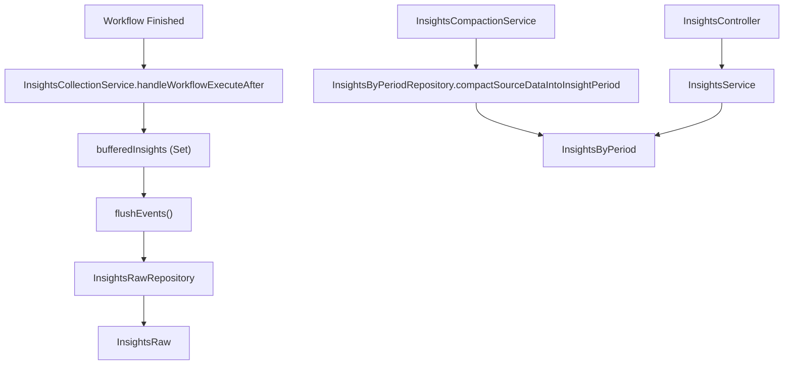
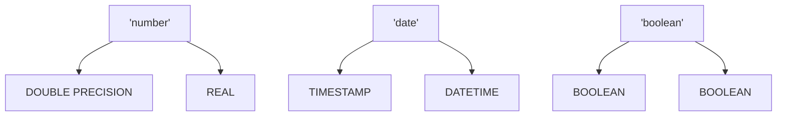

# 数据存储与洞察模块 (Data Store and Insights Modules)

相关源文件

-   [packages/@n8n/api-types/src/dto/data-table/add-data-table-rows.dto.ts](https://github.com/n8n-io/n8n/blob/88f170b9/packages/@n8n/api-types/src/dto/data-table/add-data-table-rows.dto.ts)
-   [packages/@n8n/api-types/src/dto/insights/__tests__/date-filter.dto.test.ts](https://github.com/n8n-io/n8n/blob/88f170b9/packages/@n8n/api-types/src/dto/insights/__tests__/date-filter.dto.test.ts)
-   [packages/@n8n/api-types/src/dto/insights/__tests__/list-workflow-query.dto.test.ts](https://github.com/n8n-io/n8n/blob/88f170b9/packages/@n8n/api-types/src/dto/insights/__tests__/list-workflow-query.dto.test.ts)
-   [packages/@n8n/api-types/src/dto/insights/date-filter.dto.ts](https://github.com/n8n-io/n8n/blob/88f170b9/packages/@n8n/api-types/src/dto/insights/date-filter.dto.ts)
-   [packages/@n8n/api-types/src/dto/insights/list-workflow-query.dto.ts](https://github.com/n8n-io/n8n/blob/88f170b9/packages/@n8n/api-types/src/dto/insights/list-workflow-query.dto.ts)
-   [packages/@n8n/api-types/src/dto/pagination/__tests__/pagination.dto.test.ts](https://github.com/n8n-io/n8n/blob/88f170b9/packages/@n8n/api-types/src/dto/pagination/__tests__/pagination.dto.test.ts)
-   [packages/@n8n/api-types/src/dto/pagination/pagination.dto.ts](https://github.com/n8n-io/n8n/blob/88f170b9/packages/@n8n/api-types/src/dto/pagination/pagination.dto.ts)
-   [packages/@n8n/api-types/src/schemas/__tests__/insights.schema.test.ts](https://github.com/n8n-io/n8n/blob/88f170b9/packages/@n8n/api-types/src/schemas/__tests__/insights.schema.test.ts)
-   [packages/@n8n/api-types/src/schemas/insights.schema.ts](https://github.com/n8n-io/n8n/blob/88f170b9/packages/@n8n/api-types/src/schemas/insights.schema.ts)
-   [packages/@n8n/db/src/utils/transaction.ts](https://github.com/n8n-io/n8n/blob/88f170b9/packages/@n8n/db/src/utils/transaction.ts)
-   [packages/cli/src/execution-lifecycle/execute-error-workflow.ts](https://github.com/n8n-io/n8n/blob/88f170b9/packages/cli/src/execution-lifecycle/execute-error-workflow.ts)
-   [packages/cli/src/middlewares/list-query/__tests__/list-query.test.ts](https://github.com/n8n-io/n8n/blob/88f170b9/packages/cli/src/middlewares/list-query/__tests__/list-query.test.ts)
-   [packages/cli/src/middlewares/list-query/dtos/pagination.dto.ts](https://github.com/n8n-io/n8n/blob/88f170b9/packages/cli/src/middlewares/list-query/dtos/pagination.dto.ts)
-   [packages/cli/src/middlewares/list-query/dtos/workflow.sort-by.dto.ts](https://github.com/n8n-io/n8n/blob/88f170b9/packages/cli/src/middlewares/list-query/dtos/workflow.sort-by.dto.ts)
-   [packages/cli/src/middlewares/list-query/index.ts](https://github.com/n8n-io/n8n/blob/88f170b9/packages/cli/src/middlewares/list-query/index.ts)
-   [packages/cli/src/middlewares/list-query/sort-by.ts](https://github.com/n8n-io/n8n/blob/88f170b9/packages/cli/src/middlewares/list-query/sort-by.ts)
-   [packages/cli/src/modules/data-table/__tests__/test-helpers.ts](https://github.com/n8n-io/n8n/blob/88f170b9/packages/cli/src/modules/data-table/__tests__/test-helpers.ts)
-   [packages/cli/src/modules/data-table/utils/sql-utils.ts](https://github.com/n8n-io/n8n/blob/88f170b9/packages/cli/src/modules/data-table/utils/sql-utils.ts)
-   [packages/cli/src/modules/insights/__tests__/insights-collection.service.integration.test.ts](https://github.com/n8n-io/n8n/blob/88f170b9/packages/cli/src/modules/insights/__tests__/insights-collection.service.integration.test.ts)
-   [packages/cli/src/modules/insights/__tests__/insights-collection.service.test.ts](https://github.com/n8n-io/n8n/blob/88f170b9/packages/cli/src/modules/insights/__tests__/insights-collection.service.test.ts)
-   [packages/cli/src/modules/insights/__tests__/insights.controller.test.ts](https://github.com/n8n-io/n8n/blob/88f170b9/packages/cli/src/modules/insights/__tests__/insights.controller.test.ts)
-   [packages/cli/src/modules/insights/__tests__/insights.module.test.ts](https://github.com/n8n-io/n8n/blob/88f170b9/packages/cli/src/modules/insights/__tests__/insights.module.test.ts)
-   [packages/cli/src/modules/insights/__tests__/insights.service.integration.test.ts](https://github.com/n8n-io/n8n/blob/88f170b9/packages/cli/src/modules/insights/__tests__/insights.service.integration.test.ts)
-   [packages/cli/src/modules/insights/__tests__/insights.service.test.ts](https://github.com/n8n-io/n8n/blob/88f170b9/packages/cli/src/modules/insights/__tests__/insights.service.test.ts)
-   [packages/cli/src/modules/insights/__tests__/insights.settings.test.ts](https://github.com/n8n-io/n8n/blob/88f170b9/packages/cli/src/modules/insights/__tests__/insights.settings.test.ts)
-   [packages/cli/src/modules/insights/database/repositories/__tests__/insights-by-period-query.helper.test.ts](https://github.com/n8n-io/n8n/blob/88f170b9/packages/cli/src/modules/insights/database/repositories/__tests__/insights-by-period-query.helper.test.ts)
-   [packages/cli/src/modules/insights/database/repositories/__tests__/insights-by-period.repository.integration.test.ts](https://github.com/n8n-io/n8n/blob/88f170b9/packages/cli/src/modules/insights/database/repositories/__tests__/insights-by-period.repository.integration.test.ts)
-   [packages/cli/src/modules/insights/database/repositories/insights-by-period-query.helper.ts](https://github.com/n8n-io/n8n/blob/88f170b9/packages/cli/src/modules/insights/database/repositories/insights-by-period-query.helper.ts)
-   [packages/cli/src/modules/insights/database/repositories/insights-by-period.repository.ts](https://github.com/n8n-io/n8n/blob/88f170b9/packages/cli/src/modules/insights/database/repositories/insights-by-period.repository.ts)
-   [packages/cli/src/modules/insights/database/repositories/insights-raw.repository.ts](https://github.com/n8n-io/n8n/blob/88f170b9/packages/cli/src/modules/insights/database/repositories/insights-raw.repository.ts)
-   [packages/cli/src/modules/insights/insights-collection.service.ts](https://github.com/n8n-io/n8n/blob/88f170b9/packages/cli/src/modules/insights/insights-collection.service.ts)
-   [packages/cli/src/modules/insights/insights-compaction.service.ts](https://github.com/n8n-io/n8n/blob/88f170b9/packages/cli/src/modules/insights/insights-compaction.service.ts)
-   [packages/cli/src/modules/insights/insights.config.ts](https://github.com/n8n-io/n8n/blob/88f170b9/packages/cli/src/modules/insights/insights.config.ts)
-   [packages/cli/src/modules/insights/insights.controller.ts](https://github.com/n8n-io/n8n/blob/88f170b9/packages/cli/src/modules/insights/insights.controller.ts)
-   [packages/cli/src/modules/insights/insights.module.ts](https://github.com/n8n-io/n8n/blob/88f170b9/packages/cli/src/modules/insights/insights.module.ts)
-   [packages/cli/src/modules/insights/insights.service.ts](https://github.com/n8n-io/n8n/blob/88f170b9/packages/cli/src/modules/insights/insights.service.ts)
-   [packages/cli/src/modules/insights/insights.settings.ts](https://github.com/n8n-io/n8n/blob/88f170b9/packages/cli/src/modules/insights/insights.settings.ts)
-   [packages/cli/test/integration/insights/insights-vs-workflow-statistics.integration.test.ts](https://github.com/n8n-io/n8n/blob/88f170b9/packages/cli/test/integration/insights/insights-vs-workflow-statistics.integration.test.ts)
-   [packages/cli/test/integration/insights/insights.api.test.ts](https://github.com/n8n-io/n8n/blob/88f170b9/packages/cli/test/integration/insights/insights.api.test.ts)
-   [packages/cli/test/integration/shared/execution-context-helpers.ts](https://github.com/n8n-io/n8n/blob/88f170b9/packages/cli/test/integration/shared/execution-context-helpers.ts)
-   [packages/cli/test/integration/shared/workflow-fixtures.ts](https://github.com/n8n-io/n8n/blob/88f170b9/packages/cli/test/integration/shared/workflow-fixtures.ts)
-   [packages/frontend/@n8n/design-system/src/components/N8nDataTableServer/N8nDataTableServer.test.ts](https://github.com/n8n-io/n8n/blob/88f170b9/packages/frontend/@n8n/design-system/src/components/N8nDataTableServer/N8nDataTableServer.test.ts)
-   [packages/frontend/@n8n/design-system/src/components/N8nDataTableServer/N8nDataTableServer.vue](https://github.com/n8n-io/n8n/blob/88f170b9/packages/frontend/@n8n/design-system/src/components/N8nDataTableServer/N8nDataTableServer.vue)
-   [packages/nodes-base/nodes/DataTable/actions/row/delete.operation.ts](https://github.com/n8n-io/n8n/blob/88f170b9/packages/nodes-base/nodes/DataTable/actions/row/delete.operation.ts)
-   [packages/nodes-base/nodes/DataTable/actions/row/update.operation.ts](https://github.com/n8n-io/n8n/blob/88f170b9/packages/nodes-base/nodes/DataTable/actions/row/update.operation.ts)
-   [packages/nodes-base/nodes/DataTable/actions/row/upsert.operation.ts](https://github.com/n8n-io/n8n/blob/88f170b9/packages/nodes-base/nodes/DataTable/actions/row/upsert.operation.ts)

**数据存储 (Data Store)**（数据表）和**洞察 (Insights)** 模块为 n8n 提供了内部结构化存储和执行分析能力。数据表 (Data Table) 模块允许工作流在受管模式中持久化数据，而无需外部数据库；而洞察模块则跟踪性能指标，如成功率、执行时间和节省的时间。

## 1. 洞察模块 (Insights Module)

洞察模块负责收集、聚合和报告工作流执行指标。它被实现为一个 `BackendModule`，仅在 `main` 和 `webhook` 实例类型上初始化，因为这些是获知执行完成情况的进程 [packages/cli/src/modules/insights/insights.module.ts:9-10]。

### 架构与数据流 (Architecture and Data Flow)

系统采用三层存储策略，以平衡写入性能与查询效率：

1.  **缓冲区 (Buffer)**: `InsightsCollectionService` 中的内存 `Set` [packages/cli/src/modules/insights/insights-collection.service.ts:71-71]。
2.  **原始存储 (Raw Storage)**: 用于高频事件摄取的 `InsightsRaw` 表。
3.  **聚合存储 (Aggregated Storage)**: 用于长期报告的 `InsightsByPeriod` 表。

#### 自然语言到代码实体空间：洞察流程 (Natural Language to Code Entity Space: Insights Flow)

下图将洞察处理的逻辑阶段映射到代码库中的具体类和仓库 (Repositories)。

**来源：** [packages/cli/src/modules/insights/insights-collection.service.ts:137-142], [packages/cli/src/modules/insights/insights-compaction.service.ts:12-12], [packages/cli/src/modules/insights/insights.service.ts:16-26]。

### 关键组件 (Key Components)

| 组件 | 职责 |
| --- | --- |
| `InsightsCollectionService` | 监听 `workflowExecuteAfter` 生命周期事件，计算 `runtimeMs` 和 `timeSaved`，并管理内存缓冲区 [packages/cli/src/modules/insights/insights-collection.service.ts:68-89]。 |
| `InsightsCompactionService` | 一个后台服务，定期通过将数据聚合到时间桶（小时、天、周）中，将数据从 `InsightsRaw` 移动到 `InsightsByPeriod` [packages/cli/src/modules/insights/insights-compaction.service.ts:12-12]。 |
| `InsightsByPeriodRepository` | 包含用于时间序列聚合的复杂 SQL 逻辑，包括用于日期范围的公用表表达式 (CTE) [packages/cli/src/modules/insights/database/repositories/insights-by-period.repository.ts:76-81]。 |
| `InsightsPruningService` | 根据许可证定义的历史记录限制删除旧记录 [packages/cli/src/modules/insights/insights.service.ts:20-21]。 |

### 指标计算 (Metrics Calculation)

该模块跟踪 `TypeUnit` 中定义的四种主要指标类型：`success`、`failure`、`runtime_ms` 和 `time_saved_min` [packages/cli/src/modules/insights/insights.service.ts:105-128]。

-   **节省的时间 (Time Saved)**: 计算方式可以是单次执行的“固定 (`fixed`)”值，也可以是“动态 (`dynamic`)”值，即通过汇总单次运行中所有已执行节点的 `metadata.timeSaved` 来计算 [packages/cli/src/modules/insights/insights-collection.service.ts:178-187]。
-   **平均值与偏差**: `InsightsService` 计算当前周期与上一个周期之间的偏差，以便在仪表板中显示趋势 [packages/cli/src/modules/insights/insights.service.ts:130-160]。

**来源：** [packages/cli/src/modules/insights/insights.service.ts:105-163], [packages/cli/src/modules/insights/insights-collection.service.ts:157-187]。

---

## 2. 数据存储（数据表）模块 (Data Store (Data Table) Module)

数据表模块为用户提供了一种在 n8n 内部创建结构化表的方法。这些表由 n8n 的主数据库（PostgreSQL 或 SQLite）支持，但通过特定的抽象层进行管理。

### 模式管理与 SQL 工具 (Schema Management and SQL Utilities)

该模块使用 `sql-utils.ts` 将 n8n 特定的类型（`string`, `number`, `boolean`, `date`）转换为数据库特定的 DDL [packages/cli/src/modules/data-table/utils/sql-utils.ts:24-41]。

**来源：** [packages/cli/src/modules/data-table/utils/sql-utils.ts:43-69]。

### 关键函数 (Key Functions)

-   `toDslColumns`: 将前端模式定义转换为用于创建表的 `DslColumn` 对象 [packages/cli/src/modules/data-table/utils/sql-utils.ts:24-41]。
-   `addColumnQuery` / `renameColumnQuery`: 生成 `ALTER TABLE` 语句，同时根据 `dataTableColumnNameSchema` 验证列名以防止 SQL 注入 [packages/cli/src/modules/data-table/utils/sql-utils.ts:82-121]。
-   `normalizeRows`: 对原始数据库结果进行后处理，以确保类型（特别是布尔值和日期）与 n8n 模式匹配，处理 SQLite 字符串日期与 Postgres Date 对象之间的差异 [packages/cli/src/modules/data-table/utils/sql-utils.ts:209-234]。

---

## 3. 集成与许可 (Integration and Licensing)

### 模块生命周期 (Module Lifecycle)

`InsightsModule` 实现了 `init` 和 `shutdown` 挂钩。在 `init` 期间，它注册 `InsightsController` 并启动收集服务 [packages/cli/src/modules/insights/insights.module.ts:11-16]。在 `shutdown` 时，它确保在进程退出前将内存缓冲区冲刷到数据库中 [packages/cli/src/modules/insights/insights.module.ts:32-37]。

### 许可与权限 (Licensing and Permissions)

对洞察模块的访问受权限和许可特性的双重限制：

-   **全局范围 (Global Scopes)**: 端点需要 `insights:list` 范围 [packages/cli/src/modules/insights/insights.controller.ts:25-25]。
-   **许可门控**: 高级视图（如完整仪表板或精细的小时数据）需要特定的许可标志 (`feat:insights:viewDashboard`) [packages/cli/src/modules/insights/insights.controller.ts:42-42]。
-   **历史限制**: `InsightsPruningService` 使用 `licenseState.getInsightsMaxHistory()` 来确定要保留多少天的数据 [packages/cli/src/modules/insights/**tests**/insights.controller.test.ts:43-43]。

**来源：** [packages/cli/src/modules/insights/insights.module.ts:1-38], [packages/cli/src/modules/insights/insights.controller.ts:20-67]。
