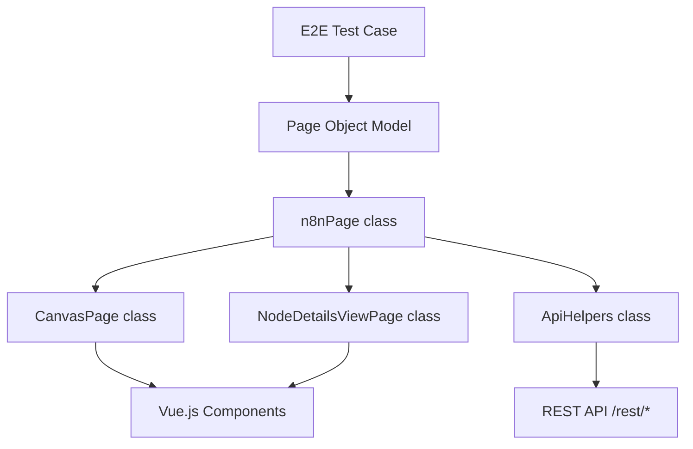
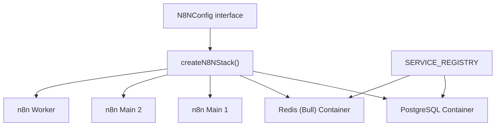

# 测试基础设施 (Testing Infrastructure)

相关源文件

-   [.github/workflows/test-e2e-helm.yml](https://github.com/n8n-io/n8n/blob/88f170b9/.github/workflows/test-e2e-helm.yml)
-   [packages/@n8n/nodes-langchain/nodes/vendors/OpenAi/v2/actions/node.type.ts](https://github.com/n8n-io/n8n/blob/88f170b9/packages/@n8n/nodes-langchain/nodes/vendors/OpenAi/v2/actions/node.type.ts)
-   [packages/@n8n/nodes-langchain/nodes/vendors/OpenAi/v2/actions/text/index.ts](https://github.com/n8n-io/n8n/blob/88f170b9/packages/@n8n/nodes-langchain/nodes/vendors/OpenAi/v2/actions/text/index.ts)
-   [packages/cli/src/controllers/third-party-licenses.controller.ts](https://github.com/n8n-io/n8n/blob/88f170b9/packages/cli/src/controllers/third-party-licenses.controller.ts)
-   [packages/cli/test/integration/controllers/third-party-licenses.controller.test.ts](https://github.com/n8n-io/n8n/blob/88f170b9/packages/cli/test/integration/controllers/third-party-licenses.controller.test.ts)
-   [packages/frontend/@n8n/rest-api-client/src/api/third-party-licenses.ts](https://github.com/n8n-io/n8n/blob/88f170b9/packages/frontend/@n8n/rest-api-client/src/api/third-party-licenses.ts)
-   [packages/frontend/editor-ui/src/features/ndv/runData/components/__snapshots__/RunDataJson.test.ts.snap](https://github.com/n8n-io/n8n/blob/88f170b9/packages/frontend/editor-ui/src/features/ndv/runData/components/__snapshots__/RunDataJson.test.ts.snap)
-   [packages/testing/containers/HELM-TESTING.md](https://github.com/n8n-io/n8n/blob/88f170b9/packages/testing/containers/HELM-TESTING.md?plain=1)
-   [packages/testing/containers/README.md](https://github.com/n8n-io/n8n/blob/88f170b9/packages/testing/containers/README.md?plain=1)
-   [packages/testing/containers/helm-stack.ts](https://github.com/n8n-io/n8n/blob/88f170b9/packages/testing/containers/helm-stack.ts)
-   [packages/testing/containers/helm-start-stack.ts](https://github.com/n8n-io/n8n/blob/88f170b9/packages/testing/containers/helm-start-stack.ts)
-   [packages/testing/containers/index.ts](https://github.com/n8n-io/n8n/blob/88f170b9/packages/testing/containers/index.ts)
-   [packages/testing/containers/n8n-start-stack.ts](https://github.com/n8n-io/n8n/blob/88f170b9/packages/testing/containers/n8n-start-stack.ts)
-   [packages/testing/containers/package.json](https://github.com/n8n-io/n8n/blob/88f170b9/packages/testing/containers/package.json)
-   [packages/testing/containers/services/kafka.ts](https://github.com/n8n-io/n8n/blob/88f170b9/packages/testing/containers/services/kafka.ts)
-   [packages/testing/containers/services/registry.ts](https://github.com/n8n-io/n8n/blob/88f170b9/packages/testing/containers/services/registry.ts)
-   [packages/testing/containers/services/types.ts](https://github.com/n8n-io/n8n/blob/88f170b9/packages/testing/containers/services/types.ts)
-   [packages/testing/containers/test-containers.ts](https://github.com/n8n-io/n8n/blob/88f170b9/packages/testing/containers/test-containers.ts)
-   [packages/testing/playwright/CONTRIBUTING.md](https://github.com/n8n-io/n8n/blob/88f170b9/packages/testing/playwright/CONTRIBUTING.md?plain=1)
-   [packages/testing/playwright/README.md](https://github.com/n8n-io/n8n/blob/88f170b9/packages/testing/playwright/README.md?plain=1)
-   [packages/testing/playwright/Types.ts](https://github.com/n8n-io/n8n/blob/88f170b9/packages/testing/playwright/Types.ts)
-   [packages/testing/playwright/composables/ProjectComposer.ts](https://github.com/n8n-io/n8n/blob/88f170b9/packages/testing/playwright/composables/ProjectComposer.ts)
-   [packages/testing/playwright/composables/WorkflowComposer.ts](https://github.com/n8n-io/n8n/blob/88f170b9/packages/testing/playwright/composables/WorkflowComposer.ts)
-   [packages/testing/playwright/currents.config.ts](https://github.com/n8n-io/n8n/blob/88f170b9/packages/testing/playwright/currents.config.ts)
-   [packages/testing/playwright/fixtures/base.ts](https://github.com/n8n-io/n8n/blob/88f170b9/packages/testing/playwright/fixtures/base.ts)
-   [packages/testing/playwright/fixtures/capabilities.ts](https://github.com/n8n-io/n8n/blob/88f170b9/packages/testing/playwright/fixtures/capabilities.ts)
-   [packages/testing/playwright/global-setup.ts](https://github.com/n8n-io/n8n/blob/88f170b9/packages/testing/playwright/global-setup.ts)
-   [packages/testing/playwright/helpers/NavigationHelper.ts](https://github.com/n8n-io/n8n/blob/88f170b9/packages/testing/playwright/helpers/NavigationHelper.ts)
-   [packages/testing/playwright/package.json](https://github.com/n8n-io/n8n/blob/88f170b9/packages/testing/playwright/package.json)
-   [packages/testing/playwright/pages/CanvasPage.ts](https://github.com/n8n-io/n8n/blob/88f170b9/packages/testing/playwright/pages/CanvasPage.ts)
-   [packages/testing/playwright/pages/NodeDetailsViewPage.ts](https://github.com/n8n-io/n8n/blob/88f170b9/packages/testing/playwright/pages/NodeDetailsViewPage.ts)
-   [packages/testing/playwright/pages/ProjectSettingsPage.ts](https://github.com/n8n-io/n8n/blob/88f170b9/packages/testing/playwright/pages/ProjectSettingsPage.ts)
-   [packages/testing/playwright/pages/SecretsProviderSettingsPage.ts](https://github.com/n8n-io/n8n/blob/88f170b9/packages/testing/playwright/pages/SecretsProviderSettingsPage.ts)
-   [packages/testing/playwright/pages/SidebarPage.ts](https://github.com/n8n-io/n8n/blob/88f170b9/packages/testing/playwright/pages/SidebarPage.ts)
-   [packages/testing/playwright/pages/WorkflowSettingsModal.ts](https://github.com/n8n-io/n8n/blob/88f170b9/packages/testing/playwright/pages/WorkflowSettingsModal.ts)
-   [packages/testing/playwright/pages/components/DeleteSecretsProviderModal.ts](https://github.com/n8n-io/n8n/blob/88f170b9/packages/testing/playwright/pages/components/DeleteSecretsProviderModal.ts)
-   [packages/testing/playwright/pages/components/SecretsProviderConnectionModal.ts](https://github.com/n8n-io/n8n/blob/88f170b9/packages/testing/playwright/pages/components/SecretsProviderConnectionModal.ts)
-   [packages/testing/playwright/pages/n8nPage.ts](https://github.com/n8n-io/n8n/blob/88f170b9/packages/testing/playwright/pages/n8nPage.ts)
-   [packages/testing/playwright/playwright-projects.ts](https://github.com/n8n-io/n8n/blob/88f170b9/packages/testing/playwright/playwright-projects.ts)
-   [packages/testing/playwright/playwright.config.ts](https://github.com/n8n-io/n8n/blob/88f170b9/packages/testing/playwright/playwright.config.ts)
-   [packages/testing/playwright/reporters/USAGE.md](https://github.com/n8n-io/n8n/blob/88f170b9/packages/testing/playwright/reporters/USAGE.md?plain=1)
-   [packages/testing/playwright/reporters/metrics-reporter.ts](https://github.com/n8n-io/n8n/blob/88f170b9/packages/testing/playwright/reporters/metrics-reporter.ts)
-   [packages/testing/playwright/scripts/coverage-workflow.md](https://github.com/n8n-io/n8n/blob/88f170b9/packages/testing/playwright/scripts/coverage-workflow.md?plain=1)
-   [packages/testing/playwright/scripts/generate-coverage-report.js](https://github.com/n8n-io/n8n/blob/88f170b9/packages/testing/playwright/scripts/generate-coverage-report.js)
-   [packages/testing/playwright/tests/e2e/nodes/kafka-nodes.spec.ts](https://github.com/n8n-io/n8n/blob/88f170b9/packages/testing/playwright/tests/e2e/nodes/kafka-nodes.spec.ts)
-   [packages/testing/playwright/tests/e2e/settings/external-secrets/secret-providers-connections-ui.spec.ts](https://github.com/n8n-io/n8n/blob/88f170b9/packages/testing/playwright/tests/e2e/settings/external-secrets/secret-providers-connections-ui.spec.ts)
-   [packages/testing/playwright/tests/e2e/workflows/editor/canvas/canvas-zoom.spec.ts](https://github.com/n8n-io/n8n/blob/88f170b9/packages/testing/playwright/tests/e2e/workflows/editor/canvas/canvas-zoom.spec.ts)
-   [packages/testing/playwright/tests/e2e/workflows/editor/execution/execution.spec.ts](https://github.com/n8n-io/n8n/blob/88f170b9/packages/testing/playwright/tests/e2e/workflows/editor/execution/execution.spec.ts)
-   [packages/testing/playwright/tests/e2e/workflows/editor/execution/inject-previous.spec.ts](https://github.com/n8n-io/n8n/blob/88f170b9/packages/testing/playwright/tests/e2e/workflows/editor/execution/inject-previous.spec.ts)
-   [packages/testing/playwright/tests/e2e/workflows/editor/execution/logs.spec.ts](https://github.com/n8n-io/n8n/blob/88f170b9/packages/testing/playwright/tests/e2e/workflows/editor/execution/logs.spec.ts)
-   [packages/testing/playwright/tests/e2e/workflows/editor/expressions/inline.spec.ts](https://github.com/n8n-io/n8n/blob/88f170b9/packages/testing/playwright/tests/e2e/workflows/editor/expressions/inline.spec.ts)
-   [packages/testing/playwright/tests/e2e/workflows/editor/ndv/pinning.spec.ts](https://github.com/n8n-io/n8n/blob/88f170b9/packages/testing/playwright/tests/e2e/workflows/editor/ndv/pinning.spec.ts)
-   [packages/testing/playwright/tests/e2e/workflows/editor/workflow-actions/archive.spec.ts](https://github.com/n8n-io/n8n/blob/88f170b9/packages/testing/playwright/tests/e2e/workflows/editor/workflow-actions/archive.spec.ts)
-   [packages/testing/playwright/tests/performance/large-node-cloud.spec.ts](https://github.com/n8n-io/n8n/blob/88f170b9/packages/testing/playwright/tests/performance/large-node-cloud.spec.ts)
-   [packages/testing/playwright/tests/performance/memory-consumption-cloud.spec.ts](https://github.com/n8n-io/n8n/blob/88f170b9/packages/testing/playwright/tests/performance/memory-consumption-cloud.spec.ts)
-   [packages/testing/playwright/tests/performance/memory-retention.spec.ts](https://github.com/n8n-io/n8n/blob/88f170b9/packages/testing/playwright/tests/performance/memory-retention.spec.ts)
-   [packages/testing/playwright/utils/performance-helper.ts](https://github.com/n8n-io/n8n/blob/88f170b9/packages/testing/playwright/utils/performance-helper.ts)
-   [packages/testing/playwright/utils/requirements.ts](https://github.com/n8n-io/n8n/blob/88f170b9/packages/testing/playwright/utils/requirements.ts)
-   [packages/testing/playwright/workflows/Pinned_webhook_node.json](https://github.com/n8n-io/n8n/blob/88f170b9/packages/testing/playwright/workflows/Pinned_webhook_node.json)
-   [packages/testing/playwright/workflows/Test_ado_1338.json](https://github.com/n8n-io/n8n/blob/88f170b9/packages/testing/playwright/workflows/Test_ado_1338.json)
-   [packages/testing/playwright/workflows/Test_workflow_webhook_with_pin_data.json](https://github.com/n8n-io/n8n/blob/88f170b9/packages/testing/playwright/workflows/Test_workflow_webhook_with_pin_data.json)

本页面高度概述了 n8n 的测试策略、用于确保整个 Monorepo 代码质量的工具，以及支持自动化执行的基础设施。n8n 采用了一种多层级的方法，从孤立的单元测试到涉及多个容器的复杂分布式端到端 (E2E) 场景。

有关特定领域的深入探讨，请参阅子页面：

-   **[测试策略与工具 (Testing Strategy and Tools)](/n8n-io/n8n/8.1-testing-strategy-and-tools)** — 详细的模拟 (Mocking) 策略、Vitest/Jest 配置以及 `@n8n/backend-test-utils` 包。
-   **[使用 Playwright 进行 E2E 测试 (E2E Testing with Playwright)](/n8n-io/n8n/8.2-e2e-testing-with-playwright)** — 浏览器自动化、页面对象模型 (POM) 架构以及基础设施测试。
-   **[单元测试与集成测试 (Unit and Integration Testing)](/n8n-io/n8n/8.3-unit-and-integration-testing)** — 测试节点、CLI 命令以及数据库迁移的模式。

## 测试策略概述 (Testing Strategy Overview)

n8n 测试金字塔旨在平衡执行速度与信心。基础设施支持针对本地开发服务器或镜像生产配置的隔离 Docker 环境运行测试。

| 层级 | 工具 | 主要包/位置 | 目的 |
| --- | --- | --- | --- |
| **单元 (Unit)** | Vitest / Jest | `packages/*` | 孤立验证逻辑。 |
| **集成 (Integration)** | Jest + Testcontainers | `packages/cli/test` | 数据库迁移和服务交互。 |
| **E2E** | Playwright | `packages/testing/playwright` | 完整用户流程（画布、NDV、设置）。 |
| **基础设施 (Infrastructure)** | Playwright + `n8n-containers` | `packages/testing/playwright` | 验证 Postgres、队列模式和多主模式。 |
| **性能 (Performance)** | Playwright + Autocannon | `packages/testing/playwright/tests/performance` | 内存消耗和执行基准测试。 |

来源：[packages/testing/playwright/package.json5-23](https://github.com/n8n-io/n8n/blob/88f170b9/packages/testing/playwright/package.json#L5-L23) [packages/testing/playwright/playwright.config.ts83-109](https://github.com/n8n-io/n8n/blob/88f170b9/packages/testing/playwright/playwright.config.ts#L83-L109)

## 测试执行架构 (Test Execution Architecture)

测试基础设施弥补了高层测试定义与底层代码实体（如控制器和服务）之间的鸿沟。

### 从测试逻辑到代码实体 (From Test Logic to Code Entities)

下图说明了在 E2E 测试期间，Playwright 基础设施如何与 n8n 应用程序组件交互。

来源：[packages/testing/playwright/pages/n8nPage.ts69-147](https://github.com/n8n-io/n8n/blob/88f170b9/packages/testing/playwright/pages/n8nPage.ts#L69-L147) [packages/testing/playwright/pages/CanvasPage.ts15-27](https://github.com/n8n-io/n8n/blob/88f170b9/packages/testing/playwright/pages/CanvasPage.ts#L15-L27) [packages/testing/playwright/pages/NodeDetailsViewPage.ts11-23](https://github.com/n8n-io/n8n/blob/88f170b9/packages/testing/playwright/pages/NodeDetailsViewPage.ts#L11-L23)

## 容器化测试基础设施 (Containerized Testing Infrastructure)

为了在各种部署模式（Postgres、队列模式、多主模式）下测试 n8n，该项目使用了位于 `packages/testing/containers` 的自定义容器编排层。这允许开发人员启动一个包含 n8n 及其依赖项（Redis、Postgres、Mailpit 等）的“栈 (Stack)”。

### 基础设施映射 (Infrastructure Mapping)

来源：[packages/testing/containers/n8n-start-stack.ts138-182](https://github.com/n8n-io/n8n/blob/88f170b9/packages/testing/containers/n8n-start-stack.ts#L138-L182) [packages/testing/containers/stack.ts19-20](https://github.com/n8n-io/n8n/blob/88f170b9/packages/testing/containers/stack.ts#L19-L20) [packages/testing/playwright/playwright-projects.ts26-34](https://github.com/n8n-io/n8n/blob/88f170b9/packages/testing/playwright/playwright-projects.ts#L26-L34)

## 工具与实用程序 (Tooling and Utilities)

### Playwright 页面对象 (Playwright Page Objects)

E2E 套件建立在健壮的页面对象模型 (Page Object Model) 之上。`n8nPage` 类作为入口点，提供对专用页面的访问：

-   **`CanvasPage`**: 管理画布上的节点创建、连接和工作流执行 [packages/testing/playwright/pages/CanvasPage.ts15-152](https://github.com/n8n-io/n8n/blob/88f170b9/packages/testing/playwright/pages/CanvasPage.ts#L15-L152)。
-   **`NodeDetailsViewPage` (NDV)**: 处理节点内的参数配置、表达式编辑和数据固定 [packages/testing/playwright/pages/NodeDetailsViewPage.ts11-156](https://github.com/n8n-io/n8n/blob/88f170b9/packages/testing/playwright/pages/NodeDetailsViewPage.ts#L11-L156)。
-   **`SidebarPage`**: 管理工作流、凭据和设置之间的导航 [packages/testing/playwright/pages/SidebarPage.ts3-148](https://github.com/n8n-io/n8n/blob/88f170b9/packages/testing/playwright/pages/SidebarPage.ts#L3-L148)。

### 性能基准测试 (Performance Benchmarking)

基础设施包括用于性能跟踪的专用项目。这些项目使用 `N8NConfig` 中的 `resourceQuota` 设置来模拟受限环境（例如 512MB RAM），并使用 `getStableHeap` 测量内存堆稳定性。来源：[packages/testing/playwright/tests/performance/memory-consumption-cloud.spec.ts4-9](https://github.com/n8n-io/n8n/blob/88f170b9/packages/testing/playwright/tests/performance/memory-consumption-cloud.spec.ts#L4-L9) [packages/testing/playwright/playwright-projects.ts45-58](https://github.com/n8n-io/n8n/blob/88f170b9/packages/testing/playwright/playwright-projects.ts#L45-L58)。

### 覆盖率收集 (Coverage Collection)

n8n 使用 Istanbul 进行检测 (Instrumentation)。在 E2E 运行期间，覆盖率数据从浏览器收集并合并到统一的报告中。

-   **脚本**: `packages/testing/playwright/scripts/generate-coverage-report.js`
-   **命令**: `pnpm coverage:report` 和 `pnpm coverage:analyse` [packages/testing/playwright/package.json24-26](https://github.com/n8n-io/n8n/blob/88f170b9/packages/testing/playwright/package.json#L24-L26)。

## 持续集成 (CI)

测试通过 GitHub Actions 和 [Currents.dev](https://currents.dev) 进行编排，以实现分布式执行。`playwright.config.ts` 根据环境（本地与 CI）动态计算工作线程数量，并管理后端服务器的生命周期。

-   **工作线程 (Workers)**: 使用 `os.cpus()` 扩展执行规模 [packages/testing/playwright/playwright.config.ts36-39](https://github.com/n8n-io/n8n/blob/88f170b9/packages/testing/playwright/playwright.config.ts#L36-L39)。
-   **Web 服务器**: 如果未提供 `N8N_BASE_URL`，Playwright 会使用 `pnpm start` 自动启动 n8n 后端 [packages/testing/playwright/playwright.config.ts47-67](https://github.com/n8n-io/n8n/blob/88f170b9/packages/testing/playwright/playwright.config.ts#L47-L67)。

来源：[packages/testing/playwright/playwright.config.ts1-128](https://github.com/n8n-io/n8n/blob/88f170b9/packages/testing/playwright/playwright.config.ts#L1-L128) [packages/testing/playwright/package.json1-66](https://github.com/n8n-io/n8n/blob/88f170b9/packages/testing/playwright/package.json#L1-L66)
