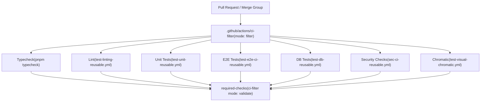
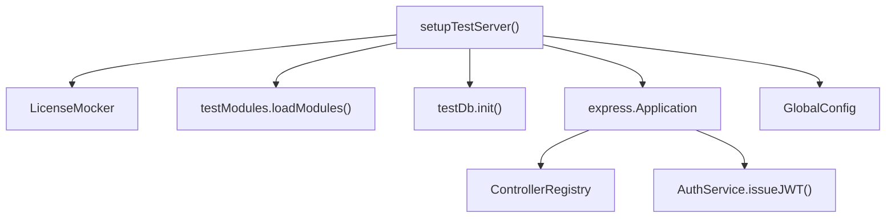

# 测试策略与工具 (Testing Strategy and Tools)

相关源文件

-   [packages/cli/src/generic-helpers.ts](https://github.com/n8n-io/n8n/blob/88f170b9/packages/cli/src/generic-helpers.ts)
-   [packages/cli/src/middlewares/list-query/filter.ts](https://github.com/n8n-io/n8n/blob/88f170b9/packages/cli/src/middlewares/list-query/filter.ts)
-   [packages/cli/src/middlewares/list-query/select.ts](https://github.com/n8n-io/n8n/blob/88f170b9/packages/cli/src/middlewares/list-query/select.ts)
-   [packages/cli/src/server.ts](https://github.com/n8n-io/n8n/blob/88f170b9/packages/cli/src/server.ts)
-   [packages/cli/test/integration/deduplication/deduplication-helper.test.ts](https://github.com/n8n-io/n8n/blob/88f170b9/packages/cli/test/integration/deduplication/deduplication-helper.test.ts)
-   [packages/cli/test/integration/shared/types.ts](https://github.com/n8n-io/n8n/blob/88f170b9/packages/cli/test/integration/shared/types.ts)
-   [packages/cli/test/integration/shared/utils/node-types-data.ts](https://github.com/n8n-io/n8n/blob/88f170b9/packages/cli/test/integration/shared/utils/node-types-data.ts)
-   [packages/cli/test/integration/shared/utils/test-server.ts](https://github.com/n8n-io/n8n/blob/88f170b9/packages/cli/test/integration/shared/utils/test-server.ts)

本页面介绍了 n8n Monorepo 中使用的测试栈、测试套件分类、CI 过滤逻辑、共享测试工具以及 E2E 基础设施。内容涵盖了不同测试层级的结构、运行它们的框架，以及 CI 流水线如何决定在给定的拉取请求 (PR) 上执行哪些测试。

有关 Playwright E2E 模式和页面对象的详细演练，请参阅 [8.2](https://github.com/n8n-io/n8n/blob/88f170b9/8.2)。有关单元测试和集成测试模式、数据库助手以及模拟 (Mock) 约定，请参阅 [8.3](https://github.com/n8n-io/n8n/blob/88f170b9/8.3)。

---

## 测试栈概述 (Testing Stack Overview)

Monorepo 使用三个不同的测试运行器，每个运行器针对应用程序的不同层级。

| 层级 | 框架 | 位置 | CI 任务 |
| --- | --- | --- | --- |
| 后端单元测试 | Jest | `packages/cli/src/**/__tests__/`, `packages/@n8n/*/test/` | `unit-test` |
| 前端单元测试 | Vitest | `packages/frontend/**/**.test.ts` | `unit-test` |
| 集成 / 数据库测试 | Jest | `packages/cli/test/integration/`, `packages/cli/test/migration/` | `db-tests` |
| E2E 浏览器测试 | Playwright + Currents | `packages/testing/playwright/` | `e2e-tests` |
| 视觉回归测试 | Chromatic | `packages/frontend/@n8n/design-system/` | `chromatic` |

后端和前端单元测试被捆绑在同一个 `unit-test` CI 任务下，但通过不同的测试运行器运行。需要实时数据库的集成测试被分离到 `db-tests` 任务中，该任务使用 Testcontainers 启动真实的 Postgres 和 SQLite 实例。

来源：[packages/cli/src/server.ts120-122](https://github.com/n8n-io/n8n/blob/88f170b9/packages/cli/src/server.ts#L120-L122) [packages/cli/test/integration/shared/types.ts10-51](https://github.com/n8n-io/n8n/blob/88f170b9/packages/cli/test/integration/shared/types.ts#L10-L51)

---

## CI 过滤器：选择性测试执行 (CI Filter: Selective Test Execution)

每个拉取请求在执行任何测试套件之前都会运行 `ci-filter` 操作。该操作读取更改的文件集，并发出一个包含布尔标志的 JSON 对象，供下游任务使用。

**CI 过滤流水线：**

最后的 `required-checks` 任务以 `validate` 模式重新运行同一个 `ci-filter` 操作，该操作读取所有上游任务的结果，如果缺少任何必需的检查或检查失败，则会导致失败。这是分支保护的关卡。

来源：[packages/cli/src/server.ts115-151](https://github.com/n8n-io/n8n/blob/88f170b9/packages/cli/src/server.ts#L115-L151)

---

## 后端单元测试 (Jest) (Backend Unit Tests (Jest))

后端包使用 Jest 作为测试运行器，并使用 `jest-mock-extended` 进行类型化模拟。

**包级 Jest 配置位置：**

-   `packages/@n8n/config/` — 测试 `GlobalConfig` 环境变量加载。
-   `packages/cli/src/**/__tests__/` — 服务和控制器的单元测试。
-   `packages/cli/test/integration/` — 集成测试（需要数据库）。

一个典型的后端单元测试通过直接为其依赖项提供 `mock<T>()` 实例来构造被测类，从而绕过 DI 容器。

`@n8n/backend-test-utils` 包导出了多个在后端测试中通用的工具：

-   `mockInstance(ServiceClass)` — 在 DI 容器中注册一个模拟实例 [packages/cli/test/integration/shared/utils/test-server.ts112-114](https://github.com/n8n-io/n8n/blob/88f170b9/packages/cli/test/integration/shared/utils/test-server.ts#L112-L114)。
-   `mockLogger()` — 返回 `Logger` 类的类型化模拟 [packages/cli/test/integration/shared/utils/test-server.ts111](https://github.com/n8n-io/n8n/blob/88f170b9/packages/cli/test/integration/shared/utils/test-server.ts#L111-L111)。
-   `testDb` — 数据库初始化和清空的助手工具 [packages/cli/test/integration/shared/utils/test-server.ts131](https://github.com/n8n-io/n8n/blob/88f170b9/packages/cli/test/integration/shared/utils/test-server.ts#L131-L131)。

来源：[packages/cli/test/integration/shared/utils/test-server.ts1-20](https://github.com/n8n-io/n8n/blob/88f170b9/packages/cli/test/integration/shared/utils/test-server.ts#L1-L20) [packages/cli/test/integration/deduplication/deduplication-helper.test.ts1-13](https://github.com/n8n-io/n8n/blob/88f170b9/packages/cli/test/integration/deduplication/deduplication-helper.test.ts#L1-L13)

---

## 集成与数据库测试 (Jest + Testcontainers) (Integration and DB Tests (Jest + Testcontainers))

`packages/cli/test/integration/` 中的集成测试会启动一个真实的 HTTP 服务器并连接到真实的数据库。`db-tests` CI 任务使用 Testcontainers 提供临时的 Postgres 和 SQLite 实例。

### 测试服务器设置 (Test Server Setup)

`packages/cli/test/integration/shared/utils/test-server.ts` 中的 `setupTestServer` 工具负责编排用于测试的 Express 应用程序。它允许选择性加载 `endpointGroups`（例如 'workflows'、'credentials'、'publicApi'），以保持测试的专注和快速。

**集成测试架构：**

`TestServer` 接口为不同的身份验证上下文提供专门的代理 (Agents)：

-   `authAgentFor(user)`: 带有有效 JWT Cookie 的 Supertest 代理 [packages/cli/test/integration/shared/utils/test-server.ts119](https://github.com/n8n-io/n8n/blob/88f170b9/packages/cli/test/integration/shared/utils/test-server.ts#L119-L119)。
-   `publicApiAgentFor(user)`: 配置了 `X-N8N-API-KEY` 请求头的代理 [packages/cli/test/integration/shared/utils/test-server.ts122](https://github.com/n8n-io/n8n/blob/88f170b9/packages/cli/test/integration/shared/utils/test-server.ts#L122-L122)。
-   `authlessAgent`: 不带凭据的标准代理 [packages/cli/test/integration/shared/utils/test-server.ts120](https://github.com/n8n-io/n8n/blob/88f170b9/packages/cli/test/integration/shared/utils/test-server.ts#L120-L120)。

来源：[packages/cli/test/integration/shared/utils/test-server.ts95-126](https://github.com/n8n-io/n8n/blob/88f170b9/packages/cli/test/integration/shared/utils/test-server.ts#L95-L126) [packages/cli/test/integration/shared/types.ts74-84](https://github.com/n8n-io/n8n/blob/88f170b9/packages/cli/test/integration/shared/types.ts#L74-L84)

---

## E2E 测试 (Playwright) (E2E Tests (Playwright))

E2E 测试位于 `packages/testing/playwright/`。它们针对一个完全启动的 n8n 实例运行。

### E2E 后端重置端点 (E2E backend reset endpoint)

当 `inE2ETests` 为 true 时，后端会在 `/rest/e2e` 处注册一个额外的 `e2e.controller` [packages/cli/src/server.ts120-122](https://github.com/n8n-io/n8n/blob/88f170b9/packages/cli/src/server.ts#L120-L122)。该控制器提供端点以在测试运行期间重置数据库状态并切换许可证特性。

### 模拟节点类型 (Mocking Node Types)

对于涉及工作流执行或去重的集成测试，使用 `mockNodeTypesData` 来创建轻量级的 `INodeTypeData` 对象，从而避免加载完整 `nodes-base` 包的开销。

> **[Mermaid sequence]**
> *(图表结构无法解析)*

来源：[packages/cli/test/integration/deduplication/deduplication-helper.test.ts20-26](https://github.com/n8n-io/n8n/blob/88f170b9/packages/cli/test/integration/deduplication/deduplication-helper.test.ts#L20-L26) [packages/cli/test/integration/shared/utils/node-types-data.ts3-33](https://github.com/n8n-io/n8n/blob/88f170b9/packages/cli/test/integration/shared/utils/node-types-data.ts#L3-L33)

---

## 性能与基准测试 (Performance and Benchmarking)

n8n 包含一个用于性能测试的基准测试工具，通常用于衡量更改对工作流执行速度和内存使用的影响。这由 CI 流水线中定义的 `benchmark` Docker 镜像提供支持。

### 去重助手测试 (Deduplication Helper Testing)

对性能敏感的工具（如 `DataDeduplicationService`）针对各种模式进行了测试，包括 `entries`（跟踪特定 ID）和 `latestIncrementalKey`（跟踪时间戳或数字序列） [packages/cli/test/integration/deduplication/deduplication-helper.test.ts64-210](https://github.com/n8n-io/n8n/blob/88f170b9/packages/cli/test/integration/deduplication/deduplication-helper.test.ts#L64-L210)。这些测试确保清理逻辑（例如 `maxEntries`）能正确工作，以防止数据库无限增长 [packages/cli/test/integration/deduplication/deduplication-helper.test.ts158-201](https://github.com/n8n-io/n8n/blob/88f170b9/packages/cli/test/integration/deduplication/deduplication-helper.test.ts#L158-L201)。

来源：[packages/cli/test/integration/deduplication/deduplication-helper.test.ts63-232](https://github.com/n8n-io/n8n/blob/88f170b9/packages/cli/test/integration/deduplication/deduplication-helper.test.ts#L63-L232)

---

## 测试模式配置 (Test Mode Configuration)

应用程序根据环境调整行为：

| 模式 | 标志 | 行为 |
| --- | --- | --- |
| 开发 (Development) | `inDevelopment` | 通过 `loadNodesAndCredentials.setupHotReload()` 启用热重载 [packages/cli/src/server.ts106-108](https://github.com/n8n-io/n8n/blob/88f170b9/packages/cli/src/server.ts#L106-L108)。 |
| E2E | `inE2ETests` | 注册 `e2e.controller` 以进行环境操作 [packages/cli/src/server.ts120-122](https://github.com/n8n-io/n8n/blob/88f170b9/packages/cli/src/server.ts#L120-L122)。 |
| 多主模式 (Multi-Main) | `instanceSettings.isMultiMain` | 在非生产环境中注册 `debug.controller` [packages/cli/src/server.ts116-118](https://github.com/n8n-io/n8n/blob/88f170b9/packages/cli/src/server.ts#L116-L118)。 |

来源：[packages/cli/src/server.ts106-122](https://github.com/n8n-io/n8n/blob/88f170b9/packages/cli/src/server.ts#L106-L122)
