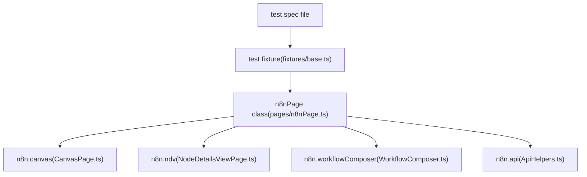
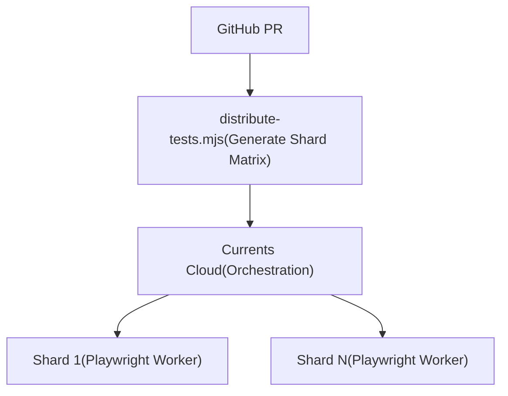

# 使用 Playwright 进行 E2E 测试 (E2E Testing with Playwright)

相关源文件

-   [.github/CI-TELEMETRY.md](https://github.com/n8n-io/n8n/blob/88f170b9/.github/CI-TELEMETRY.md?plain=1)
-   [.github/WORKFLOWS.md](https://github.com/n8n-io/n8n/blob/88f170b9/.github/WORKFLOWS.md?plain=1)
-   [.github/actions/docker-registry-login/action.yml](https://github.com/n8n-io/n8n/blob/88f170b9/.github/actions/docker-registry-login/action.yml)
-   [.github/actions/setup-nodejs/action.yml](https://github.com/n8n-io/n8n/blob/88f170b9/.github/actions/setup-nodejs/action.yml)
-   [.github/scripts/cleanup-ghcr-images.mjs](https://github.com/n8n-io/n8n/blob/88f170b9/.github/scripts/cleanup-ghcr-images.mjs)
-   [.github/scripts/retry.mjs](https://github.com/n8n-io/n8n/blob/88f170b9/.github/scripts/retry.mjs)
-   [.github/scripts/send-build-stats.mjs](https://github.com/n8n-io/n8n/blob/88f170b9/.github/scripts/send-build-stats.mjs)
-   [.github/scripts/send-docker-stats.mjs](https://github.com/n8n-io/n8n/blob/88f170b9/.github/scripts/send-docker-stats.mjs)
-   [.github/workflows/build-base-image.yml](https://github.com/n8n-io/n8n/blob/88f170b9/.github/workflows/build-base-image.yml)
-   [.github/workflows/build-benchmark-image.yml](https://github.com/n8n-io/n8n/blob/88f170b9/.github/workflows/build-benchmark-image.yml)
-   [.github/workflows/release-standalone-package.yml](https://github.com/n8n-io/n8n/blob/88f170b9/.github/workflows/release-standalone-package.yml)
-   [.github/workflows/sbom-generation-callable.yml](https://github.com/n8n-io/n8n/blob/88f170b9/.github/workflows/sbom-generation-callable.yml)
-   [.github/workflows/security-trivy-scan-callable.yml](https://github.com/n8n-io/n8n/blob/88f170b9/.github/workflows/security-trivy-scan-callable.yml)
-   [.github/workflows/test-benchmark-destroy-nightly.yml](https://github.com/n8n-io/n8n/blob/88f170b9/.github/workflows/test-benchmark-destroy-nightly.yml)
-   [.github/workflows/test-benchmark-nightly.yml](https://github.com/n8n-io/n8n/blob/88f170b9/.github/workflows/test-benchmark-nightly.yml)
-   [.github/workflows/test-e2e-ci-reusable.yml](https://github.com/n8n-io/n8n/blob/88f170b9/.github/workflows/test-e2e-ci-reusable.yml)
-   [.github/workflows/test-e2e-coverage-weekly.yml](https://github.com/n8n-io/n8n/blob/88f170b9/.github/workflows/test-e2e-coverage-weekly.yml)
-   [.github/workflows/test-e2e-helm.yml](https://github.com/n8n-io/n8n/blob/88f170b9/.github/workflows/test-e2e-helm.yml)
-   [.github/workflows/test-e2e-performance-reusable.yml](https://github.com/n8n-io/n8n/blob/88f170b9/.github/workflows/test-e2e-performance-reusable.yml)
-   [.github/workflows/test-e2e-reusable.yml](https://github.com/n8n-io/n8n/blob/88f170b9/.github/workflows/test-e2e-reusable.yml)
-   [.github/workflows/test-linting-reusable.yml](https://github.com/n8n-io/n8n/blob/88f170b9/.github/workflows/test-linting-reusable.yml)
-   [.github/workflows/test-unit-reusable.yml](https://github.com/n8n-io/n8n/blob/88f170b9/.github/workflows/test-unit-reusable.yml)
-   [.github/workflows/util-cleanup-pr-images.yml](https://github.com/n8n-io/n8n/blob/88f170b9/.github/workflows/util-cleanup-pr-images.yml)
-   [.github/workflows/util-sync-api-docs.yml](https://github.com/n8n-io/n8n/blob/88f170b9/.github/workflows/util-sync-api-docs.yml)
-   [packages/@n8n/nodes-langchain/nodes/vector\_store/VectorStoreRedis/VectorStoreRedis.node.ts](https://github.com/n8n-io/n8n/blob/88f170b9/packages/@n8n/nodes-langchain/nodes/vector_store/VectorStoreRedis/VectorStoreRedis.node.ts)
-   [packages/@n8n/nodes-langchain/nodes/vendors/OpenAi/v2/actions/node.type.ts](https://github.com/n8n-io/n8n/blob/88f170b9/packages/@n8n/nodes-langchain/nodes/vendors/OpenAi/v2/actions/node.type.ts)
-   [packages/@n8n/nodes-langchain/nodes/vendors/OpenAi/v2/actions/text/index.ts](https://github.com/n8n-io/n8n/blob/88f170b9/packages/@n8n/nodes-langchain/nodes/vendors/OpenAi/v2/actions/text/index.ts)
-   [packages/cli/src/__tests__/abstract-server.test.ts](https://github.com/n8n-io/n8n/blob/88f170b9/packages/cli/src/__tests__/abstract-server.test.ts)
-   [packages/cli/src/commands/__tests__/webhook.test.ts](https://github.com/n8n-io/n8n/blob/88f170b9/packages/cli/src/commands/__tests__/webhook.test.ts)
-   [packages/cli/src/commands/__tests__/worker.test.ts](https://github.com/n8n-io/n8n/blob/88f170b9/packages/cli/src/commands/__tests__/worker.test.ts)
-   [packages/cli/src/controllers/third-party-licenses.controller.ts](https://github.com/n8n-io/n8n/blob/88f170b9/packages/cli/src/controllers/third-party-licenses.controller.ts)
-   [packages/cli/test/integration/controllers/third-party-licenses.controller.test.ts](https://github.com/n8n-io/n8n/blob/88f170b9/packages/cli/test/integration/controllers/third-party-licenses.controller.test.ts)
-   [packages/frontend/@n8n/rest-api-client/src/api/third-party-licenses.ts](https://github.com/n8n-io/n8n/blob/88f170b9/packages/frontend/@n8n/rest-api-client/src/api/third-party-licenses.ts)
-   [packages/frontend/editor-ui/src/features/ndv/runData/components/__snapshots__/RunDataJson.test.ts.snap](https://github.com/n8n-io/n8n/blob/88f170b9/packages/frontend/editor-ui/src/features/ndv/runData/components/__snapshots__/RunDataJson.test.ts.snap)
-   [packages/testing/containers/HELM-TESTING.md](https://github.com/n8n-io/n8n/blob/88f170b9/packages/testing/containers/HELM-TESTING.md?plain=1)
-   [packages/testing/containers/README.md](https://github.com/n8n-io/n8n/blob/88f170b9/packages/testing/containers/README.md?plain=1)
-   [packages/testing/containers/helm-stack.ts](https://github.com/n8n-io/n8n/blob/88f170b9/packages/testing/containers/helm-stack.ts)
-   [packages/testing/containers/helm-start-stack.ts](https://github.com/n8n-io/n8n/blob/88f170b9/packages/testing/containers/helm-start-stack.ts)
-   [packages/testing/containers/index.ts](https://github.com/n8n-io/n8n/blob/88f170b9/packages/testing/containers/index.ts)
-   [packages/testing/containers/n8n-start-stack.ts](https://github.com/n8n-io/n8n/blob/88f170b9/packages/testing/containers/n8n-start-stack.ts)
-   [packages/testing/containers/network-stabilization.ts](https://github.com/n8n-io/n8n/blob/88f170b9/packages/testing/containers/network-stabilization.ts)
-   [packages/testing/containers/package.json](https://github.com/n8n-io/n8n/blob/88f170b9/packages/testing/containers/package.json)
-   [packages/testing/containers/pull-test-images.ts](https://github.com/n8n-io/n8n/blob/88f170b9/packages/testing/containers/pull-test-images.ts)
-   [packages/testing/containers/services/kafka.ts](https://github.com/n8n-io/n8n/blob/88f170b9/packages/testing/containers/services/kafka.ts)
-   [packages/testing/containers/services/n8n.ts](https://github.com/n8n-io/n8n/blob/88f170b9/packages/testing/containers/services/n8n.ts)
-   [packages/testing/containers/services/registry.ts](https://github.com/n8n-io/n8n/blob/88f170b9/packages/testing/containers/services/registry.ts)
-   [packages/testing/containers/services/types.ts](https://github.com/n8n-io/n8n/blob/88f170b9/packages/testing/containers/services/types.ts)
-   [packages/testing/containers/test-containers.ts](https://github.com/n8n-io/n8n/blob/88f170b9/packages/testing/containers/test-containers.ts)
-   [packages/testing/janitor/src/rules/dead-code.rule.test.ts](https://github.com/n8n-io/n8n/blob/88f170b9/packages/testing/janitor/src/rules/dead-code.rule.test.ts)
-   [packages/testing/janitor/src/rules/dead-code.rule.ts](https://github.com/n8n-io/n8n/blob/88f170b9/packages/testing/janitor/src/rules/dead-code.rule.ts)
-   [packages/testing/playwright/CONTRIBUTING.md](https://github.com/n8n-io/n8n/blob/88f170b9/packages/testing/playwright/CONTRIBUTING.md?plain=1)
-   [packages/testing/playwright/README.md](https://github.com/n8n-io/n8n/blob/88f170b9/packages/testing/playwright/README.md?plain=1)
-   [packages/testing/playwright/Types.ts](https://github.com/n8n-io/n8n/blob/88f170b9/packages/testing/playwright/Types.ts)
-   [packages/testing/playwright/composables/ProjectComposer.ts](https://github.com/n8n-io/n8n/blob/88f170b9/packages/testing/playwright/composables/ProjectComposer.ts)
-   [packages/testing/playwright/composables/WorkflowComposer.ts](https://github.com/n8n-io/n8n/blob/88f170b9/packages/testing/playwright/composables/WorkflowComposer.ts)
-   [packages/testing/playwright/currents.config.ts](https://github.com/n8n-io/n8n/blob/88f170b9/packages/testing/playwright/currents.config.ts)
-   [packages/testing/playwright/fixtures/base.ts](https://github.com/n8n-io/n8n/blob/88f170b9/packages/testing/playwright/fixtures/base.ts)
-   [packages/testing/playwright/fixtures/capabilities.ts](https://github.com/n8n-io/n8n/blob/88f170b9/packages/testing/playwright/fixtures/capabilities.ts)
-   [packages/testing/playwright/global-setup.ts](https://github.com/n8n-io/n8n/blob/88f170b9/packages/testing/playwright/global-setup.ts)
-   [packages/testing/playwright/helpers/NavigationHelper.ts](https://github.com/n8n-io/n8n/blob/88f170b9/packages/testing/playwright/helpers/NavigationHelper.ts)
-   [packages/testing/playwright/package.json](https://github.com/n8n-io/n8n/blob/88f170b9/packages/testing/playwright/package.json)
-   [packages/testing/playwright/pages/CanvasPage.ts](https://github.com/n8n-io/n8n/blob/88f170b9/packages/testing/playwright/pages/CanvasPage.ts)
-   [packages/testing/playwright/pages/NodeDetailsViewPage.ts](https://github.com/n8n-io/n8n/blob/88f170b9/packages/testing/playwright/pages/NodeDetailsViewPage.ts)
-   [packages/testing/playwright/pages/ProjectSettingsPage.ts](https://github.com/n8n-io/n8n/blob/88f170b9/packages/testing/playwright/pages/ProjectSettingsPage.ts)
-   [packages/testing/playwright/pages/SecretsProviderSettingsPage.ts](https://github.com/n8n-io/n8n/blob/88f170b9/packages/testing/playwright/pages/SecretsProviderSettingsPage.ts)
-   [packages/testing/playwright/pages/SidebarPage.ts](https://github.com/n8n-io/n8n/blob/88f170b9/packages/testing/playwright/pages/SidebarPage.ts)
-   [packages/testing/playwright/pages/WorkflowSettingsModal.ts](https://github.com/n8n-io/n8n/blob/88f170b9/packages/testing/playwright/pages/WorkflowSettingsModal.ts)
-   [packages/testing/playwright/pages/components/DeleteSecretsProviderModal.ts](https://github.com/n8n-io/n8n/blob/88f170b9/packages/testing/playwright/pages/components/DeleteSecretsProviderModal.ts)
-   [packages/testing/playwright/pages/components/RunDataPanel.ts](https://github.com/n8n-io/n8n/blob/88f170b9/packages/testing/playwright/pages/components/RunDataPanel.ts)
-   [packages/testing/playwright/pages/components/SecretsProviderConnectionModal.ts](https://github.com/n8n-io/n8n/blob/88f170b9/packages/testing/playwright/pages/components/SecretsProviderConnectionModal.ts)
-   [packages/testing/playwright/pages/n8nPage.ts](https://github.com/n8n-io/n8n/blob/88f170b9/packages/testing/playwright/pages/n8nPage.ts)
-   [packages/testing/playwright/playwright-projects.ts](https://github.com/n8n-io/n8n/blob/88f170b9/packages/testing/playwright/playwright-projects.ts)
-   [packages/testing/playwright/playwright.config.ts](https://github.com/n8n-io/n8n/blob/88f170b9/packages/testing/playwright/playwright.config.ts)
-   [packages/testing/playwright/reporters/USAGE.md](https://github.com/n8n-io/n8n/blob/88f170b9/packages/testing/playwright/reporters/USAGE.md?plain=1)
-   [packages/testing/playwright/reporters/metrics-reporter.ts](https://github.com/n8n-io/n8n/blob/88f170b9/packages/testing/playwright/reporters/metrics-reporter.ts)
-   [packages/testing/playwright/scripts/coverage-analysis.mjs](https://github.com/n8n-io/n8n/blob/88f170b9/packages/testing/playwright/scripts/coverage-analysis.mjs)
-   [packages/testing/playwright/scripts/coverage-workflow.md](https://github.com/n8n-io/n8n/blob/88f170b9/packages/testing/playwright/scripts/coverage-workflow.md?plain=1)
-   [packages/testing/playwright/scripts/distribute-tests.mjs](https://github.com/n8n-io/n8n/blob/88f170b9/packages/testing/playwright/scripts/distribute-tests.mjs)
-   [packages/testing/playwright/scripts/generate-coverage-report.js](https://github.com/n8n-io/n8n/blob/88f170b9/packages/testing/playwright/scripts/generate-coverage-report.js)
-   [packages/testing/playwright/tests/e2e/nodes/kafka-nodes.spec.ts](https://github.com/n8n-io/n8n/blob/88f170b9/packages/testing/playwright/tests/e2e/nodes/kafka-nodes.spec.ts)
-   [packages/testing/playwright/tests/e2e/settings/external-secrets/secret-providers-connections-ui.spec.ts](https://github.com/n8n-io/n8n/blob/88f170b9/packages/testing/playwright/tests/e2e/settings/external-secrets/secret-providers-connections-ui.spec.ts)
-   [packages/testing/playwright/tests/e2e/workflows/editor/canvas/canvas-zoom.spec.ts](https://github.com/n8n-io/n8n/blob/88f170b9/packages/testing/playwright/tests/e2e/workflows/editor/canvas/canvas-zoom.spec.ts)
-   [packages/testing/playwright/tests/e2e/workflows/editor/execution/execution.spec.ts](https://github.com/n8n-io/n8n/blob/88f170b9/packages/testing/playwright/tests/e2e/workflows/editor/execution/execution.spec.ts)
-   [packages/testing/playwright/tests/e2e/workflows/editor/execution/inject-previous.spec.ts](https://github.com/n8n-io/n8n/blob/88f170b9/packages/testing/playwright/tests/e2e/workflows/editor/execution/inject-previous.spec.ts)
-   [packages/testing/playwright/tests/e2e/workflows/editor/execution/logs.spec.ts](https://github.com/n8n-io/n8n/blob/88f170b9/packages/testing/playwright/tests/e2e/workflows/editor/execution/logs.spec.ts)
-   [packages/testing/playwright/tests/e2e/workflows/editor/expressions/inline.spec.ts](https://github.com/n8n-io/n8n/blob/88f170b9/packages/testing/playwright/tests/e2e/workflows/editor/expressions/inline.spec.ts)
-   [packages/testing/playwright/tests/e2e/workflows/editor/ndv/paired-item.spec.ts](https://github.com/n8n-io/n8n/blob/88f170b9/packages/testing/playwright/tests/e2e/workflows/editor/ndv/paired-item.spec.ts)
-   [packages/testing/playwright/tests/e2e/workflows/editor/ndv/pinning.spec.ts](https://github.com/n8n-io/n8n/blob/88f170b9/packages/testing/playwright/tests/e2e/workflows/editor/ndv/pinning.spec.ts)
-   [packages/testing/playwright/tests/e2e/workflows/editor/workflow-actions/archive.spec.ts](https://github.com/n8n-io/n8n/blob/88f170b9/packages/testing/playwright/tests/e2e/workflows/editor/workflow-actions/archive.spec.ts)
-   [packages/testing/playwright/tests/performance/large-node-cloud.spec.ts](https://github.com/n8n-io/n8n/blob/88f170b9/packages/testing/playwright/tests/performance/large-node-cloud.spec.ts)
-   [packages/testing/playwright/tests/performance/memory-consumption-cloud.spec.ts](https://github.com/n8n-io/n8n/blob/88f170b9/packages/testing/playwright/tests/performance/memory-consumption-cloud.spec.ts)
-   [packages/testing/playwright/tests/performance/memory-retention.spec.ts](https://github.com/n8n-io/n8n/blob/88f170b9/packages/testing/playwright/tests/performance/memory-retention.spec.ts)
-   [packages/testing/playwright/utils/performance-helper.ts](https://github.com/n8n-io/n8n/blob/88f170b9/packages/testing/playwright/utils/performance-helper.ts)
-   [packages/testing/playwright/utils/requirements.ts](https://github.com/n8n-io/n8n/blob/88f170b9/packages/testing/playwright/utils/requirements.ts)
-   [packages/testing/playwright/workflows/Pinned\_webhook\_node.json](https://github.com/n8n-io/n8n/blob/88f170b9/packages/testing/playwright/workflows/Pinned_webhook_node.json)
-   [packages/testing/playwright/workflows/Test\_ado\_1338.json](https://github.com/n8n-io/n8n/blob/88f170b9/packages/testing/playwright/workflows/Test_ado_1338.json)
-   [packages/testing/playwright/workflows/Test\_workflow\_webhook\_with\_pin\_data.json](https://github.com/n8n-io/n8n/blob/88f170b9/packages/testing/playwright/workflows/Test_workflow_webhook_with_pin_data.json)
-   [scripts/scan-n8n-image.mjs](https://github.com/n8n-io/n8n/blob/88f170b9/scripts/scan-n8n-image.mjs)
-   [security/trivy-ignore-policy.rego](https://github.com/n8n-io/n8n/blob/88f170b9/security/trivy-ignore-policy.rego)
-   [security/trivy.yaml](https://github.com/n8n-io/n8n/blob/88f170b9/security/trivy.yaml)
-   [security/vex.openvex.json](https://github.com/n8n-io/n8n/blob/88f170b9/security/vex.openvex.json)

本页面介绍了 n8n 的端到端 (E2E) 测试基础设施。它使用 Playwright 在运行中的 n8n 实例上驱动真实浏览器。它涵盖了包布局、页面对象模型 (POM) 层级、测试夹具系统、分布式执行和覆盖率收集。

有关后端的单元和集成测试（Vitest/Jest），请参阅 [单元和集成测试](/n8n-io/n8n/8.3-unit-and-integration-testing)。有关整体测试策略和工具选型概览，请参阅 [测试策略与工具](/n8n-io/n8n/8.1-testing-strategy-and-tools)。

---

## 包布局 (Package Layout)

所有 Playwright 测试都位于 `packages/testing/playwright/` 下的专用包中，并以 `n8n-playwright` 的名称发布 [packages/testing/playwright/package.json1-2](https://github.com/n8n-io/n8n/blob/88f170b9/packages/testing/playwright/package.json#L1-L2)。该包与应用包分离，并通过 HTTP 和浏览器自动化与 n8n 通信。

```
packages/testing/playwright/
├── composables/          # Higher-level test actions (e.g. WorkflowComposer)
├── config/               # Environment constants and route definitions
├── fixtures/             # Playwright fixtures (base.ts, observability.ts)
├── helpers/              # Utility classes (NavigationHelper, ClipboardHelper)
├── pages/                # Page Object Models (POM)
│   ├── BasePage.ts       # Common base class for all POMs
│   ├── CanvasPage.ts     # Main workflow editor canvas
│   ├── NodeDetailsViewPage.ts # NDV / Parameter panel
│   └── components/       # Reusable UI parts (LogsPanel, NodeCreator)
├── scripts/              # Coverage and distribution utilities
├── tests/                # Test suites
│   ├── e2e/              # Standard feature tests
│   └── performance/      # Resource consumption tests
├── playwright.config.ts  # Main Playwright configuration
└── currents.config.ts    # Currents parallel-run configuration
```
来源： [packages/testing/playwright/package.json1-66](https://github.com/n8n-io/n8n/blob/88f170b9/packages/testing/playwright/package.json#L1-L66) [packages/testing/playwright/playwright.config.ts1-127](https://github.com/n8n-io/n8n/blob/88f170b9/packages/testing/playwright/playwright.config.ts#L1-L127) [packages/testing/playwright/pages/n8nPage.ts1-153](https://github.com/n8n-io/n8n/blob/88f170b9/packages/testing/playwright/pages/n8nPage.ts#L1-L153)

---

## 测试夹具系统 (Fixture System)

测试从 `fixtures/base` 导入，并接收一个类型为 `n8nPage` 的 `n8n` 复合测试夹具对象 [packages/testing/playwright/fixtures/base.ts13-20](https://github.com/n8n-io/n8n/blob/88f170b9/packages/testing/playwright/fixtures/base.ts#L13-L20)。该测试夹具抽象了服务器生命周期、身份验证和导航。

**测试夹具架构 — 代码实体映射**


来源： [packages/testing/playwright/fixtures/base.ts148-207](https://github.com/n8n-io/n8n/blob/88f170b9/packages/testing/playwright/fixtures/base.ts#L148-L207) [packages/testing/playwright/pages/n8nPage.ts69-153](https://github.com/n8n-io/n8n/blob/88f170b9/packages/testing/playwright/pages/n8nPage.ts#L69-L153)

### 测试入口与身份验证 (Test Entry and Authentication)

`n8n` 测试夹具会处理自动登录。默认情况下，除非存在诸如 `@auth:none` 之类的特定标签，否则它会以 'owner' 身份登录 [packages/testing/playwright/fixtures/base.ts167-176](https://github.com/n8n-io/n8n/blob/88f170b9/packages/testing/playwright/fixtures/base.ts#L167-L176)。它还会在后端 API 上下文与浏览器上下文之间同步身份验证 cookie [packages/testing/playwright/fixtures/base.ts178-205](https://github.com/n8n-io/n8n/blob/88f170b9/packages/testing/playwright/fixtures/base.ts#L178-L205)

---

## 页面对象模型 (Page Object Models)

页面对象模型 (POM) 封装了定位器和操作。所有功能专用页面都继承 `BasePage`。

### `CanvasPage`

对工作流编辑器画布建模，节点在此放置和连接 [packages/testing/playwright/pages/CanvasPage.ts15](https://github.com/n8n-io/n8n/blob/88f170b9/packages/testing/playwright/pages/CanvasPage.ts#L15-L15)

| 方法 | 描述 |
| --- | --- |
| `addNode(nodeName, options)` | 通过节点创建器添加节点，并可选择一个 action/trigger [packages/testing/playwright/pages/CanvasPage.ts110-152](https://github.com/n8n-io/n8n/blob/88f170b9/packages/testing/playwright/pages/CanvasPage.ts#L110-L152) |
| `nodeByName(nodeName)` | 返回画布上特定节点的定位器 [packages/testing/playwright/pages/CanvasPage.ts42-44](https://github.com/n8n-io/n8n/blob/88f170b9/packages/testing/playwright/pages/CanvasPage.ts#L42-L44) |
| `clickExecuteWorkflowButton()` | 点击主执行按钮 [packages/testing/playwright/pages/CanvasPage.ts174-179](https://github.com/n8n-io/n8n/blob/88f170b9/packages/testing/playwright/pages/CanvasPage.ts#L174-L179) |
| `openNode(nodeName)` | 双击节点以打开 NDV [packages/testing/playwright/pages/CanvasPage.ts181-183](https://github.com/n8n-io/n8n/blob/88f170b9/packages/testing/playwright/pages/CanvasPage.ts#L181-L183) |

### `NodeDetailsViewPage` (NDV)

对单个节点的参数面板和执行数据视图建模 [packages/testing/playwright/pages/NodeDetailsViewPage.ts11](https://github.com/n8n-io/n8n/blob/88f170b9/packages/testing/playwright/pages/NodeDetailsViewPage.ts#L11-L11)

| 方法 | 描述 |
| --- | --- |
| `fillParameterInput(label, value)` | 定位并填充特定参数字段 [packages/testing/playwright/pages/NodeDetailsViewPage.ts65-69](https://github.com/n8n-io/n8n/blob/88f170b9/packages/testing/playwright/pages/NodeDetailsViewPage.ts#L65-L69) |
| `execute()` | 点击 "Test Step" 或 "Execute Node" 按钮 [packages/testing/playwright/pages/NodeDetailsViewPage.ts93-95](https://github.com/n8n-io/n8n/blob/88f170b9/packages/testing/playwright/pages/NodeDetailsViewPage.ts#L93-L95) |
| `setPinnedData(data)` | 手动将数据注入节点输出以供测试 [packages/testing/playwright/pages/NodeDetailsViewPage.ts146-156](https://github.com/n8n-io/n8n/blob/88f170b9/packages/testing/playwright/pages/NodeDetailsViewPage.ts#L146-L156) |
| `activateParameterExpressionEditor()` | 将参数从固定值切换为表达式模式 [packages/testing/playwright/pages/NodeDetailsViewPage.ts121-128](https://github.com/n8n-io/n8n/blob/88f170b9/packages/testing/playwright/pages/NodeDetailsViewPage.ts#L121-L128) |

来源： [packages/testing/playwright/pages/CanvasPage.ts15-183](https://github.com/n8n-io/n8n/blob/88f170b9/packages/testing/playwright/pages/CanvasPage.ts#L15-L183) [packages/testing/playwright/pages/NodeDetailsViewPage.ts11-240](https://github.com/n8n-io/n8n/blob/88f170b9/packages/testing/playwright/pages/NodeDetailsViewPage.ts#L11-L240)

---

## 分布式测试执行 (Distributed Test Execution)

n8n 使用自定义分发脚本 `distribute-tests.mjs` 将测试拆分为分片，以供 CI 运行 [packages/testing/playwright/scripts/distribute-tests.mjs](https://github.com/n8n-io/n8n/blob/88f170b9/packages/testing/playwright/scripts/distribute-tests.mjs)

### CI 分片 (CI Sharding)

CI 流水线会根据请求的分片数量生成分片矩阵（CI 中默认为 16） [.github/workflows/test-e2e-ci-reusable.yml71-76](https://github.com/n8n-io/n8n/blob/88f170b9/.github/workflows/test-e2e-ci-reusable.yml#L71-L76)

1.  **影响分析**：如果只有 Playwright 文件发生变更，则只运行受影响的测试 [.github/workflows/test-e2e-ci-reusable.yml72-74](https://github.com/n8n-io/n8n/blob/88f170b9/.github/workflows/test-e2e-ci-reusable.yml#L72-L74)
2.  **编排**：它通过 Currents 使用基于时长的自定义编排，以确保各分片完成时间大致相同 [.github/workflows/test-e2e-reusable.yml40-44](https://github.com/n8n-io/n8n/blob/88f170b9/.github/workflows/test-e2e-reusable.yml#L40-L44)

**分布式 CI 流程**


来源： [.github/workflows/test-e2e-ci-reusable.yml66-77](https://github.com/n8n-io/n8n/blob/88f170b9/.github/workflows/test-e2e-ci-reusable.yml#L66-L77) [.github/workflows/test-e2e-reusable.yml106-110](https://github.com/n8n-io/n8n/blob/88f170b9/.github/workflows/test-e2e-reusable.yml#L106-L110)

---

## 架构约束 (Playwright Janitor)

`playwright-janitor` 是一个用于在测试包内强制执行架构规则的工具 [packages/testing/playwright/package.json35-36](https://github.com/n8n-io/n8n/blob/88f170b9/packages/testing/playwright/package.json#L35-L36)。它确保：

-   页面对象遵循标准的继承模式。
-   在可能的情况下，定位器使用 `data-test-id` [packages/testing/playwright/playwright.config.ts103](https://github.com/n8n-io/n8n/blob/88f170b9/packages/testing/playwright/playwright.config.ts#L103-L103)
-   测试正确标注了 owner 元数据。

---

## 覆盖率收集 (Coverage Collection)

n8n 通过在使用 Istanbul 插桩的后端/前端上运行测试来收集 E2E 代码覆盖率。

1.  **插桩**：应用程序在启用覆盖率的情况下构建。
2.  **收集**：在测试执行期间，Playwright 会从浏览器和服务器收集覆盖率数据。
3.  **合并**：`generate-coverage-report.js` 脚本将来自不同分片（SQLite、Postgres、Multi-main）的覆盖率合并为一份报告 [packages/testing/playwright/scripts/generate-coverage-report.js1-24](https://github.com/n8n-io/n8n/blob/88f170b9/packages/testing/playwright/scripts/generate-coverage-report.js#L1-L24)
4.  **分析**：`coverage-analysis.mjs` 提供有关代码库哪些部分测试不足的洞察 [packages/testing/playwright/package.json26](https://github.com/n8n-io/n8n/blob/88f170b9/packages/testing/playwright/package.json#L26-L26)

来源： [packages/testing/playwright/package.json24-26](https://github.com/n8n-io/n8n/blob/88f170b9/packages/testing/playwright/package.json#L24-L26) [packages/testing/playwright/scripts/generate-coverage-report.js1-30](https://github.com/n8n-io/n8n/blob/88f170b9/packages/testing/playwright/scripts/generate-coverage-report.js#L1-L30)

---

## 性能测试 (Performance Testing)

n8n 包含专门用于性能和基准测试的 Playwright 项目 [packages/testing/playwright/package.json9-11](https://github.com/n8n-io/n8n/blob/88f170b9/packages/testing/playwright/package.json#L9-L11)

-   **内存消耗**：像 `memory-consumption-cloud.spec.ts` 这样的测试会监控负载下 n8n 实例的堆内存使用情况 [packages/testing/playwright/tests/performance/memory-consumption-cloud.spec.ts](https://github.com/n8n-io/n8n/blob/88f170b9/packages/testing/playwright/tests/performance/memory-consumption-cloud.spec.ts)
-   **大型工作流**：测试会模拟包含数百个节点的工作流，以确保画布保持响应 [packages/testing/playwright/tests/performance/large-node-cloud.spec.ts](https://github.com/n8n-io/n8n/blob/88f170b9/packages/testing/playwright/tests/performance/large-node-cloud.spec.ts)

来源： [packages/testing/playwright/playwright.config.ts9-11](https://github.com/n8n-io/n8n/blob/88f170b9/packages/testing/playwright/playwright.config.ts#L9-L11) [packages/testing/playwright/utils/performance-helper.ts](https://github.com/n8n-io/n8n/blob/88f170b9/packages/testing/playwright/utils/performance-helper.ts)
