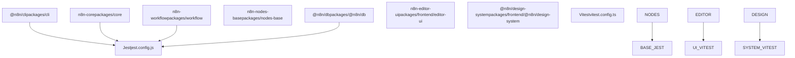
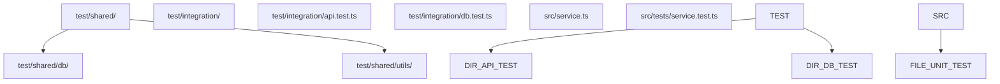
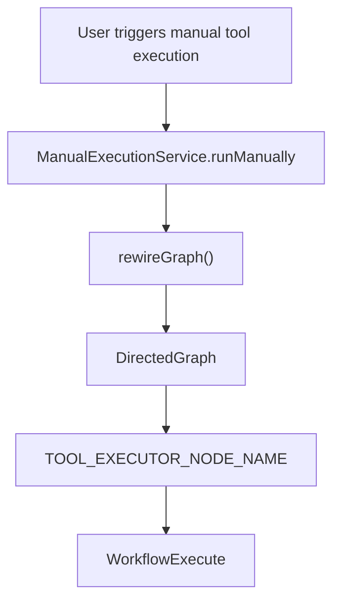
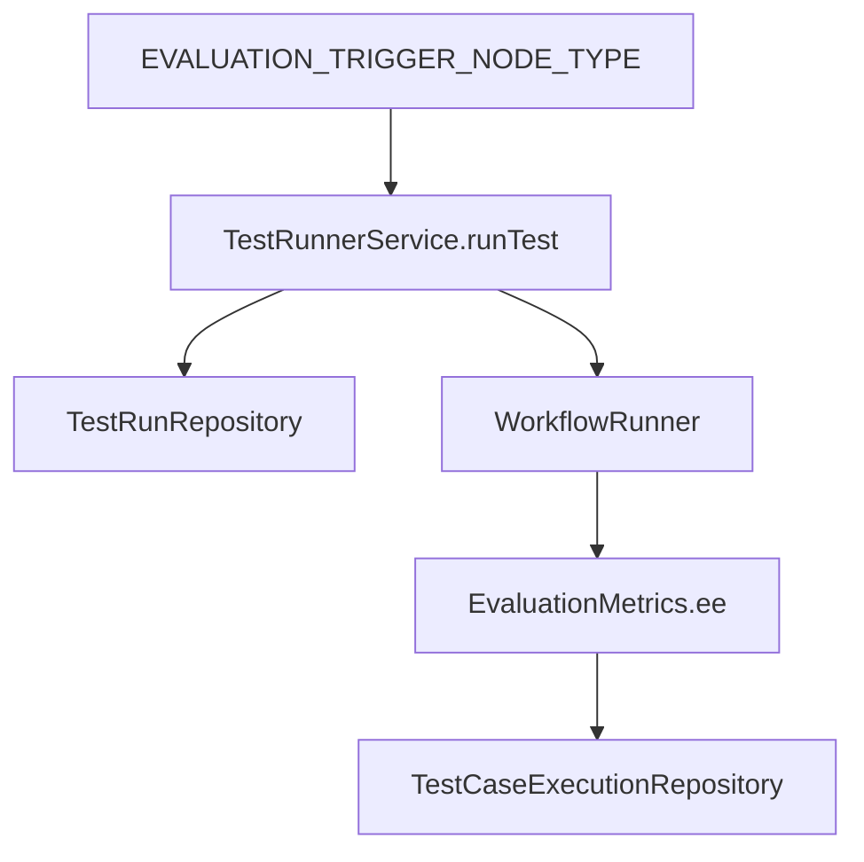

# 单元和集成测试 (Unit and Integration Testing)

相关源文件

-   [packages/@n8n/constants/src/execution.ts](https://github.com/n8n-io/n8n/blob/88f170b9/packages/@n8n/constants/src/execution.ts)
-   [packages/@n8n/db/src/entities/test-run.ee.ts](https://github.com/n8n-io/n8n/blob/88f170b9/packages/@n8n/db/src/entities/test-run.ee.ts)
-   [packages/@n8n/db/src/migrations/common/1771417407753-AddScalingFieldsToTestRun.ts](https://github.com/n8n-io/n8n/blob/88f170b9/packages/@n8n/db/src/migrations/common/1771417407753-AddScalingFieldsToTestRun.ts)
-   [packages/@n8n/db/src/repositories/test-case-execution.repository.ee.ts](https://github.com/n8n-io/n8n/blob/88f170b9/packages/@n8n/db/src/repositories/test-case-execution.repository.ee.ts)
-   [packages/@n8n/db/src/repositories/test-run.repository.ee.ts](https://github.com/n8n-io/n8n/blob/88f170b9/packages/@n8n/db/src/repositories/test-run.repository.ee.ts)
-   [packages/cli/src/__tests__/manual-execution.service.test.ts](https://github.com/n8n-io/n8n/blob/88f170b9/packages/cli/src/__tests__/manual-execution.service.test.ts)
-   [packages/cli/src/evaluation.ee/__tests__/test-runs.controller.ee.test.ts](https://github.com/n8n-io/n8n/blob/88f170b9/packages/cli/src/evaluation.ee/__tests__/test-runs.controller.ee.test.ts)
-   [packages/cli/src/evaluation.ee/test-runner/__tests__/mock-data/workflow.under-test-renamed-nodes.json](https://github.com/n8n-io/n8n/blob/88f170b9/packages/cli/src/evaluation.ee/test-runner/__tests__/mock-data/workflow.under-test-renamed-nodes.json)
-   [packages/cli/src/evaluation.ee/test-runner/__tests__/mock-data/workflow.under-test.json](https://github.com/n8n-io/n8n/blob/88f170b9/packages/cli/src/evaluation.ee/test-runner/__tests__/mock-data/workflow.under-test.json)
-   [packages/cli/src/evaluation.ee/test-runner/__tests__/test-runner.service.ee.test.ts](https://github.com/n8n-io/n8n/blob/88f170b9/packages/cli/src/evaluation.ee/test-runner/__tests__/test-runner.service.ee.test.ts)
-   [packages/cli/src/evaluation.ee/test-runner/__tests__/utils.ee.test.ts](https://github.com/n8n-io/n8n/blob/88f170b9/packages/cli/src/evaluation.ee/test-runner/__tests__/utils.ee.test.ts)
-   [packages/cli/src/evaluation.ee/test-runner/test-runner.service.ee.ts](https://github.com/n8n-io/n8n/blob/88f170b9/packages/cli/src/evaluation.ee/test-runner/test-runner.service.ee.ts)
-   [packages/cli/src/evaluation.ee/test-runner/utils.ee.ts](https://github.com/n8n-io/n8n/blob/88f170b9/packages/cli/src/evaluation.ee/test-runner/utils.ee.ts)
-   [packages/cli/src/evaluation.ee/test-runs.controller.ee.ts](https://github.com/n8n-io/n8n/blob/88f170b9/packages/cli/src/evaluation.ee/test-runs.controller.ee.ts)
-   [packages/cli/src/manual-execution.service.ts](https://github.com/n8n-io/n8n/blob/88f170b9/packages/cli/src/manual-execution.service.ts)
-   [packages/cli/test/integration/evaluation/test-runs.api.test.ts](https://github.com/n8n-io/n8n/blob/88f170b9/packages/cli/test/integration/evaluation/test-runs.api.test.ts)
-   [packages/core/src/execution-engine/partial-execution-utils/__tests__/rewire-graph.test.ts](https://github.com/n8n-io/n8n/blob/88f170b9/packages/core/src/execution-engine/partial-execution-utils/__tests__/rewire-graph.test.ts)
-   [packages/core/src/execution-engine/partial-execution-utils/index.ts](https://github.com/n8n-io/n8n/blob/88f170b9/packages/core/src/execution-engine/partial-execution-utils/index.ts)
-   [packages/core/src/execution-engine/partial-execution-utils/rewire-graph.ts](https://github.com/n8n-io/n8n/blob/88f170b9/packages/core/src/execution-engine/partial-execution-utils/rewire-graph.ts)

## 目的和范围 (Purpose and Scope)

本页面介绍了 n8n 中的单元和集成测试基础设施，包括测试框架、组织模式、模拟策略和执行工作流。单元测试验证单个函数和类的独立行为，而集成测试则验证组件之间的交互，尤其是 API 端点、数据库操作以及像工作流评估引擎这样的复杂系统。

有关使用 Playwright 进行端到端测试，请参阅 [使用 Playwright 进行 E2E 测试](https://github.com/n8n-io/n8n/blob/88f170b9/E2E Testing with Playwright)。有关完整测试策略概览，请参阅 [测试策略与工具](https://github.com/n8n-io/n8n/blob/88f170b9/Testing Strategy and Tools)。

---

## 测试框架架构 (Testing Framework Architecture)

n8n 使用两个主要测试框架：**Jest** 用于后端包，**Vitest** 用于前端包。两者共享相似的 API，但针对不同的执行上下文进行了优化。

### 按包划分的测试框架选择 (Test Framework Selection by Package)


**测试框架决策流程**

| 包类型 | 框架 | 配置 | 原因 |
| --- | --- | --- | --- |
| 后端 (Node.js) | Jest | `jest.config.js` | 原生 Node.js 模块支持，成熟的生态系统 |
| 前端 (Vue) | Vitest | `vitest.config.ts` | 与 Vite 集成，HMR 速度快，ESM 优先 |
| 集成测试 | Jest | `jest.config.js` | 数据库访问、异步工作流 |

---

## 测试组织与文件结构 (Test Organization and File Structure)

### 目录结构模式 (Directory Structure Pattern)

各包中的测试遵循一致的组织模式：


**文件命名约定**

-   单元测试：`*.test.ts`（通常与源文件共同放置在 `__tests__` 目录中） [packages/cli/src/evaluation.ee/test-runner/__tests__/test-runner.service.ee.test.ts1-22](https://github.com/n8n-io/n8n/blob/88f170b9/packages/cli/src/evaluation.ee/test-runner/__tests__/test-runner.service.ee.test.ts#L1-L22)
-   集成测试：`test/integration/**/*.test.ts` [packages/cli/test/integration/evaluation/test-runs.api.test.ts1-13](https://github.com/n8n-io/n8n/blob/88f170b9/packages/cli/test/integration/evaluation/test-runs.api.test.ts#L1-L13)
-   测试工具：`test/shared/**/*.ts`

**CLI 包结构示例**

```
packages/cli/
├── src/
│   └── evaluation.ee/
│       ├── test-runner.service.ee.ts
│       └── __tests__/
│           └── test-runner.service.ee.test.ts  # Unit test
├── test/
│   └── integration/
│       └── evaluation/
│           └── test-runs.api.test.ts           # API Integration test
```
来源： [packages/cli/src/evaluation.ee/test-runner/__tests__/test-runner.service.ee.test.ts1-22](https://github.com/n8n-io/n8n/blob/88f170b9/packages/cli/src/evaluation.ee/test-runner/__tests__/test-runner.service.ee.test.ts#L1-L22) [packages/cli/test/integration/evaluation/test-runs.api.test.ts1-13](https://github.com/n8n-io/n8n/blob/88f170b9/packages/cli/test/integration/evaluation/test-runs.api.test.ts#L1-L13)

---

## 单元测试模式 (Unit Testing Patterns)

### 模拟与依赖注入 (Mocking and Dependency Injection)

n8n 使用 `@n8n/di` 容器和 `jest-mock-extended` 来实现单元测试隔离。服务通常会在 `beforeEach` 钩子中使用模拟依赖项手动实例化。

[packages/cli/src/evaluation.ee/test-runner/__tests__/test-runner.service.ee.test.ts35-68](https://github.com/n8n-io/n8n/blob/88f170b9/packages/cli/src/evaluation.ee/test-runner/__tests__/test-runner.service.ee.test.ts#L35-L68)

```
const workflowRunner = mock<WorkflowRunner>();const testRunRepository = mock<TestRunRepository>(); beforeEach(() => {    testRunnerService = new TestRunnerService(        logger,        telemetry,        workflowRepository,        workflowRunner,        // ... other mocked dependencies    );});
```
### 部分执行与图重连 (Partial Execution and Graph Rewiring)

在测试复杂工作流逻辑时，一个关键模式是结合使用 `ManualExecutionService` 和图操作工具。例如，`rewireGraph` 会被用来将 `PartialExecutionToolExecutor`（定义为 `TOOL_EXECUTOR_NODE_NAME`）注入到工作流图中，以便独立测试 AI 工具的执行。

[packages/cli/src/manual-execution.service.ts135-160](https://github.com/n8n-io/n8n/blob/88f170b9/packages/cli/src/manual-execution.service.ts#L135-L160) [packages/core/src/execution-engine/partial-execution-utils/rewire-graph.ts7-58](https://github.com/n8n-io/n8n/blob/88f170b9/packages/core/src/execution-engine/partial-execution-utils/rewire-graph.ts#L7-L58)


来源： [packages/cli/src/manual-execution.service.ts135-160](https://github.com/n8n-io/n8n/blob/88f170b9/packages/cli/src/manual-execution.service.ts#L135-L160) [packages/core/src/execution-engine/partial-execution-utils/rewire-graph.ts7-58](https://github.com/n8n-io/n8n/blob/88f170b9/packages/core/src/execution-engine/partial-execution-utils/rewire-graph.ts#L7-L58) [packages/core/src/execution-engine/partial-execution-utils/__tests__/rewire-graph.test.ts8-40](https://github.com/n8n-io/n8n/blob/88f170b9/packages/core/src/execution-engine/partial-execution-utils/__tests__/rewire-graph.test.ts#L8-L40)

---

## 集成测试模式 (Integration Testing Patterns)

### API 集成测试 (API Integration Tests)

针对 REST API 的集成测试会验证完整的请求-响应周期，包括身份验证、基于项目的权限以及数据库持久化。

[packages/cli/test/integration/evaluation/test-runs.api.test.ts27-35](https://github.com/n8n-io/n8n/blob/88f170b9/packages/cli/test/integration/evaluation/test-runs.api.test.ts#L27-L35)

```
const testServer = utils.setupTestServer({    endpointGroups: ['workflows', 'evaluation'],    enabledFeatures: ['feat:sharing'],}); beforeAll(async () => {    ownerShell = await createUserShell(GLOBAL_OWNER_ROLE);    authOwnerAgent = testServer.authAgentFor(ownerShell);});
```
### 数据库测试容器 (Database Test Containers)

涉及数据库的测试通常会使用 `@n8n/backend-test-utils` 在各个测试用例之间清空表并管理状态。

[packages/cli/test/integration/evaluation/test-runs.api.test.ts37-44](https://github.com/n8n-io/n8n/blob/88f170b9/packages/cli/test/integration/evaluation/test-runs.api.test.ts#L37-L44)

```
beforeEach(async () => {    await testDb.truncate(['TestRun', 'TestCaseExecution', 'WorkflowEntity']);    workflowUnderTest = await createWorkflow({ name: 'workflow-under-test' }, ownerShell);});
```
来源： [packages/cli/test/integration/evaluation/test-runs.api.test.ts1-44](https://github.com/n8n-io/n8n/blob/88f170b9/packages/cli/test/integration/evaluation/test-runs.api.test.ts#L1-L44) [packages/@n8n/db/src/repositories/test-run.repository.ee.ts20-34](https://github.com/n8n-io/n8n/blob/88f170b9/packages/@n8n/db/src/repositories/test-run.repository.ee.ts#L20-L34)

---

## 工作流评估系统 (Workflow Evaluation System)

`TestRunnerService` 负责协调自动化工作流测试（Evaluations）。它管理 `TestRun` 的生命周期，而一个 `TestRun` 由多个 `TestCaseExecution` 实体组成。

### 评估数据流 (Evaluation Data Flow)


**关键函数：**

-   `findEvaluationTriggerNode()`: 定位工作流中的数据集来源 [packages/cli/src/evaluation.ee/test-runner/test-runner.service.ee.ts85-87](https://github.com/n8n-io/n8n/blob/88f170b9/packages/cli/src/evaluation.ee/test-runner/test-runner.service.ee.ts#L85-L87)
-   `validateSetMetricsNodes()`: 确保在运行前评估指标已正确配置 [packages/cli/src/evaluation.ee/test-runner/test-runner.service.ee.ts136-182](https://github.com/n8n-io/n8n/blob/88f170b9/packages/cli/src/evaluation.ee/test-runner/test-runner.service.ee.ts#L136-L182)
-   `runTest()`: 启动新评估的入口点 [packages/cli/src/evaluation.ee/test-runner/test-runner.service.ee.ts184-210](https://github.com/n8n-io/n8n/blob/88f170b9/packages/cli/src/evaluation.ee/test-runner/test-runner.service.ee.ts#L184-L210)
-   `extractTokenUsage()`: 在评估期间收集 LLM 成本数据的实用工具 [packages/cli/src/evaluation.ee/test-runner/utils.ee.ts35-85](https://github.com/n8n-io/n8n/blob/88f170b9/packages/cli/src/evaluation.ee/test-runner/utils.ee.ts#L35-L85)

来源： [packages/cli/src/evaluation.ee/test-runner/test-runner.service.ee.ts62-210](https://github.com/n8n-io/n8n/blob/88f170b9/packages/cli/src/evaluation.ee/test-runner/test-runner.service.ee.ts#L62-L210) [packages/cli/src/evaluation.ee/test-runner/utils.ee.ts35-85](https://github.com/n8n-io/n8n/blob/88f170b9/packages/cli/src/evaluation.ee/test-runner/utils.ee.ts#L35-L85)

---

## 测试定义 API (Test-Definitions API)

`TestRunsController` 提供用于管理评估的 REST 端点。

| 方法 | 端点 | 功能 |
| --- | --- | --- |
| `GET` | `/workflows/:workflowId/test-runs` | 列出某个工作流的测试运行 [packages/cli/src/evaluation.ee/test-runs.controller.ee.ts50-57](https://github.com/n8n-io/n8n/blob/88f170b9/packages/cli/src/evaluation.ee/test-runs.controller.ee.ts#L50-L57) |
| `POST` | `/workflows/:workflowId/test-runs/new` | 启动新的评估运行 [packages/cli/src/evaluation.ee/test-runs.controller.ee.ts112-122](https://github.com/n8n-io/n8n/blob/88f170b9/packages/cli/src/evaluation.ee/test-runs.controller.ee.ts#L112-L122) |
| `POST` | `/workflows/:workflowId/test-runs/:id/cancel` | 取消一个正在运行的测试运行 [packages/cli/src/evaluation.ee/test-runs.controller.ee.ts95-110](https://github.com/n8n-io/n8n/blob/88f170b9/packages/cli/src/evaluation.ee/test-runs.controller.ee.ts#L95-L110) |
| `GET` | `/workflows/:workflowId/test-runs/:id/test-cases` | 检索特定测试用例的结果 [packages/cli/src/evaluation.ee/test-runs.controller.ee.ts72-79](https://github.com/n8n-io/n8n/blob/88f170b9/packages/cli/src/evaluation.ee/test-runs.controller.ee.ts#L72-L79) |

来源： [packages/cli/src/evaluation.ee/test-runs.controller.ee.ts15-123](https://github.com/n8n-io/n8n/blob/88f170b9/packages/cli/src/evaluation.ee/test-runs.controller.ee.ts#L15-L123) [packages/cli/test/integration/evaluation/test-runs.api.test.ts46-137](https://github.com/n8n-io/n8n/blob/88f170b9/packages/cli/test/integration/evaluation/test-runs.api.test.ts#L46-L137)
