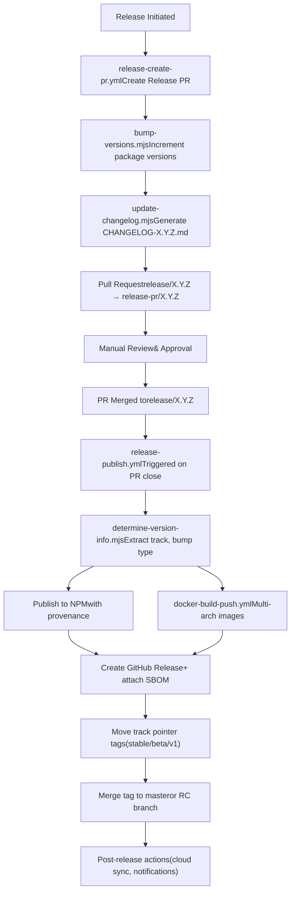
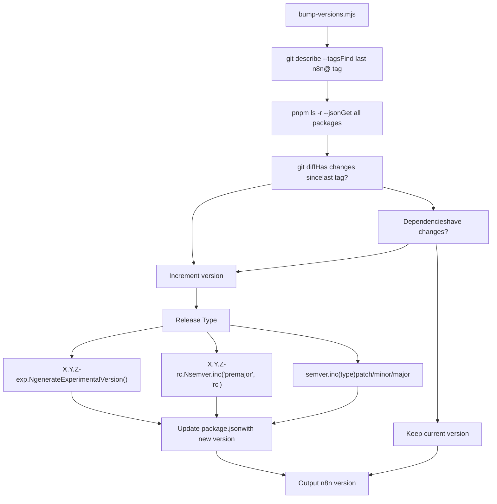
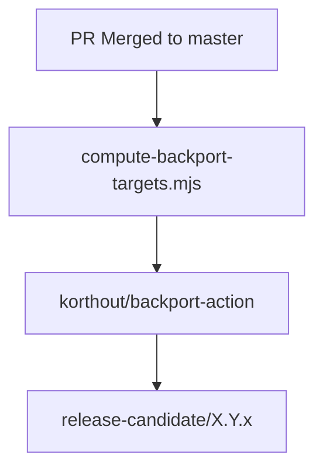

# CI/CD 与发布流程

相关源文件

-   [.dockerignore](https://github.com/n8n-io/n8n/blob/88f170b9/.dockerignore)
-   [.github/docker-compose.yml](https://github.com/n8n-io/n8n/blob/88f170b9/.github/docker-compose.yml)
-   [.github/scripts/bump-versions.mjs](https://github.com/n8n-io/n8n/blob/88f170b9/.github/scripts/bump-versions.mjs)
-   [.github/scripts/compute-backport-targets.mjs](https://github.com/n8n-io/n8n/blob/88f170b9/.github/scripts/compute-backport-targets.mjs)
-   [.github/scripts/compute-backport-targets.test.mjs](https://github.com/n8n-io/n8n/blob/88f170b9/.github/scripts/compute-backport-targets.test.mjs)
-   [.github/scripts/create-github-release.mjs](https://github.com/n8n-io/n8n/blob/88f170b9/.github/scripts/create-github-release.mjs)
-   [.github/scripts/determine-release-candidate-branch-for-track.mjs](https://github.com/n8n-io/n8n/blob/88f170b9/.github/scripts/determine-release-candidate-branch-for-track.mjs)
-   [.github/scripts/determine-release-version-changes.mjs](https://github.com/n8n-io/n8n/blob/88f170b9/.github/scripts/determine-release-version-changes.mjs)
-   [.github/scripts/determine-release-version-changes.test.mjs](https://github.com/n8n-io/n8n/blob/88f170b9/.github/scripts/determine-release-version-changes.test.mjs)
-   [.github/scripts/determine-version-info.mjs](https://github.com/n8n-io/n8n/blob/88f170b9/.github/scripts/determine-version-info.mjs)
-   [.github/scripts/determine-version-info.test.mjs](https://github.com/n8n-io/n8n/blob/88f170b9/.github/scripts/determine-version-info.test.mjs)
-   [.github/scripts/docker/docker-config.mjs](https://github.com/n8n-io/n8n/blob/88f170b9/.github/scripts/docker/docker-config.mjs)
-   [.github/scripts/docker/docker-tags.mjs](https://github.com/n8n-io/n8n/blob/88f170b9/.github/scripts/docker/docker-tags.mjs)
-   [.github/scripts/ensure-release-candidate-branches.mjs](https://github.com/n8n-io/n8n/blob/88f170b9/.github/scripts/ensure-release-candidate-branches.mjs)
-   [.github/scripts/ensure-release-candidate-branches.test.mjs](https://github.com/n8n-io/n8n/blob/88f170b9/.github/scripts/ensure-release-candidate-branches.test.mjs)
-   [.github/scripts/fixtures/mock-github-event.json](https://github.com/n8n-io/n8n/blob/88f170b9/.github/scripts/fixtures/mock-github-event.json)
-   [.github/scripts/get-release-versions.mjs](https://github.com/n8n-io/n8n/blob/88f170b9/.github/scripts/get-release-versions.mjs)
-   [.github/scripts/github-helpers.mjs](https://github.com/n8n-io/n8n/blob/88f170b9/.github/scripts/github-helpers.mjs)
-   [.github/scripts/jsconfig.json](https://github.com/n8n-io/n8n/blob/88f170b9/.github/scripts/jsconfig.json)
-   [.github/scripts/move-track-tag.mjs](https://github.com/n8n-io/n8n/blob/88f170b9/.github/scripts/move-track-tag.mjs)
-   [.github/scripts/package.json](https://github.com/n8n-io/n8n/blob/88f170b9/.github/scripts/package.json)
-   [.github/scripts/plan-release.mjs](https://github.com/n8n-io/n8n/blob/88f170b9/.github/scripts/plan-release.mjs)
-   [.github/scripts/pnpm-lock.yaml](https://github.com/n8n-io/n8n/blob/88f170b9/.github/scripts/pnpm-lock.yaml)
-   [.github/scripts/populate-cloud-databases.mjs](https://github.com/n8n-io/n8n/blob/88f170b9/.github/scripts/populate-cloud-databases.mjs)
-   [.github/scripts/promote-github-release.mjs](https://github.com/n8n-io/n8n/blob/88f170b9/.github/scripts/promote-github-release.mjs)
-   [.github/scripts/send-version-release-notification.mjs](https://github.com/n8n-io/n8n/blob/88f170b9/.github/scripts/send-version-release-notification.mjs)
-   [.github/scripts/update-changelog.mjs](https://github.com/n8n-io/n8n/blob/88f170b9/.github/scripts/update-changelog.mjs)
-   [.github/workflows/backport.yml](https://github.com/n8n-io/n8n/blob/88f170b9/.github/workflows/backport.yml)
-   [.github/workflows/ci-master.yml](https://github.com/n8n-io/n8n/blob/88f170b9/.github/workflows/ci-master.yml)
-   [.github/workflows/ci-pull-requests.yml](https://github.com/n8n-io/n8n/blob/88f170b9/.github/workflows/ci-pull-requests.yml)
-   [.github/workflows/docker-build-push.yml](https://github.com/n8n-io/n8n/blob/88f170b9/.github/workflows/docker-build-push.yml)
-   [.github/workflows/release-create-github-releases.yml](https://github.com/n8n-io/n8n/blob/88f170b9/.github/workflows/release-create-github-releases.yml)
-   [.github/workflows/release-create-patch-pr.yml](https://github.com/n8n-io/n8n/blob/88f170b9/.github/workflows/release-create-patch-pr.yml)
-   [.github/workflows/release-create-pr.yml](https://github.com/n8n-io/n8n/blob/88f170b9/.github/workflows/release-create-pr.yml)
-   [.github/workflows/release-merge-tag-to-branch.yml](https://github.com/n8n-io/n8n/blob/88f170b9/.github/workflows/release-merge-tag-to-branch.yml)
-   [.github/workflows/release-populate-cloud-with-releases.yml](https://github.com/n8n-io/n8n/blob/88f170b9/.github/workflows/release-populate-cloud-with-releases.yml)
-   [.github/workflows/release-promote-github-release.yml](https://github.com/n8n-io/n8n/blob/88f170b9/.github/workflows/release-promote-github-release.yml)
-   [.github/workflows/release-publish-post-release.yml](https://github.com/n8n-io/n8n/blob/88f170b9/.github/workflows/release-publish-post-release.yml)
-   [.github/workflows/release-publish.yml](https://github.com/n8n-io/n8n/blob/88f170b9/.github/workflows/release-publish.yml)
-   [.github/workflows/release-push-to-channel.yml](https://github.com/n8n-io/n8n/blob/88f170b9/.github/workflows/release-push-to-channel.yml)
-   [.github/workflows/release-update-pointer-tag.yml](https://github.com/n8n-io/n8n/blob/88f170b9/.github/workflows/release-update-pointer-tag.yml)
-   [.github/workflows/release-version-release-notification.yml](https://github.com/n8n-io/n8n/blob/88f170b9/.github/workflows/release-version-release-notification.yml)
-   [.github/workflows/test-workflow-scripts-reusable.yml](https://github.com/n8n-io/n8n/blob/88f170b9/.github/workflows/test-workflow-scripts-reusable.yml)
-   [.github/workflows/util-cleanup-abandoned-release-branches.yml](https://github.com/n8n-io/n8n/blob/88f170b9/.github/workflows/util-cleanup-abandoned-release-branches.yml)
-   [.github/workflows/util-determine-current-version.yml](https://github.com/n8n-io/n8n/blob/88f170b9/.github/workflows/util-determine-current-version.yml)
-   [.github/workflows/util-ensure-release-candidate-branches.yml](https://github.com/n8n-io/n8n/blob/88f170b9/.github/workflows/util-ensure-release-candidate-branches.yml)
-   [.gitignore](https://github.com/n8n-io/n8n/blob/88f170b9/.gitignore)
-   [CONTRIBUTING.md](https://github.com/n8n-io/n8n/blob/88f170b9/CONTRIBUTING.md?plain=1)
-   [docker/images/n8n-base/Dockerfile](https://github.com/n8n-io/n8n/blob/88f170b9/docker/images/n8n-base/Dockerfile)
-   [docker/images/n8n/Dockerfile](https://github.com/n8n-io/n8n/blob/88f170b9/docker/images/n8n/Dockerfile)
-   [docker/images/runners/Dockerfile](https://github.com/n8n-io/n8n/blob/88f170b9/docker/images/runners/Dockerfile)
-   [docker/images/runners/Dockerfile.distroless](https://github.com/n8n-io/n8n/blob/88f170b9/docker/images/runners/Dockerfile.distroless)
-   [docker/images/runners/README.md](https://github.com/n8n-io/n8n/blob/88f170b9/docker/images/runners/README.md?plain=1)
-   [packages/@n8n/benchmark/Dockerfile](https://github.com/n8n-io/n8n/blob/88f170b9/packages/@n8n/benchmark/Dockerfile)
-   [scripts/build-n8n.mjs](https://github.com/n8n-io/n8n/blob/88f170b9/scripts/build-n8n.mjs)

本文档介绍 n8n 的自动化发布流水线，包括版本管理策略、发布工作流以及多通道发布。该流水线通过一系列 GitHub Actions 工作流编排版本递增、变更日志生成、NPM 发布、Docker 镜像构建和 GitHub Release。

有关 Docker 镜像构建和安全证明，请参阅 [Docker 镜像流水线与安全证明](/n8n-io/n8n/9.4-docker-image-pipeline-and-security-attestation)。有关构建系统编排细节，请参阅 [构建系统与 monorepo 编排](/n8n-io/n8n/9.1-build-system-and-monorepo-orchestration)。

---

## 发布通道与版本策略

n8n 支持多个发布通道，以管理不同的稳定级别和版本策略：

| 通道 | NPM 标签 | Docker 标签 | 版本模式 | 使用场景 |
| --- | --- | --- | --- | --- |
| **stable** | `latest`, `stable` | `latest`, `stable` | `X.Y.Z` | 生产环境发布 |
| **beta** | `next`, `beta` | `next`, `beta` | `X.Y.Z-beta.N` | 预发布测试 |
| **rc** | `rc`（临时） | N/A | `X.Y.Z-rc.N` | 发布候选 |
| **experimental** | N/A | N/A | `X.Y.Z-exp.N` | 功能实验 |
| **v1** | N/A | N/A | `1.X.Y` | 旧版 v1.x 维护 |

### 语义化版本组成

版本递增系统支持所有标准的 SemVer 发布类型：

-   **patch**：错误修复和小幅更新（`1.2.3` → `1.2.4`）
-   **minor**：新功能，保持向后兼容（`1.2.3` → `1.3.0`）
-   **major**：破坏性变更（`1.2.3` → `2.0.0`）
-   **premajor**：下一次 major 版本的预发布（`1.2.3` → `2.0.0-rc.0` → `2.0.0-rc.1`）
-   **experimental**：实验性功能（`1.2.3` → `1.2.3-exp.0` → `1.2.3-exp.1`）

来源：[.github/workflows/release-publish.yml11-22](https://github.com/n8n-io/n8n/blob/88f170b9/.github/workflows/release-publish.yml#L11-L22) [.github/workflows/release-create-pr.yml23-33](https://github.com/n8n-io/n8n/blob/88f170b9/.github/workflows/release-create-pr.yml#L23-L33) [.github/scripts/bump-versions.mjs10-23](https://github.com/n8n-io/n8n/blob/88f170b9/.github/scripts/bump-versions.mjs#L10-L23) [.github/scripts/github-helpers.mjs10-15](https://github.com/n8n-io/n8n/blob/88f170b9/.github/scripts/github-helpers.mjs#L10-L15)

---

## 发布流水线概览


**发布流水线执行流程**

该流水线采用基于拉取请求的发布流程：先完成版本递增和变更日志生成，然后在 PR 合并后自动执行发布。

来源：[.github/workflows/release-create-pr.yml39-128](https://github.com/n8n-io/n8n/blob/88f170b9/.github/workflows/release-create-pr.yml#L39-L128) [.github/workflows/release-publish.yml10-184](https://github.com/n8n-io/n8n/blob/88f170b9/.github/workflows/release-publish.yml#L10-L184)

---

## 版本递增逻辑

### 基于依赖的版本管理

`bump-versions.mjs` 脚本实现了智能版本递增，只会为实际发生变更或内部依赖发生变更的软件包递增版本：


**版本递增决策树**

该脚本根据 Git 历史和依赖关系判断是否需要递增每个软件包的版本。它会传递性地传播“变脏”状态：如果 `design-system` 发生变更，`editor-ui` 和 `cli` 也会被递增版本。

来源：[.github/scripts/bump-versions.mjs25-74](https://github.com/n8n-io/n8n/blob/88f170b9/.github/scripts/bump-versions.mjs#L25-L74)

### 实验版本生成

实验版本使用特殊的 `-exp.N` 后缀，并递增实验计数器：

```
// Input: 1.2.3 → Output: 1.2.3-exp.0// Input: 1.2.3-exp.0 → Output: 1.2.3-exp.1
```
`generateExperimentalVersion()` 函数位于 [.github/scripts/bump-versions.mjs10-23](https://github.com/n8n-io/n8n/blob/88f170b9/.github/scripts/bump-versions.mjs#L10-L23)，它会解析当前版本，或者创建新的实验版本，或者递增已有的实验计数器。

### premajor/RC 版本处理

对于发布候选，脚本使用 semver 的 `premajor` 递增，并带上 `rc` 标识符：

```
// Input: 1.9.5 → Output: 2.0.0-rc.0// Input: 2.0.0-rc.0 → Output: 2.0.0-rc.1 (if already in RC)
```
这一逻辑实现于 [.github/scripts/bump-versions.mjs92-99](https://github.com/n8n-io/n8n/blob/88f170b9/.github/scripts/bump-versions.mjs#L92-L99)：它会检查版本是否已经包含 `-rc.`，如果是，则在后续 RC 版本中使用 `prerelease` 递增，而不是 `premajor`。

来源：[.github/scripts/bump-versions.mjs10-109](https://github.com/n8n-io/n8n/blob/88f170b9/.github/scripts/bump-versions.mjs#L10-L109)

---

## 变更日志生成

### Conventional Changelog 系统

变更日志使用 `conventional-changelog` 库生成，并配置为 Angular preset。`update-changelog.mjs` 脚本同时处理版本专属的变更日志（用于 PR 正文）和主 `CHANGELOG.md` 文件。

来源：[.github/scripts/update-changelog.mjs1-53](https://github.com/n8n-io/n8n/blob/88f170b9/.github/scripts/update-changelog.mjs#L1-L53)

### 提交过滤规则

变更日志生成会排除某些提交，以保持发布说明的整洁：

1.  **无变更日志标记**：带有 `(no-changelog)` 的提交头会被忽略。
2.  **benchmark 作用域**：带有 `scope: benchmark` 的提交会被过滤掉。
3.  **回移植字符串剥离**：脚本会从主题中剥离 `(backport to ...)` 字符串，以突出原始修复。

这套过滤逻辑在 [.github/scripts/update-changelog.mjs28-51](https://github.com/n8n-io/n8n/blob/88f170b9/.github/scripts/update-changelog.mjs#L28-L51) 的 `transformCommit` 函数中实现：

```
transformCommit(commit) {    const hasNoChangelogInHeader = commit.header?.includes('(no-changelog)');    const isBenchmarkScope = commit.scope === 'benchmark';     if (hasNoChangelogInHeader || isBenchmarkScope) return null;     if (commit.subject) {        let newCommit = {            ...commit,            subject: commit.subject.replace(/\s*\(backport to [^)]+\)/g, ''),        };        return newCommit;    }    return commit;}
```
来源：[.github/scripts/update-changelog.mjs28-51](https://github.com/n8n-io/n8n/blob/88f170b9/.github/scripts/update-changelog.mjs#L28-L51)

---

## 发布创建工作流

### 触发发布

发布通过 `release-create-pr.yml` 中的 workflow dispatch 启动。此工作流：

1.  使用 `N8N_ASSISTANT_APP_ID` 生成 GitHub App Token [.github/workflows/release-create-pr.yml58-64](https://github.com/n8n-io/n8n/blob/88f170b9/.github/workflows/release-create-pr.yml#L58-L64)
2.  切换到基础分支，并使用 `bump-versions.mjs` 递增版本 [.github/workflows/release-create-pr.yml89-93](https://github.com/n8n-io/n8n/blob/88f170b9/.github/workflows/release-create-pr.yml#L89-L93)
3.  更新变更日志并创建新分支 `release/${NEXT_RELEASE}` [.github/workflows/release-create-pr.yml95-102](https://github.com/n8n-io/n8n/blob/88f170b9/.github/workflows/release-create-pr.yml#L95-L102)
4.  以生成的变更日志作为正文创建 Pull Request [.github/workflows/release-create-pr.yml121-132](https://github.com/n8n-io/n8n/blob/88f170b9/.github/workflows/release-create-pr.yml#L121-L132)

### 回移植自动化

`backport.yml` 工作流自动将 `master` 中的修复带入发布候选分支。


`compute-backport-targets.mjs` 脚本会根据 PR 标签（例如 `backport to stable`）识别正确的 `release-candidate/` 分支。回移植 PR 包含一个检查清单，供作者复核变更并修复冲突 [.github/workflows/backport.yml51-84](https://github.com/n8n-io/n8n/blob/88f170b9/.github/workflows/backport.yml#L51-L84)

来源：[.github/workflows/backport.yml1-84](https://github.com/n8n-io/n8n/blob/88f170b9/.github/workflows/backport.yml#L1-L84) [.github/scripts/compute-backport-targets.mjs49](https://github.com/n8n-io/n8n/blob/88f170b9/.github/scripts/compute-backport-targets.mjs#L49-L49)

---

## 发布执行流水线

### NPM 发布

NPM 发布作业在 [.github/workflows/release-publish.yml39-88](https://github.com/n8n-io/n8n/blob/88f170b9/.github/workflows/release-publish.yml#L39-L88) 中实现了多项安全和质量措施：

1.  **试运行验证**：使用 `pnpm publish --dry-run` 验证是否可以发布 [.github/workflows/release-publish.yml64-67](https://github.com/n8n-io/n8n/blob/88f170b9/.github/workflows/release-publish.yml#L64-L67)
2.  **发布前修改**：
    -   `trim-fe-packageJson.js`：移除前端软件包中的仅开发用字段 [.github/workflows/release-publish.yml71](https://github.com/n8n-io/n8n/blob/88f170b9/.github/workflows/release-publish.yml#L71-L71)
    -   `ensure-provenance-fields.mjs`：为 NPM 溯源证明添加仓库和目录元数据 [.github/workflows/release-publish.yml72](https://github.com/n8n-io/n8n/blob/88f170b9/.github/workflows/release-publish.yml#L72-L72)
    -   `schema.js` 更新：将发布类型注入 CLI 配置 schema [.github/workflows/release-publish.yml74](https://github.com/n8n-io/n8n/blob/88f170b9/.github/workflows/release-publish.yml#L74-L74)
3.  **NPM 溯源证明**：通过 `NPM_CONFIG_PROVENANCE: true` 启用 [.github/workflows/release-publish.yml49](https://github.com/n8n-io/n8n/blob/88f170b9/.github/workflows/release-publish.yml#L49-L49)

### Docker 与 GitHub Release

在 PR 合并后，发布会并行进行：

-   **Docker**：使用 `docker-build-push.yml` 构建多架构镜像 [.github/workflows/release-publish.yml90-97](https://github.com/n8n-io/n8n/blob/88f170b9/.github/workflows/release-publish.yml#L90-L97)
-   **GitHub Release**：使用 `release-create-github-releases.yml` 创建 release 条目 [.github/workflows/release-publish.yml99-109](https://github.com/n8n-io/n8n/blob/88f170b9/.github/workflows/release-publish.yml#L99-L109)
-   **SBOM**：通过 `sbom-generation-callable.yml` 生成并附加软件物料清单 [.github/workflows/release-publish.yml133-140](https://github.com/n8n-io/n8n/blob/88f170b9/.github/workflows/release-publish.yml#L133-L140)

来源：[.github/workflows/release-publish.yml39-140](https://github.com/n8n-io/n8n/blob/88f170b9/.github/workflows/release-publish.yml#L39-L140)

---

## 标签管理与推广

### 指针标签系统

发布通道使用指针标签，并会更新这些标签以引用各通道中的最新版本。`github-helpers.mjs` 工具提供了用于解析这些指针的函数。

| 函数 | 描述 | 代码 |
| --- | --- | --- |
| `pickHighestReleaseTag` | 对诸如 `n8n@2.7.0` 的标签进行排序，以找出最新版本。 | [.github/scripts/github-helpers.mjs47-55](https://github.com/n8n-io/n8n/blob/88f170b9/.github/scripts/github-helpers.mjs#L47-L55) |
| `resolveReleaseTagForTrack` | 将某个通道（例如 `stable`）解析为具体的版本标签。 | [.github/scripts/github-helpers.mjs89-101](https://github.com/n8n-io/n8n/blob/88f170b9/.github/scripts/github-helpers.mjs#L89-L101) |
| `resolveRcBranchForTrack` | 将某个通道映射到其 `release-candidate/` 分支。 | [.github/scripts/github-helpers.mjs112-129](https://github.com/n8n-io/n8n/blob/88f170b9/.github/scripts/github-helpers.mjs#L112-L129) |

### 通道晋升工作流

`release-push-to-channel.yml` 工作流允许将现有版本晋升到 `stable` 或 `beta`。它明确阻止将 RC 版本晋升到这些通道 [.github/workflows/release-push-to-channel.yml56-66](https://github.com/n8n-io/n8n/blob/88f170b9/.github/workflows/release-push-to-channel.yml#L56-L66)

晋升过程包括：

1.  **NPM 标签**：使用 `npm dist-tag add` 添加 `latest`/`stable` 或 `next`/`beta` 标签 [.github/workflows/release-push-to-channel.yml83-93](https://github.com/n8n-io/n8n/blob/88f170b9/.github/workflows/release-push-to-channel.yml#L83-L93)
2.  **Docker 标签**：创建指向现有版本镜像的新 manifest 标签 [.github/workflows/release-push-to-channel.yml113-127](https://github.com/n8n-io/n8n/blob/88f170b9/.github/workflows/release-push-to-channel.yml#L113-L127)

来源：[.github/workflows/release-push-to-channel.yml1-160](https://github.com/n8n-io/n8n/blob/88f170b9/.github/workflows/release-push-to-channel.yml#L1-L160) [.github/scripts/github-helpers.mjs1-150](https://github.com/n8n-io/n8n/blob/88f170b9/.github/scripts/github-helpers.mjs#L1-L150)

---

## 发布候选分支管理

n8n 仓库使用一套特定的命名约定来管理发布候选分支，以支持不同大版本/小版本的补丁发布。

-   **v2+**：`release-candidate/X.Y.x`（例如 `release-candidate/2.8.x`）
-   **v1**：`1.x`

`github-helpers.mjs` 中的 `tagVersionInfoToReleaseCandidateBranchName` 函数负责处理这套映射逻辑 [.github/scripts/github-helpers.mjs140-148](https://github.com/n8n-io/n8n/blob/88f170b9/.github/scripts/github-helpers.mjs#L140-L148)

在补丁发布完成后，发布标签会合并回对应的 RC 分支，以确保连续性 [.github/workflows/release-publish.yml155-166](https://github.com/n8n-io/n8n/blob/88f170b9/.github/workflows/release-publish.yml#L155-L166)

来源：[.github/scripts/github-helpers.mjs140-148](https://github.com/n8n-io/n8n/blob/88f170b9/.github/scripts/github-helpers.mjs#L140-L148) [.github/workflows/release-publish.yml155-166](https://github.com/n8n-io/n8n/blob/88f170b9/.github/workflows/release-publish.yml#L155-L166)
