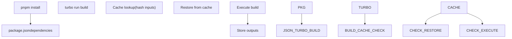
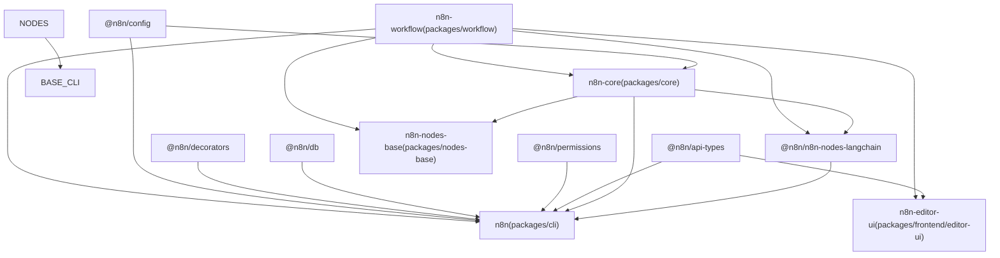
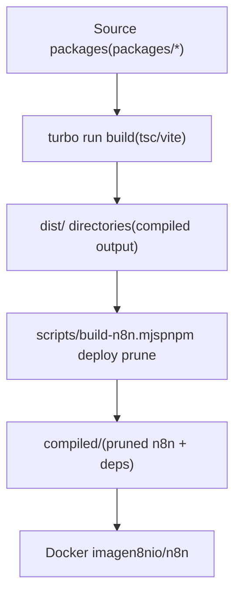
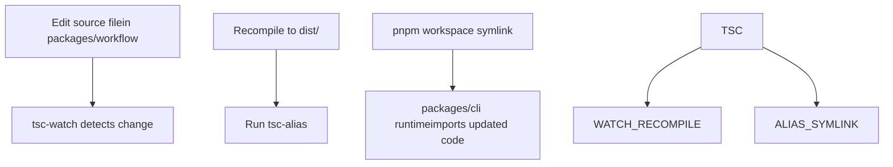

# 构建系统与 monorepo 编排

相关源文件

-   [CHANGELOG.md](https://github.com/n8n-io/n8n/blob/88f170b9/CHANGELOG.md?plain=1)
-   [codecov.yml](https://github.com/n8n-io/n8n/blob/88f170b9/codecov.yml)
-   [jest.config.js](https://github.com/n8n-io/n8n/blob/88f170b9/jest.config.js)
-   [package.json](https://github.com/n8n-io/n8n/blob/88f170b9/package.json)
-   [packages/@n8n/api-types/package.json](https://github.com/n8n-io/n8n/blob/88f170b9/packages/@n8n/api-types/package.json)
-   [packages/@n8n/client-oauth2/tsconfig.build.json](https://github.com/n8n-io/n8n/blob/88f170b9/packages/@n8n/client-oauth2/tsconfig.build.json)
-   [packages/@n8n/config/package.json](https://github.com/n8n-io/n8n/blob/88f170b9/packages/@n8n/config/package.json)
-   [packages/@n8n/expression-runtime/tsconfig.build.cjs.json](https://github.com/n8n-io/n8n/blob/88f170b9/packages/@n8n/expression-runtime/tsconfig.build.cjs.json)
-   [packages/@n8n/expression-runtime/tsconfig.build.esm.json](https://github.com/n8n-io/n8n/blob/88f170b9/packages/@n8n/expression-runtime/tsconfig.build.esm.json)
-   [packages/@n8n/nodes-langchain/package.json](https://github.com/n8n-io/n8n/blob/88f170b9/packages/@n8n/nodes-langchain/package.json)
-   [packages/@n8n/nodes-langchain/tsconfig.build.json](https://github.com/n8n-io/n8n/blob/88f170b9/packages/@n8n/nodes-langchain/tsconfig.build.json)
-   [packages/@n8n/nodes-langchain/tsconfig.json](https://github.com/n8n-io/n8n/blob/88f170b9/packages/@n8n/nodes-langchain/tsconfig.json)
-   [packages/@n8n/task-runner/package.json](https://github.com/n8n-io/n8n/blob/88f170b9/packages/@n8n/task-runner/package.json)
-   [packages/cli/package.json](https://github.com/n8n-io/n8n/blob/88f170b9/packages/cli/package.json)
-   [packages/cli/tsconfig.build.json](https://github.com/n8n-io/n8n/blob/88f170b9/packages/cli/tsconfig.build.json)
-   [packages/cli/tsconfig.json](https://github.com/n8n-io/n8n/blob/88f170b9/packages/cli/tsconfig.json)
-   [packages/core/package.json](https://github.com/n8n-io/n8n/blob/88f170b9/packages/core/package.json)
-   [packages/core/tsconfig.build.json](https://github.com/n8n-io/n8n/blob/88f170b9/packages/core/tsconfig.build.json)
-   [packages/core/tsconfig.json](https://github.com/n8n-io/n8n/blob/88f170b9/packages/core/tsconfig.json)
-   [packages/frontend/@n8n/design-system/package.json](https://github.com/n8n-io/n8n/blob/88f170b9/packages/frontend/@n8n/design-system/package.json)
-   [packages/frontend/@n8n/stores/src/__tests__/metaTagConfig.test.ts](https://github.com/n8n-io/n8n/blob/88f170b9/packages/frontend/@n8n/stores/src/__tests__/metaTagConfig.test.ts)
-   [packages/frontend/@n8n/stores/src/metaTagConfig.ts](https://github.com/n8n-io/n8n/blob/88f170b9/packages/frontend/@n8n/stores/src/metaTagConfig.ts)
-   [packages/frontend/editor-ui/index.html](https://github.com/n8n-io/n8n/blob/88f170b9/packages/frontend/editor-ui/index.html)
-   [packages/frontend/editor-ui/package.json](https://github.com/n8n-io/n8n/blob/88f170b9/packages/frontend/editor-ui/package.json)
-   [packages/frontend/editor-ui/public/static/posthog.init.js](https://github.com/n8n-io/n8n/blob/88f170b9/packages/frontend/editor-ui/public/static/posthog.init.js)
-   [packages/frontend/editor-ui/public/static/prefers-color-scheme.css](https://github.com/n8n-io/n8n/blob/88f170b9/packages/frontend/editor-ui/public/static/prefers-color-scheme.css)
-   [packages/frontend/editor-ui/tsconfig.json](https://github.com/n8n-io/n8n/blob/88f170b9/packages/frontend/editor-ui/tsconfig.json)
-   [packages/frontend/editor-ui/vite.config.mts](https://github.com/n8n-io/n8n/blob/88f170b9/packages/frontend/editor-ui/vite.config.mts)
-   [packages/node-dev/package.json](https://github.com/n8n-io/n8n/blob/88f170b9/packages/node-dev/package.json)
-   [packages/node-dev/tsconfig.json](https://github.com/n8n-io/n8n/blob/88f170b9/packages/node-dev/tsconfig.json)
-   [packages/nodes-base/package.json](https://github.com/n8n-io/n8n/blob/88f170b9/packages/nodes-base/package.json)
-   [packages/nodes-base/tsconfig.json](https://github.com/n8n-io/n8n/blob/88f170b9/packages/nodes-base/tsconfig.json)
-   [packages/workflow/package.json](https://github.com/n8n-io/n8n/blob/88f170b9/packages/workflow/package.json)
-   [packages/workflow/test/expression-vm-errors.test.ts](https://github.com/n8n-io/n8n/blob/88f170b9/packages/workflow/test/expression-vm-errors.test.ts)
-   [packages/workflow/test/setup-vm-evaluator.ts](https://github.com/n8n-io/n8n/blob/88f170b9/packages/workflow/test/setup-vm-evaluator.ts)
-   [packages/workflow/tsconfig.json](https://github.com/n8n-io/n8n/blob/88f170b9/packages/workflow/tsconfig.json)
-   [pnpm-lock.yaml](https://github.com/n8n-io/n8n/blob/88f170b9/pnpm-lock.yaml)
-   [pnpm-workspace.yaml](https://github.com/n8n-io/n8n/blob/88f170b9/pnpm-workspace.yaml)
-   [tsconfig.json](https://github.com/n8n-io/n8n/blob/88f170b9/tsconfig.json)
-   [turbo.json](https://github.com/n8n-io/n8n/blob/88f170b9/turbo.json)

本文档记录了用于编译、组装和打包 n8n monorepo 的工具和脚本：Turborepo 流水线、pnpm 工作区配置、各软件包的构建策略、依赖锁定与补丁，以及生产环境打包逻辑。

---

## 工作区布局

该 monorepo 由 **pnpm**（版本 `10.22.0`，通过 `packageManager` 字段强制执行）和 **Turborepo**（版本 `2.8.9`）管理。根目录的 `preinstall` 脚本会运行 `scripts/block-npm-install.js`，以拒绝 `npm install` 调用，从而强制只使用 pnpm。

**工作区通配符**（`pnpm-workspace.yaml`）：

| 通配符 | 内容 |
| --- | --- |
| `packages/*` | 核心后端软件包（`cli`、`core`、`workflow`、`nodes-base`、`node-dev`） |
| `packages/@n8n/*` | 带命名空间的内部软件包（`config`、`db`、`decorators`、`task-runner` 等） |
| `packages/frontend/**` | 前端软件包（`editor-ui`、`design-system`、`chat` 等） |
| `packages/extensions/**` | 扩展软件包 |
| `packages/testing/**` | 测试基础设施（`playwright`、`containers`） |

来源：[pnpm-workspace.yaml1-6](https://github.com/n8n-io/n8n/blob/88f170b9/pnpm-workspace.yaml#L1-L6) [package.json8-9](https://github.com/n8n-io/n8n/blob/88f170b9/package.json#L8-L9)

---

## Turborepo 流水线

Turborepo 通过解析 `package.json` 中的 `dependencies`/`devDependencies` 拓扑顺序来编排构建，并行执行任务。

### 构建缓存与任务依赖

仓库根目录的 `turbo.json` 文件定义了任务流水线。每个任务都会声明 `dependsOn`（例如 `^build` 表示先构建依赖项）和 `outputs`（用于缓存的文件 glob 模式）。

**Turborepo 任务编排**


来源：[package.json13-51](https://github.com/n8n-io/n8n/blob/88f170b9/package.json#L13-L51) [packages/cli/package.json8](https://github.com/n8n-io/n8n/blob/88f170b9/packages/cli/package.json#L8-L8)

**构建依赖层级**


来源：[packages/cli/package.json96-122](https://github.com/n8n-io/n8n/blob/88f170b9/packages/cli/package.json#L96-L122) [packages/core/package.json42-83](https://github.com/n8n-io/n8n/blob/88f170b9/packages/core/package.json#L42-L83) [packages/workflow/package.json53-72](https://github.com/n8n-io/n8n/blob/88f170b9/packages/workflow/package.json#L53-L72) [packages/nodes-base/package.json1-11](https://github.com/n8n-io/n8n/blob/88f170b9/packages/nodes-base/package.json#L1-L11)

---

## 各软件包构建策略

每个软件包都定义自己的 `build` 脚本。Turborepo 会按依赖顺序调用这些脚本。

| 构建工具 | 软件包 | 脚本模式 |
| --- | --- | --- |
| **tsc + tsc-alias** | `cli`、`core`、`task-runner` | `tsc -p tsconfig.build.json && tsc-alias -p tsconfig.build.json` |
| **tsc（双 ESM/CJS）** | `workflow` | `tsc --build tsconfig.build.esm.json tsconfig.build.cjs.json` |
| **tsc + Node 代码生成** | `nodes-base`、`nodes-langchain` | `tsc --build ... && n8n-generate-metadata && n8n-generate-node-defs` |
| **Vite** | `editor-ui`、`design-system` | `vite build` |

来源：[packages/cli/package.json7-11](https://github.com/n8n-io/n8n/blob/88f170b9/packages/cli/package.json#L7-L11) [packages/core/package.json13-16](https://github.com/n8n-io/n8n/blob/88f170b9/packages/core/package.json#L13-L16) [packages/workflow/package.json21-26](https://github.com/n8n-io/n8n/blob/88f170b9/packages/workflow/package.json#L21-L26) [packages/nodes-base/package.json6-11](https://github.com/n8n-io/n8n/blob/88f170b9/packages/nodes-base/package.json#L6-L11) [packages/@n8n/nodes-langchain/package.json26-31](https://github.com/n8n-io/n8n/blob/88f170b9/packages/@n8n/nodes-langchain/package.json#L26-L31) [packages/frontend/editor-ui/package.json7-11](https://github.com/n8n-io/n8n/blob/88f170b9/packages/frontend/editor-ui/package.json#L7-L11) [packages/@n8n/task-runner/package.json4-10](https://github.com/n8n-io/n8n/blob/88f170b9/packages/@n8n/task-runner/package.json#L4-L10)

### Node 代码生成二进制文件

`packages/core` 在节点软件包构建期间公开了用于 CLI 的二进制文件：

-   `n8n-copy-static-files`：将非 TS 资源（图标、模板）复制到 `dist/`。
-   `n8n-generate-translations`：生成节点翻译 JSON 文件。
-   `n8n-generate-metadata`：生成供 UI 使用的节点元数据。
-   `n8n-generate-node-defs`：生成节点定义文件。

---

## 依赖管理

### Catalog 锁定

`pnpm-workspace.yaml` 使用 catalog 来确保所有软件包引用固定版本。[pnpm-workspace.yaml8-128](https://github.com/n8n-io/n8n/blob/88f170b9/pnpm-workspace.yaml#L8-L128)

-   **`default`**：共享后端依赖，例如 `typescript`（5.9.2）、`lodash`（4.17.23）和 `zod`（3.25.67）。
-   **`frontend`**：Vue 专用依赖，例如 `vue`（3.5.26）和 `pinia`（2.2.4）。
-   **`sentry`**：Sentry SDK（10.36.0）。

### 全局版本覆盖与补丁

根目录 `package.json` 会强制传递依赖版本并应用补丁。[package.json91-168](https://github.com/n8n-io/n8n/blob/88f170b9/package.json#L91-L168)

-   **覆盖项**：锁定 `axios`（1.13.5）、`esbuild`（^0.25.0），并用分支版本替换 `expr-eval`。
-   **补丁**：`patches/` 中针对 `bull@4.16.4`、`element-plus@2.4.3` 和 `vue-tsc@2.2.8` 的本地修复。

---

## 生产构建: `scripts/build-n8n.mjs`

`build:n8n` 脚本（`node scripts/build-n8n.mjs`）会组装一个用于生产环境/Docker 的自包含部署目录。[package.json14](https://github.com/n8n-io/n8n/blob/88f170b9/package.json#L14-L14)

**执行顺序：**

1.  **清理**：移除先前的 `compiled/` 和 `dist/` 输出。
2.  **构建**：运行 `pnpm install` 和 `turbo run build`。
3.  **裁剪**：使用 `pnpm deploy --filter=n8n --prod` 在 `compiled/` 目录中创建仅生产依赖树。
4.  **清单**：生成包含版本和构建时间戳的 `build-manifest.json`。

来源：[scripts/build-n8n.mjs1-200](https://github.com/n8n-io/n8n/blob/88f170b9/scripts/build-n8n.mjs#L1-L200) [package.json14-19](https://github.com/n8n-io/n8n/blob/88f170b9/package.json#L14-L19)

**生产工件流**


来源：[scripts/build-n8n.mjs1-15](https://github.com/n8n-io/n8n/blob/88f170b9/scripts/build-n8n.mjs#L1-L15) [package.json14-20](https://github.com/n8n-io/n8n/blob/88f170b9/package.json#L14-L20)

---

## 开发模式与工作区编排

开发期间，根目录的 `watch` 脚本通过 Turborepo 以高并发向所有软件包分发任务。[package.json50](https://github.com/n8n-io/n8n/blob/88f170b9/package.json#L50-L50)

```
turbo run watch --concurrency=32
```
### 脚本/目录实用工具

`scripts/` 目录包含用于工作区管理的实用工具：

-   `scripts/prepare.mjs`：在 pnpm prepare 生命周期期间运行。[package.json11](https://github.com/n8n-io/n8n/blob/88f170b9/package.json#L11-L11)
-   `scripts/block-npm-install.js`：强制使用 pnpm。[package.json12](https://github.com/n8n-io/n8n/blob/88f170b9/package.json#L12-L12)
-   `scripts/backend-module/setup.mjs`：为新后端模块搭建脚手架。[package.json39](https://github.com/n8n-io/n8n/blob/88f170b9/package.json#L39-L39)
-   `scripts/os-normalize.mjs`：为跨平台二进制执行规范化路径。[package.json40](https://github.com/n8n-io/n8n/blob/88f170b9/package.json#L40-L40)

**开发工作流编排**


来源：[package.json21-26](https://github.com/n8n-io/n8n/blob/88f170b9/package.json#L21-L26) [packages/cli/package.json13-15](https://github.com/n8n-io/n8n/blob/88f170b9/packages/cli/package.json#L13-L15) [packages/workflow/package.json31](https://github.com/n8n-io/n8n/blob/88f170b9/packages/workflow/package.json#L31-L31) [pnpm-workspace.yaml1-6](https://github.com/n8n-io/n8n/blob/88f170b9/pnpm-workspace.yaml#L1-L6)
