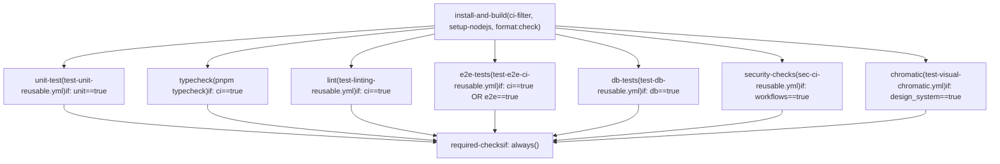
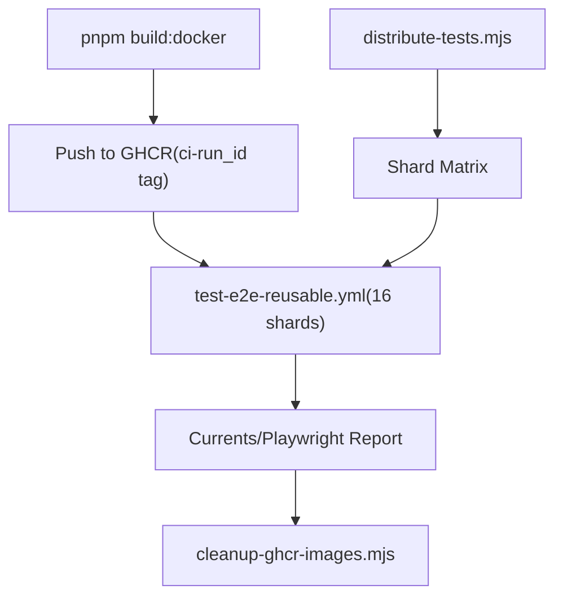

# CI 工作流与拉取请求验证

相关源文件

-   [.github/CI-TELEMETRY.md](https://github.com/n8n-io/n8n/blob/88f170b9/.github/CI-TELEMETRY.md?plain=1)
-   [.github/WORKFLOWS.md](https://github.com/n8n-io/n8n/blob/88f170b9/.github/WORKFLOWS.md?plain=1)
-   [.github/actions/docker-registry-login/action.yml](https://github.com/n8n-io/n8n/blob/88f170b9/.github/actions/docker-registry-login/action.yml)
-   [.github/actions/setup-nodejs/action.yml](https://github.com/n8n-io/n8n/blob/88f170b9/.github/actions/setup-nodejs/action.yml)
-   [.github/docker-compose.yml](https://github.com/n8n-io/n8n/blob/88f170b9/.github/docker-compose.yml)
-   [.github/scripts/bump-versions.mjs](https://github.com/n8n-io/n8n/blob/88f170b9/.github/scripts/bump-versions.mjs)
-   [.github/scripts/cleanup-ghcr-images.mjs](https://github.com/n8n-io/n8n/blob/88f170b9/.github/scripts/cleanup-ghcr-images.mjs)
-   [.github/scripts/compute-backport-targets.mjs](https://github.com/n8n-io/n8n/blob/88f170b9/.github/scripts/compute-backport-targets.mjs)
-   [.github/scripts/compute-backport-targets.test.mjs](https://github.com/n8n-io/n8n/blob/88f170b9/.github/scripts/compute-backport-targets.test.mjs)
-   [.github/scripts/create-github-release.mjs](https://github.com/n8n-io/n8n/blob/88f170b9/.github/scripts/create-github-release.mjs)
-   [.github/scripts/determine-release-candidate-branch-for-track.mjs](https://github.com/n8n-io/n8n/blob/88f170b9/.github/scripts/determine-release-candidate-branch-for-track.mjs)
-   [.github/scripts/determine-release-version-changes.mjs](https://github.com/n8n-io/n8n/blob/88f170b9/.github/scripts/determine-release-version-changes.mjs)
-   [.github/scripts/determine-release-version-changes.test.mjs](https://github.com/n8n-io/n8n/blob/88f170b9/.github/scripts/determine-release-version-changes.test.mjs)
-   [.github/scripts/determine-version-info.mjs](https://github.com/n8n-io/n8n/blob/88f170b9/.github/scripts/determine-version-info.mjs)
-   [.github/scripts/determine-version-info.test.mjs](https://github.com/n8n-io/n8n/blob/88f170b9/.github/scripts/determine-version-info.test.mjs)
-   [.github/scripts/ensure-release-candidate-branches.mjs](https://github.com/n8n-io/n8n/blob/88f170b9/.github/scripts/ensure-release-candidate-branches.mjs)
-   [.github/scripts/ensure-release-candidate-branches.test.mjs](https://github.com/n8n-io/n8n/blob/88f170b9/.github/scripts/ensure-release-candidate-branches.test.mjs)
-   [.github/scripts/fixtures/mock-github-event.json](https://github.com/n8n-io/n8n/blob/88f170b9/.github/scripts/fixtures/mock-github-event.json)
-   [.github/scripts/get-release-versions.mjs](https://github.com/n8n-io/n8n/blob/88f170b9/.github/scripts/get-release-versions.mjs)
-   [.github/scripts/github-helpers.mjs](https://github.com/n8n-io/n8n/blob/88f170b9/.github/scripts/github-helpers.mjs)
-   [.github/scripts/jsconfig.json](https://github.com/n8n-io/n8n/blob/88f170b9/.github/scripts/jsconfig.json)
-   [.github/scripts/move-track-tag.mjs](https://github.com/n8n-io/n8n/blob/88f170b9/.github/scripts/move-track-tag.mjs)
-   [.github/scripts/package.json](https://github.com/n8n-io/n8n/blob/88f170b9/.github/scripts/package.json)
-   [.github/scripts/plan-release.mjs](https://github.com/n8n-io/n8n/blob/88f170b9/.github/scripts/plan-release.mjs)
-   [.github/scripts/pnpm-lock.yaml](https://github.com/n8n-io/n8n/blob/88f170b9/.github/scripts/pnpm-lock.yaml)
-   [.github/scripts/populate-cloud-databases.mjs](https://github.com/n8n-io/n8n/blob/88f170b9/.github/scripts/populate-cloud-databases.mjs)
-   [.github/scripts/promote-github-release.mjs](https://github.com/n8n-io/n8n/blob/88f170b9/.github/scripts/promote-github-release.mjs)
-   [.github/scripts/retry.mjs](https://github.com/n8n-io/n8n/blob/88f170b9/.github/scripts/retry.mjs)
-   [.github/scripts/send-build-stats.mjs](https://github.com/n8n-io/n8n/blob/88f170b9/.github/scripts/send-build-stats.mjs)
-   [.github/scripts/send-docker-stats.mjs](https://github.com/n8n-io/n8n/blob/88f170b9/.github/scripts/send-docker-stats.mjs)
-   [.github/scripts/send-version-release-notification.mjs](https://github.com/n8n-io/n8n/blob/88f170b9/.github/scripts/send-version-release-notification.mjs)
-   [.github/scripts/update-changelog.mjs](https://github.com/n8n-io/n8n/blob/88f170b9/.github/scripts/update-changelog.mjs)
-   [.github/workflows/backport.yml](https://github.com/n8n-io/n8n/blob/88f170b9/.github/workflows/backport.yml)
-   [.github/workflows/build-base-image.yml](https://github.com/n8n-io/n8n/blob/88f170b9/.github/workflows/build-base-image.yml)
-   [.github/workflows/build-benchmark-image.yml](https://github.com/n8n-io/n8n/blob/88f170b9/.github/workflows/build-benchmark-image.yml)
-   [.github/workflows/ci-master.yml](https://github.com/n8n-io/n8n/blob/88f170b9/.github/workflows/ci-master.yml)
-   [.github/workflows/ci-pull-requests.yml](https://github.com/n8n-io/n8n/blob/88f170b9/.github/workflows/ci-pull-requests.yml)
-   [.github/workflows/release-create-github-releases.yml](https://github.com/n8n-io/n8n/blob/88f170b9/.github/workflows/release-create-github-releases.yml)
-   [.github/workflows/release-create-patch-pr.yml](https://github.com/n8n-io/n8n/blob/88f170b9/.github/workflows/release-create-patch-pr.yml)
-   [.github/workflows/release-create-pr.yml](https://github.com/n8n-io/n8n/blob/88f170b9/.github/workflows/release-create-pr.yml)
-   [.github/workflows/release-merge-tag-to-branch.yml](https://github.com/n8n-io/n8n/blob/88f170b9/.github/workflows/release-merge-tag-to-branch.yml)
-   [.github/workflows/release-populate-cloud-with-releases.yml](https://github.com/n8n-io/n8n/blob/88f170b9/.github/workflows/release-populate-cloud-with-releases.yml)
-   [.github/workflows/release-promote-github-release.yml](https://github.com/n8n-io/n8n/blob/88f170b9/.github/workflows/release-promote-github-release.yml)
-   [.github/workflows/release-publish-post-release.yml](https://github.com/n8n-io/n8n/blob/88f170b9/.github/workflows/release-publish-post-release.yml)
-   [.github/workflows/release-publish.yml](https://github.com/n8n-io/n8n/blob/88f170b9/.github/workflows/release-publish.yml)
-   [.github/workflows/release-push-to-channel.yml](https://github.com/n8n-io/n8n/blob/88f170b9/.github/workflows/release-push-to-channel.yml)
-   [.github/workflows/release-standalone-package.yml](https://github.com/n8n-io/n8n/blob/88f170b9/.github/workflows/release-standalone-package.yml)
-   [.github/workflows/release-update-pointer-tag.yml](https://github.com/n8n-io/n8n/blob/88f170b9/.github/workflows/release-update-pointer-tag.yml)
-   [.github/workflows/release-version-release-notification.yml](https://github.com/n8n-io/n8n/blob/88f170b9/.github/workflows/release-version-release-notification.yml)
-   [.github/workflows/sbom-generation-callable.yml](https://github.com/n8n-io/n8n/blob/88f170b9/.github/workflows/sbom-generation-callable.yml)
-   [.github/workflows/security-trivy-scan-callable.yml](https://github.com/n8n-io/n8n/blob/88f170b9/.github/workflows/security-trivy-scan-callable.yml)
-   [.github/workflows/test-benchmark-destroy-nightly.yml](https://github.com/n8n-io/n8n/blob/88f170b9/.github/workflows/test-benchmark-destroy-nightly.yml)
-   [.github/workflows/test-benchmark-nightly.yml](https://github.com/n8n-io/n8n/blob/88f170b9/.github/workflows/test-benchmark-nightly.yml)
-   [.github/workflows/test-e2e-ci-reusable.yml](https://github.com/n8n-io/n8n/blob/88f170b9/.github/workflows/test-e2e-ci-reusable.yml)
-   [.github/workflows/test-e2e-coverage-weekly.yml](https://github.com/n8n-io/n8n/blob/88f170b9/.github/workflows/test-e2e-coverage-weekly.yml)
-   [.github/workflows/test-e2e-performance-reusable.yml](https://github.com/n8n-io/n8n/blob/88f170b9/.github/workflows/test-e2e-performance-reusable.yml)
-   [.github/workflows/test-e2e-reusable.yml](https://github.com/n8n-io/n8n/blob/88f170b9/.github/workflows/test-e2e-reusable.yml)
-   [.github/workflows/test-linting-reusable.yml](https://github.com/n8n-io/n8n/blob/88f170b9/.github/workflows/test-linting-reusable.yml)
-   [.github/workflows/test-unit-reusable.yml](https://github.com/n8n-io/n8n/blob/88f170b9/.github/workflows/test-unit-reusable.yml)
-   [.github/workflows/test-workflow-scripts-reusable.yml](https://github.com/n8n-io/n8n/blob/88f170b9/.github/workflows/test-workflow-scripts-reusable.yml)
-   [.github/workflows/util-cleanup-abandoned-release-branches.yml](https://github.com/n8n-io/n8n/blob/88f170b9/.github/workflows/util-cleanup-abandoned-release-branches.yml)
-   [.github/workflows/util-cleanup-pr-images.yml](https://github.com/n8n-io/n8n/blob/88f170b9/.github/workflows/util-cleanup-pr-images.yml)
-   [.github/workflows/util-determine-current-version.yml](https://github.com/n8n-io/n8n/blob/88f170b9/.github/workflows/util-determine-current-version.yml)
-   [.github/workflows/util-ensure-release-candidate-branches.yml](https://github.com/n8n-io/n8n/blob/88f170b9/.github/workflows/util-ensure-release-candidate-branches.yml)
-   [.github/workflows/util-sync-api-docs.yml](https://github.com/n8n-io/n8n/blob/88f170b9/.github/workflows/util-sync-api-docs.yml)
-   [.gitignore](https://github.com/n8n-io/n8n/blob/88f170b9/.gitignore)
-   [CONTRIBUTING.md](https://github.com/n8n-io/n8n/blob/88f170b9/CONTRIBUTING.md?plain=1)
-   [packages/@n8n/nodes-langchain/nodes/vector_store/VectorStoreRedis/VectorStoreRedis.node.ts](https://github.com/n8n-io/n8n/blob/88f170b9/packages/@n8n/nodes-langchain/nodes/vector_store/VectorStoreRedis/VectorStoreRedis.node.ts)
-   [packages/cli/src/__tests__/abstract-server.test.ts](https://github.com/n8n-io/n8n/blob/88f170b9/packages/cli/src/__tests__/abstract-server.test.ts)
-   [packages/cli/src/commands/__tests__/webhook.test.ts](https://github.com/n8n-io/n8n/blob/88f170b9/packages/cli/src/commands/__tests__/webhook.test.ts)
-   [packages/cli/src/commands/__tests__/worker.test.ts](https://github.com/n8n-io/n8n/blob/88f170b9/packages/cli/src/commands/__tests__/worker.test.ts)
-   [packages/testing/containers/network-stabilization.ts](https://github.com/n8n-io/n8n/blob/88f170b9/packages/testing/containers/network-stabilization.ts)
-   [packages/testing/containers/pull-test-images.ts](https://github.com/n8n-io/n8n/blob/88f170b9/packages/testing/containers/pull-test-images.ts)
-   [packages/testing/containers/services/n8n.ts](https://github.com/n8n-io/n8n/blob/88f170b9/packages/testing/containers/services/n8n.ts)
-   [packages/testing/janitor/src/rules/dead-code.rule.test.ts](https://github.com/n8n-io/n8n/blob/88f170b9/packages/testing/janitor/src/rules/dead-code.rule.test.ts)
-   [packages/testing/janitor/src/rules/dead-code.rule.ts](https://github.com/n8n-io/n8n/blob/88f170b9/packages/testing/janitor/src/rules/dead-code.rule.ts)
-   [packages/testing/playwright/pages/components/RunDataPanel.ts](https://github.com/n8n-io/n8n/blob/88f170b9/packages/testing/playwright/pages/components/RunDataPanel.ts)
-   [packages/testing/playwright/scripts/coverage-analysis.mjs](https://github.com/n8n-io/n8n/blob/88f170b9/packages/testing/playwright/scripts/coverage-analysis.mjs)
-   [packages/testing/playwright/scripts/distribute-tests.mjs](https://github.com/n8n-io/n8n/blob/88f170b9/packages/testing/playwright/scripts/distribute-tests.mjs)
-   [packages/testing/playwright/tests/e2e/workflows/editor/ndv/paired-item.spec.ts](https://github.com/n8n-io/n8n/blob/88f170b9/packages/testing/playwright/tests/e2e/workflows/editor/ndv/paired-item.spec.ts)
-   [scripts/scan-n8n-image.mjs](https://github.com/n8n-io/n8n/blob/88f170b9/scripts/scan-n8n-image.mjs)
-   [security/trivy-ignore-policy.rego](https://github.com/n8n-io/n8n/blob/88f170b9/security/trivy-ignore-policy.rego)
-   [security/trivy.yaml](https://github.com/n8n-io/n8n/blob/88f170b9/security/trivy.yaml)
-   [security/vex.openvex.json](https://github.com/n8n-io/n8n/blob/88f170b9/security/vex.openvex.json)

本文档记录了在拉取请求和 `master` 分支上运行的自动化 CI 流水线：它们包含哪些作业，`ci-filter` 操作如何根据变更文件决定条件执行，以及 `required-checks` 作业如何强制执行分支保护。有关发布执行流水线，请参阅 [9.3](https://github.com/n8n-io/n8n/blob/88f170b9/9.3)；有关 Docker 镜像构建，请参阅 [9.4](https://github.com/n8n-io/n8n/blob/88f170b9/9.4)；有关构建系统本身（Turborepo、`setup-nodejs` action）的概览，请参阅 [9.1](https://github.com/n8n-io/n8n/blob/88f170b9/9.1)。

---

## 工作流文件一览

| 文件 | 触发器 | 主要用途 |
| --- | --- | --- |
| `.github/workflows/ci-pull-requests.yml` | `pull_request`, `merge_group` | PR 的完整 CI 门禁 |
| `.github/workflows/ci-master.yml` | push 到 `master`, `1.x` | 合并后 CI，多 Node 矩阵 |
| `.github/workflows/test-unit-reusable.yml` | `workflow_call` | 可复用的单元测试运行器 |
| `.github/workflows/test-linting-reusable.yml` | `workflow_call` | 可复用的 lint 运行器 |
| `.github/workflows/test-e2e-ci-reusable.yml` | `workflow_call` | 可复用的 E2E 运行器（Playwright） |
| `.github/workflows/test-db-reusable.yml` | `workflow_call` | 可复用的 DB/集成测试运行器 |
| `.github/workflows/sec-ci-reusable.yml` | `workflow_call` | 可复用的安全检查 |
| `.github/workflows/test-visual-chromatic.yml` | `workflow_call` | 可复用的 Chromatic 视觉测试 |
| `.github/actions/ci-filter` | composite action | 确定运行哪些作业；验证结果 |

**来源：** [.github/workflows/ci-pull-requests.yml1-175](https://github.com/n8n-io/n8n/blob/88f170b9/.github/workflows/ci-pull-requests.yml#L1-L175) [.github/workflows/ci-master.yml1-61](https://github.com/n8n-io/n8n/blob/88f170b9/.github/workflows/ci-master.yml#L1-L61)

---

## `ci-pull-requests.yml` — PR CI 工作流

### 概览

PR 工作流会在每次 `pull_request` 事件和 `merge_group` 活动时触发 [.github/workflows/ci-pull-requests.yml3-5](https://github.com/n8n-io/n8n/blob/88f170b9/ .github/workflows/ci-pull-requests.yml#L3-L5)。它使用基于 PR 编号或 merge group SHA 的 `concurrency` 组，以确保只测试最新提交，并自动取消冗余运行 [.github/workflows/ci-pull-requests.yml7-9](https://github.com/n8n-io/n8n/blob/88f170b9/ .github/workflows/ci-pull-requests.yml#L7-L9)。

### 作业图

**PR CI 工作流作业依赖图**

**来源：** [.github/workflows/ci-pull-requests.yml11-185](https://github.com/n8n-io/n8n/blob/88f170b9/.github/workflows/ci-pull-requests.yml#L11-L185)

### `install-and-build` 作业

该作业是流水线的入口点。它：

1.  **捕获提交 SHA**：解析特定的 HEAD SHA，以确保即使分支在执行过程中移动，矩阵中的结果仍保持一致 [.github/workflows/ci-pull-requests.yml37-39](https://github.com/n8n-io/n8n/blob/88f170b9/ .github/workflows/ci-pull-requests.yml#L37-L39)
2.  **运行 `ci-filter`**：一个组合式 action，用于确定 monorepo 的哪些部分发生了变更 [.github/workflows/ci-pull-requests.yml41-83](https://github.com/n8n-io/n8n/blob/88f170b9/ .github/workflows/ci-pull-requests.yml#L41-L83)
3.  **构建环境**：如果触发了 `ci` 过滤器，则运行 `setup-nodejs` 和 `pnpm format:check` [.github/workflows/ci-pull-requests.yml85-91](https://github.com/n8n-io/n8n/blob/88f170b9/ .github/workflows/ci-pull-requests.yml#L85-L91)

**输出矩阵判定**

| 输出 | ci-filter 的逻辑来源 |
| --- | --- |
| `ci` | 匹配除 `.github/` 和 `task-runner-python/` 之外的所有文件 [.github/workflows/ci-pull-requests.yml47-50](https://github.com/n8n-io/n8n/blob/88f170b9/ .github/workflows/ci-pull-requests.yml#L47-L50) |
| `unit` | 匹配除 `.github/`、`playwright/` 和 `task-runner-python/` 之外的所有文件 [.github/workflows/ci-pull-requests.yml51-55](https://github.com/n8n-io/n8n/blob/88f170b9/ .github/workflows/ci-pull-requests.yml#L51-L55) |
| `e2e` | 匹配 `playwright/`、`containers/` 以及 E2E 工作流文件 [.github/workflows/ci-pull-requests.yml56-60](https://github.com/n8n-io/n8n/blob/88f170b9/ .github/workflows/ci-pull-requests.yml#L56-L60) |
| `db` | 匹配 `packages/cli/src/databases/`、`packages/@n8n/db/` 和 DB 集成测试 [.github/workflows/ci-pull-requests.yml72-83](https://github.com/n8n-io/n8n/blob/88f170b9/ .github/workflows/ci-pull-requests.yml#L72-L83) |
| `design_system` | 匹配 `@n8n/design-system`、`@n8n/chat` 和 Chromatic 工作流 [.github/workflows/ci-pull-requests.yml63-67](https://github.com/n8n-io/n8n/blob/88f170b9/ .github/workflows/ci-pull-requests.yml#L63-L67) |

### E2E 测试策略（Playwright）

E2E 测试使用定义在 `test-e2e-ci-reusable.yml` 中的复杂分片与影响分析系统 [.github/workflows/test-e2e-ci-reusable.yml1-153](https://github.com/n8n-io/n8n/blob/88f170b9/ .github/workflows/test-e2e-ci-reusable.yml#L1-L153)。

1.  **影响分析**：如果检测到 `playwright-only`，它会使用 `--impact` 标志运行 `distribute-tests.mjs`，仅执行受变更文件影响的测试 [.github/workflows/test-e2e-ci-reusable.yml59-77](https://github.com/n8n-io/n8n/blob/88f170b9/ .github/workflows/test-e2e-ci-reusable.yml#L59-L77)
2.  **容器化测试**：它会构建 CI 专用 Docker 镜像（`pnpm build:docker`），并将其推送到 GHCR，供测试分片使用 [.github/workflows/test-e2e-ci-reusable.yml45-57](https://github.com/n8n-io/n8n/blob/88f170b9/ .github/workflows/test-e2e-ci-reusable.yml#L45-L57)
3.  **矩阵执行**：测试会分片到多个运行器上执行（默认 16 个分片） [.github/workflows/test-e2e-ci-reusable.yml71-112](https://github.com/n8n-io/n8n/blob/88f170b9/ .github/workflows/test-e2e-ci-reusable.yml#L71-L112)
4.  **社区 PR**：fork 会运行受限的 `community-e2e` 作业，使用本地 SQLite 且不使用任何内部密钥 [.github/workflows/test-e2e-ci-reusable.yml116-128](https://github.com/n8n-io/n8n/blob/88f170b9/ .github/workflows/test-e2e-ci-reusable.yml#L116-L128)

**E2E 数据流**

**来源：** [.github/workflows/test-e2e-ci-reusable.yml21-153](https://github.com/n8n-io/n8n/blob/88f170b9/ .github/workflows/test-e2e-ci-reusable.yml#L21-L153) [packages/testing/playwright/scripts/distribute-tests.mjs1-75](https://github.com/n8n-io/n8n/blob/88f170b9/packages/testing/playwright/scripts/distribute-tests.mjs#L1-L75)

---

## 安全扫描工作流

CI 流水线包含针对 Docker 镜像和 monorepo 依赖项的自动化安全验证。

### Trivy 镜像扫描

`security-trivy-scan-callable.yml` 工作流会对构建完成的 Docker 镜像执行深度漏洞分析 [.github/workflows/security-trivy-scan-callable.yml1-163](https://github.com/n8n-io/n8n/blob/88f170b9/ .github/workflows/security-trivy-scan-callable.yml#L1-L163)。

-   **VEX 集成**：使用 OpenVEX 文件（`security/vex.openvex.json`）过滤已知误报或不可利用漏洞 [.github/workflows/security-trivy-scan-callable.yml36](https://github.com/n8n-io/n8n/blob/88f170b9/ .github/workflows/security-trivy-scan-callable.yml#L36-L36)
-   **严重性强制**：扫描 `CRITICAL,HIGH,MEDIUM,LOW` 级别的漏洞 [.github/workflows/security-trivy-scan-callable.yml53](https://github.com/n8n-io/n8n/blob/88f170b9/ .github/workflows/security-trivy-scan-callable.yml#L53-L53)
-   **报告**：若发现漏洞，会生成 GitHub Job Summary，并向 Slack 的 `#updates-security` 频道发送提醒 [.github/workflows/security-trivy-scan-callable.yml91-166](https://github.com/n8n-io/n8n/blob/88f170b9/ .github/workflows/security-trivy-scan-callable.yml#L91-L166)

### CI 安全检查

`sec-ci-reusable.yml` 工作流（由 `workflows` 过滤器触发）会验证 GitHub Actions 本身的完整性 [.github/workflows/ci-pull-requests.yml152-160](https://github.com/n8n-io/n8n/blob/88f170b9/ .github/workflows/ci-pull-requests.yml#L152-L160)。

---

## `ci-master.yml` — 主分支 CI

主分支 CI 工作流会在每次推送到 `master` 或 `1.x` 分支时运行 [.github/workflows/ci-master.yml1-9](https://github.com/n8n-io/n8n/blob/88f170b9/ .github/workflows/ci-master.yml#L1-L9)。与 PR 工作流不同，它不使用 `ci-filter`，而是运行完整的单元测试和 lint 套件，以确保分支健康。

### Node.js 版本矩阵

它会在多个 Node.js 版本上验证 n8n，以确保兼容受支持范围内的所有版本：

-   **矩阵**：`[22.x, 24.13.1, 25.x]` [.github/workflows/ci-master.yml31](https://github.com/n8n-io/n8n/blob/88f170b9/ .github/workflows/ci-master.yml#L31-L31)
-   **覆盖率**：仅在主版本（`24.13.1`）上收集代码覆盖率，以优化运行器使用 [.github/workflows/ci-master.yml35](https://github.com/n8n-io/n8n/blob/88f170b9/ .github/workflows/ci-master.yml#L35-L35)

**主分支 CI 通知系统** 如果主分支流水线中的任何作业失败，都会通过 `act10ns/slack` action 向 `#alerts-build` Slack 频道发送通知 [.github/workflows/ci-master.yml50-63](https://github.com/n8n-io/n8n/blob/88f170b9/ .github/workflows/ci-master.yml#L50-L63)。

---

## 必需检查与合并队列

GitHub 分支保护规则配置为要求 `ci-pull-requests.yml` 中的 `required-checks` 作业通过 [.github/workflows/ci-pull-requests.yml181-185](https://github.com/n8n-io/n8n/blob/88f170b9/ .github/workflows/ci-pull-requests.yml#L181-L185)。

### `validate` 模式

由于许多作业都是条件性的（会被 `ci-filter` 跳过），GitHub 原生的“Required”状态检查会卡在等待被跳过的作业上。`required-checks` 作业通过以下方式解决这个问题：

1.  运行 `if: always()` [.github/workflows/ci-pull-requests.yml181](https://github.com/n8n-io/n8n/blob/88f170b9/ .github/workflows/ci-pull-requests.yml#L181-L181)
2.  在 `mode: validate` 中使用 `ci-filter` [.github/workflows/ci-pull-requests.yml45](https://github.com/n8n-io/n8n/blob/88f170b9/ .github/workflows/ci-pull-requests.yml#L45-L45)
3.  检查 `needs` 上下文 [.github/workflows/ci-pull-requests.yml183-184](https://github.com/n8n-io/n8n/blob/88f170b9/ .github/workflows/ci-pull-requests.yml#L183-L184) 如果作业因为不需要而被跳过，`validate` 会将其视为通过。如果作业本应运行但失败了，`validate` 会使整个 PR 失败。

### 合并队列集成

该工作流支持 `merge_group` 事件 [.github/workflows/ci-pull-requests.yml5](https://github.com/n8n-io/n8n/blob/88f170b9/ .github/workflows/ci-pull-requests.yml#L5-L5)。当处于 merge group 中时，它会检出 `merge_group.head_sha`，而不是 PR 的 merge ref，以确保测试针对 GitHub 生成的临时合并提交运行 [.github/workflows/ci-pull-requests.yml35](https://github.com/n8n-io/n8n/blob/88f170b9/ .github/workflows/ci-pull-requests.yml#L35-L35)。

**来源：** [.github/workflows/ci-pull-requests.yml1-185](https://github.com/n8n-io/n8n/blob/88f170b9/.github/workflows/ci-pull-requests.yml#L1-L185) [.github/workflows/ci-master.yml1-63](https://github.com/n8n-io/n8n/blob/88f170b9/.github/workflows/ci-master.yml#L1-L63) [.github/workflows/test-e2e-ci-reusable.yml1-153](https://github.com/n8n-io/n8n/blob/88f170b9/.github/workflows/test-e2e-ci-reusable.yml#L1-L153) [.github/workflows/security-trivy-scan-callable.yml1-163](https://github.com/n8n-io/n8n/blob/88f170b9/.github/workflows/security-trivy-scan-callable.yml#L1-L163)
