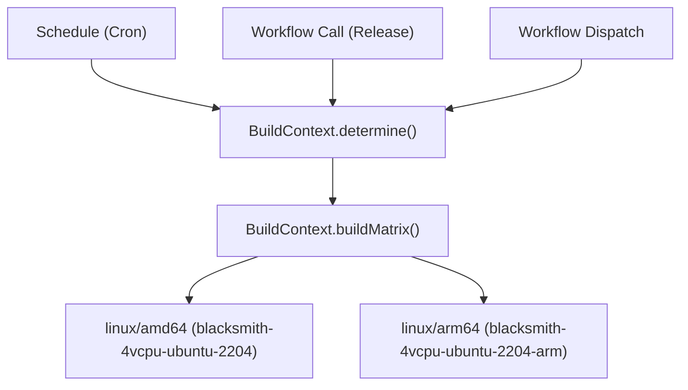
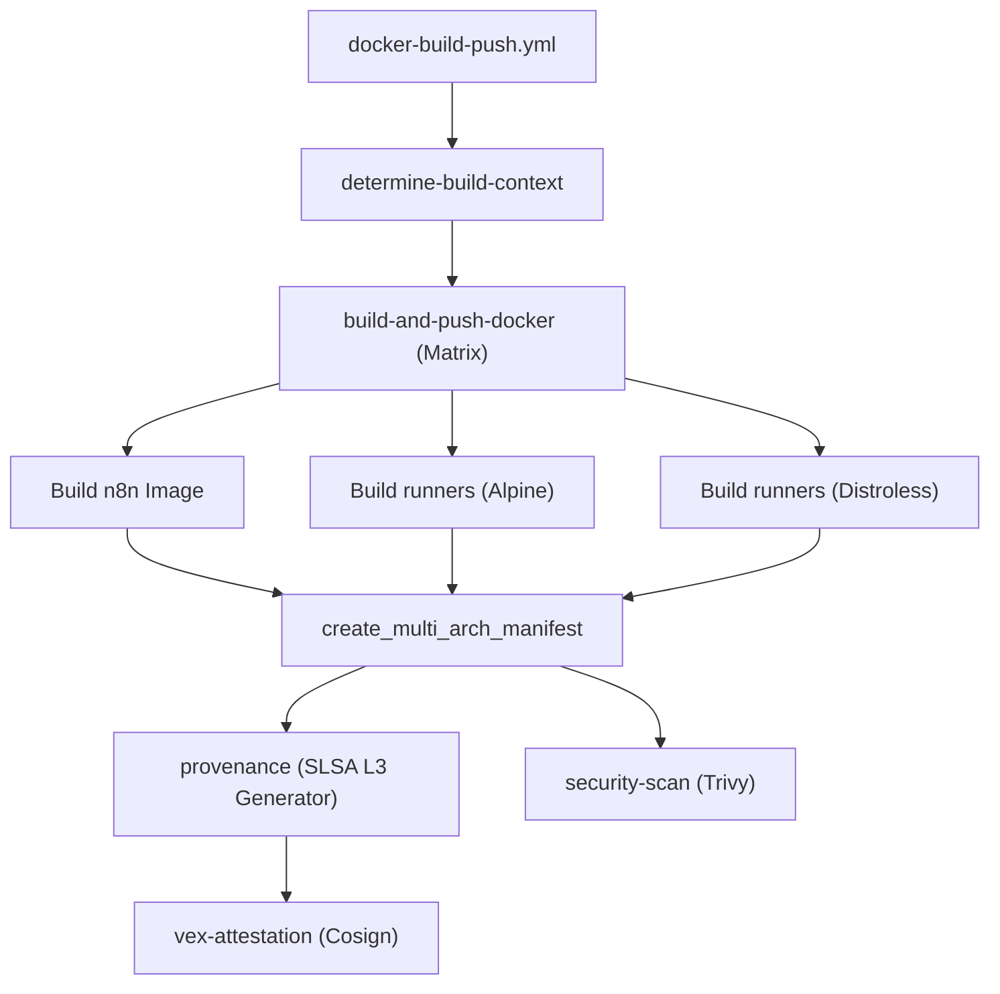
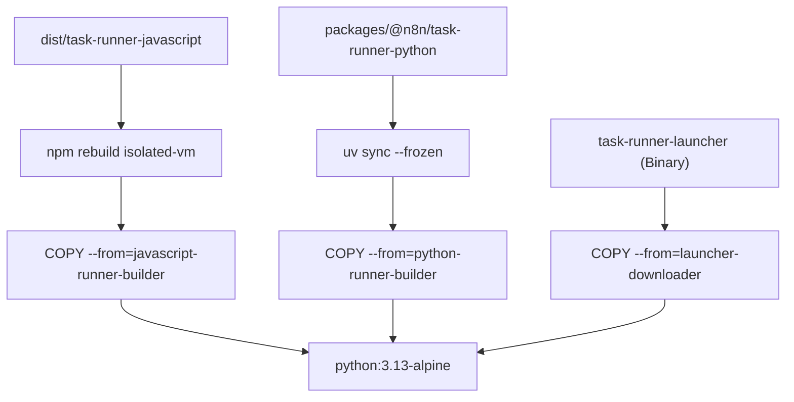

# Docker 镜像流水线与安全证明

相关源文件

-   [.dockerignore](https://github.com/n8n-io/n8n/blob/88f170b9/.dockerignore)
-   [.github/docker-compose.yml](https://github.com/n8n-io/n8n/blob/88f170b9/.github/docker-compose.yml)
-   [.github/scripts/bump-versions.mjs](https://github.com/n8n-io/n8n/blob/88f170b9/.github/scripts/bump-versions.mjs)
-   [.github/scripts/compute-backport-targets.mjs](https://github.com/n8n-io/n8n/blob/88f170b9/.github/scripts/compute-backport-targets.mjs)
-   [.github/scripts/compute-backport-targets.test.mjs](https://github.com/n8n-io/n8n/blob/88f170b9/.github/scripts/compute-backport-targets.test.mjs)
-   [.github/scripts/create-github-release.mjs](https://github.com/n8n-io/n8n/blob/88f170b9/.github/scripts/create-github-release.mjs)
-   [.github/scripts/determine-release-candidate-branch-for-track.mjs](https://github.com/n8n-io/n8n/blob/88f170b9/.github/scripts/determine-release-candidate-branch-for-track.mjs)
-   [.github/scripts/determine-release-version-changes.mjs](https://github.com/n8n-io/n8n/blob/88f170b9/.github/scripts/determine-release-version-changes.mjs)
-   [.github/scripts/determine-release-version-changes.test.mjs](https://github.com/n8n-io/n8n/blob/88f170b9/.github/scripts/determine-release-version-changes.test.mjs)
-   [.github/scripts/determine-version-info.mjs](https://github.com/n8n-io/n8n/blob/88f170b9/.github/scripts/determine-version-info.mjs)
-   [.github/scripts/determine-version-info.test.mjs](https://github.com/n8n-io/n8n/blob/88f170b9/.github/scripts/determine-version-info.test.mjs)
-   [.github/scripts/docker/docker-config.mjs](https://github.com/n8n-io/n8n/blob/88f170b9/.github/scripts/docker/docker-config.mjs)
-   [.github/scripts/docker/docker-tags.mjs](https://github.com/n8n-io/n8n/blob/88f170b9/.github/scripts/docker/docker-tags.mjs)
-   [.github/scripts/ensure-release-candidate-branches.mjs](https://github.com/n8n-io/n8n/blob/88f170b9/.github/scripts/ensure-release-candidate-branches.mjs)
-   [.github/scripts/ensure-release-candidate-branches.test.mjs](https://github.com/n8n-io/n8n/blob/88f170b9/.github/scripts/ensure-release-candidate-branches.test.mjs)
-   [.github/scripts/fixtures/mock-github-event.json](https://github.com/n8n-io/n8n/blob/88f170b9/.github/scripts/fixtures/mock-github-event.json)
-   [.github/scripts/get-release-versions.mjs](https://github.com/n8n-io/n8n/blob/88f170b9/.github/scripts/get-release-versions.mjs)
-   [.github/scripts/github-helpers.mjs](https://github.com/n8n-io/n8n/blob/88f170b9/.github/scripts/github-helpers.mjs)
-   [.github/scripts/jsconfig.json](https://github.com/n8n-io/n8n/blob/88f170b9/.github/scripts/jsconfig.json)
-   [.github/scripts/move-track-tag.mjs](https://github.com/n8n-io/n8n/blob/88f170b9/.github/scripts/move-track-tag.mjs)
-   [.github/scripts/package.json](https://github.com/n8n-io/n8n/blob/88f170b9/.github/scripts/package.json)
-   [.github/scripts/plan-release.mjs](https://github.com/n8n-io/n8n/blob/88f170b9/.github/scripts/plan-release.mjs)
-   [.github/scripts/pnpm-lock.yaml](https://github.com/n8n-io/n8n/blob/88f170b9/.github/scripts/pnpm-lock.yaml)
-   [.github/scripts/populate-cloud-databases.mjs](https://github.com/n8n-io/n8n/blob/88f170b9/.github/scripts/populate-cloud-databases.mjs)
-   [.github/scripts/promote-github-release.mjs](https://github.com/n8n-io/n8n/blob/88f170b9/.github/scripts/promote-github-release.mjs)
-   [.github/scripts/send-version-release-notification.mjs](https://github.com/n8n-io/n8n/blob/88f170b9/.github/scripts/send-version-release-notification.mjs)
-   [.github/scripts/update-changelog.mjs](https://github.com/n8n-io/n8n/blob/88f170b9/.github/scripts/update-changelog.mjs)
-   [.github/workflows/backport.yml](https://github.com/n8n-io/n8n/blob/88f170b9/.github/workflows/backport.yml)
-   [.github/workflows/ci-master.yml](https://github.com/n8n-io/n8n/blob/88f170b9/.github/workflows/ci-master.yml)
-   [.github/workflows/ci-pull-requests.yml](https://github.com/n8n-io/n8n/blob/88f170b9/.github/workflows/ci-pull-requests.yml)
-   [.github/workflows/docker-build-push.yml](https://github.com/n8n-io/n8n/blob/88f170b9/.github/workflows/docker-build-push.yml)
-   [.github/workflows/release-create-github-releases.yml](https://github.com/n8n-io/n8n/blob/88f170b9/.github/workflows/release-create-github-releases.yml)
-   [.github/workflows/release-create-patch-pr.yml](https://github.com/n8n-io/n8n/blob/88f170b9/.github/workflows/release-create-patch-pr.yml)
-   [.github/workflows/release-create-pr.yml](https://github.com/n8n-io/n8n/blob/88f170b9/.github/workflows/release-create-pr.yml)
-   [.github/workflows/release-merge-tag-to-branch.yml](https://github.com/n8n-io/n8n/blob/88f170b9/.github/workflows/release-merge-tag-to-branch.yml)
-   [.github/workflows/release-populate-cloud-with-releases.yml](https://github.com/n8n-io/n8n/blob/88f170b9/.github/workflows/release-populate-cloud-with-releases.yml)
-   [.github/workflows/release-promote-github-release.yml](https://github.com/n8n-io/n8n/blob/88f170b9/.github/workflows/release-promote-github-release.yml)
-   [.github/workflows/release-publish-post-release.yml](https://github.com/n8n-io/n8n/blob/88f170b9/.github/workflows/release-publish-post-release.yml)
-   [.github/workflows/release-publish.yml](https://github.com/n8n-io/n8n/blob/88f170b9/.github/workflows/release-publish.yml)
-   [.github/workflows/release-push-to-channel.yml](https://github.com/n8n-io/n8n/blob/88f170b9/.github/workflows/release-push-to-channel.yml)
-   [.github/workflows/release-update-pointer-tag.yml](https://github.com/n8n-io/n8n/blob/88f170b9/.github/workflows/release-update-pointer-tag.yml)
-   [.github/workflows/release-version-release-notification.yml](https://github.com/n8n-io/n8n/blob/88f170b9/.github/workflows/release-version-release-notification.yml)
-   [.github/workflows/test-workflow-scripts-reusable.yml](https://github.com/n8n-io/n8n/blob/88f170b9/.github/workflows/test-workflow-scripts-reusable.yml)
-   [.github/workflows/util-cleanup-abandoned-release-branches.yml](https://github.com/n8n-io/n8n/blob/88f170b9/.github/workflows/util-cleanup-abandoned-release-branches.yml)
-   [.github/workflows/util-determine-current-version.yml](https://github.com/n8n-io/n8n/blob/88f170b9/.github/workflows/util-determine-current-version.yml)
-   [.github/workflows/util-ensure-release-candidate-branches.yml](https://github.com/n8n-io/n8n/blob/88f170b9/.github/workflows/util-ensure-release-candidate-branches.yml)
-   [.gitignore](https://github.com/n8n-io/n8n/blob/88f170b9/.gitignore)
-   [CONTRIBUTING.md](https://github.com/n8n-io/n8n/blob/88f170b9/CONTRIBUTING.md?plain=1)
-   [docker/images/n8n-base/Dockerfile](https://github.com/n8n-io/n8n/blob/88f170b9/docker/images/n8n-base/Dockerfile)
-   [docker/images/n8n/Dockerfile](https://github.com/n8n-io/n8n/blob/88f170b9/docker/images/n8n/Dockerfile)
-   [docker/images/runners/Dockerfile](https://github.com/n8n-io/n8n/blob/88f170b9/docker/images/runners/Dockerfile)
-   [docker/images/runners/Dockerfile.distroless](https://github.com/n8n-io/n8n/blob/88f170b9/docker/images/runners/Dockerfile.distroless)
-   [docker/images/runners/README.md](https://github.com/n8n-io/n8n/blob/88f170b9/docker/images/runners/README.md?plain=1)
-   [packages/@n8n/benchmark/Dockerfile](https://github.com/n8n-io/n8n/blob/88f170b9/packages/@n8n/benchmark/Dockerfile)
-   [scripts/build-n8n.mjs](https://github.com/n8n-io/n8n/blob/88f170b9/scripts/build-n8n.mjs)

## 目的与范围

本文档详细说明 n8n 的 Docker 镜像流水线，重点关注 `docker-build-push.yml` 工作流、多架构构建策略，以及包括 SLSA L3 溯源证明、VEX 证明和 Trivy 扫描在内的安全基础设施。它还涵盖了任务运行器和基准测试工具的专用 Docker 配置。

有关通用发布编排，请参阅 [9.3 发布流水线](https://github.com/n8n-io/n8n/blob/88f170b9/9.3 Release Pipeline)。有关初始工件准备，请参阅 [9.1 构建系统](https://github.com/n8n-io/n8n/blob/88f170b9/9.1 Build System)。

## Docker 镜像架构

n8n 提供了多个专用 Docker 镜像，以支持主应用及其隔离执行环境。

| 镜像 | 源路径 | 用途 | 基础镜像 |
| --- | --- | --- | --- |
| **n8n** | [docker/images/n8n/Dockerfile1-39](https://github.com/n8n-io/n8n/blob/88f170b9/docker/images/n8n/Dockerfile#L1-L39) | 主应用（CLI、Server、Worker） | `n8nio/base` |
| **runners** | [docker/images/runners/Dockerfile1-163](https://github.com/n8n-io/n8n/blob/88f170b9/docker/images/runners/Dockerfile#L1-L163) | 用于 JS/Python 执行的边车（Alpine） | `python:3.13-alpine` |
| **runners-distroless** | [docker/images/runners/Dockerfile.distroless1-196](https://github.com/n8n-io/n8n/blob/88f170b9/docker/images/runners/Dockerfile.distroless#L1-L196) | 加固的边车（无 shell/包管理器） | `gcr.io/distroless/cc-debian12` |
| **base** | [docker/images/n8n-base/Dockerfile1-36](https://github.com/n8n-io/n8n/blob/88f170b9/docker/images/n8n-base/Dockerfile#L1-L36) | 共享的操作系统依赖和字体 | `node:alpine` |
| **benchmark** | [packages/@n8n/benchmark/Dockerfile1-15](https://github.com/n8n-io/n8n/blob/88f170b9/packages/@n8n/benchmark/Dockerfile#L1-L15) | 性能测试工具 | `node:alpine` |

**来源：** [docker/images/n8n/Dockerfile1-39](https://github.com/n8n-io/n8n/blob/88f170b9/docker/images/n8n/Dockerfile#L1-L39) [docker/images/runners/Dockerfile1-163](https://github.com/n8n-io/n8n/blob/88f170b9/docker/images/runners/Dockerfile#L1-L163) [docker/images/runners/Dockerfile.distroless1-196](https://github.com/n8n-io/n8n/blob/88f170b9/docker/images/runners/Dockerfile.distroless#L1-L196) [docker/images/n8n-base/Dockerfile1-36](https://github.com/n8n-io/n8n/blob/88f170b9/docker/images/n8n-base/Dockerfile#L1-L36) [packages/@n8n/benchmark/Dockerfile1-15](https://github.com/n8n-io/n8n/blob/88f170b9/packages/@n8n/benchmark/Dockerfile#L1-L15)

## 构建编排与流水线流程

主要编排发生在 [.github/workflows/docker-build-push.yml](https://github.com/n8n-io/n8n/blob/88f170b9/.github/workflows/docker-build-push.yml) 中。该工作流负责将源代码转换为已签名的多架构 manifest。

### 构建上下文确定

`determine-build-context` 作业会执行 [.github/scripts/docker/docker-config.mjs](https://github.com/n8n-io/n8n/blob/88f170b9/.github/scripts/docker/docker-config.mjs)，根据 GitHub 事件计算 `build_matrix` 和 `push_enabled` 标志。

**代码实体映射：触发器到矩阵**

**来源：** [.github/workflows/docker-build-push.yml46-69](https://github.com/n8n-io/n8n/blob/88f170b9/.github/workflows/docker-build-push.yml#L46-L69) [.github/scripts/docker/docker-config.mjs1-178](https://github.com/n8n-io/n8n/blob/88f170b9/.github/scripts/docker/docker-config.mjs#L1-L178)

### 流水线执行图

该流水线遵循严格的构建、manifest 创建以及构建后安全证明顺序。

**来源：** [.github/workflows/docker-build-push.yml70-300](https://github.com/n8n-io/n8n/blob/88f170b9/.github/workflows/docker-build-push.yml#L70-L300)

## 多架构策略

n8n 使用 Blacksmith 提供的原生运行器，以避免 QEMU 模拟带来的性能开销。

1.  **原生编译**：`build-and-push-docker` 作业在按架构划分的运行器上执行（[.github/workflows/docker-build-push.yml73](https://github.com/n8n-io/n8n/blob/88f170b9/.github/workflows/docker-build-push.yml#L73-L73)）。
2.  **平台标签**：镜像会先以平台后缀推送（例如 `:1.2.3-amd64`、`:1.2.3-arm64`），并使用 [.github/scripts/docker/docker-tags.mjs](https://github.com/n8n-io/n8n/blob/88f170b9/.github/scripts/docker/docker-tags.mjs)
3.  **Manifest 工具**：`create_multi_arch_manifest` 作业使用 `docker buildx imagetools create` 将这些镜像合并为单一多架构 manifest（[.github/workflows/docker-build-push.yml185-200](https://github.com/n8n-io/n8n/blob/88f170b9/.github/workflows/docker-build-push.yml#L185-L200)）。

**来源：** [.github/workflows/docker-build-push.yml70-200](https://github.com/n8n-io/n8n/blob/88f170b9/.github/workflows/docker-build-push.yml#L70-L200) [.github/scripts/docker/docker-tags.mjs1-114](https://github.com/n8n-io/n8n/blob/88f170b9/.github/scripts/docker/docker-tags.mjs#L1-L114)

## 安全证明与溯源

n8n 采用先进的供应链安全措施来确保镜像完整性。

### SLSA L3 溯源证明

溯源证明由 `slsa-framework/slsa-github-generator` 生成。它提供了一种不可伪造的证明，表明该镜像是从 GitHub Actions 上的特定提交构建而来。

-   **在 Docker 构建中禁用**：在 `build-push-action` 中设置 `provenance: false`（[.github/workflows/docker-build-push.yml131](https://github.com/n8n-io/n8n/blob/88f170b9/.github/workflows/docker-build-push.yml#L131-L131)），以便由专门的 SLSA 生成器在 `provenance` 作业中处理它（[.github/workflows/docker-build-push.yml302-330](https://github.com/n8n-io/n8n/blob/88f170b9/.github/workflows/docker-build-push.yml#L302-L330)）。

### VEX（Vulnerability Exploitability eXchange）

在附加溯源证明之后，流水线会生成 VEX 证明。这使 n8n 能够以程序化方式表明扫描器识别出的某些漏洞在 n8n 场景中不可利用。

-   **实现**：使用 `cosign attest --type openvex`（[.github/workflows/docker-build-push.yml396-410](https://github.com/n8n-io/n8n/blob/88f170b9/.github/workflows/docker-build-push.yml#L396-L410)）。

### 安全扫描（Trivy）

所有生产通道镜像（stable、rc、nightly）都会通过 `security-scan` 作业进行扫描。

-   **目标**：扫描多架构 manifest，以确保覆盖所有平台。
-   **报告**：结果会以 SARIF 文件上传到 GitHub Security Alerts（[.github/workflows/docker-build-push.yml257-281](https://github.com/n8n-io/n8n/blob/88f170b9/.github/workflows/docker-build-push.yml#L257-L281)）。

**来源：** [.github/workflows/docker-build-push.yml131-410](https://github.com/n8n-io/n8n/blob/88f170b9/.github/workflows/docker-build-push.yml#L131-L410)

## 专用镜像：任务运行器

`runners` 镜像是一个复杂的多阶段构建，会同时封装 JavaScript 和 Python 执行环境。

### 构建阶段与数据流

### 配置：n8n-task-runners.json

`task-runner-launcher` 通过 [docker/images/runners/n8n-task-runners.json](https://github.com/n8n-io/n8n/blob/88f170b9/docker/images/runners/n8n-task-runners.json) 进行配置。它定义了每种运行器类型允许的命令行参数和环境变量（例如 Node.js 的 `--disallow-code-generation-from-strings`）。

**来源：** [docker/images/runners/Dockerfile1-163](https://github.com/n8n-io/n8n/blob/88f170b9/docker/images/runners/Dockerfile#L1-L163) [docker/images/runners/n8n-task-runners.json1-57](https://github.com/n8n-io/n8n/blob/88f170b9/docker/images/runners/n8n-task-runners.json#L1-L57)

## 发布通道晋升

镜像从版本化标签（例如 `1.2.3`）晋升到通道标签（例如 `latest`、`stable`、`beta`）的过程由 [.github/workflows/release-push-to-channel.yml](https://github.com/n8n-io/n8n/blob/88f170b9/.github/workflows/release-push-to-channel.yml) 负责。

-   **逻辑**：使用 `docker buildx imagetools create` 将通道标签指向现有的版本化 manifest，而无需重新构建镜像（[.github/workflows/release-push-to-channel.yml116-128](https://github.com/n8n-io/n8n/blob/88f170b9/.github/workflows/release-push-to-channel.yml#L116-L128)）。
-   **安全性**：阻止将 RC 版本晋升到 `stable` 或 `beta` 通道（[.github/workflows/release-push-to-channel.yml61-64](https://github.com/n8n-io/n8n/blob/88f170b9/.github/workflows/release-push-to-channel.yml#L61-L64)）。

**来源：** [.github/workflows/release-push-to-channel.yml1-147](https://github.com/n8n-io/n8n/blob/88f170b9/.github/workflows/release-push-to-channel.yml#L1-L147)
