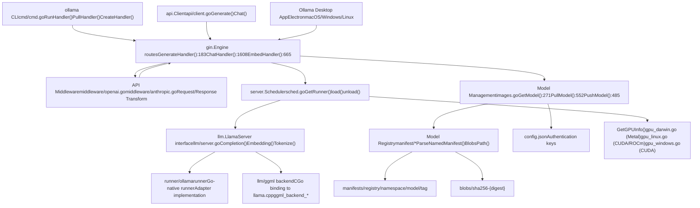
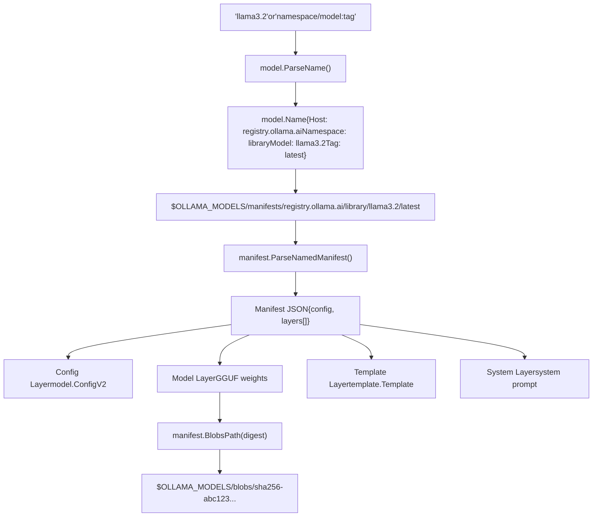

# 概述

相关源文件

-   [README.md](https://github.com/ollama/ollama/blob/562c76d7/README.md?plain=1)
-   [api/client.go](https://github.com/ollama/ollama/blob/562c76d7/api/client.go)
-   [api/client\_test.go](https://github.com/ollama/ollama/blob/562c76d7/api/client_test.go)
-   [api/types.go](https://github.com/ollama/ollama/blob/562c76d7/api/types.go)
-   [cmd/cmd.go](https://github.com/ollama/ollama/blob/562c76d7/cmd/cmd.go)
-   [docs/README.md](https://github.com/ollama/ollama/blob/562c76d7/docs/README.md?plain=1)
-   [docs/api.md](https://github.com/ollama/ollama/blob/562c76d7/docs/api.md?plain=1)
-   [docs/development.md](https://github.com/ollama/ollama/blob/562c76d7/docs/development.md?plain=1)
-   [docs/images/ollama-keys.png](https://github.com/ollama/ollama/blob/562c76d7/docs/images/ollama-keys.png)
-   [docs/images/signup.png](https://github.com/ollama/ollama/blob/562c76d7/docs/images/signup.png)
-   [server/images.go](https://github.com/ollama/ollama/blob/562c76d7/server/images.go)
-   [server/routes.go](https://github.com/ollama/ollama/blob/562c76d7/server/routes.go)

## 目的与范围

本页提供 Ollama 架构、核心组件及其交互方式的高层概览。它从面向用户的接口一直到模型执行、存储和硬件抽象，对系统进行介绍。

有关特定子系统的详细信息：

-   命令行界面与使用模式，见 [命令行界面](/ollama/ollama/1.3-command-line-interface)
-   API 端点规范，见 [API 参考](/ollama/ollama/3-api-reference)
-   包括 Modelfile 和层存储的模型管理，见 [模型管理](/ollama/ollama/4-model-management)
-   推理执行与 GPU 分配，见 [推理引擎](/ollama/ollama/5-inference-engine)
-   硬件支持与安装，见 [GPU 与硬件支持](/ollama/ollama/6-gpu-and-hardware-support)
-   从源码构建，见 [开发指南](/ollama/ollama/8-development-guide)

## 什么是 Ollama？

Ollama 是一个可在消费级硬件上本地运行大语言模型的系统。该项目的标语是 “Get up and running with large language models.”

**核心能力**：

-   **模型管理**：从注册表拉取模型，从 Modelfile 创建自定义模型，将模型推送以与他人共享
-   **推理执行**：生成文本补全，维护聊天会话，创建嵌入并生成图像
-   **硬件加速**：自动检测并使用可用 GPU（NVIDIA CUDA、AMD ROCm、Apple Metal、Vulkan）
-   **API 兼容性**：在 `/api/*` 端点提供原生 REST API，并在 `/v1/*` 端点提供 OpenAI 兼容 API
-   **并发执行**：通过自动内存管理同时运行多个模型

**架构模式**：Ollama 采用客户端-服务器模型，其中 `ollama serve` 运行 HTTP 服务器，而 `ollama` CLI（或其他 HTTP 客户端）通过 REST API 与其通信。

**安装**：提供 macOS、Windows 和 Linux 的原生安装包，也提供 Docker 容器。官方 Docker 镜像 `ollama/ollama` 支持多种 GPU 后端（CPU、CUDA、ROCm、Vulkan）。位于 `https://ollama.com/install.sh`（Unix）和 `https://ollama.com/install.ps1`（Windows）的安装脚本可自动完成设置。详见 [安装与设置](/ollama/ollama/6.2-installation-and-setup)。

**来源**： [README.md1-40](https://github.com/ollama/ollama/blob/562c76d7/README.md?plain=1#L1-L40) [README.md142-144](https://github.com/ollama/ollama/blob/562c76d7/README.md?plain=1#L142-L144) [docs/api.md1-20](https://github.com/ollama/ollama/blob/562c76d7/docs/api.md?plain=1#L1-L20)

## 核心系统组件

**系统架构图**


**按层划分的核心组件**：

| 层 | 组件 | 文件位置 | 关键函数 |
| --- | --- | --- | --- |
| CLI | 命令处理器 | [cmd/cmd.go500-716](https://github.com/ollama/ollama/blob/562c76d7/cmd/cmd.go#L500-L716) | `RunHandler()`, `CreateHandler()`, `PullHandler()`, `PushHandler()` |
| CLI | 客户端库 | [api/client.go38-41](https://github.com/ollama/ollama/blob/562c76d7/api/client.go#L38-L41) | `Generate()`, `Chat()`, `Pull()`, `Push()` |
| API 服务器 | HTTP 路由 | [server/routes.go183-1658](https://github.com/ollama/ollama/blob/562c76d7/server/routes.go#L183-L1658) | `GenerateHandler()`, `ChatHandler()`, `EmbedHandler()` |
| API 服务器 | 中间件 | [middleware/openai.go](https://github.com/ollama/ollama/blob/562c76d7/middleware/openai.go) [middleware/anthropic.go](https://github.com/ollama/ollama/blob/562c76d7/middleware/anthropic.go) | `FromChatRequest()`, `ToChatCompletion()` |
| 编排 | 调度器 | [server/sched.go](https://github.com/ollama/ollama/blob/562c76d7/server/sched.go) | `GetRunner()`, `load()`, `unload()` |
| 编排 | 模型管理 | [server/images.go271-368](https://github.com/ollama/ollama/blob/562c76d7/server/images.go#L271-L368) | `GetModel()`, `PullModel()`, `PushModel()` |
| 执行 | LlamaServer | [llm/server.go](https://github.com/ollama/ollama/blob/562c76d7/llm/server.go) | `Completion()`, `Embedding()`, `Tokenize()` |
| 执行 | Runners | [runner/ollamarunner](https://github.com/ollama/ollama/blob/562c76d7/runner/ollamarunner) | Go-native 模型执行 |
| 存储 | Manifests | [manifest/](https://github.com/ollama/ollama/blob/562c76d7/manifest/) | `ParseNamedManifest()`, `PathForName()` |
| 存储 | Blobs | [manifest/](https://github.com/ollama/ollama/blob/562c76d7/manifest/) | `BlobsPath()`，内容寻址存储 |
| 硬件 | GPU 发现 | [discover/gpu\_darwin.go](https://github.com/ollama/ollama/blob/562c76d7/discover/gpu_darwin.go) [discover/gpu\_linux.go](https://github.com/ollama/ollama/blob/562c76d7/discover/gpu_linux.go) | `GetGPUInfo()`，VRAM 计算 |

**来源**： [server/routes.go1-60](https://github.com/ollama/ollama/blob/562c76d7/server/routes.go#L1-L60) [cmd/cmd.go1-56](https://github.com/ollama/ollama/blob/562c76d7/cmd/cmd.go#L1-L56) [api/client.go1-42](https://github.com/ollama/ollama/blob/562c76d7/api/client.go#L1-L42) [server/images.go1-47](https://github.com/ollama/ollama/blob/562c76d7/server/images.go#L1-L47)

## 高层架构

### 请求在系统各层中的流转

**请求处理流程图**

> **[Mermaid sequence]**
> *(图表结构无法解析)*

**来源**： [server/routes.go183-663](https://github.com/ollama/ollama/blob/562c76d7/server/routes.go#L183-L663) [server/routes.go133-170](https://github.com/ollama/ollama/blob/562c76d7/server/routes.go#L133-L170) [cmd/cmd.go500-716](https://github.com/ollama/ollama/blob/562c76d7/cmd/cmd.go#L500-L716) [api/client.go273-282](https://github.com/ollama/ollama/blob/562c76d7/api/client.go#L273-L282)

### 模型存储与命名

Ollama 使用与容器注册表类似的内容寻址存储系统：

**模型存储结构图**


**关键函数**：

-   `model.ParseName()` 位于 [types/model/](https://github.com/ollama/ollama/blob/562c76d7/types/model/) - 将模型名称字符串解析为结构化 `model.Name`
-   `manifest.ParseNamedManifest()` 位于 [manifest/](https://github.com/ollama/ollama/blob/562c76d7/manifest/) - 按模型名称加载 manifest JSON
-   `manifest.BlobsPath(digest)` 位于 [manifest/](https://github.com/ollama/ollama/blob/562c76d7/manifest/) - 将 digest 解析为文件系统路径
-   `GetModel(name)` 位于 [server/images.go271](https://github.com/ollama/ollama/blob/562c76d7/server/images.go#L271-L271) - 由 manifest 和层构建 `Model` 结构体

**存储位置**（可通过 `OLLAMA_MODELS` 环境变量配置）：

-   **Manifests**：`$OLLAMA_MODELS/manifests/registry/namespace/model/tag`
-   **Blobs**：`$OLLAMA_MODELS/blobs/sha256-{digest}`

**来源**： [server/images.go57-72](https://github.com/ollama/ollama/blob/562c76d7/server/images.go#L57-L72) [server/images.go271-368](https://github.com/ollama/ollama/blob/562c76d7/server/images.go#L271-L368) [manifest/](https://github.com/ollama/ollama/blob/562c76d7/manifest/)

## API 体系

HTTP 服务器使用 Gin Web 框架，并暴露两类 API：

**原生 Ollama API**（`/api/*` 端点）：

-   `/api/generate` - 单轮文本补全
-   `/api/chat` - 多轮对话
-   `/api/embed` - 生成嵌入
-   `/api/pull` - 从注册表下载模型
-   `/api/push` - 将模型上传到注册表
-   `/api/create` - 从 Modelfile 创建模型
-   `/api/show` - 显示模型信息
-   `/api/tags` - 列出本地模型
-   `/api/ps` - 列出运行中的模型

**OpenAI 兼容 API**（`/v1/*` 端点）：

-   `/v1/chat/completions` - 聊天补全（中间件转换为 `/api/chat`）
-   `/v1/completions` - 文本补全（中间件转换为 `/api/generate`）
-   `/v1/embeddings` - 嵌入（中间件转换为 `/api/embed`）
-   `/v1/models` - 列出模型（映射到 `/api/tags`）

**Anthropic 兼容 API**（`/v1/messages` 端点）：

-   `/v1/messages` - Claude 兼容消息端点（中间件转换为 `/api/chat`）

位于 [middleware/openai.go](https://github.com/ollama/ollama/blob/562c76d7/middleware/openai.go) 和 [middleware/anthropic.go](https://github.com/ollama/ollama/blob/562c76d7/middleware/anthropic.go) 的中间件会将外部 API 请求转换为 Ollama 原生格式，并将响应转换回外部格式。

位于 [api/types.go](https://github.com/ollama/ollama/blob/562c76d7/api/types.go) 的**主要请求/响应类型**：

| 类型 | 字段 | 用途 |
| --- | --- | --- |
| `GenerateRequest` | `Model`, `Prompt`, `Images`, `Options`, `Stream` | 补全请求 |
| `GenerateResponse` | `Response`, `Done`, `Context`, `Metrics` | 流式补全响应 |
| `ChatRequest` | `Model`, `Messages`, `Tools`, `Options`, `Stream` | 聊天请求 |
| `ChatResponse` | `Message`, `Done`, `Metrics` | 流式聊天响应 |
| `Message` | `Role`, `Content`, `Images`, `ToolCalls` | 聊天消息 |

完整端点文档见 [API 参考](/ollama/ollama/3-api-reference)。

**来源**： [server/routes.go183-663](https://github.com/ollama/ollama/blob/562c76d7/server/routes.go#L183-L663) [api/types.go59-194](https://github.com/ollama/ollama/blob/562c76d7/api/types.go#L59-L194) [docs/api.md1-320](https://github.com/ollama/ollama/blob/562c76d7/docs/api.md?plain=1#L1-L320) [middleware/openai.go](https://github.com/ollama/ollama/blob/562c76d7/middleware/openai.go) [middleware/anthropic.go](https://github.com/ollama/ollama/blob/562c76d7/middleware/anthropic.go)

## 调度器与 Runner 管理

位于 [server/sched.go](https://github.com/ollama/ollama/blob/562c76d7/server/sched.go) 的调度器负责模型加载、卸载与内存分配。它维护已加载模型池并处理并发请求。

**Runner 生命周期状态机**

> **[Mermaid stateDiagram]**
> *(图表结构无法解析)*

**关键数据结构**：

```
// server/sched.gotype Scheduler struct {    loaded       map[string]*runnerRef    // Active runners by digest    pendingReqCh chan *runnerRequest      // Incoming requests    finishedReqCh chan *runnerRequest     // Completed requests    expiredCh    chan *runnerRef          // Expired runners} type runnerRef struct {    llama     llm.LlamaServer            // Inference interface    model     *Model                      // Model metadata    refCount  atomic.Int32                // Concurrent request count    loading   atomic.Bool                 // Loading state}
```
**关键函数**：

-   `GetRunner(ctx, model, opts, keepAlive)` - 返回已分配 runner 的通道
-   `load(req)` - 将模型加载到内存中，必要时可驱逐其他模型
-   `unload(digest)` - 从内存中卸载模型
-   `findRunnerToUnload()` - 驱逐策略：选择会话持续时间最长的空闲 runner

**来源**： [server/sched.go](https://github.com/ollama/ollama/blob/562c76d7/server/sched.go) [server/routes.go125-157](https://github.com/ollama/ollama/blob/562c76d7/server/routes.go#L125-L157)

### 内存管理

加载新模型时，调度器会计算所需 VRAM，并在必要时驱逐其他模型：

**驱逐过程**：

1.  使用 GPU 发现系统计算所需内存
2.  检查所有设备上的可用 VRAM
3.  如果不足，查找空闲 runner（`refCount == 0`）
4.  按 `sessionDuration` 排序候选项（优先驱逐运行时间最长者）
5.  将 runner 发送到 `expiredCh` 以执行卸载
6.  调用 `runner.llama.Close()` 释放 VRAM
7.  从 `loaded` 映射中移除

**环境配置**：

-   `OLLAMA_MAX_LOADED_MODELS` - 内存中保留的最大模型数（默认：1）
-   `OLLAMA_NUM_PARALLEL` - 每个模型的最大并发请求数（默认：1）
-   `OLLAMA_KEEP_ALIVE` - 卸载空闲模型前的默认时长（默认：5m）

**来源**： [server/sched.go](https://github.com/ollama/ollama/blob/562c76d7/server/sched.go) [discover/](https://github.com/ollama/ollama/blob/562c76d7/discover/) [envconfig/](https://github.com/ollama/ollama/blob/562c76d7/envconfig/)

## 模型能力

Ollama 会检测模型能力，以校验 API 请求并提供相应功能：

**能力类型**（定义于 [types/model/](https://github.com/ollama/ollama/blob/562c76d7/types/model/)）：

| 能力 | 检测方式 | 用途 |
| --- | --- | --- |
| `CapabilityCompletion` | 非嵌入模型时默认启用 | 文本生成 |
| `CapabilityEmbedding` | GGUF 元数据中的 `pooling_type` | 向量嵌入 |
| `CapabilityVision` | GGUF 中的 `vision.block_count` 或 projector 层 | 图像理解 |
| `CapabilityTools` | 模板中的 `tools` 变量 | 函数调用 |
| `CapabilityInsert` | 模板中的 `suffix` 变量 | 中间填充补全 |
| `CapabilityThinking` | 模板或配置中的 thinking 标记 | 推理模型 |
| `CapabilityImage` | 配置中的 capabilities 字段 | 图像生成 |

位于 [server/images.go74-141](https://github.com/ollama/ollama/blob/562c76d7/server/images.go#L74-L141) 的**能力检测**：

```
func (m *Model) Capabilities() []model.Capability {    // Check GGUF metadata for pooling_type (embeddings)    // Check GGUF metadata for vision.block_count    // Check template for tools/suffix variables    // Check template for thinking tags    // Return list of detected capabilities} func (m *Model) CheckCapabilities(want ...model.Capability) error {    // Validate model has required capabilities    // Return error if any missing}
```
**在请求处理器中的使用**：

```
// server/routes.gocaps := []model.Capability{model.CapabilityCompletion}runner, model, opts, err := s.scheduleRunner(ctx, name, caps, reqOpts, keepAlive)if errors.Is(err, errCapabilityCompletion) {    c.JSON(400, gin.H{"error": "model does not support generate"})}
```
**来源**： [server/images.go74-185](https://github.com/ollama/ollama/blob/562c76d7/server/images.go#L74-L185) [types/model/](https://github.com/ollama/ollama/blob/562c76d7/types/model/) [server/routes.go354-379](https://github.com/ollama/ollama/blob/562c76d7/server/routes.go#L354-L379)

## 模板系统

Ollama 使用 Go 模板根据各模型架构格式化提示词。模板决定了在发送给模型前，系统提示、消息、工具及其他输入如何被组织。

**模板变量**：

-   `.System` - 系统消息/提示词
-   `.Messages` - 对话历史（`[]api.Message`）
-   `.Tools` - 可用函数（`[]api.Tool`）
-   `.Prompt` - 单条提示词（用于 `/api/generate`）
-   `.Suffix` - 插入点后的文本（用于 FIM）
-   `.Think` - 是否启用 thinking（用于推理模型）

**模板解析顺序**（优先级从高到低）：

1.  请求覆盖（`req.Template` 字段）
2.  Manifest 层（模型中的模板 blob）
3.  `DefaultTemplate` 回退

位于 [template/](https://github.com/ollama/ollama/blob/562c76d7/template/) 的**关键函数**：

-   `Parse(s string) (*Template, error)` - 将模板字符串解析为 AST
-   `Execute(w io.Writer, v Values) error` - 使用变量渲染模板
-   `Contains(s string) bool` - 检查模板是否包含某字符串（用于能力检测）

聊天模型的模板示例：

```
{{- range .Messages }}
<|start_header_id|>{{ .Role }}<|end_header_id|>
{{ .Content }}<|eot_id|>
{{- end }}
<|start_header_id|>assistant<|end_header_id|>
```
详细文档见 [模板系统](/ollama/ollama/7.1-template-system)。

**来源**： [template/](https://github.com/ollama/ollama/blob/562c76d7/template/) [server/routes.go406-481](https://github.com/ollama/ollama/blob/562c76d7/server/routes.go#L406-L481)

## 关键数据类型

位于 [server/images.go57-72](https://github.com/ollama/ollama/blob/562c76d7/server/images.go#L57-L72) 的**模型表示**：

```
type Model struct {    Name           string              // Full model name    Config         model.ConfigV2      // Model configuration    ModelPath      string              // Path to GGUF weights file    AdapterPaths   []string            // LoRA adapter paths    ProjectorPaths []string            // Vision projector paths    System         string              // System prompt    Options        map[string]any      // Model parameters    Messages       []api.Message       // Pre-loaded conversation    Template       *template.Template  // Prompt template    Digest         string              // Manifest digest}
```
位于 [api/types.go](https://github.com/ollama/ollama/blob/562c76d7/api/types.go) 的**请求类型**：

```
type GenerateRequest struct {    Model    string    Prompt   string    Images   []ImageData      // For vision models    Options  map[string]any    Think    *ThinkValue      // For reasoning models    Stream   *bool} type ChatRequest struct {    Model    string    Messages []Message    Tools    []Tool           // For function calling    Options  map[string]any    Think    *ThinkValue    Stream   *bool} type Message struct {    Role      string    Content   string    Images    []ImageData    ToolCalls []ToolCall}
```
位于 [api/types.go](https://github.com/ollama/ollama/blob/562c76d7/api/types.go) 的**响应类型**：

```
type GenerateResponse struct {    Response   string        // Generated text    Thinking   string        // Reasoning (if Think enabled)    ToolCalls  []ToolCall    // Tool invocations    Done       bool    Context    []int         // Token context    Metrics    Metrics       // Performance metrics} type ChatResponse struct {    Message Message    Done    bool    Metrics Metrics}
```
**来源**： [server/images.go57-72](https://github.com/ollama/ollama/blob/562c76d7/server/images.go#L57-L72) [api/types.go59-221](https://github.com/ollama/ollama/blob/562c76d7/api/types.go#L59-L221)

## 系统初始化

**服务器启动流程**

> **[Mermaid sequence]**
> *(图表结构无法解析)*

**初始化步骤**：

1.  解析 `OLLAMA_HOST` 环境变量（默认：`127.0.0.1:11434`）
2.  调用 `discover.GetGPUInfo()` 枚举可用 GPU 并计算内存
3.  使用 GPU 信息创建 `Scheduler`
4.  使用 Gin 引擎创建 HTTP `Server`
5.  注册 API 路由（`/api/*`、`/v1/*`）
6.  启动 HTTP 监听器

**来源**： [cmd/cmd.go](https://github.com/ollama/ollama/blob/562c76d7/cmd/cmd.go) [server/routes.go87-109](https://github.com/ollama/ollama/blob/562c76d7/server/routes.go#L87-L109) [discover/](https://github.com/ollama/ollama/blob/562c76d7/discover/) [envconfig/](https://github.com/ollama/ollama/blob/562c76d7/envconfig/)

## 配置

关键环境变量（均定义于 [envconfig/](https://github.com/ollama/ollama/blob/562c76d7/envconfig/)）：

| 变量 | 默认值 | 用途 |
| --- | --- | --- |
| `OLLAMA_HOST` | `127.0.0.1:11434` | 服务器地址（客户端与服务器） |
| `OLLAMA_MODELS` | `~/.ollama/models` (Linux/macOS)
`%USERPROFILE%\.ollama\models` (Windows) | 模型存储位置 |
| `OLLAMA_KEEP_ALIVE` | `5m` | 模型保持加载的时长 |
| `OLLAMA_NUM_PARALLEL` | `1` | 每个模型的并发请求数 |
| `OLLAMA_MAX_LOADED_MODELS` | `1` | 内存中的最大模型数 |
| `OLLAMA_MAX_VRAM` | (auto-detected) | 每张 GPU 的 VRAM 上限 |
| `OLLAMA_NOPRUNE` | `false` | 禁用自动 blob 清理 |
| `OLLAMA_DEBUG` | `false` | 启用调试日志 |
| `OLLAMA_ORIGINS` | (none) | CORS 允许来源 |

**存储路径**：

-   **模型**：`$OLLAMA_MODELS`（manifests 和 blobs）
-   **日志**（Linux）：`/var/log/ollama.log`
-   **日志**（macOS）：`~/Library/Logs/Ollama/server.log`
-   **日志**（Windows）：`%LOCALAPPDATA%\Ollama\logs\server.log`

**来源**： [envconfig/](https://github.com/ollama/ollama/blob/562c76d7/envconfig/) [README.md](https://github.com/ollama/ollama/blob/562c76d7/README.md?plain=1)

## 总结

Ollama 的架构遵循清晰的关注点分离：

1.  **用户接口**（[cmd/cmd.go](https://github.com/ollama/ollama/blob/562c76d7/cmd/cmd.go) [api/client.go](https://github.com/ollama/ollama/blob/562c76d7/api/client.go)）- CLI 与编程式访问
2.  **HTTP API 层**（[server/routes.go](https://github.com/ollama/ollama/blob/562c76d7/server/routes.go)）- 基于 Gin 框架的 REST 端点
3.  **编排层**（[server/sched.go](https://github.com/ollama/ollama/blob/562c76d7/server/sched.go) [server/images.go](https://github.com/ollama/ollama/blob/562c76d7/server/images.go)）- 资源管理与模型生命周期
4.  **执行层**（[llm/server.go](https://github.com/ollama/ollama/blob/562c76d7/llm/server.go) [runner/](https://github.com/ollama/ollama/blob/562c76d7/runner/)）- 带硬件加速的模型推理
5.  **存储层**（[server/images.go438-728](https://github.com/ollama/ollama/blob/562c76d7/server/images.go#L438-L728)）- 内容寻址的 blobs 与 manifests

该系统重点关注：

-   **并发执行**：通过自动内存管理支持多个模型
-   **硬件灵活性**：支持多种 GPU 后端（CUDA、ROCm、Metal、Vulkan）
-   **存储效率**：通过内容寻址对共享模型层进行去重
-   **API 兼容性**：原生 REST API 加 OpenAI 兼容端点

如需深入了解特定子系统，请参阅本文开头的链接章节。

**来源**： [README.md1-262](https://github.com/ollama/ollama/blob/562c76d7/README.md?plain=1#L1-L262) [server/routes.go1-1606](https://github.com/ollama/ollama/blob/562c76d7/server/routes.go#L1-L1606) [cmd/cmd.go1-1806](https://github.com/ollama/ollama/blob/562c76d7/cmd/cmd.go#L1-L1806) [server/images.go1-1242](https://github.com/ollama/ollama/blob/562c76d7/server/images.go#L1-L1242)
