# 关键概念

相关源文件

-   [README.md](https://github.com/ollama/ollama/blob/562c76d7/README.md?plain=1)
-   [api/client.go](https://github.com/ollama/ollama/blob/562c76d7/api/client.go)
-   [api/client\_test.go](https://github.com/ollama/ollama/blob/562c76d7/api/client_test.go)
-   [api/types.go](https://github.com/ollama/ollama/blob/562c76d7/api/types.go)
-   [cmd/cmd.go](https://github.com/ollama/ollama/blob/562c76d7/cmd/cmd.go)
-   [docs/README.md](https://github.com/ollama/ollama/blob/562c76d7/docs/README.md?plain=1)
-   [docs/api.md](https://github.com/ollama/ollama/blob/562c76d7/docs/api.md?plain=1)
-   [docs/development.md](https://github.com/ollama/ollama/blob/562c76d7/docs/development.md?plain=1)
-   [docs/images/ollama-keys.png](https://github.com/ollama/ollama/blob/562c76d7/docs/images/ollama-keys.png)
-   [docs/images/signup.png](https://github.com/ollama/ollama/blob/562c76d7/docs/images/signup.png)
-   [envconfig/config.go](https://github.com/ollama/ollama/blob/562c76d7/envconfig/config.go)
-   [envconfig/config\_test.go](https://github.com/ollama/ollama/blob/562c76d7/envconfig/config_test.go)
-   [llm/server.go](https://github.com/ollama/ollama/blob/562c76d7/llm/server.go)
-   [server/images.go](https://github.com/ollama/ollama/blob/562c76d7/server/images.go)
-   [server/routes.go](https://github.com/ollama/ollama/blob/562c76d7/server/routes.go)
-   [server/sched.go](https://github.com/ollama/ollama/blob/562c76d7/server/sched.go)
-   [server/sched\_test.go](https://github.com/ollama/ollama/blob/562c76d7/server/sched_test.go)

本页介绍 Ollama 系统中使用的基础概念和术语。理解这些概念对于使用代码库至关重要，因为它们构成了模型管理、执行与存储的基础。

有关整体系统架构的信息，请参阅 [架构](/ollama/ollama/2-architecture)。有关 API 细节，请参阅 [API 参考](/ollama/ollama/3-api-reference)。有关模型文件格式与转换，请参阅 [模型管理](/ollama/ollama/4-model-management)。

---

## 模型与模型名称

在 Ollama 中，**模型**既指逻辑标识符（模型名），也指构成完整语言模型及其关联组件的层（blob）集合。

### 模型命名格式

Ollama 中的模型名称遵循由 `model.ParseName()` 解析的结构化格式：

```
[scheme://][host/][namespace/]model[:tag]
```
每个组成部分都有特定用途和默认值：

| 组件 | 必需 | 默认值 | 最大长度 | 说明 |
| --- | --- | --- | --- | --- |
| **scheme** | 否 | `https` | \- | 用于与注册表通信的协议方案 |
| **host** | 否 | `registry.ollama.ai` | 350 | 注册表主机（可包含端口，例如 `localhost:5000`） |
| **namespace** | 否 | `library` | 80 | 用户或组织命名空间 |
| **model** | 是 | \- | 80 | 模型名称标识符 |
| **tag** | 否 | `latest` | 80 | 版本或变体标签 |

`model.Name` 结构体用于存储这些解析后的组件：

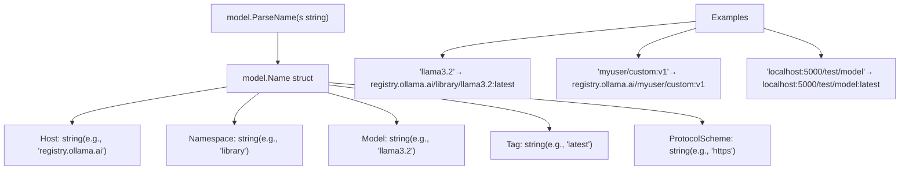
解析器先使用 `model.ParseNameBare()` 进行基础解析，然后与 `model.DefaultName()` 合并以补全缺失组件。名称不区分大小写，并以规范化形式存储。

**来源：** [types/model/name.go88-176](https://github.com/ollama/ollama/blob/562c76d7/types/model/name.go#L88-L176) [types/model/name.go38-59](https://github.com/ollama/ollama/blob/562c76d7/types/model/name.go#L38-L59) [types/model/name\_test.go15-141](https://github.com/ollama/ollama/blob/562c76d7/types/model/name_test.go#L15-L141)

### 标签

**标签（Tags）**用于标识模型的特定版本或变体。常见标签模式包括：

-   **版本标签**：`7b`、`13b`、`70b`（参数规模）
-   **量化标签**：`q4_0`、`q5_K_M`、`q8_0`（量化级别）
-   **变体标签**：`instruct`、`chat`、`code`（微调变体）
-   **组合标签**：`7b-instruct-q4_0`（多个属性）

标签使同一模型的多个变体能够共存。例如：

-   `llama3.2:3b` - 30 亿参数版本
-   `llama3.2:1b` - 10 亿参数版本
-   `llama3.2:latest` - 默认版本（通常是最新版本）

**来源：** [types/model/name.go126-130](https://github.com/ollama/ollama/blob/562c76d7/types/model/name.go#L126-L130) [README.md55-83](https://github.com/ollama/ollama/blob/562c76d7/README.md?plain=1#L55-L83)

### 模型组成

在 Ollama 中，一个模型由多个**层（layers）**组成，这些层以独立 blob 的形式存储。每一层都有特定的媒体类型，用于确定其用途。这些层定义在模型的 manifest 中。

#### 层类型

| 媒体类型 | 用途 | 存储格式 |
| --- | --- | --- |
| `application/vnd.ollama.image.model` | 模型权重与架构 | GGUF 文件 |
| `application/vnd.ollama.image.adapter` | LoRA 适配器（可选） | GGUF 文件 |
| `application/vnd.ollama.image.projector` | 视觉模型投影器（可选） | GGUF 文件 |
| `application/vnd.ollama.image.template` | 聊天提示模板 | 文本模板 |
| `application/vnd.ollama.image.system` | 系统提示词 | 纯文本 |
| `application/vnd.ollama.image.params` | 运行时参数 | JSON |
| `application/vnd.docker.container.image.v1+json` | 模型元数据 | ConfigV2 JSON |

#### 运行时模型表示

当模型被加载用于推理时，它会表示为一个运行时结构，其中包含对所有组件的引用：

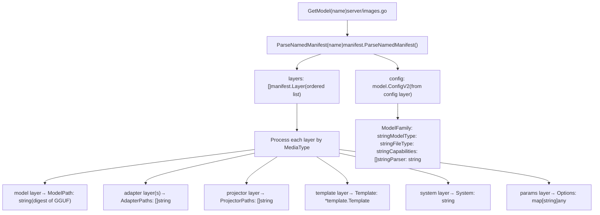
`model.ConfigV2` 结构体存储模型元数据：

| 字段 | 类型 | 说明 |
| --- | --- | --- |
| `ModelFormat` | `string` | 格式标识符（例如 “gguf”） |
| `ModelFamily` | `string` | 架构家族（例如 “llama”、“gemma”） |
| `ModelFamilies` | `[]string` | 所有兼容家族 |
| `ModelType` | `string` | 参数规模（例如 “7B”、“13B”） |
| `FileType` | `string` | 量化级别（例如 “Q4\_0”、“F16”） |
| `Capabilities` | `[]string` | 支持的操作（补全、视觉等） |
| `Parser` | `string` | 输出解析器（例如思考模型的 “harmony”） |
| `Renderer` | `string` | 自定义渲染器标识符 |

**来源：** [server/model.go23-77](https://github.com/ollama/ollama/blob/562c76d7/server/model.go#L23-L77) [types/model/config.go1-34](https://github.com/ollama/ollama/blob/562c76d7/types/model/config.go#L1-L34) [server/create.go46-243](https://github.com/ollama/ollama/blob/562c76d7/server/create.go#L46-L243)

---

## Manifest 与 Blob

Ollama 使用**内容寻址存储（content-addressed storage）**系统，将模型分解为称为 **blob** 的层。每个 blob 由其 SHA256 摘要标识，从而确保数据完整性和去重能力。

### Manifest 结构

**Manifest** 是一个 JSON 文件，用于描述如何由其组成 blob 重建模型。Manifest 遵循 Docker Image Manifest V2 格式：

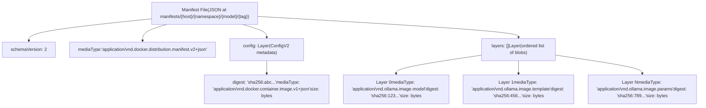
每个 `Layer` 条目包含：

-   `mediaType`：标识该层用途
-   `digest`：blob 内容的 SHA256 哈希（格式：`sha256:{hex}`）
-   `size`：blob 的字节大小

**来源：** [manifest package](https://github.com/ollama/ollama/blob/562c76d7/manifest package) [server/model.go28-77](https://github.com/ollama/ollama/blob/562c76d7/server/model.go#L28-L77)

### Blob 存储格式

所有 blob 都存储在 `$OLLAMA_MODELS/blobs/` 下，文件名编码其摘要：

```
blobs/sha256-{64-character-hex-digest}
```
摘要中的冒号（`:`）会替换为连字符（`-`）以生成合法文件名。例如：

-   摘要：`sha256:a1b2c3...`
-   文件名：`blobs/sha256-a1b2c3...`

#### 内容寻址存储的优势

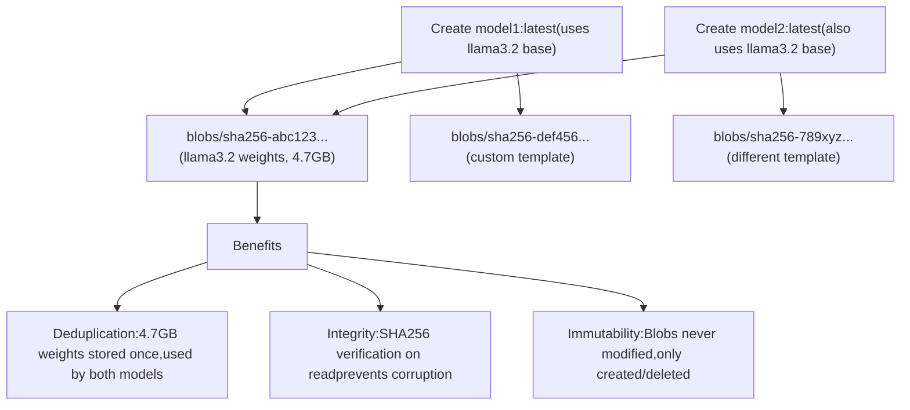
**来源：** [manifest package](https://github.com/ollama/ollama/blob/562c76d7/manifest package) [server/routes\_test.go79-84](https://github.com/ollama/ollama/blob/562c76d7/server/routes_test.go#L79-L84)

### Manifest 存储位置

Manifest 存储在分层目录结构中，该结构与模型名相对应：

```
$OLLAMA_MODELS/manifests/{host}/{namespace}/{model}/{tag}
```
例如：

-   `registry.ollama.ai/library/llama3.2:latest` → `manifests/registry.ollama.ai/library/llama3.2/latest`
-   `localhost:5000/myuser/custom:v1` → `manifests/localhost:5000/myuser/custom/v1`

`name.Filepath()` 方法会将 `model.Name` 转换为该路径格式。

**来源：** [types/model/name.go283-302](https://github.com/ollama/ollama/blob/562c76d7/types/model/name.go#L283-L302) [server/routes\_test.go35-84](https://github.com/ollama/ollama/blob/562c76d7/server/routes_test.go#L35-L84)

## Runners

**Runner** 是一种执行引擎，用于将模型加载到内存并执行推理操作。Runner 是高层 API 请求与底层模型计算之间的桥梁。

### LlamaServer 接口

所有 runner 都实现 `llm.LlamaServer` 接口，该接口定义了模型执行契约：

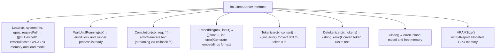
**来源：** [llm/server.go](https://github.com/ollama/ollama/blob/562c76d7/llm/server.go)

### Runner 生命周期

Runner 的生命周期由调度器管理：

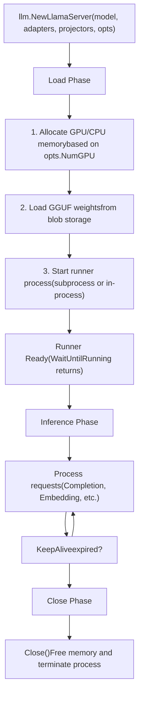
**来源：** [llm/server.go](https://github.com/ollama/ollama/blob/562c76d7/llm/server.go) [server/sched.go](https://github.com/ollama/ollama/blob/562c76d7/server/sched.go)

### Runner 实现

Ollama 支持两种 runner 实现，并会根据模型特征自动选择：

#### llamaServer（llama.cpp 后端）

使用 llama.cpp 绑定进行 CPU/GPU 推理的传统 runner：

| 组件 | 用途 |
| --- | --- |
| `llm.NewLlamaServer()` | 创建 runner 的工厂函数 |
| `llm.LoadModel()` | 从 GGUF 文件加载模型 |
| `llama.LoadModelFromFile()` | 对 llama.cpp 模型加载的 C 绑定 |
| `llama.NewContext()` | 创建带 KV 缓存的推理上下文 |

#### ollamaServer（新 Ollama 引擎）

当 `envconfig.NewEngine()` 为 true，或模型 GGML 元数据包含 `OllamaEngineRequired()` 时，使用该较新实现：

| 组件 | 用途 |
| --- | --- |
| `tokenizer.Tokenizer` | 用于文本编码/解码的原生分词器 |
| `model.NewTextProcessor()` | 从模型文件创建分词器 |

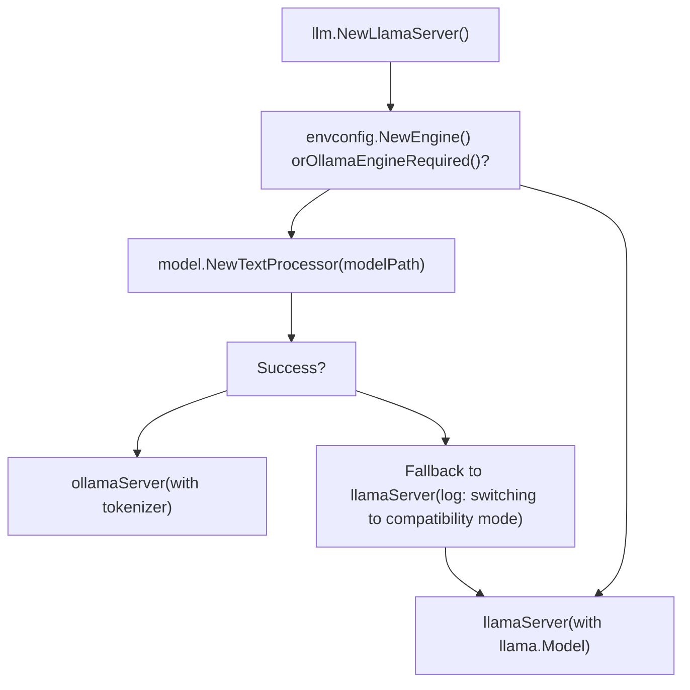
两类 runner 都负责：

-   在多个 GPU/CPU 间进行**内存分配**
-   进行高效提示评估的**批处理**
-   用于存储注意力键/值的 **KV 缓存**
-   带采样参数的**token 生成**

**来源：** [llm/server.go142-163](https://github.com/ollama/ollama/blob/562c76d7/llm/server.go#L142-L163) [llm/server.go110-120](https://github.com/ollama/ollama/blob/562c76d7/llm/server.go#L110-L120)

---

## 调度器

**调度器（Scheduler）**管理 runner 的生命周期并协调并发模型执行。它通过按需加载/卸载模型并结合可用资源，确保 GPU 内存利用率。

### 调度器数据结构

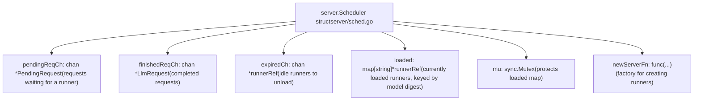
**来源：** [server/sched.go](https://github.com/ollama/ollama/blob/562c76d7/server/sched.go)

### 请求处理流程

当客户端发起请求时，它会经过调度器管线：

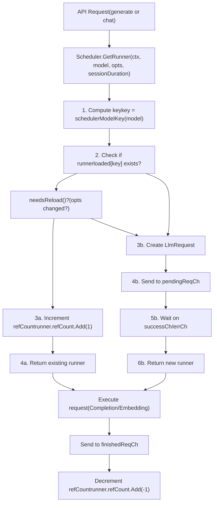
`schedulerModelKey()` 函数决定了模型在调度器中的索引方式：

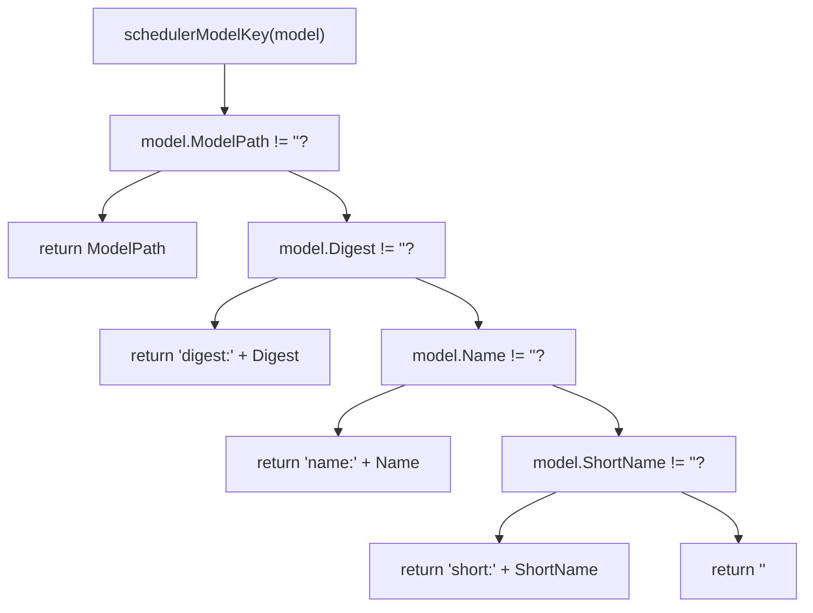
这使得 GGUF 支持模型（带 `ModelPath`）能够共享 runner，而没有 `ModelPath` 的 safetensors/image 模型会使用基于 digest 的键，以避免冲突。

**来源：** [server/sched.go107-141](https://github.com/ollama/ollama/blob/562c76d7/server/sched.go#L107-L141) [server/sched.go85-105](https://github.com/ollama/ollama/blob/562c76d7/server/sched.go#L85-L105)

### 后台处理循环

调度器运行一个后台 goroutine（`processPending()`）来处理待处理请求和 runner 生命周期：

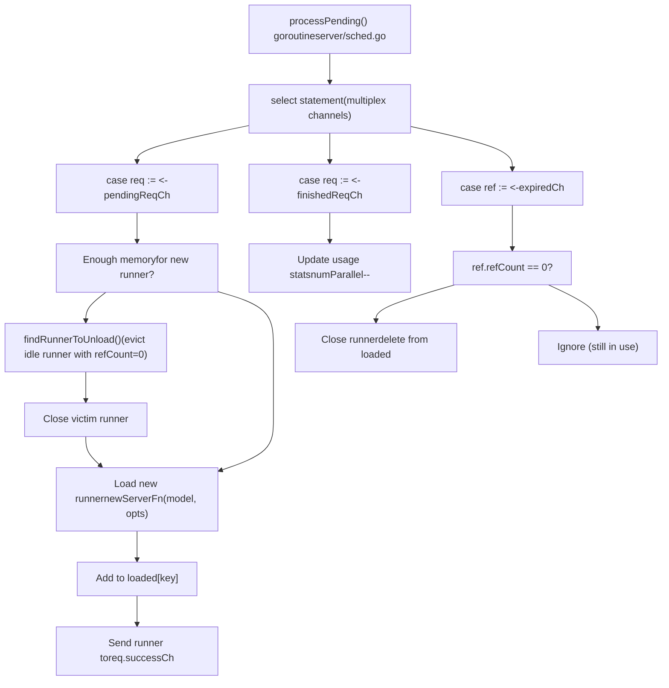
**来源：** [server/sched.go131-271](https://github.com/ollama/ollama/blob/562c76d7/server/sched.go#L131-L271)

### Runner 引用管理

每个已加载 runner 都被包装在 `runnerRef` 中，以跟踪其使用情况：

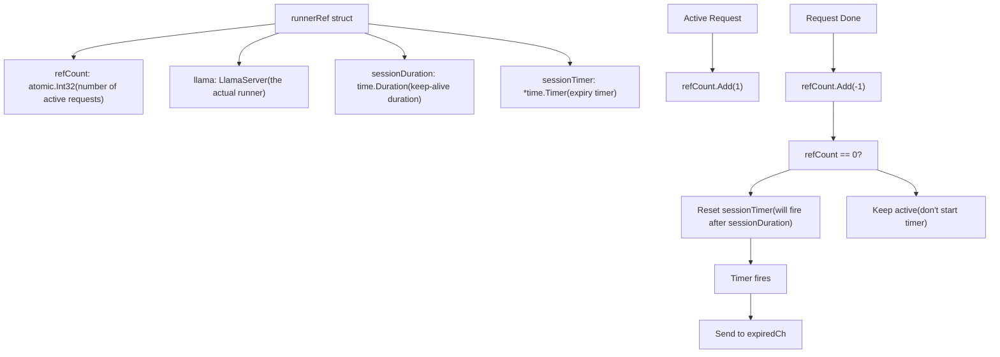
该引用计数机制确保：

-   runner 在处理请求期间不会被卸载
-   空闲 runner 最终会被回收以释放内存
-   多个并发请求可以共享同一个 runner

**来源：** [server/sched.go273-380](https://github.com/ollama/ollama/blob/562c76d7/server/sched.go#L273-L380)

---

## 能力（Capabilities）

**能力（Capabilities）**用于描述模型支持的操作。系统会通过检查模型文件和配置自动检测能力。

### 能力检测流程

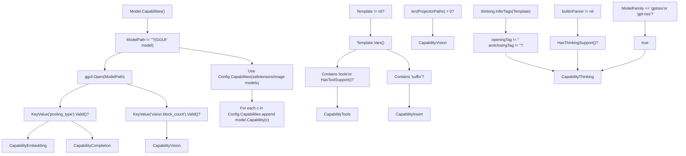
**来源：** [server/images.go78-145](https://github.com/ollama/ollama/blob/562c76d7/server/images.go#L78-L145)

### 能力枚举

| 能力 | 值 | 说明 | 检测方式 |
| --- | --- | --- | --- |
| `CapabilityCompletion` | `"completion"` | 文本生成 | GGUF 中无 pooling\_type 时默认 |
| `CapabilityEmbedding` | `"embedding"` | 向量嵌入 | GGUF 含有 pooling\_type 键 |
| `CapabilityVision` | `"vision"` | 图像理解 | GGUF 含有 vision.block\_count 或存在 ProjectorPaths |
| `CapabilityTools` | `"tools"` | 函数调用 | 模板含有 'tools' 变量或 parser.HasToolSupport() |
| `CapabilityInsert` | `"insert"` | 中间填充 | 模板含有 'suffix' 变量 |
| `CapabilityThinking` | `"thinking"` | 推理/思维链 | 含有 thinking 标签，或为 gpt-oss，或 parser.HasThinkingSupport() |
| `CapabilityImage` | `"image"` | 图像生成 | 在 Config.Capabilities 中 |

### 能力校验

在处理请求前，系统会使用 `CheckCapabilities()` 检查模型是否具备所需能力：

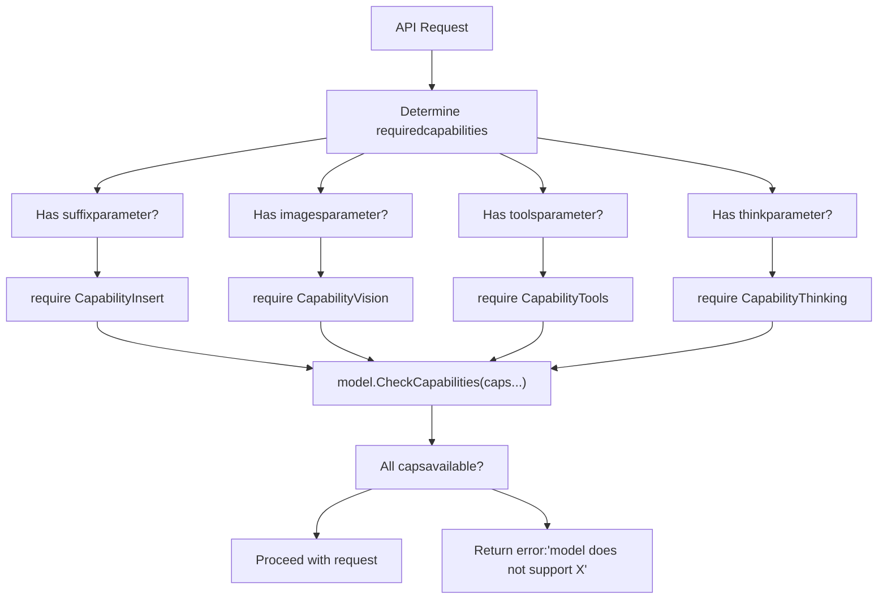
**来源：** [server/images.go147-189](https://github.com/ollama/ollama/blob/562c76d7/server/images.go#L147-L189) [server/routes.go373-390](https://github.com/ollama/ollama/blob/562c76d7/server/routes.go#L373-L390)

---

## 上下文与 KV 缓存

**上下文（context）**表示模型的工作内存，用于存储已处理 token 的键值缓存。上下文大小是影响模型行为的关键约束。

### 上下文管理

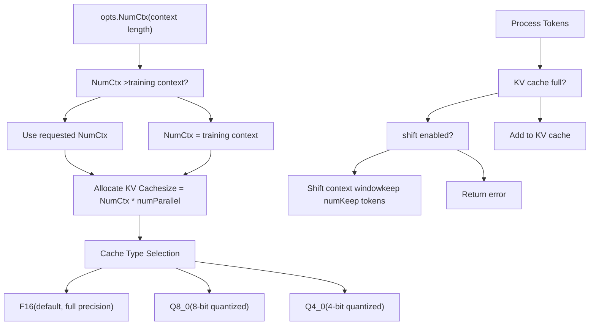
**来源：** [llm/server.go164-169](https://github.com/ollama/ollama/blob/562c76d7/llm/server.go#L164-L169) [llm/server.go211-258](https://github.com/ollama/ollama/blob/562c76d7/llm/server.go#L211-L258) [runner/ollamarunner/runner.go146-186](https://github.com/ollama/ollama/blob/562c76d7/runner/ollamarunner/runner.go#L146-L186)

### KV 缓存操作

KV 缓存支持若干内存管理操作：

| 操作 | 函数 | 用途 |
| --- | --- | --- |
| **Add** | `KvCacheSeqAdd(seqId, p0, p1, delta)` | 将位置向前/向后偏移 |
| **Remove** | `KvCacheSeqRm(seqId, p0, p1)` | 清除指定区间 token |
| **Copy** | `KvCacheSeqCp(srcSeqId, dstSeqId, p0, p1)` | 复制序列缓存 |
| **Clear** | `KvCacheClear()` | 重置整个缓存 |

**来源：** [llama/llama.go190-204](https://github.com/ollama/ollama/blob/562c76d7/llama/llama.go#L190-L204)

---

## 选项（Options）

**选项（Options）**控制运行时行为，例如温度、上下文大小和 GPU 分配。选项会从多个来源按既定优先级合并。

### 选项优先级

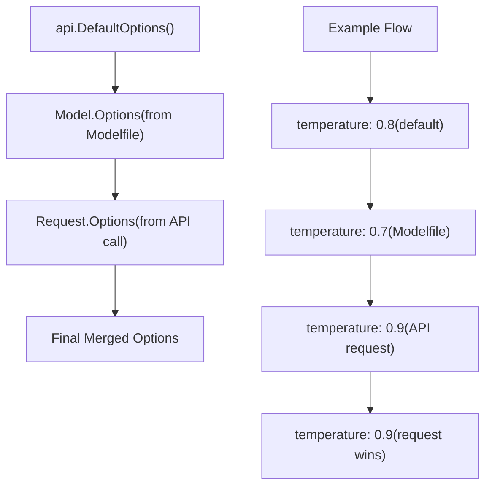
**来源：** [server/routes.go109-120](https://github.com/ollama/ollama/blob/562c76d7/server/routes.go#L109-L120) [api/types.go1147-1234](https://github.com/ollama/ollama/blob/562c76d7/api/types.go#L1147-L1234)

### 常用选项

| 选项 | 类型 | 默认值 | 说明 |
| --- | --- | --- | --- |
| `num_ctx` | `int` | 2048 | 上下文窗口大小 |
| `num_predict` | `int` | \-1 | 最大生成 token 数（-1 = 无限） |
| `temperature` | `float32` | 0.8 | 采样温度 |
| `top_k` | `int` | 40 | Top-k 采样 |
| `top_p` | `float32` | 0.9 | Nucleus 采样 |
| `num_gpu` | `int` | \-1 | GPU 层数（-1 = 自动） |
| `num_thread` | `int` | 0 | CPU 线程数（0 = 自动） |
| `num_batch` | `int` | 512 | 提示处理的批大小 |
| `repeat_penalty` | `float32` | 1.1 | 重复惩罚 |
| `think` | `ThinkValue` | nil | 为思考模型启用推理（true/false/"high"/"medium"/"low"） |

### 特殊请求选项

除了上述模型相关选项外，API 请求还支持若干特殊参数：

| 参数 | 类型 | 默认值 | 说明 |
| --- | --- | --- | --- |
| `stream` | `*bool` | true | 启用流式响应 |
| `keep_alive` | `*Duration` | 5m | 保持模型加载的时长 |
| `truncate` | `*bool` | true | 超出上下文时截断提示 |
| `shift` | `*bool` | true | 上下文满时平移窗口 |
| `logprobs` | `bool` | false | 返回对数概率 |
| `top_logprobs` | `int` | 0 | 返回 top logprobs 的数量（0-20） |

**来源：** [api/types.go1147-1234](https://github.com/ollama/ollama/blob/562c76d7/api/types.go#L1147-L1234) [api/types.go59-144](https://github.com/ollama/ollama/blob/562c76d7/api/types.go#L59-L144)

---

## 请求流概览

理解请求如何流经系统，有助于将所有关键概念串联起来：

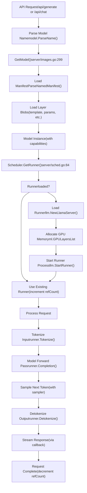
**来源：** [server/routes.go178-646](https://github.com/ollama/ollama/blob/562c76d7/server/routes.go#L178-L646) [server/sched.go84-117](https://github.com/ollama/ollama/blob/562c76d7/server/sched.go#L84-L117) [llm/server.go142-316](https://github.com/ollama/ollama/blob/562c76d7/llm/server.go#L142-L316)

---

## 总结

Ollama 中的关键概念构成了一个分层系统：

1.  **模型（Models）**通过名称标识，并由多个层组成
2.  **Manifest** 使用内容寻址 blob 存储对层进行索引
3.  **Runner** 通过 `LlamaServer` 接口执行模型
4.  **调度器**管理 runner 生命周期与 GPU 分配
5.  **能力（Capabilities）**决定模型支持哪些操作
6.  **上下文/KV 缓存**为推理提供工作内存
7.  **选项（Options）**通过分层合并控制运行时行为

这些概念协同工作，以自动资源管理方式提供高效并发的模型执行。理解这些概念是参与 Ollama 代码库任何部分工作的基础。

**来源：** [server/images.go](https://github.com/ollama/ollama/blob/562c76d7/server/images.go) [server/routes.go](https://github.com/ollama/ollama/blob/562c76d7/server/routes.go) [server/sched.go](https://github.com/ollama/ollama/blob/562c76d7/server/sched.go) [llm/server.go](https://github.com/ollama/ollama/blob/562c76d7/llm/server.go) [api/types.go](https://github.com/ollama/ollama/blob/562c76d7/api/types.go)
