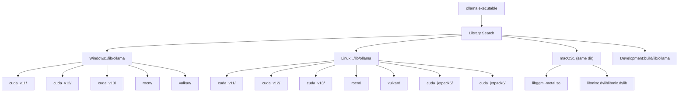

# 系统要求

相关源文件

-   [.github/workflows/release.yaml](https://github.com/ollama/ollama/blob/562c76d7/.github/workflows/release.yaml)
-   [.github/workflows/test-install.yaml](https://github.com/ollama/ollama/blob/562c76d7/.github/workflows/test-install.yaml)
-   [.github/workflows/test.yaml](https://github.com/ollama/ollama/blob/562c76d7/.github/workflows/test.yaml)
-   [Dockerfile](https://github.com/ollama/ollama/blob/562c76d7/Dockerfile)
-   [README.md](https://github.com/ollama/ollama/blob/562c76d7/README.md?plain=1)
-   [app/ollama.iss](https://github.com/ollama/ollama/blob/562c76d7/app/ollama.iss)
-   [docs/README.md](https://github.com/ollama/ollama/blob/562c76d7/docs/README.md?plain=1)
-   [docs/api.md](https://github.com/ollama/ollama/blob/562c76d7/docs/api.md?plain=1)
-   [docs/development.md](https://github.com/ollama/ollama/blob/562c76d7/docs/development.md?plain=1)
-   [docs/images/ollama-keys.png](https://github.com/ollama/ollama/blob/562c76d7/docs/images/ollama-keys.png)
-   [docs/images/signup.png](https://github.com/ollama/ollama/blob/562c76d7/docs/images/signup.png)
-   [scripts/build\_darwin.sh](https://github.com/ollama/ollama/blob/562c76d7/scripts/build_darwin.sh)
-   [scripts/build\_linux.sh](https://github.com/ollama/ollama/blob/562c76d7/scripts/build_linux.sh)
-   [scripts/build\_windows.ps1](https://github.com/ollama/ollama/blob/562c76d7/scripts/build_windows.ps1)
-   [scripts/deduplicate\_cuda\_libs.sh](https://github.com/ollama/ollama/blob/562c76d7/scripts/deduplicate_cuda_libs.sh)
-   [scripts/install.ps1](https://github.com/ollama/ollama/blob/562c76d7/scripts/install.ps1)
-   [scripts/install.sh](https://github.com/ollama/ollama/blob/562c76d7/scripts/install.sh)

本文档规定了运行和开发 Ollama 所需的硬件、操作系统和软件要求。内容涵盖受支持的平台、架构、GPU 后端，以及安装和运行所需的最低规格。

有关构建与编译要求，请参阅 [从源码构建](/ollama/ollama/8.1-building-from-source)。有关 GPU 设置与故障排查，请参阅 [GPU 发现与后端加载](/ollama/ollama/6.1-gpu-discovery-and-backend-loading) 和 [安装与设置](/ollama/ollama/6.2-installation-and-setup)。

## 支持的平台

Ollama 可运行于 macOS、Windows、Linux 和 Docker 环境。每个平台都有特定要求，并支持对应的 GPU 加速后端。

### 平台支持矩阵

```mermaid
flowchart TD
    Linux_amd64["amd64(x86_64)"]
    Linux_CUDA["NVIDIA CUDA11/12/13"]
    Linux_ROCm["AMD ROCm 6"]
    Linux_Vulkan["Vulkan"]
    Linux_arm64["arm64(aarch64)"]
    Linux_JetPack["NVIDIA JetPack5/6"]
    Win_amd64["amd64(x86_64)"]
    Win_CUDA["NVIDIA CUDA11/12/13"]
    Win_ROCm["AMD ROCm 6"]
    Win_Vulkan["Vulkan SDK"]
    Win_arm64["arm64(ARM64)"]
    macOS_arm64["arm64(Apple Silicon)"]
    macOS_Metal["Metal GPUBuilt-in"]
    macOS_amd64["amd64(Intel)"]

    Linux --> amd64_Linux_CUDA
    Linux --> amd64_Linux_ROCm
    Linux --> amd64_Linux_Vulkan
    Linux --> arm64_Linux_CUDA
    Linux --> arm64_Linux_JetPack
    Win --> amd64_Win_CUDA
    Win --> amd64_Win_ROCm
    Win --> amd64_Win_Vulkan
    macOS --> arm64_macOS_Metal
    macOS --> amd64_macOS_Metal
```


**来源：** [README.md13-39](https://github.com/ollama/ollama/blob/562c76d7/README.md?plain=1#L13-L39) [.github/workflows/release.yaml29-214](https://github.com/ollama/ollama/blob/562c76d7/.github/workflows/release.yaml#L29-L214) [Dockerfile13-37](https://github.com/ollama/ollama/blob/562c76d7/Dockerfile#L13-L37)

### 架构检测

安装脚本会检测系统架构，并映射为在构建与分发系统中统一使用的规范化标识。

| 系统输出 | 规范化值 | 用途 |
| --- | --- | --- |
| `x86_64` | `amd64` | 二进制分发 |
| `aarch64` | `arm64` | 二进制分发 |
| `arm64` | `arm64` | macOS 系统 |

**来源：** [scripts/install.sh35-40](https://github.com/ollama/ollama/blob/562c76d7/scripts/install.sh#L35-L40)

## 操作系统要求

### macOS

-   **最低版本：** macOS 14.0（Sonoma）
-   **支持架构：** arm64（Apple Silicon）、amd64（Intel）
-   **GPU 后端：** Metal（内置，无需额外驱动）
-   **运行时依赖：**
    -   `curl`
    -   `unzip`

macOS 构建使用 `CGO_LDFLAGS="-mmacosx-version-min=14.0"` 以确保与 macOS 14.0 及更高版本兼容。

**来源：** [scripts/build\_darwin.sh17-19](https://github.com/ollama/ollama/blob/562c76d7/scripts/build_darwin.sh#L17-L19) [scripts/install.sh48-93](https://github.com/ollama/ollama/blob/562c76d7/scripts/install.sh#L48-L93) [.github/workflows/release.yaml42-44](https://github.com/ollama/ollama/blob/562c76d7/.github/workflows/release.yaml#L42-L44)

### Windows

-   **最低版本：** Windows 10（build 10240 或更高）
-   **推荐：** Windows 10 22H2 或更新版本，以获得正确的 Unicode 渲染
-   **支持架构：** amd64、arm64
-   **运行时依赖：**
    -   Visual C++ Redistributables（自动安装）
    -   Git、gzip（用于 arm64 系统）

Windows arm64 当前仅支持 CPU 推理。GPU 加速（CUDA、ROCm、Vulkan）仅在 amd64 上可用。

**来源：** [app/ollama.iss58-65](https://github.com/ollama/ollama/blob/562c76d7/app/ollama.iss#L58-L65) [docs/development.md41-91](https://github.com/ollama/ollama/blob/562c76d7/docs/development.md?plain=1#L41-L91) [scripts/build\_windows.ps1295-301](https://github.com/ollama/ollama/blob/562c76d7/scripts/build_windows.ps1#L295-L301) [.github/workflows/release.yaml232-244](https://github.com/ollama/ollama/blob/562c76d7/.github/workflows/release.yaml#L232-L244)

### Linux

-   **支持的发行版：**
    -   Ubuntu/Debian
    -   RHEL/CentOS/Rocky/Fedora
    -   Arch Linux
    -   Amazon Linux
    -   任何基于 systemd 的发行版
-   **支持架构：** amd64、arm64
-   **基础要求：**
    -   GCC v10 或更高（推荐 v10.2.1，v10.3 存在回归问题）
    -   `curl`、`awk`、`grep`、`sed`、`tee`、`xargs`
    -   `zstd`（用于使用 `.tar.zst` 格式的版本）

**来源：** [scripts/install.sh99-127](https://github.com/ollama/ollama/blob/562c76d7/scripts/install.sh#L99-L127) [Dockerfile13-20](https://github.com/ollama/ollama/blob/562c76d7/Dockerfile#L13-L20)

### NVIDIA Jetson

对 NVIDIA Jetson 嵌入式系统提供特殊支持：

-   **JetPack 5：** 基于 CUDA 11（r35.4.1）
-   **JetPack 6：** 基于 CUDA 12（r36.4.0）
-   **架构：** 仅 arm64

检测方式：系统必须存在 `/etc/nv_tegra_release` 文件。

**来源：** [scripts/install.sh178-187](https://github.com/ollama/ollama/blob/562c76d7/scripts/install.sh#L178-L187) [Dockerfile104-126](https://github.com/ollama/ollama/blob/562c76d7/Dockerfile#L104-L126)

### WSL2

支持 Windows Subsystem for Linux 2：

-   **检测：** 内核名称包含 `microsoft*WSL2` 或 `microsoft*wsl2`
-   **GPU 支持：** 仅通过可用 `nvidia-smi` 的 NVIDIA 透传
-   **不支持 WSL1：** 脚本会在 WSL1 下报错退出

**来源：** [scripts/install.sh101-108](https://github.com/ollama/ollama/blob/562c76d7/scripts/install.sh#L101-L108) [scripts/install.sh254-262](https://github.com/ollama/ollama/blob/562c76d7/scripts/install.sh#L254-L262)

## GPU 要求

### GPU 后端分发


**来源：** [Dockerfile44-134](https://github.com/ollama/ollama/blob/562c76d7/Dockerfile#L44-L134) [.github/workflows/release.yaml55-135](https://github.com/ollama/ollama/blob/562c76d7/.github/workflows/release.yaml#L55-L135)

### NVIDIA CUDA

**支持版本：**

-   CUDA 11.8（旧版，兼容老 GPU）
-   CUDA 12.8（当前稳定版）
-   CUDA 13.0（最新）

**组件要求：**

-   `cudart`（CUDA Runtime）
-   `nvcc`（CUDA Compiler）
-   `cublas`（CUDA Basic Linear Algebra）
-   `cublas_dev`（cuBLAS Development）
-   对于 CUDA 13：`crt`、`nvvm`、`nvptxcompiler`

**架构支持：**

-   Compute Capability：最低要求取决于 CUDA 版本
-   测试配置使用 compute capability 80-87

**安装路径：**

-   Windows：`C:\Program Files\NVIDIA GPU Computing Toolkit\CUDA\v{major}`
-   Linux：`/usr/local/cuda-{major}`

**检测方法：** 安装脚本通过以下方式检测 NVIDIA GPU：

1.  检查 `nvidia-smi` 是否可用
2.  使用 `lspci -d '10de:'`（PCI vendor ID 10de = NVIDIA）
3.  使用 `lshw -c display -numeric -disable network` 查找厂商 `[10DE]`

**来源：** [.github/workflows/release.yaml80-106](https://github.com/ollama/ollama/blob/562c76d7/.github/workflows/release.yaml#L80-L106) [Dockerfile55-90](https://github.com/ollama/ollama/blob/562c76d7/Dockerfile#L55-L90) [scripts/install.sh277-353](https://github.com/ollama/ollama/blob/562c76d7/scripts/install.sh#L277-L353)

### AMD ROCm

**支持版本：** ROCm 6.3.3

**平台支持：**

-   Linux：仅 amd64
-   Windows：仅 amd64

**组件要求：**

-   `rocm-libs`（Linux 上）
-   HIP 编译工具链
-   ROCBLAS 库

**架构过滤：** 构建过程会从 ROCBLAS 库中移除 `gfx906*` 架构，以减小分发体积。

**安装路径：**

-   Windows：`C:\Program Files\AMD\ROCm\{version}`
-   Linux：`/opt/rocm`

**环境变量：**

-   `HIP_PLATFORM=amd`
-   指向 ROCm 安装路径的 `CMAKE_PREFIX_PATH`
-   指向 clang++ 的 `HIPCXX`

**检测方法：** 安装脚本通过以下方式检测 AMD GPU：

1.  使用 `lspci -d '1002:'`（PCI vendor ID 1002 = AMD）
2.  使用 `lshw -c display -numeric -disable network` 查找厂商 `[1002]`

**来源：** [Dockerfile93-102](https://github.com/ollama/ollama/blob/562c76d7/Dockerfile#L93-L102) [.github/workflows/release.yaml109-113](https://github.com/ollama/ollama/blob/562c76d7/.github/workflows/release.yaml#L109-L113) [scripts/install.sh305-310](https://github.com/ollama/ollama/blob/562c76d7/scripts/install.sh#L305-L310) [scripts/build\_windows.ps1184-215](https://github.com/ollama/ollama/blob/562c76d7/scripts/build_windows.ps1#L184-L215)

### Apple Metal

**平台：** 仅 macOS（Apple Silicon 与 Intel 均支持）

**要求：**

-   macOS 14.0+ 内置
-   无需额外驱动或 SDK
-   使用 Accelerate 框架

**组件标志：**

```
CGO_LDFLAGS: -lc++ -framework Metal -framework Foundation -framework Accelerate
```
**来源：** [scripts/build\_darwin.sh17-19](https://github.com/ollama/ollama/blob/562c76d7/scripts/build_darwin.sh#L17-L19) [scripts/build\_darwin.sh62-75](https://github.com/ollama/ollama/blob/562c76d7/scripts/build_darwin.sh#L62-L75)

### Vulkan

**支持版本：** 1.4.321.1

**平台支持：**

-   Linux：amd64
-   Windows：amd64

**使用场景：**

-   AMD/Intel GPU 的回退方案
-   无 CUDA 或 ROCm 的系统

**组件要求：**

-   Vulkan SDK 头文件
-   Vulkan loader 库
-   Shaderc 编译器

**安装方式：**

-   Linux：通过包管理器（`vulkan-sdk`）或 LunarG SDK
-   Windows：LunarG SDK 安装器

**环境变量：**

-   `VULKAN_SDK` 必须指向 SDK 安装路径

**来源：** [Dockerfile21-30](https://github.com/ollama/ollama/blob/562c76d7/Dockerfile#L21-L30) [docs/development.md52-103](https://github.com/ollama/ollama/blob/562c76d7/docs/development.md?plain=1#L52-L103) [.github/workflows/release.yaml115-119](https://github.com/ollama/ollama/blob/562c76d7/.github/workflows/release.yaml#L115-L119)

## 硬件要求

### CPU 要求

**最低要求：**

-   64 位处理器（x86\_64 或 ARM64）
-   无特定 CPU 代际要求

**编译器要求（开发）：**

-   GCC 10.2.1 或更高（10.3 有已知回归问题）
-   Clang（用于 macOS、ROCm 构建）
-   MSVC 2022（用于 Windows CUDA 12/13）
-   MSVC 2019（用于 Windows CUDA 11 兼容）

**来源：** [Dockerfile13-20](https://github.com/ollama/ollama/blob/562c76d7/Dockerfile#L13-L20) [docs/development.md6](https://github.com/ollama/ollama/blob/562c76d7/docs/development.md?plain=1#L6-L6)

### 内存要求

内存需求取决于模型大小。系统使用内存映射文件 I/O（`use_mmap`）高效加载模型。

**模型加载：**

-   模型从 `~/.ollama/blobs` 的内容寻址 blob 加载
-   KV 缓存需要与上下文长度成比例的额外内存
-   可依据 `OLLAMA_MAX_LOADED_MODELS` 同时保持多个模型已加载

**来源：** [docs/api.md417](https://github.com/ollama/ollama/blob/562c76d7/docs/api.md?plain=1#L417-L417) [docs/development.md178-179](https://github.com/ollama/ollama/blob/562c76d7/docs/development.md?plain=1#L178-L179)

### 存储要求

**最低安装占用：**

-   macOS：约 500MB（Ollama.app 包）
-   Windows：取决于 GPU 后端选择
-   Linux：约 300MB 基础占用 + GPU 后端库

**模型存储：**

-   模型存储于 `~/.ollama/`（Linux/macOS）或 `%USERPROFILE%\.ollama\`（Windows）
-   大小随模型而异（通常每个模型 2GB-70GB）
-   内容寻址存储支持层去重

**来源：** [scripts/install.sh164-176](https://github.com/ollama/ollama/blob/562c76d7/scripts/install.sh#L164-L176) [app/ollama.iss138-148](https://github.com/ollama/ollama/blob/562c76d7/app/ollama.iss#L138-L148)

## 运行时依赖

### 必需工具

```mermaid
flowchart TD
    Install["install.sh/install.ps1"]
    Detect["Platform Detection"]
    macOS_Tools["macOS Tools"]
    Linux_Tools["Linux Tools"]
    Windows_Tools["Windows Tools"]
    curl["curl"]
    unzip["unzip"]
    curl2["curl"]
    awk["awk"]
    grep["grep"]
    sed["sed"]
    tee["tee"]
    xargs["xargs"]
    zstd["zstd"]
    pwsh["PowerShell 5.1+"]
    webclient["WebClient/.NET"]

    Install --> Detect
    Detect --> macOS_Tools
    Detect --> Linux_Tools
    Detect --> Windows_Tools
    macOS --> Tools_curl
    macOS --> Tools_unzip
    Linux --> Tools_curl2
    Linux --> Tools_awk
    Linux --> Tools_grep
    Linux --> Tools_sed
    Linux --> Tools_tee
    Linux --> Tools_xargs
    Linux --> Tools_zstd
    Windows --> Tools_pwsh
    Windows --> Tools_webclient
```


**来源：** [scripts/install.sh120-127](https://github.com/ollama/ollama/blob/562c76d7/scripts/install.sh#L120-L127) [scripts/install.ps140-52](https://github.com/ollama/ollama/blob/562c76d7/scripts/install.ps1#L40-L52)

### Linux 包依赖

**归档解压：**

-   新版本：`zstd`（用于 `.tar.zst` 格式）
-   回退方案：`tar` + gzip（用于 `.tgz` 格式）

**GPU 驱动安装（Linux）：**

-   `lspci` 或 `lshw`（用于 GPU 检测）
-   `dkms`（用于 NVIDIA 驱动编译）
-   `kernel-devel` 或 `kernel-headers`（需与运行内核匹配）

**服务管理：**

-   `systemctl`（用于 systemd 服务配置）

**来源：** [scripts/install.sh136-157](https://github.com/ollama/ollama/blob/562c76d7/scripts/install.sh#L136-L157) [scripts/install.sh416-438](https://github.com/ollama/ollama/blob/562c76d7/scripts/install.sh#L416-L438)

### Windows 包依赖

**Visual C++ Redistributables：**

-   amd64：`vc_redist.x64.exe`
-   arm64：`vc_redist.arm64.exe`
-   由安装程序自动下载并安装

**可选构建工具：**

-   CMake 3.31.2+
-   Ninja 构建系统
-   含 Native Desktop Workload 的 Visual Studio 2022

**来源：** [app/ollama.iss122-126](https://github.com/ollama/ollama/blob/562c76d7/app/ollama.iss#L122-L126) [scripts/build\_windows.ps1295-301](https://github.com/ollama/ollama/blob/562c76d7/scripts/build_windows.ps1#L295-L301) [docs/development.md44-78](https://github.com/ollama/ollama/blob/562c76d7/docs/development.md?plain=1#L44-L78)

## 开发要求

从源码构建 Ollama 时，除运行时需求外还需额外要求。

### 必需开发工具

| 工具 | 最低版本 | 用途 |
| --- | --- | --- |
| Go | go.mod 中指定版本 | 主语言 |
| CMake | 3.31.2 | 构建系统 |
| GCC（Linux） | 10.2.1 | C/C++ 编译 |
| Clang（macOS） | 系统版本 | C/C++ 编译 |
| MSVC（Windows） | VS 2022 | C/C++ 编译 |
| Node.js | 20.x | UI 开发 |
| TypeScript | 最新版 | UI 类型检查 |

**来源：** [docs/development.md3-6](https://github.com/ollama/ollama/blob/562c76d7/docs/development.md?plain=1#L3-L6) [Dockerfile40](https://github.com/ollama/ollama/blob/562c76d7/Dockerfile#L40-L40) [.github/workflows/test.yaml214-216](https://github.com/ollama/ollama/blob/562c76d7/.github/workflows/test.yaml#L214-L216)

### 可选开发依赖

**GPU 后端开发：**

-   CUDA SDK（11.8、12.8 或 13.0）
-   ROCm SDK（6.x）
-   Vulkan SDK（1.4.321.1）

**测试：**

-   `tscriptify`（用于 Go 到 TypeScript 的代码生成）
-   `golangci-lint`（用于代码质量检查）

**来源：** [docs/development.md47-103](https://github.com/ollama/ollama/blob/562c76d7/docs/development.md?plain=1#L47-L103) [.github/workflows/test.yaml220-236](https://github.com/ollama/ollama/blob/562c76d7/.github/workflows/test.yaml#L220-L236)

## 库检测

在运行时，Ollama 会在相对于 `ollama` 可执行文件的特定路径中搜索加速库：


**回退行为：** 若未找到任何 GPU 库，Ollama 会回退到使用 `ggml-cpu` 的纯 CPU 推理。

**来源：** [docs/development.md170-179](https://github.com/ollama/ollama/blob/562c76d7/docs/development.md?plain=1#L170-L179)

## 环境变量

影响运行时行为的关键环境变量：

| 变量 | 用途 | 默认值 |
| --- | --- | --- |
| `OLLAMA_HOST` | API 服务器绑定地址 | `127.0.0.1:11434` |
| `OLLAMA_MODELS` | 模型存储位置 | `~/.ollama/models` |
| `OLLAMA_MAX_LOADED_MODELS` | 最大并发加载模型数 | Varies |
| `OLLAMA_NO_START` | 安装后跳过自动启动 | Not set |
| `PATH` | 包含 Ollama 二进制位置 | Updated by installer |

**Docker 特定：**

-   `OLLAMA_HOST=0.0.0.0:11434`（监听所有网卡）
-   `NVIDIA_VISIBLE_DEVICES=all`（GPU 透传）
-   `NVIDIA_DRIVER_CAPABILITIES=compute,utility`（所需能力）

**来源：** [scripts/install.sh86-89](https://github.com/ollama/ollama/blob/562c76d7/scripts/install.sh#L86-L89) [Dockerfile208-213](https://github.com/ollama/ollama/blob/562c76d7/Dockerfile#L208-L213) [app/ollama.iss160-167](https://github.com/ollama/ollama/blob/562c76d7/app/ollama.iss#L160-L167)
