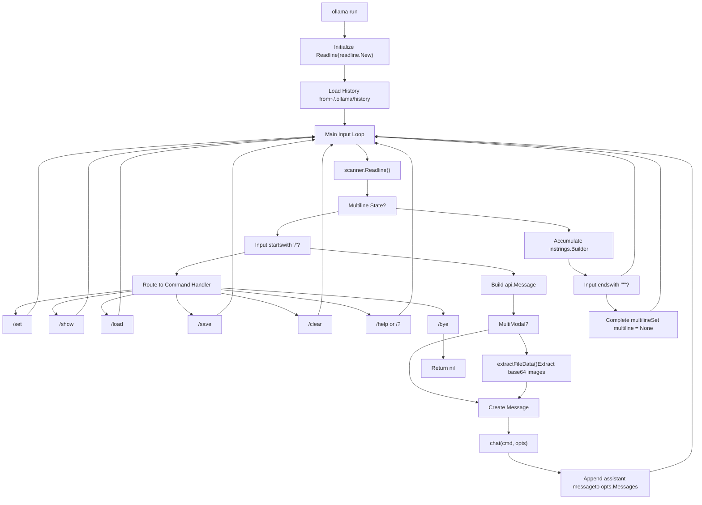
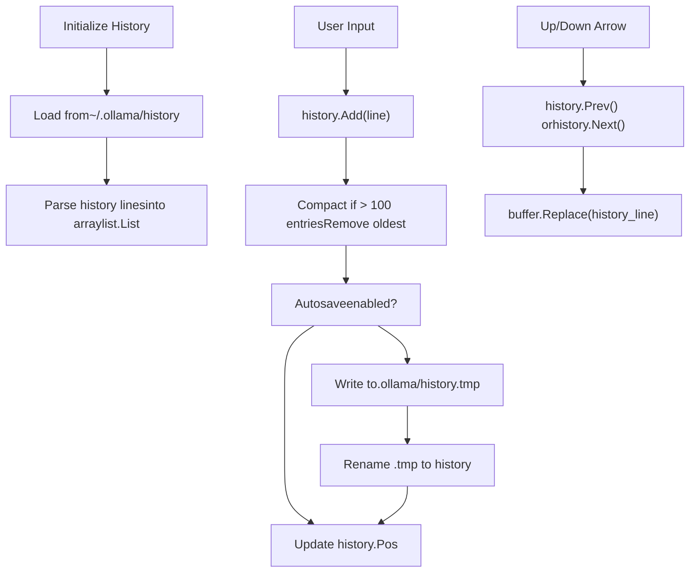
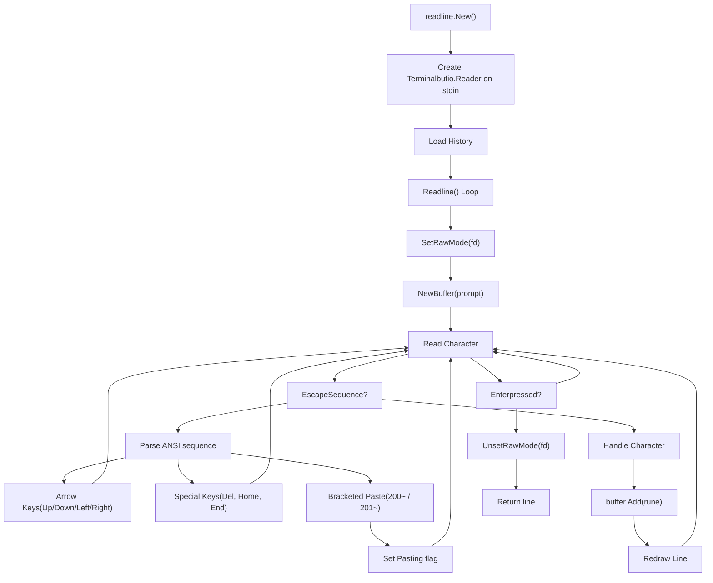
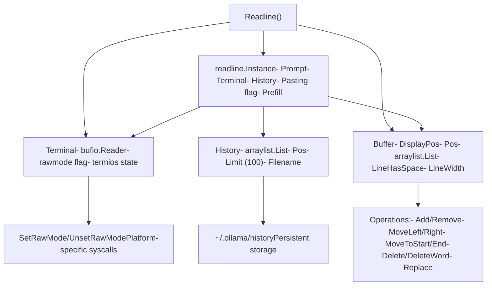

# 命令行界面

相关源文件

-   [README.md](https://github.com/ollama/ollama/blob/562c76d7/README.md?plain=1)
-   [cmd/editor\_unix.go](https://github.com/ollama/ollama/blob/562c76d7/cmd/editor_unix.go)
-   [cmd/editor\_windows.go](https://github.com/ollama/ollama/blob/562c76d7/cmd/editor_windows.go)
-   [cmd/interactive.go](https://github.com/ollama/ollama/blob/562c76d7/cmd/interactive.go)
-   [cmd/interactive\_test.go](https://github.com/ollama/ollama/blob/562c76d7/cmd/interactive_test.go)
-   [docs/README.md](https://github.com/ollama/ollama/blob/562c76d7/docs/README.md?plain=1)
-   [docs/api.md](https://github.com/ollama/ollama/blob/562c76d7/docs/api.md?plain=1)
-   [docs/development.md](https://github.com/ollama/ollama/blob/562c76d7/docs/development.md?plain=1)
-   [docs/images/ollama-keys.png](https://github.com/ollama/ollama/blob/562c76d7/docs/images/ollama-keys.png)
-   [docs/images/signup.png](https://github.com/ollama/ollama/blob/562c76d7/docs/images/signup.png)
-   [readline/buffer.go](https://github.com/ollama/ollama/blob/562c76d7/readline/buffer.go)
-   [readline/errors.go](https://github.com/ollama/ollama/blob/562c76d7/readline/errors.go)
-   [readline/history.go](https://github.com/ollama/ollama/blob/562c76d7/readline/history.go)
-   [readline/readline.go](https://github.com/ollama/ollama/blob/562c76d7/readline/readline.go)
-   [readline/readline\_unix.go](https://github.com/ollama/ollama/blob/562c76d7/readline/readline_unix.go)
-   [readline/readline\_windows.go](https://github.com/ollama/ollama/blob/562c76d7/readline/readline_windows.go)
-   [readline/term.go](https://github.com/ollama/ollama/blob/562c76d7/readline/term.go)
-   [readline/term\_bsd.go](https://github.com/ollama/ollama/blob/562c76d7/readline/term_bsd.go)
-   [readline/term\_linux.go](https://github.com/ollama/ollama/blob/562c76d7/readline/term_linux.go)
-   [readline/term\_windows.go](https://github.com/ollama/ollama/blob/562c76d7/readline/term_windows.go)
-   [readline/types.go](https://github.com/ollama/ollama/blob/562c76d7/readline/types.go)

本文档介绍 Ollama 的命令行界面，包括标准命令、交互模式特性、键盘快捷键以及会话管理。CLI 是运行模型、管理对话和配置运行时参数的主要用户界面。

有关 CLI 所通信的 HTTP API，请参阅 [HTTP 服务器与 API 层](/ollama/ollama/2.1-http-server-and-api-layer)。有关模型管理操作详情，请参阅 [模型管理](/ollama/ollama/4-model-management)。

## 概览

Ollama CLI 同时提供单命令执行与交互式聊天模式。所有 CLI 命令都通过向 `localhost:11434` 发起 HTTP API 调用与本地 Ollama 服务器通信。

**主要命令：**

-   `ollama run <model>` - 运行并与模型交互
-   `ollama create <name>` - 从 Modelfile 创建模型
-   `ollama pull <model>` - 从注册表下载模型
-   `ollama push <model>` - 将模型上传到注册表
-   `ollama list` - 列出本地可用模型
-   `ollama show <model>` - 显示模型信息
-   `ollama cp <source> <dest>` - 复制模型
-   `ollama rm <model>` - 删除模型
-   `ollama serve` - 启动 Ollama 服务器
-   `ollama launch <integration>` - 启动 Claude Code、Codex 等集成

来源： [README.md54-86](https://github.com/ollama/ollama/blob/562c76d7/README.md?plain=1#L54-L86) [cmd/interactive.go33-533](https://github.com/ollama/ollama/blob/562c76d7/cmd/interactive.go#L33-L533)

## 交互模式

运行 `ollama run <model>` 或无参数执行 `ollama` 时，会自动进入交互模式。该模式为多轮聊天会话提供带高级特性的对话式界面。


**交互模式特性：**

-   支持自动上下文管理的多轮对话
-   使用三引号（`"""`）的多行输入
-   多模态模型的图像附件
-   支持导航的命令历史（上/下方向键）
-   会话保存/加载功能
-   实时参数调整
-   外部编辑器支持（Ctrl+G）

来源： [cmd/interactive.go33-533](https://github.com/ollama/ollama/blob/562c76d7/cmd/interactive.go#L33-L533) [readline/readline.go48-341](https://github.com/ollama/ollama/blob/562c76d7/readline/readline.go#L48-L341)

## 交互命令

### 会话控制命令

| 命令 | 说明 | 示例 |
| --- | --- | --- |
| `/set history` | 启用命令历史 | `/set history` |
| `/set nohistory` | 禁用命令历史 | `/set nohistory` |
| `/set wordwrap` | 启用自动换行 | `/set wordwrap` |
| `/set nowordwrap` | 禁用自动换行 | `/set nowordwrap` |
| `/set verbose` | 显示 LLM 统计信息 | `/set verbose` |
| `/set quiet` | 隐藏 LLM 统计信息 | `/set quiet` |
| `/set think` | 启用思考模式 | `/set think` 或 `/set think deep` |
| `/set nothink` | 禁用思考模式 | `/set nothink` |
| `/set format json` | 启用 JSON 响应模式 | `/set format json` |
| `/set noformat` | 禁用响应格式化 | `/set noformat` |

来源： [cmd/interactive.go274-393](https://github.com/ollama/ollama/blob/562c76d7/cmd/interactive.go#L274-L393)

### 模型信息命令

| 命令 | 说明 | 输出 |
| --- | --- | --- |
| `/show info` | 显示模型详情 | 架构、参数量、量化信息 |
| `/show license` | 显示模型许可 | 若可用则显示许可文本 |
| `/show modelfile` | 显示 Modelfile | 完整 Modelfile 规范 |
| `/show parameters` | 显示模型参数 | 所有参数值 |
| `/show system` | 显示系统消息 | 当前系统提示词 |
| `/show template` | 显示提示模板 | 模板格式字符串 |

来源： [cmd/interactive.go394-461](https://github.com/ollama/ollama/blob/562c76d7/cmd/interactive.go#L394-L461)

### 参数配置

可在会话中通过 `/set parameter <name> <value>` 设置参数：

```
/set parameter temperature 0.8
/set parameter num_ctx 4096
/set parameter top_p 0.9
/set parameter stop "\n" "END"
```
**常用参数：**

-   `seed` - 用于可复现性的随机数种子
-   `num_predict` - 最大生成 token 数
-   `top_k` - Top-k 采样参数
-   `top_p` - Nucleus 采样阈值
-   `min_p` - 最小概率阈值
-   `num_ctx` - 上下文窗口大小
-   `temperature` - 采样温度（创造性）
-   `repeat_penalty` - 重复惩罚强度
-   `repeat_last_n` - 重复回看窗口
-   `num_gpu` - 卸载到 GPU 的层数
-   `stop` - 停止序列（可指定多个）

来源： [cmd/interactive.go100-115](https://github.com/ollama/ollama/blob/562c76d7/cmd/interactive.go#L100-L115) [cmd/interactive.go337-350](https://github.com/ollama/ollama/blob/562c76d7/cmd/interactive.go#L337-L350)

### 系统消息配置

设置或修改系统消息（给模型的指令）：

```
/set system You are a helpful coding assistant.
```
对于多行系统消息，可使用三引号：

```
/set system """
You are a helpful assistant.
You should always be polite and concise.
You specialize in Python programming.
"""
```
来源： [cmd/interactive.go350-387](https://github.com/ollama/ollama/blob/562c76d7/cmd/interactive.go#L350-L387)

### 会话管理

| 命令 | 说明 | 示例 |
| --- | --- | --- |
| `/load <model>` | 加载其他模型 | `/load llama3:70b` |
| `/save <name>` | 将当前会话保存为新模型 | `/save my-assistant` |
| `/clear` | 清空对话上下文 | `/clear` |
| `/list` | 列出可用模型 | `/list` |

使用 `/save` 时，当前会话历史和系统消息会保存进一个继承自当前模型的新模型。这会创建一个可后续加载的“会话快照”。

来源： [cmd/interactive.go208-265](https://github.com/ollama/ollama/blob/562c76d7/cmd/interactive.go#L208-L265)

## 键盘快捷键

交互模式使用自定义 readline 实现，并支持以下快捷键：

```mermaid
flowchart TD
    CtrlL["Ctrl+L"]
    ClearScreen["Clear screen"]
    CtrlG["Ctrl+G"]
    ExtEditor["Open external editor"]
    CtrlC["Ctrl+C"]
    Interrupt["Cancel current input"]
    CtrlD["Ctrl+D"]
    Exit["Exit interactive mode"]
    CtrlJ["Ctrl+J"]
    Multiline["New line (multiline mode)"]
    CtrlP["Ctrl+P / Up"]
    PrevHist["Previous history entry"]
    CtrlN["Ctrl+N / Down"]
    NextHist["Next history entry"]
    CtrlK["Ctrl+K"]
    KillLine["Delete to end of line"]
    CtrlU["Ctrl+U"]
    KillBefore["Delete to beginning of line"]
    CtrlW["Ctrl+W"]
    KillWord["Delete word before cursor"]
    Backspace["Backspace"]
    DelChar["Delete character before cursor"]
    Delete["Delete"]
    DelCharAfter["Delete character after cursor"]
    CtrlA["Ctrl+A"]
    BOL["Move to beginning of line"]
    CtrlE["Ctrl+E"]
    EOL["Move to end of line"]
    AltB["Alt+B"]
    WordLeft["Move back one word"]
    AltF["Alt+F"]
    WordRight["Move forward one word"]

    CtrlL --> ClearScreen
    CtrlG --> ExtEditor
    CtrlC --> Interrupt
    CtrlD --> Exit
    CtrlJ --> Multiline
    CtrlP --> PrevHist
    CtrlN --> NextHist
    CtrlK --> KillLine
    CtrlU --> KillBefore
    CtrlW --> KillWord
    Backspace --> DelChar
    Delete --> DelCharAfter
    CtrlA --> BOL
    CtrlE --> EOL
    AltB --> WordLeft
    AltF --> WordRight
```


**完整快捷键参考：**

| 快捷键 | 操作 | 实现位置 |
| --- | --- | --- |
| Ctrl+A / Home | 移动到行首 | [readline/readline.go231-232](https://github.com/ollama/ollama/blob/562c76d7/readline/readline.go#L231-L232) |
| Ctrl+E / End | 移动到行尾 | [readline/readline.go233-234](https://github.com/ollama/ollama/blob/562c76d7/readline/readline.go#L233-L234) |
| Alt+B | 向后移动一个词 | [readline/buffer.go80-99](https://github.com/ollama/ollama/blob/562c76d7/readline/buffer.go#L80-L99) |
| Alt+F | 向前移动一个词 | [readline/buffer.go124-138](https://github.com/ollama/ollama/blob/562c76d7/readline/buffer.go#L124-L138) |
| Ctrl+K | 删除到行尾 | [readline/buffer.go421-428](https://github.com/ollama/ollama/blob/562c76d7/readline/buffer.go#L421-L428) |
| Ctrl+U | 删除到行首 | [readline/buffer.go413-419](https://github.com/ollama/ollama/blob/562c76d7/readline/buffer.go#L413-L419) |
| Ctrl+W | 删除光标前一个词 | [readline/buffer.go430-451](https://github.com/ollama/ollama/blob/562c76d7/readline/buffer.go#L430-L451) |
| Ctrl+L | 清屏 | [readline/buffer.go453-483](https://github.com/ollama/ollama/blob/562c76d7/readline/buffer.go#L453-L483) |
| Ctrl+G | 打开外部编辑器 | [cmd/interactive.go153-164](https://github.com/ollama/ollama/blob/562c76d7/cmd/interactive.go#L153-L164) |
| Ctrl+C | 中断当前输入 | [readline/readline.go223-226](https://github.com/ollama/ollama/blob/562c76d7/readline/readline.go#L223-L226) |
| Ctrl+D | 退出 Ollama | [readline/readline.go262-267](https://github.com/ollama/ollama/blob/562c76d7/readline/readline.go#L262-L267) |
| Ctrl+P / Up Arrow | 上一条历史记录 | [readline/readline.go165-168](https://github.com/ollama/ollama/blob/562c76d7/readline/readline.go#L165-L168) |
| Ctrl+N / Down Arrow | 下一条历史记录 | [readline/readline.go167-168](https://github.com/ollama/ollama/blob/562c76d7/readline/readline.go#L167-L168) |
| Ctrl+J | 换行（多行模式） | [readline/readline.go302-316](https://github.com/ollama/ollama/blob/562c76d7/readline/readline.go#L302-L316) |
| Enter | 提交输入 | [readline/readline.go317-330](https://github.com/ollama/ollama/blob/562c76d7/readline/readline.go#L317-L330) |

来源： [cmd/interactive.go72-86](https://github.com/ollama/ollama/blob/562c76d7/cmd/interactive.go#L72-L86) [readline/readline.go218-340](https://github.com/ollama/ollama/blob/562c76d7/readline/readline.go#L218-L340) [readline/buffer.go52-527](https://github.com/ollama/ollama/blob/562c76d7/readline/buffer.go#L52-L527)

## 多行输入

可使用三引号（`"""`）创建多行消息：

```
>>> """
... This is a multiline
... message that spans
... multiple lines.
... """
```
处于多行模式时，提示符会变为 `...`。也可使用 Ctrl+J 插入换行而不提交。

检测到多行输入时，状态机会转为 `MultilinePrompt` 或 `MultilineSystem` 模式：

来源： [cmd/interactive.go25-31](https://github.com/ollama/ollama/blob/562c76d7/cmd/interactive.go#L25-L31) [cmd/interactive.go169-199](https://github.com/ollama/ollama/blob/562c76d7/cmd/interactive.go#L169-L199)

## 多模态支持

对于具备视觉能力的模型，可通过引用文件路径在提示中包含图像：

```
>>> Describe this image: /path/to/image.jpg
```
**支持的图像格式：**

-   `.jpg` / `.jpeg`
-   `.png`
-   `.webp`

**图像处理流程：**

1.  使用正则模式提取文件路径： [cmd/interactive.go583-590](https://github.com/ollama/ollama/blob/562c76d7/cmd/interactive.go#L583-L590)
2.  对路径进行规范化，处理转义空格与特殊字符： [cmd/interactive.go563-581](https://github.com/ollama/ollama/blob/562c76d7/cmd/interactive.go#L563-L581)
3.  校验图像类型和大小（最大 100MB）： [cmd/interactive.go666-708](https://github.com/ollama/ollama/blob/562c76d7/cmd/interactive.go#L666-L708)
4.  将图像做 base64 编码并附加到消息中： [cmd/interactive.go593-613](https://github.com/ollama/ollama/blob/562c76d7/cmd/interactive.go#L593-L613)

单条消息可包含多张图像：

```
>>> Compare these images: /path/to/first.png /path/to/second.png
```
来源： [cmd/interactive.go48-50](https://github.com/ollama/ollama/blob/562c76d7/cmd/interactive.go#L48-L50) [cmd/interactive.go481-495](https://github.com/ollama/ollama/blob/562c76d7/cmd/interactive.go#L481-L495) [cmd/interactive.go504-512](https://github.com/ollama/ollama/blob/562c76d7/cmd/interactive.go#L504-L512) [cmd/interactive.go593-708](https://github.com/ollama/ollama/blob/562c76d7/cmd/interactive.go#L593-L708)

## 命令历史

命令历史会自动保存到 `~/.ollama/history`，并在会话之间持久化。


**历史管理：**

| 操作 | 行为 | 实现位置 |
| --- | --- | --- |
| 存储位置 | `~/.ollama/history` | [readline/history.go40-51](https://github.com/ollama/ollama/blob/562c76d7/readline/history.go#L40-L51) |
| 条目上限 | 100 条（可配置） | [readline/history.go27](https://github.com/ollama/ollama/blob/562c76d7/readline/history.go#L27-L27) |
| 自动保存 | 默认启用 | [readline/history.go28](https://github.com/ollama/ollama/blob/562c76d7/readline/history.go#L28-L28) |
| 启用/禁用 | `/set history` 或 `/set nohistory` | [cmd/interactive.go278-281](https://github.com/ollama/ollama/blob/562c76d7/cmd/interactive.go#L278-L281) |
| 导航 | 上/下方向键或 Ctrl+P/N | [readline/readline.go165-168](https://github.com/ollama/ollama/blob/562c76d7/readline/readline.go#L165-L168) |

可通过环境变量或 `/set nohistory` 命令禁用历史记录：

来源： [readline/history.go24-151](https://github.com/ollama/ollama/blob/562c76d7/readline/history.go#L24-L151) [cmd/interactive.go127-129](https://github.com/ollama/ollama/blob/562c76d7/cmd/interactive.go#L127-L129) [cmd/interactive.go278-281](https://github.com/ollama/ollama/blob/562c76d7/cmd/interactive.go#L278-L281)

## 外部编辑器支持

按下 Ctrl+G 可在外部编辑器中打开当前输入。编辑器按以下顺序选择：

1.  `OLLAMA_EDITOR` 环境变量
2.  `VISUAL` 环境变量
3.  `EDITOR` 环境变量
4.  平台默认值：`vi`（Unix）或 `edit`（Windows）

**编辑器工作流：**

1.  将当前输入写入临时文件： [cmd/interactive.go633-645](https://github.com/ollama/ollama/blob/562c76d7/cmd/interactive.go#L633-L645)
2.  以临时文件启动编辑器： [cmd/interactive.go647-656](https://github.com/ollama/ollama/blob/562c76d7/cmd/interactive.go#L647-L656)
3.  编辑器关闭后读回内容： [cmd/interactive.go658-663](https://github.com/ollama/ollama/blob/562c76d7/cmd/interactive.go#L658-L663)
4.  将内容预填充到输入缓冲区： [readline/readline.go94-112](https://github.com/ollama/ollama/blob/562c76d7/readline/readline.go#L94-L112)

来源： [cmd/interactive.go615-664](https://github.com/ollama/ollama/blob/562c76d7/cmd/interactive.go#L615-L664) [cmd/editor\_unix.go1-6](https://github.com/ollama/ollama/blob/562c76d7/cmd/editor_unix.go#L1-L6) [cmd/editor\_windows.go1-6](https://github.com/ollama/ollama/blob/562c76d7/cmd/editor_windows.go#L1-L6)

## 终端实现

CLI 使用自定义 readline 实现，以 raw 模式运行，从而对终端输入进行细粒度控制。


**终端特性：**

-   Raw 模式终端控制，实现逐字符输入
-   ANSI 转义序列处理，用于光标移动
-   支持 bracketed paste 模式（防止粘贴时执行命令）
-   支持宽字符（CJK、emoji）并正确计算显示宽度
-   根据终端宽度动态换行
-   带可视标记的多行缓冲区管理

来源： [readline/readline.go48-341](https://github.com/ollama/ollama/blob/562c76d7/readline/readline.go#L48-L341) [readline/term.go11-38](https://github.com/ollama/ollama/blob/562c76d7/readline/term.go#L11-L38) [readline/buffer.go24-527](https://github.com/ollama/ollama/blob/562c76d7/readline/buffer.go#L24-L527)

## Readline 架构

readline 子系统由多个协作组件构成：


**关键数据结构：**

| 类型 | 用途 | 文件 |
| --- | --- | --- |
| `Instance` | 主 readline 控制器 | [readline/readline.go39-46](https://github.com/ollama/ollama/blob/562c76d7/readline/readline.go#L39-L46) |
| `Terminal` | Raw 终端 I/O | [readline/readline.go33-37](https://github.com/ollama/ollama/blob/562c76d7/readline/readline.go#L33-L37) |
| `Buffer` | 行编辑缓冲区 | [readline/buffer.go12-22](https://github.com/ollama/ollama/blob/562c76d7/readline/buffer.go#L12-L22) |
| `History` | 命令历史 | [readline/history.go15-22](https://github.com/ollama/ollama/blob/562c76d7/readline/history.go#L15-L22) |
| `Prompt` | 提示配置 | [readline/readline.go11-17](https://github.com/ollama/ollama/blob/562c76d7/readline/readline.go#L11-L17) |

来源： [readline/readline.go1-393](https://github.com/ollama/ollama/blob/562c76d7/readline/readline.go#L1-L393) [readline/buffer.go1-527](https://github.com/ollama/ollama/blob/562c76d7/readline/buffer.go#L1-L527) [readline/history.go1-151](https://github.com/ollama/ollama/blob/562c76d7/readline/history.go#L1-L151)

## Bracketed Paste 模式

Bracketed paste 模式可防止粘贴多行内容时意外执行命令。启用后：

1.  终端会在粘贴内容周围发送转义序列：`ESC<FileRef file-url="https://github.com/ollama/ollama/blob/562c76d7/200~` (start) and `ESC[201~` (end)\\n2. Ollama detects these sequences#LNaN-LNaN" NaN file-path="200~`(start) and`ESC\[201~\` (end)\\n2. Ollama detects these sequences">Hii
2.  在粘贴期间将 `Pasting` 标记设为 `true`
3.  对粘贴行强制使用备用提示符（`...`）
4.  累积多行内容而不执行命令
5.  粘贴完成时清除 `Pasting` 标记

这可防止粘贴文本中出现命令（如 `/clear`）时被直接执行。

来源： [readline/readline.go66-67](https://github.com/ollama/ollama/blob/562c76d7/readline/readline.go#L66-L67) [readline/readline.go173-187](https://github.com/ollama/ollama/blob/562c76d7/readline/readline.go#L173-L187) [readline/types.go94-98](https://github.com/ollama/ollama/blob/562c76d7/readline/types.go#L94-L98)

## 平台特定终端处理

终端 raw 模式使用平台特定系统调用实现：

**Unix/Linux（BSD、Darwin、Linux、Solaris）：**

-   使用 `syscall.Termios` 结构： [readline/term.go9](https://github.com/ollama/ollama/blob/562c76d7/readline/term.go#L9-L9)
-   `TIOCGETA`/`TIOCSETA`（BSD）或 `TCGETS`/`TCSETS`（Linux）ioctl
-   禁用规范模式、回显与信号生成
-   实现位置： [readline/term.go11-38](https://github.com/ollama/ollama/blob/562c76d7/readline/term.go#L11-L38) [readline/term\_bsd.go1-26](https://github.com/ollama/ollama/blob/562c76d7/readline/term_bsd.go#L1-L26) [readline/term\_linux.go1-31](https://github.com/ollama/ollama/blob/562c76d7/readline/term_linux.go#L1-L31)

**Windows：**

-   使用 `windows.GetConsoleMode`/`SetConsoleMode`： [readline/term\_windows.go18-38](https://github.com/ollama/ollama/blob/562c76d7/readline/term_windows.go#L18-L38)
-   启用 `ENABLE_VIRTUAL_TERMINAL_INPUT` 以支持转义序列
-   禁用 echo、行输入和 processed input 模式

来源： [readline/term.go1-38](https://github.com/ollama/ollama/blob/562c76d7/readline/term.go#L1-L38) [readline/term\_bsd.go1-26](https://github.com/ollama/ollama/blob/562c76d7/readline/term_bsd.go#L1-L26) [readline/term\_linux.go1-31](https://github.com/ollama/ollama/blob/562c76d7/readline/term_linux.go#L1-L31) [readline/term\_windows.go1-39](https://github.com/ollama/ollama/blob/562c76d7/readline/term_windows.go#L1-L39)

## 错误处理

readline 系统使用自定义错误进行流程控制：

| 错误 | 触发条件 | 行为 |
| --- | --- | --- |
| `ErrInterrupt` | Ctrl+C | 清空当前输入并返回提示符 |
| `ErrEditPrompt` | Ctrl+G | 打开外部编辑器 |
| `io.EOF` | Ctrl+D 或终端关闭 | 退出交互模式 |

主交互循环会处理这些错误，以实现特殊行为而不终止会话。

来源： [readline/errors.go1-17](https://github.com/ollama/ollama/blob/562c76d7/readline/errors.go#L1-L17) [readline/readline.go141-152](https://github.com/ollama/ollama/blob/562c76d7/readline/readline.go#L141-L152) [cmd/interactive.go138-167](https://github.com/ollama/ollama/blob/562c76d7/cmd/interactive.go#L138-L167)

## 实现总结

命令行界面由若干关键文件实现：

| 组件 | 文件 | 关键职责 |
| --- | --- | --- |
| 交互模式 | [cmd/interactive.go](https://github.com/ollama/ollama/blob/562c76d7/cmd/interactive.go) | 命令路由、会话管理、API 调用 |
| Readline 核心 | [readline/readline.go](https://github.com/ollama/ollama/blob/562c76d7/readline/readline.go) | 主输入循环、转义序列处理 |
| 缓冲区管理 | [readline/buffer.go](https://github.com/ollama/ollama/blob/562c76d7/readline/buffer.go) | 行编辑、光标移动、显示更新 |
| 历史记录 | [readline/history.go](https://github.com/ollama/ollama/blob/562c76d7/readline/history.go) | 持久化命令历史 |
| 终端控制 | [readline/term\*.go](https://github.com/ollama/ollama/blob/562c76d7/readline/term*.go) | 平台特定 raw 模式实现 |
| 常量 | [readline/types.go](https://github.com/ollama/ollama/blob/562c76d7/readline/types.go) | ANSI 代码、字符常量 |

交互模式通过 API 包中的 `api.Client` 使用标准 HTTP API 调用与 Ollama 服务器通信。所有命令最终都会转换为诸如 `/api/generate`、`/api/chat`、`/api/create` 等 API 请求。

来源： [cmd/interactive.go1-709](https://github.com/ollama/ollama/blob/562c76d7/cmd/interactive.go#L1-L709) [readline/readline.go1-393](https://github.com/ollama/ollama/blob/562c76d7/readline/readline.go#L1-L393) [readline/buffer.go1-527](https://github.com/ollama/ollama/blob/562c76d7/readline/buffer.go#L1-L527) [readline/history.go1-151](https://github.com/ollama/ollama/blob/562c76d7/readline/history.go#L1-L151)
