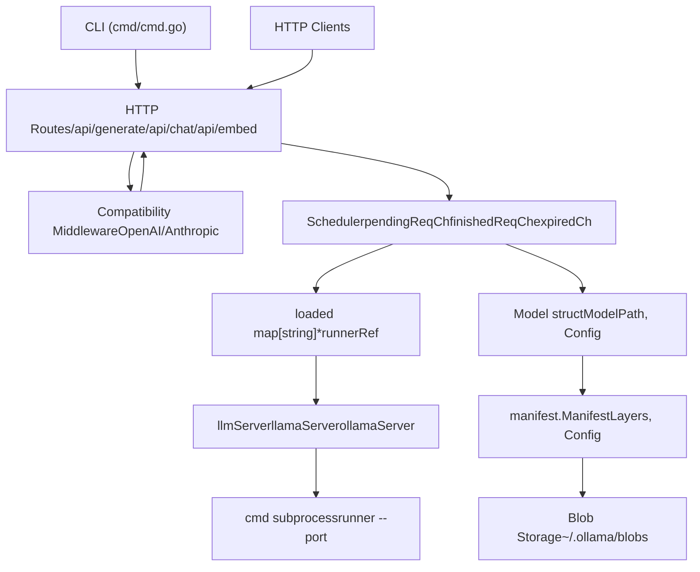
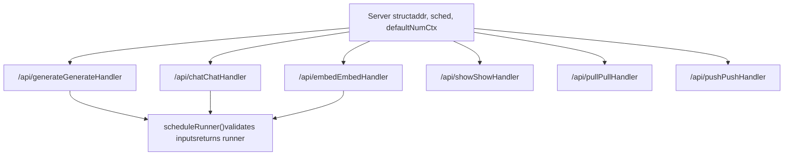
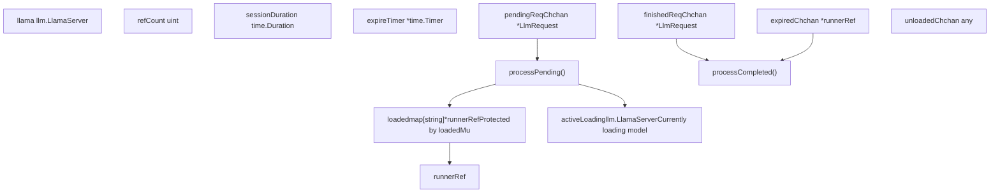
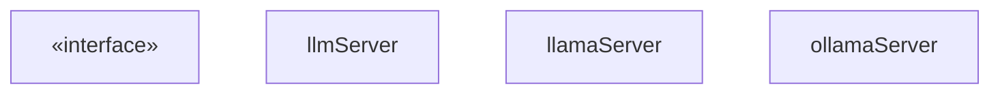
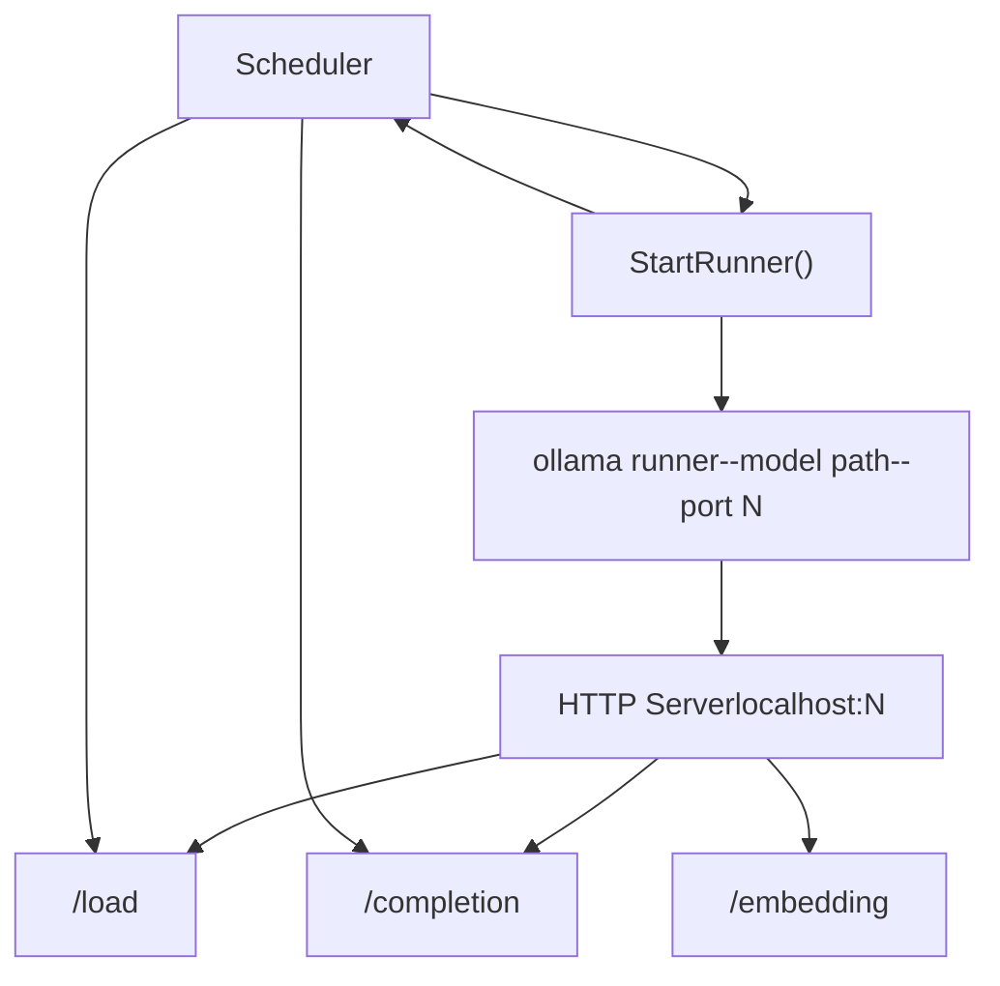
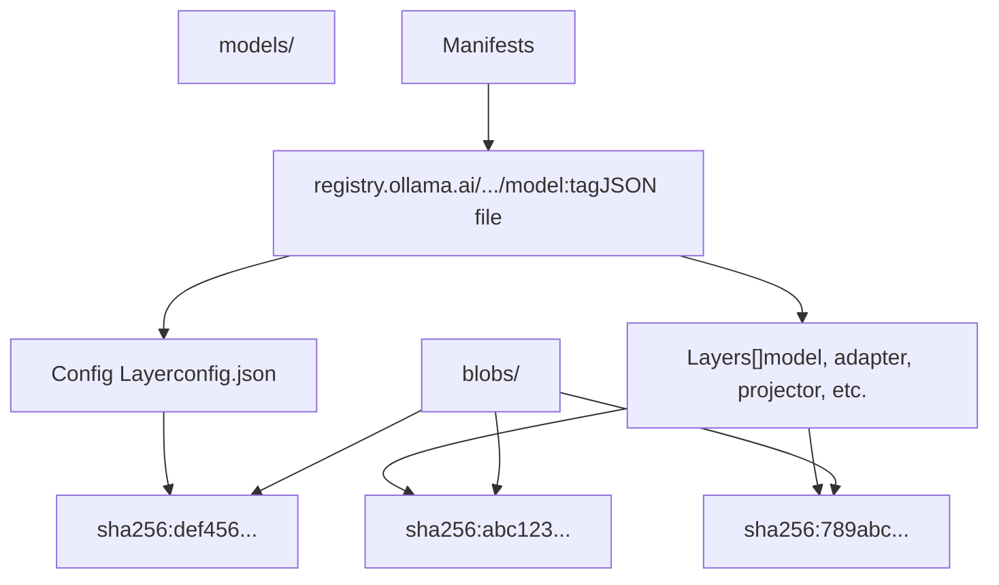
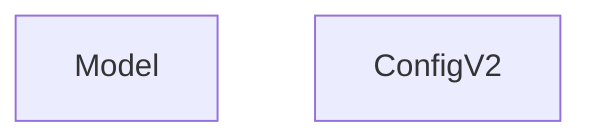

# 架构

相关源文件

-   [api/client.go](https://github.com/ollama/ollama/blob/562c76d7/api/client.go)
-   [api/client\_test.go](https://github.com/ollama/ollama/blob/562c76d7/api/client_test.go)
-   [api/types.go](https://github.com/ollama/ollama/blob/562c76d7/api/types.go)
-   [cmd/cmd.go](https://github.com/ollama/ollama/blob/562c76d7/cmd/cmd.go)
-   [envconfig/config.go](https://github.com/ollama/ollama/blob/562c76d7/envconfig/config.go)
-   [envconfig/config\_test.go](https://github.com/ollama/ollama/blob/562c76d7/envconfig/config_test.go)
-   [integration/embed\_test.go](https://github.com/ollama/ollama/blob/562c76d7/integration/embed_test.go)
-   [kvcache/cache.go](https://github.com/ollama/ollama/blob/562c76d7/kvcache/cache.go)
-   [kvcache/causal.go](https://github.com/ollama/ollama/blob/562c76d7/kvcache/causal.go)
-   [kvcache/causal\_test.go](https://github.com/ollama/ollama/blob/562c76d7/kvcache/causal_test.go)
-   [kvcache/encoder.go](https://github.com/ollama/ollama/blob/562c76d7/kvcache/encoder.go)
-   [kvcache/wrapper.go](https://github.com/ollama/ollama/blob/562c76d7/kvcache/wrapper.go)
-   [llm/server.go](https://github.com/ollama/ollama/blob/562c76d7/llm/server.go)
-   [ml/backend.go](https://github.com/ollama/ollama/blob/562c76d7/ml/backend.go)
-   [ml/backend/ggml/ggml.go](https://github.com/ollama/ollama/blob/562c76d7/ml/backend/ggml/ggml.go)
-   [model/input/input.go](https://github.com/ollama/ollama/blob/562c76d7/model/input/input.go)
-   [model/model.go](https://github.com/ollama/ollama/blob/562c76d7/model/model.go)
-   [model/model\_test.go](https://github.com/ollama/ollama/blob/562c76d7/model/model_test.go)
-   [runner/llamarunner/cache.go](https://github.com/ollama/ollama/blob/562c76d7/runner/llamarunner/cache.go)
-   [runner/llamarunner/runner.go](https://github.com/ollama/ollama/blob/562c76d7/runner/llamarunner/runner.go)
-   [runner/ollamarunner/cache.go](https://github.com/ollama/ollama/blob/562c76d7/runner/ollamarunner/cache.go)
-   [runner/ollamarunner/cache\_test.go](https://github.com/ollama/ollama/blob/562c76d7/runner/ollamarunner/cache_test.go)
-   [runner/ollamarunner/runner.go](https://github.com/ollama/ollama/blob/562c76d7/runner/ollamarunner/runner.go)
-   [server/images.go](https://github.com/ollama/ollama/blob/562c76d7/server/images.go)
-   [server/internal/internal/backoff/backoff.go](https://github.com/ollama/ollama/blob/562c76d7/server/internal/internal/backoff/backoff.go)
-   [server/routes.go](https://github.com/ollama/ollama/blob/562c76d7/server/routes.go)
-   [server/sched.go](https://github.com/ollama/ollama/blob/562c76d7/server/sched.go)
-   [server/sched\_test.go](https://github.com/ollama/ollama/blob/562c76d7/server/sched_test.go)

本文档对 Ollama 的系统架构进行全面概述，涵盖从 HTTP API 端点到模型执行与存储的分层设计。文档说明了客户端请求如何在系统中流转、模型如何被加载与管理，以及各组件如何交互。

有关具体 API 端点和请求/响应格式的细节，请参见 [API 参考](/ollama/ollama/3-api-reference)。有关包括 Modelfile 和转换在内的模型管理细节，请参见 [模型管理](/ollama/ollama/4-model-management)。有关 GPU 支持与硬件配置，请参见 [GPU 与硬件支持](/ollama/ollama/6-gpu-and-hardware-support)。

## 系统概览

Ollama 采用分层系统组织，每一层都有清晰且独立的职责：

**来源：** [server/routes.go1-663](https://github.com/ollama/ollama/blob/562c76d7/server/routes.go#L1-L663) [server/sched.go1-309](https://github.com/ollama/ollama/blob/562c76d7/server/sched.go#L1-L309) [llm/server.go1-440](https://github.com/ollama/ollama/blob/562c76d7/llm/server.go#L1-L440) [server/images.go1-370](https://github.com/ollama/ollama/blob/562c76d7/server/images.go#L1-L370)

### 各层职责

| 层 | 主要组件 | 职责 |
| --- | --- | --- |
| **客户端** | `cmd/cmd.go`、HTTP 客户端 | CLI 命令、API 请求 |
| **API** | `server/routes.go`、中间件 | 路由处理、请求校验、格式转换 |
| **编排** | `server/sched.go` | 模型调度、runner 生命周期、并发控制 |
| **执行** | `llm/server.go` | 模型加载、推理、子进程管理 |
| **存储** | `server/images.go`、`manifest/` | 模型文件、blob 管理、registry 操作 |

**来源：** [server/routes.go87-94](https://github.com/ollama/ollama/blob/562c76d7/server/routes.go#L87-L94) [server/sched.go39-60](https://github.com/ollama/ollama/blob/562c76d7/server/sched.go#L39-L60) [llm/server.go87-109](https://github.com/ollama/ollama/blob/562c76d7/llm/server.go#L87-L109)

## HTTP 服务器与路由

HTTP 服务器基于 Gin Web 框架构建，并暴露用于模型交互和管理的 REST API 端点。

### 核心路由处理器

**来源：** [server/routes.go87-94](https://github.com/ollama/ollama/blob/562c76d7/server/routes.go#L87-L94) [server/routes.go183-663](https://github.com/ollama/ollama/blob/562c76d7/server/routes.go#L183-L663)

`Server` 结构体包含：

-   `sched *Scheduler` - 管理模型 runner 的调度器
-   `addr net.Addr` - 服务器绑定地址
-   `defaultNumCtx int` - 模型默认上下文长度
-   `aliases *store` - 模型别名映射

**来源：** [server/routes.go87-94](https://github.com/ollama/ollama/blob/562c76d7/server/routes.go#L87-L94)

### 请求处理流程

每个处理器都遵循通用模式：

1.  **请求校验** - 解析并校验 JSON 请求体
2.  **模型解析** - 解析模型名称，并检查是远程模型还是本地模型
3.  **runner 获取** - 调用 `scheduleRunner()` 获取或加载模型 runner
4.  **执行** - 执行推理/操作
5.  **响应流式返回** - 将结果流式返回客户端

> **[Mermaid sequence]**
> *(图表结构无法解析)*

**来源：** [server/routes.go133-170](https://github.com/ollama/ollama/blob/562c76d7/server/routes.go#L133-L170) [server/routes.go183-663](https://github.com/ollama/ollama/blob/562c76d7/server/routes.go#L183-L663)

### 关键处理方法

**GenerateHandler** - 处理 `/api/generate` 的补全请求

-   校验模型是否存在（本地或远程）
-   对远程模型，将请求代理到上游服务器
-   支持 thinking 模型、raw 模式和图像生成
-   以 thinking/content 分离方式流式返回响应

**来源：** [server/routes.go183-663](https://github.com/ollama/ollama/blob/562c76d7/server/routes.go#L183-L663)

**ChatHandler** - 处理 `/api/chat` 的对话请求

-   支持带消息历史的多轮对话
-   处理工具调用工作流
-   使用模型模板渲染提示词
-   实现上下文截断/移位

**来源：** [server/routes.go1293-1779](https://github.com/ollama/ollama/blob/562c76d7/server/routes.go#L1293-L1779)

**EmbedHandler** - 处理 `/api/embed` 的嵌入生成

-   支持带截断的批量嵌入
-   对输出向量进行归一化
-   支持降维

**来源：** [server/routes.go665-819](https://github.com/ollama/ollama/blob/562c76d7/server/routes.go#L665-L819)

## 调度器与 runner 管理

`Scheduler` 是管理模型 runner 生命周期的核心编排器。它处理并发访问、内存约束和 keep-alive 语义。

### 调度器架构

**来源：** [server/sched.go39-60](https://github.com/ollama/ollama/blob/562c76d7/server/sched.go#L39-L60) [server/sched.go157-309](https://github.com/ollama/ollama/blob/562c76d7/server/sched.go#L157-L309) [server/sched.go311-432](https://github.com/ollama/ollama/blob/562c76d7/server/sched.go#L311-L432)

### 调度器状态机

调度器通过 `runnerRef` 维护每个已加载模型的状态：

| 字段 | 类型 | 用途 |
| --- | --- | --- |
| `llama` | `llm.LlamaServer` | 实际的 runner 实例 |
| `refCount` | `uint` | 当前使用此 runner 的活跃请求数 |
| `sessionDuration` | `time.Duration` | 最近一次请求给出的 keep-alive 时长 |
| `expireTimer` | `*time.Timer` | 自动卸载计时器 |
| `expiresAt` | `time.Time` | runner 过期时间 |
| `loading` | `sync.Mutex` | 防止并发加载 |

**来源：** [server/sched.go434-471](https://github.com/ollama/ollama/blob/562c76d7/server/sched.go#L434-L471)

### 请求调度流程

> **[Mermaid stateDiagram]**
> *(图表结构无法解析)*

**来源：** [server/sched.go108-143](https://github.com/ollama/ollama/blob/562c76d7/server/sched.go#L108-L143) [server/sched.go157-309](https://github.com/ollama/ollama/blob/562c76d7/server/sched.go#L157-L309)

### runner 生命周期

**加载 runner：**

1.  检查模型是否已存在于 `loaded` map
2.  若不存在，将请求入队到 `pendingReqCh`
3.  `processPending()` 处理队列：
    -   检查 `OLLAMA_MAX_LOADED_MODELS` 限制
    -   若达到容量则淘汰旧 runner
    -   枚举可用 GPU
    -   计算层分布
    -   通过 `newServerFn` 创建新的 `LlamaServer`
    -   等待 runner 就绪

**来源：** [server/sched.go157-309](https://github.com/ollama/ollama/blob/562c76d7/server/sched.go#L157-L309)

**引用计数：**

-   每个活跃请求会递增 `refCount`
-   请求完成后会递减 `refCount`
-   当 `refCount` 归零时，启动 `expireTimer`
-   计时器到期后若仍为 0，则触发卸载

**来源：** [server/sched.go311-432](https://github.com/ollama/ollama/blob/562c76d7/server/sched.go#L311-L432)

**淘汰策略：** 调度器在容量已满时使用 `findRunnerToUnload()` 选择要卸载的 runner：

1.  优先选择 `sessionDuration == 0` 的 runner（立即卸载）
2.  否则选择距离过期时间最短的 runner
3.  绝不淘汰 `refCount > 0` 的 runner

**来源：** [server/sched.go473-515](https://github.com/ollama/ollama/blob/562c76d7/server/sched.go#L473-L515)

## 模型执行层

执行层负责将模型加载到内存并执行推理。该层由 `LlamaServer` 接口及其两个实现组成。

### LlamaServer 接口

**来源：** [llm/server.go67-85](https://github.com/ollama/ollama/blob/562c76d7/llm/server.go#L67-L85) [llm/server.go87-122](https://github.com/ollama/ollama/blob/562c76d7/llm/server.go#L87-L122)

### 服务器实现

**llamaServer** - 通过 CGo 使用 llama.cpp

-   GGUF 模型的主要实现
-   与 llama.cpp 集成以进行分词
-   支持多模态模型所需的 projector

**ollamaServer** - 纯 Go 实现

-   在 `OLLAMA_NEW_ENGINE=1` 或模型要求时使用
-   使用 Go 原生分词器
-   目前仅限文本模型

**来源：** [llm/server.go111-122](https://github.com/ollama/ollama/blob/562c76d7/llm/server.go#L111-L122) [llm/server.go143-319](https://github.com/ollama/ollama/blob/562c76d7/llm/server.go#L143-L319)

### runner 子进程架构

每个模型 runner 作为子进程执行：

**来源：** [llm/server.go321-439](https://github.com/ollama/ollama/blob/562c76d7/llm/server.go#L321-L439)

**StartRunner 函数：**

-   定位 `ollama` 可执行文件
-   分配随机临时端口
-   构造命令：`ollama runner --model <path> --port <N>`
-   配置环境变量（库路径、GPU 设置）
-   启动子进程并通过 `cmd.Wait()` 监控

**来源：** [llm/server.go321-439](https://github.com/ollama/ollama/blob/562c76d7/llm/server.go#L321-L439)

### 模型加载流程

> **[Mermaid sequence]**
> *(图表结构无法解析)*

**来源：** [llm/server.go497-777](https://github.com/ollama/ollama/blob/562c76d7/llm/server.go#L497-L777)

### 加载操作

模型加载通过 `LoadOperation` 控制的不同阶段进行：

| 操作 | 用途 | 可重试 |
| --- | --- | --- |
| `LoadOperationFit` | 在不分配内存的情况下计算内存需求 | 是 |
| `LoadOperationAlloc` | 分配 GPU/CPU 内存 | 是 |
| `LoadOperationCommit` | 将权重加载到内存 | 否 |
| `LoadOperationClose` | 卸载并释放内存 | 不适用 |

**来源：** [llm/server.go445-469](https://github.com/ollama/ollama/blob/562c76d7/llm/server.go#L445-L469) [llm/server.go497-777](https://github.com/ollama/ollama/blob/562c76d7/llm/server.go#L497-L777)

三阶段加载使调度器能够：

1.  **Fit** - 判断模型是否适配可用硬件
2.  **Alloc** - 在设备间预留内存
3.  **Commit** - 完成加载（不可回退点）

这使得调度器可以在提交前尝试不同 GPU 配置。

**来源：** [llm/server.go497-777](https://github.com/ollama/ollama/blob/562c76d7/llm/server.go#L497-L777)

## 存储与模型管理

模型使用内容寻址 blob 系统存储，并由 manifest 描述层级组成。

### 存储结构

**来源：** [server/images.go271-369](https://github.com/ollama/ollama/blob/562c76d7/server/images.go#L271-L369)

### 模型结构

`Model` 结构体表示一个完整解析后的模型：

**来源：** [server/images.go57-72](https://github.com/ollama/ollama/blob/562c76d7/server/images.go#L57-L72) [server/images.go271-369](https://github.com/ollama/ollama/blob/562c76d7/server/images.go#L271-L369)

### Manifest 层类型

模型由多种层类型组成：

| MediaType | 用途 | 来源文件 |
| --- | --- | --- |
| `application/vnd.ollama.image.model` | 主模型权重（GGUF） | 模型文件 |
| `application/vnd.ollama.image.adapter` | LoRA 适配器 | 适配器文件 |
| `application/vnd.ollama.image.projector` | 视觉 projector | projector 文件 |
| `application/vnd.ollama.image.template` | 提示词模板 | 模板字符串 |
| `application/vnd.ollama.image.system` | 系统提示词 | 系统字符串 |
| `application/vnd.ollama.image.params` | 模型选项 | JSON 参数 |
| `application/vnd.ollama.image.license` | 许可证文本 | 许可证字符串 |
| `application/vnd.ollama.image.messages` | 预加载消息 | JSON 消息 |

**来源：** [server/images.go302-365](https://github.com/ollama/ollama/blob/562c76d7/server/images.go#L302-L365)

### 从存储加载模型

> **[Mermaid sequence]**
> *(图表结构无法解析)*

**来源：** [server/images.go271-369](https://github.com/ollama/ollama/blob/562c76d7/server/images.go#L271-L369)

### Blob 传输

在拉取和推送模型时，Ollama 实现了并行 blob 传输：

**下载（server/download.go）：**

-   将大型 blob 拆分为 16 个分片（可配置）
-   分片大小：100MB - 1000MB
-   通过 errgroup 并行下载分片
-   支持从部分下载中断点续传
-   写入稀疏文件以节省磁盘空间

**来源：** [server/download.go1-329](https://github.com/ollama/ollama/blob/562c76d7/server/download.go#L1-L329) [server/download.go99-183](https://github.com/ollama/ollama/blob/562c76d7/server/download.go#L99-L183)

**上传（server/upload.go）：**

-   采用类似的并行上传策略
-   支持 blob 挂载（跨仓库）
-   计算分片 MD5 校验和
-   使用 ETag 提交并进行校验

**来源：** [server/upload.go1-329](https://github.com/ollama/ollama/blob/562c76d7/server/upload.go#L1-L329)

## 配置与环境

Ollama 使用环境变量进行配置，由 `envconfig` 包统一管理。

### 关键配置变量

| 变量 | 默认值 | 用途 |
| --- | --- | --- |
| `OLLAMA_HOST` | `127.0.0.1:11434` | 服务器绑定地址 |
| `OLLAMA_MODELS` | `~/.ollama/models` | 模型存储目录 |
| `OLLAMA_KEEP_ALIVE` | `5m` | 模型 keep-alive 时长 |
| `OLLAMA_MAX_LOADED_MODELS` | 自动（3×GPUs） | 最大并发加载模型数 |
| `OLLAMA_MAX_QUEUE` | `512` | 最大待处理请求数 |
| `OLLAMA_NUM_PARALLEL` | `1` | 每模型并行请求数 |
| `OLLAMA_FLASH_ATTENTION` | 自动 | 启用 flash attention |
| `OLLAMA_DEBUG` | `0` | 调试日志级别 |

**来源：** [envconfig/config.go1-60](https://github.com/ollama/ollama/blob/562c76d7/envconfig/config.go#L1-L60) [envconfig/config.go88-141](https://github.com/ollama/ollama/blob/562c76d7/envconfig/config.go#L88-L141) [envconfig/config.go154-214](https://github.com/ollama/ollama/blob/562c76d7/envconfig/config.go#L154-L214)

### 主机配置

`Host()` 函数使用智能默认值解析 `OLLAMA_HOST`：

-   支持 `http://` 与 `https://` scheme
-   默认端口为 11434（http 为 80，https 为 443）
-   对 `ollama.com` 特殊处理为 `https://ollama.com:443`
-   支持代理路径：`https://example.com/ollama`

**来源：** [envconfig/config.go20-60](https://github.com/ollama/ollama/blob/562c76d7/envconfig/config.go#L20-L60)

### 调度器配置

**OLLAMA\_MAX\_LOADED\_MODELS：**

-   限制并发加载模型数量
-   默认值：`3 × GPU 数量`（仅 CPU 场景为 3）
-   设为 `0` 表示自动计算
-   设为 `>0` 表示固定限制

**来源：** [server/sched.go62-66](https://github.com/ollama/ollama/blob/562c76d7/server/sched.go#L62-L66) [server/sched.go212-223](https://github.com/ollama/ollama/blob/562c76d7/server/sched.go#L212-L223)

**Keep-Alive 行为：**

-   每个请求都可指定 `keep_alive` 时长
-   负值 = 无限期保持加载
-   零值 = 请求结束后立即卸载
-   正值 = 在指定时长内保持加载

**来源：** [envconfig/config.go103-121](https://github.com/ollama/ollama/blob/562c76d7/envconfig/config.go#L103-L121) [server/sched.go311-357](https://github.com/ollama/ollama/blob/562c76d7/server/sched.go#L311-L357)

## 请求流示例

### 完整聊天请求流程

> **[Mermaid sequence]**
> *(图表结构无法解析)*

**来源：** [server/routes.go1293-1779](https://github.com/ollama/ollama/blob/562c76d7/server/routes.go#L1293-L1779) [server/sched.go108-143](https://github.com/ollama/ollama/blob/562c76d7/server/sched.go#L108-L143) [server/sched.go157-309](https://github.com/ollama/ollama/blob/562c76d7/server/sched.go#L157-L309) [llm/server.go497-777](https://github.com/ollama/ollama/blob/562c76d7/llm/server.go#L497-L777)

该架构能够实现：

-   通过引用计数处理并发请求
-   通过自动模型卸载实现高效内存利用
-   通过淘汰策略实现灵活模型调度
-   支持多种模型格式与执行引擎
-   通过子进程隔离模型执行以提升稳定性
