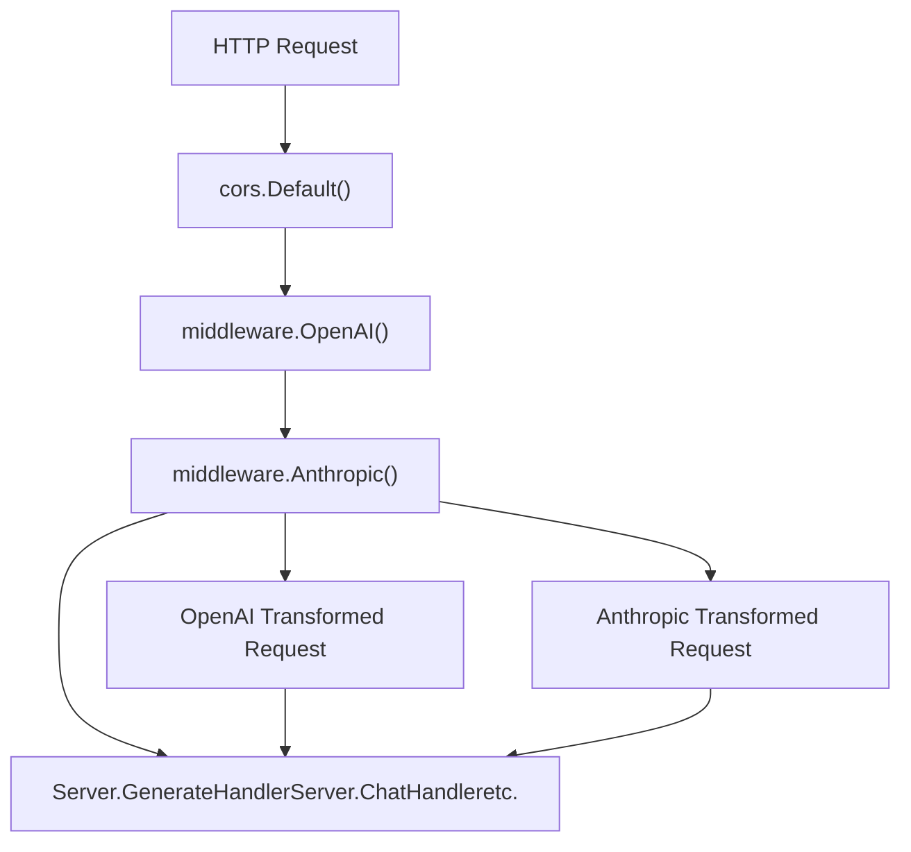
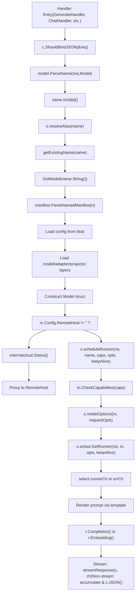

# HTTP 服务器与 API 层

相关源文件

-   [README.md](https://github.com/ollama/ollama/blob/562c76d7/README.md?plain=1)
-   [api/client.go](https://github.com/ollama/ollama/blob/562c76d7/api/client.go)
-   [api/client\_test.go](https://github.com/ollama/ollama/blob/562c76d7/api/client_test.go)
-   [api/types.go](https://github.com/ollama/ollama/blob/562c76d7/api/types.go)
-   [cmd/cmd.go](https://github.com/ollama/ollama/blob/562c76d7/cmd/cmd.go)
-   [docs/README.md](https://github.com/ollama/ollama/blob/562c76d7/docs/README.md?plain=1)
-   [docs/api.md](https://github.com/ollama/ollama/blob/562c76d7/docs/api.md?plain=1)
-   [docs/development.md](https://github.com/ollama/ollama/blob/562c76d7/docs/development.md?plain=1)
-   [docs/images/ollama-keys.png](https://github.com/ollama/ollama/blob/562c76d7/docs/images/ollama-keys.png)
-   [docs/images/signup.png](https://github.com/ollama/ollama/blob/562c76d7/docs/images/signup.png)
-   [server/images.go](https://github.com/ollama/ollama/blob/562c76d7/server/images.go)
-   [server/routes.go](https://github.com/ollama/ollama/blob/562c76d7/server/routes.go)

本文档描述 Ollama 的 HTTP 服务器架构与 API 层，包括请求路由、中间件处理、端点处理器以及流式响应机制。服务器基于 Gin Web 框架构建，同时提供 Ollama 原生端点与 OpenAI 兼容端点。

有关 OpenAI 兼容转换逻辑，请参见 [OpenAI 兼容层](/ollama/ollama/3.4-openai-compatibility-layer)。有关请求进入处理器后的调度与 runner 管理细节，请参见 [请求调度与 Runner 管理](/ollama/ollama/2.2-request-scheduling-and-runner-management)。

## 概览

HTTP 服务器是所有客户端与 Ollama 交互的主要入口。它暴露用于模型管理（pull、push、create、delete）、推理（generate、chat、embed）和自省（show、list）的 REST API 端点。服务器同时处理流式与非流式响应、管理认证，并通过中间件提供 OpenAI API 兼容性。

**来源：** [server/routes.go1-150](https://github.com/ollama/ollama/blob/562c76d7/server/routes.go#L1-L150)

## 服务器初始化与核心组件

### 服务器结构

`Server` 结构体是封装 HTTP 服务器状态的核心组件：

```
type Server struct {    addr          net.Addr    sched         *Scheduler    defaultNumCtx int    aliasesOnce   sync.Once    aliases       *store    aliasesErr    error}
```
关键字段：

-   `addr`：服务器监听的网络地址
-   `sched`：指向管理模型 runner 的 `Scheduler`（见 [请求调度与 Runner 管理](/ollama/ollama/2.2-request-scheduling-and-runner-management)）
-   `defaultNumCtx`：默认上下文窗口大小
-   `aliases`：用于请求路由的模型别名存储
-   `aliasesOnce`：确保别名存储只初始化一次

**来源：** [server/routes.go87-94](https://github.com/ollama/ollama/blob/562c76d7/server/routes.go#L87-L94)

### 初始化

服务器初始化 Gin 模式并配置全局设置：

```
func init() {    switch mode {    case gin.DebugMode:    case gin.ReleaseMode:    case gin.TestMode:    default:        mode = gin.DebugMode    }    gin.SetMode(mode)        // Tell renderers to use [img] tags    renderers.RenderImgTags = true}
```
**来源：** [server/routes.go96-109](https://github.com/ollama/ollama/blob/562c76d7/server/routes.go#L96-L109)

### 辅助函数

服务器提供了用于请求处理的工具函数：

**modelOptions**：合并模型级选项和请求级选项

```
func (s *Server) modelOptions(model *Model, requestOpts map[string]any) (api.Options, error)
```
该函数会：

1.  以 `api.DefaultOptions()` 为起点
2.  应用 `s.defaultNumCtx` 的默认上下文大小
3.  合并来自 manifest 的模型选项
4.  叠加请求级选项

**来源：** [server/routes.go116-131](https://github.com/ollama/ollama/blob/562c76d7/server/routes.go#L116-L131)

## 请求路由架构

**HTTP 请求在 Gin Router 中的流转**

```mermaid
flowchart TD
    Client["HTTP Client"]
    CORSMw["cors.Default()"]
    OpenAIMw["middleware.OpenAI()middleware.Anthropic()"]
    Generate["POST /api/generateServer.GenerateHandler"]
    Chat["POST /api/chatServer.ChatHandler"]
    Embed["POST /api/embedServer.EmbedHandler"]
    Embeddings["POST /api/embeddingsServer.EmbeddingsHandler"]
    Show["POST /api/showServer.ShowHandler"]
    Create["POST /api/createServer.CreateHandler"]
    Pull["POST /api/pullServer.PullHandler"]
    Push["POST /api/pushServer.PushHandler"]
    Delete["DELETE /api/deleteServer.DeleteHandler"]
    List["GET /api/tagsServer.ListHandler"]
    ListPS["GET /api/psServer.ListRunningHandler"]
    Copy["POST /api/copyServer.CopyHandler"]
    Version["GET /api/version"]
    Blob["POST /api/blobs/:digestServer.CreateBlobHandler"]
    OAIChat["/v1/chat/completions"]
    OAICompletions["/v1/completions"]
    OAIEmbeddings["/v1/embeddings"]
    OAIModels["/v1/models"]
    AnthropicMsg["/v1/messages"]

    CORSMw --> OpenAIMw
    OpenAIMw --> Generate
    OpenAIMw --> Chat
    OpenAIMw --> Embed
    OpenAIMw --> Embeddings
    OpenAIMw --> Show
    OpenAIMw --> Create
    OpenAIMw --> Pull
    OpenAIMw --> Push
    OpenAIMw --> Delete
    OpenAIMw --> List
    OpenAIMw --> ListPS
    OpenAIMw --> Copy
    OpenAIMw --> Version
    OpenAIMw --> Blob
    OpenAIMw --> OAIChat
    OpenAIMw --> OAICompletions
    OpenAIMw --> OAIEmbeddings
    OpenAIMw --> OAIModels
    OpenAIMw --> AnthropicMsg
    OAIChat --> Chat
    OAICompletions --> Generate
    OAIEmbeddings --> Embed
    OAIModels --> List
    AnthropicMsg --> Chat
    Client --> GinRouter
    GinRouter --> CORSMw
```


**Ollama 原生 API 端点：**

| 端点 | 方法 | 处理函数 | 用途 |
| --- | --- | --- | --- |
| `/api/generate` | POST | `Server.GenerateHandler` | 根据提示词生成文本补全 |
| `/api/chat` | POST | `Server.ChatHandler` | 使用消息历史进行对话 |
| `/api/embed` | POST | `Server.EmbedHandler` | 生成嵌入（批量） |
| `/api/embeddings` | POST | `Server.EmbeddingsHandler` | 生成单条嵌入 |
| `/api/show` | POST | `Server.ShowHandler` | 模型信息与元数据 |
| `/api/create` | POST | `Server.CreateHandler` | 从 Modelfile 创建模型 |
| `/api/pull` | POST | `Server.PullHandler` | 从 registry 下载模型 |
| `/api/push` | POST | `Server.PushHandler` | 向 registry 上传模型 |
| `/api/delete` | DELETE | `Server.DeleteHandler` | 删除本地模型 |
| `/api/copy` | POST | `Server.CopyHandler` | 将模型复制为新名称 |
| `/api/tags` | GET | `Server.ListHandler` | 列出本地模型 |
| `/api/ps` | GET | `Server.ListRunningHandler` | 列出已加载模型 |
| `/api/version` | GET | \- | 服务器版本信息 |
| `/api/blobs/:digest` | POST | `Server.CreateBlobHandler` | 按 digest 上传 blob |

**OpenAI 兼容端点：**

| 端点 | 转换为 | 处理链 |
| --- | --- | --- |
| `/v1/chat/completions` | `/api/chat` | `middleware.OpenAI()` → `ChatHandler` |
| `/v1/completions` | `/api/generate` | `middleware.OpenAI()` → `GenerateHandler` |
| `/v1/embeddings` | `/api/embed` | `middleware.OpenAI()` → `EmbedHandler` |
| `/v1/models` | `/api/tags` | `middleware.OpenAI()` → `ListHandler` |

**Anthropic 兼容端点：**

| 端点 | 转换为 | 处理链 |
| --- | --- | --- |
| `/v1/messages` | `/api/chat` | `middleware.Anthropic()` → `ChatHandler` |

**来源：** [server/routes.go183-1291](https://github.com/ollama/ollama/blob/562c76d7/server/routes.go#L183-L1291)

## 请求与响应类型

### 核心请求类型

API 层为所有操作定义了结构化请求类型：

```
type GenerateRequest struct {    Model       string          // Model name    Prompt      string          // Text prompt    Suffix      string          // Text after insertion    System      string          // System message override    Template    string          // Template override    Context     []int           // Deprecated: conversation context    Stream      *bool           // Enable/disable streaming    Raw         bool            // Skip template formatting    Format      json.RawMessage // JSON/structured output format    KeepAlive   *Duration       // Model persistence duration    Images      []ImageData     // Multimodal image inputs    Options     map[string]any  // Model parameters    Think       *ThinkValue     // Thinking/reasoning mode    Truncate    *bool           // Truncate on context overflow    Shift       *bool           // Shift context on overflow    Logprobs    bool            // Return log probabilities    TopLogprobs int             // Number of top logprobs} type ChatRequest struct {    Model     string          // Model name    Messages  []Message       // Chat message history    Stream    *bool           // Enable/disable streaming    Format    json.RawMessage // JSON/structured output format    KeepAlive *Duration       // Model persistence duration    Tools     Tools           // Available tools    Options   map[string]any  // Model parameters    Think     *ThinkValue     // Thinking/reasoning mode    Truncate  *bool           // Truncate on context overflow    Shift     *bool           // Shift context on overflow    Logprobs  bool            // Return log probabilities}
```
**来源：** [api/types.go59-194](https://github.com/ollama/ollama/blob/562c76d7/api/types.go#L59-L194)

### Message 与 Tool 类型

消息支持多模态内容与工具交互：

```
type Message struct {    Role       string      // "system", "user", "assistant", "tool"    Content    string      // Message text    Thinking   string      // Thinking content (when Think enabled)    Images     []ImageData // Image attachments    ToolCalls  []ToolCall  // Tool invocations    ToolName   string      // For tool responses    ToolCallID string      // For tool responses} type ToolCall struct {    ID       string    Function ToolCallFunction} type ToolCallFunction struct {    Index     int    Name      string    Arguments ToolCallFunctionArguments // Preserves insertion order}
```
**来源：** [api/types.go208-244](https://github.com/ollama/ollama/blob/562c76d7/api/types.go#L208-L244)

### 响应类型

响应包含指标信息，并同时支持流式与完整返回格式：

```
type GenerateResponse struct {    Model      string    CreatedAt  time.Time    Response   string        // Generated text    Thinking   string        // Thinking output    Done       bool          // Completion flag    DoneReason string        // Why generation stopped    Context    []int         // Updated context    ToolCalls  []ToolCall    // Tool invocations    Logprobs   []Logprob     // Log probability info    Metrics                  // Performance metrics} type Metrics struct {    TotalDuration      time.Duration // End-to-end latency    LoadDuration       time.Duration // Model load time    PromptEvalCount    int           // Prompt tokens    PromptEvalDuration time.Duration // Prompt processing time    EvalCount          int           // Generated tokens    EvalDuration       time.Duration // Generation time}
```
**来源：** [api/types.go570-577](https://github.com/ollama/ollama/blob/562c76d7/api/types.go#L570-L577) [server/routes.go533-581](https://github.com/ollama/ollama/blob/562c76d7/server/routes.go#L533-L581)

## 中间件栈

**中间件处理链**


### CORS 中间件

跨域资源共享（CORS）通过 `gin-contrib/cors` 配置：

```
router.Use(cors.New(cors.Config{    AllowOrigins:     []string{"*"},    AllowMethods:     []string{"GET", "POST", "PUT", "DELETE", "OPTIONS"},    AllowHeaders:     []string{"Authorization", "Content-Type"},    AllowCredentials: true,}))
```
这使 Web 应用能够对 Ollama API 发起跨域请求。

**来源：** [server/routes.go30](https://github.com/ollama/ollama/blob/562c76d7/server/routes.go#L30-L30)

### API 兼容中间件

有两个中间件组件提供 API 兼容能力：

**middleware.OpenAI()**：将 OpenAI API 请求转换为 Ollama 格式

-   拦截发往 `/v1/chat/completions`、`/v1/completions`、`/v1/embeddings`、`/v1/models` 的请求
-   双向转换请求/响应格式
-   映射模型名称与参数
-   详见 [OpenAI 兼容层](/ollama/ollama/3.4-openai-compatibility-layer)

**middleware.Anthropic()**：将 Anthropic API 请求转换为 Ollama 格式

-   拦截发往 `/v1/messages` 的请求
-   处理多轮对话与工具调用
-   详见 [Anthropic 兼容层](/ollama/ollama/3.5-anthropic-compatibility-layer)

**来源：** [server/routes.go45](https://github.com/ollama/ollama/blob/562c76d7/server/routes.go#L45-L45)

### 认证

认证在客户端层处理（不是通过中间件）。当满足以下任一条件时，`api.Client` 会对请求签名：

-   `envconfig.UseAuth()` 返回 true，或
-   目标主机名为 `ollama.com`

```
// In api.Client.do() and api.Client.stream()if envconfig.UseAuth() || c.base.Hostname() == "ollama.com" {    now := strconv.FormatInt(time.Now().Unix(), 10)    chal := fmt.Sprintf("%s,%s?ts=%s", method, path, now)    token, err = getAuthorizationToken(ctx, chal)    request.Header.Set("Authorization", token)}
```
认证使用 `auth` 包生成的基于 ed25519 签名的 token。

**来源：** [api/client.go118-143](https://github.com/ollama/ollama/blob/562c76d7/api/client.go#L118-L143) [server/auth.go53-100](https://github.com/ollama/ollama/blob/562c76d7/server/auth.go#L53-L100)

## 请求处理器处理流程

**处理器执行详细流程**


### scheduleRunner 函数

`scheduleRunner` 函数通过校验来编排 runner 获取：

```
func (s *Server) scheduleRunner(ctx context.Context, name string,     caps []model.Capability, requestOpts map[string]any,     keepAlive *api.Duration) (llm.LlamaServer, *Model, *api.Options, error)
```
**处理步骤：**

1.  **校验模型名**：若 `name == ""` 则返回错误
2.  **获取模型**：调用 `GetModel(name)` 加载 manifest 与配置
3.  **检查兼容性**：针对带 projector 的 `mllama` 模型（旧版本）做特殊处理
4.  **校验能力**：调用 `model.CheckCapabilities(caps...)` 确保模型支持所需操作
5.  **解析选项**：
    -   调用 `s.modelOptions(model, requestOpts)` 合并模型与请求选项
    -   处理图像生成模型的 `use_imagegen_runner` 标志
6.  **请求 runner**：
    -   调用 `s.sched.GetRunner(ctx, model, opts, keepAlive, useImagegen)`
    -   返回 `runnerCh` 与 `errCh` 两个通道
7.  **等待 runner**：从通道中 select 获取 `*runnerRef` 或错误
8.  **返回**：返回 `runner.llama`（`llm.LlamaServer` 接口）、模型、选项及错误

**来源：** [server/routes.go135-170](https://github.com/ollama/ollama/blob/562c76d7/server/routes.go#L135-L170)

### 模型别名解析

在获取模型前，处理器会先解析别名：

```
func (s *Server) resolveAlias(name model.Name) (model.Name, *Model, error)
```
该函数会：

1.  使用 `s.aliasesOnce` 一次性初始化别名存储
2.  在别名存储中查找名称
3.  返回解析后的名称，以及可选的远程模型引用

别名允许系统按模式将请求路由到不同模型或远程主机。

**来源：** [server/routes.go207-212](https://github.com/ollama/ollama/blob/562c76d7/server/routes.go#L207-L212)

## 流式与非流式响应

### 流式响应机制

流式响应采用 Server-Sent Events（SSE）格式逐 token 发送结果。

**streamResponse 辅助函数：**

```
func streamResponse(c *gin.Context, ch chan any) {    c.Header("Content-Type", "application/x-ndjson")    c.Stream(func(w io.Writer) bool {        val, ok := <-ch        if !ok {            return false        }                bts, _ := json.Marshal(val)        w.Write(append(bts, '\n'))        return true    })}
```
**处理器模式：**

```
ch := make(chan any)go func() {    defer close(ch)        r.Completion(ctx, llm.CompletionRequest{...},         func(cr llm.CompletionResponse) {            res := api.GenerateResponse{                Model:     req.Model,                CreatedAt: time.Now().UTC(),                Response:  cr.Content,                Done:      cr.Done,                Metrics: api.Metrics{                    PromptEvalCount:    cr.PromptEvalCount,                    PromptEvalDuration: cr.PromptEvalDuration,                    EvalCount:          cr.EvalCount,                    EvalDuration:       cr.EvalDuration,                },            }                        // Extract thinking content if parser available            if builtinParser != nil {                content, thinking, toolCalls, _ := builtinParser.Add(cr.Content, cr.Done)                res.Response = content                res.Thinking = thinking                if cr.Done && len(toolCalls) > 0 {                    res.ToolCalls = toolCalls                }            }                        ch <- res        })}() streamResponse(c, ch)
```
每个分片作为完整 JSON 对象发送，并以换行符结尾（NDJSON 格式）。

**来源：** [server/routes.go535-663](https://github.com/ollama/ollama/blob/562c76d7/server/routes.go#L535-L663)

### 非流式响应

当 `req.Stream != nil && !*req.Stream` 时，处理器会聚合所有分片：

```
if req.Stream != nil && !*req.Stream {    var r api.GenerateResponse    var allLogprobs []api.Logprob    var sbThinking strings.Builder    var sbContent strings.Builder        for rr := range ch {        switch t := rr.(type) {        case api.GenerateResponse:            sbThinking.WriteString(t.Thinking)            sbContent.WriteString(t.Response)            r = t  // Keep last response for metrics            if len(t.Logprobs) > 0 {                allLogprobs = append(allLogprobs, t.Logprobs...)            }        case gin.H:            // Error occurred            status := http.StatusInternalServerError            if s, ok := t["status"].(int); ok {                status = s            }            c.JSON(status, gin.H{"error": t["error"]})            return        }    }        r.Thinking = sbThinking.String()    r.Response = sbContent.String()    r.Logprobs = allLogprobs        c.JSON(http.StatusOK, r)    return} streamResponse(c, ch)
```
这种聚合模式会：

1.  收集所有 `Response` 与 `Thinking` 片段
2.  在请求时聚合 `Logprobs`
3.  返回包含最终指标的单个 JSON 响应
4.  使用正确状态码保留错误处理语义

**来源：** [server/routes.go620-663](https://github.com/ollama/ollama/blob/562c76d7/server/routes.go#L620-L663)

## 核心端点处理器

### GenerateHandler

`GenerateHandler` 处理 `POST /api/generate` 文本补全请求。

**函数签名：**

```
func (s *Server) GenerateHandler(c *gin.Context)
```
**请求处理流程：**

1.  **解析请求**：从 JSON 请求体绑定 `api.GenerateRequest`
2.  **校验模型名**：使用 `model.ParseName(req.Model)` 解析并校验
3.  **解析别名**：调用 `s.resolveAlias(name)` 处理模型路由
4.  **获取现有名称**：通过 `getExistingName(name)` 规范化模型名组成
5.  **获取模型**：通过 `GetModel(name.String())` 加载模型 manifest 与配置

**远程模型处理：**

若 `m.Config.RemoteHost != ""`：

```
// Check cloud statusif disabled, _ := internalcloud.Status(); disabled {    return error} // Proxy request to remote hostremoteURL, _ := url.Parse(m.Config.RemoteHost)client := api.NewClient(remoteURL, http.DefaultClient)client.Generate(c, &req, responseFn)
```
**特殊请求处理：**

-   **卸载请求**：若 `req.Prompt == ""` 且 `req.KeepAlive.Duration == 0`，调用 `s.sched.expireRunner(m)` 卸载模型
-   **图像生成**：若模型具备 `model.CapabilityImage`，委派给 `s.handleImageGenerate()`
-   **Raw 模式**：若 `req.Raw == true`，跳过模板渲染及 `Template`、`System`、`Context` 字段校验

**runner 调度：**

```
caps := []model.Capability{model.CapabilityCompletion}if req.Suffix != "" {    caps = append(caps, model.CapabilityInsert)}if slices.Contains(modelCaps, model.CapabilityThinking) {    caps = append(caps, model.CapabilityThinking)} r, m, opts, err := s.scheduleRunner(ctx, name.String(), caps, req.Options, req.KeepAlive)
```
**提示词渲染：**

除非 `req.Raw == true`：

-   若为消息式流程（含消息且无 suffix）：调用 `chatPrompt(ctx, m, r.Tokenize, opts, messages, []api.Tool{}, req.Think, truncate)`
-   否则：通过 `tmpl.Execute(&b, values)` 执行模板并生成 prompt/suffix

**模型调用：**

```
ch := make(chan any)go func() {    defer close(ch)    r.Completion(ctx, llm.CompletionRequest{        Prompt:      prompt,        Images:      images,        Format:      req.Format,        Options:     opts,        Shift:       req.Shift == nil || *req.Shift,        Truncate:    req.Truncate == nil || *req.Truncate,        Logprobs:    req.Logprobs,        TopLogprobs: req.TopLogprobs,    }, responseFn)}()
```
**响应处理：**

-   **流式**：调用 `streamResponse(c, ch)` 写出按行分隔的 JSON
-   **非流式**：在内存中聚合响应，然后返回单个 JSON 对象

**来源：** [server/routes.go183-663](https://github.com/ollama/ollama/blob/562c76d7/server/routes.go#L183-L663)

### ChatHandler

`ChatHandler` 处理 `POST /api/chat` 多轮会话请求。

**函数签名：**

```
func (s *Server) ChatHandler(c *gin.Context)
```
**请求处理流程：**

1.  **解析请求**：从 JSON 请求体绑定 `api.ChatRequest`
2.  **校验并解析模型名**：与 `GenerateHandler` 相同
3.  **获取模型**：通过 `GetModel(name.String())` 加载
4.  **检查远程模型**：若 `m.Config.RemoteHost != ""`，代理到远程 Ollama 主机
5.  **确定能力集**：

    ```
    caps := []model.Capability{model.CapabilityCompletion}if len(req.Tools) > 0 {    caps = append(caps, model.CapabilityTools)}// Add vision, thinking capabilities based on model and request
    ```

6.  **调度 runner**：`s.scheduleRunner(ctx, name, caps, req.Options, req.KeepAlive)`

**通过 chatPrompt 进行提示词渲染：**

```
prompt, images, err := chatPrompt(ctx, m, r.Tokenize, opts,                                   req.Messages, req.Tools,                                   req.Think, truncate)
```
`chatPrompt` 函数会：

1.  判断是否应使用 renderer（如 `gemma3`、`llama`、`qwen` 等模型）
2.  若 renderer 可用：
    -   调用 `renderer.Render(opts, messages, tools, req.Think)` 生成结构化提示词
    -   处理消息中引用的图片
3.  若无 renderer：
    -   从消息构造 `template.Values`
    -   通过 `m.Template.Execute(&b, values)` 执行模板
4.  处理上下文截断：
    -   对渲染后提示词执行分词
    -   若超过 `opts.NumCtx`，移除最旧消息直至可容纳
    -   若必须截断系统消息或最后一条用户消息，则抛出错误

**模型调用：**

与 `GenerateHandler` 模式相同：启动 goroutine 调用带流式回调的 `r.Completion()`，随后选择流式返回或聚合返回。

**工具调用处理：**

若模型返回工具调用：

1.  解析器从响应中提取工具调用
2.  返回带有 `Message.ToolCalls` 的 `ChatResponse`
3.  客户端可执行工具，并在后续消息中回传结果

**来源：** [server/routes.go1700-2098](https://github.com/ollama/ollama/blob/562c76d7/server/routes.go#L1700-L2098) [server/routes.go2188-2500](https://github.com/ollama/ollama/blob/562c76d7/server/routes.go#L2188-L2500)

### EmbedHandler

`EmbedHandler` 处理 `POST /api/embed` 的嵌入生成：

**关键特性：**

-   接受单个字符串或字符串数组输入
-   支持使用 `errgroup` 并行生成嵌入
-   自动对嵌入进行归一化
-   支持降维
-   处理溢出时自动截断

```
func (s *Server) EmbedHandler(c *gin.Context) {    // Parse input (string or []string)        // Schedule runner (no specific capability required)    r, m, opts, err := s.scheduleRunner(ctx, name,                                         []model.Capability{},                                         req.Options, req.KeepAlive)        // Generate embeddings in parallel    var g errgroup.Group    embeddings := make([][]float32, len(input))    for i, text := range input {        g.Go(func() error {            emb, tokCount, err := r.Embedding(ctx, text)            embeddings[i] = normalize(emb)            return nil        })    }    g.Wait()}
```
**来源：** [server/routes.go648-802](https://github.com/ollama/ollama/blob/562c76d7/server/routes.go#L648-L802)

### 模型管理处理器

#### ShowHandler

返回模型的详细信息：

```
func (s *Server) ShowHandler(c *gin.Context) {    // Parse request    var req api.ShowRequest        // Get model info    resp, err := GetModelInfo(req)        // Returns:    // - License, System, Template    // - Model details (architecture, parameters, quantization)    // - Capabilities    // - ModelInfo (GGUF KV metadata)    // - Tensors (if verbose)}
```
**来源：** [server/routes.go1043-1262](https://github.com/ollama/ollama/blob/562c76d7/server/routes.go#L1043-L1262)

#### PullHandler

从 registry 下载模型：

```
func (s *Server) PullHandler(c *gin.Context) {    // Parse model name    name := model.ParseName(req.Model)        // Create progress channel    ch := make(chan any)    go func() {        PullModel(ctx, name, regOpts, progressFn)    }()        // Stream progress updates    streamResponse(c, ch)}
```
`PullModel` 函数负责 manifest 下载、blob 下载（并行分片）、校验和层清理。

**来源：** [server/routes.go865-914](https://github.com/ollama/ollama/blob/562c76d7/server/routes.go#L865-L914) [server/images.go613-728](https://github.com/ollama/ollama/blob/562c76d7/server/images.go#L613-L728)

#### PushHandler

向 registry 上传模型：

```
func (s *Server) PushHandler(c *gin.Context) {    // Verify authentication if pushing to ollama.com    if strings.HasSuffix(n.Host, ".ollama.com") {        _, err := client.Whoami(ctx)        // Handle auth error    }        // Push model with progress tracking    PushModel(ctx, name, regOpts, progressFn)}
```
**来源：** [server/routes.go916-969](https://github.com/ollama/ollama/blob/562c76d7/server/routes.go#L916-L969) [server/images.go546-611](https://github.com/ollama/ollama/blob/562c76d7/server/images.go#L546-L611)

#### CreateHandler

从 Modelfile 创建新模型：

**来源：** [cmd/cmd.go93-293](https://github.com/ollama/ollama/blob/562c76d7/cmd/cmd.go#L93-L293)

#### DeleteHandler

从本地存储移除模型：

```
func (s *Server) DeleteHandler(c *gin.Context) {    // Parse and validate name    n := model.ParseName(req.Model)        // Get manifest    m, err := ParseNamedManifest(n)        // Remove manifest file    m.Remove()        // Remove associated layer blobs    m.RemoveLayers()}
```
**来源：** [server/routes.go999-1041](https://github.com/ollama/ollama/blob/562c76d7/server/routes.go#L999-L1041)

#### ListHandler

列出所有本地模型：

```
func (s *Server) ListHandler(c *gin.Context) {    // Get all manifests    ms, err := Manifests(true)        // Build response with model details    models := []api.ListModelResponse{}    for n, m := range ms {        // Extract config, size, modified time    }        c.JSON(http.StatusOK, models)}
```
**来源：** [server/routes.go1287-1350](https://github.com/ollama/ollama/blob/562c76d7/server/routes.go#L1287-L1350)

## 错误处理

### 错误类型

API 定义了结构化错误类型：

```
type StatusError struct {    StatusCode   int    Status       string    ErrorMessage string `json:"error"`} type AuthorizationError struct {    StatusCode int    Status     string    SigninURL  string `json:"signin_url"`}
```
**来源：** [api/types.go22-54](https://github.com/ollama/ollama/blob/562c76d7/api/types.go#L22-L54)

### 错误响应模式

处理器统一使用 Gin 的 JSON 方法返回错误：

```
// Bad requestc.AbortWithStatusJSON(http.StatusBadRequest,     gin.H{"error": "missing request body"}) // Not foundc.JSON(http.StatusNotFound,     gin.H{"error": fmt.Sprintf("model '%s' not found", name)}) // Internal errorc.JSON(http.StatusInternalServerError,     gin.H{"error": err.Error()}) // Authorization errorc.JSON(http.StatusUnauthorized,     gin.H{"error": "unauthorized", "signin_url": sURL})
```
**来源：** [server/routes.go182-220](https://github.com/ollama/ollama/blob/562c76d7/server/routes.go#L182-L220)

### handleScheduleError 函数

一个辅助函数为调度失败提供一致的错误处理：

```
func handleScheduleError(c *gin.Context, model string, err error) {    switch {    case errors.Is(err, fs.ErrNotExist):        c.JSON(http.StatusNotFound,             gin.H{"error": fmt.Sprintf("model '%s' not found", model)})    case errors.Is(err, errCapabilities):        c.JSON(http.StatusBadRequest,             gin.H{"error": err.Error()})    default:        c.JSON(http.StatusInternalServerError,             gin.H{"error": err.Error()})    }}
```
**来源：** [server/routes.go2200-2250](https://github.com/ollama/ollama/blob/562c76d7/server/routes.go#L2200-L2250)

## 客户端 API

`api` 包提供了一个 Go 客户端，用于以编程方式访问服务器。

**客户端结构：**

```
type Client struct {    base *url.URL     // Base URL (e.g. http://localhost:11434)    http *http.Client // HTTP client for requests}
```
**客户端创建：**

```
// From environment variable OLLAMA_HOSTclient, err := api.ClientFromEnvironment() // Explicit URLclient := api.NewClient(    &url.URL{Scheme: "http", Host: "localhost:11434"},    http.DefaultClient,)
```
**核心方法：**

| 方法 | 端点 | 用途 |
| --- | --- | --- |
| `Generate(ctx, req, fn)` | `POST /api/generate` | 带流式回调的文本补全 |
| `Chat(ctx, req, fn)` | `POST /api/chat` | 带流式回调的聊天补全 |
| `Embed(ctx, req)` | `POST /api/embed` | 生成嵌入（批量） |
| `Embeddings(ctx, req)` | `POST /api/embeddings` | 生成单条嵌入 |
| `Show(ctx, req)` | `POST /api/show` | 获取模型信息 |
| `Create(ctx, req, fn)` | `POST /api/create` | 带进度的模型创建 |
| `Pull(ctx, req, fn)` | `POST /api/pull` | 带进度的模型下载 |
| `Push(ctx, req, fn)` | `POST /api/push` | 带进度的模型上传 |
| `Delete(ctx, req)` | `DELETE /api/delete` | 删除模型 |
| `Copy(ctx, req)` | `POST /api/copy` | 复制模型 |
| `List(ctx)` | `GET /api/tags` | 列出本地模型 |
| `ListRunning(ctx)` | `GET /api/ps` | 列出运行中的模型 |
| `Heartbeat(ctx)` | `HEAD /` | 检查服务器健康状态 |
| `Version(ctx)` | `GET /api/version` | 获取服务器版本 |

**请求方法：**

客户端有两个内部方法用于发起请求：

**do()**：用于非流式请求

```
func (c *Client) do(ctx context.Context, method, path string,                     reqData, respData any) error
```
-   将请求序列化为 JSON
-   若已配置则添加认证头
-   将响应解析到 `respData`
-   返回结构化错误

**stream()**：用于流式请求

```
func (c *Client) stream(ctx context.Context, method, path string,                         data any, fn func([]byte) error) error
```
-   发送带 `Accept: application/x-ndjson` 的请求
-   按行扫描响应
-   对每个 JSON 对象调用 `fn()`
-   处理流中的错误

**认证：**

在以下条件下客户端会自动签名请求：

-   `envconfig.UseAuth()` 返回 true，或
-   目标主机是 `ollama.com`

```
if envconfig.UseAuth() || c.base.Hostname() == "ollama.com" {    now := strconv.FormatInt(time.Now().Unix(), 10)    chal := fmt.Sprintf("%s,%s?ts=%s", method, path, now)    token, _ := getAuthorizationToken(ctx, chal)    request.Header.Set("Authorization", token)        // Add timestamp to query string    q := requestURL.Query()    q.Set("ts", now)    requestURL.RawQuery = q.Encode()}
```
`getAuthorizationToken` 函数使用 `auth` 包通过 ed25519 密钥对 challenge 进行签名。

**错误处理：**

客户端返回类型化错误：

```
type StatusError struct {    StatusCode   int    Status       string    ErrorMessage string `json:"error"`} type AuthorizationError struct {    StatusCode int    Status     string    SigninURL  string `json:"signin_url"`}
```
**来源：** [api/client.go36-263](https://github.com/ollama/ollama/blob/562c76d7/api/client.go#L36-L263) [api/client.go88-166](https://github.com/ollama/ollama/blob/562c76d7/api/client.go#L88-L166)

## Blob 传输系统

在模型 pull/push 操作中，服务器实现了较完整的 blob 传输机制：

### 下载系统

支持重试逻辑的并发多分片下载：

```
type blobDownload struct {    Name      string    Digest    string    Total     int64    Completed atomic.Int64    Parts     []*blobDownloadPart    CancelFunc    done       chan struct{}    err        error    references atomic.Int32} type blobDownloadPart struct {    N         int    Offset    int64    Size      int64    Completed atomic.Int64    lastUpdated time.Time}
```
**特性：**

-   将大 blob 拆分为 16 个分片（可配置）
-   使用 `errgroup` 并行下载分片
-   实现卡顿检测（每个分片 30 秒超时）
-   指数退避自动重试
-   分片级与总体级进度跟踪

**来源：** [server/download.go39-457](https://github.com/ollama/ollama/blob/562c76d7/server/download.go#L39-L457)

### 上传系统

类似的多分片上传机制，并带有 mount 优化：

```
type blobUpload struct {    Layer    Total     int64    Completed atomic.Int64    Parts     []blobUploadPart    nextURL   chan *url.URL    CancelFunc    file      *os.File    done      bool    err       error}
```
**特性：**

-   跨仓库 blob 挂载（若 blob 已存在）
-   支持重定向处理的并行分片上传
-   MD5 校验和校验
-   指数退避自动重试

**来源：** [server/upload.go28-327](https://github.com/ollama/ollama/blob/562c76d7/server/upload.go#L28-L327)

## 总结

HTTP 服务器与 API 层提供：

1.  **健壮的请求处理**：基于 Gin 的路由和完整错误处理
2.  **灵活的响应模式**：支持流式与非流式响应
3.  **API 兼容性**：原生 Ollama API 加 OpenAI 兼容端点
4.  **认证能力**：可选的签名认证机制
5.  **模型管理**：完整生命周期操作（pull、push、create、delete、list）
6.  **推理操作**：带工具支持的 generate、chat、embedding 端点
7.  **高效传输**：多分片并发 blob 下载/上传
8.  **客户端库**：具备自动认证和流式能力的 Go 客户端

该服务器架构实现了清晰的关注点分离：路由与请求校验在 handlers 中完成，调度与资源管理由 scheduler 负责（见 [请求调度与 Runner 管理](/ollama/ollama/2.2-request-scheduling-and-runner-management)），模型执行由 runners 负责（见 [模型执行流水线](/ollama/ollama/2.3-model-execution-pipeline)）。

**来源：** [server/routes.go1-2500](https://github.com/ollama/ollama/blob/562c76d7/server/routes.go#L1-L2500) [api/client.go1-500](https://github.com/ollama/ollama/blob/562c76d7/api/client.go#L1-L500) [api/types.go1-1000](https://github.com/ollama/ollama/blob/562c76d7/api/types.go#L1-L1000)
