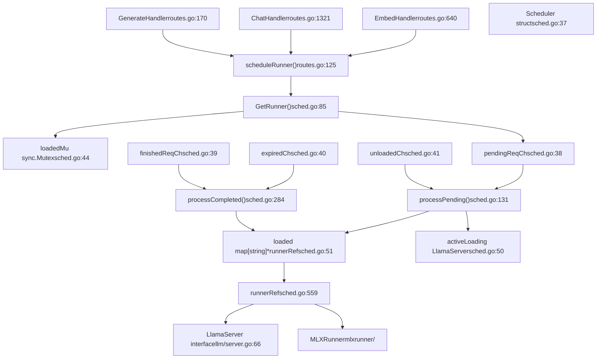
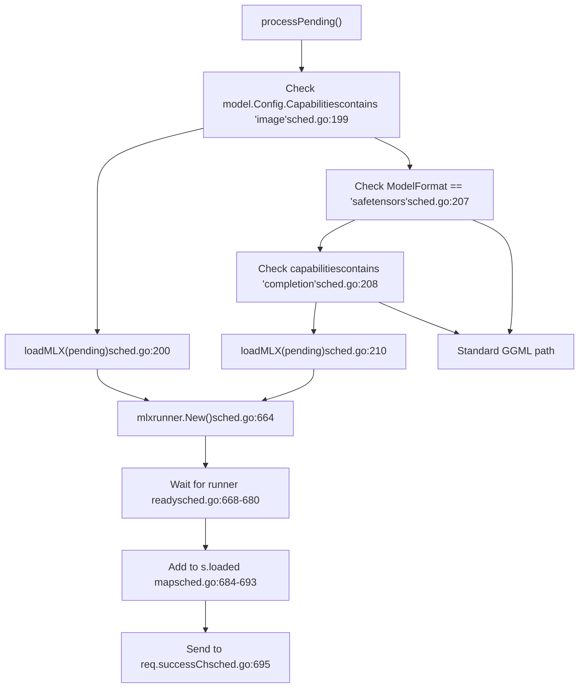
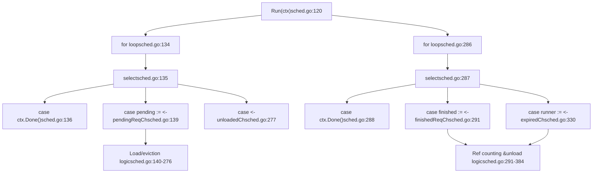
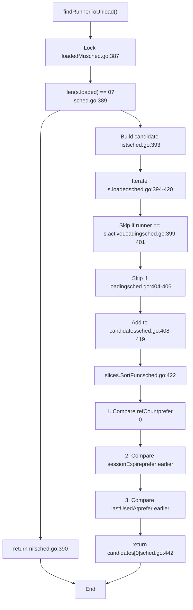
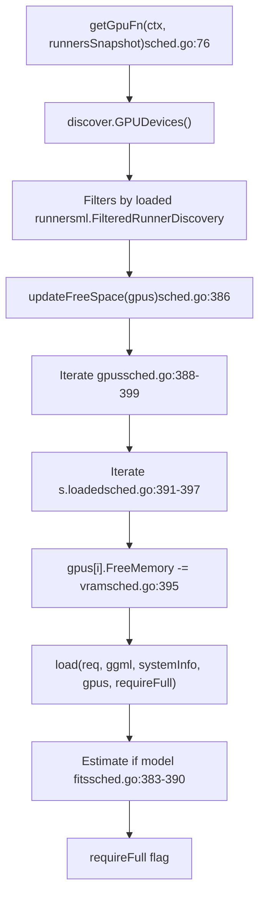
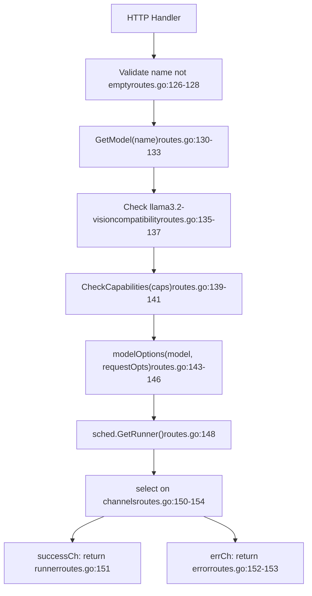

# 请求调度与 Runner 管理

相关源文件

-   [api/client.go](https://github.com/ollama/ollama/blob/562c76d7/api/client.go)
-   [api/client\_test.go](https://github.com/ollama/ollama/blob/562c76d7/api/client_test.go)
-   [api/types.go](https://github.com/ollama/ollama/blob/562c76d7/api/types.go)
-   [cmd/cmd.go](https://github.com/ollama/ollama/blob/562c76d7/cmd/cmd.go)
-   [envconfig/config.go](https://github.com/ollama/ollama/blob/562c76d7/envconfig/config.go)
-   [envconfig/config\_test.go](https://github.com/ollama/ollama/blob/562c76d7/envconfig/config_test.go)
-   [llm/server.go](https://github.com/ollama/ollama/blob/562c76d7/llm/server.go)
-   [server/images.go](https://github.com/ollama/ollama/blob/562c76d7/server/images.go)
-   [server/routes.go](https://github.com/ollama/ollama/blob/562c76d7/server/routes.go)
-   [server/sched.go](https://github.com/ollama/ollama/blob/562c76d7/server/sched.go)
-   [server/sched\_test.go](https://github.com/ollama/ollama/blob/562c76d7/server/sched_test.go)

## 目的与范围

本页描述 Ollama 的请求调度系统以及其管理模型 runner 的方式。调度器负责为传入请求分配模型推理 runner、管理这些 runner 的生命周期，并通过智能加载与卸载决策优化资源利用率。

有关向调度器提交请求的 HTTP API 端点信息，请参见 [HTTP 服务器与 API 层](/ollama/ollama/2.1-http-server-and-api-layer)。有关 runner 如何执行模型推理的细节，请参见 [模型执行流水线](/ollama/ollama/2.3-model-execution-pipeline)。

**来源：** [server/sched.go1-57](https://github.com/ollama/ollama/blob/562c76d7/server/sched.go#L1-L57) [server/routes.go120-163](https://github.com/ollama/ollama/blob/562c76d7/server/routes.go#L120-L163)

## 架构概览

调度系统由三层组成：接收请求的 HTTP handlers、负责编排 runner 分配的 `Scheduler`，以及执行模型推理的 runner 实现（`LlamaServer` 或 `MLXRunner`）。

### 核心组件及其关系


**来源：** [server/sched.go37-58](https://github.com/ollama/ollama/blob/562c76d7/server/sched.go#L37-L58) [server/routes.go125-157](https://github.com/ollama/ollama/blob/562c76d7/server/routes.go#L125-L157) [llm/server.go66-84](https://github.com/ollama/ollama/blob/562c76d7/llm/server.go#L66-L84) [x/mlxrunner/](https://github.com/ollama/ollama/blob/562c76d7/x/mlxrunner/)

### 关键数据结构

| 组件 | 类型 | 用途 | 位置 |
| --- | --- | --- | --- |
| `Scheduler` | struct | 编排 runner 分配与生命周期 | [server/sched.go37-58](https://github.com/ollama/ollama/blob/562c76d7/server/sched.go#L37-L58) |
| `LlmRequest` | struct | 表示一次 runner 请求 | [server/sched.go27-35](https://github.com/ollama/ollama/blob/562c76d7/server/sched.go#L27-L35) |
| `runnerRef` | struct | 通过引用计数和过期机制封装 runner | [server/sched.go559-583](https://github.com/ollama/ollama/blob/562c76d7/server/sched.go#L559-L583) |
| `LlamaServer` | interface | 定义模型推理执行 API | [llm/server.go66-84](https://github.com/ollama/ollama/blob/562c76d7/llm/server.go#L66-L84) |
| `loaded` | map\[string\]\*runnerRef | 将模型路径映射到活跃 runner | [server/sched.go51](https://github.com/ollama/ollama/blob/562c76d7/server/sched.go#L51-L51) |
| `activeLoading` | llm.LlamaServer | 跟踪当前正在加载的模型 | [server/sched.go50](https://github.com/ollama/ollama/blob/562c76d7/server/sched.go#L50-L50) |

`Scheduler` 维护若干用于依赖注入的函数指针：`loadFn`、`newServerFn`、`getGpuFn` 和 `getSystemInfoFn` [server/sched.go53-56](https://github.com/ollama/ollama/blob/562c76d7/server/sched.go#L53-L56)

**来源：** [server/sched.go27-58](https://github.com/ollama/ollama/blob/562c76d7/server/sched.go#L27-L58) [server/sched.go559-583](https://github.com/ollama/ollama/blob/562c76d7/server/sched.go#L559-L583) [llm/server.go66-84](https://github.com/ollama/ollama/blob/562c76d7/llm/server.go#L66-L84)

## 请求调度流程

### 高层请求路径

> **[Mermaid sequence]**
> *(图表结构无法解析)*

**来源：** [server/routes.go125-157](https://github.com/ollama/ollama/blob/562c76d7/server/routes.go#L125-L157) [server/sched.go85-117](https://github.com/ollama/ollama/blob/562c76d7/server/sched.go#L85-L117) [server/sched.go131-282](https://github.com/ollama/ollama/blob/562c76d7/server/sched.go#L131-L282) [server/sched.go284-330](https://github.com/ollama/ollama/blob/562c76d7/server/sched.go#L284-L330)

### GetRunner 方法

`GetRunner` 方法是获取 runner 的主入口。它为已加载 runner 提供快速路径，并为新加载提供排队机制：

1.  **校验**：确保最小上下文大小为 4 token [server/sched.go86-88](https://github.com/ollama/ollama/blob/562c76d7/server/sched.go#L86-L88) 对于多模态模型，最小值调整为 2048 token [server/sched.go90-93](https://github.com/ollama/ollama/blob/562c76d7/server/sched.go#L90-L93)
2.  **创建请求**：创建包含 context、model、options、session duration 以及结果通道的 `LlmRequest` [server/sched.go95-102](https://github.com/ollama/ollama/blob/562c76d7/server/sched.go#L95-L102)
3.  **快速路径检查**：加锁 `loadedMu`，检查 `loaded` map 中是否已有 runner [server/sched.go104-106](https://github.com/ollama/ollama/blob/562c76d7/server/sched.go#L104-L106)
4.  **重载决策**：调用 `needsReload()` 判断现有 runner 是否兼容 [server/sched.go107](https://github.com/ollama/ollama/blob/562c76d7/server/sched.go#L107-L107)
5.  **入队或返回**：若 runner 可用，则调用 `useLoadedRunner()` 增加引用计数并立即返回 [server/sched.go108](https://github.com/ollama/ollama/blob/562c76d7/server/sched.go#L108-L108) 否则入队到 `pendingReqCh` [server/sched.go110-115](https://github.com/ollama/ollama/blob/562c76d7/server/sched.go#L110-L115)

若队列已满，则立即返回 `ErrMaxQueue` [server/sched.go113](https://github.com/ollama/ollama/blob/562c76d7/server/sched.go#L113-L113)

**来源：** [server/sched.go85-117](https://github.com/ollama/ollama/blob/562c76d7/server/sched.go#L85-L117)

## Runner 生命周期管理

### Runner 状态与转换

> **[Mermaid stateDiagram]**
> *(图表结构无法解析)*

**来源：** [server/sched.go366-502](https://github.com/ollama/ollama/blob/562c76d7/server/sched.go#L366-L502) [server/sched.go503-557](https://github.com/ollama/ollama/blob/562c76d7/server/sched.go#L503-L557) [server/sched.go559-644](https://github.com/ollama/ollama/blob/562c76d7/server/sched.go#L559-L644) [server/sched.go284-330](https://github.com/ollama/ollama/blob/562c76d7/server/sched.go#L284-L330)

### 引用计数

每个 `runnerRef` 维护一个 `refCount` 来跟踪活跃请求：

-   **递增**：调用 `useLoadedRunner()` 且 runner 兼容时 [server/sched.go608-644](https://github.com/ollama/ollama/blob/562c76d7/server/sched.go#L608-L644) 该方法会锁定 `refMu`，递增 `refCount`，按需更新 `sessionDuration`，并记录 `lastUsedAt` [server/sched.go612-631](https://github.com/ollama/ollama/blob/562c76d7/server/sched.go#L612-L631)
-   **递减**：请求完成并向 `finishedReqCh` 发信号时 [server/sched.go291-302](https://github.com/ollama/ollama/blob/562c76d7/server/sched.go#L291-L302) 由 `processCompleted` goroutine 处理
-   **保护**：`refMu` `sync.Mutex` 保护对 `refCount`、`expireTimer` 及相关字段的所有访问 [server/sched.go560](https://github.com/ollama/ollama/blob/562c76d7/server/sched.go#L560-L560)

当 `refCount` 降为零时：

-   若 `sessionDuration <= 0`，runner 立即过期 [server/sched.go302-308](https://github.com/ollama/ollama/blob/562c76d7/server/sched.go#L302-L308)
-   若 `sessionDuration > 0`，启动 `expireTimer` [server/sched.go309-326](https://github.com/ollama/ollama/blob/562c76d7/server/sched.go#L309-L326) 计时器触发后会将 runner 发送到 `expiredCh`

**来源：** [server/sched.go559-583](https://github.com/ollama/ollama/blob/562c76d7/server/sched.go#L559-L583) [server/sched.go608-644](https://github.com/ollama/ollama/blob/562c76d7/server/sched.go#L608-L644) [server/sched.go291-330](https://github.com/ollama/ollama/blob/562c76d7/server/sched.go#L291-L330)

### Keep-Alive 与过期

过期系统控制空闲 runner 在内存中的保留时长：

| 配置 | 行为 | 代码位置 |
| --- | --- | --- |
| `sessionDuration > 0` | 当 refCount 降为 0 时启动计时器 | [server/sched.go309-326](https://github.com/ollama/ollama/blob/562c76d7/server/sched.go#L309-L326) |
| `sessionDuration = 0` | 空闲时立即过期 | [server/sched.go302-308](https://github.com/ollama/ollama/blob/562c76d7/server/sched.go#L302-L308) |
| `sessionDuration < 0` | 无限期保持加载 | [server/sched.go595-599](https://github.com/ollama/ollama/blob/562c76d7/server/sched.go#L595-L599) |

计时器由 `processCompleted` goroutine 管理 [server/sched.go284-330](https://github.com/ollama/ollama/blob/562c76d7/server/sched.go#L284-L330)：

-   请求结束且 `refCount` 变为 0 时，该 goroutine 会创建新计时器或重置已有计时器
-   计时器触发时，将 `runnerRef` 发送到 `expiredCh` [server/sched.go319](https://github.com/ollama/ollama/blob/562c76d7/server/sched.go#L319-L319)
-   `processCompleted` goroutine 从 `expiredCh` 接收后调用 `unload()` [server/sched.go330-384](https://github.com/ollama/ollama/blob/562c76d7/server/sched.go#L330-L384)

**来源：** [server/sched.go284-384](https://github.com/ollama/ollama/blob/562c76d7/server/sched.go#L284-L384) [server/sched.go503-557](https://github.com/ollama/ollama/blob/562c76d7/server/sched.go#L503-L557)

## MLX Runner 支持

调度器对基于 MLX 的 runner 进行了特殊处理，这类 runner 用于图像生成模型和实验性的 safetensors LLM 模型。

### MLX 加载路径


MLX runner 会绕过标准 GGML 加载路径，使用更简化的初始化流程 [server/sched.go663-698](https://github.com/ollama/ollama/blob/562c76d7/server/sched.go#L663-L698)

**来源：** [server/sched.go198-215](https://github.com/ollama/ollama/blob/562c76d7/server/sched.go#L198-L215) [server/sched.go663-698](https://github.com/ollama/ollama/blob/562c76d7/server/sched.go#L663-L698) [x/mlxrunner/](https://github.com/ollama/ollama/blob/562c76d7/x/mlxrunner/)

## 并发请求处理

### 处理 Goroutine

`Scheduler` 运行两个由 `Run()` 启动的主 goroutine：


两个 goroutine 都会在 context 被取消时退出 [server/sched.go136-138](https://github.com/ollama/ollama/blob/562c76d7/server/sched.go#L136-L138) [server/sched.go288-290](https://github.com/ollama/ollama/blob/562c76d7/server/sched.go#L288-L290)

**来源：** [server/sched.go120-129](https://github.com/ollama/ollama/blob/562c76d7/server/sched.go#L120-L129) [server/sched.go131-282](https://github.com/ollama/ollama/blob/562c76d7/server/sched.go#L131-L282) [server/sched.go284-384](https://github.com/ollama/ollama/blob/562c76d7/server/sched.go#L284-L384)

### 最大 Runner 数与容量管理

调度器通过 `OLLAMA_MAX_LOADED_MODELS` 限制并发加载模型数量：

1.  **动态默认值**：若未设置，默认为 `3 * number_of_gpus`，其中 3 为 `defaultModelsPerGPU` [server/sched.go63](https://github.com/ollama/ollama/blob/562c76d7/server/sched.go#L63-L63) [server/sched.go185-196](https://github.com/ollama/ollama/blob/562c76d7/server/sched.go#L185-L196)
2.  **容量检查**：在 `processPending` 中比较 `loadedCount` 与 `maxRunners` [server/sched.go170-172](https://github.com/ollama/ollama/blob/562c76d7/server/sched.go#L170-L172)
3.  **淘汰**：容量满时调用 `findRunnerToUnload()` 选择要淘汰的 runner [server/sched.go172](https://github.com/ollama/ollama/blob/562c76d7/server/sched.go#L172-L172)
4.  **强制过期**：将被淘汰对象的 `sessionDuration` 设为 0，停止已有计时器，若空闲则发送至 `expiredCh` [server/sched.go255-265](https://github.com/ollama/ollama/blob/562c76d7/server/sched.go#L255-L265)

容量检查发生在确认请求模型是否已有 runner 之后 [server/sched.go160-169](https://github.com/ollama/ollama/blob/562c76d7/server/sched.go#L160-L169)

**来源：** [server/sched.go132](https://github.com/ollama/ollama/blob/562c76d7/server/sched.go#L132-L132) [server/sched.go170-246](https://github.com/ollama/ollama/blob/562c76d7/server/sched.go#L170-L246) [envconfig/config.go245-246](https://github.com/ollama/ollama/blob/562c76d7/envconfig/config.go#L245-L246)

### 查找待卸载 Runner

`findRunnerToUnload()` 方法实现了基于优先级的选择算法：


排序优先级为：

1.  优先空闲 runner（`refCount == 0`）而非活跃 runner [server/sched.go424-428](https://github.com/ollama/ollama/blob/562c76d7/server/sched.go#L424-L428)
2.  更早的 `sessionExpire` 时间 [server/sched.go430-434](https://github.com/ollama/ollama/blob/562c76d7/server/sched.go#L430-L434)
3.  更早的 `lastUsedAt` 时间 [server/sched.go436-440](https://github.com/ollama/ollama/blob/562c76d7/server/sched.go#L436-L440)

**来源：** [server/sched.go386-444](https://github.com/ollama/ollama/blob/562c76d7/server/sched.go#L386-L444)

## 模型加载过程

### load 函数流程

`load()` 函数负责协调整个资源分配与模型 runner 启动过程：

> **[Mermaid sequence]**
> *(图表结构无法解析)*

**来源：** [server/sched.go366-502](https://github.com/ollama/ollama/blob/562c76d7/server/sched.go#L366-L502) [llm/server.go142-318](https://github.com/ollama/ollama/blob/562c76d7/llm/server.go#L142-L318)

### 并行请求配置

`numParallel` 参数控制单个 runner 可并发处理的推理序列数量：

-   **计算方式**：`numParallel = 1 + (NumCtx-1) / 2048` [server/sched.go376-381](https://github.com/ollama/ollama/blob/562c76d7/server/sched.go#L376-L381) 例如，当 `NumCtx = 4096` 时，`numParallel = 2`
-   **影响**：KV cache 大小变为 `NumCtx * numParallel` [llm/server.go174](https://github.com/ollama/ollama/blob/562c76d7/llm/server.go#L174-L174) 该值通过 `LoadRequest` 传入 [server/sched.go381](https://github.com/ollama/ollama/blob/562c76d7/server/sched.go#L381-L381)
-   **信号量**：runner 使用 `semaphore.NewWeighted(numParallel)` 限制并发 [llm/server.go280](https://github.com/ollama/ollama/blob/562c76d7/llm/server.go#L280-L280)

这使单个已加载模型可以同时服务多个请求，从而提升吞吐。该值在 `load()` 中计算并传给 `newServerFn` [server/sched.go392-396](https://github.com/ollama/ollama/blob/562c76d7/server/sched.go#L392-L396)

**来源：** [server/sched.go376-381](https://github.com/ollama/ollama/blob/562c76d7/server/sched.go#L376-L381) [server/sched.go392-396](https://github.com/ollama/ollama/blob/562c76d7/server/sched.go#L392-L396) [llm/server.go174](https://github.com/ollama/ollama/blob/562c76d7/llm/server.go#L174-L174) [llm/server.go280](https://github.com/ollama/ollama/blob/562c76d7/llm/server.go#L280-L280)

## 资源管理

### GPU 分配策略

调度器与 GPU 发现系统集成，以优化模型放置：


`getGpuFn` 调用时会传入已加载 runner 的快照 [server/sched.go154-157](https://github.com/ollama/ollama/blob/562c76d7/server/sched.go#L154-L157)，以便 GPU 发现逻辑进行适当过滤。对于仅 CPU 请求（`opts.NumGPU == 0`），会跳过 GPU 发现 [server/sched.go177-179](https://github.com/ollama/ollama/blob/562c76d7/server/sched.go#L177-L179)

**来源：** [server/sched.go176-182](https://github.com/ollama/ollama/blob/562c76d7/server/sched.go#L176-L182) [server/sched.go386-401](https://github.com/ollama/ollama/blob/562c76d7/server/sched.go#L386-L401) [server/sched.go154-157](https://github.com/ollama/ollama/blob/562c76d7/server/sched.go#L154-L157)

### 可用空间跟踪

`updateFreeSpace()` 方法会依据已加载 runner 调整 GPU 可用内存：

1.  **迭代**：遍历传入切片中的所有 GPU [server/sched.go388-399](https://github.com/ollama/ollama/blob/562c76d7/server/sched.go#L388-L399)
2.  **Runner 检查**：对每个 GPU，遍历全部已加载 runner [server/sched.go391-397](https://github.com/ollama/ollama/blob/562c76d7/server/sched.go#L391-L397)
3.  **内存扣减**：通过 `runner.VRAMByGPU(gpu.DeviceID)` 获取该 GPU 上 runner 占用显存，并从 `gpu.FreeMemory` 中扣减 [server/sched.go394-395](https://github.com/ollama/ollama/blob/562c76d7/server/sched.go#L394-L395)
4.  **多 GPU 支持**：通过逐个检查 device ID，处理跨多 GPU 分布的 runner

这确保调度器在决定是否加载新模型时，对可用内存有准确视图。该方法在获取 GPU 列表后、执行加载前调用 [server/sched.go227](https://github.com/ollama/ollama/blob/562c76d7/server/sched.go#L227-L227)

**来源：** [server/sched.go386-401](https://github.com/ollama/ollama/blob/562c76d7/server/sched.go#L386-L401) [server/sched.go227](https://github.com/ollama/ollama/blob/562c76d7/server/sched.go#L227-L227)

## 模型重载逻辑

### 重载决策条件

`needsReload()` 方法用于判断现有 runner 是否与新请求兼容：

| 条件 | 检查 | 结果 |
| --- | --- | --- |
| Context 已取消 | `ctx.Err() != nil` | 重载 [server/sched.go587-589](https://github.com/ollama/ollama/blob/562c76d7/server/sched.go#L587-L589) |
| 选项发生变化 | `!reflect.DeepEqual(req.opts, runner.llama.Options())` | 重载 [server/sched.go590-592](https://github.com/ollama/ollama/blob/562c76d7/server/sched.go#L590-L592) |
| Session 时长更长 | `req.sessionDuration != nil && *req.sessionDuration > runner.sessionDuration` | 更新，不重载 [server/sched.go595-599](https://github.com/ollama/ollama/blob/562c76d7/server/sched.go#L595-L599) |
| Adapter 变化 | `!slices.Equal(req.model.AdapterPaths, runner.llama.Adapters())` | 重载 [server/sched.go600-602](https://github.com/ollama/ollama/blob/562c76d7/server/sched.go#L600-L602) |
| Projector 变化 | `!slices.Equal(req.model.ProjectorPaths, runner.llama.Projectors())` | 重载 [server/sched.go603-605](https://github.com/ollama/ollama/blob/562c76d7/server/sched.go#L603-L605) |

比较逻辑对 options 使用 `reflect.DeepEqual()` [server/sched.go590](https://github.com/ollama/ollama/blob/562c76d7/server/sched.go#L590-L590)，对 adapter/projector 路径使用 `slices.Equal()` [server/sched.go600](https://github.com/ollama/ollama/blob/562c76d7/server/sched.go#L600-L600) [server/sched.go603](https://github.com/ollama/ollama/blob/562c76d7/server/sched.go#L603-L603)

**来源：** [server/sched.go585-607](https://github.com/ollama/ollama/blob/562c76d7/server/sched.go#L585-L607)

### 原位更新 Session Duration

当仅有 session duration 不同时，调度器会在不重载的情况下更新该值：

```
if runner.sessionDuration < *req.sessionDuration {    runner.sessionDuration = *req.sessionDuration}
```
该优化避免了客户端仅请求更长 keep-alive 时发生不必要的模型卸载/重载。

**来源：** [server/sched.go595-599](https://github.com/ollama/ollama/blob/562c76d7/server/sched.go#L595-L599)

## 错误处理与恢复

### 加载超时检测

调度器在模型加载期间实现了卡住检测：

1.  **计时器**：使用 `envconfig.LoadTimeout()` 创建计时器（默认 5 分钟）[server/sched.go408-409](https://github.com/ollama/ollama/blob/562c76d7/server/sched.go#L408-L409)
2.  **进度循环**：在循环中监控 `runner.loadProgress` 变化 [server/sched.go415-433](https://github.com/ollama/ollama/blob/562c76d7/server/sched.go#L415-L433)
3.  **停滞检测**：若超时周期内进度无变化，判定加载停滞 [server/sched.go425-433](https://github.com/ollama/ollama/blob/562c76d7/server/sched.go#L425-L433)
4.  **清理**：调用 `runner.llama.Close()` 并从 `loaded` map 删除 [server/sched.go442-452](https://github.com/ollama/ollama/blob/562c76d7/server/sched.go#L442-L452)
5.  **返回错误**：向 `req.errCh` 发送超时错误 [server/sched.go453-456](https://github.com/ollama/ollama/blob/562c76d7/server/sched.go#L453-L456)

超时时间可由 `OLLAMA_LOAD_TIMEOUT` 环境变量配置，负值/零值会被视为无限 [envconfig/config.go123-137](https://github.com/ollama/ollama/blob/562c76d7/envconfig/config.go#L123-L137)

**来源：** [server/sched.go402-456](https://github.com/ollama/ollama/blob/562c76d7/server/sched.go#L402-L456) [envconfig/config.go120-138](https://github.com/ollama/ollama/blob/562c76d7/envconfig/config.go#L120-L138)

### 加载失败后的恢复

当加载失败时，调度器会执行清理并允许重试：

1.  **错误传播**：向 `req.errCh` 发送错误 [server/sched.go467-470](https://github.com/ollama/ollama/blob/562c76d7/server/sched.go#L467-L470)
2.  **卸载清理**：若 runner 存在于 `loaded` map，则调用 `unload()` [server/sched.go460-465](https://github.com/ollama/ollama/blob/562c76d7/server/sched.go#L460-L465)
3.  **重试延迟**：在处理下一请求前等待 `waitForRecovery`（默认 5 秒）[server/sched.go471-481](https://github.com/ollama/ollama/blob/562c76d7/server/sched.go#L471-L481)
4.  **状态重置**：清空 `activeLoading` 以允许新的加载 [server/sched.go500-501](https://github.com/ollama/ollama/blob/562c76d7/server/sched.go#L500-L501)

重试延迟可通过 `Scheduler.waitForRecovery` 字段配置 [server/sched.go57](https://github.com/ollama/ollama/blob/562c76d7/server/sched.go#L57-L57)，可防止快速重试循环。延迟期间若 context 被取消，函数会提前返回 [server/sched.go476-478](https://github.com/ollama/ollama/blob/562c76d7/server/sched.go#L476-L478)

**来源：** [server/sched.go457-502](https://github.com/ollama/ollama/blob/562c76d7/server/sched.go#L457-L502) [server/sched.go57](https://github.com/ollama/ollama/blob/562c76d7/server/sched.go#L57-L57)

## 与 HTTP 层的集成

### scheduleRunner 方法

routes.go 中的 `scheduleRunner()` 方法负责将 HTTP 请求桥接到调度器：


执行的关键校验包括：

-   模型名非空 [server/routes.go126-128](https://github.com/ollama/ollama/blob/562c76d7/server/routes.go#L126-L128)
-   通过 `GetModel(name)` 确认模型存在 [server/routes.go130-133](https://github.com/ollama/ollama/blob/562c76d7/server/routes.go#L130-L133)
-   针对 llama3.2-vision 的兼容性特殊检查 [server/routes.go135-137](https://github.com/ollama/ollama/blob/562c76d7/server/routes.go#L135-L137)
-   模型支持请求能力 [server/routes.go139-141](https://github.com/ollama/ollama/blob/562c76d7/server/routes.go#L139-L141)
-   选项合法 [server/routes.go143-146](https://github.com/ollama/ollama/blob/562c76d7/server/routes.go#L143-L146)

**来源：** [server/routes.go125-157](https://github.com/ollama/ollama/blob/562c76d7/server/routes.go#L125-L157)

### 能力检查

在调度前，系统会通过 `model.CheckCapabilities(caps)` 校验模型是否支持请求操作：

| 能力 | 适用场景 | Handler 中的错误 |
| --- | --- | --- |
| `CapabilityCompletion` | `/api/generate` | "does not support generate" [server/routes.go373-376](https://github.com/ollama/ollama/blob/562c76d7/server/routes.go#L373-L376) |
| `CapabilityInsert` | generate 中的 suffix 参数 | "does not support insert"（由 CheckCapabilities 返回） |
| `CapabilityVision` | 图像输入 | "does not support vision"（由 CheckCapabilities 返回） |
| `CapabilityEmbedding` | `/api/embed` | 不适用（未检查） [server/sched.go681](https://github.com/ollama/ollama/blob/562c76d7/server/sched.go#L681-L681) |
| `CapabilityThinking` | Think 参数 | "does not support thinking" [server/routes.go366-369](https://github.com/ollama/ollama/blob/562c76d7/server/routes.go#L366-L369) |

这些能力由模型的 GGUF 文件或配置决定 [server/images.go75-141](https://github.com/ollama/ollama/blob/562c76d7/server/images.go#L75-L141)

**来源：** [server/routes.go354-378](https://github.com/ollama/ollama/blob/562c76d7/server/routes.go#L354-L378) [server/images.go75-141](https://github.com/ollama/ollama/blob/562c76d7/server/images.go#L75-L141) [server/sched.go681](https://github.com/ollama/ollama/blob/562c76d7/server/sched.go#L681-L681)

## 过期管理

### 通过 API 手动过期

客户端可通过发送空 prompt 且 `KeepAlive.Duration = 0` 的请求显式卸载模型：

```
if req.Prompt == "" && req.KeepAlive != nil && req.KeepAlive.Duration == 0 {    s.sched.expireRunner(m)    // Return success response with DoneReason: "unload"}
```
`expireRunner()` 方法会锁定 runner，停止现有计时器，将 `sessionDuration` 置为 0，并在 runner 空闲（`refCount <= 0`）时立即发送到 `expiredCh` [server/sched.go646-659](https://github.com/ollama/ollama/blob/562c76d7/server/sched.go#L646-L659) 这使客户端可以显式释放资源。

**来源：** [server/routes.go311-322](https://github.com/ollama/ollama/blob/562c76d7/server/routes.go#L311-L322) [server/sched.go644-661](https://github.com/ollama/ollama/blob/562c76d7/server/sched.go#L644-L661)

### 关闭时自动清理

当服务器 context 被取消时，所有 goroutine 退出，runner 将被隐式关闭。调度器不执行显式清理，资源释放由进程终止处理。

**来源：** [server/sched.go135-137](https://github.com/ollama/ollama/blob/562c76d7/server/sched.go#L135-L137) [server/sched.go268-270](https://github.com/ollama/ollama/blob/562c76d7/server/sched.go#L268-L270)

## 性能考量

### 通道缓冲区大小

调度器使用按 `envconfig.MaxQueue()` 定长的缓冲通道：

```
pendingReqCh:    make(chan *LlmRequest, maxQueue),finishedReqCh:   make(chan *LlmRequest, maxQueue),expiredCh:       make(chan *runnerRef, maxQueue),unloadedCh:      make(chan any, maxQueue),
```
默认 `MaxQueue` 为 512 [envconfig/config.go248](https://github.com/ollama/ollama/blob/562c76d7/envconfig/config.go#L248-L248)，可在阻塞前提供较大请求缓冲。当 `pendingReqCh` 满时，`GetRunner` 会立即返回 `ErrMaxQueue` [server/sched.go113-114](https://github.com/ollama/ollama/blob/562c76d7/server/sched.go#L113-L114)

**来源：** [server/sched.go69-73](https://github.com/ollama/ollama/blob/562c76d7/server/sched.go#L69-L73) [envconfig/config.go248](https://github.com/ollama/ollama/blob/562c76d7/envconfig/config.go#L248-L248) [server/sched.go113-114](https://github.com/ollama/ollama/blob/562c76d7/server/sched.go#L113-L114)

### 锁竞争管理

`loadedMu` 互斥锁保护 `loaded` map 和 `activeLoading` 字段 [server/sched.go44](https://github.com/ollama/ollama/blob/562c76d7/server/sched.go#L44-L44) 关键区被尽量缩小：

-   **短临界区**：大多数操作仅执行快速检查/更新后即释放
-   **快照模式**：`processPending` 在释放锁前创建 runner 快照 [server/sched.go151-158](https://github.com/ollama/ollama/blob/562c76d7/server/sched.go#L151-L158)：`runnersSnapshot := make([]ml.FilteredRunnerDiscovery, 0, len(s.loaded))`
-   **I/O 不持锁**：加载与卸载在临界区外执行；调用 `load()` 或 `unload()` 前会释放锁

每个 `runnerRef` 拥有独立的 `refMu` 互斥锁 [server/sched.go560](https://github.com/ollama/ollama/blob/562c76d7/server/sched.go#L560-L560)，用于保护引用计数和计时器字段，实现更细粒度加锁。

**来源：** [server/sched.go44](https://github.com/ollama/ollama/blob/562c76d7/server/sched.go#L44-L44) [server/sched.go151-158](https://github.com/ollama/ollama/blob/562c76d7/server/sched.go#L151-L158) [server/sched.go560](https://github.com/ollama/ollama/blob/562c76d7/server/sched.go#L560-L560)

### 快速路径优化

`GetRunner()` 的快速路径可在兼容 runner 已加载时绕过排队并立即返回：

```
runner := s.loaded[req.model.ModelPath]if runner != nil && !runner.needsReload(c, req) {    req.useLoadedRunner(runner, s.finishedReqCh)    return req.successCh, req.errCh}
```
这在重复请求同一模型的常见场景下可显著降低延迟。

**来源：** [server/sched.go103-108](https://github.com/ollama/ollama/blob/562c76d7/server/sched.go#L103-L108)
