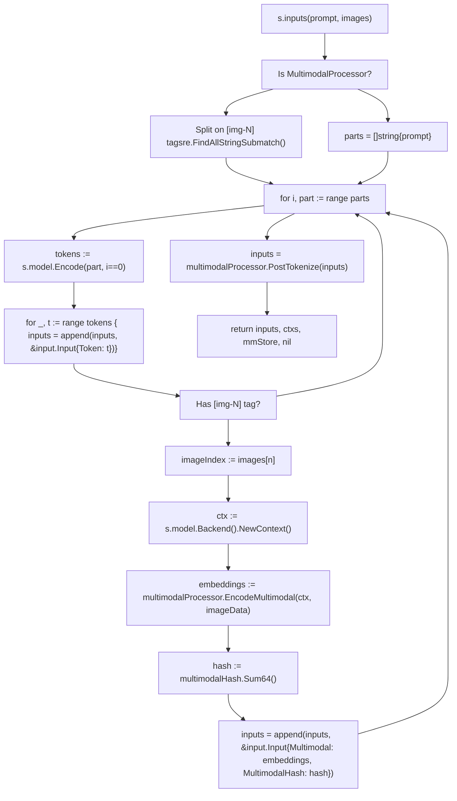
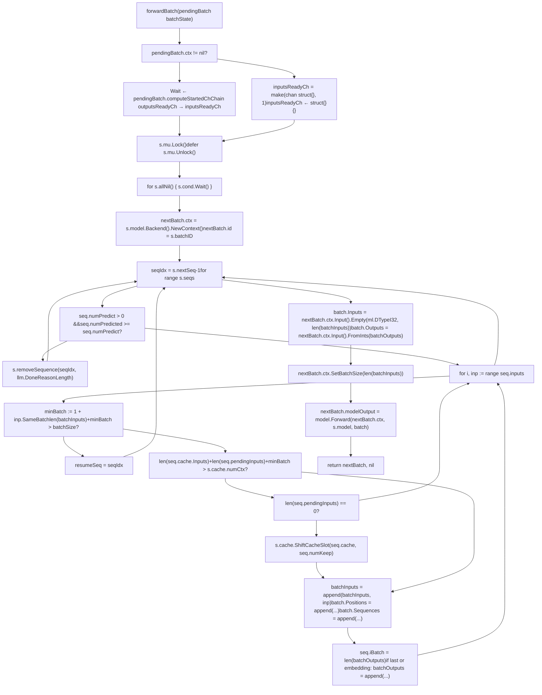
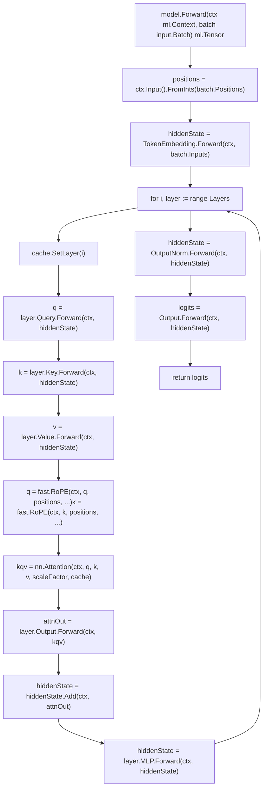
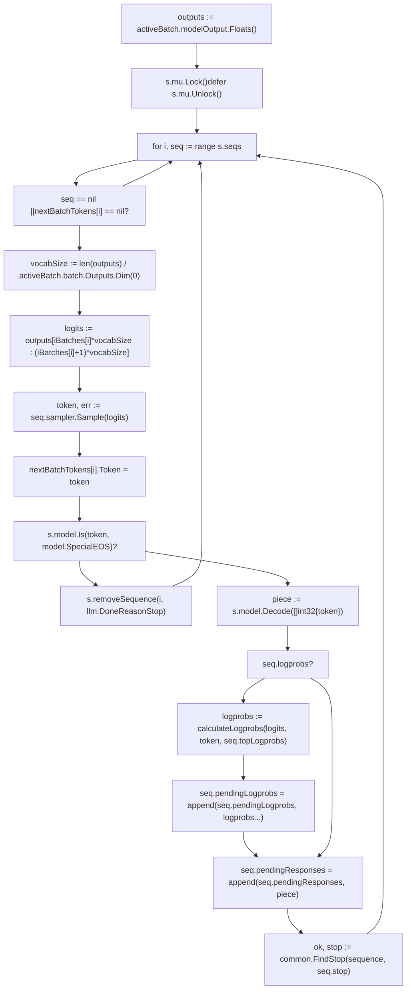
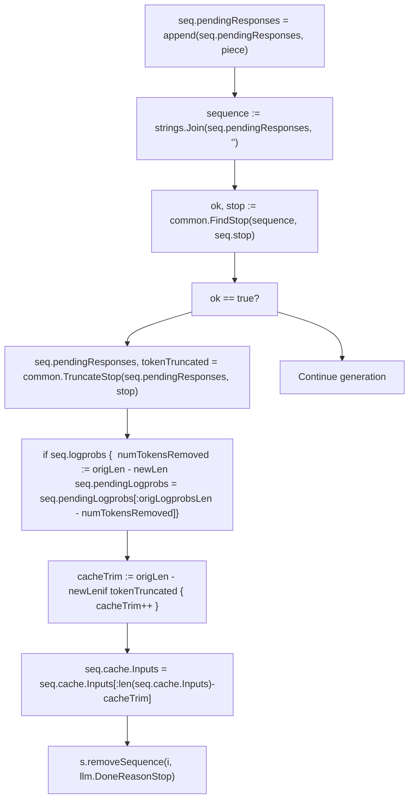
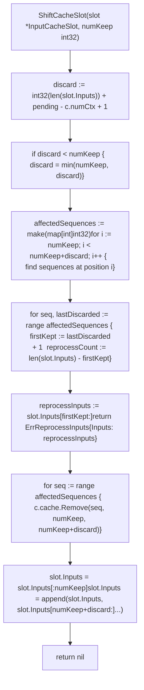
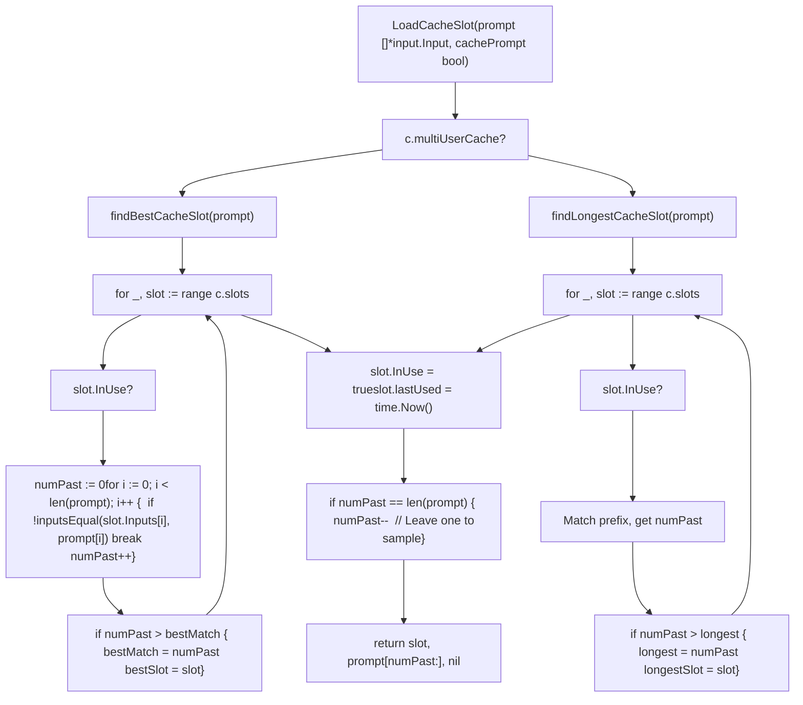
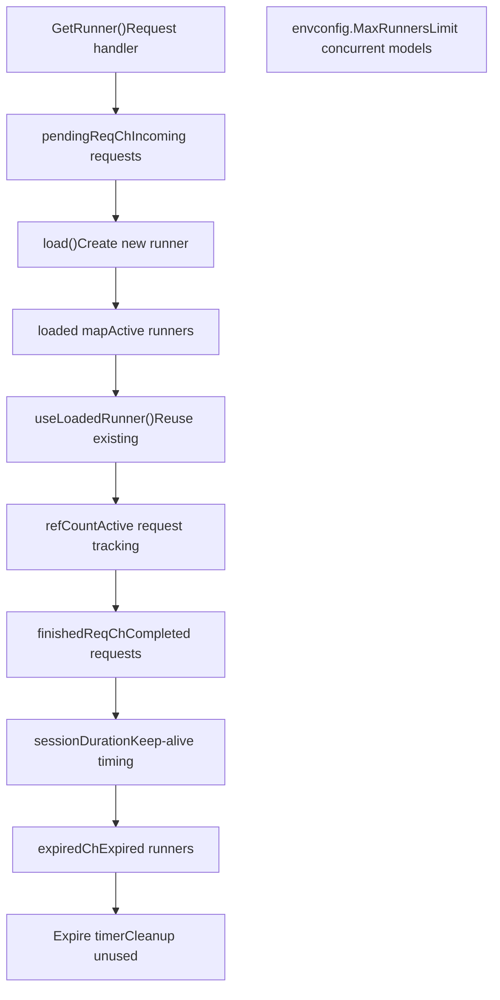

# 模型执行流水线

相关源文件

-   [api/client.go](https://github.com/ollama/ollama/blob/562c76d7/api/client.go)
-   [api/client\_test.go](https://github.com/ollama/ollama/blob/562c76d7/api/client_test.go)
-   [api/types.go](https://github.com/ollama/ollama/blob/562c76d7/api/types.go)
-   [cmd/cmd.go](https://github.com/ollama/ollama/blob/562c76d7/cmd/cmd.go)
-   [integration/embed\_test.go](https://github.com/ollama/ollama/blob/562c76d7/integration/embed_test.go)
-   [kvcache/cache.go](https://github.com/ollama/ollama/blob/562c76d7/kvcache/cache.go)
-   [kvcache/causal.go](https://github.com/ollama/ollama/blob/562c76d7/kvcache/causal.go)
-   [kvcache/causal\_test.go](https://github.com/ollama/ollama/blob/562c76d7/kvcache/causal_test.go)
-   [kvcache/encoder.go](https://github.com/ollama/ollama/blob/562c76d7/kvcache/encoder.go)
-   [kvcache/wrapper.go](https://github.com/ollama/ollama/blob/562c76d7/kvcache/wrapper.go)
-   [llama/llama.go](https://github.com/ollama/ollama/blob/562c76d7/llama/llama.go)
-   [llama/sampling\_ext.cpp](https://github.com/ollama/ollama/blob/562c76d7/llama/sampling_ext.cpp)
-   [llama/sampling\_ext.h](https://github.com/ollama/ollama/blob/562c76d7/llama/sampling_ext.h)
-   [ml/backend.go](https://github.com/ollama/ollama/blob/562c76d7/ml/backend.go)
-   [ml/backend/ggml/ggml.go](https://github.com/ollama/ollama/blob/562c76d7/ml/backend/ggml/ggml.go)
-   [model/input/input.go](https://github.com/ollama/ollama/blob/562c76d7/model/input/input.go)
-   [model/model.go](https://github.com/ollama/ollama/blob/562c76d7/model/model.go)
-   [model/model\_test.go](https://github.com/ollama/ollama/blob/562c76d7/model/model_test.go)
-   [runner/llamarunner/cache.go](https://github.com/ollama/ollama/blob/562c76d7/runner/llamarunner/cache.go)
-   [runner/llamarunner/runner.go](https://github.com/ollama/ollama/blob/562c76d7/runner/llamarunner/runner.go)
-   [runner/ollamarunner/cache.go](https://github.com/ollama/ollama/blob/562c76d7/runner/ollamarunner/cache.go)
-   [runner/ollamarunner/cache\_test.go](https://github.com/ollama/ollama/blob/562c76d7/runner/ollamarunner/cache_test.go)
-   [runner/ollamarunner/runner.go](https://github.com/ollama/ollama/blob/562c76d7/runner/ollamarunner/runner.go)
-   [server/images.go](https://github.com/ollama/ollama/blob/562c76d7/server/images.go)
-   [server/internal/internal/backoff/backoff.go](https://github.com/ollama/ollama/blob/562c76d7/server/internal/internal/backoff/backoff.go)
-   [server/routes.go](https://github.com/ollama/ollama/blob/562c76d7/server/routes.go)

本页追踪从 API 请求开始，经过分词、批处理、前向计算、采样到响应流式返回的完整执行路径。重点是模型已加载并完成调度后的运行时推理路径。

有关 HTTP API 层细节，请参见 2.1。有关模型加载与 GPU 调度，请参见 2.2。有关模型存储与分发，请参见 2.4。

## 概览

执行流水线按以下阶段处理推理请求：

1.  **序列创建** - `NewSequence()` 对提示词进行分词并编码多模态输入
2.  **批构建** - `forwardBatch()` 汇聚各序列中的待处理输入
3.  **前向计算** - `computeBatch()` 在后端执行模型计算
4.  **Token 采样** - `sampler.Sample()` 从 logits 中选择下一个 token
5.  **响应流式返回** - token 通过 `responses` 通道发送给客户端

存在两种 runner 实现：

-   **ollamarunner** [runner/ollamarunner/runner.go](https://github.com/ollama/ollama/blob/562c76d7/runner/ollamarunner/runner.go) - 采用双阶段流水线的异步批处理
-   **llamarunner** [runner/llamarunner/runner.go](https://github.com/ollama/ollama/blob/562c76d7/runner/llamarunner/runner.go) - 基于 llama.cpp 绑定的同步执行

ollamarunner 可将批准备与 GPU 计算重叠，以提高吞吐。llamarunner 提供与 llama.cpp 生态的兼容性，并用于某些模型架构。

### Runner 架构对比

**Runner 实现对比**

```mermaid
flowchart TD
    OR_Server["Server"]
    OR_run["run()"]
    OR_forwardBatch["forwardBatch()"]
    OR_computeBatch["computeBatch()"]
    OR_model["model.Forward()"]
    LR_Server["Server"]
    LR_run["run()"]
    LR_processBatch["processBatch()"]
    LR_llamaDecode["llama.Decode()"]
    Backend_ggml["ml/backend/ggml"]
    Backend_llama["llama/llama.go"]

    OR --> Server_OR_run
    OR --> run_OR_forwardBatch
    OR --> run_OR_computeBatch
    OR --> forwardBatch_OR_model
    LR --> Server_LR_run
    LR --> run_LR_processBatch
    LR --> processBatch_LR_llamaDecode
    OR --> model_Backend_ggml
    LR --> llamaDecode_Backend_llama
```


| 组件 | ollamarunner | llamarunner |
| --- | --- | --- |
| **入口** | `Server.run()` [runner/ollamarunner/runner.go440](https://github.com/ollama/ollama/blob/562c76d7/runner/ollamarunner/runner.go#L440-L440) | `Server.run()` [runner/llamarunner/runner.go358](https://github.com/ollama/ollama/blob/562c76d7/runner/llamarunner/runner.go#L358-L358) |
| **批构建** | `forwardBatch()` 异步 | `processBatch()` 同步 |
| **前向计算** | 通过 ml.Backend 调用 `model.Forward()` | 通过 CGO 调用 `llama.Decode()` |
| **状态管理** | 带通道的 `batchState` 结构体 | 在 `processBatch()` 中内联管理 |
| **并发模型** | 批准备与计算重叠 | 顺序执行 |

来源： [runner/ollamarunner/runner.go440-466](https://github.com/ollama/ollama/blob/562c76d7/runner/ollamarunner/runner.go#L440-L466) [runner/llamarunner/runner.go358-400](https://github.com/ollama/ollama/blob/562c76d7/runner/llamarunner/runner.go#L358-L400) [llama/llama.go168-184](https://github.com/ollama/ollama/blob/562c76d7/llama/llama.go#L168-L184)

### 关键数据结构

**Server struct** [runner/ollamarunner/runner.go304-361](https://github.com/ollama/ollama/blob/562c76d7/runner/ollamarunner/runner.go#L304-L361)：

| 字段 | 类型 | 用途 |
| --- | --- | --- |
| `model` | `model.Model` | 已加载模型实例 |
| `seqs` | `[]*Sequence` | 当前正在处理的活跃序列 |
| `cache` | `*InputCache` | 跨序列的 KV cache 管理器 |
| `mu` | `sync.Mutex` | 保护序列状态 |
| `cond` | `*sync.Cond` | 序列新增时唤醒 `run()` |
| `batchSize` | `int` | 每批最大 token 数 |
| `parallel` | `int` | 最大并发序列数 |

**Sequence struct** [runner/ollamarunner/runner.go50-115](https://github.com/ollama/ollama/blob/562c76d7/runner/ollamarunner/runner.go#L50-L115)：

| 字段 | 类型 | 用途 |
| --- | --- | --- |
| `inputs` | `[]*input.Input` | 尚未处理的 token/embedding |
| `pendingInputs` | `[]*input.Input` | 已加入当前批的 token |
| `cache` | `*InputCacheSlot` | 分配的 KV cache 槽位 |
| `responses` | `chan response` | 输出给客户端的 token 流 |
| `sampler` | `sample.Sampler` | token 选择逻辑 |
| `iBatch` | `int` | 在批输出数组中的位置 |
| `numPredict` | `int` | 最大生成 token 数 |

来源： [runner/ollamarunner/runner.go304-361](https://github.com/ollama/ollama/blob/562c76d7/runner/ollamarunner/runner.go#L304-L361) [runner/ollamarunner/runner.go50-115](https://github.com/ollama/ollama/blob/562c76d7/runner/ollamarunner/runner.go#L50-L115)

## 请求处理流程

### 入口与序列创建

请求通过 `LlamaServer` 接口上的 `Completion()` [llm/server.go66-83](https://github.com/ollama/ollama/blob/562c76d7/llm/server.go#L66-L83) 进入：

**请求在 Server 中的流转**

> **[Mermaid sequence]**
> *(图表结构无法解析)*

来源： [llm/server.go66-83](https://github.com/ollama/ollama/blob/562c76d7/llm/server.go#L66-L83) [runner/ollamarunner/runner.go131-210](https://github.com/ollama/ollama/blob/562c76d7/runner/ollamarunner/runner.go#L131-L210)

### 输入处理与分词

`inputs()` 方法 [runner/ollamarunner/runner.go221-297](https://github.com/ollama/ollama/blob/562c76d7/runner/ollamarunner/runner.go#L221-L297) 将提示词和图像转换为 `[]*input.Input`：

**输入处理流程**


**input.Input struct** [model/input/input.go9-20](https://github.com/ollama/ollama/blob/562c76d7/model/input/input.go#L9-L20)：

| 字段 | 类型 | 用途 |
| --- | --- | --- |
| `Token` | `int32` | 文本 token ID |
| `Multimodal` | `[]Multimodal` | 编码器产生的视觉嵌入 |
| `MultimodalHash` | `uint64` | 用于缓存嵌入的哈希 |
| `SameBatch` | `int` | 强制后续 N 个 token 进入同一批 |

来源： [runner/ollamarunner/runner.go221-297](https://github.com/ollama/ollama/blob/562c76d7/runner/ollamarunner/runner.go#L221-L297) [model/input/input.go9-20](https://github.com/ollama/ollama/blob/562c76d7/model/input/input.go#L9-L20)

## 批处理系统

### 双阶段批处理

`run()` 方法 [runner/ollamarunner/runner.go440-466](https://github.com/ollama/ollama/blob/562c76d7/runner/ollamarunner/runner.go#L440-L466) 在 `forwardBatch()` 与 `computeBatch()` 之间交替执行：

**批流水线同步示意图**

> **[Mermaid sequence]**
> *(图表结构无法解析)*

**batchState struct** [runner/ollamarunner/runner.go273-302](https://github.com/ollama/ollama/blob/562c76d7/runner/ollamarunner/runner.go#L273-L302)：

| 字段 | 类型 | 用途 |
| --- | --- | --- |
| `id` | `int` | 跟踪日志计数器 |
| `ctx` | `ml.Context` | 来自 `model.Backend().NewContext()` 的后端上下文 |
| `modelOutput` | `ml.Tensor` | 输出 logits 张量 |
| `batchInputs` | `[]*input.Input` | 输入指针（token 值后填充） |
| `batch` | `input.Batch` | 包含 `Positions`、`Sequences` 的输入批 |
| `seqs` | `[]*Sequence` | 活跃序列快照 |
| `inputsReadyCh` | `chan struct{}` | 标记 token 值已就绪 |
| `computeStartedCh` | `chan struct{}` | 标记前向计算已开始 |
| `outputsReadyCh` | `chan struct{}` | 标记输出可用 |

`supportsAsync` 标志检查 `pooling.Type == pooling.TypeNone` [runner/ollamarunner/runner.go443](https://github.com/ollama/ollama/blob/562c76d7/runner/ollamarunner/runner.go#L443-L443)

来源： [runner/ollamarunner/runner.go273-302](https://github.com/ollama/ollama/blob/562c76d7/runner/ollamarunner/runner.go#L273-L302) [runner/ollamarunner/runner.go440-466](https://github.com/ollama/ollama/blob/562c76d7/runner/ollamarunner/runner.go#L440-L466) [runner/ollamarunner/runner.go612-850](https://github.com/ollama/ollama/blob/562c76d7/runner/ollamarunner/runner.go#L612-L850)

### 构建批次

`forwardBatch()` 方法 [runner/ollamarunner/runner.go469-638](https://github.com/ollama/ollama/blob/562c76d7/runner/ollamarunner/runner.go#L469-L638) 用于构建下一批：

**forwardBatch() 实现图**


**批处理约束：**

-   `batchSize`（来自 `s.batchSize`）限制每批 token 数
-   `inp.SameBatch` 强制后续 token 同批
-   超过 `s.cache.numCtx` 时触发 `ShiftCacheSlot()`
-   `s.nextSeq` 实现轮转，防止饥饿

**input.Batch struct** [model/input/input.go22-28](https://github.com/ollama/ollama/blob/562c76d7/model/input/input.go#L22-L28)：

| 字段 | 类型 | 描述 |
| --- | --- | --- |
| `Inputs` | `ml.Tensor` | token ID 张量（形状：`[len(Positions)]`） |
| `Outputs` | `ml.Tensor` | 需要输出 logits 的 token 索引 |
| `Positions` | `[]int32` | 每个 token 在序列中的位置 |
| `Sequences` | `[]int` | 每个 token 的序列 ID |
| `Multimodal` | `[]MultimodalIndex` | 多模态数据附加信息 |

来源： [runner/ollamarunner/runner.go469-638](https://github.com/ollama/ollama/blob/562c76d7/runner/ollamarunner/runner.go#L469-L638) [model/input/input.go22-28](https://github.com/ollama/ollama/blob/562c76d7/model/input/input.go#L22-L28)

### 并发序列处理

多个序列在精细同步下并发处理：

> **[Mermaid stateDiagram]**
> *(图表结构无法解析)*

每个序列维护：

-   `inputs`：待处理 token
-   `pendingInputs`：当前批中的 token
-   `iBatch`：用于采样的批输出索引

来源： [runner/ollamarunner/runner.go44-102](https://github.com/ollama/ollama/blob/562c76d7/runner/ollamarunner/runner.go#L44-L102) [runner/ollamarunner/runner.go481-575](https://github.com/ollama/ollama/blob/562c76d7/runner/ollamarunner/runner.go#L481-L575)

## 前向计算执行

### 计算图构建

`model.Forward()` 方法 [model/model.go35-36](https://github.com/ollama/ollama/blob/562c76d7/model/model.go#L35-L36) 负责构建计算图：

**模型前向计算图构建示意图**


该图是符号图——张量表示操作而非数据。操作通过 `ctx.Forward()` 调用记录：

```
ctx.Forward(tensor1, tensor2, ...)  // Marks tensors for computation
```
图构建发生在 `forwardBatch()` [runner/ollamarunner/runner.go629-634](https://github.com/ollama/ollama/blob/562c76d7/runner/ollamarunner/runner.go#L629-L634)，执行发生在 `computeBatch()` 中，通过 `ctx.Compute()` 完成 [runner/ollamarunner/runner.go722-728](https://github.com/ollama/ollama/blob/562c76d7/runner/ollamarunner/runner.go#L722-L728)

来源： [model/models/llama/model.go125-142](https://github.com/ollama/ollama/blob/562c76d7/model/models/llama/model.go#L125-L142) [runner/ollamarunner/runner.go629-634](https://github.com/ollama/ollama/blob/562c76d7/runner/ollamarunner/runner.go#L629-L634) [ml/backend/ggml/ggml.go794-804](https://github.com/ollama/ollama/blob/562c76d7/ml/backend/ggml/ggml.go#L794-L804)

### 后端执行

`computeBatch()` 方法 [runner/ollamarunner/runner.go642-850](https://github.com/ollama/ollama/blob/562c76d7/runner/ollamarunner/runner.go#L642-L850) 用于执行计算图：

**computeBatch() 执行流程图**

> **[Mermaid sequence]**
> *(图表结构无法解析)*

**后端调度**（GGML）：

`Context.Compute()` [ml/backend/ggml/ggml.go810-843](https://github.com/ollama/ollama/blob/562c76d7/ml/backend/ggml/ggml.go#L810-L843) 会调用：

1.  `C.ggml_backend_sched_set_batch_size()` - 设置 batch 提示
2.  `C.ggml_backend_sched_graph_compute_async()` - 在 GPU/CPU 上执行图
3.  在张量读取时等待同步完成

在模型加载阶段，张量会依据 `GPULayers` 配置分配到不同设备 [ml/backend/ggml/ggml.go203-229](https://github.com/ollama/ollama/blob/562c76d7/ml/backend/ggml/ggml.go#L203-L229)

来源： [runner/ollamarunner/runner.go642-850](https://github.com/ollama/ollama/blob/562c76d7/runner/ollamarunner/runner.go#L642-L850) [ml/backend/ggml/ggml.go810-843](https://github.com/ollama/ollama/blob/562c76d7/ml/backend/ggml/ggml.go#L810-L843) [ml/backend/ggml/ggml.go203-229](https://github.com/ollama/ollama/blob/562c76d7/ml/backend/ggml/ggml.go#L203-L229)

## Token 生成与采样

### 从 Logits 采样

在前向计算之后，`computeBatch()` 中会执行 token 采样 [runner/ollamarunner/runner.go758-787](https://github.com/ollama/ollama/blob/562c76d7/runner/ollamarunner/runner.go#L758-L787)：

**Token 采样实现图**


**sample.Sampler 接口** [sample/sampler.go9-11](https://github.com/ollama/ollama/blob/562c76d7/sample/sampler.go#L9-L11)：

```
type Sampler interface {    Sample(logits []float32) (int32, error)}
```
在 `sampler.Sample()` 中应用的采样参数：

| 变换 | 位置 | 作用 |
| --- | --- | --- |
| Frequency/Presence Penalty | `Logits()` | 按出现次数惩罚近期 token |
| Temperature | `Logits()` | 缩放 logits：`logit /= temperature` |
| Min-P Filter | `Candidates()` | 移除 `p < min_p * max_p` 的 token |
| Top-K Filter | `Candidates()` | 仅保留概率最高的 K 个 token |
| Top-P (Nucleus) | `Candidates()` | 按累计概率截断 |
| Final Selection | `Sample()` | 在过滤后分布上做多项式采样 |

来源： [runner/ollamarunner/runner.go758-787](https://github.com/ollama/ollama/blob/562c76d7/runner/ollamarunner/runner.go#L758-L787) [sample/sampler.go9-11](https://github.com/ollama/ollama/blob/562c76d7/sample/sampler.go#L9-L11) [sample/sample.go](https://github.com/ollama/ollama/blob/562c76d7/sample/sample.go)

### 停止序列检测

停止序列在 `computeBatch()` 中检查 [runner/ollamarunner/runner.go792-838](https://github.com/ollama/ollama/blob/562c76d7/runner/ollamarunner/runner.go#L792-L838)：

**停止序列检测实现图**


**common.FindStop()** [runner/common/common.go12-38](https://github.com/ollama/ollama/blob/562c76d7/runner/common/common.go#L12-L38)：

-   遍历 `seq.stop` 字符串列表
-   若在 `sequence` 中找到 `stopStr`，返回 `true, stopStr`
-   若无匹配，返回 `false, ""`

**common.TruncateStop()** [runner/common/common.go40-67](https://github.com/ollama/ollama/blob/562c76d7/runner/common/common.go#L40-L67)：

-   从 `pendingResponses` 中移除停止序列
-   若移除了部分 token，返回 `tokenTruncated=true`
-   确保 UTF-8 有效：`for !utf8.ValidString(joined) { joined = joined[:len(joined)-1] }`

**缓存一致性：** 当检测到停止序列时，会修剪 cache 以移除不会返回给客户端的已生成 token [runner/ollamarunner/runner.go815-823](https://github.com/ollama/ollama/blob/562c76d7/runner/ollamarunner/runner.go#L815-L823)

来源： [runner/ollamarunner/runner.go792-838](https://github.com/ollama/ollama/blob/562c76d7/runner/ollamarunner/runner.go#L792-L838) [runner/common/common.go12-67](https://github.com/ollama/ollama/blob/562c76d7/runner/common/common.go#L12-L67)

## 响应流式返回

### 向客户端流式发送 Token

token 通过 `seq.responses` 通道发送，并在 `Completion()` 中读取 [llm/server.go1128-1176](https://github.com/ollama/ollama/blob/562c76d7/llm/server.go#L1128-L1176)：

**响应流式流程图**

> **[Mermaid sequence]**
> *(图表结构无法解析)*

**flushPending()** [runner/ollamarunner/runner.go372-396](https://github.com/ollama/ollama/blob/562c76d7/runner/ollamarunner/runner.go#L372-L396)：

```
func flushPending(seq *Sequence) bool {    joined := strings.Join(seq.pendingResponses, "")    logprobs := seq.pendingLogprobs    seq.pendingResponses = []string{}    seq.pendingLogprobs = []llm.Logprob{}        // Strip invalid UTF-8    for !utf8.ValidString(joined) {        joined = joined[:len(joined)-1]    }        if len(joined) == 0 { return true }        select {    case seq.responses <- response{content: joined, logprobs: logprobs}:        return true    case <-seq.quit:        return false  // Client disconnected    }}
```
**CompletionResponse 字段** [api/types.go65-86](https://github.com/ollama/ollama/blob/562c76d7/api/types.go#L65-L86)：

| 字段 | 类型 | 用途 |
| --- | --- | --- |
| `Model` | `string` | 模型名称 |
| `Response` | `string` | 生成文本片段 |
| `Done` | `bool` | 完成标志 |
| `DoneReason` | `string` | "stop"、"length" 等 |
| `Context` | `[]int` | 用于续写的 token 上下文 |
| `PromptEvalCount` | `int` | 已处理提示词 token 数 |
| `EvalCount` | `int` | 已生成 token 数 |
| `TotalDuration` | `time.Duration` | 端到端耗时 |

来源： [runner/ollamarunner/runner.go372-396](https://github.com/ollama/ollama/blob/562c76d7/runner/ollamarunner/runner.go#L372-L396) [llm/server.go1128-1176](https://github.com/ollama/ollama/blob/562c76d7/llm/server.go#L1128-L1176) [api/types.go65-86](https://github.com/ollama/ollama/blob/562c76d7/api/types.go#L65-L86)

### 指标采集

执行过程中会持续跟踪时序指标：

| 指标 | 追踪内容 | 来源 |
| --- | --- | --- |
| `PromptEvalCount` | 提示词 token 数量 | `seq.numPromptInputs` |
| `PromptEvalDuration` | 处理提示词耗时 | `seq.processingDuration` |
| `EvalCount` | 生成 token 数量 | `seq.numPredicted` |
| `EvalDuration` | 生成 token 耗时 | `seq.samplingDuration` |
| `LoadDuration` | 模型加载耗时 | `time.Since(s.loadStart)` |

来源： [runner/ollamarunner/runner.go96-101](https://github.com/ollama/ollama/blob/562c76d7/runner/ollamarunner/runner.go#L96-L101) [llm/server.go1160-1176](https://github.com/ollama/ollama/blob/562c76d7/llm/server.go#L1160-L1176)

## KV Cache 管理

### Cache 结构与操作

`InputCache` [runner/ollamarunner/cache.go16-32](https://github.com/ollama/ollama/blob/562c76d7/runner/ollamarunner/cache.go#L16-L32) 封装了 `kvcache.Cache` 实现：

**KV Cache 架构图**

```mermaid
flowchart TD
    IC_InputCache["InputCache struct"]
    IC_slots["slots []InputCacheSlot"]
    IC_cache["cache kvcache.Cache"]
    IC_LoadSlot["LoadCacheSlot()"]
    IC_ShiftSlot["ShiftCacheSlot()"]
    KC_Causal["Causal struct"]
    KC_cells["cells []cacheCell"]
    KC_cellRanges["cellRanges map[int]cellRange"]
    KC_keys["keys map[int]ml.Tensor"]
    KC_values["values map[int]ml.Tensor"]
    KC_StartForward["StartForward(batch)"]
    KC_Get["Get(ctx) (k, v, mask)"]
    KC_Put["Put(ctx, k, v)"]
    M_Forward["model.Forward(ctx, batch)"]
    M_Attention["nn.Attention(ctx, q, k, v, scale, cache)"]
    M_CacheGet["k_cache, v_cache, mask := cache.Get(ctx)"]
    M_CachePut["cache.Put(ctx, new_k, new_v)"]

    IC --> InputCache_IC_slots
    IC --> InputCache_IC_cache
    KC --> Causal_KC_cells
    KC --> Causal_KC_cellRanges
    KC --> Causal_KC_keys
    KC --> Causal_KC_values
    M --> Forward_M_Attention
    M --> Attention_M_CacheGet
    M --> Attention_M_CachePut
    IC --> cache_KC_Causal
    M --> CacheGet_KC_Get
    M --> CachePut_KC_Put
```


**InputCacheSlot struct** [runner/ollamarunner/cache.go82-94](https://github.com/ollama/ollama/blob/562c76d7/runner/ollamarunner/cache.go#L82-L94)：

| 字段 | 类型 | 用途 |
| --- | --- | --- |
| `Id` | `int` | KV cache 中的索引（序列 ID） |
| `Inputs` | `[]*input.Input` | 缓存中的 token |
| `InUse` | `bool` | 当前是否在处理请求 |
| `lastUsed` | `time.Time` | 用于 LRU 淘汰 |

**kvcache.Causal struct** [kvcache/causal.go20-78](https://github.com/ollama/ollama/blob/562c76d7/kvcache/causal.go#L20-L78)：

| 字段 | 类型 | 用途 |
| --- | --- | --- |
| `cells` | `[]cacheCell` | 每个缓存位置对应的位置与序列 ID |
| `cellRanges` | `map[int]cellRange` | 序列 → 缓存区间映射 |
| `keys`, `values` | `map[int]ml.Tensor` | 按层存储的 K/V 张量 |
| `curLoc` | `ml.Tensor` | 当前批次的位置索引 |
| `curMask` | `ml.Tensor` | 当前批次的注意力 mask |

来源： [runner/ollamarunner/cache.go16-94](https://github.com/ollama/ollama/blob/562c76d7/runner/ollamarunner/cache.go#L16-L94) [kvcache/causal.go20-78](https://github.com/ollama/ollama/blob/562c76d7/kvcache/causal.go#L20-L78)

### 模型前向中的 Cache 操作

Cache 操作与注意力层紧密集成：

**注意力中的 Cache 集成图**

> **[Mermaid sequence]**
> *(图表结构无法解析)*

**cache.StartForward()** [kvcache/causal.go202-252](https://github.com/ollama/ollama/blob/562c76d7/kvcache/causal.go#L202-L252)：

1.  调用 `findLocs()` 分配空闲 cache cell
2.  更新 `cells[loc] = cacheCell{pos, sequences}`
3.  更新 `cellRanges[seq]` 以跟踪序列缓存区间
4.  通过 `buildMask()` 构建注意力 mask

**cache.Get()** [kvcache/causal.go424-460](https://github.com/ollama/ollama/blob/562c76d7/kvcache/causal.go#L424-L460)：

1.  获取 `keys[layer]` 与 `values[layer]` 张量
2.  返回 `curCellRange.min:max` 位置视图
3.  返回用于注意力屏蔽的 `curMask`

**cache.Put()** [kvcache/causal.go462-508](https://github.com/ollama/ollama/blob/562c76d7/kvcache/causal.go#L462-L508)：

1.  将新 K/V 张量重塑为 `[headDim*numKVHeads, batchSize]`
2.  调用 `keyCache.SetRows(ctx, key, curLoc)` 将值散写至缓存位置
3.  通过 `ctx.Forward()` 将操作记录到计算图

来源： [kvcache/causal.go202-252](https://github.com/ollama/ollama/blob/562c76d7/kvcache/causal.go#L202-L252) [kvcache/causal.go424-460](https://github.com/ollama/ollama/blob/562c76d7/kvcache/causal.go#L424-L460) [kvcache/causal.go462-508](https://github.com/ollama/ollama/blob/562c76d7/kvcache/causal.go#L462-L508)

### 上下文窗口移位

`ShiftCacheSlot()` 方法 [runner/ollamarunner/cache.go180-288](https://github.com/ollama/ollama/blob/562c76d7/runner/ollamarunner/cache.go#L180-L288) 处理 cache 溢出：

**ShiftCacheSlot() 实现图**


**ErrReprocessInputs** [runner/ollamarunner/cache.go14-16](https://github.com/ollama/ollama/blob/562c76d7/runner/ollamarunner/cache.go#L14-L16)：

```
type ErrReprocessInputs struct {    Inputs []*input.Input  // Inputs to reprocess}
```
当返回 `ErrReprocessInputs` 时 [runner/ollamarunner/runner.go565-577](https://github.com/ollama/ollama/blob/562c76d7/runner/ollamarunner/runner.go#L565-L577)：

1.  `forwardBatch()` 通过 `errors.As()` 捕获错误
2.  将 `reprocess.Inputs` 前置到 `seq.inputs`
3.  跳过该序列在当前批中的处理
4.  该序列将在下一批中继续处理

**cache.Remove()** [kvcache/causal.go629-668](https://github.com/ollama/ollama/blob/562c76d7/kvcache/causal.go#L629-L668)：

1.  通过 `cellRanges[seq]` 识别受影响的缓存单元
2.  从 `cells[i].sequences` 中移除该序列
3.  必要时通过 `shift()` 移动剩余张量
4.  更新 `cellRanges` 元数据

来源： [runner/ollamarunner/cache.go180-288](https://github.com/ollama/ollama/blob/562c76d7/runner/ollamarunner/cache.go#L180-L288) [runner/ollamarunner/runner.go565-577](https://github.com/ollama/ollama/blob/562c76d7/runner/ollamarunner/runner.go#L565-L577) [kvcache/causal.go629-668](https://github.com/ollama/ollama/blob/562c76d7/kvcache/causal.go#L629-L668)

### Cache 槽复用

`LoadCacheSlot()` 方法 [runner/ollamarunner/cache.go96-126](https://github.com/ollama/ollama/blob/562c76d7/runner/ollamarunner/cache.go#L96-L126) 用于查找可复用缓存槽：

**Cache 槽选择图**


**inputsEqual()** 比较逻辑 [runner/ollamarunner/cache.go290-304](https://github.com/ollama/ollama/blob/562c76d7/runner/ollamarunner/cache.go#L290-L304)：

```
func inputsEqual(a, b *input.Input) bool {    if a.Token != b.Token {        return false    }        // Compare multimodal embeddings by hash    if a.MultimodalHash != b.MultimodalHash {        return false    }        return true}
```
**Cache 复用收益：**

-   避免重复处理共享提示词前缀
-   支持会话续写而无需完整重处理
-   多模态嵌入按哈希缓存（无需重复计算）

**多用户与单用户缓存** [runner/ollamarunner/cache.go96-112](https://github.com/ollama/ollama/blob/562c76d7/runner/ollamarunner/cache.go#L96-L112)：

-   单用户：选择最长匹配槽位（更优吞吐）
-   多用户：选择最佳匹配槽位（更高缓存命中率）

来源： [runner/ollamarunner/cache.go96-126](https://github.com/ollama/ollama/blob/562c76d7/runner/ollamarunner/cache.go#L96-L126) [runner/ollamarunner/cache.go128-178](https://github.com/ollama/ollama/blob/562c76d7/runner/ollamarunner/cache.go#L128-L178) [runner/ollamarunner/cache.go290-304](https://github.com/ollama/ollama/blob/562c76d7/runner/ollamarunner/cache.go#L290-L304)

## 错误处理与边界情况

### 常见错误条件

执行流水线处理了多类错误：

| 错误 | 检测方式 | 处理方式 |
| --- | --- | --- |
| 上下文过长 | `len(inputs) > numCtx` | 截断或返回 `errorInputTooLong` |
| 生成过程中上下文窗口已满 | `forwardBatch()` 中的移位检查 | 触发 `ShiftCacheSlot()` 或停止 |
| 输出含无效 UTF-8 | 去分词后检测 | 去除无效字节 |
| 客户端断开 | 对 `seq.quit` 执行 `select` | 立即取消序列 |
| 后端计算错误 | `ctx.Compute()` panic | 向调度器传播 |

来源： [runner/ollamarunner/runner.go114](https://github.com/ollama/ollama/blob/562c76d7/runner/ollamarunner/runner.go#L114-L114) [runner/ollamarunner/runner.go526-551](https://github.com/ollama/ollama/blob/562c76d7/runner/ollamarunner/runner.go#L526-L551) [runner/ollamarunner/runner.go372-396](https://github.com/ollama/ollama/blob/562c76d7/runner/ollamarunner/runner.go#L372-L396)

### 生成终止

序列可因多种原因终止，这些原因由 `llm.DoneReason` 跟踪：

> **[Mermaid stateDiagram]**
> *(图表结构无法解析)*

来源： [runner/ollamarunner/runner.go94](https://github.com/ollama/ollama/blob/562c76d7/runner/ollamarunner/runner.go#L94-L94) [runner/ollamarunner/runner.go398-408](https://github.com/ollama/ollama/blob/562c76d7/runner/ollamarunner/runner.go#L398-L408) [llm/llama.go44-50](https://github.com/ollama/ollama/blob/562c76d7/llm/llama.go#L44-L50)

## 性能特征

### 批处理与并行性的权衡

配置参数会影响吞吐与延迟：

| 参数 | 位置 | 性能影响 |
| --- | --- | --- |
| `NumParallel` | `opts.NumParallel` [server/sched.go105](https://github.com/ollama/ollama/blob/562c76d7/server/sched.go#L105-L105) | 最大并发序列数；越高吞吐越高、延迟也更高 |
| `NumBatch` | `s.batchSize` [runner/ollamarunner/runner.go359](https://github.com/ollama/ollama/blob/562c76d7/runner/ollamarunner/runner.go#L359-L359) | 每批最大 token 数；更大可提高 GPU 利用率 |
| `NumCtx` | `s.cache.numCtx` [runner/ollamarunner/cache.go18](https://github.com/ollama/ollama/blob/562c76d7/runner/ollamarunner/cache.go#L18-L18) | 每序列上下文窗口；更大占用更多内存 |
| `NumGpuLayers` | `GPULayers` [ml/backend.go74](https://github.com/ollama/ollama/blob/562c76d7/ml/backend.go#L74-L74) | 放在 GPU 的层数；越多越快但占用更多显存 |

**吞吐扩展：**

-   `NumParallel=1`：约 10 tokens/sec（交互优先）
-   `NumParallel=4`：约 35 tokens/sec（4 倍批处理效率）
-   `NumParallel=8`：约 60 tokens/sec（受内存带宽影响，收益递减）

**延迟组成：**

```
Total Latency = Prompt Processing + Token Generation + Network Overhead
              = (num_prompt_tokens / prompt_throughput) + (num_output_tokens * per_token_latency) + RTT
```
来源： [server/sched.go105](https://github.com/ollama/ollama/blob/562c76d7/server/sched.go#L105-L105) [runner/ollamarunner/runner.go359](https://github.com/ollama/ollama/blob/562c76d7/runner/ollamarunner/runner.go#L359-L359) [runner/ollamarunner/cache.go18](https://github.com/ollama/ollama/blob/562c76d7/runner/ollamarunner/cache.go#L18-L18)

### 异步流水线收益

双阶段流水线 [runner/ollamarunner/runner.go440-466](https://github.com/ollama/ollama/blob/562c76d7/runner/ollamarunner/runner.go#L440-L466) 支持重叠执行：

**流水线时序图**

**异步执行收益：**

1.  **GPU 利用率**：批构建结束后立即进入计算
2.  **CPU 利用率**：GPU 计算期间可并行构建下一批
3.  **TTFT（首 token 时间）**：多序列批处理中可降低约 20-30%
4.  **内存效率**：序列可在批次之间动态加入/移除

**同步开销：** 通道引入约 100µs 延迟，但可避免 `s.seqs` 与 `seq.inputs` 上的竞态条件。

来源： [runner/ollamarunner/runner.go440-466](https://github.com/ollama/ollama/blob/562c76d7/runner/ollamarunner/runner.go#L440-L466) [runner/ollamarunner/runner.go612-708](https://github.com/ollama/ollama/blob/562c76d7/runner/ollamarunner/runner.go#L612-L708)

## 请求调度与并发

### 调度器架构

`Scheduler` 负责管理多个并发模型实例与请求路由：


来源： [server/sched.go37-58](https://github.com/ollama/ollama/blob/562c76d7/server/sched.go#L37-L58) [server/sched.go84-117](https://github.com/ollama/ollama/blob/562c76d7/server/sched.go#L84-L117) [server/sched.go382-500](https://github.com/ollama/ollama/blob/562c76d7/server/sched.go#L382-L500)

### Runner 引用管理

每个已加载模型都通过 `runnerRef` 管理，用于跟踪使用并处理生命周期：

> **[Mermaid stateDiagram]**
> *(图表结构无法解析)*

来源： [server/sched.go546-580](https://github.com/ollama/ollama/blob/562c76d7/server/sched.go#L546-L580) [server/sched.go582-614](https://github.com/ollama/ollama/blob/562c76d7/server/sched.go#L582-L614) [server/sched.go260-357](https://github.com/ollama/ollama/blob/562c76d7/server/sched.go#L260-L357)

该架构使 Ollama 能够在不同硬件配置下高效管理多个模型，并为并发推理请求提供最佳性能。
