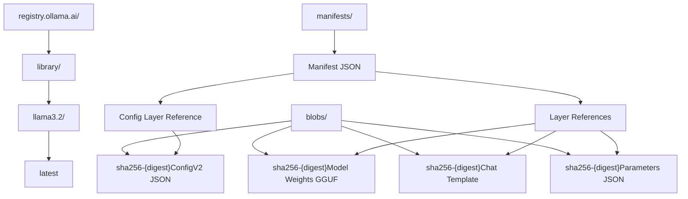

# 存储与 Blob 传输

相关源文件

-   [auth/auth.go](https://github.com/ollama/ollama/blob/562c76d7/auth/auth.go)
-   [cmd/cmd\_test.go](https://github.com/ollama/ollama/blob/562c76d7/cmd/cmd_test.go)
-   [server/auth.go](https://github.com/ollama/ollama/blob/562c76d7/server/auth.go)
-   [server/auth\_test.go](https://github.com/ollama/ollama/blob/562c76d7/server/auth_test.go)
-   [server/create.go](https://github.com/ollama/ollama/blob/562c76d7/server/create.go)
-   [server/download.go](https://github.com/ollama/ollama/blob/562c76d7/server/download.go)
-   [server/model.go](https://github.com/ollama/ollama/blob/562c76d7/server/model.go)
-   [server/routes\_create\_test.go](https://github.com/ollama/ollama/blob/562c76d7/server/routes_create_test.go)
-   [server/routes\_delete\_test.go](https://github.com/ollama/ollama/blob/562c76d7/server/routes_delete_test.go)
-   [server/routes\_list\_test.go](https://github.com/ollama/ollama/blob/562c76d7/server/routes_list_test.go)
-   [server/routes\_test.go](https://github.com/ollama/ollama/blob/562c76d7/server/routes_test.go)
-   [server/sparse\_common.go](https://github.com/ollama/ollama/blob/562c76d7/server/sparse_common.go)
-   [server/sparse\_windows.go](https://github.com/ollama/ollama/blob/562c76d7/server/sparse_windows.go)
-   [server/upload.go](https://github.com/ollama/ollama/blob/562c76d7/server/upload.go)
-   [types/errtypes/errtypes.go](https://github.com/ollama/ollama/blob/562c76d7/types/errtypes/errtypes.go)

本文档描述 Ollama 的存储系统与 blob 传输机制，涵盖内容寻址的 blob 存储架构、并发下载/上传协议、registry 认证，以及基于 manifest 的模型组织方式。

有关模型执行与加载的信息，请参见 [模型执行流水线](/ollama/ollama/2.3-model-execution-pipeline)。有关模型文件格式与结构细节，请参见 [模型文件格式](/ollama/ollama/4.4-model-file-formats)。

## 存储架构

Ollama 使用内容寻址存储系统，模型组件以不可变 blob 形式存储，并通过 SHA256 摘要标识。存储被组织为两个主目录：

| 目录 | 用途 | 内容 |
| --- | --- | --- |
| `manifests/` | 模型元数据 | 描述模型组成的 JSON manifest |
| `blobs/` | 二进制内容 | 模型权重、模板、参数与配置 |

每个模型由存储在 `manifests/{registry}/{namespace}/{model}/{tag}`（例如 `manifests/registry.ollama.ai/library/llama3.2/latest`）的 **manifest** 定义。manifest 会引用一个或多个存储于 `blobs/sha256-{digest}` 的 **blob**。

**Manifest 结构**

一个 manifest 包含：

-   **Config 层**：描述模型架构、格式与能力的 JSON
-   **Layer 列表**：指向 blob 的引用（模型权重、projector、adapter、模板、系统消息、参数、许可证）

每个层包含：

-   `Digest`：标识 blob 的 SHA256 哈希
-   `MediaType`：内容类型（例如 `application/vnd.ollama.image.model`、`application/vnd.ollama.image.template`）
-   `Size`：blob 字节大小

来源： [server/model.go23-77](https://github.com/ollama/ollama/blob/562c76d7/server/model.go#L23-L77) [server/create.go798-814](https://github.com/ollama/ollama/blob/562c76d7/server/create.go#L798-L814)

### 存储组织图


来源： [server/model.go28-77](https://github.com/ollama/ollama/blob/562c76d7/server/model.go#L28-L77) [server/create.go548-565](https://github.com/ollama/ollama/blob/562c76d7/server/create.go#L548-L565)

## Blob 下载系统

Blob 下载系统实现了并发、可恢复下载以及自动重试逻辑。下载会拆分为多个分片并行传输。

### 下载配置

```
const (    numDownloadParts          = 16    minDownloadPartSize int64 = 100 * format.MegaByte  // 100 MB    maxDownloadPartSize int64 = 1000 * format.MegaByte // 1000 MB)
```
**分片大小计算**：对于大小为 `Total` 的 blob，分片大小为 `Total / numDownloadParts`，并约束在 `minDownloadPartSize` 与 `maxDownloadPartSize` 之间。

来源： [server/download.go99-103](https://github.com/ollama/ollama/blob/562c76d7/server/download.go#L99-L103)

### 下载数据结构

`blobDownload` 结构体管理下载生命周期：

```
type blobDownload struct {    Name      string                    // Destination file path    Digest    string                    // SHA256 blob identifier    Total     int64                     // Total blob size    Completed atomic.Int64              // Bytes downloaded    Parts     []*blobDownloadPart       // Download parts    CancelFunc                          // Context cancellation    done      chan struct{}             // Completion signal    err       error                     // Download error    references atomic.Int32             // Reference count}
```
每个 `blobDownloadPart` 表示一个字节区间：

```
type blobDownloadPart struct {    N            int              // Part number    Offset       int64            // Start byte offset    Size         int64            // Part size in bytes    Completed    atomic.Int64     // Bytes completed for this part    lastUpdated  time.Time        // Stall detection timestamp    *blobDownload                 // Parent reference}
```
来源： [server/download.go41-67](https://github.com/ollama/ollama/blob/562c76d7/server/download.go#L41-L67)

### 并发下载流程

> **[Mermaid sequence]**
> *(图表结构无法解析)*

来源： [server/download.go468-509](https://github.com/ollama/ollama/blob/562c76d7/server/download.go#L468-L509) [server/download.go185-329](https://github.com/ollama/ollama/blob/562c76d7/server/download.go#L185-L329)

### 下载过程细节

**步骤 1：准备**（[server/download.go128-183](https://github.com/ollama/ollama/blob/562c76d7/server/download.go#L128-L183)）

`Prepare` 方法会：

1.  扫描匹配 `{name}-partial-*` 的已有分片文件
2.  从 JSON 文件读取分片元数据以恢复中断下载
3.  若不存在分片文件，则发起 HEAD 请求确定总大小
4.  根据总大小计算分片偏移与分片大小
5.  为每个分片创建元数据文件

**步骤 2：并发下载**（[server/download.go216-329](https://github.com/ollama/ollama/blob/562c76d7/server/download.go#L216-L329)）

`run` 方法会：

1.  打开稀疏文件 `{name}-partial` 并截断到总大小
2.  获取直连下载 URL（必要时跟随一次重定向）
3.  使用 `errgroup.WithContext` 启动最多 16 个 goroutine
4.  每个 goroutine 通过 `downloadChunk` 下载其分片
5.  使用 `io.NewOffsetWriter` 按正确偏移写入文件
6.  实现指数退避重试（每分片最多 6 次）
7.  完成后将分片文件重命名为最终文件名

**步骤 3：卡顿检测**（[server/download.go361-387](https://github.com/ollama/ollama/blob/562c76d7/server/download.go#L361-L387)）

每个分片会运行 watchdog goroutine：

-   每秒检查一次是否有进度
-   若 30 秒无进度，返回 `errPartStalled`
-   卡顿分片会重试，且不计入重试上限

**HTTP Range 请求**（[server/download.go331-390](https://github.com/ollama/ollama/blob/562c76d7/server/download.go#L331-L390)）

分片请求指定字节区间：

```
Range: bytes={StartsAt}-{StopsAt-1}
```
其中：

-   `StartsAt = Offset + Completed`（断点续传位置）
-   `StopsAt = Offset + Size`（分片结束位置）

来源： [server/download.go128-390](https://github.com/ollama/ollama/blob/562c76d7/server/download.go#L128-L390)

### 下载去重

`blobDownloadManager` 是一个以 digest 为键的 `sync.Map`。多个并发请求若下载同一 blob，会共享单个下载实例。引用计数确保在所有请求方完成前下载持续进行。

```
var blobDownloadManager sync.Map // In downloadBlob:data, ok := blobDownloadManager.LoadOrStore(opts.digest, &blobDownload{...})download := data.(*blobDownload)if !ok {    // First requester: start download in background    go download.Run(context.Background(), requestURL, opts.regOpts)}return download.Wait(ctx, opts.fn)
```
来源： [server/download.go39](https://github.com/ollama/ollama/blob/562c76d7/server/download.go#L39-L39) [server/download.go494-508](https://github.com/ollama/ollama/blob/562c76d7/server/download.go#L494-L508)

## Blob 上传系统

上传系统与下载架构对称，支持并发多分片上传与跨仓库 blob 挂载。

### 上传配置

```
const (    numUploadParts          = 16    minUploadPartSize int64 = 100 * format.MegaByte    maxUploadPartSize int64 = 1000 * format.MegaByte)
```
来源： [server/upload.go49-53](https://github.com/ollama/ollama/blob/562c76d7/server/upload.go#L49-L53)

### 上传数据结构

```
type blobUpload struct {    manifest.Layer                  // Embedded layer (Digest, MediaType, Size, From)    Total          int64            // Total blob size    Completed      atomic.Int64     // Bytes uploaded    Parts          []blobUploadPart // Upload parts    nextURL        chan *url.URL    // Serial upload coordination    CancelFunc                      // Context cancellation    file           *os.File         // Source file    done           bool             // Upload complete    err            error            // Upload error    references     atomic.Int32     // Reference count} type blobUploadPart struct {    N      int        // Part number    Offset int64      // Start byte offset    Size   int64      // Part size    Hash   hash.Hash  // MD5 checksum}
```
来源： [server/upload.go30-50](https://github.com/ollama/ollama/blob/562c76d7/server/upload.go#L30-L50) [server/upload.go344-350](https://github.com/ollama/ollama/blob/562c76d7/server/upload.go#L344-L350)

### 带 Registry 协议的上传流程

> **[Mermaid sequence]**
> *(图表结构无法解析)*

来源： [server/upload.go369-405](https://github.com/ollama/ollama/blob/562c76d7/server/upload.go#L369-L405) [server/upload.go55-216](https://github.com/ollama/ollama/blob/562c76d7/server/upload.go#L55-L216)

### 上传过程细节

**步骤 1：检查存在性**（[server/upload.go373-388](https://github.com/ollama/ollama/blob/562c76d7/server/upload.go#L373-L388)）

上传前，`uploadBlob` 会向 `/v2/{namespace}/{model}/blobs/{digest}` 发起 HEAD 请求。若 blob 已存在（200 OK），则跳过上传。

**步骤 2：初始化上传**（[server/upload.go55-125](https://github.com/ollama/ollama/blob/562c76d7/server/upload.go#L55-L125)）

`Prepare` 方法会：

1.  构造到 `/v2/{namespace}/{model}/blobs/uploads/` 的 POST 请求
2.  若设置了 `layer.From`，添加查询参数 `?mount={digest}&from={source}` 尝试跨仓库 blob 挂载
3.  若挂载成功（HTTP 201），标记上传完成
4.  否则接收上传 Location URL 并计算分片大小
5.  使用初始上传位置初始化 `nextURL` 通道

**步骤 3：并行/串行上传**（[server/upload.go129-216](https://github.com/ollama/ollama/blob/562c76d7/server/upload.go#L129-L216)）

`Run` 方法上传分片：

1.  从本地存储打开源 blob 文件
2.  使用 `errgroup` 并将并发限制设为 `numUploadParts`
3.  每个分片 goroutine 都在通道上等待 `nextURL`
4.  通过 `uploadPart` 上传分片，并带重试逻辑（最多 6 次）
5.  将新的 Location URL 发回 `nextURL` 通道供下个分片使用
6.  全部分片完成后，计算复合 MD5：`{md5(part1+part2+...+partN)}-{partCount}`
7.  通过带 `digest` 与 `etag` 查询参数的 PUT 请求提交上传

**步骤 4：带重定向处理的分片上传**（[server/upload.go218-307](https://github.com/ollama/ollama/blob/562c76d7/server/upload.go#L218-L307)）

`uploadPart` 方法会：

1.  设置 `X-Redirect-Uploads: 1` 头以启用重定向优化
2.  设置 `Content-Range: {offset}-{offset+size-1}` 头
3.  使用 `io.NewSectionReader` 在正确偏移读取分片数据
4.  通过 `io.MultiWriter` 一边上传一边计算 MD5
5.  若 registry 返回 307 重定向：
    -   回滚进度统计
    -   重试上传至重定向 URL（直传云存储）
    -   将下一个 Location 发送到 `nextURL` 通道
6.  若 registry 返回 202 Accepted：
    -   按串行流程继续上传
    -   将下一个 Location 发送到 `nextURL` 通道

来源： [server/upload.go55-307](https://github.com/ollama/ollama/blob/562c76d7/server/upload.go#L55-L307)

### 上传去重

与下载类似，`blobUploadManager`（`sync.Map`）用于并发上传去重：

```
var blobUploadManager sync.Map data, ok := blobUploadManager.LoadOrStore(layer.Digest, &blobUpload{Layer: layer})upload := data.(*blobUpload)if !ok {    // First requester: start upload    go upload.Run(context.Background(), opts)}return upload.Wait(ctx, fn)
```
来源： [server/upload.go28](https://github.com/ollama/ollama/blob/562c76d7/server/upload.go#L28-L28) [server/upload.go390-404](https://github.com/ollama/ollama/blob/562c76d7/server/upload.go#L390-L404)

## Registry 认证

Ollama 在 registry 操作中使用带加密签名的 token 认证。

### 认证流程

> **[Mermaid sequence]**
> *(图表结构无法解析)*

来源： [server/auth.go53-100](https://github.com/ollama/ollama/blob/562c76d7/server/auth.go#L53-L100) [auth/auth.go53-85](https://github.com/ollama/ollama/blob/562c76d7/auth/auth.go#L53-L85)

### 认证组件

**`registryChallenge` 结构体**（[server/auth.go22-51](https://github.com/ollama/ollama/blob/562c76d7/server/auth.go#L22-L51)）

```
type registryChallenge struct {    Realm   string  // Auth server URL    Service string  // Service identifier    Scope   string  // Access scope (e.g., "repository:library/model:pull")}
```
`URL()` 方法会构造认证端点：

-   将 `service` 与 `scope` 添加为查询参数
-   包含时间戳 `ts` 以防重放
-   生成随机 `nonce` 以保证唯一性

**Token 获取**（[server/auth.go53-100](https://github.com/ollama/ollama/blob/562c76d7/server/auth.go#L53-L100)）

`getAuthorizationToken` 函数会：

1.  **校验来源**：确保 `challenge.Realm` 主机与 `originalHost` 一致，防止跨域 token 泄漏
2.  **构建请求**：使用 service、scope、timestamp、nonce 构造认证 URL
3.  **签名请求**：使用 SSH 私钥对请求数据签名
    -   数据格式：`{method},{url},{base64(hex(sha256(empty)))}`
    -   签名格式：`{publicKey}:{base64(signatureBlob)}`
4.  **请求 token**：向认证服务发起 GET 请求，并携带 `Authorization: {signature}` 头
5.  **返回 token**：解析包含 `token` 字段的 JSON 响应

**私钥管理**（[auth/auth.go53-85](https://github.com/ollama/ollama/blob/562c76d7/auth/auth.go#L53-L85)）

`Sign` 函数会：

-   从 `~/.ollama/id_ed25519` 读取私钥
-   解析为 SSH 私钥（Ed25519）
-   使用私钥对输入数据签名
-   返回格式为 `{publicKey}:{signature}` 的签名

来源： [server/auth.go22-100](https://github.com/ollama/ollama/blob/562c76d7/server/auth.go#L22-L100) [auth/auth.go44-85](https://github.com/ollama/ollama/blob/562c76d7/auth/auth.go#L44-L85)

### Challenge 解析

`parseRegistryChallenge` 函数（在 [server/upload.go283](https://github.com/ollama/ollama/blob/562c76d7/server/upload.go#L283-L283) 中被引用，但提供的文件中未展示实现）会从 `WWW-Authenticate` 头提取认证参数：

期望格式：

```
Bearer realm="https://auth.example.com/token",service="registry",scope="repo:foo:pull"
```
## 错误处理与重试逻辑

### 重试策略

下载与上传均实现指数退避，且每个分片最多重试 6 次：

```
const maxRetries = 6 for try := 0; try < maxRetries; try++ {    err = operation()    if err == nil {        return nil    }        sleep := time.Second * time.Duration(math.Pow(2, float64(try)))    time.Sleep(sleep)}return fmt.Errorf("%w: %w", errMaxRetriesExceeded, err)
```
**重试延迟**：1s、2s、4s、8s、16s、32s

来源： [server/download.go31-37](https://github.com/ollama/ollama/blob/562c76d7/server/download.go#L31-L37) [server/download.go283-306](https://github.com/ollama/ollama/blob/562c76d7/server/download.go#L283-L306) [server/upload.go155-172](https://github.com/ollama/ollama/blob/562c76d7/server/upload.go#L155-L172)

### 下载错误处理

特殊错误场景（[server/download.go288-302](https://github.com/ollama/ollama/blob/562c76d7/server/download.go#L288-L302)）：

| 错误类型 | 处理方式 |
| --- | --- |
| `context.Canceled` | 立即返回（用户取消） |
| `syscall.ENOSPC` | 立即返回（磁盘空间不足） |
| `errPartStalled` | 不增加重试计数，立即重试 |
| 其他错误 | 记录日志，指数退避后重试 |

### 上传错误处理

上传特有处理（[server/upload.go156-172](https://github.com/ollama/ollama/blob/562c76d7/server/upload.go#L156-L172)）：

| 错误类型 | 处理方式 |
| --- | --- |
| `context.Canceled` | 立即返回 |
| `errMaxRetriesExceeded` | 立即返回 |
| 其他错误 | 指数退避重试 |

**进度回滚**：当分片上传失败或发生重定向时，`progressWriter.Rollback()` 会从 `Completed` 计数器中减去已写入字节，以保持进度报告准确。

来源： [server/upload.go352-367](https://github.com/ollama/ollama/blob/562c76d7/server/upload.go#L352-L367)

### 卡顿检测（仅下载）

每个下载分片都会通过 watchdog goroutine 监控进度（[server/download.go361-387](https://github.com/ollama/ollama/blob/562c76d7/server/download.go#L361-L387)）：

1.  每 1 秒检查一次
2.  若 30 秒未写入任何字节，返回 `errPartStalled`
3.  记录警告并建议使用 Ctrl+C 后重试
4.  重置 `lastUpdated` 时间戳并重试
5.  不计入重试上限（允许无限次卡顿重试）

这可防止下载在慢速或不稳定连接上无限期挂起。

来源： [server/download.go361-387](https://github.com/ollama/ollama/blob/562c76d7/server/download.go#L361-L387)

## 稀疏文件优化

为高效处理下载中的大模型文件，Ollama 在受支持文件系统上使用稀疏文件分配。

**Windows 实现**（[server/sparse\_windows.go9-17](https://github.com/ollama/ollama/blob/562c76d7/server/sparse_windows.go#L9-L17)）：

使用带 `FSCTL_SET_SPARSE` 标志的 `DeviceIoControl`。错误会被忽略，因为并非所有文件系统（如 exFAT）都支持稀疏文件。

**Unix 实现**（[server/sparse\_common.go7-8](https://github.com/ollama/ollama/blob/562c76d7/server/sparse_common.go#L7-L8)）：

在 Unix 系统上为空操作；当 seek 超过文件大小时会自动创建稀疏文件。

**使用方式**（[server/download.go220-227](https://github.com/ollama/ollama/blob/562c76d7/server/download.go#L220-L227)）：

```
file, err := os.OpenFile(b.Name+"-partial", os.O_CREATE|os.O_RDWR, 0o644)setSparse(file)file.Truncate(b.Total)
```
这使下载系统能够在不为未写入区域分配磁盘空间的情况下，创建目标总大小的文件。

来源： [server/sparse\_windows.go9-17](https://github.com/ollama/ollama/blob/562c76d7/server/sparse_windows.go#L9-L17) [server/sparse\_common.go7-8](https://github.com/ollama/ollama/blob/562c76d7/server/sparse_common.go#L7-L8) [server/download.go220-227](https://github.com/ollama/ollama/blob/562c76d7/server/download.go#L220-L227)

## 进度跟踪

下载与上传都使用原子操作进行线程安全的进度统计：

```
type blobDownload struct {    Total     int64    Completed atomic.Int64  // Updated by multiple part goroutines    // ...} // In part writer:func (p *blobDownloadPart) Write(b []byte) (n int, err error) {    n = len(b)    p.blobDownload.Completed.Add(int64(n))    return n, nil}
```
**进度报告**（[server/download.go438-458](https://github.com/ollama/ollama/blob/562c76d7/server/download.go#L438-L458) [server/upload.go319-342](https://github.com/ollama/ollama/blob/562c76d7/server/upload.go#L319-L342)）：

`Wait` 方法提供实时进度更新：

1.  获取引用，避免过早取消
2.  每 60 毫秒发送一次 `api.ProgressResponse`
3.  报告状态、digest、总字节数与已完成字节数
4.  阻塞直到 `done` 通道关闭或 context 取消
5.  成功返回 `nil`，失败返回最终错误

来源： [server/download.go119-126](https://github.com/ollama/ollama/blob/562c76d7/server/download.go#L119-L126) [server/download.go438-458](https://github.com/ollama/ollama/blob/562c76d7/server/download.go#L438-L458) [server/upload.go357-362](https://github.com/ollama/ollama/blob/562c76d7/server/upload.go#L357-L362) [server/upload.go319-342](https://github.com/ollama/ollama/blob/562c76d7/server/upload.go#L319-L342)

## 文件管理

### Blob 路径解析

`manifest.BlobsPath` 函数（在文档中多处引用，但未展示实现）会将 digest 转换为文件路径：

```
digest: "sha256:abc123..."
path:   "{OLLAMA_MODELS}/blobs/sha256-abc123..."
```
### 部分文件管理

**下载分片文件**（[server/download.go129-145](https://github.com/ollama/ollama/blob/562c76d7/server/download.go#L129-L145)）：

-   主分片文件：`{name}-partial`（稀疏文件）
-   分片元数据：`{name}-partial-{N}`（JSON 文件）

每个元数据文件包含：

```
{  "N": 0,  "Offset": 0,  "Size": 104857600,  "Completed": 52428800}
```
这使系统能够在崩溃或网络中断后恢复下载。

**清理**（[server/download.go318-326](https://github.com/ollama/ollama/blob/562c76d7/server/download.go#L318-L326)）：

下载成功后：

1.  删除所有分片元数据文件（`{name}-partial-{N}`）
2.  将 `{name}-partial` 重命名为最终文件 `{name}`

来源： [server/download.go129-145](https://github.com/ollama/ollama/blob/562c76d7/server/download.go#L129-L145) [server/download.go318-326](https://github.com/ollama/ollama/blob/562c76d7/server/download.go#L318-L326) [server/download.go402-426](https://github.com/ollama/ollama/blob/562c76d7/server/download.go#L402-L426)

### 符号链接与复制

`createLink` 函数（[server/create.go816-829](https://github.com/ollama/ollama/blob/562c76d7/server/create.go#L816-L829)）会尝试创建符号链接，以避免复制大型文件：

1.  创建父目录
2.  尝试 `os.Symlink(src, dst)`
3.  若创建符号链接失败，回退到 `copyFile`（完整复制）

该逻辑用于导入 GGUF 文件或从本地文件创建模型。

来源： [server/create.go816-846](https://github.com/ollama/ollama/blob/562c76d7/server/create.go#L816-L846)
